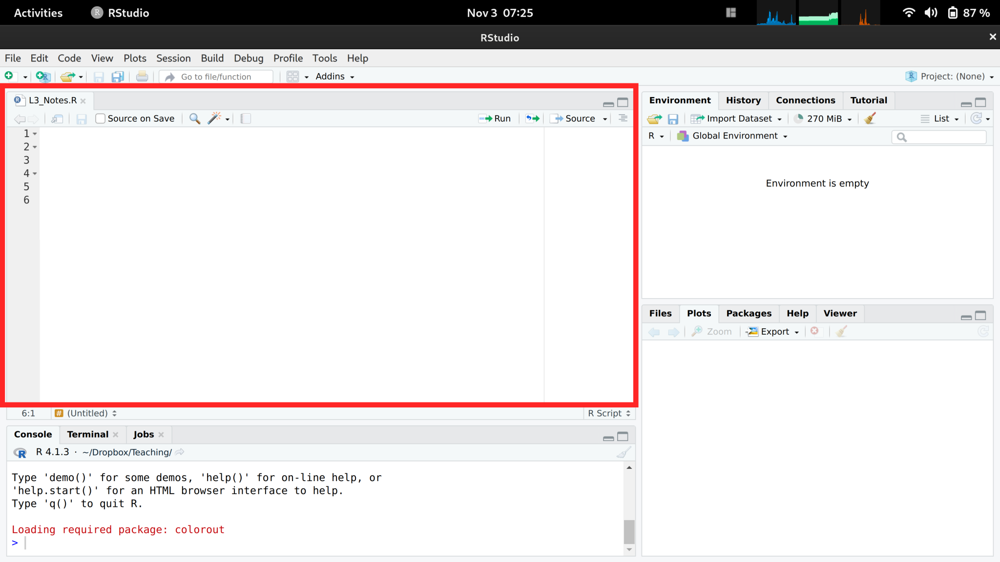

# (PART) Data Analysis in R {-}

```{r, echo=F}
knitr::opts_chunk$set(echo=T, message=F, warning=F)
```

# First Steps
***

## Why R

We focus on R because it is good for complex stats, concise figures, and coherent organization. It is built and developed by applied statisticians for statistics, and used by many in academia and industry. For students, think about labor demand and what may be good for getting a job. Do some of your own research to best understand how much to invest.

## Install R

First Install [R](https://cloud.r-project.org/).
Then Install [Rstudio](https://www.rstudio.com/products/rstudio/download/).

For help setting up, see any of the following links

* https://learnr-examples.shinyapps.io/ex-setup-r/
* https://rstudio-education.github.io/hopr/starting.html
* https://a-little-book-of-r-for-bioinformatics.readthedocs.io/en/latest/src/installr.html
* https://cran.r-project.org/doc/manuals/R-admin.html
* https://courses.edx.org/courses/UTAustinX/UT.7.01x/3T2014/56c5437b88fa43cf828bff5371c6a924/
* https://owi.usgs.gov/R/training-curriculum/installr/
* https://www.earthdatascience.org/courses/earth-analytics/document-your-science/setup-r-rstudio/

*Make sure you have the latest version of R and Rstudio for class.* If not, then reinstall. 

## Interfacing with R

Rstudio is easiest to get going with. (There are other GUI's.) There are 4 panes. The top left is where you write and save code

 * Create and save a new `R Script` file *My_First_Script.R*
 * could also use a plain .txt file.

```{r, echo=F}

```

The pane below is where your code is executed. For all following examples, make sure to both execute and store your code.

Note that the coded examples generally have objects, functions, and comments.

## Introductions to R

There are many good and free programming materials online.

The most common tasks can be found https://github.com/rstudio/cheatsheets/blob/main/rstudio-ide.pdf

Some of my programming examples originally come from https://r4ds.had.co.nz/ and I recommend https://intro2r.com. I have also used online material from many places over the years, including

* https://cran.r-project.org/doc/manuals/R-intro.html
* R Graphics Cookbook, 2nd edition. Winston Chang. 2021. https://r-graphics.org/
* R for Data Science. H. Wickham and G. Grolemund. 2017. https://r4ds.had.co.nz/index.html
* An Introduction to R. W. N. Venables, D. M. Smith, R Core Team. 2017. https://colinfay.me/intro-to-r/
* Introduction to R for Econometrics. Kieran Marray. https://bookdown.org/kieranmarray/intro_to_r_for_econometrics/
* Wollschläger, D. (2020). Grundlagen der Datenanalyse mit R: eine anwendungsorientierte Einführung. http://www.dwoll.de/rexrepos/
* Spatial Data Science with R: Introduction to R. Robert J. Hijmans. 2021. https://rspatial.org/intr/index.html


What we cover in this primer should be enough to get you going. But there are also many good yet free-online tutorials and courses. 

* https://www.econometrics-with-r.org/1.2-a-very-short-introduction-to-r-and-rstudio.html
* https://rafalab.github.io/dsbook/
* https://moderndive.com/foreword.html
* https://rstudio.cloud/learn/primers/1.2
* https://cran.r-project.org/manuals.html
* https://stats.idre.ucla.edu/stat/data/intro_r/intro_r_interactive_flat.html
* https://cswr.nrhstat.org/app-r


# Mathematics
***

Scalars and vectors are probably your most common mathematical objects

## Scalars

```{r}
xs <- 2 # Your first scalar
xs  # Print the scalar

(xs+1)^2 # Perform and print a simple calculation
xs + NA # often used for missing values
xs*2
```

## Vectors
 
```{r}
x <- c(0,1,3,10,6) # Your First Vector
x # Print the vector
x[2] # Print the 2nd Element; 1
x+2 # Print simple calculation; 2,3,5,8,12
x*2
x^2
```

Mathematical operations apply elementwise
```{r}
x+x
x*x
x^x
```

```{r}
c(1) # scalars are vectors

1:7
seq(0,1,by=.1)
```


##  Functions

Functions are applied to objects
```{r}
# Define a function that adds two to any vector
add_2 <- function(input_vector) {
    output_vector <- input_vector + 2 # new object defined locally 
    return(output_vector) # return new object 
}
# Apply that function to a vector
x <- c(0,1,3,10,6)
add_2(x)

# notice 'output_vector' is not available here
```

There are many many generalizations
```{r}
add_vec <- function(input_vector1, input_vector2) {
    output_vector <- input_vector1 + input_vector2
    return(output_vector)
}
add_vec(x,3)
add_vec(x,x)

sum_squared <- function(x1, x2) {
    y <- (x1 + x2)^2
    return(y)
}

sum_squared(1, 3)
sum_squared(x, 2)
sum_squared(x, NA) 
sum_squared(x, x)
sum_squared(x, 2*x)
```

Applying the same function over and over again
```{r}
sapply(1:3, exp)
c( exp(1), exp(2), exp(3))

# More complex example
sapply(1:10, function(i){
    x <- i^(i-1)
    y <- x + mean( 0:i )
    z <- log(y)/i
    return(z)
})

# mapply takes multiple vectors
# mapply(sum, 1:3, exp(1:3) )
```


Functions can take functions as arguments
```{r}
fun_of_seq <- function(f){
    x <- seq(1,3, length.out=12)
    y <- f(x)
    return(y)
}

fun_of_seq(mean)

fun_of_seq(sd)
```


<!---
recursive functions
```{r}
# For Loop
x <- rep(1, 3)
for(i in 2:length(x) ){
    x[i] <- (x[i-1]+1)^2
}
x

# for loop in a function
r_fun <- function(n){
    x <- rep(1,n)
    for(i in 2:length(x) ){
        x[i] <- (x[i-1]+1)^2
    }
    return(x)
}
r_fun(5)
```
--->


## Logic 

**Basic**.

```{r}
x <- c(1,2,3,NA)
x > 2
x==2

any(x==2)
all(x==2)
2 %in% x

is.numeric(x)
is.na(x)
```

The "&" and "|" commands are logical operations that compare vectors to the left and right.
```{r}
x <- 1:3
is.numeric(x) & (x < 2)
is.numeric(x) | (x < 2)

if(length(x) >= 5 & x[5] > 12) print("ok")
```

see https://bookdown.org/rwnahhas/IntroToR/logical.html


**Advanced**.

```{r}
x <- 1:10
cut(x, 4)
split(x, cut(x, 4))
```

```{r}
xs <- split(x, cut(x, 4))
sapply(xs, mean)

# shortcut
aggregate(x, list(cut(x,4)), mean)
```


##  Matrices

Matrices are objects
```{r}
x1 <- c(1,4,9)
x2 <- c(3,0,2)
x_mat <- rbind(x1, x2)

x_mat       # Print full matrix
x_mat[2,]   # Print Second Row
x_mat[,2]   # Print Second Column
x_mat[2,2]  # Print Element in Second Column and Second Row
```

There are elementwise operations
```
x_mat+2
x_mat*2
x_mat^2

x_mat + x_mat
x_mat*x_mat
x_mat^x_mat
```

**Functions**. 

You can apply functions to matrices
```{r}
sum_squared(x_mat, x_mat)

# Apply function to each matrix row
y <- apply(x_mat, 1, sum)^2 
# ?apply  #checks the function details
y - sum_squared(x, x) # tests if there are any differences
```

There are many possible functions you can apply
```{r}
# Return Y-value with minimum absolute difference from 3
abs_diff_y <- abs( y - 3 ) 
abs_diff_y # is this the luckiest number?

#min(abs_diff_y)
#which.min(abs_diff_y)
y[ which.min(abs_diff_y) ]
```

There are also some useful built in functions
```{r}
m <- matrix(c(1:3,2*(1:3)),byrow=TRUE,ncol=3)
m

# normalize rows
m/rowSums(m)

# normalize columns
t(t(m)/colSums(m))

# de-mean rows
sweep(m,1,rowMeans(m), '-')

# de-mean columns
sweep(m,2,colMeans(m), '-')
```


**Matrix Algebra**.

And you can also use matrix algebra
```{r}
x_mat1 <- matrix(2:7,2,3)
x_mat1

x_mat2 <- matrix(4:-1,2,3)
x_mat2

tcrossprod(x_mat1, x_mat2) #x_mat1 %*% t(x_mat2)

crossprod(x_mat1, x_mat2)
# x_mat1 * x_mat2
```


## Arrays

Generalization of matrices (often used in spatial econometrics)

```{r}
a <- array(data = 1:24, dim = c(2, 3, 4))
a

a[1, , , drop = FALSE]  # Row 1
#a[, 1, , drop = FALSE]  # Column 1
#a[, , 1, drop = FALSE]  # Layer 1

a[ 1, 1,  ]  # Row 1, column 1
#a[ 1,  , 1]  # Row 1, "layer" 1
#a[  , 1, 1]  # Column 1, "layer" 1
a[1 , 1, 1]  # Row 1, column 1, "layer" 1
```

Apply extends to arrays
```{r}
apply(a, 1, mean)    # Row means
apply(a, 2, mean)    # Column means
apply(a, 3, mean)    # "Layer" means
apply(a, 1:2, mean)  # Row/Column combination 
```


Outer products yield arrays
```{r}
x <- c(1,2,3)
x_mat1 <- outer(x, x) # x %o% x
x_mat1
is.array(x_mat) # Matrices are arrays


x_mat2 <- matrix(6:1,2,3)
outer(x_mat2, x)
# outer(x_mat2, matrix(x))
# outer(x_mat2, t(x))
# outer(x_mat1, x_mat2)
```

# Data
***

## Types

The two basic types of data are *cardinal* and *factor* data. We can further distinguish between whether cardinal data are discrete or continuous. We can also further distinguish between whether factor data are ordered or not

* *cardinal*: the difference between elements always mean the same thing. 
    * discrete: E.g., 2-1=3-2.
    * continuous: E.g., 2.11-1.4444=3.11-2.4444
* *factor*: the difference between elements does not always mean the same thing.
    * ordered: E.g., First place - Second place ?? Second place - Third place.
    * unordered (categorical): E.g., A - B ????


```{r}
d1d <- 1:3 # Cardinal data (Discrete)
d1d
class(d1d)

d1c <- c(1.1, 2/3, 3) # Cardinal data (Continuous)
d1c
class(d1c)

d2o <- factor(c('A','B','C'), ordered=T) # Factor data (Ordinal)
d2o
class(d2o)

d2c <- factor(c('Leipzig','Los Angeles','Logan'), ordered=F) # Factor data (Categorical)
d2c
class(d2c)
```


R also allows for more unstructured data types.
```{r}
c('hello world', 'hi mom')  # character strings

list(d1c, d2c)  # lists
list(d1c, c('hello world'),
    list(d1d, list('...inception...'))) # lists

# data.frames: your most common data type
    # matrix of different data-types
    # well-ordered lists
d0 <- data.frame(y=d1c, x=d2c)
d0
```


**Strings**.

```{r}
paste( 'hi', 'mom')
paste( c('hi', 'mom'), collapse='--')

kingText <- "The king infringes the law on playing curling."
gsub(pattern="ing", replacement="", kingText)
# advanced usage
#gsub("[aeiouy]", "_", kingText)
#gsub("([[:alpha:]]{3,})ing\\b", "\\1", kingText) 
```

See 

* https://meek-parfait-60672c.netlify.app/docs/M1_R-intro_03_text.html
* https://raw.githubusercontent.com/rstudio/cheatsheets/main/regex.pdf


**Initial Inspection**.

You typically begin by inspecting your data by examining the first few observations.
 
Consider, for example, historical data on crime in the US.

```{r}
head(USArrests)

# Check NA values
sum(is.na(x))
```

To further examine a particular variable, we look at its distribution.

## Empirical Distributions

In what follows, we will denote the data for a single variable as $\{X_{i}\}_{i=1}^{N}$, where there are $N$ observations and $X_{i}$ is the value of the $i$th one.

**Histogram**. The histogram divides the range of $\{X_{i}\}_{i=1}^{N}$ into $L$ exclusive bins of equal-width $h=[\text{max}(X_{i}) - \text{min}(X_{i})]/L$, and counts the number of observations within each bin. We often scale the counts to interpret the numbers as a density. Mathematically, for an exclusive bin with midpoint $x$, we compute
\begin{eqnarray}
\widehat{f}_{HIST}(x) &=& \frac{  \sum_{i}^{N} \mathbf{1}\left( X_{i} \in \left[x-\frac{h}{2}, x+\frac{h}{2} \right) \right) }{N h}.
\end{eqnarray}
We compute $\widehat{f}_{HIST}(x)$ for each $x \in \left\{ \frac{\ell h}{2} + \text{min}(X) \right\}_{\ell=1}^{L}$.
```{r}
hist(USArrests$Murder, freq=F,
    border=NA, main='', xlab='Murder Arrests')
# Raw Observations
rug(USArrests$Murder, col=grey(0,.5))
```


Note that if you your data is discrete, you can directly plot the counts. E.g.,  
```
x <- floor(USArrests$Murder) #Discretized
plot(table(x), xlab='Murder Rate (Discrete)', ylab='Count')
```

**Empirical *Cumulative* Distribution Function**. The ECDF counts the proportion of observations whose values $X_{i}$ are less than $x$; 
\begin{eqnarray}
\widehat{F}_{ECDF}(x) = \frac{1}{N} \sum_{i}^{N} \mathbf{1}(X_{i} \leq x) 
\end{eqnarray}
for each unique value of $x$ in the dataset.

```{r}
F_murder <- ecdf(USArrests$Murder)
# proportion of murders < 10
F_murder(10)
# proportion of murders < x, for all x
plot(F_murder, main='', xlab='Murder Arrests',
    pch=16, col=grey(0,.5))
```


**Boxplots**. Boxplots summarize the distribution of data using *quantiles*: the $q$th quantile is the value where $q$ percent of the data are below and ($1-q$) percent are above.

* The "median" is the point where half of the data has lower values and the other half has higher values.
* The "lower quartile" is the point where 25% of the data has lower values and the other 75% has higher values.
* The "min" is the smallest value (or largest negative value if there are any) where 0% of the data has lower values.

```{r}
x <- USArrests$Murder

# quantiles
median(x)
range(x)
quantile(x, probs=c(0,.25,.5))

# deciles are quantiles
quantile(x, probs=seq(0,1, by=.1))
```

To compute quantiles, we sort the observations from smallest to largest as $X_{(1)}, X_{(2)},... X_{(N)}$, and then compute quantiles as $X_{ (q*N) }$. Note that $(q*N)$ is rounded and there are different ways to break ties.
```{r}
xo <- sort(x)
xo

# median
xo[length(xo)*.5]
quantile(x, probs=.5, type=4)

# min
xo[1]
min(xo)
quantile(xo,probs=0)
```

The boxplot shows the median (solid black line) and interquartile range ($IQR=$ upper quartile $-$ lower quartile; filled box),^[Technically, the upper and lower ``hinges'' use two different versions of the first and third quartile. See https://stackoverflow.com/questions/40634693/lower-and-upper-quartiles-in-boxplot-in-r] as well extreme values as outliers beyond the $1.5\times IQR$ (points beyond whiskers).

```{r}
boxplot(USArrests$Murder, main='', ylab='Murder Arrests')
# Raw Observations
stripchart(USArrests$Murder,
    pch='-', col=grey(0,.5), cex=2,
    vert=T, add=T)
```

## Joint Distributions

Scatterplots are used frequently to summarize the joint relationship between two variables. They can be enhanced in several ways. As a default, use semi-transparent points so as not to hide any points (and perhaps see if your observations are concentrated anywhere).

You can also add regression lines (and confidence intervals), although I will defer this until later.

```{r}
plot(Murder~UrbanPop, USArrests, pch=16, col=grey(0.,.5))

# Add the line of best fit for pooled data
#reg <- lm(Murder~UrbanPop, data=USArrests)
#abline(reg, lty=2)
```

**Marginal Distributions**. You can also show the distributions of each variable along each axis.

```{r}
# Setup Plot
layout( matrix(c(2,0,1,3), ncol=2, byrow=TRUE),
    widths=c(9/10,1/10), heights=c(1/10,9/10))

# Scatterplot
par(mar=c(4,4,1,1))
plot(Murder~UrbanPop, USArrests, pch=16, col=rgb(0,0,0,.5))

# Add Marginals
par(mar=c(0,4,1,1))
xhist <- hist(USArrests$UrbanPop, plot=FALSE)
barplot(xhist$counts, axes=FALSE, space=0, border=NA)

par(mar=c(4,0,1,1))
yhist <- hist(USArrests$Murder, plot=FALSE)
barplot(yhist$counts, axes=FALSE, space=0, horiz=TRUE, border=NA)
```


## Conditional Distributions

It is easy to show how distributions change according to a third variable using data splits. E.g., 

```{r}
# Tailored Histogram 
ylim <- c(0,8)
xbks <-  seq(min(USArrests$Murder)-1, max(USArrests$Murder)+1, by=1)

# Also show more information
# Split Data by Urban Population above/below mean
pop_mean <- mean(USArrests$UrbanPop)
murder_lowpop <- USArrests[USArrests$UrbanPop< pop_mean,'Murder']
murder_highpop <- USArrests[USArrests$UrbanPop>= pop_mean,'Murder']
cols <- c(low=rgb(0,0,1,.75), high=rgb(1,0,0,.75))

par(mfrow=c(1,2))
hist(murder_lowpop,
    breaks=xbks, col=cols[1],
    main='Urban Pop >= Mean', font.main=1,
    xlab='Murder Arrests',
    border=NA, ylim=ylim)

hist(murder_highpop,
    breaks=xbks, col=cols[2],
    main='Urban Pop < Mean', font.main=1,
    xlab='Murder Arrests',
    border=NA, ylim=ylim)
```

It is sometimes it is preferable to show the ECDF instead. And you can glue various combinations together to convey more information all at once

```{r}
par(mfrow=c(1,2))
# Full Sample Density
hist(USArrests$Murder, 
    main='Density Function Estimate', font.main=1,
    xlab='Murder Arrests',
    breaks=xbks, freq=F, border=NA)

# Split Sample Distribution Comparison
F_lowpop <- ecdf(murder_lowpop)
plot(F_lowpop, col=cols[1],
    pch=16, xlab='Murder Arrests',
    main='Distribution Function Estimates',
    font.main=1, bty='n')
F_highpop <- ecdf(murder_highpop)
plot(F_highpop, add=T, col=cols[2], pch=16)

legend('bottomright', col=cols,
    pch=16, bty='n', inset=c(0,.1),
    title='% Urban Pop.',
    legend=c('Low (<= Mean)','High (>= Mean)'))
```


You can also split data into grouped boxplots in the same way
```{r}
layout( t(c(1,2,2)))
boxplot(USArrests$Murder, main='',
    xlab='All Data', ylab='Murder Arrests')

# K Groups with even spacing
K <- 3
USArrests$UrbanPop_Kcut <- cut(USArrests$UrbanPop,K)
Kcols <- hcl.colors(K,alpha=.5)
boxplot(Murder~UrbanPop_Kcut, USArrests,
    main='', col=Kcols,
    xlab='Urban Population', ylab='')

# 4 Groups with equal numbers of observations
#Qcuts <- c(
#    '0%'=min(USArrests$UrbanPop)-10*.Machine$double.eps,
#    quantile(USArrests$UrbanPop, probs=c(.25,.5,.75,1)))
#USArrests$UrbanPop_cut <- cut(USArrests$UrbanPop, Qcuts)
#boxplot(Murder~UrbanPop_cut, USArrests, col=hcl.colors(4,alpha=.5))
```


**Conditional Relationships**. You can also use size, color, and shape to further distinguish different conditional relationships.

```{r}
# High Assault Areas
assault_high <- USArrests$Assault > median(USArrests$Assault)
cols <- ifelse(assault_high, rgb(1,0,0,.5), rgb(0,0,1,.5))

# Scatterplot
# Show High Assault Areas via 'cex=' or 'pch='
plot(Murder~UrbanPop, USArrests, pch=16, col=cols)

# Could also add regression lines y for each data split
#reg_high <- lm(Murder~UrbanPop, data=USArrests[assault_high,])
#abline(reg_high, lty=2, col=rgb(1,0,0,1))
#reg_low <- lm(Murder~UrbanPop, data=USArrests[!assault_high,])
#abline(reg_low, lty=2, col= rgb(0,0,1,1))
```


## Random Variables

Random variables are vectors that are generated from a probabilistic process. 

* The *sample space* of a random variable refers to the set of all possible outcomes.
* The *probability* of a particular set of outcomes is the proportion that those outcomes occur in the long run.

There are two basic types of sample spaces:

**Discrete**.
The random variable can take one of several discrete values.  E.g., any number in $\{1,2,3,...\}$.

```{r}
# Bernoulli (Coin Flip: Heads=1 Tails=0)
rbinom(1, 1, 0.5) # 1 draw
rbinom(4, 1, 0.5) # 4 draws
x0 <- rbinom(600, 1, 0.5)

# Cumulative Averages
x0_t <- seq_len(length(x0))
x0_mt <- cumsum(x0)/x0_t
plot(x0_t, x0_mt, type='l',
    ylab='Cumulative Average',
    xlab='Flip #')

# Long run proportions
x0 <- rbinom(2000, 1, 0.5)
hist(x0, breaks=50, border=NA, main=NA, freq=T)
```

```{r}
# Bernoulli (Unfair Coin Flip)
x0 <- rbinom(2000, 1, 0.2)
hist(x0, breaks=50, border=NA, main=NA, freq=T)
```

```{r}
# Discrete Uniform (numbers 1,...4)
# sample(1:4, 1, replace=T, prob=rep(1/4,4) ) # 1 draw, equal probabilities
x1 <- sample(1:4, 2000, replace=T, prob=rep(1/4,4))
hist(x1, breaks=50, border=NA, main=NA, freq=T)
```

```{r}
# Multinoulli (aka Categorical)
x1 <- sample(1:4, 2000, replace=T, prob=c(3,4,1,2)/10) # unequal probabilities
hist(x1, breaks=50, border=NA, main=NA, freq=T)
```


**Continuous**.
The random variable can take one value out of an uncountably infinite number. E.g., any number between $[0,1]$ allowing for any number of decimal points.

```{r}
# Continuous Uniform
runif(3) # 3 draws
x2 <- runif(2000)
hist(x2, breaks=20, border=NA, main=NA, freq=F)

# Normal (Gaussian)
rnorm(3) # 3 draws
x3 <- rnorm(2000)
hist(x3, breaks=20, border=NA, main=NA, freq=F)
```

We might further distinguish types of random variables based on whether their maximum value is theoretically finite or infinite.


**Probability distributions**.

Random variables are drawn from [probability distributions](https://en.wikipedia.org/wiki/List_of_probability_distributions). The most common ones are [easily accessible](https://stat.ethz.ch/R-manual/R-devel/library/stats/html/Distributions.html).

All random variables have an associated theoretical Cumulative Distribution Function: $F_{X}(x) =$ Probability$(X_{i} \leq x)$. Continuous random variables have an associated density function: $f_{X}$, as well as a quantile function: $Q_{X}(p)$, which is the inverse of the CDF: the $x$ value where $p$ percent of the data fall below it.

Here is an example of the [Beta distribution](https://en.wikipedia.org/wiki/Beta_distribution)
```{r, results='hide'}
pars <- expand.grid( c(.5,1,2), c(.5,1,2) )
par(mfrow=c(3,3))
apply(pars, 1, function(p){
    x <- seq(0,1,by=.01)
    fx <- dbeta( x,p[1], p[2])
    plot(x, fx, type='l', xlim=c(0,1), ylim=c(0,4), lwd=2)
    #hist(rbeta(2000, p[1], p[2]), breaks=50, border=NA, main=NA, freq=F)
})
title('Beta densities', outer=T, line=-1)
```

Here is a more in-depth example using the [Dagum distribution](https://en.wikipedia.org/wiki/Dagum_distribution)

```{r, results='hide'}
# Quantile Function (VGAM::qdagum)
# (In addition to the main equation, there are many checks and options for consistency with other functions)
qdagum <- function(p, scale = 1, shape1.a, shape2.p, lower.tail = TRUE, log.p = FALSE) {
  LLL <- max(length(p), length(shape1.a), length(scale), length(shape2.p))
  
  if (length(p) < LLL) p <- rep_len(p, LLL)
  if (length(shape1.a) < LLL) shape1.a <- rep_len(shape1.a, LLL)
  if (length(scale) < LLL) scale <- rep_len(scale, LLL)
  if (length(shape2.p) < LLL) shape2.p <- rep_len(shape2.p, LLL)

  if (lower.tail) {
    if (log.p) {
      ln.p <- p
      ans <- scale * (expm1(-ln.p / shape2.p))^(-1 / shape1.a)
      ans[ln.p > 0] <- NaN
    } else {
      ans <- scale * (expm1(-log(p) / shape2.p))^(-1 / shape1.a)
      ans[p < 0] <- NaN
      ans[p == 0] <- 0
      ans[p == 1] <- Inf
      ans[p > 1] <- NaN
    }
  } else {
    if (log.p) {
      ln.p <- p
      ans <- scale * (expm1(-log(-expm1(ln.p)) / shape2.p))^(-1 / shape1.a)
      ans[ln.p > 0] <- NaN
    } else {
      # Main equation (theoretically derived from the CDF)
      ans <- scale * (expm1(-log1p(-p) / shape2.p))^(-1 / shape1.a)
      ans[p < 0] <- NaN
      ans[p == 0] <- Inf
      ans[p == 1] <- 0
      ans[p > 1] <- NaN
    }
  }
  ans[scale <= 0 | shape1.a <= 0 | shape2.p <= 0] <- NaN
  return(ans)
}

# Generate Random Variables (VGAM::rdagum)
rdagum <-function(n, scale=1, shape1.a, shape2.p){
    p <- runif(n) # generate a random quantile
    qdagum(p, scale=scale, shape1.a=shape1.a, shape2.p=shape2.p)
}

# Example
set.seed(123)
x <- rdagum(3000,1,3,1)

# Empirical Distribution
Fx_hat <- ecdf(x)
plot(Fx_hat, lwd=2, xlim=c(0,5))

# Two Quantiles
p <- c(.25, .9)
cols <- c(2,4)
Qx_hat <- quantile(x, p)
segments(Qx_hat,p,-10,p, col=cols)
segments(Qx_hat,p,Qx_hat,0, col=cols)
mtext( round(Qx_hat,2), 1, at=Qx_hat, col=cols)
```

We will return to the theory behind probability distributions in a later chapter.

## Further Reading 

For plotting histograms and marginals, see 

* https://www.r-bloggers.com/2011/06/example-8-41-scatterplot-with-marginal-histograms/
* https://r-graph-gallery.com/histogram.html
* https://r-graph-gallery.com/74-margin-and-oma-cheatsheet.html 
* https://jtr13.github.io/cc21fall2/tutorial-for-scatter-plot-with-marginal-distribution.html.


# Statistics
***

We often summarize distributions with *statistics*: functions of data. The most basic way to do this is
```{r}
summary( runif(1000))
summary( rnorm(1000) )
```

The values in "summary" can all be calculated individually. (E.g., the "mean" computes the [sum of all values] divided by [number of values].) There are many other combinations of statistics you can use.

## Mean and Variance

The most basic statistics summarize the center of a distribution and how far apart the values are spread.

**Mean**. Perhaps the most common statistic is the mean;
$$\overline{X}=\frac{\sum_{i=1}^{N}X_{i}}{N},$$ where $X_{i}$ denotes the value of the $i$th observation.

```{r}
# compute the mean of a random sample
x <- runif(100)
hist(x, border=NA, main=NA)
m <- mean(x)  #sum(x)/length(x)
abline(v=m, col=2, lwd=2)
title(paste0('mean= ', round(m,2)), font.main=1)
# is m close to it's true value (1-0)/2=.5?
```

**Variance**. Perhaps the second most common statistic is the variance: the average squared deviation from the mean
$$V_{X} =\frac{\sum_{i=1}^{N} [X_{i} - \overline{X}]^2}{N}.$$
The standard deviation is simply $s_{X} = \sqrt{V_{X}}$.^[Note that a "corrected version" is used by R and many statisticians: $V_{X} =\frac{\sum_{i=1}^{N} [X_{i} - \overline{X}]^2}{N-1}$.]

```{r}
s <- sd(x) # sqrt(var(x))
hist(x, border=NA, main=NA, freq=F)
s_lh <- c(m - s,  m + s)
abline(v=s_lh, col=4)
text(s_lh, -.02,
    c( expression(bar(X)-s[X]), expression(bar(X)+s[X])),
    col=4, adj=0)
title(paste0('sd= ', round(s,2)), font.main=1)

# Note a small sample correction: 
# var(x)
# mean( (x - mean(x))^2 )
```

Together, these statistics summarize the central tendency and dispersion of a distribution. In some special cases, such as with the normal distribution, they completely describe the distribution. Other distributions are easier to describe with other statistics.

## Shape Statistics

Central tendency and dispersion are often insufficient to describe a distribution. To further describe shape, we can compute these to "standard moments":

$$Skew_{X} =\frac{\sum_{i=1}^{N} [X_{i} - \overline{X}]^3 / N}{ [s_{X}]^3 }$$
$$Kurt_{X} =\frac{\sum_{i=1}^{N} [X_{i} - \overline{X}]^4 / N}{ [s_{X}]^4 }.$$

**Skewness**.
Skew captures how symmetric the distribution is.

```{r}
x <- rweibull(1000, shape=1)
hist(x, border=NA, main=NA, freq=F, breaks=20)
```

```{r}
skewness <-  function(x) {
 x_bar <- mean(x)
 m3 <- mean((x - x_bar)^3)
 skew <- m3/(sd(x)^3)
 return(skew)
}

skewness( rweibull(1000, shape=1))
skewness( rweibull(1000, shape=10) )
```

**Kurtosis**.
Kurt captures how many "outliers" there are.

```{r}
x <- rweibull(1000, shape=1)
boxplot(x, main=NA)
```

```{r}
kurtosis <- function(x) {  
 x_bar <- mean(x)
 m4 <- mean((x - x_bar)^4) 
 kurt <- m4/(sd(x)^4) - 3  
 return(kurt)
}

kurtosis( rweibull(1000, shape=1))
kurtosis( rweibull(1000, shape=10) )
```


**Clusters/Gaps**. You can also describe distributions in terms of how clustered the values are

```{r}
# Number of Modes
x <- rbeta(1000, .6, .6)
hist(x, border=NA, main=NA, freq=F, breaks=20)
```

But remember: *a picture is worth a thousand words*.

```{r}
# Random Number Generator 
r_ugly1 <- function(n, theta1=c(-8,-1), theta2=c(-2,2), rho=.25){
    omega   <- rbinom(n, size=1, rho)
    epsilon <- omega * runif(n, theta1[1], theta2[1]) +
        (1-omega) * rnorm(n, theta1[2], theta2[2])
    return(epsilon)
}
# Large Sample
par(mfrow=c(1,1))
X <- seq(-12,6,by=.001)
rx <- r_ugly1(1000000)
hist(rx, breaks=1000,  freq=F, border=NA,
    xlab="x", main='')

# Show True Density
#d_ugly1 <- function(x, theta1=c(-8,-1), theta2=c(-2,2), rho=.25){
#    rho     * dunif(x, theta1[1], theta2[1]) +
#    (1-rho) * dnorm(x, theta1[2], theta2[2]) }
#dx <- d_ugly1(X)
#lines(X, dx, col=1)
```


## Other Center/Spread Statistics

**Median, Interquartile Range, Median Absolute Deviation**. Recall that the $q$th quantile is the value where $q$ percent of the data are below and ($1-q$) percent are above. 

The median ($q=.5$) is the point where half of the data is lower values and the other half is higher.
The first and third quartiles ($q=.25$ and $q=.75$) together measure is the middle 50 percent of the data. The size of that range (interquartile range: the difference between the quartiles) represents "spread" or "dispersion" of the data.

The mean absolute deviation also measures spread
$$
\tilde{X} = Med(X_{i}) \\
MAD_{X} = Med\left( | X_{i} - \tilde{X} | \right).
$$

```{r}
x <- rgeom(50, .4)
x

plot(table(x))

#mean(x)
median(x)

#sd(x)
#IQR(x) # diff( quantile(x, probs=c(.25,.75)))
mad(x, constant=1) # median( abs(x - median(x)) )
```

```{r, eval=F}
# other absolute deviations:
#mean( abs(x - mean(x)) )
#mean( abs(x - median(x)) )
#median( abs(x - mean(x)) )
```


**Mode and Share Concentration**. Sometimes, none of the above work well. With categorical data, for example, distributions are easier to describe with other statistics. The mode is the most common observation: the value with the highest observed frequency. We can also measure the spread/dispersion of the frequencies, or compare the highest frequency to the average frequency to measure concentration at the mode.

```{r}
# Draw 3 Random Letters
K <- length(LETTERS)
x_id <- rmultinom(3, 1, prob=rep(1/K,K))
x_id

# Draw Random Letters 100 Times
x_id <- rowSums(rmultinom(100, 1, prob=rep(1/K,K)))
x <- lapply(1:K, function(k){
    rep(LETTERS[k], x_id[k])
})
x <- factor(unlist(x), levels=LETTERS)

plot(x)

tx <- table(x)
# mode(s)
names(tx)[tx==max(tx)]

# freq. spread
sx <- tx/sum(tx)
sd(sx) # mad(sx)

# freq. concentration 
max(tx)/mean(tx)
```


## Associations

There are several ways to quantitatively describe the relationship between two variables, $Y$ and $X$. The major differences surround whether the variables are cardinal, ordinal, or categorical.

**Pearson (Linear) Correlation**. 
Suppose $X$ and $Y$ are both cardinal data. As such, you can compute the most famous measure of association, the covariance:
$$
C_{XY} =  \sum_{i} [X_i - \overline{X}] [Y_i - \overline{Y}] / N
$$
```{r}
# Bivariate Data from USArrests
xy <- USArrests[,c('Murder','UrbanPop')]
#plot(xy, pch=16, col=grey(0,.25))
cov(xy)
```
Note that $C_{XX}=V_{X}$.
For ease of interpretation, we rescale this statistic to always lay between $-1$ and $1$ 
$$
r_{XY} = \frac{ C_{XY} }{ \sqrt{V_X} \sqrt{V_Y}}
$$
```{r}
cor(xy)[2]
```


**Falk Codeviance**.
The Codeviance is a robust alternative to Covariance. Instead of relying on means (which can be sensitive to outliers), it uses medians ($\tilde{X}$) to capture the central tendency.^[See also *Theil-Sen Estimator*, which may be seen as a precursor.] We can also scale the Codeviance by the median absolute deviation to compute the median correlation.
\[
\text{CoDev}(X,Y) = \text{Med}\left\{ |X_i - \tilde{X}| |Y_i - \tilde{Y}| \right\} \\
\tilde{r}_{XY} = \frac{ \text{CoDev}(X,Y) }{ \text{MAD}(X) \text{MAD}(Y) }.
\]

```{r}
cor_m <- function(xy) {
  # Compute medians for each column
  med <- apply(xy, 2, median)
  # Subtract the medians from each column
  xm <- sweep(xy, 2, med, "-")
  # Compute CoDev
  CoDev <- median(xm[, 1] * xm[, 2])
  # Compute the medians of absolute deviation
  MadProd <- prod( apply(abs(xm), 2, median) )
  # Return the robust correlation measure
  return( CoDev / MadProd)
}
cor_m(xy)
```


**Kendall's Tau**.
Suppose $X$ and $Y$ are both *ordered* variables. Kendall's Tau measures the strength and direction of association by counting the number of concordant pairs (where the ranks agree) versus discordant pairs (where the ranks disagree). A value of \(\tau = 1\) implies perfect agreement in rankings, \(\tau = -1\) indicates perfect disagreement, and \(\tau = 0\) suggests no association in the ordering.
\[
\tau = \frac{2}{n(n-1)} \sum_{i} \sum_{j > i} \text{sgn} \Bigl( (X_i - X_j)(Y_i - Y_j) \Bigr),
\]
where the sign function is:
$$
\text{sgn}(z) = 
\begin{cases}
+1 & \text{if } z > 0\\
0  & \text{if } z = 0 \\
-1 & \text{if} z < 0 
\end{cases}.
$$
```{r}
xy <- USArrests[,c('Murder','UrbanPop')]
xy[,1] <- rank(xy[,1] )
xy[,2] <- rank(xy[,2] )
# plot(xy, pch=16, col=grey(0,.25))
tau <- cor(xy[, 1], xy[, 2], method = "kendall")
round(tau, 3)
```

**Cramer's V**. Suppose $X$ and $Y$ are both *categorical* variables; the value of $X$ is one of $1...r$ categories and the value of $Y$ is one of $1...k$ categories. Cramer's V quantifies the strength of association by adjusting a "chi-squared" statistic to provide a measure that ranges from 0 to 1; 0 indicates no association while a value closer to 1 signifies a strong association. 

First, consider a contingency table for $X$ and $Y$ with \(r\) rows and \(k\) columns. The chi-square statistic is then defined as:

\[
\chi^2 = \sum_{i=1}^{r} \sum_{j=1}^{k} \frac{(O_{ij} - E_{ij})^2}{E_{ij}}.
\]

where

- \(O_{ij}\) denote the observed frequency in cell \((i, j)\),
- \(E_{ij} = \frac{R_i \cdot C_j}{n}\) is the expected frequency for each cell if $X$ and $Y$ are independent
- \(R_i\) denote the total frequency for row \(i\) (i.e., \(R_i = \sum_{j=1}^{k} O_{ij}\)),
- \(C_j\) denote the total frequency for column \(j\) (i.e., \(C_j = \sum_{i=1}^{r} O_{ij}\)),
- \(n\) be the grand total of observations, so that \(n = \sum_{i=1}^{r} \sum_{j=1}^{k} O_{ij}\).


Second, normalize the chi-square statistic with the sample size and the degrees of freedom to compute Cramer's V. 

\[
V = \sqrt{\frac{\chi^2 / n}{\min(k - 1, \, r - 1)}},
\]

where:

- \(n\) is the total sample size,
- \(k\) is the number of categories for one variable,
- \(r\) is the number of categories for the other variable.


```{r}
xy <- USArrests[,c('Murder','UrbanPop')]
xy[,1] <- cut(xy[,1],3)
xy[,2] <- cut(xy[,2],4)
table(xy)

cor_v <- function(xy){
    # Create a contingency table from the categorical variables
    tbl <- table(xy)
    # Compute the chi-square statistic (without Yates' continuity correction)
    chi2 <- chisq.test(tbl, correct=FALSE)$statistic
    # Total sample size
    n <- sum(tbl)
    # Compute the minimum degrees of freedom (min(rows-1, columns-1))
    df_min <- min(nrow(tbl) - 1, ncol(tbl) - 1)
    # Calculate Cramer's V
    V <- sqrt((chi2 / n) / df_min)
    return(V)
}
cor_v(xy)

# DescTools::CramerV( table(xy) )
```


## Beyond Basics

Use expansion "packages" for less common procedures and more functionality

**CRAN**.
Most packages can be found on CRAN and can be easily installed
```{r, eval=FALSE}
# commonly used packages
install.packages("stargazer")
install.packages("data.table")
install.packages("plotly")
# other statistical packages
install.packages("extraDistr")
install.packages("twosamples")
# install.packages("purrr")
# install.packages("reshape2")
```

The most common tasks also have [cheatsheets](https://www.rstudio.com/resources/cheatsheets/) you can use. 

For example, to generate 'exotic' probability distributions

```{r}
library(extraDistr)

par(mfrow=c(1,2))
for(p in c(-.5,0)){
    x <- rgev(2000, mu=0, sigma=1, xi=p)
    hist(x, breaks=50, border=NA, main=NA, freq=F)
}
title('GEV densities', outer=T, line=-1)
```

```{r}
library(extraDistr)

par(mfrow=c(1,3))
for(p in c(-1, 0,2)){
    x <- rtlambda(2000, p)
    hist(x, breaks=100, border=NA, main=NA, freq=F)
}
title('Tukey-Lambda densities', outer=T, line=-1)
```


## Further Reading

Many random variables are related to each other

* https://en.wikipedia.org/wiki/Relationships_among_probability_distributions
* https://www.math.wm.edu/~leemis/chart/UDR/UDR.html
* https://qiangbo-workspace.oss-cn-shanghai.aliyuncs.com/2018-11-11-common-probability-distributions/distab.pdf

Note that numbers randomly generated on your computer cannot be truly random, they are "Pseudorandom".


# (Re)Sampling 
***


## Sample Distributions

The *sampling distribution* of a statistic shows us how much a statistic varies from sample to sample.

For example, see how the mean varies from sample to sample to sample.

```{r}
# Three Sample Example
par(mfrow=c(1,3))
sapply(1:3, function(i){
    x <- runif(100) 
    m <-  mean(x)
    hist(x,
        breaks=seq(0,1,by=.1), #for comparability
        main=NA, border=NA)
    abline(v=m, col=2, lwd=2)
    title(paste0('mean= ', round(m,2)),  font.main=1)
    return(m)
})
```

Examine the sampling distribution of the mean
```{r}
sample_means <- sapply(1:1000, function(i){
    m <- mean(runif(100))
    return(m)
})
hist(sample_means, breaks=50, border=NA,
    col=2, font.main=1,
    main='Sampling Distribution of the mean')
```

This is one of the most profound results known in statistics, known as the *central limit theorem*: the sampling distribution of the mean is approximately standard normal.

**central limit theorem**. There are actually many different variants of the central limit theorem, as it applies more generally: the sampling distribution of many statistics are standard normal. For example, examine the sampling distribution of the standard deviation.
```{r}
three_sds <- c(  sd(runif(100)),  sd(runif(100)),  sd(runif(100))  )
three_sds

sample_sds <- sapply(1:1000, function(i){
    s <- sd(runif(100))
    return(s)
})
hist(sample_sds, breaks=50, border=NA,
    col=4, font.main=1,
    main='Sampling Distribution of the sd')
```

It is beyond this class to prove this result, but you should know that not all sampling distributions are standard normal. For example, examine the sampling distribution of the three main "order statistics"
```{r}
# Create 300 samples, each with 1000 random uniform variables
x <- sapply(1:300, function(i) runif(1000) )
# Each row is a new sample
length(x[1,])

# Median looks normal, Maximum and Minumum do not!
xmin <- apply(x,1,quantile, probs=0)
xmed <- apply(x,1,quantile, probs=.5)
xmax <- apply(x,1,quantile, probs=1)
par(mfrow=c(1,3))
hist(xmin, breaks=100, border=NA, main='Min', font.main=1)
hist(xmed, breaks=100, border=NA, main='Med', font.main=1)
hist(xmax, breaks=100, border=NA, main='Max', font.main=1)
title('Sampling Distributions', outer=T, line=-1)
```

```{r}
# To explore, try any function!
fun_of_rv <- function(f, n=100){
  x <- runif(n)
  y <- f(x)
  return(y)
}

fun_of_rv( f=mean )

fun_of_rv( f=function(i){ diff(range(exp(i))) } )
```


## Intervals

Using either the bootstrap or jackknife distribution, we can calculate 

* *confidence interval:* range your statistic varies across different samples.
* *standard error*: variance of your statistic across different samples.


```{r}
sample_means <- apply(x,1,mean)
# standard error
sd(sample_means)
```

Note that in some cases (not discussed here), you can estimate the standard error to get a confidence interval.
```{r, eval=F}
x00 <- x[1,]
# standard error
s00 <- sd(x00)/sqrt(length(x00))
ci <- mean(x00) + c(1.96, -1.96)*s00
```


**Confidence Interval**. Compute the upper and lower quantiles of the sampling distribution.

```{r}
bks <- seq(.4,.6,by=.001)
hist(sample_means, breaks=bks, border=NA,
    col=rgb(0,0,0,.25), font.main=1,
    main='Confidence Interval for the mean')

# Middle 90%
mq <- quantile(sample_means, probs=c(.05,.95))
abline(v=mq)

paste0('we are 90% confident that the mean is between ', 
    round(mq[1],2), ' and ', round(mq[2],2) )
```

```{r}
sample_quants <- apply(x,1,quantile, probs=.99)

bks <- seq(.92,1,by=.001)
hist(sample_quants, breaks=bks, border=NA,
    col=rgb(0,0,0,.25), font.main=1,
    main='Confidence Interval for the 99% percentile')

# Middle 95%
mq <- quantile(sample_quants, probs=c(.025,.975))
abline(v=mq)

paste0('we are 95% confident that the upper percentile is between ', 
    round(mq[1],2), ' and ', round(mq[2],2) )
```


(See also https://online.stat.psu.edu/stat200/lesson/4/4.4/4.4.2)

**Prediction Interval**. Compute the frequency each value was covered.

```{r}
# Middle 90% of values
xq0 <- quantile(x, probs=c(.05,.95))

bks <- seq(0,1,by=.01)
hist(x, breaks=bks, border=NA,
    main='Prediction Interval', font.main=1)
abline(v=xq0)

paste0('we are 90% confident that the a future data point will be between ', 
    round(xq0[1],2), ' and ', round(xq0[2],2) )
```

**Advanced Intervals**.
In many cases, we want a X% interval to mean that X% of the intervals we generate will contain the mean (confidence interval) or new observations (prediction interval). E.g., a 50% CI means that half of intervals we create contain the true mean.

```{r}
# Confidence Interval for each sample
xq <- apply(x,1, function(r){ mean(r) + c(-1,1)*sd(r) })
# First 4 interval estimates
xq[,1:4]

# Frequency each point was in an interval
bks <- seq(0,1,by=.01)
xcov <- sapply(bks, function(b){
    bl <- b >= xq[1,]
    bu <- b <= xq[2,]
    mean( bl & bu )
})
plot.new()
plot.window(xlim=c(0,1), ylim=c(0,1))
polygon( c(bks, rev(bks)), c(xcov, xcov*0), col=grey(.5,.5), border=NA)
mtext('Frequency each value was in an interval',2, line=2.5)
axis(1)
axis(2)

# 50\% Coverage
c_ul <- range(bks[xcov>=.5])
abline(h=.5, lwd=2)
segments(c_ul,0,c_ul,.5, lty=2)
c_ul # 50% confidence interval

# True mean
abline(v=.5, col=2, lwd=2)
```


## Resampling

Often, we only have one sample. 

```{r}
sample_dat <- USArrests$Murder
mean(sample_dat)
```

How then can we estimate the sampling distribution of a statistic? We can "resample" our data. *Hesterberg (2015)* provides a nice illustration of the idea. The two most basic versions are the jackknife and the bootstrap, which are discussed below.

```{r, echo=F}
# Generate Nonormal Data 
# Modified from Hesterberg (2015)

# Population is 50% N(-2, 1) and 50% N(2, 4)
populationMean <- c(-2, 2)
populationVar <- c(1, 4)

# Generate samples from population
rPopulation <- function(n){
  # Which distribution is each observation coming from
  di <- sample(1:2, size=n, replace=TRUE, prob=c(.5,.5))
  rnorm(n, mean=populationMean[di], sd=sqrt(populationVar)[di])
}

# Compute Sample Mean
n <- 25
set.seed(2)
sample_dat <- rPopulation(n)
sample_mean <- mean(sample_dat)
```

```{r, echo=F}
# Plot Bootstrap Mean
# Modified from Hesterberg (2015)

#### Some parameters for figure layout.
divideX <- c(.6, .65)
divideY <- c(0, .32, .33, .65, .70, 1)
useFraction <- .9
Fraction2 <- 0:1 + c(1, -1) * (1-useFraction)/2
rescaleY <- function(x) (x-.33)/.67
divideY3 <- (c(NA, NA, .33, .65, .70, 1) - .33)/.67

PlotSample <- function(data,
    lineMu=TRUE,
    star=FALSE,
    lineM=NULL,
    col="gray"){
  # lineMu: logical, add a vertical line at mu
  # star:  logical, label with xbar* instead of xbar
  # lineM: NULL or numeric; add a vertical line there

  hist(data, breaks=seq(-6, 8, length=21), col=col,
       probability=TRUE, axes=FALSE, new=FALSE, border=0,
       xlab="", xlim=c(-6, 8), ylim=c(0, .351),
       xaxs="i", yaxs="i", main="")
  axis(side=1, at=c(-6, 8))
  axis(side=1, at=mean(data),
       if(star) expression(bar(x)[r]) else expression(bar(x)))
  if(lineMu) {
    segments(mean(populationMean), y0=0, y1=.32)
    axis(side=1, at=mean(populationMean), "")
  }
  if(length(lineM)) {
    segments(lineM, y0=0, y1=.32, col="red", lty=2)
    axis(side=1, at=lineM, "", col="red")
  }
  invisible(NULL)
}

### Plot sample (as substitute for population)
par(fig=c(divideX[1] * (1/3 + 1/3 * Fraction2), divideY3[5:6]),
    mar=.1 + c(2, 0, 0, 0), mex=.8)
PlotSample(sample_dat, lineM=sample_mean)
axis(1, sample_mean, expression(bar(x)), col="red")

### Bootstrap samples
set.seed(2)  ## Cherry Pick Some Good Ones
B <- lapply(1:20, function(i) sample(sample_dat, replace=T))
temp <- lapply(B, hist, breaks=seq(-6, 8, length=21), plot=F)
Bii <- which(sapply(temp, function(x) max(x$counts)) <= 5)
## Plot the Cherries
par(fig=c(divideX[1] * (0/3 + 1/3*Fraction2), divideY3[3:4]), new=T)
PlotSample(B[[Bii[1]]], sample_mean, lineMu=F, star=T)
par(fig=c(divideX[1] * (1/3 + 1/3*Fraction2), divideY3[3:4]), new=T)
PlotSample(B[[Bii[3]]], sample_mean, lineMu=F, star=T)
par(fig=c(divideX[1] * (2/3 + 1/3*Fraction2), divideY3[3:4]), new=T)
PlotSample(B[[Bii[2]]], sample_mean, lineMu=F, star=T)

### Bootstrap Distribution
par(fig=c(divideX[2], 1, 0, .5), new=T)
par(mar=c(4.1, 0, 0, 0))
set.seed(2)
Bmeans <- sapply(1:10^4, function(i) {
    dat_b <- sample(sample_dat, replace=T) # c.f. jackknife
    mean(dat_b)
})
hist(Bmeans, xlim=c(-3, 3), ylim=c(0, 1), breaks=61, border=0,
     axes=F, col="gray", probability=T, main="", yaxs="i",
     xlab="", ylab="")
abline(v=sample_mean, col="red", lty=2)
abline(v=mean(populationMean))
axis(1, c(-3, 3))
axis(1, at=sample_mean, expression(bar(x)), col="red")
#axis(3, at=mean(populationMean), expression(mu))

### Arrows
par(mar=c(2.1, 0, 0, 0))
par(fig=c(0, 1, 0, 1), usr=c(0, 1, 0, 1))
arrows(lwd=1.5, length=.125,
       x0=divideX[1] * (.29 + .42 * ppoints(5)[c(1,3,5)]),
       x1=divideX[1] * seq(.3, .7, length=3),
       y0=rescaleY(divideY[4:5] %*% c(.2, .77)) - .05,
       y1=rescaleY(divideY[4] - c(.6, 1, .6)*(divideY[5]-divideY[4])) - .05)
arrows(divideX[1], c(.1, .2, .3), length=.125, divideX[2], lwd=1.5)

### Text
text(.4, .8, adj=0, 'Population Estimate')
text((divideX[2]+1)/2, .55, adj=.5, 'Resampling Distribution')
text(0.01, divideY3[4]+.03, adj=0, "Resamples (r)")
legend(.01, .9, lty=1:2, col=1:2, legend=expression(mu, bar(x)))
```


**Jackknife Distribution**. Here, we compute all "leave-one-out" estimates. Specifically, for a dataset with $n$ observations, the jackknife uses $n-1$ observations other than $i$ for each unique subsample. Taking the mean, for example, we have 
\begin{itemize}
\item jackknifed estimates: $\overline{x}^{Jack}_{i}=\frac{1}{n-1} \sum_{j \neq i}^{n-1} X_{j}$
\item mean of the jackknife: $\overline{x}^{Jack}=\frac{1}{n} \sum_{i}^{n} \overline{x}^{Jack}_{i}$.
\item standard error of the jackknife: $\widehat{\sigma}^{Jack}= \sqrt{ \frac{1}{n} \sum_{i}^{n} \left[\overline{x}^{Jack}_{i} - \overline{x}^{Jack} \right]^2 }$.
\end{itemize}


```{r}
sample_dat <- USArrests$Murder
sample_mean <- mean(sample_dat)

# Jackknife Estimates
n <- length(sample_dat)
Jmeans <- sapply(1:n, function(i){
    dati <- sample_dat[-i]
    mean(dati)
})
hist(Jmeans, breaks=25, border=NA,
    main='', xlab=expression(bar(X)[-i]))
abline(v=sample_mean, col='red', lty=2)
```


**Bootstrap Distribution**. Here, we draw $n$ observations with replacement from the original data to create a bootstrap sample and calculate a statistic. Each bootstrap sample $b=1...B$ uses a random set of observations (denoted $N_{b}$) to compute a statistic. We repeat that many times, say $B=9999$, to estimate the sampling distribution. Consider the sample mean as an example;
\begin{itemize}
\item bootstrap estimate: $\overline{x}^{Boot}_{b}= \frac{1}{n} \sum_{i \in N_b} X_{i} $
\item mean of the bootstrap: $\overline{x}^{Boot}= \frac{1}{B} \sum_{b} \overline{x}^{Boot}_{b}$.
\item standard error of the bootstrap: $\widehat{\sigma}^{Boot}= \sqrt{ \frac{1}{B} \sum_{b=1}^{B} \left[\overline{x}^{Boot}_{b} - \overline{x}^{Boot} \right]^2 }$.
\end{itemize}


```{r}
# Bootstrap estimates
set.seed(2)
Bmeans <- sapply(1:10^4, function(i) {
    dat_b <- sample(sample_dat, replace=T) # c.f. jackknife
    mean(dat_b)
})

hist(Bmeans, breaks=25, border=NA,
    main='', xlab=expression(bar(X)[b]))
abline(v=sample_mean, col='red', lty=2)
```

**Caveat**.
Note that we do not use the mean of the bootstrap or jackknife statistics as a replacement for the original estimate. This is because the bootstrap and jackknife distributions are centered at the observed statistic, not the population parameter. (The bootstrapped mean is centered at the sample mean, not the population mean.) This means that we cannot use the bootstrap to improve on $\overline{x}$; no matter how many bootstrap samples we take. We can, however, use the jackknife and bootstrap to estimate sampling variability.

**Intervals**.
Note that both methods provide imperfect estimates, and can give different numbers. Until you know more, a conservative approach is to take the larger estimate.
```{r}
# Boot CI
boot_ci <- quantile(Bmeans, probs=c(.025, .975))
boot_ci

# Jack CI
jack_ci <- quantile(Jmeans, probs=c(.025, .975))
jack_ci

# more conservative estimate
ci_est <- boot_ci
```

Also note that the *standard deviation* refers to variance within a single sample, and is hence different from the standard error. Nonetheless, they can both be used to estimate the variability of a statistic.
```{r}
boot_se <- sd(Bmeans)

sample_sd <- sd(sample_dat)

c(boot_se, sample_sd/sqrt(n))
```


## Value of More Data

Each additional data point you have provides more information, which ultimately decreases the standard error of your estimates. However, it does so at a decreasing rate (known in economics as diminishing returns).

```{r}
Nseq <- seq(1,100, by=1) # Sample sizes
B <- 1000 # Number of draws per sample

SE <- sapply(Nseq, function(n){
    sample_statistics <- sapply(1:B, function(b){
        x <- rnorm(n) # Sample of size N
        quantile(x,probs=.4) # Statistic
    })
    sd(sample_statistics)
})

par(mfrow=c(1,2))
plot(Nseq, SE, pch=16, col=grey(0,.5),
    main='Absolute Gain', font.main=1,
    ylab='standard error', xlab='sample size')
plot(Nseq[-1], abs(diff(SE)), pch=16, col=grey(0,.5),
    main='Marginal Gain', font.main=1,
    ylab='decrease in standard error', xlab='sample size')
```


## Further Reading

See 

* https://www.r-bloggers.com/2025/02/bootstrap-vs-standard-error-confidence-intervals/

# Hypothesis Tests
***

## Basic Ideas

In this section, we test hypotheses using *data-driven* methods that assume much less about the data generating process. There are two main ways to conduct a hypothesis test to do so: inverting a confidence interval and imposing the null.

**Invert a CI**.
One main way to conduct hypothesis tests is to examine whether a confidence interval contains a hypothesized value. We then have this decision rule

* reject the null if value falls outside of the interval
* fail to reject the null if value falls inside of the interval

```{r}
sample_dat <- USArrests$Murder
sample_mean <- mean(sample_dat)

n <- length(sample_dat)
Jmeans <- sapply(1:n, function(i){
    dati <- sample_dat[-i]
    mean(dati)
})
hist(Jmeans, breaks=25,
    border=NA, xlim=c(7.5,8.1),
    main='', xlab=expression( bar(X)[-i]))
# CI
ci_95 <- quantile(Jmeans, probs=c(.025, .975))
abline(v=ci_95, lwd=2)
# H0: mean=8
abline(v=8, col=2, lwd=2)
```

**Impose the Null**.
We can also compute a *null distribution*: the sampling distribution of the statistic under the null hypothesis (assuming your null hypothesis was true). We focus on the simplest, the bootstrap, where loop through a large number of simulations. In each iteration of the loop, we drop impose the null hypothesis and reestimate the statistic of interest. We then calculate the standard deviation of the statistic across all ``resamples''. Specifically, we compute the distribution of t-values on data with randomly reshuffled outcomes (imposing the null), and compare how extreme the observed value is.
```{r}
sample_dat <- USArrests$Murder
sample_mean <- mean(sample_dat)

# Bootstrap estimates
set.seed(1)
Bmeans0 <- sapply(1:10^4, function(i) {
    dat_b <- sample(sample_dat, replace=T) 
    mean_b <- mean(dat_b) + (8 - sample_mean) # impose the null by recentering
    return(mean_b)
})
hist(Bmeans0, breaks=25, border=NA,
    main='', xlab=expression( bar(X)[b]) )
ci_95 <- quantile(Bmeans0, probs=c(.025, .975))
abline(v=ci_95, lwd=2)

abline(v=sample_mean, lwd=2, col=2)
```


## Default Statistics

**p-values**. A *p-value* is the frequency you would see something as extreme as your statistic when sampling from the null distribution.

```{r}
# P( boot0_means > sample_mean) 
# NULL: mean=8
That_NullDist1 <- ecdf(Bmeans0)
plot(That_NullDist1,
    xlab=expression( beta[b] ),
    main='Null Bootstrap Distribution for means', font.main=1)
abline(v=sample_mean, col='red')
p <- That_NullDist1(sample_mean)
p
```

There are three associated tests: the two-sided test (observed statistic is extremely high or low) or one of the one-sided tests (observed statistic is extremely low, observed statistic is extremely high). In either case, typically "p<.05: statistically significant" and "p>.05: statistically insignificant".^[Note that the p-value is not the ``probability that we reject the null based on the data we have and given the null is true''. This is called the statistical power of the test.]
```{r}
# One-Sided Test, ALTERNATIVE: mean < 8
if(p >.05){
    message('fail to reject the null that sample_mean=8 at the 5% level')
} else {
    message('reject the null that sample_mean=8 in favor of <8 at the 5% level')
}

# Two-Sided Test, ALTERNATIVE: mean < 8 or mean >8
if( p >.025 | p >.975){
    message('fail to reject the null that sample_mean=8 at the 5% level')
} else {
    message('reject the null that sample_mean=8 in favor of either <8 or >8 at the 5% level')
}
```


**t-values**. A t-value standardizes the statistic you are using for hypothesis testing.
```{r}
jack_se <- sd(Jmeans)
mean0 <- 8
jack_t <- (sample_mean - mean0)/jack_se
```
There are several benefits to this:

* makes the statistic comparable across different studies
* makes the null distribution theoretically known (at least approximately)
* makes the null distribution not depend on theoretical parameters ($\sigma$)

```{r, eval=F}
# Two-Sided Test, based on theory
# 1-pt( abs(jack_t), n-1) + pt(-abs(jack_t), n-1)
```
In another statistics class, you will learn the math behind the null t-distribution. In this class, we skip this because we can simply bootstrap the t-statistic too.
```{r}
set.seed(1)
boot_t0 <- sapply(1:10^4, function(i) {
    dat_b <- sample(sample_dat, replace=T) 
    mean_b <- mean(dat_b) + (8 - sample_mean) # impose the null by recentering
    jack_t <- (mean_b - mean0)/jack_se
})

# Two Sided Test for P(t > jack_t or  t < -jack_t | Null)
That_NullDist2 <- ecdf(abs(boot_t0))
plot(That_NullDist2, xlim=range(boot_t0, jack_t),
    xlab=expression( abs(hat(t)[b]) ),
    main='Null Bootstrap Distribution for t', font.main=1)
abline(v=abs(jack_t), col='red')
p <- That_NullDist2( abs(jack_t) ) 
p

if(p >.05){
    message('fail to reject the null that sample_mean=8 at the 5% level')
} else {
    message('reject the null that sample_mean=8 in favor of either <8 or >8 at the 5% level')
}
```


## Two-Sample Differences

Suppose we have 2 samples of data. 

Each $X_{is}$ is an individual observation $i$ from the sample $s=1,2$. (For example, the wages for men and women in Canada. For another example, homicide rates in two different American states.)

```{r, eval=F}
library(wooldridge)
x1 <- wage1[wage1$educ == 15, 'wage']
x2 <- wage1[wage1$educ == 16, 'wage']
```

Although it not necessary, we will assume that each $X_{is}$ is an independent observation for simplicity. 

```{r}
# Sample 1
n1 <- 100
x1 <- rnorm(n1, 0, 2)
# Sample 2
n2 <- 80
x2 <- rnorm(n1, 1, 1)

par(mfrow=c(1,2))
bks <- seq(-7,7, by=.5)
hist(x1, border=NA, breaks=bks,
    main='Sample 1', font.main=1)

hist(x2, border=NA, breaks=bks, 
    main='Sample 2', font.main=1)
```

There may be several differences between these samples. Often, the first summary statistic we investigate is the difference in means. 

**Equal Means**. The sample mean $\overline{X}_{s}$ is the average value of all the observations in the sample. We want to know if the means are different. To test this hypothesis, we examine the differences term
\begin{eqnarray} 
D = \overline{X}_{1} - \overline{X}_{2},
\end{eqnarray}
with a null hypothesis of $D=0$.


```{r}
# Differences between means
m1 <- mean(x1)
m2 <- mean(x2)
d <- m1-m2
    
# Bootstrap Distribution
boot_d <- sapply(1:10^4, function(b){
    x1_b <- sample(x1, replace=T)
    x2_b <- sample(x2, replace=T)
    m1_b <- mean(x1_b)
    m2_b <- mean(x2_b)
    d_b <- m1_b - m2_b
    return(d_b)
})
hist(boot_d, border=NA, font.main=1,
    main='Difference in Means')

# 2-Sided Test
boot_ci <- quantile(boot_d, probs=c(.025, .975))
abline(v=boot_ci, lwd=2)
abline(v=0, lwd=2, col=2)
ecdf(boot_d)(0)
```

Just as with one sample tests, we can standardize $D$ into a $t$ statistic. (In which case we also theoretically know the distribution.) Similarly, we can also compute one or two sided hypothesis tests. 


**Equal Quantiles or Variances**.

The above procedure generalized from "means" to other statistics like "variances" or "quantiles".

```{r}
# Bootstrap Distribution Function
boot_fun <- function( fun, B=10^4, ...){
    boot_d <- sapply(1:B, function(b){
        x1_b <- sample(x1, replace=T)
        x2_b <- sample(x2, replace=T)
        f1_b <- fun(x1_b, ...)
        f2_b <- fun(x2_b, ...)
        d_b <- f1_b - f2_b
        return(d_b)
    })
    return(boot_d)
}

# 2-Sided Test for Median Differences
# d <- median(x2) - median(x1)
boot_d <- boot_fun(median)
hist(boot_d, border=NA, font.main=1,
    main='Difference in Medians')
abline(v=quantile(boot_d, probs=c(.025, .975)), lwd=2)
abline(v=0, lwd=2, col=2)
ecdf(boot_d)(0)

# 2-Sided Test for SD Differences
#d <- sd(x2) - sd(x1)
boot_d <- boot_fun(sd)
hist(boot_d, border=NA, font.main=1,
    main='Difference in Standard Deviations')
abline(v=quantile(boot_d, probs=c(.025, .975)), lwd=2)
abline(v=0, lwd=2, col=2)
ecdf(boot_d)(0)


# Try any function!
# boot_fun( function(xs) { IQR(xs)/median(xs) } )
```


## Distributional Tests

We can also examine whether there are any differences between the entire *distributions*
```{r}
# Compute Quantiles
quants <- seq(0,1,length.out=101)
Q1 <- quantile(x1, probs=quants)
Q2 <- quantile(x2, probs=quants)

# Compare Distributions via Quantiles
rx <- range(c(x1, x2))
par(mfrow=c(1,2))
plot(rx, c(0,1), type='n', font.main=1,
    main='Distributional Comparison',
    xlab=expression(Q[s]),
    ylab=expression(F[s]))
lines(Q1, quants, col=2)
lines(Q2, quants, col=4)
legend('topleft', col=c(2,4), lty=1,
legend=c('F1', 'F2'))

# Compare Quantiles
plot(Q1, Q2, xlim=rx, ylim=rx,
    main='Quantile-Quantile Plot', font.main=1,
pch=16, col=grey(0,.25))
abline(a=0,b=1,lty=2)
```

We can also test for a differences in entire *distributions*, using all sample data $x \in \{X_1\} \cup \{X_2\}$.
```{r}
# Sorted Sample Data
x1 <- sort(x1)
x2 <- sort(x2)
x <- sort(c(x1, x2))

# Distributions
F1 <- ecdf(x1)(x)
F2 <- ecdf(x2)(x)

library(twosamples)
```

The starting point is the Kolmogorov-Smirnov Statistic: the maximum absolute difference between two CDF's. 
\begin{eqnarray}
KS &=& \max_{x} |F_{1}(x)- F_{2}(x)|^{p}.
\end{eqnarray}

```{r}
# Kolmogorov-Smirnov
KSq <- which.max(abs(F2 - F1))
KSqv <- round(twosamples::ks_stat(x1, x2),2)

plot(range(x), c(0,1), type="n", xlab='x', ylab='ECDF')
title(paste0('KS = ', KSqv), font.main=1)
segments(x[KSq], F1[KSq], x[KSq], F2[KSq], lwd=1, col=grey(0,.5))
lines(x, F1, col=2, lwd=2)
lines(x, F2, col=4, lwd=2)
legend('bottomright', col=c(2,4), lty=1,
    legend=c(expression(F[1]), expression(F[2])))
```

An intuitive alternative is the Cramer-von Mises Statistic: the sum of absolute distances (raised to a power) between two CDF's. 
\begin{eqnarray}
CVM=\sum_{x} |F_{1}(x)- F_{2}(x)|^{p}.
\end{eqnarray}

```{r}
# Cramer-von Mises Statistic (p=2)
CVMqv <- round(twosamples::cvm_stat(x1, x2, power=2), 2) 

plot(range(x), c(0,1), type="n", xlab='x', ylab='ECDF')
segments(x, F1, x, F2, lwd=.5, col=grey(0,.1))
lines(x, F1, col=2, lwd=2)
lines(x, F2, col=4, lwd=2)
title(paste0('CVM = ',CVMqv), font.main=1)
```

Just as before, you use bootstrapping for hypothesis testing.
```{r}
twosamples::cvm_test(x1, x2)
```


# Data Analysis
***


## Reading In

The first step in data analysis is getting data into R. There are many ways to do this, depending on your data structure. Perhaps the most common case is reading in a csv file.

```{r, eval=F}
# Read in csv (downloaded from online)
# download source 'http://www.stern.nyu.edu/~wgreene/Text/Edition7/TableF19-3.csv'
# download destination '~/TableF19-3.csv'
read.csv('~/TableF19-3.csv')
 
# Can read in csv (directly from online)
# dat_csv <- read.csv('http://www.stern.nyu.edu/~wgreene/Text/Edition7/TableF19-3.csv')
```

Reading in other types of data can require the use of "packages". For example, the "wooldridge" package contains datasets on crime. To use this data, we must first install the package on our computer. Then, to access the data, we must first load the package.

```{r, eval=FALSE}
# Install R Data Package and Load in
install.packages('wooldridge') # only once
library(wooldridge) # anytime you want to use the data

data('crime2') 
data('crime4')
```

We can use packages to access many different types of data. To read in a Stata data file, for example, we can use the "haven" package.
```{r, eval=F}
# Read in stata data file from online
#library(haven)
#dat_stata <- read_dta('https://www.ssc.wisc.edu/~bhansen/econometrics/DS2004.dta')
#dat_stata <- as.data.frame(dat_stata)

# For More Introductory Econometrics Data, see 
# https://www.ssc.wisc.edu/~bhansen/econometrics/Econometrics%20Data.zip
# https://pages.stern.nyu.edu/~wgreene/Text/Edition7/tablelist8new.htm
# R packages: wooldridge, causaldata, Ecdat, AER, ....
```


**Github**.
Sometimes you will want to install a package from GitHub. For this, you can use [devtools](https://devtools.r-lib.org/) or its light-weight version [remotes](https://remotes.r-lib.org/)
```{r, eval=FALSE}
install.packages("devtools")
install.packages("remotes")
```

Note that to install `devtools`, you also need to have developer tools installed on your computer.

* Windows: [Rtools](https://cran.r-project.org/bin/windows/Rtools/rtools42/rtools.html)
* Mac: [Xcode](https://apps.apple.com/us/app/xcode/id497799835?mt=12)

To color terminal output on Linux systems, you can use the colorout package
```{r, eval=FALSE}
library(remotes)
# Install https://github.com/jalvesaq/colorout
# to .libPaths()[1]
install_github('jalvesaq/colorout')
library(colorout)
```

**Base**.
While additional packages can make your code faster, they also create dependancies that can lead to problems. So learn base R well before becoming dependant on other packages

* https://bitsofanalytics.org/posts/base-vs-tidy/
* https://jtr13.github.io/cc21fall2/comparison-among-base-r-tidyverse-and-datatable.html


## Cleaning Data

Data transformation is often necessary before analysis, so remember to be careful and check your code is doing what you want. (If you have large datasets, you can always test out the code on a sample.)

```{r}
# Function to Create Sample Datasets
make_noisy_data <- function(n, b=0){
    # Simple Data Generating Process
    x <- seq(1,10, length.out=n) 
    e <- rnorm(n, mean=0, sd=10)
    y <- b*x + e 
    # Obervations
    xy_mat <- data.frame(ID=seq(x), x=x, y=y)
    return(xy_mat)
}

# Two simulated datasets
dat1 <- make_noisy_data(6)
dat2 <- make_noisy_data(6)

# Merging data in long format
dat_merged_long <- rbind(
    cbind(dat1,DF=1),
    cbind(dat2,DF=2))
```

Now suppose we want to transform into wide format
```{r}
# Merging data in wide format, First Attempt
dat_merged_wide <- cbind( dat1, dat2)
names(dat_merged_wide) <- c(paste0(names(dat1),'.1'), paste0(names(dat2),'.2'))

# Merging data in wide format, Second Attempt
# higher performance
dat_merged_wide2 <- merge(dat1, dat2,
    by='ID', suffixes=c('.1','.2'))
## CHECK they are the same.
identical(dat_merged_wide, dat_merged_wide2)
# Inspect any differences

# Merging data in wide format, Third Attempt with dedicated package
# (highest performance but with new type of object)
library(data.table)
dat_merged_longDT <- as.data.table(dat_merged_long)
dat_melted <- melt(dat_merged_longDT, id.vars=c('ID', 'DF'))
dat_merged_wide3 <- dcast(dat_melted, ID~DF+variable)

## CHECK they are the same.
identical(dat_merged_wide, dat_merged_wide3)
```

Often, however, we ultimately want data in long format
```{r}
# Merging data in long format, Second Attempt with dedicated package 
dat_melted2 <- melt(dat_merged_wide3, measure=c("1_x","1_y","2_x","2_y"))
melt_vars <- strsplit(as.character(dat_melted2$variable),'_')
dat_melted2$DF <- sapply(melt_vars, `[[`,1)
dat_melted2$variable <- sapply(melt_vars, `[[`,2)
dat_merged_long2 <- dcast(dat_melted2, DF+ID~variable)
dat_merged_long2 <- as.data.frame(dat_merged_long2)

## CHECK they are the same.
identical( dat_merged_long2, dat_merged_long)

# Further Inspect
dat_merged_long2 <- dat_merged_long2[,c('ID','x','y','DF')]
mapply( identical, dat_merged_long2, dat_merged_long)
```

For more tips, see https://raw.githubusercontent.com/rstudio/cheatsheets/main/data-import.pdf and https://cran.r-project.org/web/packages/data.table/vignettes/datatable-reshape.html
<!--\url{https://github.com/rstudio/cheatsheets/raw/master/data-transformation.pdf}-->


## Polishing


Your first figures are typically standard.

```{r}
# Random Data
x <- seq(1, 10, by=.0002)
e <- rnorm(length(x), mean=0, sd=1)
y <- .25*x + e 

# First Drafts
# qqplot(x, y)
# plot(x, y)
```

Edit your plot to focus on the most useful information. For others to easily comprehend your work, you must also polish the plot.

```{r}
# Second Draft: Focus
# (In this example: comparing shapes)
xs <- scale(x)
ys <- scale(y)
# qqplot(xs, ys)

# Third Draft: Polish
qqplot(ys, xs, 
    xlab=expression('['~X-bar(X)~'] /'~s[X]),
    ylab=expression('['~Y-bar(Y)~'] /'~s[Y]),
    pch=16, cex=.5, col=grey(0,.2))
abline(a=0, b=1, lty=2)
```

When polishing, you must do two things

* Add details that are necessary to understand the figure
* Remove unnecessary details (see e.g., <https://www.edwardtufte.com/notebook/chartjunk/> and <https://www.biostat.wisc.edu/~kbroman/topten_worstgraphs/>)

```{r}
# Another Example
xy_dat <- data.frame(x=x, y=y)
par(fig=c(0,1,0,0.9), new=F)
plot(y~x, xy_dat, pch=16, col=rgb(0,0,0,.05), cex=.5,
    xlab='', ylab='') # Format Axis Labels Seperately
mtext( 'y=0.25 x + e\n e ~ standard-normal', 2, line=2.2)
mtext( expression(x%in%~'[0,10]'), 1, line=2.2)

abline( lm(y~x, data=xy_dat), lty=2)

title('Plot with good features, but too excessive in several ways',
    adj=0, font.main=1)

# Outer Legend (https://stackoverflow.com/questions/3932038/)
outer_legend <- function(...) {
  opar <- par(fig=c(0, 1, 0, 1), oma=c(0, 0, 0, 0), 
    mar=c(0, 0, 0, 0), new=TRUE)
  on.exit(par(opar))
  plot(0, 0, type='n', bty='n', xaxt='n', yaxt='n')
  legend(...)
}
outer_legend('topright', legend='single data point',
    title='do you see the normal distribution?',
    pch=16, col=rgb(0,0,0,.1), cex=1, bty='n')
```

For useful tips, see C. Wilke (2019) "Fundamentals of Data Visualization: A Primer on Making Informative and
Compelling Figures" https://clauswilke.com/dataviz/

**Saving**.
You can export figures with specific dimensions
```{r, eval=FALSE}
pdf( 'Figures/plot_example.pdf', height=5, width=5)
# plot goes here
dev.off()
```

For plotting math, see
https://astrostatistics.psu.edu/su07/R/html/grDevices/html/plotmath.html and 
https://library.virginia.edu/data/articles/mathematical-annotation-in-r

For exporting options, see `?pdf`.
For saving other types of files, see `png("*.png")`, `tiff("*.tiff")`, and  `jpeg("*.jpg")`

For some things to avoid, see https://www.data-to-viz.com/caveats.html


**Tables**.
```{r, message=F, warning=F, results='asis'}
library(stargazer)
# summary statistics
stargazer(USArrests,
    type='html', 
    summary=T,
    title='Summary Statistics for USArrests')
```


## Interactive


**Tables**.

You can create a basic interactive table to explore raw data.

```{r}
data("USArrests")
library(reactable)
reactable(USArrests, filterable=T, highlight=T)
```

For further data exploration, your plots can also be made [interactive](https://r-graph-gallery.com/interactive-charts.html) via <https://plotly.com/r/>. For more details, see [examples](https://plotly-r.com/) and then [applications](https://bookdown.org/paulcbauer/applied-data-visualization/10-plotly.html).

```{r, message=F, message=F}
#install.packages("plotly")
library(plotly)
```


**Histograms**. See https://plotly.com/r/histograms/
```{r, message=F, message=F}
pop_mean <- mean(USArrests$UrbanPop)
murder_lowpop <- USArrests[USArrests$UrbanPop< pop_mean,'Murder']
murder_highpop <- USArrests[USArrests$UrbanPop>= pop_mean,'Murder']


fig <- plot_ly(alpha=0.6, 
    hovertemplate="%{y}")
fig <- fig %>% add_histogram(murder_lowpop, name='Low Pop. (< Mean)')
fig <- fig %>% add_histogram(murder_highpop, name='High Pop (>= Mean)')
fig <- fig %>% layout(barmode="stack") # barmode="overlay"
fig <- fig %>% layout(
    title="Crime and Urbanization in America 1975",
    xaxis = list(title='Murders Arrests per 100,000 People'),
    yaxis = list(title='Number of States'),
    legend=list(title=list(text='<b> % Urban Pop. </b>'))
)
fig
```

**Boxplots**. See https://plotly.com/r/box-plots/
```{r, message=F, message=F}
USArrests$ID <- rownames(USArrests)
fig <- plot_ly(USArrests,
    y=~Murder, color=~cut(UrbanPop,4),
    alpha=0.6, type="box",
    pointpos=0, boxpoints = 'all',
    hoverinfo='text',    
    text = ~paste('<b>', ID, '</b>',
        "<br>Urban  :", UrbanPop,
        "<br>Assault:", Assault,
        "<br>Murder :", Murder))    
fig <- layout(fig,
    showlegend=FALSE,
    title='Crime and Urbanization in America 1975',
    xaxis = list(title = 'Percent of People in an Urban Area'),
    yaxis = list(title = 'Murders Arrests per 100,000 People'))
fig
```

**Scatterplots**. See https://plotly.com/r/bubble-charts/
```{r, message=F, message=F}
# Simple Scatter Plot
#plot(Assault~UrbanPop, USArrests, col=grey(0,.5), pch=16,
#    cex=USArrests$Murder/diff(range(USArrests$Murder))*2,
#    main='US Murder arrests (per 100,000)')

# Scatter Plot
USArrests$ID <- rownames(USArrests)
fig <- plot_ly(
    USArrests, x = ~UrbanPop, y = ~Assault,
    mode='markers',
    type='scatter',
    hoverinfo='text',
    text = ~paste('<b>', ID, '</b>',
        "<br>Urban  :", UrbanPop,
        "<br>Assault:", Assault,
        "<br>Murder :", Murder),
    color=~Murder,
    marker=list(
        size=~Murder,
        opacity=0.5,
        showscale=T,  
        colorbar = list(title='Murder Arrests (per 100,000)')))
fig <- layout(fig,
    showlegend=F,
    title='Crime and Urbanization in America 1975',
    xaxis = list(title = 'Percent of People in an Urban Area'),
    yaxis = list(title = 'Assault Arrests per 100,000 People'))
fig
```

If you have many point, you can also use a 2D histogram instead. https://plotly.com/r/2D-Histogram/.

```{r, eval=F}
fig <- plot_ly(
    USArrests, x = ~UrbanPop, y = ~Assault)
fig <- add_histogram2d(fig, nbinsx=25, nbinsy=25)
fig
```


## Custom Figures

Many of the best plots are custom made (see https://www.r-graph-gallery.com/). Here are some ones that I have made over the years.

<!-- ## CONVERT IMAGES
for pdfile in *.pdf ; do 
convert -verbose -density 500  "${pdfile}" "${pdfile%.*}".png;
done
-->


```{r, echo=F}
 knitr::include_graphics("./Figures_Manual/Vegetation.png")
```

```{r, echo=F}
 knitr::include_graphics("./Figures_Manual/Balances_Trial.png")
```

```{r, echo=F}
 knitr::include_graphics("./Figures_Manual/PopulationDensity2.png")
```

```{r, echo=F}
 knitr::include_graphics("./Figures_Manual/SampleExample.png")
```

```{r, echo=F}
 knitr::include_graphics("./Figures_Manual/SemiInclusive_Example.png")
```

```{r, echo=F}
 
```

```{r, echo=F}
 knitr::include_graphics("./Figures_Manual/EvolutionaryDynamics.png")
```

```{r, echo=F}
 knitr::include_graphics("./Figures_Manual/Experiment_Timeline.png")
```


# Reporting
***

## R and R-Markdown

We will use R Markdown for communicating results to each other. Note that R and R Markdown are both languages. R studio interprets R code make statistical computations and interprets R Markdown code to produce pretty documents that contain both writing and statistics. Altogether, your project will use

* R: does statistical computations
* R Markdown: formats statistical computations for sharing
* Rstudio: graphical user interface that allows you to easily use both R and R Markdown.

Homework reports are probably the smallest document you can create. These little reports are almost entirely self-contained (showing both code and output). To make them, you will need to 

First install [Pandoc](http://pandoc.org) on your computer.

Then install any required packages
```{r, eval=FALSE}
# Packages for Rmarkdown
install.packages("knitr")
install.packages("rmarkdown")

# Other packages frequently used
#install.packages("plotly") #for interactive plots
#install.packages("sf") #for spatial data
```


## Simple Reports

We will create reproducible reports via R Markdown.

**Example 1: Data Scientism**.
<!-- 
**Clean workspace**.
Delete any temporary files which you do not want (or start a fresh session).

(for example *summarytable_example.txt* and *plot_example.pdf* and section *Data analysis examples: custom figures*)
-->


See [DataScientism.html](https://jadamso.github.io/Rbooks/Templates/DataScientism.html) and then create it by

* Clicking the "Code" button in the top right and then "Download Rmd"
* Open with Rstudio
* Change the name and title *to your own*, make other edits
* Then point-and-click "knit"

Alternatively,

* Download the source file from [DataScientism.Rmd](https://jadamso.github.io/Rbooks/Templates/DataScientism.Rmd)
* Change the name and title *to your own*, make other edits
* Use the console to run
```{r, eval=F}
rmarkdown::render('DataScientism.Rmd')
```

**Example 2: Homework Assignment**.
Below is a template of what homework questions (and answers) look like. Create a new *.Rmd* file from scratch and produce a *.html* file that looks similar to this:

*Problem:*
Simulate 100 random observations of the form $y=x\beta+\epsilon$ and plot the relationship. Plot and explore the data interactively via plotly, https://plotly.com/r/line-and-scatter/. Then play around with different styles, https://www.r-graph-gallery.com/13-scatter-plot.html, to best express your point.

*Solution:*
I simulate $400$ observations for $\epsilon \sim 2\times N(0,1)$ and $\beta=4$, as seen in this single chunk. Notice an upward trend.
```{r answer1, message=F, message=F}
# Simulation
n <- 100
E <- rnorm(n)
X <- seq(n)
Y <- 4*X + 2*E
# Plot
library(plotly)
dat <- data.frame(X=X,Y=Y)
plot_ly( data=dat, x=~X, y=~Y)

# To Do:
# 1. Fit a regression line
# 2. Color points by their residual value
```


<!---
*Question 2:*
Verify the definition of a line segment for points $A=(0,3), B=(1,5)$ using a $101 \times 101$ grid. Recall a line segment is all points $s$ that have $d(s, A) + d(s, B) = d(A, B)$.

*Answer* 
```{r answer2, message=F, message=F, eval=F}
library(sf)
s_1 <- c(0,3)
s_2 <- c(1,5)
Seg1 <- st_linestring( rbind(s_1,s_2) )
grid_pts <- expand.grid(
    x=seq(s_1[1],s_2[1], length.out=101),
    y=seq(s_1[2],s_2[2], length.out=101)
)

Seg1_dist <- dist( Seg1 )
grid_pts$dist <- apply(grid_pts, 1, function(s){
    dist( rbind(s,s_1) ) + dist( rbind(s,s_2) ) })
grid_pts$seg <- grid_pts$dist == Seg1_dist

D_point_seg <- st_multipoint( as.matrix(grid_pts[grid_pts$seg==T,1:2]) ) 
D_point_notseg <- st_multipoint( as.matrix(grid_pts[grid_pts$seg==F,1:2]) ) 

plot(Seg1)
points(D_point_notseg, col=2, pch='.')
points(D_point_seg, pch=16)
box()
```
--->


## Posters and Slides

Posters and presentations are another important type of scientific document. R markdown is good at creating both of these, and actually *very* good with some additional packages. So we will also use [flexdashboard](https://pkgs.rstudio.com/flexdashboard/) for posters and [beamer]( https://bookdown.org/yihui/rmarkdown/beamer-presentation.html) for presentations. 

**Poster**.

See [DataScientism_Poster.html](https://jadamso.github.io/Rbooks/Templates/DataScientism_Poster.html) and recreate from the source file [DataScientism_Poster.Rmd](https://jadamso.github.io/Rbooks/Templates/DataScientism_Poster.Rmd). Simply change the name to your own, and knit the document.

**Slides**.

See [DataScientism_Slides.pdf](https://jadamso.github.io/Rbooks/Templates/DataScientism_Slides.pdf)

Since beamer is a pdf output, you will need to install [Latex](https://tug.org/texlive/). Alternatively, you can install a lightweight version [TinyTex](https://yihui.org/tinytex/) from within R
```{r, eval=F}
install.packages('tinytex')
tinytex::install_tinytex()  # install TinyTeX
```

Then download source file [DataScientism_Slides.Rmd](https://jadamso.github.io/Rbooks/Templates/DataScientism_Slides.Rmd), change the name to your own, and knit the document.

If you cannot install *Latex*, then you must specify a different output. For example, change `output: beamer_presentation` to `output: ioslides_presentation` on line 6 of the source file.


## More Literature

For more guidance on how to create Rmarkdown documents, see

* https://github.com/rstudio/cheatsheets/blob/main/rmarkdown.pdf
* https://cran.r-project.org/web/packages/rmarkdown/vignettes/rmarkdown.html
* http://rmarkdown.rstudio.com
* https://bookdown.org/yihui/rmarkdown/
* https://bookdown.org/yihui/rmarkdown-cookbook/
* https://dept.stat.lsa.umich.edu/~jerrick/courses/stat701/notes/rmarkdown.html
* An Introduction to the Advanced Theory and Practice of Nonparametric Econometrics. Raccine 2019. Appendices B \& D.
* https://rmd4sci.njtierney.com/using-rmarkdown.html
* https://alexd106.github.io/intro2R/Rmarkdown_intro.html

If you are still lost, try one of the many online tutorials (such as these)

* https://www.rstudio.com/wp-content/uploads/2015/03/rmarkdown-reference.pdf
* https://github.com/adam-p/markdown-here/wiki/Markdown-Cheatsheet
* https://www.neonscience.org/resources/learning-hub/tutorials/rmd-code-intro
* https://m-clark.github.io/Introduction-to-Rmarkdown/
* https://www.stat.cmu.edu/~cshalizi/rmarkdown/
* http://math.wsu.edu/faculty/xchen/stat412/HwWriteUp.Rmd
* http://math.wsu.edu/faculty/xchen/stat412/HwWriteUp.html
* https://holtzy.github.io/Pimp-my-rmd/
* https://ntaback.github.io/UofT_STA130/Rmarkdownforclassreports.html
* https://crd150.github.io/hw_guidelines.html
* https://r4ds.had.co.nz/r-markdown.html
* http://www.stat.cmu.edu/~cshalizi/rmarkdown
* http://www.ssc.wisc.edu/sscc/pubs/RFR/RFR_RMarkdown.html
* http://kbroman.org/knitr_knutshell/pages/Rmarkdown.html

Some other good packages for posters/presenting you should be aware of

* https://github.com/mathematicalcoffee/beamerposter-rmarkdown-example
* https://github.com/rstudio/pagedown
* https://github.com/brentthorne/posterdown
* https://odeleongt.github.io/postr/
* https://wytham.rbind.io/post/making-a-poster-in-r/
* https://www.animateyour.science/post/How-to-design-an-award-winning-conference-poster

# Probability Theory

## Mean and Variance

**Discrete**. If the sample space is discrete, we can compute the theoretical mean (or expected value) as
$$
\mu = \sum_{i} x_{i} P(X=x_{i}),
$$
where $P(X=x_{i})$ is the probability the random variable takes the particular value $x_{i}$. Similarly, we can compute the theoretical variance as
$$
\sigma^2 = \sum_{i} [x_{i} - \mu]^2 P(X=x_{i}),
$$

For example, consider an unfair coin with a $.75$ probability of heads ($x_{i}=1$) and a $.25$ probability of tails ($x_{i}=0$) has a theoretical mean of 
$$
\mu = 1\times.75 + 0 \times .25 = .75
$$
and a theoretical variance of 
$$
\sigma^2 = [1 - .75]^2 \times.75 + [0 - .75]^2 \times.25 = 0.1875
$$

```{r}
x <- rbinom(10000, size=1, prob=.75)
round( mean(x), 4)
round( var(x), 4)
```

**Continuous**. If the sample space is continuous, we can compute the theoretical mean (or expected value) as
$$
\mu = \int x f(x) d x,
$$
where $f(x)$ is the probability the random variable takes the particular value $x$. Similarly, we can compute the theoretical variance as
$$
\sigma^2 = \int [x - \mu]^2 f(x) d x,
$$
For example, consider a random variable with a continuous uniform distribution over [-1, 1]. In this case, $f(x)=1/[1 - (-1)]=1/2$ for each $x$ in  [-1, 1] and 
$$
\mu = \int_{-1}^{1} \frac{x}{2} d x = \int_{-1}^{0} \frac{x}{2} d x + \int_{0}^{1} \frac{x}{2} d x = 0
$$
and 
$$
\sigma^2 = \int_{-1}^{1} x^2 \frac{1}{2} d x = \frac{1}{2} \frac{x^3}{3}|_{-1}^{1} = \frac{1}{6}[1 - (-1)] = 2/6 =1/3
$$
```{r}
x <- runif(10000, -1,1)
round( mean(x), 4)
round( var(x), 4)
```


## Bivariate Distributions
Suppose we have two discrete variables $X_{1}$ and $X_{2}$.
Their **joint distribution** is denoted as
\begin{eqnarray}
P(X_{1} = x_{1}, X_{2} = x_{2})
\end{eqnarray}
The **conditional distributions** are defined as
\begin{eqnarray}
P(X_{1} = x_{1} | X_{2} = x_{2}) = \frac{ P(X_{1} = x_{1}, X_{2} = x_{2})}{ P( X_{2} = x_{2} )}\\
P(X_{2} = x_{2} | X_{1} = x_{1}) = \frac{ P(X_{1} = x_{1}, X_{2} = x_{2})}{ P( X_{1} = x_{1} )}
\end{eqnarray}
The **marginal distributions** are then defined as
\begin{eqnarray}
P(X_{1} = x_{1}) = \sum_{x_{2}} P(X_{1} = x_{1} | X_{2} = x_{2}) P( X_{2} = x_{2} ) \\
P(X_{2} = x_{2}) = \sum_{x_{1}} P(X_{2} = x_{2} | X_{1} = x_{1}) P( X_{1} = x_{1} ),
\end{eqnarray}
which is also known as the *law of total probability*.

For one example, Consider flipping two coins. Denoted each coin as $i \in \{1, 2\}$, and mark whether "heads" is face up; $X_{i}=1$ if Heads and $=0$ if Tails. Suppose both coins are "fair": $P(X_{1}=1)= 1/2$ and $P(X_{2}=1|X_{1})=1/2$, then the four potential outcomes have equal probabilities. The joint distribution is 
\begin{eqnarray}
P(X_{1} = x_{1}, X_{2} = x_{2}) &=& P(X_{1} = x_{1}) P(X_{2} = x_{2})\\
P(X_{1} = 0, X_{2} = 0) &=& 1/2 \times 1/2 = 1/4 \\
P(X_{1} = 0, X_{2} = 1) &=& 1/4 \\
P(X_{1} = 1, X_{2} = 0) &=& 1/4 \\
P(X_{1} = 1, X_{2} = 1) &=& 1/4 .
\end{eqnarray}
The marginal distribution of the second coin is 
\begin{eqnarray}
P(X_{2} = 0) &=& P(X_{2} = 0 | X_{1} = 0) P(X_{1}=0) + P(X_{2} = 0 | X_{1} = 1) P(X_{1}=1)\\
&=& 1/2 \times 1/2 + 1/2 \times 1/2 = 1/2\\
P(X_{2} = 1) &=& P(X_{2} = 1 | X_{1} = 0) P(X_{1}=0) + P(X_{2} = 1 | X_{1} = 1) P(X_{1}=1)\\
&=& 1/2 \times 1/2 + 1/2 \times 1/2 = 1/2
\end{eqnarray}

```{r}
# Create a 2x2 matrix for the joint distribution.
# Rows correspond to X1 (coin 1), and columns correspond to X2 (coin 2).
P_fair <- matrix(1/4, nrow = 2, ncol = 2)
rownames(P_fair) <- c("X1=0", "X1=1")
colnames(P_fair) <- c("X2=0", "X2=1")
P_fair

# Compute the marginal distributions.
# Marginal for X1: sum across columns.
P_X1 <- rowSums(P_fair)
P_X1
# Marginal for X2: sum across rows.
P_X2 <- colSums(P_fair)
P_X2

# Compute the conditional probabilities P(X2 | X1).
cond_X2_given_X1 <- matrix(0, nrow = 2, ncol = 2)
for (j in 1:2) {
  cond_X2_given_X1[, j] <- P_fair[, j] / P_X1[j]
}
rownames(cond_X2_given_X1) <- c("X2=0", "X2=1")
colnames(cond_X2_given_X1) <- c("given X1=0", "given X1=1")
cond_X2_given_X1
```

Consider a second example, where the second coin is "Completely Unfair", so that it is always the same as the first. The outcomes generated with a Completely Unfair coin are the same as if we only flipped one coin.
\begin{eqnarray}
P(X_{1} = x_{1}, X_{2} = x_{2}) &=& P(X_{1} = x_{1}) \mathbf{1}( x_{1}=x_{2} )\\
P(X_{1} = 0, X_{2} = 0) &=& 1/2 \\
P(X_{1} = 0, X_{2} = 1) &=& 0 \\
P(X_{1} = 1, X_{2} = 0) &=& 0 \\
P(X_{1} = 1, X_{2} = 1) &=& 1/2 .
\end{eqnarray}
Note that $\mathbf{1}(X_{1}=1) $ means $X_{1}= 1$ and $0$ if $X_{1}\neq0$.
The marginal distribution of the second coin is 
\begin{eqnarray}
P(X_{2} = 0) 
&=& P(X_{2} = 0 | X_{1} = 0) P(X_{1}=0) + P(X_{2} = 0 | X_{1} = 1) P(X_{1}=1) \\
&=& 1/2 \times 1 + 0 \times 1/2 = 1/2\\
P(X_{2} = 1)
&=& P(X_{2} = 1 | X_{1} =0) P( X_{1} = 0) + P(X_{2} = 1 | X_{1} = 1) P( X_{1} =1)\\
&=& 0\times 1/2 + 1 \times 1/2 = 1/2
\end{eqnarray}
which is the same as in the first example! Different joint distributions can have the same marginal distributions.


```{r}
# Create the joint distribution matrix for the unfair coin case.
P_unfair <- matrix(c(0.5, 0, 0, 0.5), nrow = 2, ncol = 2, byrow = TRUE)
rownames(P_unfair) <- c("X1=0", "X1=1")
colnames(P_unfair) <- c("X2=0", "X2=1")
P_unfair

# Compute the marginal distribution for X2 in the unfair case.
P_X2_unfair <- colSums(P_unfair)
P_X1_unfair <- rowSums(P_unfair)

# Compute the conditional probabilities P(X1 | X2) for the unfair coin.
cond_X2_given_X1_unfair <- matrix(NA, nrow = 2, ncol = 2)
for (j in 1:2) {
  if (P_X1_unfair[j] > 0) {
    cond_X2_given_X1_unfair[, j] <- P_unfair[, j] / P_X1_unfair[j]
  }
}
rownames(cond_X2_given_X1_unfair) <- c("X2=0", "X2=1")
colnames(cond_X2_given_X1_unfair) <- c("given X1=0", "given X1=1")
cond_X2_given_X1_unfair
```


Finally, note **Bayes' Theorem**:
\begin{eqnarray}
P(X_{1} = x_{1} | X_{2} = x_{2})  P( X_{2} = x_{2}) &=& P(X_{1} = x_{1}, X_{2} = x_{2}) = P(X_{2} = x_{2} | X_{1} = x_{1}) P(X_{1}=x_{1})\\
P(X_{1} = x_{1} | X_{2} = x_{2}) &=& \frac{ P(X_{2} = x_{2} | X_{1} = x_{1}) P(X_{1}=x_{1}) }{ P( X_{2} = x_{2}) }
\end{eqnarray}
```{r}
# Verify Bayes' theorem for the unfair coin case:
# Compute P(X1=1 | X2=1) using the formula:
#   P(X1=1 | X2=1) = [P(X2=1 | X1=1) * P(X1=1)] / P(X2=1)

P_X1_1 <- 0.5
P_X2_1_given_X1_1 <- 1  # Since coin 2 copies coin 1.
P_X2_1 <- P_X2_unfair["X2=1"]

bayes_result <- (P_X2_1_given_X1_1 * P_X1_1) / P_X2_1
bayes_result
```


## Further Reading 

Many introductory econometrics textbooks have a good appendix on probability and statistics. There are many useful texts online too

* [Refresher] https://www.khanacademy.org/math/statistics-probability/probability-library/basic-theoretical-probability/a/probability-the-basics
* https://www.r-bloggers.com/2024/03/calculating-conditional-probability-in-r/
* https://www.atmos.albany.edu/facstaff/timm/ATM315spring14/R/IPSUR.pdf
* https://math.dartmouth.edu/~prob/prob/prob.pdf
* https://bookdown.org/speegled/foundations-of-statistics/
* https://bookdown.org/probability/beta/discrete-random-variables.html
* https://www.econometrics-with-r.org/2.1-random-variables-and-probability-distributions.html
* https://probability4datascience.com/ch02.html
* https://rc2e.com/probability
* https://book.stat420.org/probability-and-statistics-in-r.html
* https://statsthinking21.github.io/statsthinking21-R-site/probability-in-r-with-lucy-king.html
* https://bookdown.org/probability/statistics/
* https://bookdown.org/probability/beta/
* https://bookdown.org/a_shaker/STM1001_Topic_3/
* https://bookdown.org/fsancier/bookdown-demo/
* https://bookdown.org/kevin_davisross/probsim-book/
* https://bookdown.org/machar1991/ITER/2-pt.html
* https://www.atmos.albany.edu/facstaff/timm/ATM315spring14/R/IPSUR.pdf
* https://math.dartmouth.edu/~prob/prob/prob.pdf


