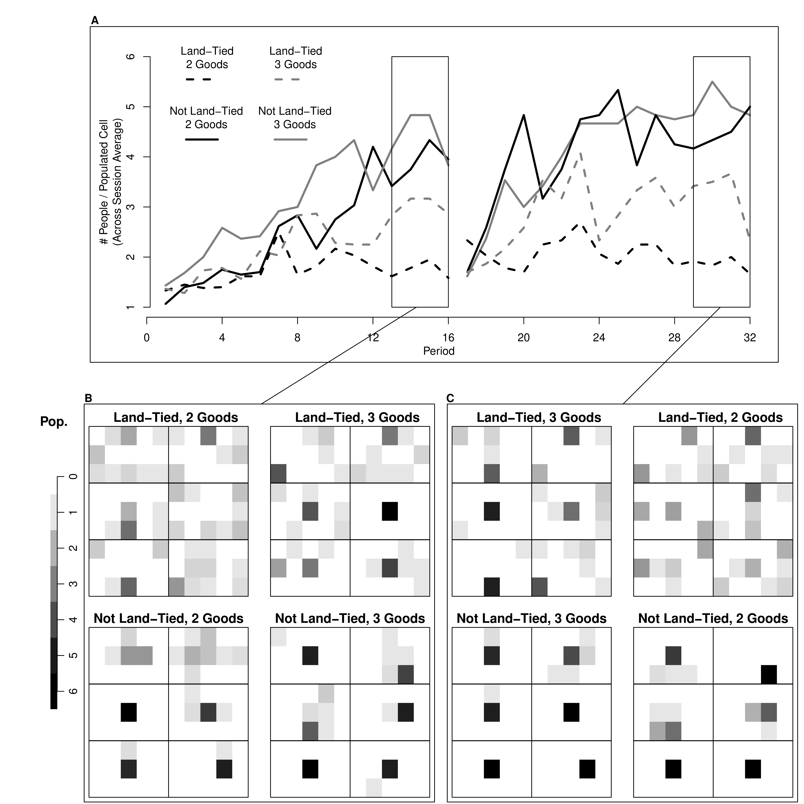

# (PART) Programming in R {-} 

# First steps
***


## Install R

First Install [R](https://cloud.r-project.org/).
Then Install [Rstudio](https://www.rstudio.com/products/rstudio/download/).

For help setting up

* https://learnr-examples.shinyapps.io/ex-setup-r/
* https://rstudio-education.github.io/hopr/starting.html
* https://a-little-book-of-r-for-bioinformatics.readthedocs.io/en/latest/src/installr.html
* https://cran.r-project.org/doc/manuals/R-admin.html

* https://courses.edx.org/courses/UTAustinX/UT.7.01x/3T2014/56c5437b88fa43cf828bff5371c6a924/
* https://owi.usgs.gov/R/training-curriculum/installr/
* https://www.earthdatascience.org/courses/earth-analytics/document-your-science/setup-r-rstudio/


Make sure you have the latest version of R and Rstudio for class. If not, then reinstall. 

## Interfacing with the GUI

Rstudio is easiest to get going with. (There are other GUI's.) There are 4 panes. The top left is where you write and save code

 * Create and save a new `R Script` file *My_First_Script.R*
 * could also use a plain .txt file.

```{r, echo=FALSE}
knitr::include_graphics("./Figures_Manual/Rstudio.svg")
```

The pane below is where your code is executed. For all following examples, make sure to both execute and store your code.


Note that the coded examples generally have inputs, outputs, and comments. For example, 
```{r, eval=TRUE, echo=TRUE}
CodeInput_String <- c('code output looks like this')
CodeInput_String

## while this is just a comment
```


## Introductions to R

Some coding examples are copied from https://r4ds.had.co.nz/ but also other sources I have found online and elsewhere over the years.

There are many good yet free programming books online. E.g., 

* https://cran.r-project.org/doc/manuals/R-intro.html
* R Graphics Cookbook, 2nd edition. Winston Chang. 2021. https://r-graphics.org/
* https://intro2r.com/
* R for Data Science. H. Wickham and G. Grolemund. 2017. https://r4ds.had.co.nz/index.html
* An Introduction to R. W. N. Venables, D. M. Smith, R Core Team. 2017. https://colinfay.me/intro-to-r/
* https://bookdown.org/kieranmarray/intro_to_r_for_econometrics/
* Spatial Data Science with R: Introduction to R. Robert J. Hijmans. 2021. https://rspatial.org/intr/index.html

There are also many good yet free-online tutorials and courses. E.g., \\

* https://www.econometrics-with-r.org/1.2-a-very-short-introduction-to-r-and-rstudio.html
* https://rafalab.github.io/dsbook/
* https://moderndive.com/foreword.html
* https://rstudio.cloud/learn/primers/1.2
* https://cran.r-project.org/manuals.html
* https://stats.idre.ucla.edu/stat/data/intro_r/intro_r_interactive_flat.html
* https://cswr.nrhstat.org/app-r

What we cover in this primer should be enough to get you going. But other resources should be used if needed. 


# Mathematical Objects
***


## Scalars and Vectors

```{r}
x0 <- 1 ## Your first scalar
x0 ## Print the scalar
(x0+1)^2 ## Perform and print a simple calculation
x0 + NA ## often used for missing values
x0*2
```

```{r}
x <- c(0,1,3,10,6) ## Your First Vector
x ## Print the vector
x[2] ## Print the 2nd Element; 1
x+2 ## Print simple calculation; 2,3,5,8,12
x*2
(x+x)^2 ## Another simple calculation with two vectors
```


In R, you use multiple functions on different types of data objects. Moreover, ``typically solve complex problems by decomposing them into simple functions, not simple objects.'' (H. Wickham)


##  Functions of Scalars and Vectors

Define function sum_squared
```{r}
sum_squared <- function(x1, x2) {
	y <- (x1 + x2)^2
	return(y)
} 
```
```{r}
sum_squared(1, 3) ## 16
sum_squared(x, 2) ## 0,4,9,36,144,400
sum_squared(x, NA) ## NA,NA,NA,NA,NA
sum_squared(x, x) ## 0,4,36,144,400
sum_squared(x, 2*x)
```

Random variables are vectors created by functions
```{r}
## random standard-normal
rnorm(10) 
rnorm(10)

## random uniform
x2 <- runif(1000)
head(x2)
length(x2)
```

## Functions of Functions

Functions can take functions as arguments 

```{r}
fun_of_rv <- function(f){
    y <- f( runif(1e3) )
    return(y)
}
```

```{r}
fun_of_rv(mean)

fun_of_rv(mean)

fun_of_rv(sum)
```


```{r}
fun_of_rv <- function(f=mean, n=20){
    y <- f( runif(n) )
    return(y)    
}
fun_of_rv()
```

Very useful for applying a function over and over again

```{r}
## sapply(1:3, f) is equivalent to c(f(1), f(2), f(3)).
## mapply takes multiple vectors
mapply(sum, 1:3, runif(3) )
```

##  Matrices and Matrix-Functions

```{r}
x_mat <- cbind(x,x)
x_mat ## Print full matrix
x_mat[2,] ## Print Row 2 Elements
x_mat[,2] ## Print Column 2 Elements

y <- apply(x_mat, 1, sum)^2 ## Apply function to each row
## ?apply  #checks the function details
y - sum_squared(x, x) ## tests if there are any differences
```

Many Other Functions
```{r}
#col1 <- x_mat[,1]
#col1
#col2 <- x_mat[,2]
#col2
x_mat * x_mat

crossprod(x_mat)

tcrossprod(x_mat) ##x_mat %*% t(x_mat)

outer(x,x) ##x %o% x
```


Example Calculations

```{r}
## Return Y-value with minimum absolute difference from 3
abs_diff_y <- abs( y - 3 ) 
abs_diff_y ## is this the luckiest number?

min(abs_diff_y)
which.min(abs_diff_y)
y[ which.min(abs_diff_y) ]
```


## Arrays and Array Functions

Generalization of matrices used in spatial econometrics

```{r}
a <- array(data = 1:24, dim = c(2, 3, 4))
a

a[1, , , drop = FALSE]  # Row 1
a[, 1, , drop = FALSE]  # Column 1
a[, , 1, drop = FALSE]  # Layer 1

a[ 1, 1,  ]  # Row 1, column 1
a[ 1,  , 1]  # Row 1, "layer" 1
a[  , 1, 1]  # Column 1, "layer" 1
a[1 , 1, 1]  # Row 1, column 1, "layer" 1
```

Apply extends to arrays

```{r}
apply(a, 1, mean)    # Row means
apply(a, 2, mean)    # Column means
apply(a, 3, mean)    # "Layer" means
apply(a, 1:2, mean)  # Row/Column combination 
```


##  Other Commom Types of Data

```{r}
l1 <- 1:10 ## cardinal numbers
l2 <- factor(c(1,2,3), ordered=T) ## ordinal numbers
l2 <- factor(c(1,2,3), ordered=F) ## "indicators", "names", 'etc'
l3 <- 'hello world'  ## character strings
l4 <- list(l1, l2, list(l3, 'way too late')) ## lists

## data.frames: your most common data type
    ## matrix of different data-types
    ## well-ordered lists
l5 <- data.frame(x=l1, y=l1)
```


# Plots
***


## Basics

Create and Plot a Toy Dataset

```{r}
x <- seq(1,10) ## create values for x
e <- rnorm(length(x), mean=0, sd=1) ## store 
y <- .25*x + e ## create values for y
xy_dat <- data.frame(x=x, y=y)

## your first plot is pretty standard
plot(y~x, xy_dat)  ## pretty and standard
```


Create and Plot a Larger Toy Dataset

```{r}
x <- seq(1, 10, by=.0002)
e <- rnorm(length(x), mean=0, sd=1)
y <- .25*x + e
xy_dat <- data.frame(x=x, y=y)
head(xy_dat)

plot(y~x, xy_dat, pch=16, col=rgb(0,0,0,.1), cex=.5)
```


##  Equation Fitting Example


Run and Plot an OLS Regression

```{r}
## OLS Regression
reg <- lm(y~x, data=xy_dat)
summary(reg)

## Add the line of best fit
plot(y~x, xy_dat, pch=16, col=rgb(0,0,0,.1), cex=.5)
abline(reg)

## Can Also Add Confidence Intervals
## https://rpubs.com/aaronsc32/regression-confidence-prediction-intervals
```


Polish and Export Your Plot.

```{r}
plot(y~x, xy_dat, pch=16, col=rgb(0,0,0,.1), cex=.5,
    xlab='', ylab='') ## Format Axis Labels Seperately
mtext( 'y=0.25 x + e\n e ~ standard-normal', 2, line=2)
mtext( expression(x%in%~'[0,10]'), 1, line=2)
title('Plot with good features and excessive notation')
legend('topleft', legend='single data point',
    title='do you see the normal distribution?',
    pch=16, col=rgb(0,0,0,.1), cex=.5)
```


Can export figure with specific dimensions
```{r, eval=F}
pdf( 'Figures/plot_example.pdf', height=5, width=5)
plot(y~x, xy_dat, pch=16, col=rgb(0,0,0,.1), cex=.5)
dev.off()
```


# Beyond the basics
***


Use expansion `packages` for common procedures and more functionality
```{r, eval=FALSE}
## Other packages used in this primer
install.packages("stargazer")
install.packages("reshape2")
install.packages("purrr")
```


The most common tasks have [cheatsheets](https://www.rstudio.com/resources/cheatsheets/) you can use. E.g., 

* https://github.com/rstudio/cheatsheets/blob/main/rstudio-ide.pdf


Sometimes you will want to install a package from GitHub. For this, you can use [devtools](https://devtools.r-lib.org/) or the lighter [remotes](https://remotes.r-lib.org/)
```{r, eval=F}
install.packages("devtools")
install.packages("remotes")
```

For devtools, you need to have developer tools installed on your pc. If you have not, try

* Windows: [Rtools](https://cran.r-project.org/bin/windows/Rtools/rtools42/rtools.html)
* Mac: [Xcode](https://apps.apple.com/us/app/xcode/id497799835?mt=12)


For example, to color terminal output on Linux you can 
```{r, eval=F}
library(remotes)
# Install https://github.com/jalvesaq/colorout
# to .libPaths()[1]
install_github('jalvesaq/colorout')
```


## Task Views

Task views list relevant packages. 

For all students and early researchers, 

* https://cran.r-project.org/web/views/ReproducibleResearch.html

For microeconometrics,

* https://cran.r-project.org/web/views/Econometrics.html

For spatial econometrics 

* https://cran.r-project.org/web/views/Spatial.html
* https://cran.r-project.org/web/views/SpatioTemporal.html


Multiple packages may have the same function name for different commands. In this case use the syntax ``package::function`` to specify the package. For example
```{r, eval=F}
devtools::install_github
remotes::install_github
```


**Don't fret** Sometimes there is not a specific package for your data.

Odds are, you can do most of what you want with base code.

* Packages just wrap base code in convient formats
* see https://cran.r-project.org/web/views/ for topical overviews

Statisticians might have different naming conventions

* if the usual software just spits out a nice plot
you might have to dig a little to know precisely what you want
* your data are fundamentally numbers, strings, etc...
You only have to figure out how to read it in.

But remember that many of the best plots are custom made (see https://www.r-graph-gallery.com/), and can also be interactive or animated

* https://plotly.com/r/
* https://shiny.rstudio.com/gallery/


## Custom figures

<!-- ## CONVERT IMAGES
for pdfile in *.pdf ; do 
convert -verbose -density 500  "${pdfile}" "${pdfile%.*}".png;
done
-->


```{r, echo=FALSE}
 knitr::include_graphics("./Figures_Manual/Vegetation.png")
```

```{r, echo=FALSE}
 knitr::include_graphics("./Figures_Manual/Balances_Trial.png")
```

```{r, echo=FALSE}
 
```

```{r, echo=FALSE}
 knitr::include_graphics("./Figures_Manual/SampleExample.png")
```

```{r, echo=FALSE}
 knitr::include_graphics("./Figures_Manual/SemiInclusive_Example.png")
```

```{r, echo=FALSE}
 knitr::include_graphics("./Figures_Manual/Stability_3.png")
```

```{r, echo=FALSE}
 knitr::include_graphics("./Figures_Manual/EvolutionaryDynamics.png")
```

```{r, echo=FALSE}
 knitr::include_graphics("./Figures_Manual/Experiment_Timeline.png")
```

