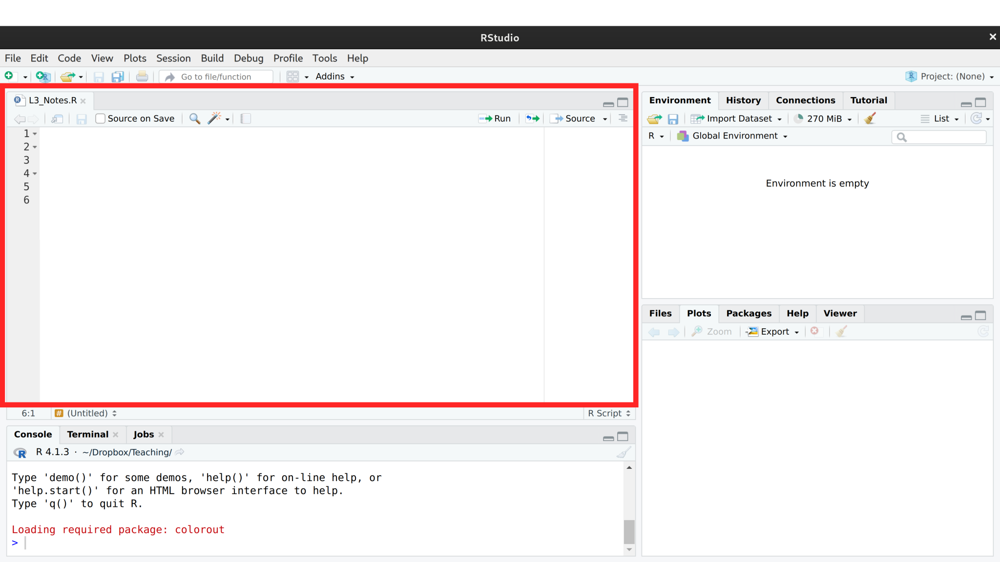

# First Steps
***

This chapter walks through the basics of working in R: installing the software, writing your first commands, saving them in scripts, and building up the objects you will use throughout the book.
We start with simple arithmetic, then move to vectors and matrices, write your first function, and finish with loops and logical comparisons.
The pace is gentle on purpose so that the rest of the book can move quickly.

## Why Program in R?

You should program your statistical analysis, and we will cover some of the basics of how to do this in R.
You also want your work to be replicable and reproducible.

:::{.callout-important title="Key Definition" collapse="false"}
*Replicable* research means someone collecting new data, by following the same procedure, can come to the same results.

*Reproducible* research means someone reusing your data and code can recompute the same results.
:::

The distinction is useful for diagnosing a failed result: lack of *replication* points to flawed original methodology or to chance findings, while lack of *reproduction* points to errors or undocumented steps in the analysis itself.
Programming your analysis is what buys *reproducibility*: every step is saved in code, so anyone — including future you — can rerun the same operations and get the same numbers.

You can read more about the distinction in many places, including

* <https://www.annualreviews.org/doi/10.1146/annurev-psych-020821-114157>
* <https://nceas.github.io/sasap-training/materials/reproducible_research_in_r_fairbanks/>

We focus on R because it is good for complex stats, concise figures, and coherent organization. It is built and developed by applied statisticians for statistics, and used by many in academia and industry. 

* You see the exact steps you took and found an error
  * Google *"worst Excel errors"* and note the frequency they arise from copy/paste via the "point-and-click" approach. E.g., *Fidelity's $2.6 Billion Dividend Error*.
  * Find a problem before sending your work out. E.g., see <https://retractionwatch.com/> and <https://econjwatch.org/>.
* You try out a new plot you found in *The Visual Display of Quantitative Information*, by Edward Tufte.
  * It's not a standard plot, but AI answers most of your questions.
  * Tutorials help avoid bad practices, such as plotting 2D data as a 3D object (see e.g., <https://clauswilke.com/dataviz/no-3d.html>).
* You try out an obscure statistical approach that's hot in your field.
  * it doesn't make the report, but you have some confidence that candidate issue isn't a big problem
  
So my main sell to you is that being reproducible is in your own self-interest. For students, think about labor demand and what may be good for getting a job. Do some of your own research to best understand how much to invest.


## First Steps

#### **Install R**. {-}

First Install [R](https://cloud.r-project.org/) (see also the [R Installation and Administration Manual](https://cran.r-project.org/doc/manuals/R-admin.html)).
Then Install [RStudio](https://www.RStudio.com/products/RStudio/download/).

For Fedora (linux) users, note that you need to first enable the repo and then install

```{bash, eval=F}
sudo dnf install 'dnf-command(copr)'
sudo dnf copr enable iucar/RStudio
sudo dnf install RStudio-desktop
```


*Make sure you have the latest version of R and RStudio for class.* If not, then reinstall. 

#### **Interfacing with RStudio**. {-}

RStudio is perhaps the easiest to get going with. (There are other GUI's.)

In RStudio, there are 4 panes. If you do not see 4, click "file > new file > R script" on the top left of the toolbar.

```{r, echo=F, eval=T}

```

The top left pane is where you write your code. For example, type
```{r, eval=F}
#| code-fold: false
1+1
```

The pane below is where your code is executed. 
Keep you mouse on the same line as your code, and then click "Run". 
You should see
```
> 1+1
[1] 2
```
If you click "Run" again, you should see that same output printed again.


As we proceed, you can see both my source code and output like this:
```{r}
1 + 1
```

In this chapter, code annotations will help you 
```{r}
1+1     #<1>
```
1. You can use `+` to add any numbers. E.g., `1+2`

Try $2+2$ and $3+3$. First execute each one-at-a-time. Then highlight/run them both together.


#### **Comments**. {-}

You should add comments to your codes, and you do this with hashtags. For example
```{r}
# This is my first comment!                       # <1>
1+1 # The simplest calculation I could think of   # <2>

# Other examples of running code
2+2                                               # <3>
3+3                                               # <3>
```
1. A line starting with `#` is a comment; R ignores it.
2. Anything after `#` on a line of code is also a comment.
3. Each line is executed in turn when you run the chunk.

Now try some other mathematical operations
```{r}
2-3 #subtraction
2*3 #multiplication
2/3 #division
2^3 #powers
```

Now try some more complex examples
```{r}
# Example 1
5+2/10
(5+2)/10 # notice the difference

# Example 2
2^3/10 # notice the differences
2/10^3
(2/10)^3
```


#### **Reading This Textbook**. {-}


In later chapters, there are also special boxes for especially important statistical examples.

:::{.callout-note icon=false collapse="true" title="Must Know"}
This box contains *need to know* examples. Such as 
```{r}
2 + 7
```
:::

:::{.callout-tip icon=false collapse="true" title="Test Yourself"}
This box contains *test yourself* examples and questions. Such as 
```{r}
(2 + 7)^3 / 10
```
:::


To understand each chunk of code:

* Copy/paste it into your RStudio
* Run it
* Predict what happens if changed
* Change it
* Break it
* Fix it

E.g., Use the following code to see if the empty space matters
```{r}
(2 + 7)^3 / 10
```

#### **Assignment**. {-}

You can create "variables" that store values. For example,
```{r}
x <- 1   # <1>
x + 1    # <2>
```
1. Assign the value `1` to a variable named `x` using the `<-` operator.
2. Use `x` in a calculation; R substitutes its stored value.

```{r}
x <- 23 #Another example
x + 1
```

```{r}
y <- x + 1 #Another example
y
```

Your variables must be defined in order to use them. Otherwise you get an error. For example,
```{r, error=TRUE}
X +   1 # notice that R is sensitive to capitalization 
```


#### **Scripting**. {-}

* Create a folder on your computer to save your scripts
* Save your `R Script` file as *My_First_Script.R* in your folder
* Close RStudio
* Open your script and re-run it

As you work through the material, make sure to both execute and save your scripts. Add lots of commentary to your scripts. Name your scripts systematically.

There are often many ways to accomplish the same goal. You first scripts will be very basic and rough, but you can edit them later based on what you learn. And you can always ask R for help
```{r, eval=F}
sum(x, 2)   # <1>
?sum        # <2>
```
1. `sum()` is a built-in function; here it returns `x + 2`.
2. Prefix any function name with `?` to open its help page.

We write script in the top left so that we can edit common mistakes.
```{r, eval=F}
# Mistake 1: using undefined objects
Y

#  Mistake 2: spelling and spacing
Y < - 43
Y_plus_z <- Y + z

# Mistake 3: half-completed code
x + y + 
x_plus_y_plus_z <- x + y + z
# Seeing '+' in the bottom console?
# press 'Escape' and try again
```
Your variable names do not matter technically, but they should be informative to help avoid common mistakes.

## Mathematical Objects

Before you can analyze data in R, you need to know what shapes the data can take.

:::{.callout-important title="Key Definition" collapse="false"}
A *scalar* is a single number.
A *vector* is an ordered list of numbers of the same type.
A *matrix* is a rectangular grid of numbers with rows and columns, where every entry has the same type.
:::

Each shape suits a different kind of dataset: *scalars* hold single summary statistics (e.g., the average household income of Canada), *vectors* hold one variable across observations (e.g., the household income of each family in Vancouver), and *matrices* hold two or more variables across observations (e.g., the age and education level of every person in class).
Vectors are probably your most common object in R, but we will start with scalars.


#### **Scalars**. {-}

Make your first scalar
```{r}
xs <- 2   # <1>
xs        # <2>
```
1. Assign a single number to `xs`; this is a scalar.
2. Typing the object's name at the console prints its value.

Perform simple calculations and see how R is doing the math for you
```{r}
xs + 2
xs*2 # Perform and print a simple calculation
(xs+1)^2 # Perform and print a simple calculation
xs + NA # often used for missing values
```

Now change `xs`, predict what will happen, then re-run the code.

#### **Vectors**. {-}

Make your first vector
```{r}
x <- c(0, 1, 3, 10, 6)   # <1>
x                        # <2>
x[2]                     # <3>
x + 2                    # <4>
x*2                      # <4>
x^2                      # <4>
```
1. Combine values into a vector with `c()`.
2. Print the whole vector.
3. Use square brackets `[ ]` to extract the 2nd element.
4. Arithmetic is applied elementwise to each entry of `x`.

Apply mathematical calculations elementwise
```{r}
x+x
x*x
x^x
```

In R, scalars are treated as a vector with one element.
```{r}
c(1)
```


#### **Matrices**. {-}

Matrices are also common objects
```{r}
x1 <- c(1, 4, 9)              # <1>
x2 <- c(3, 0, 2)              # <1>
x_mat <- rbind(x1, x2)        # <2>

x_mat                         # <3>
x_mat[2,  ]                   # <4>
x_mat[ , 2]                   # <5>
x_mat[2, 2]                   # <6>
```
1. Create two vectors of the same length.
2. Stack them as rows into a matrix with `rbind()` (use `cbind()` to stack as columns).
3. Print the full matrix.
4. Extract row 2: leave the column slot empty.
5. Extract column 2: leave the row slot empty.
6. Extract a single element by giving both row and column.


There are elementwise calculations
```{r}
x_mat+2
x_mat*2
x_mat^2

x_mat + x_mat
x_mat * x_mat
```


## Mathematical Functions

#### **Functions**. {-}

Calculations you find yourself doing again and again deserve a single name and a single place to live.

:::{.callout-important title="Key Definition" collapse="false"}
A *function* is a named recipe that takes input values, performs a calculation, and returns an output.
The input names are called *arguments* and the returned value is the function's *output*.
:::

Functions are useful for any calculation you intend to reuse: define the recipe once, and a single edit to the recipe propagates to every call.
Naming the calculation also makes scripts easier to read, since a well-chosen function name documents what the code is doing.

#### **Creating Simple Functions**. {-}

*Functions* are applied to objects
```{r}
add_two <- function(input) {     # <1>
    output <- input + 2          # <2>
    return(output)               # <3>
}
x <- c(0, 1, 3, 10, 6)           # <4>
add_two(input=x)                 # <5>
```
1. Declare a function with one argument; `input` is a placeholder name.
2. Compute the result; `output` exists only inside the function.
3. Hand the result back to whoever called the function.
4. Build a vector to feed in.
5. Call the function; `add_two(x)` works the same as naming the argument.

Common mistakes:
```{r, eval=F}
print(input)
print(output)
# These are not available globally, only locally (inside of the function)

# Double check typos
x  < - add_two(Input=X) 

# Seeing '+' in the bottom console
# often means you forgot to close the function with '}' 
# click the bottom left panel, press 'Escape', and try again in the top left panel
add_two <- function(input_vector) { 
    output_vector <- input_vector + 2 
    return(output_vector)
x <- c(0, 1, 3, 10, 6)
add_two(x)
```

There are many different functions. Many of which functions have defaults.
```{r}
add_scalar <- function(input_vector1, input_scalar2) {
    output_vector <- input_vector1 + input_scalar2
    return(output_vector)
}
add_scalar(x, 3)
add_scalar(x, 4)

add_scalar3 <- function(input_vector1, input_scalar2=3) {
    output_vector <- input_vector1 + input_scalar2
    return(output_vector)
}
add_scalar3(x)
add_scalar3(x, 4)
```

:::{.callout-note icon=false collapse="true" title="Must Know"}
A function lets you name a calculation once and then reuse it.
Here is one that computes the *range* of a vector: the largest value minus the smallest.
```{r}
my_range <- function(input) {
    output <- max(input) - min(input)
    return(output)
}
x <- c(0, 1, 3, 10, 6)
my_range(x)
```
:::


#### **Common Functions**. {-}

Perhaps the most common function we will use is summation. You can see exactly what a function does with `?`.

```{r}
x1 <- c(1, 4, 9)            # <1>
x1
sum(x1)                     # <2>

x2 <- c(3, 0, 2)
x_mat <- rbind(x1, x2)
x_mat
sum(x_mat)                  # <3>

# ?sum                      # <4>
```
1. A vector with three entries.
2. `sum()` adds the entries of a vector.
3. Applied to a matrix, `sum()` adds *every* entry, not just one row or column.
4. Uncomment to open the help page for `sum`.


You can apply functions to each row or column of a matrix
```{r}
x_mat

# Row sums
y_row <- apply(x_mat, 1, sum)
y_row

#check row sums are correct
x_row1 <- x_mat[1, ]
sum(x_row1)
x_row2 <- x_mat[2, ]
sum(x_row2)

# Column sums
y_col <- apply(x_mat, 2, sum)
y_col

#check column sums are correct: DIY
```

Sometimes, we will use vectors that are entirely ordered. We make them with functions.
```{r}
seq(1, 7, by=1) #same as 1:7
seq(1, 7, by=0.5)

# Ordering data
sort(x)
x[order(x)]
```


#### **Loops**. {-}

Sometimes the same calculation must be performed on many inputs, with each result depending on the previous one or stored alongside the others.

:::{.callout-important title="Key Definition" collapse="false"}
A *loop* repeats the same block of code several times.
A `for` loop runs the block once for each value of an index variable.
We typically pre-allocate a vector to hold the results, then fill one entry per pass.
:::

Loops are useful when each iteration depends on the previous one (recursion) or when you want to perform a sequence of operations whose order matters; for purely elementwise calculations, vectorized arithmetic on a single vector is usually faster and cleaner.

Applying the same function over and over again
```{r}
# Example 1: simple division
x <- rep(NA, 3)              # <1>
for(i in seq(1, 3)){         # <2>
    x[i] <- i/2              # <3>
}
x                            # <4>
# Compare

# Example 2: using existing data
x <- c(1, 3, 9, 2)
y <- rep(NA, length(x))
for(i in seq(1, 4) ){
    y[i] <- x[i] + 1
}
y


#Example 3: recursion
x <- rep(NA, 4)
x[1] <- 1
for(i in seq(2, 4) ){
    x[i] <- x[i-1]^2
}
x
```
1. Pre-allocate a length-3 vector of `NA`s to hold the results.
2. Loop with `i` taking the values `1, 2, 3` in turn.
3. On each pass, assign a value into the `i`-th slot of `x`.
4. Print the filled-in vector.

:::{.callout-tip icon=false collapse="true" title="Test Yourself"}
Predict the value of `y` after this loop runs, then check your answer in R.
```{r}
y <- rep(NA, 4)
y[1] <- 2
for(i in seq(2, 4)){
    y[i] <- y[i-1] + 3
}
y
```
:::


#### **Logic**. {-}

Calculations that are either TRUE or FALSE
```{r}
x <- c(1, 2, 3, NA)   # <1>

x == 2                # <2>
any(x==2)             # <3>
all(x==2)             # <4>
2 %in% x              # <5>
is.na(x)              # <6>
```
1. A vector with a missing value (`NA`).
2. `==` tests each entry for equality; returns a vector of `TRUE`/`FALSE`.
3. `any()` returns `TRUE` if at least one entry of its input is `TRUE`.
4. `all()` returns `TRUE` only if every entry is `TRUE`.
5. `%in%` checks whether the left value appears anywhere on the right.
6. `is.na()` flags the missing entries.


The `&` and `|` commands are logical calculations that compare vectors to the left and right.
```{r}
x < 2
x >= 1
(x >= 1) & (x < 2)
(x >= 1) | (x < 2)
```


## Exercises

1. Explain the difference between *replicable* and *reproducible* research. Why is programming your analysis in R better for reproducibility than a point-and-click approach?

2. Let `x <- c(2, 5, 8, 3, 7)`. Without running the code, predict the output of `sum(x) / length(x)`, then verify in R. Next, use `sort(x)` and extract the second element of the sorted vector with bracket indexing.

3. Write a function called `square_plus` that takes a vector and a scalar as inputs, squares each element of the vector, and then adds the scalar. Test it on `x <- c(1, 4, 9)` with a scalar of 5. Confirm your result by computing the answer manually.

#### **Further Reading**. {-}

* <https://rstudio.github.io/cheatsheets/rstudio-ide.pdf> -- RStudio IDE cheatsheet: a two-page reference for the most common interface actions and keyboard shortcuts.
* <https://rstudio-education.github.io/hopr/starting.html> -- *Hands-On Programming with R*, "Starting" chapter: a beginner-friendly walkthrough of installing R, RStudio, and running your first code.
* <https://cran.r-project.org/doc/manuals/R-intro.html> -- *An Introduction to R*: the official CRAN manual covering arithmetic, objects, functions, and scripting basics.

#### Recall {-}

This chapter introduced the R environment, the three basic objects (*scalars*, *vectors*, *matrices*), and the tools to manipulate them: *functions*, `for` *loops*, and logical comparisons.
The `my_range` function in the *Must Know* box compressed the function pattern into four lines — take a vector input, compute `max(input) - min(input)`, return the result — and applying it to `x <- c(0, 1, 3, 10, 6)` returned $10$.
In the next chapter we use these tools to read real datasets into R and to visualize the distribution of a single variable.
