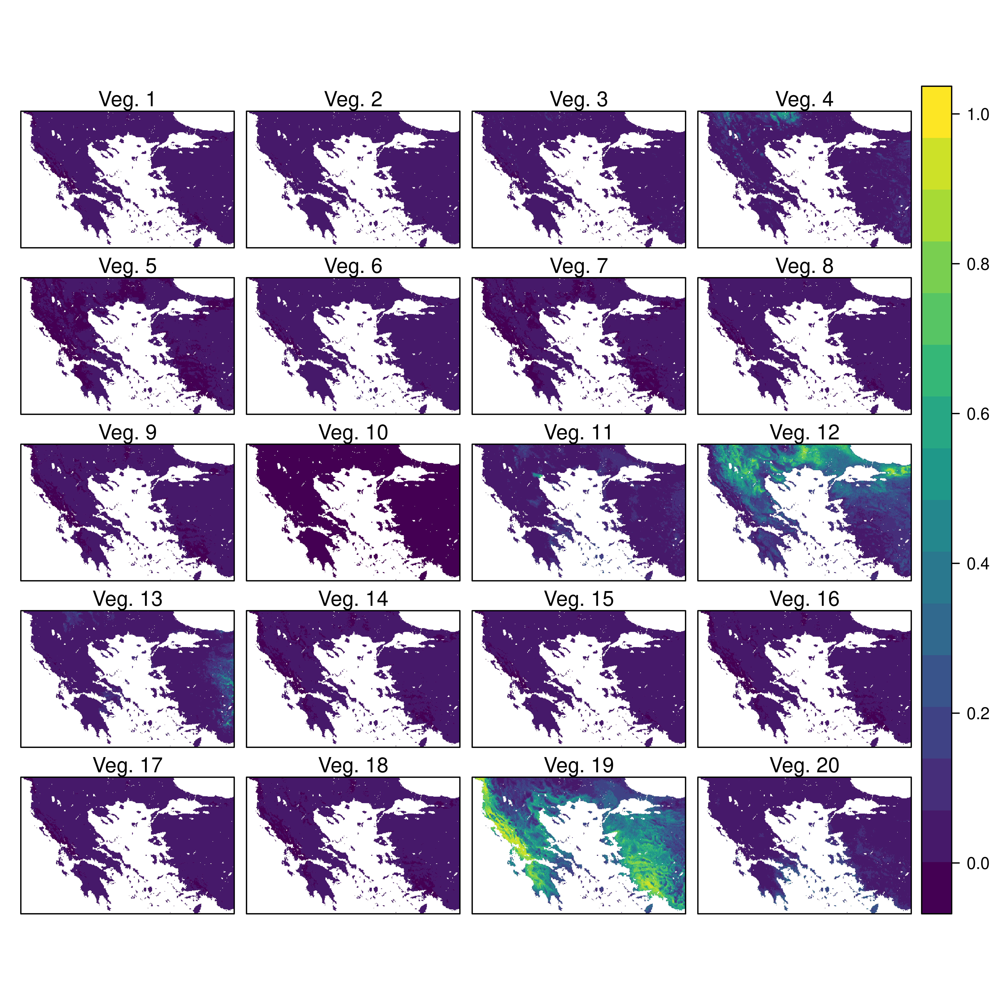
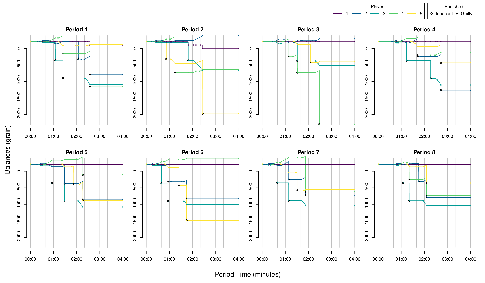
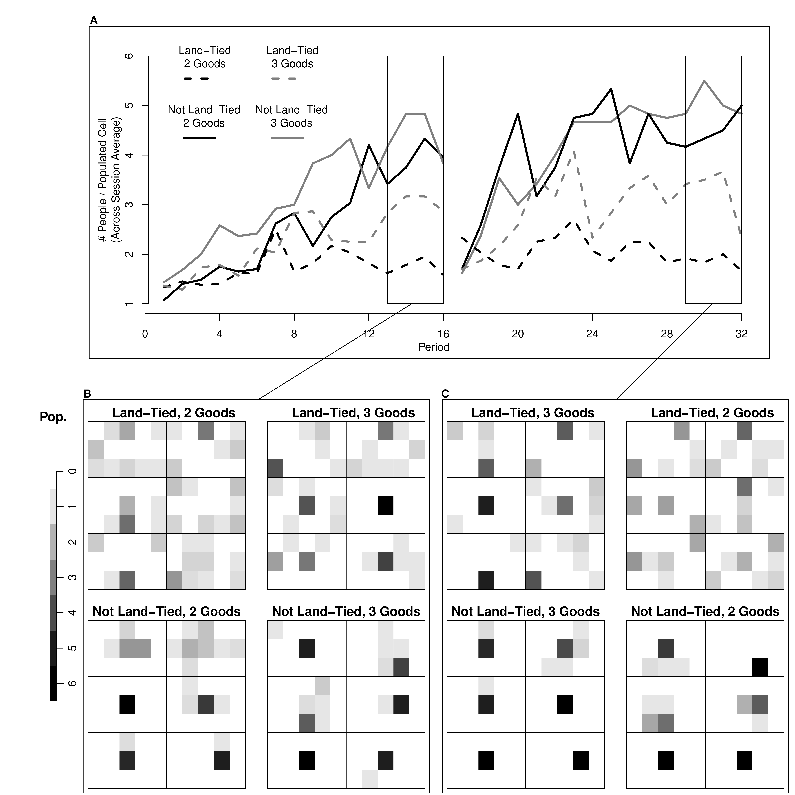
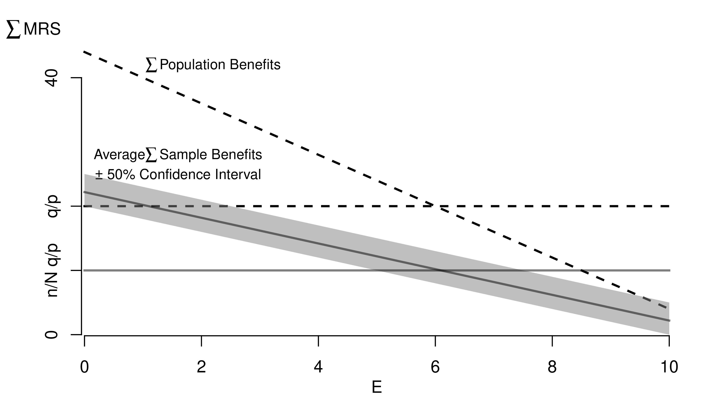
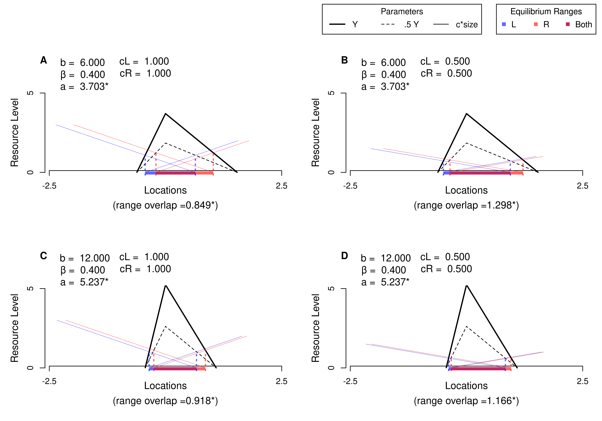
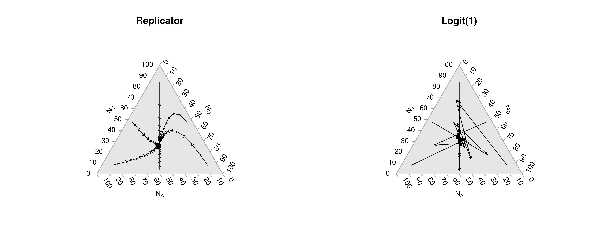
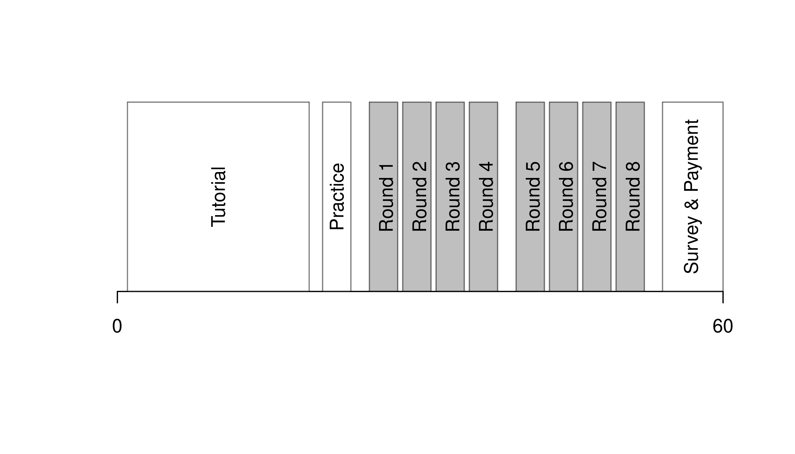

# Data Analysis
***

This chapter is about communicating results.
We cover how to present data in interactive figures and tables, how to polish a figure so a reader grasps it quickly, and how to assemble a reproducible report in Quarto.
Good analysis is only useful to others if its output is clear.

## Outputs


#### **Interactive Figures**. {-}

A single static plot fixes one view of the data, but readers often want to explore details the analyst did not pre-select.

:::{.callout-important icon=false title="Key Definition" collapse="false"}
An *interactive figure* is a plot whose viewer can change the display at runtime (hovering for point-level detail, panning, zooming, or filtering) without re-rendering on the analyst's side.
:::

Interactive figures are useful when the data have more structure than any single static view can capture: many points where hovering reveals labels, groups the reader may want to toggle, or ranges they may want to zoom into.
The `plotly` package wraps common plot types (notably [histograms](https://plotly.com/r/histograms/), [boxplots](https://plotly.com/r/box-plots/), and [scatterplots](https://plotly.com/r/line-and-scatter/)) into HTML widgets that work in any browser.

```{r}
library(plotly)              # install.packages('plotly')
USArrests[, 'ID'] <- rownames(USArrests) # state name for hover text

# Scatter plot of arrests vs urbanization
fig <- plot_ly(
    USArrests, x = ~ UrbanPop, y = ~ Assault,
    mode='markers',
    type='scatter',
    hoverinfo='text',                              # use custom hover text
    marker=list( color='rgba(0, 0, 0, 0.5)'),      # semi-transparent points
    text = ~ paste('<b>', ID, '</b>',              # one line per state
        '<br>Urban  :', UrbanPop,
        '<br>Assault:', Assault))
fig <- layout(fig,
    showlegend=FALSE,
    title='Crime and Urbanization in America 1975',
    xaxis = list(title = 'Percent of People in an Urban Area'),
    yaxis = list(title = 'Assault Arrests per 100, 000 People'))
fig
```


```{r, message=FALSE, message=FALSE}
# Box Plot
fig <- plot_ly(USArrests,
    y= ~ Murder, color= ~ cut(UrbanPop, 4),
    alpha=0.6, type='box',
    pointpos=0, boxpoints = 'all',
    hoverinfo='text',    
    text = ~ paste('<b>', ID, '</b>',
        '<br>Urban  :', UrbanPop,
        '<br>Assault:', Assault,
        '<br>Murder :', Murder))    
fig <- layout(fig,
    showlegend=FALSE,
    title='Crime and Urbanization in America 1975',
    xaxis = list(title = 'Percent of People in an Urban Area'),
    yaxis = list(title = 'Murders Arrests per 100, 000 People'))
fig
```

```{r, message=FALSE, message=FALSE}
pop_mean <- mean(USArrests[, 'UrbanPop'])
pop_cut <- USArrests[, 'UrbanPop'] < pop_mean
murder_lowpop <- USArrests[ pop_cut, 'Murder']
murder_highpop <- USArrests[ !pop_cut, 'Murder']

# Overlapping Histograms
fig <- plot_ly(alpha=0.6, hovertemplate='%{y}')
fig <- add_histogram(fig, murder_lowpop, name='Low Pop. (< Mean)',
    histnorm = 'probability density',
    xbins = list(start=0, size=2))
fig <- add_histogram(fig, murder_highpop, name='High Pop (>= Mean)',
    histnorm = 'probability density',
    xbins = list(start=0, size=2))
fig <- layout(fig,
    barmode='overlay',
    title='Crime and Urbanization in America 1975',
    xaxis = list(title='Murders Arrests per 100, 000 People'),
    yaxis = list(title='Density'),
    legend=list(title=list(text='<b> % Urban Pop. </b>')) )
fig

# Possible, but less preferable, to stack histograms
# barmode='stack', histnorm='count'
```


Note that many plots can be made [interactive](https://r-graph-gallery.com/interactive-charts.html) via <https://plotly.com/r/>.
For more details, see [examples](https://plotly-r.com/) and then [applications](https://bookdown.org/paulcbauer/applied-data-visualization/10-plotly.html).

If you have many points, for example, you can make a [2D histogram](https://plotly.com/r/2D-Histogram/).
```{r, eval=FALSE}
library(plotly)
fig <- plot_ly(
    USArrests, x = ~ UrbanPop, y = ~ Assault)
fig <- add_histogram2d(fig, nbinsx=25, nbinsy=25)
fig
```


#### **Interactive Tables**. {-}

For raw data, a static table forces the analyst to pre-pick which rows the reader sees first.

:::{.callout-important icon=false title="Key Definition" collapse="false"}
An *interactive table* shows rows of data with built-in filtering, sorting, and search controls.
The viewer chooses which rows to see; the analyst does not need to pre-aggregate.
:::

Interactive tables are useful when the reader wants to look up specific records rather than a summary view: searching by row identifier, sorting on a particular column, or filtering down to a subset.
The `reactable` package renders a data frame as an HTML widget with these controls already built in.

```{r}
data('USArrests')
library(reactable)                       # install.packages('reactable')
reactable(USArrests,
    filterable=TRUE,                        # one search box per column
    highlight=TRUE)                         # row highlighting on hover
```

You can create an interactive table that summarizes the data too.
```{r}
# Compute summary statistics
vars <- names(USArrests)
stats_list <- vector('list', length(vars))
for (i in seq_along(vars)) {
  v <- vars[i]
  x <- USArrests[[v]]
  stats_list[[i]] <- c(
    Variable = v,
    N       = sum(!is.na(x)),
    Mean    = mean(x, na.rm = TRUE),
    SD      = sd(x, na.rm = TRUE),
    Min     = min(x, na.rm = TRUE),
    Q1      = as.numeric(quantile(x, 0.25, na.rm = TRUE)),
    Median  = median(x, na.rm = TRUE),
    Q3      = as.numeric(quantile(x, 0.75, na.rm = TRUE)),
    Max     = max(x, na.rm = TRUE)
  )
}

# Convert list to data frame with numeric columns 
stats_df <- as.data.frame(do.call(rbind, stats_list), stringsAsFactors = FALSE)
num_cols <- setdiff(names(stats_df), 'Variable')
for (col in num_cols) {
    stats_df[[col]] <- round(as.numeric(stats_df[[col]]), 3)
}

# Display interactively
reactable(stats_df)
```


#### **Polishing**.{-}

A first-draft figure usually works for the analyst but not for anyone else; polishing makes it readable on first glance by stripping what is not data and adding what is needed to interpret what remains.

:::{.callout-important icon=false title="Key Definition" collapse="false"}
The *data-ink ratio* is the share of ink in a figure devoted to displaying data:
$$\text{data-ink ratio} = \frac{\text{ink used to display data}}{\text{total ink in the figure}}.$$
Non-data ink is everything else: gridlines, borders, shading, redundant labels, and decoration.
:::

The data-ink ratio is useful as a one-number guide for polishing: a low ratio means clutter is competing with the data, a high ratio means the figure is doing as little extra work as possible.
@tufte2001 introduces it to push figures toward a single goal: every mark should help the reader see the data.
So erase any element that, if removed, would not change what the reader learns.
When polishing, you do two things:

* Add details that are necessary.
* Remove details that are not necessary.

::: {.callout-note icon=false collapse="true" title="Must Know"}
**Data-Ink Ratio numerical example.** Consider a scatter plot of 50 points with a heavy gray background, a thick border, and three duplicate legends.
Of all the pixels printed, only the 50 points are *data ink*.
Suppose those points account for 200 pixels and the rest of the figure uses 1800 pixels.
The data-ink ratio is $200/(200 + 1800) = 0.10$.
Strip the background, border, and duplicate legends and the same 200 data pixels might account for $200/250 \approx 0.80$.
Same information, eight times the ratio.
:::

:::{.callout-note icon=false collapse="true" title="Must Know"}
**A cluttered plot vs a polished one.** The two panels below show the same data: a small downward relationship between urbanization and murder arrests across 50 American states.
The left panel piles on non-data ink; the right strips it back.
Both panels carry the same information about the data.
```{r}
par(mfrow=c(1, 2), mar=c(4, 4, 2, 1))

# Cluttered: heavy background, gridlines, default symbols, redundant title
plot(Murder ~ UrbanPop, data=USArrests,
    pch=21, bg='red', col='blue', cex=1.5,
    main='Murder Arrests vs Urban Pop. (US, 1975)',
    sub='Source: USArrests',
    xlab='UrbanPop (%)',
    ylab='Murder Arrests per 100,000 People (Murder)')
grid(col='black', lwd=1)
box(lwd=2)
legend('topright', legend='State', pch=21, pt.bg='red', col='blue')

# Polished: light points, no grid, no redundant labels or legend
plot(Murder ~ UrbanPop, data=USArrests,
    pch=16, col=grey(0, .5),                     # transparent black points
    main=NA, xlab='Urban Population', ylab='Murder Arrests',
    bty='n')                                     # drop the surrounding box
title('US States, 1975', font.main=1, adj=0)
```
Removed: drop-shadow markers, grid, box, redundant title, subtitle, one-entry legend.
Added: nothing; the cleaner panel reads faster because nothing competes with the points.
:::

:::{.callout-tip icon=false collapse="true" title="Test Yourself"}
A colleague sends a scatterplot of monthly sales against advertising spend.
It has a shaded background, a drop-shadow on every point, a 3D tilt, a legend that names the single series "Series 1", and a company logo in the corner.
Which elements should you remove, and what (if anything) should you add?

The shading, drop-shadows, 3D tilt, one-entry legend, and logo are all non-data ink: none of them help a reader read sales against spend, so all can go.
Keep the points and clear axis labels.
If a few months are special (say, a promotion), a short text label on those points is *necessary* ink worth adding.
:::

```{r}
# Random Data
x <- seq(1, 10, by=.0002)
e <- rnorm(length(x), mean=0, sd=1)
y <- .25*x + e 

# First Draft
# plot(x, y)

# Second Draft: Focus
# (In this example: relationship magnitude)
xs <- scale(x)
ys <- scale(y)
plot(ys, xs,
    xlab='', ylab='',
    pch=16, cex=.5, col=grey(0, .05),
    main=NA)
mtext(expression('['~X[i]-hat(M)[X]~'] /'~hat(S)[X]), 1, line=2.5)
mtext(expression('['~Y[i]-hat(M)[Y]~'] /'~hat(S)[Y]), 2, line=2.5)
# Add a 45 degree line
abline(a=0, b=1, lty=2, col=rgb(1, 0, 0, .8))
legend('topleft',
    legend=c('data point', '45 deg. line'),
    pch=c(16, NA), lty=c(NA, 2), col=c(grey(0, .05), rgb(1, 0, 0, .8)),
    bty='n')
title('Standardized Relationship', font.main=1)
```


```{r}
# Another Example
xy_dat <- data.frame(x=x, y=y)
par(fig=c(0, 1, 0, 0.9), new=FALSE)
plot(y ~ x, xy_dat, pch=16, col=grey(0, .05), cex=.5,
    main=NA, xlab='', ylab='') # Format Axis Labels Seperately
mtext( 'y=0.25 x + e\n e ~ standard-normal', 2, line=2.2)
mtext( expression(x%in%~'[0, 10]'), 1, line=2.2)
#abline( lm(y ~ x, data=xy_dat), lty=2)
title('Plot with good features, but too excessive in several ways',
    adj=0, font.main=1)

# Outer Legend (https://stackoverflow.com/questions/3932038/)
outer_legend <- function(...) {
  opar <- par(fig=c(0, 1, 0, 1), oma=c(0, 0, 0, 0), 
    mar=c(0, 0, 0, 0), new=TRUE)
  on.exit(par(opar))
  plot(0, 0, type='n', bty='n', xaxt='n', yaxt='n')
  legend(...)
}
outer_legend('topright', legend='single data point',
    title='do you see the normal distribution?',
    pch=16, col=rgb(0, 0, 0, .1), cex=1, bty='n')
```

Learn to edit your figures:

* <https://websites.umich.edu/~jpboyd/eng403_chap2_tuftegospel.pdf>
* <https://jtr13.github.io/cc19/tuftes-principles-of-data-ink.html>
* <https://github.com/cxli233/FriendsDontLetFriends>
* <https://www.edwardtufte.com/notebook/chartjunk/> 
* <https://www.biostat.wisc.edu/~kbroman/topten_worstgraphs/> 
* <https://www.businessinsider.com/the-27-worst-charts-of-all-time-2013-6>

Which features are most informative depends on what you want to show, and you can always mix and match.
Be aware that each type has benefits and costs.
E.g., see

* <https://www.data-to-viz.com/caveats.html>
* <https://x.com/EdwardTufte/status/1092717905156993024/photo/1>
* @hintze1998 -- why a boxplot alone can hide the distribution's shape, and what to pair it with.

For small datasets, you can plot individual data points with a strip chart.

:::{.callout-note icon=false collapse="true" title="Must Know"}
A *strip chart* shows every observation as a point along one axis, which works well when there are too few points to justify a histogram or boxplot.
```{r}
# Six states: show each Murder arrest value directly
small <- USArrests[1:6, 'Murder']
stripchart(small, pch=16, col=grey(0, .6),
    xlab='Murder Arrests')
```
With only six values, the strip chart shows the data honestly; a boxplot here would hide the individual points behind summary statistics.
:::

For datasets with spatial information, a map is also helpful.
Sometime tables are better than graphs (see <https://www.edwardtufte.com/notebook/boxplots-data-test>).
For useful tips, see C. Wilke (2019) "Fundamentals of Data Visualization: A Primer on Making Informative and
Compelling Figures" <https://clauswilke.com/dataviz/>

For plotting math, which should be done very sparingly, see
<https://astrostatistics.psu.edu/su07/R/html/grDevices/html/plotmath.html> and 
<https://library.virginia.edu/data/articles/mathematical-annotation-in-r>


#### **Static Publishing**. {-}
<details>
<summary> Advanced and Optional </summary>
  <p>

You can export figures with specific dimensions
```{r, eval=FALSE}
pdf( 'Figures/plot_example.pdf', height=5, width=5)
# plot goes here
dev.off()
```

For exporting options, see `?pdf`.
For saving other types of files, see `png("*.png")`, `tiff("*.tiff")`, and  `jpeg("*.jpg")`

You can also export tables in a variety of formats, including many that other software programs can easily read 
```{r, message=FALSE, warning=FALSE, results='asis'}
library(stargazer)
# summary statistics
stargazer(USArrests,
    type='html', 
    summary=TRUE,
    title='Summary Statistics for USArrests')
```

Note that many of the best plots are custom made (see <https://www.r-graph-gallery.com/>).
Here are some ones that I have made over the years.


```{r, echo=FALSE}
 
```

```{r, echo=FALSE}
 
```

```{r, echo=FALSE}
 
```

```{r, echo=FALSE}
 
```

```{r, echo=FALSE}
 
```

```{r, echo=FALSE}
 
```

```{r, echo=FALSE}
 
```

```{r, echo=FALSE}
 
```
  </p>
</details>


## Quarto Reports

#### **Quarto Documents**. {-}

A statistical analysis typically lives in two places at once: code that produces numbers and prose that explains them.
Keeping the two in sync by hand is the source of most reproducibility failures.
A *Quarto document* (`.qmd` file) is a plain-text source that interleaves prose with executable R code chunks.
Rendering produces a self-contained output (HTML, PDF, or Word) where the code, its results, and the surrounding text all stay in sync.

Quarto is useful as the format for any analysis that has both writing and computation: homework reports, technical notes, papers, slides, and the chapters of this book.
R does the statistical computation and Quarto formats those computations into a polished document.
Altogether, your project will use

* R: does statistical computations
* Quarto: formats statistical computations for sharing (`.qmd` files)
* RStudio: graphical user interface that allows you to easily use both R and Quarto

#### **Reproducible Reports**. {-}

Quarto solves the *mechanics* of mixing code and prose; the larger goal it serves has its own name.

:::{.callout-important icon=false title="Key Definition" collapse="false"}
A *reproducible report* is one whose final figures, tables, and numbers can be regenerated from the source file alone, by anyone with the data and the listed software versions.
:::

Reproducible reports are useful because they let collaborators (and your future self) re-run the analysis after data are updated, methods are corrected, or a coauthor wants to check a number.
Homework reports are the smallest version of this: simple reproducible reports that are almost entirely self-contained (showing both code and output).
To make them, you need Quarto installed on your computer.

* RStudio (version 2022.07 or later) includes Quarto


#### **Example**. {-}

Start by opening RStudio, then

* Click "File > New File > Quarto Document"
* Add your name and a title
* Save the file as "COURSEID_Template_Lastname.qmd"
* Click "Render"
* Notice how the code in the source document corresponds to formatting in the output document

Now try each of the following steps, re-rendering the document after each step

* *Basic Formatting:*
    * Change the title to "My First Quarto Document"
    * Change the bold word **Render** to italics: *Render*
    * Create a new section header at the bottom called "Data Analysis"
* *Data Analysis:* 
    * Make a simple scatterplot for `Murder` vs. `UrbanPop` in the `USAarrests` data
    * Change the simple scatterplot into a polished interactive scatterplot
    * Before the scatterplot add a `reactable` table for the raw data
    * Write your own description of a) the dataset and b) the relationship between `Murder` and `UrbanPop`
* *Polishing*
    * Delete the default sections
    * clean up your analysis (make sure the table,figure, and writing are high quality)
    * Email the output, "COURSEID_Template_Lastname.html", to yourself


## Exercises

1. Comment the script you wrote for this chapter, then restart R and check that it runs from a clean session, then check the script with AI as explained in [Working with AI](04_A_WorkingWithAI.qmd).
   Write three sentences from memory on the main statistical idea of this chapter, and ask the assistant what is wrong, vague, or missing.
   Finish with your own questions about whatever you found hardest.

2. When polishing a figure, you must both add necessary details and remove unnecessary ones.
   Give one example of each for a scatterplot of `Murder` vs. `UrbanPop` in the `USArrests` dataset.

3. Using the `USArrests` dataset, compute summary statistics (mean, standard deviation, min, max) for all four variables.
   Present the results in a single data frame with one row per variable.

4. Using the `USArrests` dataset and the `plotly` library, write R code to create an interactive scatterplot of `Murder` (y-axis) vs. `UrbanPop` (x-axis).
   The hover text should display the state name, murder rate, and urban population percentage.

#### **Further Reading**. {-}

* <https://quarto.org/docs/guide/> -- the official Quarto guide, covering document types, code cells, and output formats.
* <https://r4ds.hadley.nz/quarto> -- practical chapter on integrating Quarto into a data-analysis workflow.
* <https://rstudio.github.io/cheatsheets/quarto.pdf> -- two-page cheat sheet for quick reference on cell options and formatting syntax.

#### **Recall** {-}

This chapter closed Part 2 with the communication side of analysis: interactive figures, interactive tables, the data-ink ratio, and Quarto as a reproducible-report format.
The `USArrests` data ran through every example: a `plotly` scatterplot with state-name hover text, a `reactable` table of summary statistics, and a side-by-side comparison of a cluttered scatterplot against a polished one of `Murder` vs. `UrbanPop`.
The next chapter opens Part 3 with multiple linear regression, extending the single-predictor model from [Simple Regression](02_13_SimpleRegression.qmd) to many explanatory variables at once.

