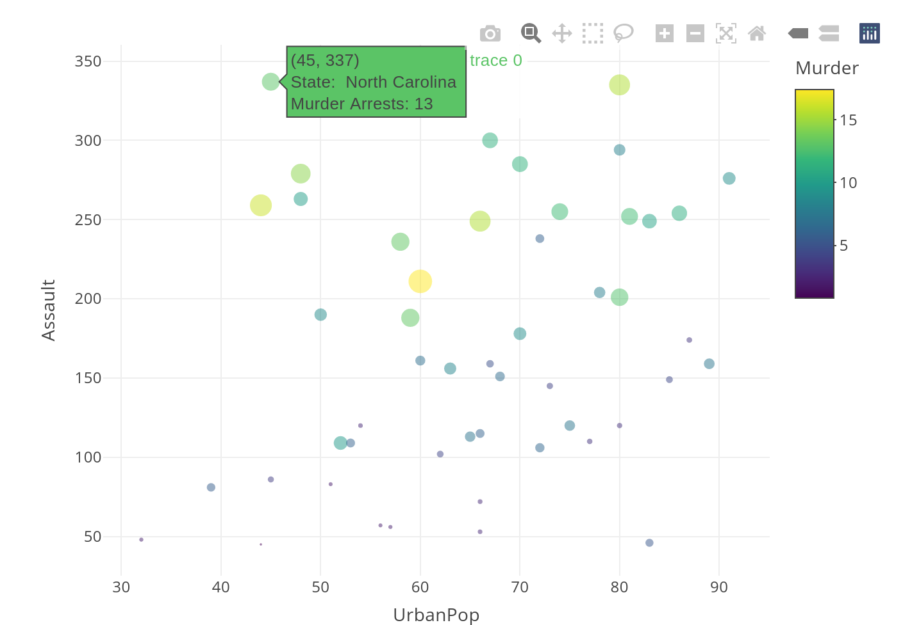

<!---
Last updated: 

--->

# Preface {.unnumbered}

This Rbook introduces business and social science students to statistics with adherence to the [GAISE 2026](https://asacollegegaise.org/recommendations) College Report.
The closest relatives of the book are the Monte Carlo econometrics of @barretohowland2006, the simulation-based statistics texts of @lock2020 and @tintle2020 for Part I, and Békés and Kézdi's *Data Analysis for Business, Economics, and Policy* [-@bekeskezdi2021] for Parts II and III.
Its view of regression is closer to @Leamer1983 and to @angristpischke2008 than to a conventional econometrics text.
This book differs from it's closest relatives in five ways.

**First**, the same data-first approach runs from the first histogram to multivariate regression in R, with resampling for inference throughout.
Students first learn to use and interpret the Histogram, ECDF, and Boxplot (as well as avoid 3D pie charts and chart junk used in business statistics books).
They work with densities and distributions for data before abstract probability theory (initially limited to simple events or intervals, with sums of random variable and transformations available optionally later).
The histogram is introduced as a density estimate with a bandwidth, the same one that later tunes kernel densities and local regressions, so students meet the bias-variance tradeoff early and reuse it.

**Second**, resampling is consistently used for statistical inference.
Here one fundamental theorem underwrites the approach: the empirical distribution converges to the population distribution, so resampling from the data approximates sampling from the population.
Students learn the jackknife, bootstrap, and permutation methods as one family and apply them to any statistic they can compute, including quantiles, distances between distributions, and regression coefficients.
By replace mathematical formulas with simulations, there is less emphasis on probability theory mechanics as well as fewer "t and z drills".
This makes it easy for students to glean insights from data rather than "testimate" about averages.
For example, students compare two groups by visualizing their ECDF's and statistically test for differences in both means and quantiles using the same method.
For another example, students learn local regressions and statistically test mean marginal effects.

**Third**, students learn to ask how a relationship changes across the data.
Starting with conditional averages, they build local regressions and distinguish the average gradient from the gradient at the mean.
This brings the marginal thinking taught in economic theory into empirical analysis.
The approach extends to relationships involving several explanatory variables.
This rectifies a major shortcomings in econometrics education: a disconnect between theory classes that emphasize marginal effects and empirical classes that emphasize average effects.

Economic data often contain relationships across time, across space, and through markets.
Students examine each of these complications, including geographic data and simulated supply-and-demand equilibria.
The market example continues into the experimental chapter, where a cost intervention shifts supply and traces out demand under the model's assumptions.
Students can therefore see how the same economic mechanism creates an identification problem and provides a way to address it.

**Fourth**, students learn "gun safety" throughout, instead of "pull to shoot".
Each method is taught together with the cases where it fails.
The central limit theorem has an example with the Cauchy distribution, the bootstrap is applied to estimate a maximum, and linear regression is applied to non-linear data.
So students actually learn the maxim "all models are wrong" instead of to simply assume $Y=X\beta+\epsilon$ and prove unbiasedness.
Model selection is not an afterthought, and there is an entire chapter on Data Scientism.

The chapter on Data Scientism is unique, and it asks students to construct findings that they know are misleading.
They search for significant results in random data and produce apparently persuasive causal estimates from unrelated time series.
The exercises extend to instrumental variables, regression discontinuities, and difference in differences, showing how specification search and inappropriate assumptions can mislead.

**Fifth**, students learn statistical reporting using Quarto, which research suggests is a good combination for students [1](https://doi.org/10.1080/00220485.2019.1618765) [2](https://doi.org/10.1002/jae.657).
As such, there are many practical examples on how to analyze data interactively and communicate results.
Students gain a conceptual understanding of statistics "out of the gate" and practical skillset that enables students to do more with actual datasets. 

Altogether, students learn to produce statistical analyses of economic data relevant to both the private and public sector, as well as an intuitive foundation for more advanced courses including nonparametric statistics, program evaluation, forecasting, structural econometrics, and more.


## Course Maps {-}
<!-- The course maps below refer to chapters by their rendered number, so update them after adding, removing, or reordering chapters in _quarto.yml. -->

This Rbook is organized into three substantive parts: univariate, bivariate, and multivariate data analysis.
So students learn the theory and practice of univariate statistics before moving to bivariate statistics, rather than mixing uni-and-bivariate content.
This differs from most business textbooks which often introduce both types of data, cover univariate statistics, and return to bivariate statistics much later
This organization also differs from most mathematics textbooks which introduce students to probability theory long before concrete applications.

The three parts are written for a three-course sequence (Stats I, Stats II, Econometrics), but the chapters can be organized for other courses too.
The table below gives some course designs, referring to chapters by their number in the table of contents.
Chapter 1 introduces R, Chapters 2 to 10 make up Part I, Chapters 11 to 21 make up Part II, and Chapters 22 to 30 make up Part III.
Chapters not listed for a design can be skipped.

| Course design | Core chapters | Optional chapters |
|---|---|---|
| Three-course sequence (Stats I, Stats II, Econometrics) | Stats I: 1 to 8. Stats II: 11 to 18, 21. Econometrics: 22 to 29. | Stats I: 9, 10. Stats II: 19, 20. Econometrics: 30. |
| Two-course sequence (Statistics, Econometrics) | Statistics: 1 to 8, 11 to 15, 21. Econometrics: 5, 16 to 18, 22 to 25, 27 to 29. | 26, 30 |
| One-semester business statistics | 1 to 8, 12 to 15, 21, 22 | 18 |
| One-semester econometrics, after a conventional statistics course | 1, 5, 15, 18, 22 to 25, 27 to 29 | 16, 17, 26, 30 |
| Econometrics with a causal inference emphasis | 12, 15, 18, 22 to 24, 27 to 29 | 25, 30 |
| Econometrics with a prediction emphasis | 10, 16, 17, 22, 23, 25, 26, 30 | 21, Appendix A |
| Multivariate early introductory statistics, in teaching order | 1, 2, 22, 12, 3, 5, 7, 8, 14, 15, 18, 21 | 28, 29 |

Every design keeps the textbook aligned with the GAISE College Report, how the chapters are written rather than from their specific order.
Each chapter treats statistics as a process for reaching decisions from evidence: methods are introduced to answer a question, taught by simulation rather than derivation, and paired with the cases where they fail.
Students work in R from Chapter 1 and with real data from Chapter 2, and inference rests on resampling before any formula.
Chapter 21 teaches students to communicate results in a reproducible report, and Chapter 18 gives them the language to state what those results can and cannot support.
Chapter 29 and Appendix A cover the responsible use of data and of AI tools.
Multivariable thinking enters with Simpson's paradox in Chapter 18 and runs through Part III.

Students arriving from a conventional statistics course can skip Chapters 6 to 8 but should still read Chapter 5, since the resampling methods introduced there underlie the later chapters on inference.
Instructors who prefer the parametric route can pull the theory chapters forward: Chapter 9 after Chapter 4, Chapters 19 and 20 after Chapter 15, and the matrix OLS section of Chapter 30 after Chapter 23.
The set theory section of Chapter 9, which includes Bayes' theorem, can even come before Chapter 4 to match a conventional order.
The Multivariate early row moves Chapter 22 ahead of the univariate summaries, following the recommendation of the GAISE College Report to build multivariable thinking in from the start.
Chapter 22 assumes only Chapter 2, so this order works.

Some chapters build on each other, so they are best dropped or moved as a block rather than split.

* Local regression: the kernel density section of Chapter 10, then Chapters 16, 17, and 26.
  Chapter 16 refers back to the kernel density section, so a course that skips Chapter 10 should still assign that one section.
* Causation: the last section of Chapter 15, then Chapters 18, 24, 27, 28, and 29, and the multiple testing section of Chapter 30.
  Chapter 24 also continues the data and ANOVA example from Chapter 13.
* Theory: Chapters 4, 6, 9, 19, and 20.
  Chapter 20 builds on Chapter 19, and both refer back to Chapters 11, 12, 14, and 15 for the empirical counterparts.
* Group comparisons: Chapters 8, 12, 13, and 24.

Three chapters are easy to move to accommodate those course styles style.
Chapter 22 depends only on Chapter 2, so it can be taught as early as the second week.
Chapter 21 depends only on Chapters 1 and 15, so a course built around written reports can cover it early.
Chapter 11 bridges Parts I and II, and some instructors may prefer to go from Chapter 8 directly to Chapter 12 and return to Chapter 11 before Chapter 14.

***

Although any interested reader may find it useful, this Rbook is primarily developed for my students.

If you use this Rbook, please cite
```{r}
#| echo: false
#| results: asis
yr <- format(Sys.Date(), "%Y")
cat(sprintf("```bibtex
@book{Adamson%s_Rbook,
  title={Introductory Economic Statistics: A Data-Driven Approach using R},
  author={Adamson, Jordan},
  year={%s},
  publisher={Bookdown},
  url={https://jadamso.github.io/Rbooks/}
}
```", yr, yr))
```

Please also report any errors or issues at <https://github.com/Jadamso/Rbooks/issues>.

