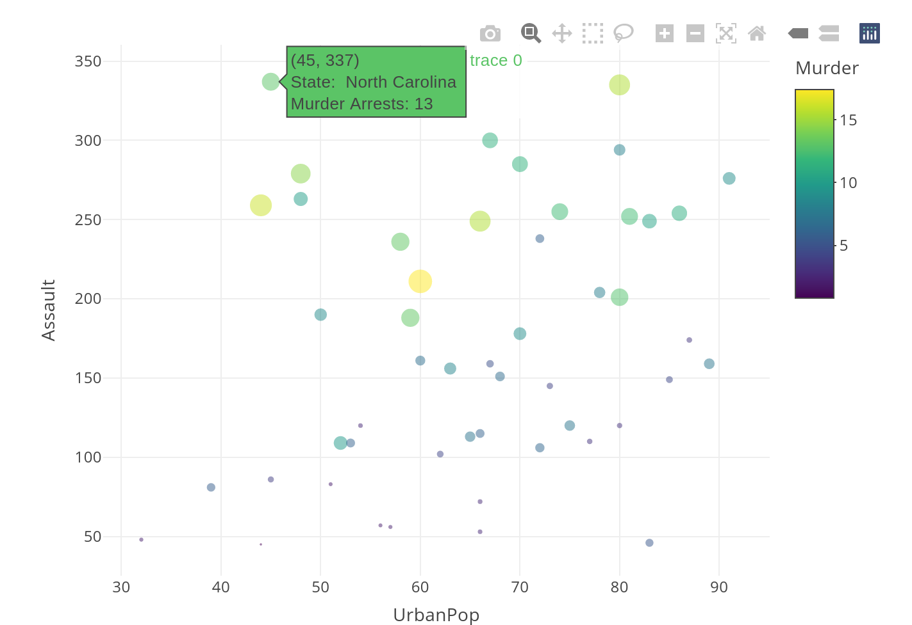

# Preface {#index}

<!--- Add Title Image
  

--->

This [Rbook](https://jadamso.github.io/Rbooks/) contains three primers that should get you started with econometrics in R

 * *Part   I*: Programming in R
 * *Part  II*: Linear Regression in R
 * *Part III*: Reproducible Research in R

Compared to other introductory econometrics books, this Rbook focuses more on simulations. This makes it easy to absorb basic statistical ideas without parametric assumptions and formulas. This Rbook also includes much programming materials, including how to analyze data interactively and communicate results. So, in many ways, it is a modern version of "Introductory Econometrics: Using Monte Carlo Simulation with Microsoft Excel" by Barreto and Howland, updated to give students the best tools for their labor market and adhere to modern statistics [teaching guidelines](https://www.amstat.org/education/curriculum-guidelines-for-undergraduate-programs-in-statistical-science-).

This Rbook also deemphasizes inference with linear models, treating it more as a technical prerequisite for more advanced courses. (We operate under the maxim "All models are wrong" and do not prove unbiasedness.) There is also a novel chapter on "Data scientism" that more clearly illustrates the ways that simplistic approaches can mislead rather than illuminate. Overall, their is a humble view towards what we can infer from statistics alone and hence more room for economic theory in model development and interpretation.

Much material was originally copied from elsewhere and then modified over the years on an ad-hoc basis. Parts I and III synthesize a lot of programming guidance and examples available on the internet, and I include online references when I could (typically at the end of a chapter). Much of Part II originally came from other econometrics textbooks with a parametric or structural focus. In particular, I learned from and still recommend "Introduction to Econometrics" by Stock and Watson (Parts 1,2, and 3) and "Applied Econometrics" by Asterlou (Parts I,II, and III).

Although any interested reader may find it useful, it is being primarily developed for my students. Please report any errors or issues at https://github.com/Jadamso/Rbooks/issues.

Last updated: 26.04.2024

