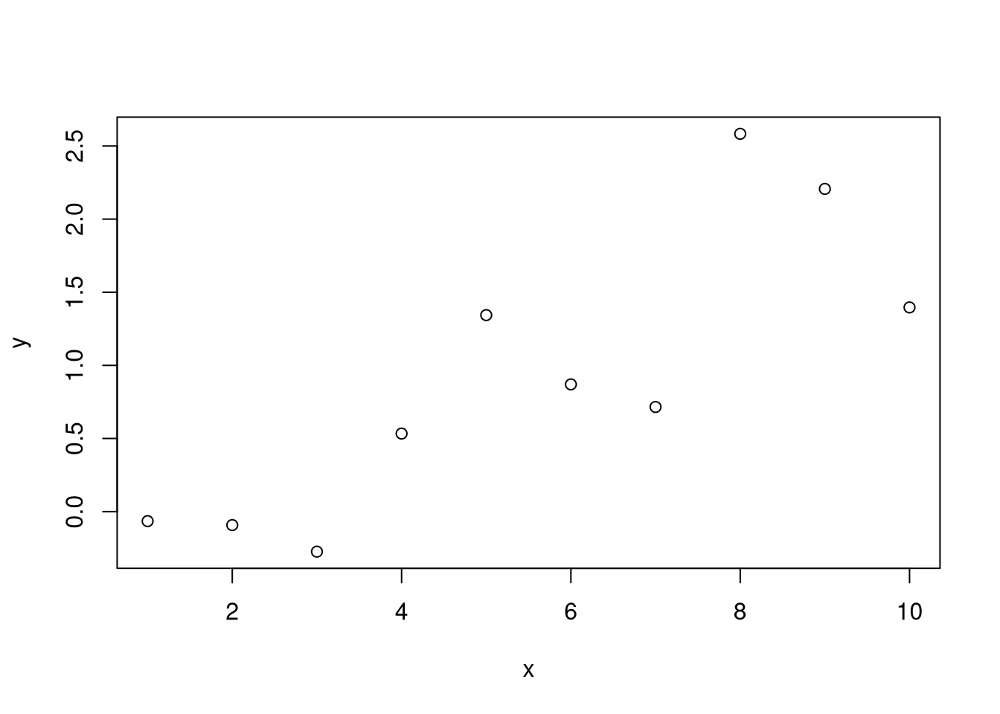
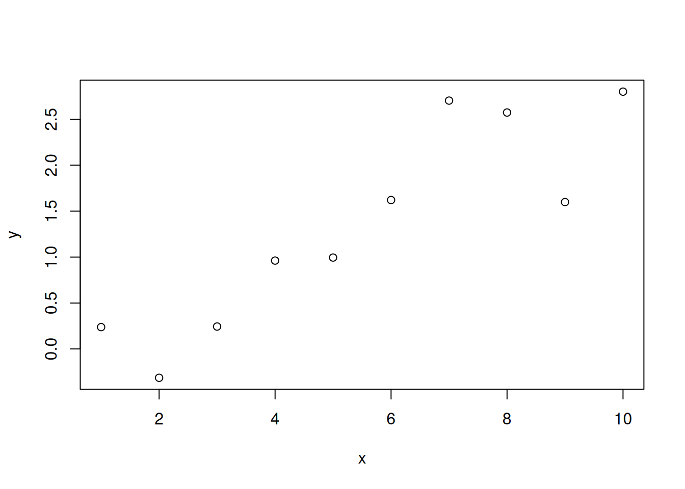
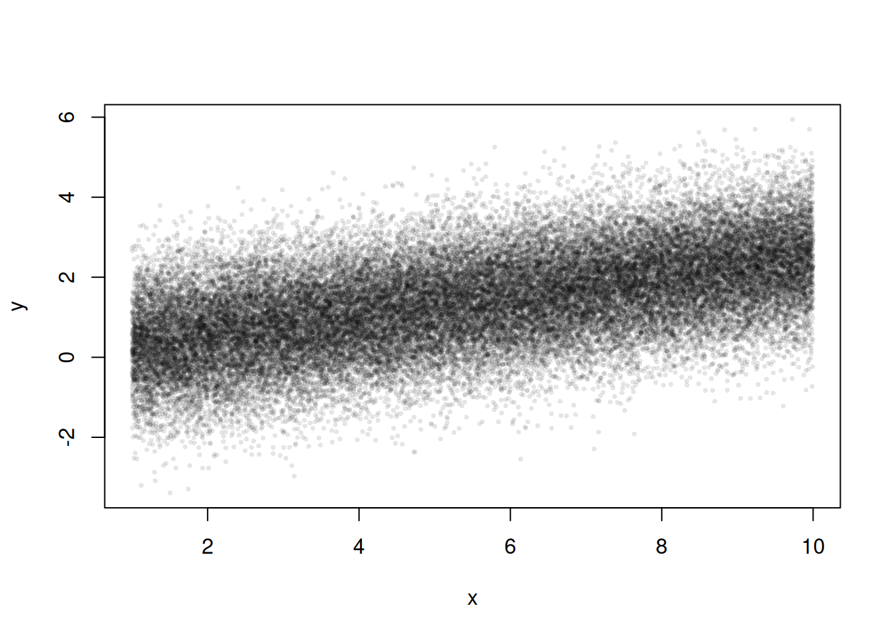
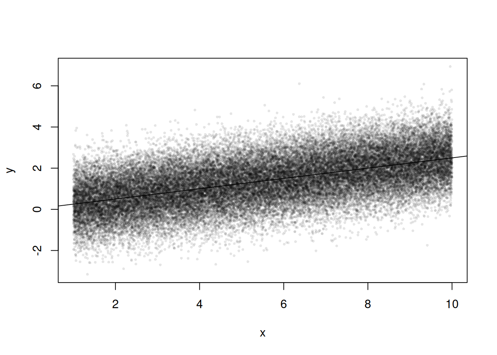

# Preface {#index}

In this book, there are three R primers that should get you going with R in academic research.

 * *Part   I*: Introduction to R
 * *Part  II*: Introduction to Reproducible Research in R
 * *Part III*: Intermediate R

Much of this material was copied or modified from elsewhere, especially https://r4ds.had.co.nz/ and https://adv-r.hadley.nz/ but also many other sources I have found online and elsewhere over the years.


# (PART) Part I {-} 

# First steps on Programming in R 
***


## Install R

Download R and the RStudio GUI

* [R](https://cloud.r-project.org/)
* [Rstudio](https://www.rstudio.com/products/rstudio/download/)


For more help setting up

* https://learnr-examples.shinyapps.io/ex-setup-r/
* https://rstudio-education.github.io/hopr/starting.html
* https://a-little-book-of-r-for-bioinformatics.readthedocs.io/en/latest/src/installr.html
* https://cran.r-project.org/doc/manuals/R-admin.html

* https://courses.edx.org/courses/UTAustinX/UT.7.01x/3T2014/56c5437b88fa43cf828bff5371c6a924/
* https://owi.usgs.gov/R/training-curriculum/installr/
* https://www.earthdatascience.org/courses/earth-analytics/document-your-science/setup-r-rstudio/


## Interfacing with the GUI.

Rstudio is easiest to get going.
(There are other GUI's.)

From https://datacarpentry.org/


* top left is where you write and save code
 * Create and save a new `R Script` file *My_First_Script.R*
 * could also use a plain .txt file.
* below is where you run your code.
* to the right shows files and plots and ...

For all following examples, make sure to both execute and store your code.


Note that 


```r
CodeInput_String <- c('code output looks like this')
CodeInput_String
```

```
## [1] "code output looks like this"
```

```r
## while this is just a comment
```

# Mathematical Objects
***


## Scalars and Vectors


```r
x0 <- 1 ## Your first scalar
x0 ## Print the scalar
```

```
## [1] 1
```

```r
(x0+1)^2 ## Perform and print a simple calculation
```

```
## [1] 4
```

```r
x0 + NA ## often used for missing values
```

```
## [1] NA
```


```r
x <- c(0,1,3,10,6) ## Your First Vector
x ## Print the vector
```

```
## [1]  0  1  3 10  6
```

```r
x[2] ## Print the 2nd Element; 1
```

```
## [1] 1
```

```r
x+2 ## Print simple calculation; 2,3,5,8,12
```

```
## [1]  2  3  5 12  8
```

```r
(x+x)^2 ## Another simple calculation with two vectors;
```

```
## [1]   0   4  36 400 144
```


In R, you use multiple functions on different types of data objects. Moreover, ``typically solve complex problems by decomposing them into simple functions, not simple objects.'' (H. Wickham)


##  Functions of Scalars and Vectors

Define function sum_squared

```r
sum_squared <- function(x1, x2) {
	y <- (x1 + x2)^2
	return(y)
} 
```

```r
sum_squared(1, 3) ## 16
```

```
## [1] 16
```

```r
sum_squared(x, 2) ## 0,4,9,36,144,400
```

```
## [1]   4   9  25 144  64
```

```r
sum_squared(x, NA) ## NA,NA,NA,NA,NA
```

```
## [1] NA NA NA NA NA
```

```r
sum_squared(x, x) ## 0,4,36,144,400
```

```
## [1]   0   4  36 400 144
```


## Random Variables

random variables are vectors

```r
x2 <- runif(1000)
```


## Functionals

Functions that take functions as arguments 


```r
randomise <- function(f){
    f( runif(1e3) )
}
```

```r
randomise(mean)
```

```
## [1] 0.5030783
```

```r
randomise(mean)
```

```
## [1] 0.489226
```

```r
randomise(sum)
```

```
## [1] 507.5291
```


Very useful for applying a function over and over again


```r
## sapply(1:3, f) is equivalent to c(f(1), f(2), f(3)).
## mapply takes multiple vectors
mapply(sum, 1:3, runif(3) )
```

```
## [1] 1.986627 2.943573 3.553065
```

##  Matrices and Matrix-Functions


```r
x_mat <- cbind(x,x)
x_mat ## Print full matrix
```

```
##       x  x
## [1,]  0  0
## [2,]  1  1
## [3,]  3  3
## [4,] 10 10
## [5,]  6  6
```

```r
x_mat[2,] ## Print Row 2 Elements
```

```
## x x 
## 1 1
```

```r
x_mat[,2] ## Print Column 2 Elements
```

```
## [1]  0  1  3 10  6
```

```r
y <- apply(x_mat, 1, sum)^2 ## Apply function to each row
## ?apply  #checks the function details
y - sum_squared(x, x) ## tests if there are any differences
```

```
## [1] 0 0 0 0 0
```

Many Other Functions

```r
x_mat * x_mat
```

```
##        x   x
## [1,]   0   0
## [2,]   1   1
## [3,]   9   9
## [4,] 100 100
## [5,]  36  36
```

```r
crossprod(x_mat)
```

```
##     x   x
## x 146 146
## x 146 146
```

```r
tcrossprod(x_mat) ##x_mat %*% t(x_mat)
```

```
##      [,1] [,2] [,3] [,4] [,5]
## [1,]    0    0    0    0    0
## [2,]    0    2    6   20   12
## [3,]    0    6   18   60   36
## [4,]    0   20   60  200  120
## [5,]    0   12   36  120   72
```

```r
outer(x,x) ##x %o% x
```

```
##      [,1] [,2] [,3] [,4] [,5]
## [1,]    0    0    0    0    0
## [2,]    0    1    3   10    6
## [3,]    0    3    9   30   18
## [4,]    0   10   30  100   60
## [5,]    0    6   18   60   36
```


Example Calculations


```r
## Return Y-value with minimum absolute difference from 3
abs_diff_y <- abs( y - 3 ) 
abs_diff_y ## is this the luckiest number?
```

```
## [1]   3   1  33 397 141
```

```r
min(abs_diff_y)
```

```
## [1] 1
```

```r
which.min(abs_diff_y)
```

```
## [1] 2
```

```r
y[ which.min(abs_diff_y) ]
```

```
## [1] 4
```


## Arrays and Array Functions

generalization of matrices
used in spatial econometrics


```r
a <- array(data = 1:24, dim = c(2, 3, 4))
a
```

```
## , , 1
## 
##      [,1] [,2] [,3]
## [1,]    1    3    5
## [2,]    2    4    6
## 
## , , 2
## 
##      [,1] [,2] [,3]
## [1,]    7    9   11
## [2,]    8   10   12
## 
## , , 3
## 
##      [,1] [,2] [,3]
## [1,]   13   15   17
## [2,]   14   16   18
## 
## , , 4
## 
##      [,1] [,2] [,3]
## [1,]   19   21   23
## [2,]   20   22   24
```

```r
a[1, , , drop = FALSE]  # Row 1
```

```
## , , 1
## 
##      [,1] [,2] [,3]
## [1,]    1    3    5
## 
## , , 2
## 
##      [,1] [,2] [,3]
## [1,]    7    9   11
## 
## , , 3
## 
##      [,1] [,2] [,3]
## [1,]   13   15   17
## 
## , , 4
## 
##      [,1] [,2] [,3]
## [1,]   19   21   23
```

```r
a[, 1, , drop = FALSE]  # Column 1
```

```
## , , 1
## 
##      [,1]
## [1,]    1
## [2,]    2
## 
## , , 2
## 
##      [,1]
## [1,]    7
## [2,]    8
## 
## , , 3
## 
##      [,1]
## [1,]   13
## [2,]   14
## 
## , , 4
## 
##      [,1]
## [1,]   19
## [2,]   20
```

```r
a[, , 1, drop = FALSE]  # Layer 1
```

```
## , , 1
## 
##      [,1] [,2] [,3]
## [1,]    1    3    5
## [2,]    2    4    6
```

```r
a[ 1, 1,  ]  # Row 1, column 1
```

```
## [1]  1  7 13 19
```

```r
a[ 1,  , 1]  # Row 1, "layer" 1
```

```
## [1] 1 3 5
```

```r
a[  , 1, 1]  # Column 1, "layer" 1
```

```
## [1] 1 2
```

```r
a[1 , 1, 1]  # Row 1, column 1, "layer" 1
```

```
## [1] 1
```

apply extends to arrays


```r
apply(a, 1, mean)    # Row means
```

```
## [1] 12 13
```

```r
apply(a, 2, mean)    # Column means
```

```
## [1] 10.5 12.5 14.5
```

```r
apply(a, 3, mean)    # "Layer" means
```

```
## [1]  3.5  9.5 15.5 21.5
```

```r
apply(a, 1:2, mean)  # Row/Column combination 
```

```
##      [,1] [,2] [,3]
## [1,]   10   12   14
## [2,]   11   13   15
```


##  Other Commom Types of Data


```r
l1 <- 1:10 ## cardinal numbers
l2 <- factor(c(1,2,3), ordered=T) ## ordinal numbers, "indicator names"
l3 <- 'hello world'  ## character strings
l4 <- list(l1, l2, list(l3, 'way too late')) ## lists

## data.frames: your most common data type
    ## matrix of different data-types
    ## well-ordered lists
l5 <- data.frame(x=l1, y=l1)
```


# Plots
***


## Basics

Create and Plot a Toy Dataset


```r
x <- seq(1,10) ## create values for x
## Create random standard-normal noise
rnorm(length(x), mean=0, sd=1) ## noise 
```

```
##  [1]  1.44606736 -0.84737514  0.03205615 -0.33755940 -0.06474346  0.18798242
##  [7]  1.43840611 -0.27501136  0.58590719  0.50618422
```

```r
rnorm(length(x), mean=0, sd=1) ## new noise
```

```
##  [1] -1.5360179  0.6291917  1.2981726  0.5069942  0.5474447  1.6177128
##  [7] -0.2642064 -0.5807416 -0.5926778 -0.1593475
```

```r
e <- rnorm(length(x), mean=0, sd=1) ## store 
y <- .25*x + e ## create values for y
xy_mat <- cbind(x=x, y=y)

## your first plot is pretty standard
plot(y~x, xy_mat)  ## pretty and standard
```




Create and Plot a Larger Toy Dataset


```r
x <- seq(1, 10, by=.0002)
e <- rnorm(length(x), mean=0, sd=1)
y <- .25*x + e
xy_dat <- data.frame(x=x, y=y)
head(xy_dat)
```

```
##        x          y
## 1 1.0000  0.3599908
## 2 1.0002  1.0104017
## 3 1.0004  0.3804610
## 4 1.0006  1.3374703
## 5 1.0008  1.4840175
## 6 1.0010 -0.2223943
```

```r
plot(y~x, xy_dat, pch=16, col=rgb(0,0,0,.1), cex=.5)
```




##  Equation Fitting Example


Run and Plot an OLS Regression


```r
reg <- lm(y~x, data=xy_dat)
summary(reg)
```

```
## 
## Call:
## lm(formula = y ~ x, data = xy_dat)
## 
## Residuals:
##     Min      1Q  Median      3Q     Max 
## -4.2659 -0.6726  0.0016  0.6688  3.9411 
## 
## Coefficients:
##             Estimate Std. Error t value Pr(>|t|)    
## (Intercept) 0.008538   0.010989   0.777    0.437    
## x           0.249222   0.001807 137.956   <2e-16 ***
## ---
## Signif. codes:  0 '***' 0.001 '**' 0.01 '*' 0.05 '.' 0.1 ' ' 1
## 
## Residual standard error: 0.9957 on 44999 degrees of freedom
## Multiple R-squared:  0.2972,	Adjusted R-squared:  0.2972 
## F-statistic: 1.903e+04 on 1 and 44999 DF,  p-value: < 2.2e-16
```

```r
## Add the line of best fit
plot(y~x, xy_dat, pch=16, col=rgb(0,0,0,.1), cex=.5)
abline(reg)
```



```r
## Can Also Add Confidence Intervals
## https://rpubs.com/aaronsc32/regression-confidence-prediction-intervals
```


Polish and Export Your Plot


```r
plot(y~x, xy_dat, pch=16, col=rgb(0,0,0,.1), cex=.5,
    xlab='', ylab='') ## Format Axis Labels Seperately
mtext('y=0.25 x + e\n e ~ standard-normal', 2, line=2)
mtext('x=[1,...,10]', 1, line=2)
title('Plot like a Boss')
title('boss: american slang for excellent; outstanding',
    cex.main=.5, font=1, line=1)
legend('topleft', legend='single data point',
    title='do you see the normal distribution?',
    pch=16, col=rgb(0,0,0,.1), cex=.5)
```




Can export figure with specific dimensions

```r
pdf( 'Figures/plot_example.pdf', height=5, width=5)
plot(y~x, xy_dat, pch=16, col=rgb(0,0,0,.1), cex=.5)
dev.off()
```


# Moving beyond the basics
***


Use expansion `packages` for common procedures and more functionality

```r
## Other packages used in this primer
install.packages("stargazer")
install.packages("reshape2")
install.packages("purrr")
```


The most common tasks have [cheatsheets](https://www.rstudio.com/resources/cheatsheets/) you can use. E.g., 

* https://github.com/rstudio/cheatsheets/blob/main/rstudio-ide.pdf


Sometimes you will want to install a package from GitHub. For this, you can use [devtools](https://devtools.r-lib.org/)

```r
install.packages("devtools")
```


## Task Views

Task views list relevant packages. E.g., 


For all students and early researchers, 

* https://cran.r-project.org/web/views/ReproducibleResearch.html


For microeconometrics,

* https://cran.r-project.org/web/views/Econometrics.html


For spatial econometrics 

* https://cran.r-project.org/web/views/Spatial.html
* https://cran.r-project.org/web/views/SpatioTemporal.html


Multiple packages may have the same function name for different commands. 
In this case use ``package::function_name`` to specify the package


**Don't fret** Sometimes there is not a specific package for your data.

Odds are, you can do most of what you want with base code.

* Packages just wrap base code in convient formats
* see https://cran.r-project.org/web/views/ for topical overviews

Statisticians might have different naming conventions

* if the usual software just spits out a nice plot
you might have to dig a little to know precisely what you want
* your data are fundamentally numbers, strings, etc...
You only have to figure out how to read it in.


But remember that many of the best plots are custom made (see https://www.r-graph-gallery.com/),
and can also be interactive or animated

* https://plotly.com/r/
* https://shiny.rstudio.com/gallery/


## Introductions to R

There are many good yet free programming books online. E.g., 

* https://cran.r-project.org/doc/manuals/R-intro.html
* R Graphics Cookbook, 2nd edition. Winston Chang. 2021. https://r-graphics.org/
* Spatial Data Science with R: Introduction to R. Robert J. Hijmans. 2021. https://rspatial.org/intr/index.html
* R for Data Science. H. Wickham and G. Grolemund. 2017. https://r4ds.had.co.nz/index.html
* An Introduction to R. W. N. Venables, D. M. Smith, R Core Team. 2017. https://colinfay.me/intro-to-r/


There are also many good yet free-online tutorials and courses. E.g., \\

* https://rafalab.github.io/dsbook/
* https://moderndive.com/foreword.html
* https://rstudio.cloud/learn/primers/1.2
* https://cran.r-project.org/manuals.html
* https://stats.idre.ucla.edu/stat/data/intro_r/intro_r_interactive_flat.html
* https://cswr.nrhstat.org/app-r

What we covered in this primer should be enough to get you going.


# Data analysis examples
***

## US Gov't Spending on Science


Lets inspect some spurious correlations inside https://tylervigen.com/spurious-correlations


```r
## Your data is not made up in the computer (hopefully!)
## will normally be an address on your PC
vigen_csv <- read.csv( paste0(
'https://raw.githubusercontent.com/the-mad-statter/',
'whysospurious/master/data-raw/tylervigen.csv') ) 
class(vigen_csv)
```

```
## [1] "data.frame"
```

```r
names(vigen_csv)
```

```
##  [1] "year"                         "science_spending"            
##  [3] "hanging_suicides"             "pool_fall_drownings"         
##  [5] "cage_films"                   "cheese_percap"               
##  [7] "bed_deaths"                   "maine_divorce_rate"          
##  [9] "margarine_percap"             "miss_usa_age"                
## [11] "steam_murders"                "arcade_revenue"              
## [13] "computer_science_doctorates"  "noncom_space_launches"       
## [15] "sociology_doctorates"         "mozzarella_percap"           
## [17] "civil_engineering_doctorates" "fishing_drownings"           
## [19] "kentucky_marriage_rate"       "oil_imports_norway"          
## [21] "chicken_percap"               "train_collision_deaths"      
## [23] "oil_imports_total"            "pool_drownings"              
## [25] "nuclear_power"                "japanese_cars_sold"          
## [27] "motor_vehicle_suicides"       "spelling_bee_word_length"    
## [29] "spider_deaths"                "math_doctorates"             
## [31] "uranium"
```

```r
vigen_csv[1:5,1:5]
```

```
##   year science_spending hanging_suicides pool_fall_drownings cage_films
## 1 1996               NA               NA                  NA         NA
## 2 1997               NA               NA                  NA         NA
## 3 1998               NA               NA                  NA         NA
## 4 1999            18079             5427                 109          2
## 5 2000            18594             5688                 102          2
```

```r
## similar `apply' functions
lapply(vigen_csv[,1:5], class) ## like apply, but for lists
```

```
## $year
## [1] "integer"
## 
## $science_spending
## [1] "integer"
## 
## $hanging_suicides
## [1] "integer"
## 
## $pool_fall_drownings
## [1] "integer"
## 
## $cage_films
## [1] "integer"
```

```r
sapply(vigen_csv[,1:5], class) ## lapply, formatted to a vector
```

```
##                year    science_spending    hanging_suicides pool_fall_drownings 
##           "integer"           "integer"           "integer"           "integer" 
##          cage_films 
##           "integer"
```


The US government spending on science is ruining cinema
(p<.001)!


```r
## Drop Data before 1999
vigen_csv <- vigen_csv[vigen_csv$year >= 1999,] 

## Run OLS Regression $
reg1 <-  lm(cage_films ~ -1 + science_spending,
    data=vigen_csv)
summary(reg1)
```

```
## 
## Call:
## lm(formula = cage_films ~ -1 + science_spending, data = vigen_csv)
## 
## Residuals:
##     Min      1Q  Median      3Q     Max 
## -1.7670 -0.7165  0.1447  0.7890  1.4531 
## 
## Coefficients:
##                   Estimate Std. Error t value Pr(>|t|)    
## science_spending 9.978e-05  1.350e-05    7.39 2.34e-05 ***
## ---
## Signif. codes:  0 '***' 0.001 '**' 0.01 '*' 0.05 '.' 0.1 ' ' 1
## 
## Residual standard error: 1.033 on 10 degrees of freedom
##   (1 observation deleted due to missingness)
## Multiple R-squared:  0.8452,	Adjusted R-squared:  0.8297 
## F-statistic: 54.61 on 1 and 10 DF,  p-value: 2.343e-05
```


It's not all bad, people in maine stay married longer.


```r
plot.new()
plot.window(xlim=c(1999, 2009), ylim=c(7,9))
lines(log(maine_divorce_rate*1000)~year, data=vigen_csv)
lines(log(science_spending/10)~year, data=vigen_csv, lty=2)
axis(1)
axis(2)
legend('topright', lty=c(1,2), legend=c(
    'log(maine_divorce_rate*1000)',
    'log(science_spending/10)'))
```


For more intuition on spurious correlations, try http://shiny.calpoly.sh/Corr_Reg_Game/


```r
par(mfrow=c(1,2), mar=c(2,2,2,1))
plot.new()
plot.window(xlim=c(1999, 2009), ylim=c(5,9)*1000)
lines(science_spending/3~year, data=vigen_csv, lty=1, col=2, pch=16)
text(2003, 8200, 'US spending on science, space, technology (USD/3)', col=2, cex=.6, srt=30)
lines(hanging_suicides~year, data=vigen_csv, lty=1, col=4, pch=16)
text(2004, 6500, 'US Suicides by hanging, strangulation, suffocation (Deaths)', col=4, cex=.6, srt=30)
axis(1)
axis(2)


plot.new()
plot.window(xlim=c(2002, 2009), ylim=c(0,5))
lines(cage_films~year, data=vigen_csv[vigen_csv$year>=2002,], lty=1, col=2, pch=16)
text(2006, 0.5, 'Number of films with Nicolas Cage (Films)', col=2, cex=.6, srt=0)
lines(pool_fall_drownings/25~year, data=vigen_csv[vigen_csv$year>=2002,], lty=1, col=4, pch=16)
text(2006, 4.5, 'Number of drownings by falling into pool (US Deaths/25)', col=4, cex=.6, srt=0)
axis(1)
axis(2)
```


And don't Forget ``if you torture the data long enough, it will confess.''


```r
## Include an intercept to regression 1
reg2 <-  lm(cage_films ~ science_spending, data=vigen_csv)
library(stargazer)
```

```
## 
## Please cite as:
```

```
##  Hlavac, Marek (2022). stargazer: Well-Formatted Regression and Summary Statistics Tables.
```

```
##  R package version 5.2.3. https://CRAN.R-project.org/package=stargazer
```

```r
stargazer(reg1, reg2, type='text')
```

```
## 
## ============================================================
##                               Dependent variable:           
##                     ----------------------------------------
##                                    cage_films               
##                              (1)                  (2)       
## ------------------------------------------------------------
## science_spending          0.0001***             0.0001      
##                           (0.00001)            (0.0001)     
##                                                             
## Constant                                        -0.140      
##                                                 (2.166)     
##                                                             
## ------------------------------------------------------------
## Observations                  11                  11        
## R2                          0.845                0.124      
## Adjusted R2                 0.830                0.026      
## Residual Std. Error    1.033 (df = 10)      1.089 (df = 9)  
## F Statistic         54.609*** (df = 1; 10) 1.271 (df = 1; 9)
## ============================================================
## Note:                            *p<0.1; **p<0.05; ***p<0.01
```

Nevertheless, data transformation is often necessary before regression analysis.
For downloading tips, see https://raw.githubusercontent.com/rstudio/cheatsheets/main/data-import.pdf


<!--\url{https://github.com/rstudio/cheatsheets/raw/master/data-transformation.pdf}-->


## Data processing simulation

Make random datasets


```r
make_noisy_data <- function(n){
    x <- seq(1,10, length.out=n)
    e <- rnorm(length(x), mean=0, sd=10)
    y <- .25*x + e
    xy_mat <- data.frame(ID=seq(x),x=x, y=y)
    return(xy_mat)
}
dat1 <- make_noisy_data(6)
dat1
```

```
##   ID    x          y
## 1  1  1.0 -6.1470347
## 2  2  2.8  4.2699058
## 3  3  4.6 29.2882246
## 4  4  6.4 -2.4522214
## 5  5  8.2 -0.6208467
## 6  6 10.0  3.8648116
```

```r
dat2 <- make_noisy_data(6)
## merging data in wide format
dat_merged_wide <- merge(dat1, dat2,
    by='ID', suffixes=c('.1','.2'))
```


Data Merging


```r
## merging data in long format and reshaping to wide
dat_merged_long <- rbind( cbind(dat1,DF=1),cbind(dat2,DF=2))
library(reshape2)
dat_melted <- melt(dat_merged_long, id.vars=c('ID', 'DF'))
dat_merged_wide2 <- dcast(dat_melted, ID~DF+variable)

dat_merged_wide == dat_merged_wide2
```

```
##        ID  x.1  y.1  x.2  y.2
## [1,] TRUE TRUE TRUE TRUE TRUE
## [2,] TRUE TRUE TRUE TRUE TRUE
## [3,] TRUE TRUE TRUE TRUE TRUE
## [4,] TRUE TRUE TRUE TRUE TRUE
## [5,] TRUE TRUE TRUE TRUE TRUE
## [6,] TRUE TRUE TRUE TRUE TRUE
```


<!-- ## CONVERT IMAGES
for pdfile in *.pdf ; do 
convert -verbose -density 500  "${pdfile}" "${pdfile%.*}".png;
done
-->

## Custom figures


# Latest versions
***

Make sure your packages are up to date

```r
update.packages()
```

Make sure you have the latest version of R for class. If not, then reinstall R.


After reinstalling, you can update *all* packages stored in *all* `.libPaths()` with the following command


```r
pkgs <- installed.packages( .libPaths() )[,'Package']
install.packages(
    pkgs=pkgs,
    lib=.libPaths()[1],
    type='source'
)
```

To find all broken packages after an update

```r
library(purrr)

set_names(.libPaths()) %>%
  map(function(lib) {
    .packages(all.available = TRUE, lib.loc = lib) %>%
        keep(function(pkg) {
            f <- system.file('Meta', 'package.rds', package = pkg, lib.loc = lib)
            tryCatch({readRDS(f); FALSE}, error = function(e) TRUE)
        })
  })
## https://stackoverflow.com/questions/31935516/installing-r-packages-error-in-readrdsfile-error-reading-from-connection/55997765
```


