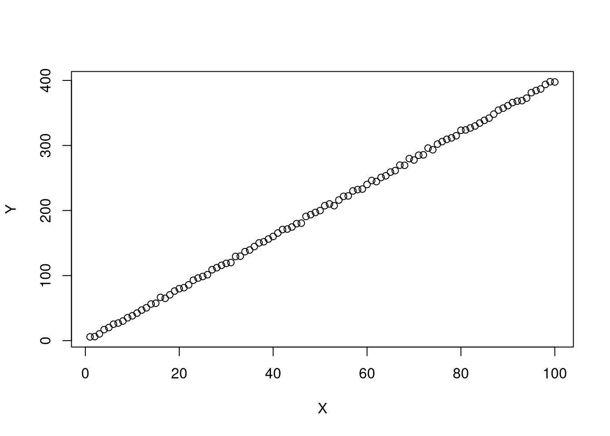
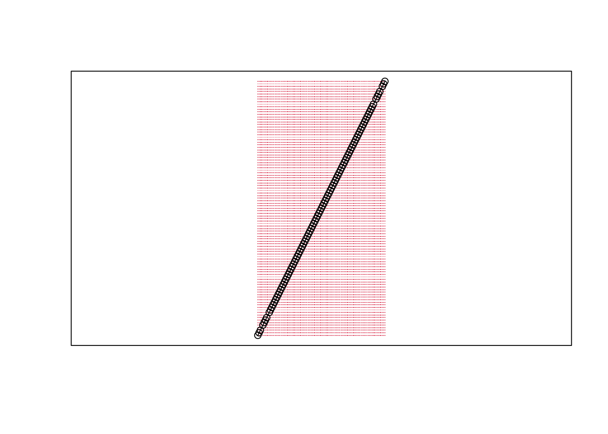

# (PART) Introduction to Reproducible R {-} 

# Why be reproducible 
***

It is in your own self-interest.  

## An example workflow

Taking First Steps ...

**Step 1: Some Ideas and Data**

$X_{1} \to Y_{1}$

* You copy some data into a spreadsheet
* do some calculations and tables the same spreadsheet
* some other analysis from here and there, using this software and that.

**Step 2: Persuing the lead for a week or two**

* you beef up the data you got
* add some other types of data 
* copy in a spreadsheet data, manually aggregate
* do some more calculations and tables, same as before


Then, a Little Way Down the Road ...

**1 month later, someone asks about another factor:** $X_{2}$

* You repeat **Step 2** with some data on $X_{2}$.
* The details from your "point and click" method are a bit fuzzy.

It takes a little time, but you successfully redo the analysis.


**4 months later, someone asks about another factor:** $X_{3}\to Y_{1}$

* You again repeat **Step 2** with some data on $X_{3}$.
* You're pretty sure
  * it's the latest version of the spreadsheet.
  * none of tables your tried messed up the order of the rows or columns.

It takes more time -- the data processing was not transparent.


**6 months later, you want to explore:** $X_{2} \to Y_{2}$.

* You found out Excel had some bugs in it's statistical calculations (see e.g., https://biostat.app.vumc.org/wiki/pub/Main/TheresaScott/StatsInExcel.TAScot.handout.pdf).


**2 years later, you want to replicate:** $\{ X_{1}, X_{2}, X_{3} \} \to Y_{1}$


* A rival has proposed an alternative theory. Their idea doesn't actually make any sense, but their visuals are better and statistics are more sophisticated.
* You don't even have that computer anymore.
* A collaborator who handled the data on $X_{2}$ has moved on.


## An alternative workflow

Suppose you decided to code what you did beginning with Step 2.

**It doesn't take much time to update or replicate your results.**

* Your computer runs for 2 hours and reproduces the figures and tables.
(You wrote your big calculations to use multiple cores and this saved 6 hours--each time.)
* You decided to add some more data, and it adds almost no time.
* You see the exact steps you took and found an error
(glad you found it before publication!)


**Your results are transparent and easier to build on.**

* You easily see that not much has changed with the new data.
* You try out a new plot you found in *The Visual Display of Quantitative Information*, by Edward Tufte.
  * It's not a standard plot, but google answers most of your questions.
  * Tutorials help avoid bad practices, such as plotting 2D data as a 3D object (see e.g., https://clauswilke.com/dataviz/no-3d.html).
* You try out an obscure statistical approach that's hot in your field.
  * it doesn't make the paper, but you have some confidence that candidate issue isn't a big problem


# Small Scale Projects
***


## Types of Projects

HW assignments are small scale projects. We will create these little reports using R markdown to be almost entirely self-contained (showing both code and output).

Posters and presentations are another important type of scientific document. R markdown is also good at creating both of these, and actually *very* good with some additional packages. So we will also use [flexdashboard](https://pkgs.rstudio.com/flexdashboard/) for posters and [beamer]( https://bookdown.org/yihui/rmarkdown/beamer-presentation.html) for presentions. (Click the links for guides on using these tools.)


## Why R and R-Markdown

Note that

* R is our software
* Rstudio is our GUI
* R-markdown is our document

R and R markdown are also both languages: R studio interprets R code to produce statistics, R studio interprets R markdown code to produce pretty documents which contain both writing and statistics. You should already be a bit familiar with R, but not necessarily R Markdown. So to get you started, you should first read and work through this document, and then recreate it yourself as a litte tutorial. Before hopping into programming, however, understand why you will learn to program in both R and R-markdown languages


Good for complex stats, concise figures, and coherent organization.

* Built and developed by applied statisticians for statistics.
* Used by many in academia and industry.


Good for reproducible research 

* http://www.r-bloggers.com/the-reproducibility-crisis-in-science-and-prospects-for-r/
* http://fmwww.bc.edu/GStat/docs/pointclick.html
* https://github.com/qinwf/awesome-R\#reproducible-research
* A Guide to Reproducible Code in Ecology and Evolution
* https://biostat.app.vumc.org/wiki/pub/Main/TheresaScott/ReproducibleResearch.TAScott.handout.pdf


Good for teaching

* https://doi.org/10.1080/00220485.2019.1618765
* https://doi.org/10.1002/jae.657


Good for getting a job

* As a student, think about labour demand. R skills, unlike other purely academic software, is something future employers use and want. Do more of your own research on this to understand how much to invest.


## HW Example {.tabset}
Below is a template of what questions (and answers) look like. 

Install any required packages

```r
## Packages for Rmarkdown
install.packages("knitr")
install.packages("rmarkdown")
install.packages("bookdown")

## Other packages used in this primer
install.packages("plotly")
install.packages("sf")
```

### Question1
Simulate 100 random observations of the form $y=x\beta+\epsilon$ and plot the relationship. Play around with different styles, https://www.r-graph-gallery.com/13-scatter-plot.html, to best express your point.

*Answer*
I simulate $400$ observations for $\epsilon \sim 2\times N(0,1)$ and $\beta=4$, as seen in this single chunk of code. Notice the upward trend.

```r
n <- 100
E <- rnorm(n)
X <- seq(n)
Y <- 4*X + 2*E
plot(Y~X)
```



### Question 2
Explore the data interactively via plotly, https://plotly.com/r/line-and-scatter/.

*Answer*
Again, notice the upward trend.

```r
library(plotly)
plot_ly( data=data.frame(X=X,Y=Y), x=~X, y=~Y)
```

```{=html}
<div id="htmlwidget-300f2681c7b70ea7ba4b" style="width:672px;height:480px;" class="plotly html-widget"></div>
<script type="application/json" data-for="htmlwidget-300f2681c7b70ea7ba4b">{"x":{"visdat":{"433c4af5754":["function () ","plotlyVisDat"]},"cur_data":"433c4af5754","attrs":{"433c4af5754":{"x":{},"y":{},"alpha_stroke":1,"sizes":[10,100],"spans":[1,20]}},"layout":{"margin":{"b":40,"l":60,"t":25,"r":10},"xaxis":{"domain":[0,1],"automargin":true,"title":"X"},"yaxis":{"domain":[0,1],"automargin":true,"title":"Y"},"hovermode":"closest","showlegend":false},"source":"A","config":{"modeBarButtonsToAdd":["hoverclosest","hovercompare"],"showSendToCloud":false},"data":[{"x":[1,2,3,4,5,6,7,8,9,10,11,12,13,14,15,16,17,18,19,20,21,22,23,24,25,26,27,28,29,30,31,32,33,34,35,36,37,38,39,40,41,42,43,44,45,46,47,48,49,50,51,52,53,54,55,56,57,58,59,60,61,62,63,64,65,66,67,68,69,70,71,72,73,74,75,76,77,78,79,80,81,82,83,84,85,86,87,88,89,90,91,92,93,94,95,96,97,98,99,100],"y":[3.82619082178865,11.7926245793321,10.7104697118465,16.250333670806,23.0241812812261,22.7894462715911,27.886427578257,35.9522655556235,37.3281713762186,37.2384336130991,44.699053392637,48.220083240748,50.9158163678115,53.3882021582273,59.8206856626356,63.0367547779039,69.750961626237,71.4708147350288,74.76941758311,77.7972417621059,85.9043886136512,89.5363933751167,92.3514866503292,95.9518584472553,100.913812240866,104.07836174585,110.109139218946,111.624887384733,117.299130947213,122.869864127436,122.331059641271,127.901173798679,131.867547082812,135.159759487661,143.471393976142,144.841163184636,150.019173223962,149.519640643921,158.528157091682,157.764200809572,156.99081871969,167.930203872697,172.560717236585,179.084809426604,183.709761719913,182.97656023269,184.165833548044,193.129079922032,197.229894068229,201.526675446243,205.074736852277,209.844925478387,209.830767071265,215.028217085772,222.232645786826,223.284446594357,231.011234865543,232.259146974145,231.389696279525,241.744767120573,243.773913254655,251.373684367531,252.544556536674,253.216952519416,257.128154510161,262.668649680966,269.83842334179,270.537213646476,278.831044286555,280.185316989806,284.07718336554,288.258716211018,292.572571977932,296.704642193413,297.247193808027,305.670613099929,306.253002778043,311.314486738404,313.507937259995,321.501874124189,324.02135184309,328.334917776692,331.931094695104,335.688134961775,340.876283305205,345.92300489578,346.021878771353,351.734629656335,356.344910503335,359.260452901654,364.530031797313,368.812057213094,372.413180867757,376.580295999565,382.516580559052,382.262298839297,390.156101142359,394.081076701356,397.928417477193,401.388545182329],"type":"scatter","mode":"markers","marker":{"color":"rgba(31,119,180,1)","line":{"color":"rgba(31,119,180,1)"}},"error_y":{"color":"rgba(31,119,180,1)"},"error_x":{"color":"rgba(31,119,180,1)"},"line":{"color":"rgba(31,119,180,1)"},"xaxis":"x","yaxis":"y","frame":null}],"highlight":{"on":"plotly_click","persistent":false,"dynamic":false,"selectize":false,"opacityDim":0.2,"selected":{"opacity":1},"debounce":0},"shinyEvents":["plotly_hover","plotly_click","plotly_selected","plotly_relayout","plotly_brushed","plotly_brushing","plotly_clickannotation","plotly_doubleclick","plotly_deselect","plotly_afterplot","plotly_sunburstclick"],"base_url":"https://plot.ly"},"evals":[],"jsHooks":[]}</script>
```

### Question 3
Verify the definition of a line segment for points $A=(0,3), B=(1,5)$ using a $101 \times 101$ grid. Recall a line segment is all points $s$ that have $d(s, A) + d(s, B) = d(A, B)$.

*Answer* 

```r
library(sf)
s_1 <- c(0,3)
s_2 <- c(1,5)
Seg1 <- st_linestring( rbind(s_1,s_2) )
grid_pts <- expand.grid(
    x=seq(s_1[1],s_2[1], length.out=101),
    y=seq(s_1[2],s_2[2], length.out=101)
)

Seg1_dist <- dist( Seg1 )
grid_pts$dist <- apply(grid_pts, 1, function(s){
    dist( rbind(s,s_1) ) + dist( rbind(s,s_2) ) })
grid_pts$seg <- grid_pts$dist == Seg1_dist

D_point_seg <- st_multipoint( as.matrix(grid_pts[grid_pts$seg==T,1:2]) ) 
D_point_notseg <- st_multipoint( as.matrix(grid_pts[grid_pts$seg==F,1:2]) ) 

plot(Seg1)
points(D_point_notseg, col=2, pch='.')
points(D_point_seg)
box()
```




# Medium Scale Projects
***

As you scale up to a medium sized project, however, you will have to be more organized.


Medium sized projects should have their own `Project` folder on your computer with files, subdirectories with files, and subsubdirectories with files. It should look like this
```
Project
    └── README.txt
    └── /Code
        └── MAKEFILE.R
        └── RBLOCK_001_DataClean.R
        └── RBLOCK_002_Figures.R
        └── RBLOCK_003_ModelsTests.R
        └── RBLOCK_004_Robust.R
        └── /Logs
            └── MAKEFILE.Rout
    └── /Data
        └── /Raw
            └── Source1.csv
            └── Source2.shp
            └── Source3.txt
        └── /Clean
            └── AllDatasets.Rdata
            └── MainDataset1.Rds
            └── MainDataset2.csv
    └── /Output
        └── MainFigure.pdf
        └── AppendixFigure.pdf
        └── MainTable.tex
        └── AppendixTable.tex
    └── /Writing
        └── /TermPaper
            └── TermPaper.tex
            └── TermPaper.bib
            └── TermPaper.pdf
        └── /Slides
            └── Slides.Rmd
            └── Slides.html
            └── Slides.pdf
        └── /Poster
            └── Poster.Rmd
            └── Poster.html
            └── Poster.pdf
        └── /Proposal
            └── Proposal.Rmd
            └── Proposal.html
            └── Proposal.pdf
```


## MAKEFILE

There are two main meta-files

* `README.txt` overviews the project structure and what the codes are doing
* `MAKEFILE` explicitly describes and executes all codes. 


If all code is written with the same program, the makefile can be written in that programs code: `MAKEFILE.R`, which looks like

```r
### Project Structure
home_dir    <- path.expand("~/Desktop/Project/")

data_dir    <- paste0(home_dir, "Data/")
data_dir_r  <- paste0(data_dir, "Raw/")
data_dir_c  <- paste0(data_dir, "Clean/")

out_dir  <- paste0(hdir, "Output/")

code_dir  <- paste0(hdir, "Code/")


### Execute Codes
set.wd( code_dir )
source( "RBLOCK_001_DataClean.R" )
source( "RBLOCK_002_Figures.R" )
source( "RBLOCK_003_ModelsTests.R" )
source( "RBLOCK_004_Robust.R" )
```


If some folders or files are not created, you can do this within R

```r
# create directory called 'Data'
dir.create('Data')

# list the files and directories
list.files(recursive=TRUE, include.dirs=TRUE)
```


## Logging/Sinking

You can then execute the makefile within R and log the output. Either by 

1. Inserting some code that logs/sinks the output 

```r
### Project Structure
home_dir    <- path.expand("~/Desktop/Project/")

data_dir    <- paste0(home_dir, "Data/")
data_dir_r  <- paste0(data_dir, "Raw/")
data_dir_c  <- paste0(data_dir, "Clean/")

out_dir  <- paste0(hdir, "Output/")

code_dir  <- paste0(hdir, "Code/")

### Log Output
set.wd( code_dir )
sink("MAKEFILE.Rout", append=TRUE, split=TRUE)

### Execute Codes
source( "RBLOCK_001_DataClean.R" )
source( "RBLOCK_002_Figures.R" )
source( "RBLOCK_003_ModelsTests.R" )
source( "RBLOCK_004_Robust.R" )

### Stop Logging Output
sink()
```

2. Starting a session that logs/sinks you sourcing the makefile

```r
sink("MAKEFILE.Rout", append=TRUE, split=TRUE)
source("MAKEFILE.R")
sink()
```

3. Execute the makefile via the commandline 

```bash
R CMD BATCH MAKEFILE.R MAKEFILE.Rout
```


## Final Step

Zip your project into a single file that is easy for *others* to identify: `Class_Project_LASTNAME_FIRSTNAME.zip`

Your code should be readable and error free. For code writing guides, see

* https://google.github.io/styleguide/Rguide.html
* https://style.tidyverse.org/
* https://dept.stat.lsa.umich.edu/~jerrick/courses/stat701/notes/codestyle.html
* http://adv-r.had.co.nz/Style.html
* https://www.burns-stat.com/pages/Tutor/R_inferno.pdf


For additional logging capabilities, see https://cran.r-project.org/web/packages/logr/

For very large projects, there are many more tools available at https://cran.r-project.org/web/views/ReproducibleResearch.html


# Replication
***

## An R Code Chunk

Save the following code as `CodeChunk.R`

```r
sum_squared <- function(x1, x2) {
	y <- (x1 + x2)^2
	return(y)
} 

x <- c(0,1,3,10,6)
sum_squared(x[1], x[3])
sum_squared(x, x[2])
sum_squared(x, x[7])
sum_squared(x, x) 
```

**Clean the workspace** In the right panels, manually cleanup

* save the code as *RandRstudio.Rmd*
* clear the environment and history (use the broom in top right panel)
* clear unsaved plots (use the broom in bottom right panel)
    
    
**Replicate** using the grahical user interface (GUI) while in Rstudio either using a "point-click" or "console" method

*GUI: point-click*
click 'Source > Source as a local job' on top right

*GUI: console*
into the console on the bottom left, enter

```r
source('CodeChunk.R')
```


(Skippable) There are also alternative ways to replicate via the command line interface (CLI) after opening a terminal
 
*CLI: console*

```bash
Rscript -e "source('CodeChunk.R')"
```

*CLI: direct*


```bash
Rscript CodeChunk.R
```

You can open a new terminal in RStudio in the top bar by
clicking 'tools > terminal > new terminal'


## An R Markdown Document


**Download code** from the top right button in the R Primers


**Clean**
Also delete any files and sections which you do not want (*summarytable_example.txt* and *plot_example.pdf* and section *Data analysis examples: custom figures*)
    

**Replicate** 

You can now create the primers by opening the Rstudio GUI and then point-and-click. Alternatively,

*GUI: console*

```r
rmarkdown::render('RandRstudio.Rmd')
rmarkdown::render('RReproducible.Rmd')
```


## Getting help

For more guidance on how to create Rmarkdown documents, see

* https://github.com/rstudio/cheatsheets/blob/main/rmarkdown.pdf
* https://cran.r-project.org/web/packages/rmarkdown/vignettes/rmarkdown.html
* http://rmarkdown.rstudio.com
* https://bookdown.org/yihui/rmarkdown/
* https://bookdown.org/yihui/rmarkdown-cookbook/
* https://dept.stat.lsa.umich.edu/~jerrick/courses/stat701/notes/rmarkdown.html
* An Introduction to the Advanced Theory and Practice of Nonparametric Econometrics. Raccine 2019. Appendices B \& D.
* https://rmd4sci.njtierney.com/using-rmarkdown.html

If you are still lost, try one of the many online tutorials (such as these)

* https://www.rstudio.com/wp-content/uploads/2015/03/rmarkdown-reference.pdf
* https://github.com/adam-p/markdown-here/wiki/Markdown-Cheatsheet
* https://www.neonscience.org/resources/learning-hub/tutorials/rmd-code-intro
* https://m-clark.github.io/Introduction-to-Rmarkdown/
* https://www.stat.cmu.edu/~cshalizi/rmarkdown/
* http://math.wsu.edu/faculty/xchen/stat412/HwWriteUp.Rmd
* http://math.wsu.edu/faculty/xchen/stat412/HwWriteUp.html
* https://holtzy.github.io/Pimp-my-rmd/
* https://ntaback.github.io/UofT_STA130/Rmarkdownforclassreports.html
* https://crd150.github.io/hw_guidelines.html
* https://r4ds.had.co.nz/r-markdown.html
* http://www.stat.cmu.edu/~cshalizi/rmarkdown
* http://www.ssc.wisc.edu/sscc/pubs/RFR/RFR_RMarkdown.html
* http://kbroman.org/knitr_knutshell/pages/Rmarkdown.html


# Other Software {.tabset}

## Stata

For those transitioning from Stata or replicating others' Stata work, you can work with Stata data and code within R.

Translations of common procedures is provided by https://stata2r.github.io/

The `foreign` package allows you to read data created by different programs, including Stata.

```r
library(foreign) 
read.dta
```

You can also execute stata commands directly in R via package `Rstata`. (Last time I checked, `Rstata` requires you to have purchased a non-student version of Stata.) Moreover, you can include stata in the markdown reports via package `Statamarkdown`:

```r
library(Rstata)
library(Statamarkdown)
```

There are many R packages to replicate or otherwise directly copy what Stata does. For example, see the `margins` package  https://cran.r-project.org/web/packages/margins/vignettes/Introduction.html


For more information on R and Stata, see

* https://github.com/lbraglia/RStata
* https://ignacioriveros1.github.io/r/2020/03/22/r_and_stata.html
* https://bookdown.org/yihui/rmarkdown-cookbook/eng-stata.html
* https://rpubs.com/quarcs-lab/stata-from-Rstudio
* https://clanfear.github.io/Stata_R_Equivalency/docs/r_stata_commands.html
* https://libguides.bates.edu/c.php?g=209169&p=7233333

You can also use other software (such as Python) within R. You can also use R within Stata, or both within Python. With R, you can easily import many different data types

* https://cran.r-project.org/doc/manuals/R-data.html
* https://raw.githubusercontent.com/rstudio/cheatsheets/main/data-import.pdf

## General Workflow

If you want to go further down the reproducibility route (recommended, but not required for our class), consider making your entire workflow use Free Open Source Software


**Linux:** An alternative to windows and mac operating systems.
Used in computing clusters, big labs, and phones.
E.g., Ubuntu and Fedora are popular brands

* https://www.r-bloggers.com/linux-data-science-virtual-machine-new-and-upgraded-tools/,
* http://www.howtogeek.com/249966/how-to-install-and-use-the-linux-bash-shell-on-windows-10/


On Fedora, you can open RStudio on the commandline with

```bash
rstudio
```

Alternatively, you are encouraged to try using R without a GUI. E.g., on Fedora, this document can be created directly via 

```bash
Rscript -e "rmarkdown::render('RMarkown.Rmd')"
```


**Latex:** An alternative to microsoft word.
Great for writing many equations and typsetting.
Easy to integrate Figures, Tables, and References.
Steep learning curve.

* easiest to get started online with [Overleaf](https://www.overleaf.com/)
* can also download yourself via [Tex Live](https://www.tug.org/texlive/)

To begin programming, see 

* https://biostat.app.vumc.org/wiki/pub/Main/TheresaScott/Intro.to.LaTeX.TAScott.pdf
* https://www.tug.org/begin.html


## R Workflow


**Sweave:** is an alternative to Rmarkdown for integrating latex and R. While Rmarkdown "writes R and latex within markdown", Sweave "write R in latex". Sweave files end in ".Rnw" and can be called within R


```r
Sweave('Sweave_file.Rnw')
```

or directly from the command line


```bash
R CMD Sweave Sweave_file.Rnw 
```

In both cases, a latex file `Sweave_file.tex` is produced, which can then be converted to `Sweave_file.pdf`.


For more on Sweave,

* https://rpubs.com/YaRrr/SweaveIntro
* https://support.rstudio.com/hc/en-us/articles/200552056-Using-Sweave-and-knitr
* https://www.statistik.lmu.de/~leisch/Sweave/Sweave-manual.pdf


**Knitr:** 
You can also produce a pdf from an .Rnw file via `knitr`


```bash
Rscript -e "knitr::Sweave2knitr('Sweave_file.Rnw')"
Rscript -e "knitr::knit2pdf('Sweave_file-knitr.Rnw')"
```

For background on knitr

* https://yihui.org/knitr/
* https://kbroman.org/knitr_knutshell/pages/latex.html
* https://sachsmc.github.io/knit-git-markr-guide/knitr/knit.html


**Misc:** 
Some other good packages for posters/presenting you should be aware of

* https://github.com/mathematicalcoffee/beamerposter-rmarkdown-example
* https://github.com/rstudio/pagedown
* https://github.com/brentthorne/posterdown
* https://odeleongt.github.io/postr/
* https://wytham.rbind.io/post/making-a-poster-in-r/
* https://www.animateyour.science/post/How-to-design-an-award-winning-conference-poster


