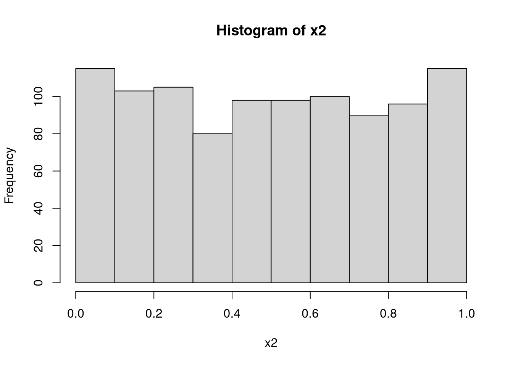
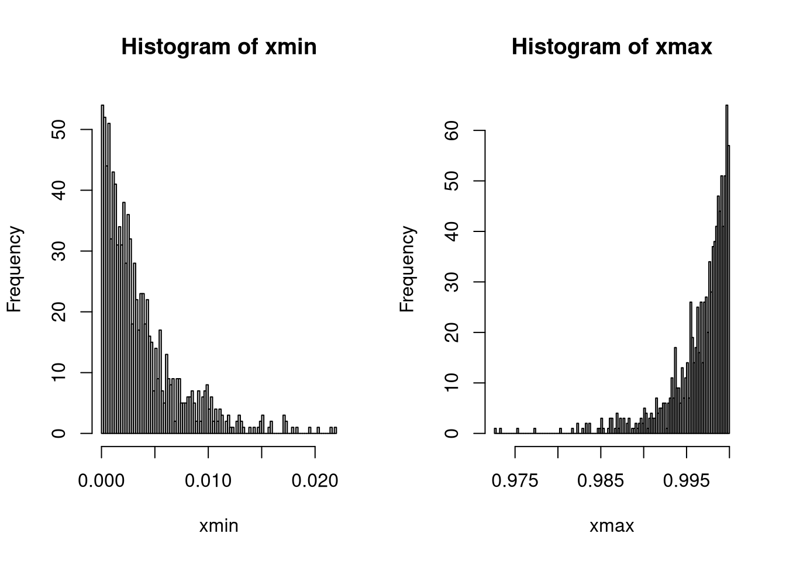
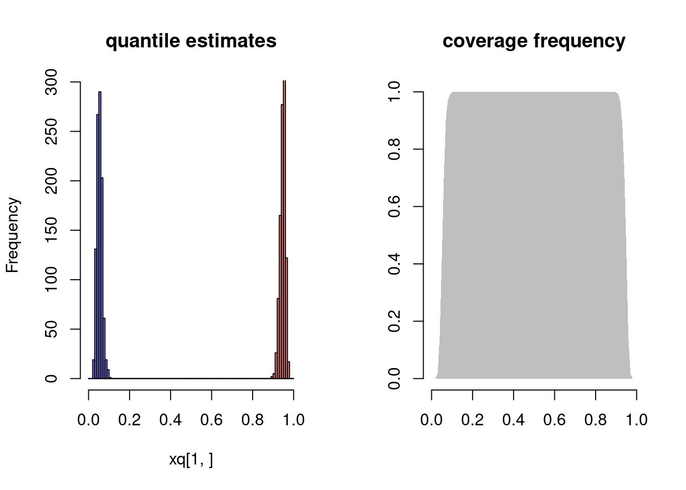

# (PART) Programming in R {-} 

# First Steps
***

## Why R

We focus on R because it is good for complex stats, concise figures, and coherent organization. It is built and developed by applied statisticians for statistics, and used by many in academia and industry. For students, think about labor demand and what may be good for getting a job. Do some of your own research to best understand how much to invest.

## Install R

First Install [R](https://cloud.r-project.org/).
Then Install [Rstudio](https://www.rstudio.com/products/rstudio/download/).

For help setting up

* https://learnr-examples.shinyapps.io/ex-setup-r/
* https://rstudio-education.github.io/hopr/starting.html
* https://a-little-book-of-r-for-bioinformatics.readthedocs.io/en/latest/src/installr.html
* https://cran.r-project.org/doc/manuals/R-admin.html

* https://courses.edx.org/courses/UTAustinX/UT.7.01x/3T2014/56c5437b88fa43cf828bff5371c6a924/
* https://owi.usgs.gov/R/training-curriculum/installr/
* https://www.earthdatascience.org/courses/earth-analytics/document-your-science/setup-r-rstudio/


Make sure you have the latest version of R and Rstudio for class. If not, then reinstall. 

## Interfacing with R

Rstudio is easiest to get going with. (There are other GUI's.) There are 4 panes. The top left is where you write and save code

 * Create and save a new `R Script` file *My_First_Script.R*
 * could also use a plain .txt file.

<!-- -->

The pane below is where your code is executed. For all following examples, make sure to both execute and store your code.


Note that the coded examples generally have inputs, outputs, and comments. For example, 

```r
## This is a comment
CodeInput <- c('output looks like this')
CodeInput
```

```
## [1] "output looks like this"
```


# Mathematics
***


## Scalars


```r
xs <- 2 ## Your first scalar
xs  ## Print the scalar
```

```
## [1] 2
```

```r
(xs+1)^2 ## Perform and print a simple calculation
```

```
## [1] 9
```

```r
xs + NA ## often used for missing values
```

```
## [1] NA
```

```r
xs*2
```

```
## [1] 4
```

## Vectors
 

```r
x <- c(0,1,3,10,6) ## Your First Vector
x ## Print the vector
```

```
## [1]  0  1  3 10  6
```

```r
x[2] ## Print the 2nd Element; 1
```

```
## [1] 1
```

```r
x+2 ## Print simple calculation; 2,3,5,8,12
```

```
## [1]  2  3  5 12  8
```

```r
x*2
```

```
## [1]  0  2  6 20 12
```

```r
x^2
```

```
## [1]   0   1   9 100  36
```


```r
x+x
```

```
## [1]  0  2  6 20 12
```

```r
x*x
```

```
## [1]   0   1   9 100  36
```

```r
x^x
```

```
## [1] 1.0000e+00 1.0000e+00 2.7000e+01 1.0000e+10 4.6656e+04
```


```r
c(1) ## scalars are vectors
```

```
## [1] 1
```

```r
1:7
```

```
## [1] 1 2 3 4 5 6 7
```

```r
seq(0,1,by=.1)
```

```
##  [1] 0.0 0.1 0.2 0.3 0.4 0.5 0.6 0.7 0.8 0.9 1.0
```


##  Functions

Function of a vector

```r
## Add two to any vector
add2 <- function(x1) {
    x1+2
}
add2(x)
```

```
## [1]  2  3  5 12  8
```

```r
## Generalization
addn <- function(x1,n=2) {
    x1+n
}
addn(x)
```

```
## [1]  2  3  5 12  8
```

```r
addn(x,3)
```

```
## [1]  3  4  6 13  9
```


Function for two vectors

```r
sum_squared <- function(x1, x2) {
	y <- (x1 + x2)^2
	return(y)
}

sum_squared(1, 3)
```

```
## [1] 16
```

```r
sum_squared(x, 2)
```

```
## [1]   4   9  25 144  64
```

```r
sum_squared(x, NA) 
```

```
## [1] NA NA NA NA NA
```

```r
sum_squared(x, x)
```

```
## [1]   0   4  36 400 144
```

```r
sum_squared(x, 2*x)
```

```
## [1]   0   9  81 900 324
```

Applying the same function over and over again

```r
sapply(1:3, exp)
```

```
## [1]  2.718282  7.389056 20.085537
```

```r
exp(1:3)
```

```
## [1]  2.718282  7.389056 20.085537
```

```r
## mapply takes multiple vectors
mapply(sum, 1:3, exp(1:3) )
```

```
## [1]  3.718282  9.389056 23.085537
```

recursive functions

```r
## For Loop
x <- rep(1, 3)
for(i in 2:length(x) ){
    x[i] <- (x[i-1]+1)^2
}
x
```

```
## [1]  1  4 25
```

```r
r_fun <- function(n){
    x <- rep(1,n)
    for(i in 2:length(x) ){
        x[i] <- (x[i-1]+1)^2
    }
    return(x)
}
r_fun(5)
```

```
## [1]      1      4     25    676 458329
```

Functions can take functions as arguments 

```r
fun_of_seq <- function(f){
    x <- seq(1,3, length.out=12)
    y <- f(x)
    return(y)
}

fun_of_seq(mean)
```

```
## [1] 2
```

```r
fun_of_seq(mean)
```

```
## [1] 2
```


##  Matrices


```r
x <- c(1,4,9)
x_mat <- rbind(x, x)
x_mat ## Print full matrix
```

```
##   [,1] [,2] [,3]
## x    1    4    9
## x    1    4    9
```

```r
x_mat[2,] ## Print Second Row
```

```
## [1] 1 4 9
```

```r
x_mat[,2] ## Print Second Column
```

```
## x x 
## 4 4
```

```r
x_mat[2,2]  ## Print Element in Second Column and Second Row
```

```
## x 
## 4
```

```r
x_mat+2
```

```
##   [,1] [,2] [,3]
## x    3    6   11
## x    3    6   11
```

```r
x_mat*2
```

```
##   [,1] [,2] [,3]
## x    2    8   18
## x    2    8   18
```

```r
x_mat^2
```

```
##   [,1] [,2] [,3]
## x    1   16   81
## x    1   16   81
```

```r
x_mat + x_mat
```

```
##   [,1] [,2] [,3]
## x    2    8   18
## x    2    8   18
```

```r
x_mat*x_mat
```

```
##   [,1] [,2] [,3]
## x    1   16   81
## x    1   16   81
```

```r
x_mat^x_mat
```

```
##   [,1] [,2]      [,3]
## x    1  256 387420489
## x    1  256 387420489
```


```r
y <- apply(x_mat, 1, sum)^2 ## Apply function to each row
## ?apply  #checks the function details
y - sum_squared(x, x) ## tests if there are any differences
```

```
## Warning in y - sum_squared(x, x): longer object length is not a multiple of
## shorter object length
```

```
## [1]  192  132 -128
```

Many Other Functions

```r
x_mat * x_mat
```

```
##   [,1] [,2] [,3]
## x    1   16   81
## x    1   16   81
```

```r
crossprod(x_mat)
```

```
##      [,1] [,2] [,3]
## [1,]    2    8   18
## [2,]    8   32   72
## [3,]   18   72  162
```

```r
tcrossprod(x_mat) ##x_mat %*% t(x_mat)
```

```
##    x  x
## x 98 98
## x 98 98
```

```r
outer(x,x) ##x %o% x
```

```
##      [,1] [,2] [,3]
## [1,]    1    4    9
## [2,]    4   16   36
## [3,]    9   36   81
```


Example Calculations


```r
## Return Y-value with minimum absolute difference from 3
abs_diff_y <- abs( y - 3 ) 
abs_diff_y ## is this the luckiest number?
```

```
##   x   x 
## 193 193
```

```r
min(abs_diff_y)
```

```
## [1] 193
```

```r
which.min(abs_diff_y)
```

```
## x 
## 1
```

```r
y[ which.min(abs_diff_y) ]
```

```
##   x 
## 196
```


## Arrays

Generalization of matrices used in spatial econometrics


```r
a <- array(data = 1:24, dim = c(2, 3, 4))
a
```

```
## , , 1
## 
##      [,1] [,2] [,3]
## [1,]    1    3    5
## [2,]    2    4    6
## 
## , , 2
## 
##      [,1] [,2] [,3]
## [1,]    7    9   11
## [2,]    8   10   12
## 
## , , 3
## 
##      [,1] [,2] [,3]
## [1,]   13   15   17
## [2,]   14   16   18
## 
## , , 4
## 
##      [,1] [,2] [,3]
## [1,]   19   21   23
## [2,]   20   22   24
```

```r
a[1, , , drop = FALSE]  # Row 1
```

```
## , , 1
## 
##      [,1] [,2] [,3]
## [1,]    1    3    5
## 
## , , 2
## 
##      [,1] [,2] [,3]
## [1,]    7    9   11
## 
## , , 3
## 
##      [,1] [,2] [,3]
## [1,]   13   15   17
## 
## , , 4
## 
##      [,1] [,2] [,3]
## [1,]   19   21   23
```

```r
a[, 1, , drop = FALSE]  # Column 1
```

```
## , , 1
## 
##      [,1]
## [1,]    1
## [2,]    2
## 
## , , 2
## 
##      [,1]
## [1,]    7
## [2,]    8
## 
## , , 3
## 
##      [,1]
## [1,]   13
## [2,]   14
## 
## , , 4
## 
##      [,1]
## [1,]   19
## [2,]   20
```

```r
a[, , 1, drop = FALSE]  # Layer 1
```

```
## , , 1
## 
##      [,1] [,2] [,3]
## [1,]    1    3    5
## [2,]    2    4    6
```

```r
a[ 1, 1,  ]  # Row 1, column 1
```

```
## [1]  1  7 13 19
```

```r
a[ 1,  , 1]  # Row 1, "layer" 1
```

```
## [1] 1 3 5
```

```r
a[  , 1, 1]  # Column 1, "layer" 1
```

```
## [1] 1 2
```

```r
a[1 , 1, 1]  # Row 1, column 1, "layer" 1
```

```
## [1] 1
```

Apply extends to arrays


```r
apply(a, 1, mean)    # Row means
```

```
## [1] 12 13
```

```r
apply(a, 2, mean)    # Column means
```

```
## [1] 10.5 12.5 14.5
```

```r
apply(a, 3, mean)    # "Layer" means
```

```
## [1]  3.5  9.5 15.5 21.5
```

```r
apply(a, 1:2, mean)  # Row/Column combination 
```

```
##      [,1] [,2] [,3]
## [1,]   10   12   14
## [2,]   11   13   15
```

# Statistics


## Random Variables

On your computer, random variables are vectors created by functions. The vectors appear to be generated from a known probability function.


```r
## Random bernoulli (Coin Flip: Heads=1)
rbinom(1, 1, 0.5) ## 1 Flip
```

```
## [1] 0
```

```r
rbinom(4, 1, 0.5) ## 4 Flips in row
```

```
## [1] 1 0 1 1
```

```r
x0 <- rbinom(1000, 1, 0.5)
hist(x0)
```


```r
## random standard-normal
rnorm(4) 
```

```
## [1]  0.7018324  0.5485475 -0.7550086  0.1216649
```

```r
x1 <- rnorm(1000)
hist(x1)
```


```r
## random uniform
runif(4)
```

```
## [1] 0.49905923 0.69869604 0.06698789 0.19850668
```

```r
x2 <- runif(1000)
hist(x2)
```




## Functions of Data

Two definitions to remember

* *statistic* a function of data
* *sampling distribution* how a statistic varies from sample to sample

The mean is a statistic

```r
## compute the mean of a random sample
x <- runif(100)
hist(x)
m <- mean(x)
abline(v=m, col=2)
```


```r
## is m close to it's true value (1-0)/2=.5?
## what about mean(runif(1000)) ?
## what about mean( rbinom(100, 1, 0.5) )?
```

see how the mean varies from sample to sample to sample

```r
par(mfrow=c(1,3))
sapply(1:3, function(i){
    x <- runif(100) 
    m <-  mean(x)
    hist(x,
        main=paste0('mean= ', round(m,4)),
        breaks=seq(0,1,by=.1))
    abline(v=m, col=2)
    return(m)
})
```


```
## [1] 0.4987342 0.5147332 0.4392990
```

examine the sampling distribution of the mean

```r
sample_means <- sapply(1:1000, function(i) mean(runif(100)) )
hist(sample_means, breaks=50, col=2, main='Sampling Distribution of the mean')
```


examine the sampling distribution of the standard deviation

```r
three_sds <- c(  sd(runif(100)),  sd(runif(100)),  sd(runif(100))  )
three_sds
```

```
## [1] 0.2898736 0.2662220 0.2958463
```

```r
sample_sds <- sapply(1:1000, function(i) sd(runif(100)) )
hist(sample_sds, breaks=50, col=4, main='Sampling Distribution of the sd')
```


examine the sampling distribution of "order statistics"

```r
## Create 300 samples, each with 1000 random uniform variables
x <- sapply(1:300, function(i) runif(1000) )

## Median also looks normal
xmed <- apply(x,1,quantile, probs=.5)
hist(xmed,breaks=100)
```


```r
## Maximum and Minumum do not!
xmin <- apply(x,1,quantile, probs=0)
xmax <- apply(x,1,quantile, probs=1)
par(mfrow=c(1,2))
hist(xmin,breaks=100)
hist(xmax,breaks=100)
```



```r
## Upper and Lower Quantiles
xq <- apply(x,1,quantile, probs=c(.05,.95))
bks <- seq(0,1,by=.01)
hist(xq[1,], main='quantile estimates', col=rgb(0,0,1,.5), xlim=c(0,1), breaks=bks)
hist(xq[2,], col=rgb(1,0,0,.5), add=T, breaks=seq(0,1,by=.01))

## Coverage
xcov <- sapply(bks, function(b){
    bl <- b >= xq[1,]
    bu <- b <= xq[2,]
    mean( bl&bu )
})
plot.new()
plot.window(xlim=c(0,1), ylim=c(0,1))
polygon( c(bks, rev(bks)), c(xcov, xcov*0), col=grey(.5,.5), border=NA)
title('coverage frequency')
axis(1)
axis(2)
```




```r
## Try any function!
fun_of_rv <- function(f, n=100){
  x <- runif(n)
  y <- f(x)
  return(y)
}
fun_of_rv( function(i){range(exp(i))})
```

```
## [1] 1.009972 2.705021
```


## Further Reading

Many introductory econometrics textbooks have a good appendix on probability and statistics. There are many useful texts online too

* https://bookdown.org/probability/statistics/
* https://bookdown.org/probability/beta/
* https://bookdown.org/a_shaker/STM1001_Topic_3/
* https://bookdown.org/fsancier/bookdown-demo/
* https://bookdown.org/kevin_davisross/probsim-book/
* https://bookdown.org/machar1991/ITER/2-pt.html


# Data Analysis
***

## Data

Commom Types

```r
l1 <- 1:3 ## cardinal numbers
l1
```

```
## [1] 1 2 3
```

```r
l2 <- factor(c('A','B','C'), ordered=T) ## ordinal numbers
l2
```

```
## [1] A B C
## Levels: A < B < C
```

```r
l3 <- factor(c('Leipzig','Los Angeles','Logan'), ordered=F) ## categorical numbers
l3
```

```
## [1] Leipzig     Los Angeles Logan      
## Levels: Leipzig Logan Los Angeles
```

```r
l4 <- c('hello world', 'hi mom')  ## character strings
l4
```

```
## [1] "hello world" "hi mom"
```

```r
l5 <- list(l1, l2, list(l3, list('...inception...'))) ## lists
l5
```

```
## [[1]]
## [1] 1 2 3
## 
## [[2]]
## [1] A B C
## Levels: A < B < C
## 
## [[3]]
## [[3]][[1]]
## [1] Leipzig     Los Angeles Logan      
## Levels: Leipzig Logan Los Angeles
## 
## [[3]][[2]]
## [[3]][[2]][[1]]
## [1] "...inception..."
```

```r
## data.frames: your most common data type
    ## matrix of different data-types
    ## well-ordered lists
l5 <- data.frame(x=l1, y=l2, z=l3)
l5
```

```
##   x y           z
## 1 1 A     Leipzig
## 2 2 B Los Angeles
## 3 3 C       Logan
```

Reading in


```r
## Load in from R packages
library(wooldridge)
data('crime2')
data('crime4')

## Read in csv from online
dat_csv <- read.csv('http://www.stern.nyu.edu/~wgreene/Text/Edition7/TableF19-3.csv')
dat_csv <- as.data.frame(dat_csv)

## Read in csv from online
dat_stata <- haven::read_dta('https://www.ssc.wisc.edu/~bhansen/econometrics/DS2004.dta')
dat_stata <- as.data.frame(dat_stata)

## For More Introductory Econometrics Data, see 
# https://www.ssc.wisc.edu/~bhansen/econometrics/Econometrics%20Data.zip
# https://pages.stern.nyu.edu/~wgreene/Text/Edition7/tablelist8new.htm
# R packages: wooldridge, causaldata, Ecdat, AER, ....
```


Read in some historical data on crime in the US

```r
head(USArrests)
```

```
##            Murder Assault UrbanPop Rape
## Alabama      13.2     236       58 21.2
## Alaska       10.0     263       48 44.5
## Arizona       8.1     294       80 31.0
## Arkansas      8.8     190       50 19.5
## California    9.0     276       91 40.6
## Colorado      7.9     204       78 38.7
```


```r
summary(USArrests)
```

```
##      Murder          Assault         UrbanPop          Rape      
##  Min.   : 0.800   Min.   : 45.0   Min.   :32.00   Min.   : 7.30  
##  1st Qu.: 4.075   1st Qu.:109.0   1st Qu.:54.50   1st Qu.:15.07  
##  Median : 7.250   Median :159.0   Median :66.00   Median :20.10  
##  Mean   : 7.788   Mean   :170.8   Mean   :65.54   Mean   :21.23  
##  3rd Qu.:11.250   3rd Qu.:249.0   3rd Qu.:77.75   3rd Qu.:26.18  
##  Max.   :17.400   Max.   :337.0   Max.   :91.00   Max.   :46.00
```


## Plots

### Histograms 

Histograms Summarize Distributions. Easy to show data splits

```r
## Urban Population above/below mean
u <- mean(USArrests$UrbanPop)
m1 <- USArrests[USArrests$UrbanPop<u,'Murder']
m2 <- USArrests[USArrests$UrbanPop>=u,'Murder']

xbks <-  seq(min(m1,m2), max(m1,m2), length.out=10)
hist(m1, col=rgb(0,0,1,.5), breaks=xbks, xlab='Murder Arrests', main='')
hist(m2, add=T, col=rgb(1,0,0,.5), breaks=xbks)
cols <- c(rgb(0,0,1,.5), rgb(1,0,0,.5))
legend('topright', col=cols, pch=15,
    title='% Urban Pop.', legend=c('Above Mean', 'Below Mean'))
title('Arrests per 100,000 across 50 US states in 1973')
```


**Glue together** to convey more information all at once


```r
par(mfrow=c(1,2))
## All Data
hist(USArrests$Murder, main='All Data', xlab='Murder Arrests')

## Split Data
xbks <-  seq(min(m1,m2), max(m1,m2), length.out=10)
cols <- c(rgb(0,0,1,.5), rgb(1,0,0,.5))
hist(m1, col=cols[1], breaks=xbks, xlab='Murder Arrests', main='Split Data')
hist(m2, add=T, col=cols[2], breaks=xbks)
legend('topright', col=cols, pch=15, bty='n',
    title='% Urban Pop.', legend=c('Above Mean', 'Below Mean'))
```


```r
par(fig=c(0,1,0,0.5), new=F)
hist(USArrests$Murder, breaks=xbks, main='All Data', xlab='Murder Arrests')
par(fig=c(0,.5,0.5,1), new=TRUE)
hist(m1, breaks=xbks, col=rgb(0,0,1,.5),
    main='Urban Pop >= Mean', xlab='Murder Arrests')
par(fig=c(0.5,1,0.5,1), new=TRUE)
hist(m2,breaks=xbks, col=rgb(1,0,0,.5),
    main='Urban Pop < Mean', xlab='Murder Arrests')
```


For more histogram visuals, see https://r-graph-gallery.com/histogram.html


### Boxplots

All Data

```r
boxplot(USArrests$Murder, main='All Data', ylab='Murder Arrests')
```


Split data into groups and glue together

```r
## Two Groups: cut(USArrests$UrbanPop,2)
USArrests$UrbanPop_cut <- cut(USArrests$UrbanPop,4) ## 4 Groups

par(mfrow=c(1,2))
boxplot(USArrests$Murder, main='All Data', ylab='Murder Arrests')
boxplot(Murder~UrbanPop_cut, USArrests,
    main='Split Data', col=hcl.colors(4,alpha=.5),
    xlab='Urban Population', ylab='Murder Arrests')
```


### Scatterplots


```r
plot(Murder~UrbanPop, USArrests, pch=16, col=rgb(0,0,0,.5))
```


```r
par(fig=c(0,0.8,0,0.8), new=F)
plot(Murder~UrbanPop, USArrests, pch=16, col=rgb(0,0,0,.5))
par(fig=c(0,0.8,0.55,1), new=TRUE)
boxplot(USArrests$Murder, horizontal=TRUE, axes=FALSE)
par(fig=c(0.65,1,0,0.8),new=TRUE)
boxplot(USArrests$UrbanPop, axes=FALSE)
```


Another example with a larger (simulated) dataset

```r
## Data Generating Process
x <- seq(1, 10, by=.0002)
e <- rnorm(length(x), mean=0, sd=1)
y <- .25*x + e 

xy_dat <- data.frame(x=x, y=y)
head(xy_dat)
```

```
##        x           y
## 1 1.0000 -0.26656164
## 2 1.0002 -1.11947002
## 3 1.0004 -1.82875877
## 4 1.0006 -0.55741086
## 5 1.0008 -0.01574812
## 6 1.0010  0.93017649
```

Plot the data and the line of best fit

```r
## Data
plot(y~x, xy_dat, pch=16, col=rgb(0,0,0,.1), cex=.5)

## OLS Regression
reg <- lm(y~x, data=xy_dat)
## Add the line of best fit
abline(reg)
```


```r
## Can Also Add Confidence Intervals
## https://rpubs.com/aaronsc32/regression-confidence-prediction-intervals
```


Polish the plot


```r
## your first plot is pretty standard
## plot(y~x, xy_dat)


plot(y~x, xy_dat, pch=16, col=rgb(0,0,0,.1), cex=.5,
    xlab='', ylab='') ## Format Axis Labels Seperately
mtext( 'y=0.25 x + e\n e ~ standard-normal', 2, line=2)
mtext( expression(x%in%~'[0,10]'), 1, line=2)
abline(reg)
title('Plot with good features and excessive notation')
legend('topleft', legend='single data point',
    title='do you see the normal distribution?',
    pch=16, col=rgb(0,0,0,.1), cex=.5)
```


Can export figure with specific dimensions

```r
pdf( 'Figures/plot_example.pdf', height=5, width=5)
## plot goes here
dev.off()
```

For plotting math, see
https://astrostatistics.psu.edu/su07/R/html/grDevices/html/plotmath.html
https://library.virginia.edu/data/articles/mathematical-annotation-in-r

For exporting options, see `?pdf`.
For saving other types of files, see `png("*.png")`, `tiff("*.tiff")`, and  `jpeg("*.jpg")`


# Beyond Basics
***


## Introductions to R

Some coding examples are copied from https://r4ds.had.co.nz/ but also other sources I have found online and elsewhere over the years.

There are many good yet free programming books online. I recommend https://intro2r.com. But see also 

* https://cran.r-project.org/doc/manuals/R-intro.html
* R Graphics Cookbook, 2nd edition. Winston Chang. 2021. https://r-graphics.org/
* R for Data Science. H. Wickham and G. Grolemund. 2017. https://r4ds.had.co.nz/index.html
* An Introduction to R. W. N. Venables, D. M. Smith, R Core Team. 2017. https://colinfay.me/intro-to-r/
* https://bookdown.org/kieranmarray/intro_to_r_for_econometrics/
* Spatial Data Science with R: Introduction to R. Robert J. Hijmans. 2021. https://rspatial.org/intr/index.html

There are also many good yet free-online tutorials and courses. 

* https://www.econometrics-with-r.org/1.2-a-very-short-introduction-to-r-and-rstudio.html
* https://rafalab.github.io/dsbook/
* https://moderndive.com/foreword.html
* https://rstudio.cloud/learn/primers/1.2
* https://cran.r-project.org/manuals.html
* https://stats.idre.ucla.edu/stat/data/intro_r/intro_r_interactive_flat.html
* https://cswr.nrhstat.org/app-r

What we cover in this primer should be enough to get you going. But other resources should be used if needed. 


## The R Ecosystem

### Packages

Use expansion "packages" for common procedures and more functionality

```r
## Other packages commonly used
install.packages("stargazer")
install.packages("purrr")
## install.packages("reshape2")
```

The most common tasks have [cheatsheets](https://www.rstudio.com/resources/cheatsheets/) you can use. E.g., 

* https://github.com/rstudio/cheatsheets/blob/main/rstudio-ide.pdf

Sometimes you will want to install a package from GitHub. For this, you can use [devtools](https://devtools.r-lib.org/) or the lighter [remotes](https://remotes.r-lib.org/)

```r
install.packages("devtools")
install.packages("remotes")
```

For devtools, you need to have developer tools installed on your pc. If you have not, try

* Windows: [Rtools](https://cran.r-project.org/bin/windows/Rtools/rtools42/rtools.html)
* Mac: [Xcode](https://apps.apple.com/us/app/xcode/id497799835?mt=12)


For example, to color terminal output on Linux you can 

```r
library(remotes)
# Install https://github.com/jalvesaq/colorout
# to .libPaths()[1]
install_github('jalvesaq/colorout')
```


### Task Views

Task views list relevant packages. 

For all students and early researchers, 

* https://cran.r-project.org/web/views/ReproducibleResearch.html

For microeconometrics,

* https://cran.r-project.org/web/views/Econometrics.html

For spatial econometrics 

* https://cran.r-project.org/web/views/Spatial.html
* https://cran.r-project.org/web/views/SpatioTemporal.html


Multiple packages may have the same function name for different commands. In this case use the syntax ``package::function`` to specify the package. For example

```r
devtools::install_github
remotes::install_github
```


**Don't fret** Sometimes there is not a specific package for your data.

Odds are, you can do most of what you want with base code.

* Packages just wrap base code in convient formats
* see https://cran.r-project.org/web/views/ for topical overviews

Statisticians might have different naming conventions

* if the usual software just spits out a nice plot
you might have to dig a little to know precisely what you want
* your data are fundamentally numbers, strings, etc...
You only have to figure out how to read it in.

But remember that many of the best plots are custom made (see https://www.r-graph-gallery.com/), and can also be interactive or animated

* https://plotly.com/r/
* https://shiny.rstudio.com/gallery/


## Custom figures

<!-- ## CONVERT IMAGES
for pdfile in *.pdf ; do 
convert -verbose -density 500  "${pdfile}" "${pdfile%.*}".png;
done
-->


