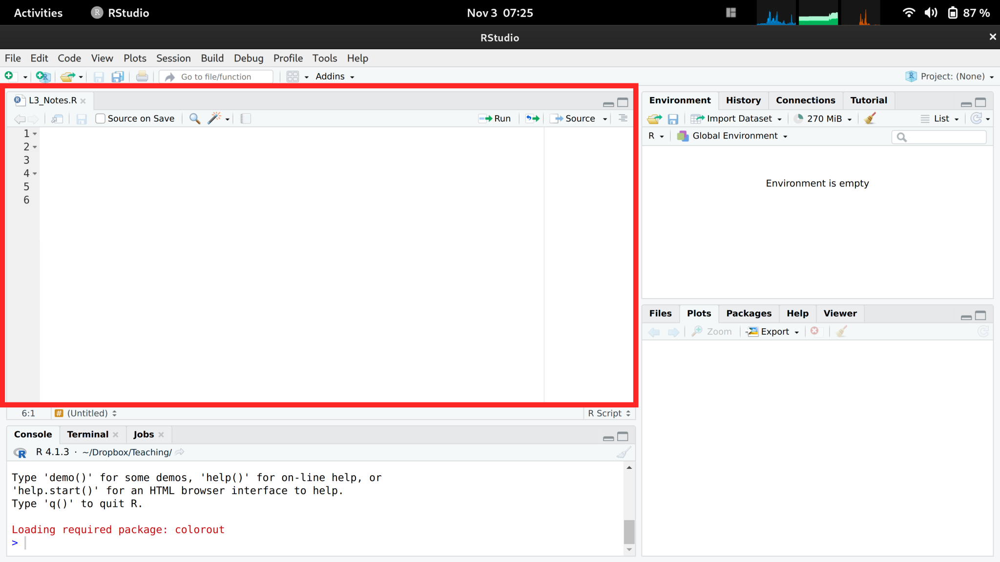

# (PART) Programming in R {-} 


```r
knitr::opts_chunk$set(echo=TRUE, message=FALSE, warning=FALSE)
```

# First Steps
***

## Why R

We focus on R because it is good for complex stats, concise figures, and coherent organization. It is built and developed by applied statisticians for statistics, and used by many in academia and industry. For students, think about labor demand and what may be good for getting a job. Do some of your own research to best understand how much to invest.

## Install R

First Install [R](https://cloud.r-project.org/).
Then Install [Rstudio](https://www.rstudio.com/products/rstudio/download/).

For help setting up

* https://learnr-examples.shinyapps.io/ex-setup-r/
* https://rstudio-education.github.io/hopr/starting.html
* https://a-little-book-of-r-for-bioinformatics.readthedocs.io/en/latest/src/installr.html
* https://cran.r-project.org/doc/manuals/R-admin.html

* https://courses.edx.org/courses/UTAustinX/UT.7.01x/3T2014/56c5437b88fa43cf828bff5371c6a924/
* https://owi.usgs.gov/R/training-curriculum/installr/
* https://www.earthdatascience.org/courses/earth-analytics/document-your-science/setup-r-rstudio/


Make sure you have the latest version of R and Rstudio for class. If not, then reinstall. 

## Interfacing with R

Rstudio is easiest to get going with. (There are other GUI's.) There are 4 panes. The top left is where you write and save code

 * Create and save a new `R Script` file *My_First_Script.R*
 * could also use a plain .txt file.

<!-- -->

The pane below is where your code is executed. For all following examples, make sure to both execute and store your code.


Note that the coded examples generally have inputs, outputs, and comments. For example, 

```r
## This is a comment
CodeInput <- c('output looks like this')
CodeInput
```

```
## [1] "output looks like this"
```


# Mathematics
***


## Scalars


```r
xs <- 2 ## Your first scalar
xs  ## Print the scalar
```

```
## [1] 2
```

```r
(xs+1)^2 ## Perform and print a simple calculation
```

```
## [1] 9
```

```r
xs + NA ## often used for missing values
```

```
## [1] NA
```

```r
xs*2
```

```
## [1] 4
```

## Vectors
 

```r
x <- c(0,1,3,10,6) ## Your First Vector
x ## Print the vector
```

```
## [1]  0  1  3 10  6
```

```r
x[2] ## Print the 2nd Element; 1
```

```
## [1] 1
```

```r
x+2 ## Print simple calculation; 2,3,5,8,12
```

```
## [1]  2  3  5 12  8
```

```r
x*2
```

```
## [1]  0  2  6 20 12
```

```r
x^2
```

```
## [1]   0   1   9 100  36
```


```r
x+x
```

```
## [1]  0  2  6 20 12
```

```r
x*x
```

```
## [1]   0   1   9 100  36
```

```r
x^x
```

```
## [1] 1.0000e+00 1.0000e+00 2.7000e+01 1.0000e+10 4.6656e+04
```


```r
c(1) ## scalars are vectors
```

```
## [1] 1
```

```r
1:7
```

```
## [1] 1 2 3 4 5 6 7
```

```r
seq(0,1,by=.1)
```

```
##  [1] 0.0 0.1 0.2 0.3 0.4 0.5 0.6 0.7 0.8 0.9 1.0
```


##  Functions

Function of a vector

```r
## Add two to any vector
add2 <- function(x1) {
    x1+2
}
add2(x)
```

```
## [1]  2  3  5 12  8
```

```r
## Generalization
addn <- function(x1,n=2) {
    x1+n
}
addn(x)
```

```
## [1]  2  3  5 12  8
```

```r
addn(x,3)
```

```
## [1]  3  4  6 13  9
```


Function for two vectors

```r
sum_squared <- function(x1, x2) {
	y <- (x1 + x2)^2
	return(y)
}

sum_squared(1, 3)
```

```
## [1] 16
```

```r
sum_squared(x, 2)
```

```
## [1]   4   9  25 144  64
```

```r
sum_squared(x, NA) 
```

```
## [1] NA NA NA NA NA
```

```r
sum_squared(x, x)
```

```
## [1]   0   4  36 400 144
```

```r
sum_squared(x, 2*x)
```

```
## [1]   0   9  81 900 324
```

Applying the same function over and over again

```r
sapply(1:3, exp)
```

```
## [1]  2.718282  7.389056 20.085537
```

```r
exp(1:3)
```

```
## [1]  2.718282  7.389056 20.085537
```

```r
## mapply takes multiple vectors
mapply(sum, 1:3, exp(1:3) )
```

```
## [1]  3.718282  9.389056 23.085537
```

recursive functions

```r
## For Loop
x <- rep(1, 3)
for(i in 2:length(x) ){
    x[i] <- (x[i-1]+1)^2
}
x
```

```
## [1]  1  4 25
```

```r
r_fun <- function(n){
    x <- rep(1,n)
    for(i in 2:length(x) ){
        x[i] <- (x[i-1]+1)^2
    }
    return(x)
}
r_fun(5)
```

```
## [1]      1      4     25    676 458329
```

Functions can take functions as arguments 

```r
fun_of_seq <- function(f){
    x <- seq(1,3, length.out=12)
    y <- f(x)
    return(y)
}

fun_of_seq(mean)
```

```
## [1] 2
```

```r
fun_of_seq(mean)
```

```
## [1] 2
```


##  Matrices


```r
x1 <- c(1,4,9)
x2 <- c(3,0,2)
x_mat <- rbind(x1, x2)

x_mat       ## Print full matrix
```

```
##    [,1] [,2] [,3]
## x1    1    4    9
## x2    3    0    2
```

```r
x_mat[2,]   ## Print Second Row
```

```
## [1] 3 0 2
```

```r
x_mat[,2]   ## Print Second Column
```

```
## x1 x2 
##  4  0
```

```r
x_mat[2,2]  ## Print Element in Second Column and Second Row
```

```
## x2 
##  0
```

```r
## 
x_mat+2
```

```
##    [,1] [,2] [,3]
## x1    3    6   11
## x2    5    2    4
```

```r
x_mat*2
```

```
##    [,1] [,2] [,3]
## x1    2    8   18
## x2    6    0    4
```

```r
x_mat^2
```

```
##    [,1] [,2] [,3]
## x1    1   16   81
## x2    9    0    4
```

```r
x_mat + x_mat
```

```
##    [,1] [,2] [,3]
## x1    2    8   18
## x2    6    0    4
```

```r
x_mat*x_mat
```

```
##    [,1] [,2] [,3]
## x1    1   16   81
## x2    9    0    4
```

```r
x_mat^x_mat
```

```
##    [,1] [,2]      [,3]
## x1    1  256 387420489
## x2   27    1         4
```


```r
y <- apply(x_mat, 1, sum)^2 ## Apply function to each row
## ?apply  #checks the function details
y - sum_squared(x, x) ## tests if there are any differences
```

```
## [1]   192   -39 -2304
```

Many Other Functions

```r
x_mat1 <- matrix(2:7,2,3)
x_mat1
```

```
##      [,1] [,2] [,3]
## [1,]    2    4    6
## [2,]    3    5    7
```

```r
x_mat2 <- matrix(4:-1,2,3)
x_mat2
```

```
##      [,1] [,2] [,3]
## [1,]    4    2    0
## [2,]    3    1   -1
```

```r
##
x_mat1 * x_mat2
```

```
##      [,1] [,2] [,3]
## [1,]    8    8    0
## [2,]    9    5   -7
```

```r
tcrossprod(x_mat1, x_mat2) ##x_mat1 %*% t(x_mat2)
```

```
##      [,1] [,2]
## [1,]   16    4
## [2,]   22    7
```

```r
crossprod(x_mat1, x_mat2)
```

```
##      [,1] [,2] [,3]
## [1,]   17    7   -3
## [2,]   31   13   -5
## [3,]   45   19   -7
```


Example Calculations


```r
## Return Y-value with minimum absolute difference from 3
abs_diff_y <- abs( y - 3 ) 
abs_diff_y ## is this the luckiest number?
```

```
##  x1  x2 
## 193  22
```

```r
min(abs_diff_y)
```

```
## [1] 22
```

```r
which.min(abs_diff_y)
```

```
## x2 
##  2
```

```r
y[ which.min(abs_diff_y) ]
```

```
## x2 
## 25
```


## Arrays

Generalization of matrices used in spatial econometrics


```r
a <- array(data = 1:24, dim = c(2, 3, 4))
a
```

```
## , , 1
## 
##      [,1] [,2] [,3]
## [1,]    1    3    5
## [2,]    2    4    6
## 
## , , 2
## 
##      [,1] [,2] [,3]
## [1,]    7    9   11
## [2,]    8   10   12
## 
## , , 3
## 
##      [,1] [,2] [,3]
## [1,]   13   15   17
## [2,]   14   16   18
## 
## , , 4
## 
##      [,1] [,2] [,3]
## [1,]   19   21   23
## [2,]   20   22   24
```

```r
a[1, , , drop = FALSE]  # Row 1
```

```
## , , 1
## 
##      [,1] [,2] [,3]
## [1,]    1    3    5
## 
## , , 2
## 
##      [,1] [,2] [,3]
## [1,]    7    9   11
## 
## , , 3
## 
##      [,1] [,2] [,3]
## [1,]   13   15   17
## 
## , , 4
## 
##      [,1] [,2] [,3]
## [1,]   19   21   23
```

```r
a[, 1, , drop = FALSE]  # Column 1
```

```
## , , 1
## 
##      [,1]
## [1,]    1
## [2,]    2
## 
## , , 2
## 
##      [,1]
## [1,]    7
## [2,]    8
## 
## , , 3
## 
##      [,1]
## [1,]   13
## [2,]   14
## 
## , , 4
## 
##      [,1]
## [1,]   19
## [2,]   20
```

```r
a[, , 1, drop = FALSE]  # Layer 1
```

```
## , , 1
## 
##      [,1] [,2] [,3]
## [1,]    1    3    5
## [2,]    2    4    6
```

```r
a[ 1, 1,  ]  # Row 1, column 1
```

```
## [1]  1  7 13 19
```

```r
a[ 1,  , 1]  # Row 1, "layer" 1
```

```
## [1] 1 3 5
```

```r
a[  , 1, 1]  # Column 1, "layer" 1
```

```
## [1] 1 2
```

```r
a[1 , 1, 1]  # Row 1, column 1, "layer" 1
```

```
## [1] 1
```

Apply extends to arrays

```r
apply(a, 1, mean)    # Row means
```

```
## [1] 12 13
```

```r
apply(a, 2, mean)    # Column means
```

```
## [1] 10.5 12.5 14.5
```

```r
apply(a, 3, mean)    # "Layer" means
```

```
## [1]  3.5  9.5 15.5 21.5
```

```r
apply(a, 1:2, mean)  # Row/Column combination 
```

```
##      [,1] [,2] [,3]
## [1,]   10   12   14
## [2,]   11   13   15
```


Outer Products yield arrays

```r
x <- c(1,2,3)
x_mat1 <- outer(x, x) ## x %o% x
x_mat1
```

```
##      [,1] [,2] [,3]
## [1,]    1    2    3
## [2,]    2    4    6
## [3,]    3    6    9
```

```r
is.array(x_mat) ## Matrices are arrays
```

```
## [1] TRUE
```

```r
x_mat2 <- matrix(6:1,2,3)
outer(x_mat2, x)
```

```
## , , 1
## 
##      [,1] [,2] [,3]
## [1,]    6    4    2
## [2,]    5    3    1
## 
## , , 2
## 
##      [,1] [,2] [,3]
## [1,]   12    8    4
## [2,]   10    6    2
## 
## , , 3
## 
##      [,1] [,2] [,3]
## [1,]   18   12    6
## [2,]   15    9    3
```

```r
## outer(x_mat2, matrix(x))
## outer(x_mat2, t(x))
## outer(x_mat1, x_mat2)
```

# Statistics

## Data Types

The most commom types are

```r
l1 <- 1:3 ## cardinal numbers
l1
```

```
## [1] 1 2 3
```

```r
l2 <- factor(c('A','B','C'), ordered=T) ## ordinal numbers
l2
```

```
## [1] A B C
## Levels: A < B < C
```

```r
l3 <- factor(c('Leipzig','Los Angeles','Logan'), ordered=F) ## categorical numbers
l3
```

```
## [1] Leipzig     Los Angeles Logan      
## Levels: Leipzig Logan Los Angeles
```

```r
l4 <- c('hello world', 'hi mom')  ## character strings
l4
```

```
## [1] "hello world" "hi mom"
```

```r
l5 <- list(l1, l2, list(l3, list('...inception...'))) ## lists
l5
```

```
## [[1]]
## [1] 1 2 3
## 
## [[2]]
## [1] A B C
## Levels: A < B < C
## 
## [[3]]
## [[3]][[1]]
## [1] Leipzig     Los Angeles Logan      
## Levels: Leipzig Logan Los Angeles
## 
## [[3]][[2]]
## [[3]][[2]][[1]]
## [1] "...inception..."
```

```r
## data.frames: your most common data type
    ## matrix of different data-types
    ## well-ordered lists
l5 <- data.frame(x=l1, y=l2, z=l3)
l5
```

```
##   x y           z
## 1 1 A     Leipzig
## 2 2 B Los Angeles
## 3 3 C       Logan
```


## Random Variables

The different types of data can be randomly generated on your computer. Random variables are vectors that appear to be generated from a probabilistic process.


```r
## Random bernoulli (Coin Flip: Heads=1)
rbinom(1, 1, 0.5) ## 1 Flip
```

```
## [1] 0
```

```r
rbinom(4, 1, 0.5) ## 4 Flips in row
```

```
## [1] 1 0 0 1
```

```r
x0 <- rbinom(1000, 1, 0.5)
hist(x0)
```


```r
## random standard-normal
rnorm(4) 
```

```
## [1] -0.66393186 -1.74405341  0.07475374 -0.02190304
```

```r
x1 <- rnorm(1000)
hist(x1)
```


```r
## random uniform
runif(4)
```

```
## [1] 0.9471824 0.4022049 0.5011871 0.6899459
```

```r
x2 <- runif(1000)
hist(x2)
```


## Functions of Data

Two definitions to remember

* *statistic* a function of data
* *sampling distribution* how a statistic varies from sample to sample

The mean is a statistic

```r
## compute the mean of a random sample
x <- runif(100)
hist(x)
m <- mean(x)
abline(v=m, col=2)
```


```r
## is m close to it's true value (1-0)/2=.5?
## what about mean(runif(1000)) ?
## what about mean( rbinom(100, 1, 0.5) )?
```

see how the mean varies from sample to sample to sample

```r
par(mfrow=c(1,3))
sapply(1:3, function(i){
    x <- runif(100) 
    m <-  mean(x)
    hist(x,
        main=paste0('mean= ', round(m,4)),
        breaks=seq(0,1,by=.1))
    abline(v=m, col=2)
    return(m)
})
```


```
## [1] 0.5132814 0.4546985 0.4933476
```

examine the sampling distribution of the mean

```r
sample_means <- sapply(1:1000, function(i) mean(runif(100)) )
hist(sample_means, breaks=50, col=2, main='Sampling Distribution of the mean')
```


examine the sampling distribution of the standard deviation

```r
three_sds <- c(  sd(runif(100)),  sd(runif(100)),  sd(runif(100))  )
three_sds
```

```
## [1] 0.2977444 0.2907753 0.2767574
```

```r
sample_sds <- sapply(1:1000, function(i) sd(runif(100)) )
hist(sample_sds, breaks=50, col=4, main='Sampling Distribution of the sd')
```


examine the sampling distribution of "order statistics"

```r
## Create 300 samples, each with 1000 random uniform variables
x <- sapply(1:300, function(i) runif(1000) )

## Median also looks normal
xmed <- apply(x,1,quantile, probs=.5)
hist(xmed,breaks=100)
```


```r
## Maximum and Minumum do not!
xmin <- apply(x,1,quantile, probs=0)
xmax <- apply(x,1,quantile, probs=1)
par(mfrow=c(1,2))
hist(xmin,breaks=100)
hist(xmax,breaks=100)
```


```r
## Upper and Lower Quantiles
xq <- apply(x,1,quantile, probs=c(.05,.95))
bks <- seq(0,1,by=.01)
hist(xq[1,], main='quantile estimates', col=rgb(0,0,1,.5), xlim=c(0,1), breaks=bks)
hist(xq[2,], col=rgb(1,0,0,.5), add=T, breaks=seq(0,1,by=.01))

## Coverage
xcov <- sapply(bks, function(b){
    bl <- b >= xq[1,]
    bu <- b <= xq[2,]
    mean( bl&bu )
})
plot.new()
plot.window(xlim=c(0,1), ylim=c(0,1))
polygon( c(bks, rev(bks)), c(xcov, xcov*0), col=grey(.5,.5), border=NA)
title('coverage frequency')
axis(1)
axis(2)
```


```r
## Try any function!
fun_of_rv <- function(f, n=100){
  x <- runif(n)
  y <- f(x)
  return(y)
}
fun_of_rv( function(i){range(exp(i))})
```

```
## [1] 1.014966 2.691155
```


## Value of More Data

Each additional data point you have provides more information, which ultimately decreases the standard error of your estimates. However, it does so at a decreasing rate (known in economics as diminishing marginal returns).


```r
Nseq <- seq(1,100, by=1) ## Sample sizes
B <- 1000 ## Number of draws per sample

SE <- sapply(Nseq, function(n){
    sample_statistics <- sapply(1:B, function(b){
        x <- rnorm(n) ## Sample of size N
        quantile(x,probs=.4) ## Statistic
    })
    sd(sample_statistics)
})

par(mfrow=c(1,2))
plot(Nseq, SE, pch=16, col=grey(0,.5), main='Absolute Gain',
    ylab='standard error', xlab='sample size')
plot(Nseq[-1], abs(diff(SE)), pch=16, col=grey(0,.5), main='Marginal Gain', 
    ylab='decrease in standard error', xlab='sample size')
```


## Further Reading

Many introductory econometrics textbooks have a good appendix on probability and statistics. There are many useful texts online too

* https://bookdown.org/probability/statistics/
* https://bookdown.org/probability/beta/
* https://bookdown.org/a_shaker/STM1001_Topic_3/
* https://bookdown.org/fsancier/bookdown-demo/
* https://bookdown.org/kevin_davisross/probsim-book/
* https://bookdown.org/machar1991/ITER/2-pt.html


# Data Analysis
***


Reading in


```r
## Install R Data Package and Load in
install.packages('wooldridge')
library(wooldridge)
data('crime2')
data('crime4')

## Read in csv from online
dat_csv <- read.csv('http://www.stern.nyu.edu/~wgreene/Text/Edition7/TableF19-3.csv')
dat_csv <- as.data.frame(dat_csv)

## Read in csv from online
dat_stata <- haven::read_dta('https://www.ssc.wisc.edu/~bhansen/econometrics/DS2004.dta')
dat_stata <- as.data.frame(dat_stata)

## For More Introductory Econometrics Data, see 
# https://www.ssc.wisc.edu/~bhansen/econometrics/Econometrics%20Data.zip
# https://pages.stern.nyu.edu/~wgreene/Text/Edition7/tablelist8new.htm
# R packages: wooldridge, causaldata, Ecdat, AER, ....
```


Read in some historical data on crime in the US

```r
head(USArrests)
```

```
##            Murder Assault UrbanPop Rape
## Alabama      13.2     236       58 21.2
## Alaska       10.0     263       48 44.5
## Arizona       8.1     294       80 31.0
## Arkansas      8.8     190       50 19.5
## California    9.0     276       91 40.6
## Colorado      7.9     204       78 38.7
```


```r
summary(USArrests)
```

```
##      Murder          Assault         UrbanPop          Rape      
##  Min.   : 0.800   Min.   : 45.0   Min.   :32.00   Min.   : 7.30  
##  1st Qu.: 4.075   1st Qu.:109.0   1st Qu.:54.50   1st Qu.:15.07  
##  Median : 7.250   Median :159.0   Median :66.00   Median :20.10  
##  Mean   : 7.788   Mean   :170.8   Mean   :65.54   Mean   :21.23  
##  3rd Qu.:11.250   3rd Qu.:249.0   3rd Qu.:77.75   3rd Qu.:26.18  
##  Max.   :17.400   Max.   :337.0   Max.   :91.00   Max.   :46.00
```


## Cleaning Data

Data transformation is often necessary before analysis, so remember to be careful and check your code is doing what you want. (If you have large datasets, you can always test out the code on a sample.)


```r
## Function to Create Sample Datasets
make_noisy_data <- function(n, b=0){
    ## Simple Data Generating Process
    x <- seq(1,10, length.out=n) 
    e <- rnorm(length(x), mean=0, sd=10)
    y <- b*x + e 
    ## Obervations
    xy_mat <- data.frame(ID=seq(x), x=x, y=y)
    return(xy_mat)
}

## Two simulated datasets
dat1 <- make_noisy_data(6)
dat2 <- make_noisy_data(6)

## Merging data in long format
dat_merged_long <- rbind( cbind(dat1,DF=1), cbind(dat2,DF=2))
```
Now suppose we want to transform into long format

```r
## Merging data in wide format, First Attempt
dat_merged_wide <- cbind( dat1, dat2)
names(dat_merged_wide) <- c(paste0(names(dat1),'.1'), paste0(names(dat2),'.2'))

## Merging data in wide format, Second Attempt
## higher performance
dat_merged_wide2 <- merge(dat1, dat2,
    by='ID', suffixes=c('.1','.2'))
## CHECK they are the same.
identical(dat_merged_wide, dat_merged_wide2)
```

```
## [1] FALSE
```

```r
## Merging data in wide format, Third Attempt
## more flexibility
dat_melted <- reshape2::melt(dat_merged_long, id.vars=c('ID', 'DF'))
dat_merged_wide3 <- reshape2::dcast(dat_melted, ID~DF+variable)

## Merging data in wide format, Fourth Attempt
## highest performance but with new type of object
library(data.table)
dat_merged_longDT <- as.data.table(dat_merged_long)
dat_melted <- data.table::melt(dat_merged_longDT, id.vars=c('ID', 'DF'))
dat_merged_wide4 <- data.table::dcast(dat_melted, ID~DF+variable)
## dat_merged_wide4 <- as.data.frame(dat_merged_wide4)

## CHECK they are the same.
identical(dat_merged_wide3, dat_merged_wide4)
```

```
## [1] FALSE
```
Often, however, we ultimately want data in long format

```r
## Merging data in long format, Second Attempt 
dat_melted2 <- data.table::melt(dat_merged_wide4, measure=c("1_x","1_y","2_x","2_y"))
melt_vars <- strsplit(as.character(dat_melted2$variable),'_')
dat_melted2$DF <- sapply(melt_vars, `[[`,1)
dat_melted2$variable <- sapply(melt_vars, `[[`,2)
dat_merged_long2 <- data.table::dcast(dat_melted2, DF+ID~variable)
dat_merged_long2 <- as.data.frame(dat_merged_long2)

## CHECK they are the same.
identical( dat_merged_long2, dat_merged_long)
```

```
## [1] FALSE
```

```r
## Further Inspect
dat_merged_long2 <- dat_merged_long2[,c('ID','x','y','DF')]
mapply( identical, dat_merged_long2, dat_merged_long)
```

```
##    ID     x     y    DF 
##  TRUE  TRUE  TRUE FALSE
```

For more tips, see https://raw.githubusercontent.com/rstudio/cheatsheets/main/data-import.pdf and https://cran.r-project.org/web/packages/data.table/vignettes/datatable-reshape.html
<!--\url{https://github.com/rstudio/cheatsheets/raw/master/data-transformation.pdf}-->


## Static Plots

### Distributions

**Histograms** summarize distributions very effectively. And it is easy to show how distributions change via data splits. You can glue them together to convey more information all at once


```r
## All Data
xbks <-  seq(min(USArrests$Murder), max(USArrests$Murder), length.out=10)

## Split Data by Urban Population above/below mean
u <- mean(USArrests$UrbanPop)
m1 <- USArrests[USArrests$UrbanPop<u,'Murder']
m2 <- USArrests[USArrests$UrbanPop>=u,'Murder']

cols <- c(rgb(0,0,1,.5), rgb(1,0,0,.5))
par(fig=c(0,1,0,0.5), new=F)
hist(USArrests$Murder, breaks=xbks,
    main='All Data', font.main=1,
    xlab='Murder Arrests')
rug(USArrests$Murder)

par(fig=c(0,.5,0.5,1), new=TRUE)
hist(m1, breaks=xbks, col=rgb(0,0,1,.5),
    main='Urban Pop >= Mean', font.main=1,
    xlab='Murder Arrests')
par(fig=c(0.5,1,0.5,1), new=TRUE)
hist(m2,breaks=xbks, col=rgb(1,0,0,.5),
    main='Urban Pop < Mean', font.main=1,
    xlab='Murder Arrests')
```


For more histogram visuals, see https://r-graph-gallery.com/histogram.html. Note that sometimes it is preferable to show the empirical cumulative distribution funtion (ECDF).

```r
par(mfrow=c(1,2))
hist(USArrests$Murder, main='Density Function Estimate', font.main=1,
    xlab='Murder Arrests', breaks=xbks, freq=F)
plot(ecdf(m1), col=cols[1], xlab='Murder Arrests',
    main='Distribution Function Estimates', font.main=1, bty='n')
plot(ecdf(m2), add=T, col=cols[2])
legend('bottomright', col=cols, pch=15, bty='n', inset=c(0,.1),
    title='% Urban Pop.', legend=c('Above Mean', 'Below Mean'))
```


**Boxplots** show median, interquartile range, and outliers. As with histograms, you can also split data into groups and glue together

```r
layout( t(c(1,2,2)))
boxplot(USArrests$Murder, main='',
    xlab='All Data', ylab='Murder Arrests')

## 3 Groups with even spacing
USArrests$UrbanPop_cut <- cut(USArrests$UrbanPop,3)
boxplot(Murder~UrbanPop_cut, USArrests,
    main='', col=hcl.colors(3,alpha=.5),
    xlab='Urban Population', ylab='')
```


```r
## 4 Groups with equal observations
#qcuts <- c(
#    '0%'=min(USArrests$UrbanPop)-10*.Machine$double.eps,
#    quantile(USArrests$UrbanPop, probs=c(.25,.5,.75,1)))
#USArrests$UrbanPop_cut <- cut(USArrests$UrbanPop, qcuts)
```

### Joint Distributions

Scatterplots are used frequently to summarize the joint relationship between two variables. They can be enhanced in several ways.

**Fit Lines and Color** You can add regression lines (and confidence intervals). As a default, use semi-transparent points to see where your observations are concentrated. You can also use color to distinguish subsets.


```r
## High Assault Areas
cols <- ifelse(USArrests$Assault>median(USArrests$Assault), rgb(1,0,0,.5), rgb(0,0,1,.5))

## Scatterplot
plot(Murder~UrbanPop, USArrests, pch=16, col=cols)

## Add the line of best fit for pooled data
## Could also do separately for each data split
reg <- lm(Murder~UrbanPop, data=USArrests)
abline(reg, lty=2)
```


```r
## Can Also Add Confidence Intervals
## https://rpubs.com/aaronsc32/regression-confidence-prediction-intervals
```

Your first plot is typically standard. For others to easily comprehend your work, you must polish the plot.

```r
## Data Generating Process
x <- seq(1, 10, by=.0002)
e <- rnorm(length(x), mean=0, sd=1)
y <- .25*x + e 
xy_dat <- data.frame(x=x, y=y)

## Plot
par(fig=c(0,1,0,0.9), new=F)
plot(y~x, xy_dat, pch=16, col=rgb(0,0,0,.05), cex=.5,
    xlab='', ylab='') ## Format Axis Labels Seperately
mtext( 'y=0.25 x + e\n e ~ standard-normal', 2, line=2.2)
mtext( expression(x%in%~'[0,10]'), 1, line=2.2)

abline( lm(y~x, data=xy_dat), lty=2)

title('Plot with good features and excessive notation',
    adj=0, font.main=1)

## Outer Legend (https://stackoverflow.com/questions/3932038/)
outer_legend <- function(...) {
  opar <- par(fig=c(0, 1, 0, 1), oma=c(0, 0, 0, 0), 
    mar=c(0, 0, 0, 0), new=TRUE)
  on.exit(par(opar))
  plot(0, 0, type='n', bty='n', xaxt='n', yaxt='n')
  legend(...)
}
outer_legend('topright', legend='single data point',
    title='do you see the normal distribution?',
    pch=16, col=rgb(0,0,0,.1), cex=1, bty='n')
```


Can export figure with specific dimensions

```r
pdf( 'Figures/plot_example.pdf', height=5, width=5)
## plot goes here
dev.off()
```

For plotting math, see
https://astrostatistics.psu.edu/su07/R/html/grDevices/html/plotmath.html
https://library.virginia.edu/data/articles/mathematical-annotation-in-r

For exporting options, see `?pdf`.
For saving other types of files, see `png("*.png")`, `tiff("*.tiff")`, and  `jpeg("*.jpg")`


**Marginal distributions**


```r
## https://www.r-bloggers.com/2011/06/example-8-41-scatterplot-with-marginal-histograms/

## Setup Plot
layout( matrix(c(2,0,1,3), ncol=2, byrow=TRUE),
    widths=c(4/5,1/5), heights=c(1/5,4/5))

## Scatterplot
par(mar=c(4,4,1,1))
plot(Murder~UrbanPop, USArrests, pch=16, col=rgb(0,0,0,.5))

## Add Marginals
par(mar=c(0,4,1,1))
xhist <- hist(USArrests$UrbanPop, plot=FALSE)
barplot(xhist$counts, axes=FALSE, space=0)

par(mar=c(4,0,1,1))
yhist <- hist(USArrests$Murder, plot=FALSE)
barplot(yhist$counts, axes=FALSE, space=0, horiz=TRUE)
```


For plotting marginals, see https://r-graph-gallery.com/74-margin-and-oma-cheatsheet.html and https://jtr13.github.io/cc21fall2/tutorial-for-scatter-plot-with-marginal-distribution.html.

For some things to avoid, see https://www.data-to-viz.com/caveats.html


## Interactive Plots

Especially for data exploration, your plots can also be [interactive](https://r-graph-gallery.com/interactive-charts.html) via https://plotly.com/r/. For more details, see [examples](https://plotly-r.com/) and then [applications](https://bookdown.org/paulcbauer/applied-data-visualization/10-plotly.html).


```r
#install.packages("plotly")
library(plotly)
```


**Histograms**  https://plotly.com/r/histograms/

```r
u <- mean(USArrests$UrbanPop)
m1 <- USArrests[USArrests$UrbanPop<u,'Murder']
m2 <- USArrests[USArrests$UrbanPop>=u,'Murder']

fig <- plot_ly(alpha=0.6, 
    hovertemplate="%{y}")
fig <- fig %>% add_histogram(m1, name='< Mean')
fig <- fig %>% add_histogram(m2, name='>= Mean')
fig <- fig %>% layout(barmode="stack") ## barmode="overlay"
fig <- fig %>% layout(
    title="Crime and Urbanization in America 1975",
    xaxis = list(title='Murders Arrests per 100,000 People'),
    yaxis = list(title='Number of States'),
    legend=list(title=list(text='<b> Urban Pop. </b>'))
)
fig
```

```{=html}
<div class="plotly html-widget html-fill-item" id="htmlwidget-520e0ac4fa7fa408e9af" style="width:672px;height:480px;"></div>
<script type="application/json" data-for="htmlwidget-520e0ac4fa7fa408e9af">{"x":{"visdat":{"31bd590271c9":["function () ","plotlyVisDat"]},"cur_data":"31bd590271c9","attrs":{"31bd590271c9":{"hovertemplate":"%{y}","alpha":0.59999999999999998,"alpha_stroke":1,"sizes":[10,100],"spans":[1,20],"x":[13.199999999999999,10,8.8000000000000007,17.399999999999999,2.6000000000000001,7.2000000000000002,2.2000000000000002,9.6999999999999993,2.1000000000000001,16.100000000000001,6,4.2999999999999998,2.1000000000000001,13,0.80000000000000004,14.4,3.7999999999999998,13.199999999999999,2.2000000000000002,8.5,5.7000000000000002,6.7999999999999998],"type":"histogram","name":"< Mean","inherit":true},"31bd590271c9.1":{"hovertemplate":"%{y}","alpha":0.59999999999999998,"alpha_stroke":1,"sizes":[10,100],"spans":[1,20],"x":[8.0999999999999996,9,7.9000000000000004,3.2999999999999998,5.9000000000000004,15.4,5.2999999999999998,10.4,6,15.4,11.300000000000001,4.4000000000000004,12.1,2.7000000000000002,9,12.199999999999999,7.4000000000000004,11.4,11.1,7.2999999999999998,6.5999999999999996,4.9000000000000004,6.2999999999999998,3.3999999999999999,12.699999999999999,3.2000000000000002,4,2.6000000000000001],"type":"histogram","name":">= Mean","inherit":true}},"layout":{"margin":{"b":40,"l":60,"t":25,"r":10},"barmode":"stack","title":"Crime and Urbanization in America 1975","xaxis":{"domain":[0,1],"automargin":true,"title":"Murders Arrests per 100,000 People"},"yaxis":{"domain":[0,1],"automargin":true,"title":"Number of States"},"legend":{"title":{"text":"<b> Urban Pop. <\/b>"}},"hovermode":"closest","showlegend":true},"source":"A","config":{"modeBarButtonsToAdd":["hoverclosest","hovercompare"],"showSendToCloud":false},"data":[{"hovertemplate":["%{y}","%{y}","%{y}","%{y}","%{y}","%{y}","%{y}","%{y}","%{y}","%{y}","%{y}","%{y}","%{y}","%{y}","%{y}","%{y}","%{y}","%{y}","%{y}","%{y}","%{y}","%{y}"],"x":[13.199999999999999,10,8.8000000000000007,17.399999999999999,2.6000000000000001,7.2000000000000002,2.2000000000000002,9.6999999999999993,2.1000000000000001,16.100000000000001,6,4.2999999999999998,2.1000000000000001,13,0.80000000000000004,14.4,3.7999999999999998,13.199999999999999,2.2000000000000002,8.5,5.7000000000000002,6.7999999999999998],"type":"histogram","name":"< Mean","marker":{"color":"rgba(31,119,180,0.6)","line":{"color":"rgba(31,119,180,1)"}},"error_y":{"color":"rgba(31,119,180,0.6)"},"error_x":{"color":"rgba(31,119,180,0.6)"},"xaxis":"x","yaxis":"y","frame":null},{"hovertemplate":["%{y}","%{y}","%{y}","%{y}","%{y}","%{y}","%{y}","%{y}","%{y}","%{y}","%{y}","%{y}","%{y}","%{y}","%{y}","%{y}","%{y}","%{y}","%{y}","%{y}","%{y}","%{y}","%{y}","%{y}","%{y}","%{y}","%{y}","%{y}"],"x":[8.0999999999999996,9,7.9000000000000004,3.2999999999999998,5.9000000000000004,15.4,5.2999999999999998,10.4,6,15.4,11.300000000000001,4.4000000000000004,12.1,2.7000000000000002,9,12.199999999999999,7.4000000000000004,11.4,11.1,7.2999999999999998,6.5999999999999996,4.9000000000000004,6.2999999999999998,3.3999999999999999,12.699999999999999,3.2000000000000002,4,2.6000000000000001],"type":"histogram","name":">= Mean","marker":{"color":"rgba(255,127,14,0.6)","line":{"color":"rgba(255,127,14,1)"}},"error_y":{"color":"rgba(255,127,14,0.6)"},"error_x":{"color":"rgba(255,127,14,0.6)"},"xaxis":"x","yaxis":"y","frame":null}],"highlight":{"on":"plotly_click","persistent":false,"dynamic":false,"selectize":false,"opacityDim":0.20000000000000001,"selected":{"opacity":1},"debounce":0},"shinyEvents":["plotly_hover","plotly_click","plotly_selected","plotly_relayout","plotly_brushed","plotly_brushing","plotly_clickannotation","plotly_doubleclick","plotly_deselect","plotly_afterplot","plotly_sunburstclick"],"base_url":"https://plot.ly"},"evals":[],"jsHooks":[]}</script>
```

**Boxplots** https://plotly.com/r/box-plots/

```r
USArrests$ID <- rownames(USArrests)
fig <- plot_ly(USArrests, y=~Murder, color=~cut(UrbanPop,4),
    alpha=0.6, type="box",
    pointpos=0, boxpoints = 'all',
    hoverinfo='text',    
    text = ~paste('<b>', ID, '</b>',
        "<br>Urban  :", UrbanPop,
        "<br>Assault:", Assault,
        "<br>Murder :", Murder))    
fig <- plotly::layout(fig,
    showlegend=FALSE,
    title='Crime and Urbanization in America 1975',
    xaxis = list(title = 'Percent of People in an Urban Area'),
    yaxis = list(title = 'Murders Arrests per 100,000 People'))
fig
```

```{=html}
<div class="plotly html-widget html-fill-item" id="htmlwidget-89ddafae5d78ac4bae15" style="width:672px;height:480px;"></div>
<script type="application/json" data-for="htmlwidget-89ddafae5d78ac4bae15">{"x":{"visdat":{"31bd316a2657":["function () ","plotlyVisDat"]},"cur_data":"31bd316a2657","attrs":{"31bd316a2657":{"y":{},"pointpos":0,"boxpoints":"all","hoverinfo":"text","text":{},"color":{},"alpha":0.59999999999999998,"alpha_stroke":1,"sizes":[10,100],"spans":[1,20],"type":"box"}},"layout":{"margin":{"b":40,"l":60,"t":25,"r":10},"showlegend":false,"title":"Crime and Urbanization in America 1975","xaxis":{"domain":[0,1],"automargin":true,"title":"Percent of People in an Urban Area"},"yaxis":{"domain":[0,1],"automargin":true,"title":"Murders Arrests per 100,000 People"},"hovermode":"closest"},"source":"A","config":{"modeBarButtonsToAdd":["hoverclosest","hovercompare"],"showSendToCloud":false},"data":[{"fillcolor":"rgba(102,194,165,0.6)","y":[16.100000000000001,13,0.80000000000000004,3.7999999999999998,2.2000000000000002,5.7000000000000002],"pointpos":0,"boxpoints":"all","hoverinfo":["text","text","text","text","text","text"],"text":["<b> Mississippi <\/b> <br>Urban  : 44 <br>Assault: 259 <br>Murder : 16.1","<b> North Carolina <\/b> <br>Urban  : 45 <br>Assault: 337 <br>Murder : 13","<b> North Dakota <\/b> <br>Urban  : 44 <br>Assault: 45 <br>Murder : 0.8","<b> South Dakota <\/b> <br>Urban  : 45 <br>Assault: 86 <br>Murder : 3.8","<b> Vermont <\/b> <br>Urban  : 32 <br>Assault: 48 <br>Murder : 2.2","<b> West Virginia <\/b> <br>Urban  : 39 <br>Assault: 81 <br>Murder : 5.7"],"type":"box","name":"(31.9,46.8]","marker":{"color":"rgba(102,194,165,0.6)","line":{"color":"rgba(102,194,165,1)"}},"line":{"color":"rgba(102,194,165,1)"},"xaxis":"x","yaxis":"y","frame":null},{"fillcolor":"rgba(252,141,98,0.6)","y":[13.199999999999999,10,8.8000000000000007,17.399999999999999,2.6000000000000001,2.2000000000000002,9.6999999999999993,2.1000000000000001,6,2.1000000000000001,14.4,13.199999999999999,6.7999999999999998],"pointpos":0,"boxpoints":"all","hoverinfo":["text","text","text","text","text","text","text","text","text","text","text","text","text"],"text":["<b> Alabama <\/b> <br>Urban  : 58 <br>Assault: 236 <br>Murder : 13.2","<b> Alaska <\/b> <br>Urban  : 48 <br>Assault: 263 <br>Murder : 10","<b> Arkansas <\/b> <br>Urban  : 50 <br>Assault: 190 <br>Murder : 8.8","<b> Georgia <\/b> <br>Urban  : 60 <br>Assault: 211 <br>Murder : 17.4","<b> Idaho <\/b> <br>Urban  : 54 <br>Assault: 120 <br>Murder : 2.6","<b> Iowa <\/b> <br>Urban  : 57 <br>Assault: 56 <br>Murder : 2.2","<b> Kentucky <\/b> <br>Urban  : 52 <br>Assault: 109 <br>Murder : 9.7","<b> Maine <\/b> <br>Urban  : 51 <br>Assault: 83 <br>Murder : 2.1","<b> Montana <\/b> <br>Urban  : 53 <br>Assault: 109 <br>Murder : 6","<b> New Hampshire <\/b> <br>Urban  : 56 <br>Assault: 57 <br>Murder : 2.1","<b> South Carolina <\/b> <br>Urban  : 48 <br>Assault: 279 <br>Murder : 14.4","<b> Tennessee <\/b> <br>Urban  : 59 <br>Assault: 188 <br>Murder : 13.2","<b> Wyoming <\/b> <br>Urban  : 60 <br>Assault: 161 <br>Murder : 6.8"],"type":"box","name":"(46.8,61.5]","marker":{"color":"rgba(252,141,98,0.6)","line":{"color":"rgba(252,141,98,1)"}},"line":{"color":"rgba(252,141,98,1)"},"xaxis":"x","yaxis":"y","frame":null},{"fillcolor":"rgba(141,160,203,0.6)","y":[5.9000000000000004,7.2000000000000002,6,15.4,11.300000000000001,12.1,2.7000000000000002,9,4.2999999999999998,11.4,7.2999999999999998,6.5999999999999996,4.9000000000000004,6.2999999999999998,8.5,4,2.6000000000000001],"pointpos":0,"boxpoints":"all","hoverinfo":["text","text","text","text","text","text","text","text","text","text","text","text","text","text","text","text","text"],"text":["<b> Delaware <\/b> <br>Urban  : 72 <br>Assault: 238 <br>Murder : 5.9","<b> Indiana <\/b> <br>Urban  : 65 <br>Assault: 113 <br>Murder : 7.2","<b> Kansas <\/b> <br>Urban  : 66 <br>Assault: 115 <br>Murder : 6","<b> Louisiana <\/b> <br>Urban  : 66 <br>Assault: 249 <br>Murder : 15.4","<b> Maryland <\/b> <br>Urban  : 67 <br>Assault: 300 <br>Murder : 11.3","<b> Michigan <\/b> <br>Urban  : 74 <br>Assault: 255 <br>Murder : 12.1","<b> Minnesota <\/b> <br>Urban  : 66 <br>Assault: 72 <br>Murder : 2.7","<b> Missouri <\/b> <br>Urban  : 70 <br>Assault: 178 <br>Murder : 9","<b> Nebraska <\/b> <br>Urban  : 62 <br>Assault: 102 <br>Murder : 4.3","<b> New Mexico <\/b> <br>Urban  : 70 <br>Assault: 285 <br>Murder : 11.4","<b> Ohio <\/b> <br>Urban  : 75 <br>Assault: 120 <br>Murder : 7.3","<b> Oklahoma <\/b> <br>Urban  : 68 <br>Assault: 151 <br>Murder : 6.6","<b> Oregon <\/b> <br>Urban  : 67 <br>Assault: 159 <br>Murder : 4.9","<b> Pennsylvania <\/b> <br>Urban  : 72 <br>Assault: 106 <br>Murder : 6.3","<b> Virginia <\/b> <br>Urban  : 63 <br>Assault: 156 <br>Murder : 8.5","<b> Washington <\/b> <br>Urban  : 73 <br>Assault: 145 <br>Murder : 4","<b> Wisconsin <\/b> <br>Urban  : 66 <br>Assault: 53 <br>Murder : 2.6"],"type":"box","name":"(61.5,76.2]","marker":{"color":"rgba(141,160,203,0.6)","line":{"color":"rgba(141,160,203,1)"}},"line":{"color":"rgba(141,160,203,1)"},"xaxis":"x","yaxis":"y","frame":null},{"fillcolor":"rgba(231,138,195,0.6)","y":[8.0999999999999996,9,7.9000000000000004,3.2999999999999998,15.4,5.2999999999999998,10.4,4.4000000000000004,12.199999999999999,7.4000000000000004,11.1,3.3999999999999999,12.699999999999999,3.2000000000000002],"pointpos":0,"boxpoints":"all","hoverinfo":["text","text","text","text","text","text","text","text","text","text","text","text","text","text"],"text":["<b> Arizona <\/b> <br>Urban  : 80 <br>Assault: 294 <br>Murder : 8.1","<b> California <\/b> <br>Urban  : 91 <br>Assault: 276 <br>Murder : 9","<b> Colorado <\/b> <br>Urban  : 78 <br>Assault: 204 <br>Murder : 7.9","<b> Connecticut <\/b> <br>Urban  : 77 <br>Assault: 110 <br>Murder : 3.3","<b> Florida <\/b> <br>Urban  : 80 <br>Assault: 335 <br>Murder : 15.4","<b> Hawaii <\/b> <br>Urban  : 83 <br>Assault: 46 <br>Murder : 5.3","<b> Illinois <\/b> <br>Urban  : 83 <br>Assault: 249 <br>Murder : 10.4","<b> Massachusetts <\/b> <br>Urban  : 85 <br>Assault: 149 <br>Murder : 4.4","<b> Nevada <\/b> <br>Urban  : 81 <br>Assault: 252 <br>Murder : 12.2","<b> New Jersey <\/b> <br>Urban  : 89 <br>Assault: 159 <br>Murder : 7.4","<b> New York <\/b> <br>Urban  : 86 <br>Assault: 254 <br>Murder : 11.1","<b> Rhode Island <\/b> <br>Urban  : 87 <br>Assault: 174 <br>Murder : 3.4","<b> Texas <\/b> <br>Urban  : 80 <br>Assault: 201 <br>Murder : 12.7","<b> Utah <\/b> <br>Urban  : 80 <br>Assault: 120 <br>Murder : 3.2"],"type":"box","name":"(76.2,91.1]","marker":{"color":"rgba(231,138,195,0.6)","line":{"color":"rgba(231,138,195,1)"}},"line":{"color":"rgba(231,138,195,1)"},"xaxis":"x","yaxis":"y","frame":null}],"highlight":{"on":"plotly_click","persistent":false,"dynamic":false,"selectize":false,"opacityDim":0.20000000000000001,"selected":{"opacity":1},"debounce":0},"shinyEvents":["plotly_hover","plotly_click","plotly_selected","plotly_relayout","plotly_brushed","plotly_brushing","plotly_clickannotation","plotly_doubleclick","plotly_deselect","plotly_afterplot","plotly_sunburstclick"],"base_url":"https://plot.ly"},"evals":[],"jsHooks":[]}</script>
```

**Scatterplots**  https://plotly.com/r/bubble-charts/


```r
## Simple Scatter Plot
#plot(Assault~UrbanPop, USArrests, col=grey(0,.5), pch=16,
#    cex=USArrests$Murder/diff(range(USArrests$Murder))*2,
#    main='US Murder arrests (per 100,000)')

# Scatter Plot
USArrests$ID <- rownames(USArrests)
fig <- plotly::plot_ly(
    USArrests, x = ~UrbanPop, y = ~Assault,
    mode='markers',
    type='scatter',
    hoverinfo='text',
    text = ~paste('<b>', ID, '</b>',
        "<br>Urban  :", UrbanPop,
        "<br>Assault:", Assault,
        "<br>Murder :", Murder),
    color=~Murder,
    marker=list(
        size=~Murder,
        opacity=0.5,
        showscale=T,  
        colorbar = list(title='Murder Arrests (per 100,000)')))
fig <- plotly::layout(fig,
    showlegend=F,
    title='Crime and Urbanization in America 1975',
    xaxis = list(title = 'Percent of People in an Urban Area'),
    yaxis = list(title = 'Assault Arrests per 100,000 People'))
fig
```

```{=html}
<div class="plotly html-widget html-fill-item" id="htmlwidget-7efe155d1b7ff56ecd19" style="width:672px;height:480px;"></div>
<script type="application/json" data-for="htmlwidget-7efe155d1b7ff56ecd19">{"x":{"visdat":{"31bd3502bd91":["function () ","plotlyVisDat"]},"cur_data":"31bd3502bd91","attrs":{"31bd3502bd91":{"x":{},"y":{},"mode":"markers","hoverinfo":"text","text":{},"marker":{"size":{},"opacity":0.5,"showscale":true,"colorbar":{"title":"Murder Arrests (per 100,000)"}},"color":{},"alpha_stroke":1,"sizes":[10,100],"spans":[1,20],"type":"scatter"}},"layout":{"margin":{"b":40,"l":60,"t":25,"r":10},"showlegend":false,"title":"Crime and Urbanization in America 1975","xaxis":{"domain":[0,1],"automargin":true,"title":"Percent of People in an Urban Area"},"yaxis":{"domain":[0,1],"automargin":true,"title":"Assault Arrests per 100,000 People"},"hovermode":"closest"},"source":"A","config":{"modeBarButtonsToAdd":["hoverclosest","hovercompare"],"showSendToCloud":false},"data":[{"x":[58,48,80,50,91,78,77,72,80,60,83,54,83,65,57,66,52,66,51,67,85,74,66,44,70,53,62,81,56,89,70,86,45,44,75,68,67,72,87,48,45,59,80,80,32,63,73,39,66,60],"y":[236,263,294,190,276,204,110,238,335,211,46,120,249,113,56,115,109,249,83,300,149,255,72,259,178,109,102,252,57,159,285,254,337,45,120,151,159,106,174,279,86,188,201,120,48,156,145,81,53,161],"mode":"markers","hoverinfo":["text","text","text","text","text","text","text","text","text","text","text","text","text","text","text","text","text","text","text","text","text","text","text","text","text","text","text","text","text","text","text","text","text","text","text","text","text","text","text","text","text","text","text","text","text","text","text","text","text","text"],"text":["<b> Alabama <\/b> <br>Urban  : 58 <br>Assault: 236 <br>Murder : 13.2","<b> Alaska <\/b> <br>Urban  : 48 <br>Assault: 263 <br>Murder : 10","<b> Arizona <\/b> <br>Urban  : 80 <br>Assault: 294 <br>Murder : 8.1","<b> Arkansas <\/b> <br>Urban  : 50 <br>Assault: 190 <br>Murder : 8.8","<b> California <\/b> <br>Urban  : 91 <br>Assault: 276 <br>Murder : 9","<b> Colorado <\/b> <br>Urban  : 78 <br>Assault: 204 <br>Murder : 7.9","<b> Connecticut <\/b> <br>Urban  : 77 <br>Assault: 110 <br>Murder : 3.3","<b> Delaware <\/b> <br>Urban  : 72 <br>Assault: 238 <br>Murder : 5.9","<b> Florida <\/b> <br>Urban  : 80 <br>Assault: 335 <br>Murder : 15.4","<b> Georgia <\/b> <br>Urban  : 60 <br>Assault: 211 <br>Murder : 17.4","<b> Hawaii <\/b> <br>Urban  : 83 <br>Assault: 46 <br>Murder : 5.3","<b> Idaho <\/b> <br>Urban  : 54 <br>Assault: 120 <br>Murder : 2.6","<b> Illinois <\/b> <br>Urban  : 83 <br>Assault: 249 <br>Murder : 10.4","<b> Indiana <\/b> <br>Urban  : 65 <br>Assault: 113 <br>Murder : 7.2","<b> Iowa <\/b> <br>Urban  : 57 <br>Assault: 56 <br>Murder : 2.2","<b> Kansas <\/b> <br>Urban  : 66 <br>Assault: 115 <br>Murder : 6","<b> Kentucky <\/b> <br>Urban  : 52 <br>Assault: 109 <br>Murder : 9.7","<b> Louisiana <\/b> <br>Urban  : 66 <br>Assault: 249 <br>Murder : 15.4","<b> Maine <\/b> <br>Urban  : 51 <br>Assault: 83 <br>Murder : 2.1","<b> Maryland <\/b> <br>Urban  : 67 <br>Assault: 300 <br>Murder : 11.3","<b> Massachusetts <\/b> <br>Urban  : 85 <br>Assault: 149 <br>Murder : 4.4","<b> Michigan <\/b> <br>Urban  : 74 <br>Assault: 255 <br>Murder : 12.1","<b> Minnesota <\/b> <br>Urban  : 66 <br>Assault: 72 <br>Murder : 2.7","<b> Mississippi <\/b> <br>Urban  : 44 <br>Assault: 259 <br>Murder : 16.1","<b> Missouri <\/b> <br>Urban  : 70 <br>Assault: 178 <br>Murder : 9","<b> Montana <\/b> <br>Urban  : 53 <br>Assault: 109 <br>Murder : 6","<b> Nebraska <\/b> <br>Urban  : 62 <br>Assault: 102 <br>Murder : 4.3","<b> Nevada <\/b> <br>Urban  : 81 <br>Assault: 252 <br>Murder : 12.2","<b> New Hampshire <\/b> <br>Urban  : 56 <br>Assault: 57 <br>Murder : 2.1","<b> New Jersey <\/b> <br>Urban  : 89 <br>Assault: 159 <br>Murder : 7.4","<b> New Mexico <\/b> <br>Urban  : 70 <br>Assault: 285 <br>Murder : 11.4","<b> New York <\/b> <br>Urban  : 86 <br>Assault: 254 <br>Murder : 11.1","<b> North Carolina <\/b> <br>Urban  : 45 <br>Assault: 337 <br>Murder : 13","<b> North Dakota <\/b> <br>Urban  : 44 <br>Assault: 45 <br>Murder : 0.8","<b> Ohio <\/b> <br>Urban  : 75 <br>Assault: 120 <br>Murder : 7.3","<b> Oklahoma <\/b> <br>Urban  : 68 <br>Assault: 151 <br>Murder : 6.6","<b> Oregon <\/b> <br>Urban  : 67 <br>Assault: 159 <br>Murder : 4.9","<b> Pennsylvania <\/b> <br>Urban  : 72 <br>Assault: 106 <br>Murder : 6.3","<b> Rhode Island <\/b> <br>Urban  : 87 <br>Assault: 174 <br>Murder : 3.4","<b> South Carolina <\/b> <br>Urban  : 48 <br>Assault: 279 <br>Murder : 14.4","<b> South Dakota <\/b> <br>Urban  : 45 <br>Assault: 86 <br>Murder : 3.8","<b> Tennessee <\/b> <br>Urban  : 59 <br>Assault: 188 <br>Murder : 13.2","<b> Texas <\/b> <br>Urban  : 80 <br>Assault: 201 <br>Murder : 12.7","<b> Utah <\/b> <br>Urban  : 80 <br>Assault: 120 <br>Murder : 3.2","<b> Vermont <\/b> <br>Urban  : 32 <br>Assault: 48 <br>Murder : 2.2","<b> Virginia <\/b> <br>Urban  : 63 <br>Assault: 156 <br>Murder : 8.5","<b> Washington <\/b> <br>Urban  : 73 <br>Assault: 145 <br>Murder : 4","<b> West Virginia <\/b> <br>Urban  : 39 <br>Assault: 81 <br>Murder : 5.7","<b> Wisconsin <\/b> <br>Urban  : 66 <br>Assault: 53 <br>Murder : 2.6","<b> Wyoming <\/b> <br>Urban  : 60 <br>Assault: 161 <br>Murder : 6.8"],"marker":{"colorbar":{"title":"Murder Arrests (per 100,000)","ticklen":2},"cmin":0.80000000000000004,"cmax":17.399999999999999,"colorscale":[["0","rgba(68,1,84,1)"],["0.0416666666666667","rgba(70,19,97,1)"],["0.0833333333333333","rgba(72,32,111,1)"],["0.125","rgba(71,45,122,1)"],["0.166666666666667","rgba(68,58,128,1)"],["0.208333333333333","rgba(64,70,135,1)"],["0.25","rgba(60,82,138,1)"],["0.291666666666667","rgba(56,93,140,1)"],["0.333333333333333","rgba(49,104,142,1)"],["0.375","rgba(46,114,142,1)"],["0.416666666666667","rgba(42,123,142,1)"],["0.458333333333333","rgba(38,133,141,1)"],["0.5","rgba(37,144,140,1)"],["0.541666666666667","rgba(33,154,138,1)"],["0.583333333333333","rgba(39,164,133,1)"],["0.625","rgba(47,174,127,1)"],["0.666666666666667","rgba(53,183,121,1)"],["0.708333333333333","rgba(79,191,110,1)"],["0.75","rgba(98,199,98,1)"],["0.791666666666667","rgba(119,207,85,1)"],["0.833333333333333","rgba(147,214,70,1)"],["0.875","rgba(172,220,52,1)"],["0.916666666666667","rgba(199,225,42,1)"],["0.958333333333333","rgba(226,228,40,1)"],["1","rgba(253,231,37,1)"]],"showscale":true,"color":[13.199999999999999,10,8.0999999999999996,8.8000000000000007,9,7.9000000000000004,3.2999999999999998,5.9000000000000004,15.4,17.399999999999999,5.2999999999999998,2.6000000000000001,10.4,7.2000000000000002,2.2000000000000002,6,9.6999999999999993,15.4,2.1000000000000001,11.300000000000001,4.4000000000000004,12.1,2.7000000000000002,16.100000000000001,9,6,4.2999999999999998,12.199999999999999,2.1000000000000001,7.4000000000000004,11.4,11.1,13,0.80000000000000004,7.2999999999999998,6.5999999999999996,4.9000000000000004,6.2999999999999998,3.3999999999999999,14.4,3.7999999999999998,13.199999999999999,12.699999999999999,3.2000000000000002,2.2000000000000002,8.5,4,5.7000000000000002,2.6000000000000001,6.7999999999999998],"size":[13.199999999999999,10,8.0999999999999996,8.8000000000000007,9,7.9000000000000004,3.2999999999999998,5.9000000000000004,15.4,17.399999999999999,5.2999999999999998,2.6000000000000001,10.4,7.2000000000000002,2.2000000000000002,6,9.6999999999999993,15.4,2.1000000000000001,11.300000000000001,4.4000000000000004,12.1,2.7000000000000002,16.100000000000001,9,6,4.2999999999999998,12.199999999999999,2.1000000000000001,7.4000000000000004,11.4,11.1,13,0.80000000000000004,7.2999999999999998,6.5999999999999996,4.9000000000000004,6.2999999999999998,3.3999999999999999,14.4,3.7999999999999998,13.199999999999999,12.699999999999999,3.2000000000000002,2.2000000000000002,8.5,4,5.7000000000000002,2.6000000000000001,6.7999999999999998],"opacity":0.5,"line":{"colorbar":{"title":"","ticklen":2},"cmin":0.80000000000000004,"cmax":17.399999999999999,"colorscale":[["0","rgba(68,1,84,1)"],["0.0416666666666667","rgba(70,19,97,1)"],["0.0833333333333333","rgba(72,32,111,1)"],["0.125","rgba(71,45,122,1)"],["0.166666666666667","rgba(68,58,128,1)"],["0.208333333333333","rgba(64,70,135,1)"],["0.25","rgba(60,82,138,1)"],["0.291666666666667","rgba(56,93,140,1)"],["0.333333333333333","rgba(49,104,142,1)"],["0.375","rgba(46,114,142,1)"],["0.416666666666667","rgba(42,123,142,1)"],["0.458333333333333","rgba(38,133,141,1)"],["0.5","rgba(37,144,140,1)"],["0.541666666666667","rgba(33,154,138,1)"],["0.583333333333333","rgba(39,164,133,1)"],["0.625","rgba(47,174,127,1)"],["0.666666666666667","rgba(53,183,121,1)"],["0.708333333333333","rgba(79,191,110,1)"],["0.75","rgba(98,199,98,1)"],["0.791666666666667","rgba(119,207,85,1)"],["0.833333333333333","rgba(147,214,70,1)"],["0.875","rgba(172,220,52,1)"],["0.916666666666667","rgba(199,225,42,1)"],["0.958333333333333","rgba(226,228,40,1)"],["1","rgba(253,231,37,1)"]],"showscale":false,"color":[13.199999999999999,10,8.0999999999999996,8.8000000000000007,9,7.9000000000000004,3.2999999999999998,5.9000000000000004,15.4,17.399999999999999,5.2999999999999998,2.6000000000000001,10.4,7.2000000000000002,2.2000000000000002,6,9.6999999999999993,15.4,2.1000000000000001,11.300000000000001,4.4000000000000004,12.1,2.7000000000000002,16.100000000000001,9,6,4.2999999999999998,12.199999999999999,2.1000000000000001,7.4000000000000004,11.4,11.1,13,0.80000000000000004,7.2999999999999998,6.5999999999999996,4.9000000000000004,6.2999999999999998,3.3999999999999999,14.4,3.7999999999999998,13.199999999999999,12.699999999999999,3.2000000000000002,2.2000000000000002,8.5,4,5.7000000000000002,2.6000000000000001,6.7999999999999998]}},"type":"scatter","xaxis":"x","yaxis":"y","frame":null},{"x":[32,91],"y":[45,337],"type":"scatter","mode":"markers","opacity":0,"hoverinfo":"none","showlegend":false,"marker":{"colorbar":{"title":"Murder","ticklen":2},"cmin":0.80000000000000004,"cmax":17.399999999999999,"colorscale":[["0","rgba(68,1,84,1)"],["0.0416666666666667","rgba(70,19,97,1)"],["0.0833333333333333","rgba(72,32,111,1)"],["0.125","rgba(71,45,122,1)"],["0.166666666666667","rgba(68,58,128,1)"],["0.208333333333333","rgba(64,70,135,1)"],["0.25","rgba(60,82,138,1)"],["0.291666666666667","rgba(56,93,140,1)"],["0.333333333333333","rgba(49,104,142,1)"],["0.375","rgba(46,114,142,1)"],["0.416666666666667","rgba(42,123,142,1)"],["0.458333333333333","rgba(38,133,141,1)"],["0.5","rgba(37,144,140,1)"],["0.541666666666667","rgba(33,154,138,1)"],["0.583333333333333","rgba(39,164,133,1)"],["0.625","rgba(47,174,127,1)"],["0.666666666666667","rgba(53,183,121,1)"],["0.708333333333333","rgba(79,191,110,1)"],["0.75","rgba(98,199,98,1)"],["0.791666666666667","rgba(119,207,85,1)"],["0.833333333333333","rgba(147,214,70,1)"],["0.875","rgba(172,220,52,1)"],["0.916666666666667","rgba(199,225,42,1)"],["0.958333333333333","rgba(226,228,40,1)"],["1","rgba(253,231,37,1)"]],"showscale":true,"color":[0.80000000000000004,17.399999999999999],"line":{"color":"rgba(255,127,14,1)"}},"xaxis":"x","yaxis":"y","frame":null}],"highlight":{"on":"plotly_click","persistent":false,"dynamic":false,"selectize":false,"opacityDim":0.20000000000000001,"selected":{"opacity":1},"debounce":0},"shinyEvents":["plotly_hover","plotly_click","plotly_selected","plotly_relayout","plotly_brushed","plotly_brushing","plotly_clickannotation","plotly_doubleclick","plotly_deselect","plotly_afterplot","plotly_sunburstclick"],"base_url":"https://plot.ly"},"evals":[],"jsHooks":[]}</script>
```

# Beyond Basics
***


## The R Ecosystem

Use expansion "packages" for common procedures and more functionality

### Packages

**CRAN**
Most packages can be found on CRAN and can be easily installed

```r
## commonly used packages
install.packages("stargazer")
install.packages("data.table")
## install.packages("purrr")
## install.packages("reshape2")
```

The most common tasks also have [cheatsheets](https://www.rstudio.com/resources/cheatsheets/) you can use. E.g., https://github.com/rstudio/cheatsheets/blob/main/rstudio-ide.pdf


**Github**
Sometimes you will want to install a package from GitHub. For this, you can use [devtools](https://devtools.r-lib.org/) or its light-weight version [remotes](https://remotes.r-lib.org/)

```r
install.packages("devtools")
install.packages("remotes")
```

Note that to install `devtools`, you also need to have developer tools installed on your computer.

* Windows: [Rtools](https://cran.r-project.org/bin/windows/Rtools/rtools42/rtools.html)
* Mac: [Xcode](https://apps.apple.com/us/app/xcode/id497799835?mt=12)

To color terminal output on Linux systems, you can use the colorout package

```r
library(remotes)
# Install https://github.com/jalvesaq/colorout
# to .libPaths()[1]
install_github('jalvesaq/colorout')
library(colorout)
```

**Base**
While additional packages can make your code faster, they also create dependancies that can lead to problems. So learn base R well before becoming dependant on other packages

* https://bitsofanalytics.org/posts/base-vs-tidy/
* https://jtr13.github.io/cc21fall2/comparison-among-base-r-tidyverse-and-datatable.html


### Task Views

Task views list relevant packages. 

For all students and early researchers, 

* https://cran.r-project.org/web/views/ReproducibleResearch.html

For microeconometrics,

* https://cran.r-project.org/web/views/Econometrics.html

For spatial econometrics 

* https://cran.r-project.org/web/views/Spatial.html
* https://cran.r-project.org/web/views/SpatioTemporal.html


Multiple packages may have the same function name for different commands. In this case use the syntax ``package::function`` to specify the package. For example

```r
devtools::install_github
remotes::install_github
```


**Don't fret** Sometimes there is not a specific package for your data.

Odds are, you can do most of what you want with base code.

* Packages just wrap base code in convient formats
* see https://cran.r-project.org/web/views/ for topical overviews

Statisticians might have different naming conventions

* if the usual software just spits out a nice plot
you might have to dig a little to know precisely what you want
* your data are fundamentally numbers, strings, etc...
You only have to figure out how to read it in.


## Introductions to R

There are many good yet free programming books online. Some of my examples originally come from https://r4ds.had.co.nz/ and I recommend https://intro2r.com. But I have used online material from many places over the years, including  

* https://cran.r-project.org/doc/manuals/R-intro.html
* R Graphics Cookbook, 2nd edition. Winston Chang. 2021. https://r-graphics.org/
* R for Data Science. H. Wickham and G. Grolemund. 2017. https://r4ds.had.co.nz/index.html
* An Introduction to R. W. N. Venables, D. M. Smith, R Core Team. 2017. https://colinfay.me/intro-to-r/
* Introduction to R for Econometrics. Kieran Marray. https://bookdown.org/kieranmarray/intro_to_r_for_econometrics/
* Wollschlger, D. (2020). Grundlagen der Datenanalyse mit R: eine anwendungsorientierte Einfhrung. http://www.dwoll.de/rexrepos/
* Spatial Data Science with R: Introduction to R. Robert J. Hijmans. 2021. https://rspatial.org/intr/index.html


What we cover in this primer should be enough to get you going. But there are also many good yet free-online tutorials and courses. 

* https://www.econometrics-with-r.org/1.2-a-very-short-introduction-to-r-and-rstudio.html
* https://rafalab.github.io/dsbook/
* https://moderndive.com/foreword.html
* https://rstudio.cloud/learn/primers/1.2
* https://cran.r-project.org/manuals.html
* https://stats.idre.ucla.edu/stat/data/intro_r/intro_r_interactive_flat.html
* https://cswr.nrhstat.org/app-r


## Custom Figures

Many of the best plots are custom made (see https://www.r-graph-gallery.com/). Here are some ones that I have made over the years.

<!-- ## CONVERT IMAGES
for pdfile in *.pdf ; do 
convert -verbose -density 500  "${pdfile}" "${pdfile%.*}".png;
done
-->


