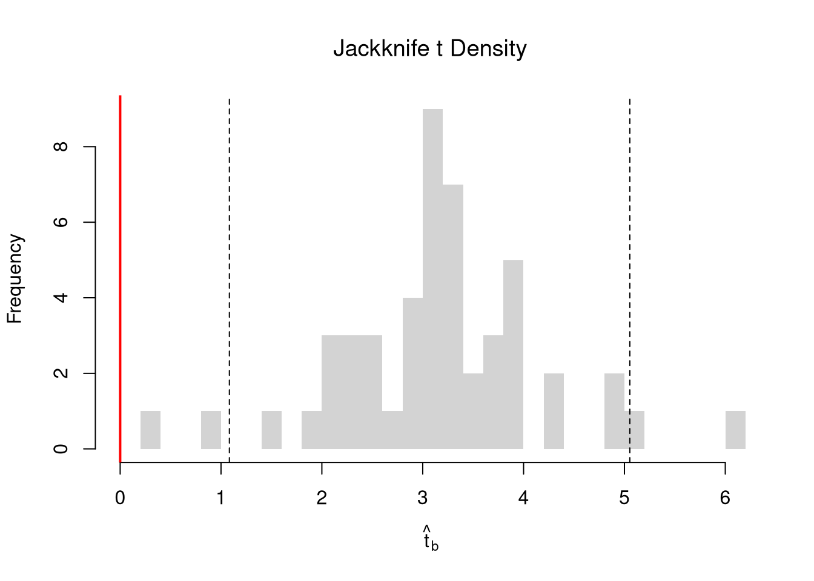
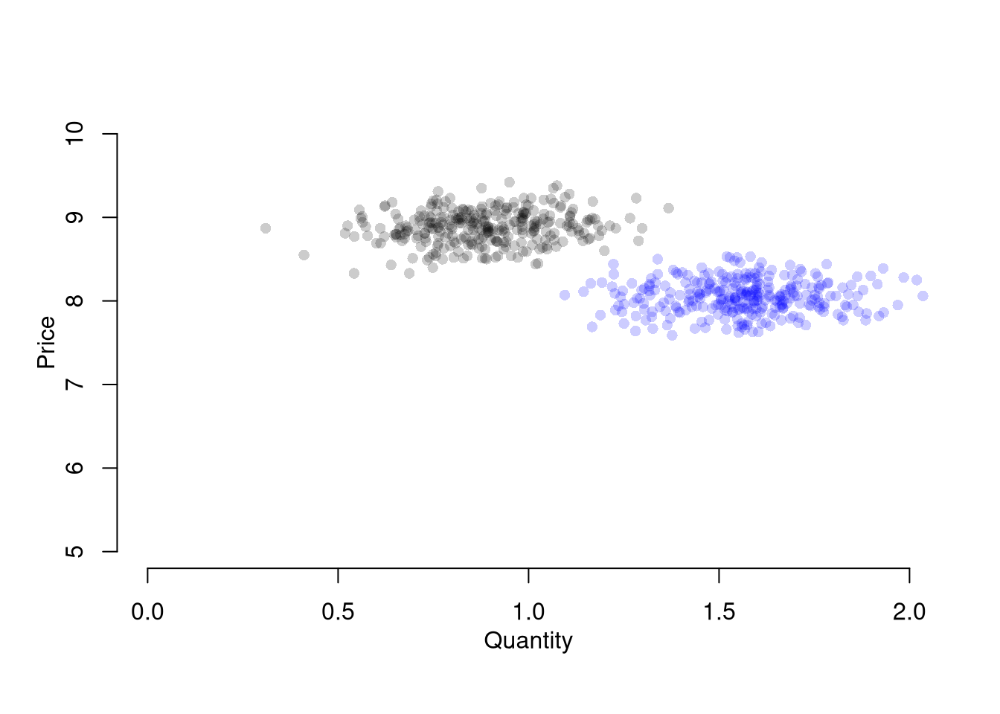
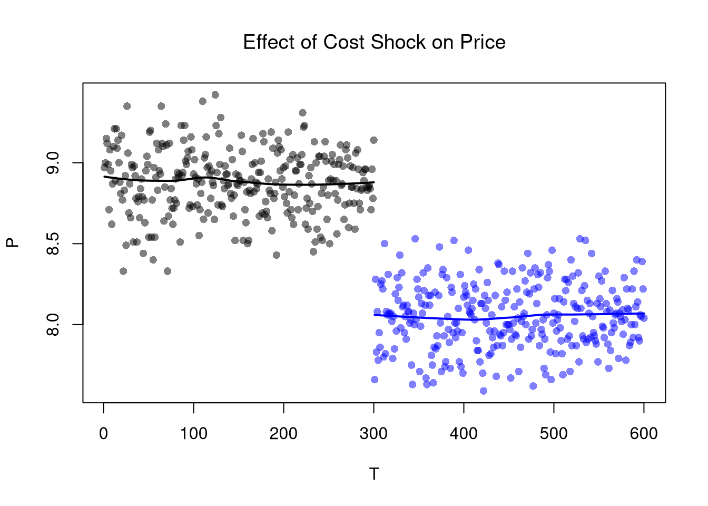
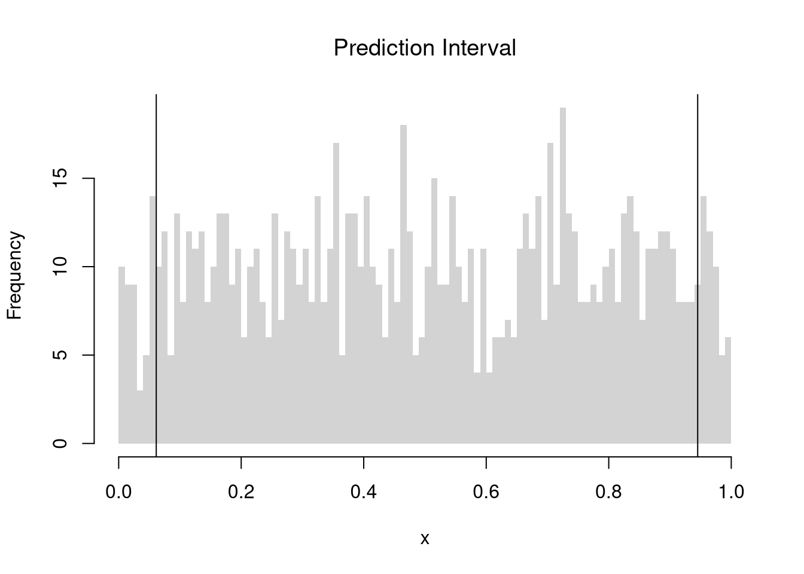

# (PART) Introduction to Linear Regression {-}


This section overviews linear regression models from the perspective that ``all models are wrong, but some are useful''. All linear models are estimated via Ordinary Least Squares (OLS). For more in-depth introductions, which typically begin by assuming a linear data generating process, see https://jadamso.github.io/Rbooks/ordinary-least-squares.html#more-literature. 

# Basic Regression
***

Suppose we have some bivariate data. First, we inspect it as in Part I.


``` r
# Bivariate Data from USArrests
xy <- USArrests[,c('Murder','UrbanPop')]
colnames(xy) <- c('y','x')

# Inspect Dataset
# head(xy)
# summary(xy)
plot(y~x, xy, col=grey(0,.5), pch=16)
title('Murder and Urbanization in America 1975', font.main=1)
```


Now we will assess the association between variables by fitting a line through the data points using a "regression".

## Simple Linear Regression
This refers to fitting a linear model to bivariate data. Specifically, our model is 
$$
y_i=\beta_{0}+\beta_{1} x_i+\epsilon_{i}
$$
and our objective function is
$$
min_{\beta_{0}, \beta_{1}} \sum_{i=1}^{N} \left( \epsilon_{i} \right)^2 =  min_{\beta_{0}, \beta_{1}} \sum_{i=1} \left( y_i - [\beta_{0}+\beta_{1} x_i] \right).
$$
Minimizing the sum of squared errors yields parameter estimates
$$
\hat{\beta_{0}}=\bar{Y}-\hat{\beta_{1}}\bar{X} \\
\hat{\beta_{1}}=\frac{\sum_{i}^{}(x_i-\bar{x})(y_i-\bar{y})}{\sum_{i}^{}(x_i-\bar{x})^2} = \frac{C_{XY}}{V_{X}}
$$
and predictions
$$
\hat{y}_i=\hat{\beta_{0}}+\hat{\beta}x_i\\
\hat{\epsilon}_i=y_i-\hat{y}_i
$$


``` r
# Run a Regression Coefficients
reg <- lm(y~x, dat=xy)
# predict(reg)
# resid(reg)
# coef(reg)
```

#### **Goodness of Fit**. {-}
First, we qualitatively analyze the ''Goodness of fit'' of our model, we plot our predictions for a qualitative analysis

``` r
# Plot Data and Predictions
library(plotly)
xy$ID <- rownames(USArrests)
xy$pred <- predict(reg)
xy$resid <- resid(reg)
fig <- plotly::plot_ly(
  xy, x=~x, y=~y,
  mode='markers',
  type='scatter',
  hoverinfo='text',
  marker=list(color=grey(0,.25), size=10),
  text=~paste('<b>', ID, '</b>',
              '<br>Urban  :', x,
              '<br>Murder :', y,
              '<br>Predicted Murder :', round(pred,2),
              '<br>Residual :', round(resid,2)))              
# Add Legend
fig <- plotly::layout(fig,
          showlegend=F,
          title='Crime and Urbanization in America 1975',
          xaxis = list(title='Percent of People in an Urban Area'),
          yaxis = list(title='Homicide Arrests per 100,000 People'))
# Plot Model Predictions
add_trace(fig, x=~x, y=~pred,
    inherit=F, hoverinfo='none',
    mode='lines+markers', type='scatter',
    color=I('black'),
    line=list(width=1/2),
    marker=list(symbol=134, size=5))
```


```{=html}
<div class="plotly html-widget html-fill-item" id="htmlwidget-be2c5a79d31819121829" style="width:672px;height:480px;"></div>
<script type="application/json" data-for="htmlwidget-be2c5a79d31819121829">{"x":{"visdat":{"11c1454d4cb2d":["function () ","plotlyVisDat"]},"cur_data":"11c1454d4cb2d","attrs":{"11c1454d4cb2d":{"x":{},"y":{},"mode":"markers","hoverinfo":"text","marker":{"color":"#00000040","size":10},"text":{},"alpha_stroke":1,"sizes":[10,100],"spans":[1,20],"type":"scatter"},"11c1454d4cb2d.1":{"x":{},"y":{},"hoverinfo":"none","mode":"lines+markers","type":"scatter","color":["black"],"line":{"width":0.5},"marker":{"symbol":134,"size":5},"inherit":false}},"layout":{"margin":{"b":40,"l":60,"t":25,"r":10},"showlegend":false,"title":"Crime and Urbanization in America 1975","xaxis":{"domain":[0,1],"automargin":true,"title":"Percent of People in an Urban Area"},"yaxis":{"domain":[0,1],"automargin":true,"title":"Homicide Arrests per 100,000 People"},"hovermode":"closest"},"source":"A","config":{"modeBarButtonsToAdd":["hoverclosest","hovercompare"],"showSendToCloud":false},"data":[{"x":[58,48,80,50,91,78,77,72,80,60,83,54,83,65,57,66,52,66,51,67,85,74,66,44,70,53,62,81,56,89,70,86,45,44,75,68,67,72,87,48,45,59,80,80,32,63,73,39,66,60],"y":[13.199999999999999,10,8.0999999999999996,8.8000000000000007,9,7.9000000000000004,3.2999999999999998,5.9000000000000004,15.4,17.399999999999999,5.2999999999999998,2.6000000000000001,10.4,7.2000000000000002,2.2000000000000002,6,9.6999999999999993,15.4,2.1000000000000001,11.300000000000001,4.4000000000000004,12.1,2.7000000000000002,16.100000000000001,9,6,4.2999999999999998,12.199999999999999,2.1000000000000001,7.4000000000000004,11.4,11.1,13,0.80000000000000004,7.2999999999999998,6.5999999999999996,4.9000000000000004,6.2999999999999998,3.3999999999999999,14.4,3.7999999999999998,13.199999999999999,12.699999999999999,3.2000000000000002,2.2000000000000002,8.5,4,5.7000000000000002,2.6000000000000001,6.7999999999999998],"mode":"markers","hoverinfo":["text","text","text","text","text","text","text","text","text","text","text","text","text","text","text","text","text","text","text","text","text","text","text","text","text","text","text","text","text","text","text","text","text","text","text","text","text","text","text","text","text","text","text","text","text","text","text","text","text","text"],"marker":{"color":"#00000040","size":10,"line":{"color":"rgba(31,119,180,1)"}},"text":["<b> Alabama <\/b> <br>Urban  : 58 <br>Murder : 13.2 <br>Predicted Murder : 7.63 <br>Residual : 5.57","<b> Alaska <\/b> <br>Urban  : 48 <br>Murder : 10 <br>Predicted Murder : 7.42 <br>Residual : 2.58","<b> Arizona <\/b> <br>Urban  : 80 <br>Murder : 8.1 <br>Predicted Murder : 8.09 <br>Residual : 0.01","<b> Arkansas <\/b> <br>Urban  : 50 <br>Murder : 8.8 <br>Predicted Murder : 7.46 <br>Residual : 1.34","<b> California <\/b> <br>Urban  : 91 <br>Murder : 9 <br>Predicted Murder : 8.32 <br>Residual : 0.68","<b> Colorado <\/b> <br>Urban  : 78 <br>Murder : 7.9 <br>Predicted Murder : 8.05 <br>Residual : -0.15","<b> Connecticut <\/b> <br>Urban  : 77 <br>Murder : 3.3 <br>Predicted Murder : 8.03 <br>Residual : -4.73","<b> Delaware <\/b> <br>Urban  : 72 <br>Murder : 5.9 <br>Predicted Murder : 7.92 <br>Residual : -2.02","<b> Florida <\/b> <br>Urban  : 80 <br>Murder : 15.4 <br>Predicted Murder : 8.09 <br>Residual : 7.31","<b> Georgia <\/b> <br>Urban  : 60 <br>Murder : 17.4 <br>Predicted Murder : 7.67 <br>Residual : 9.73","<b> Hawaii <\/b> <br>Urban  : 83 <br>Murder : 5.3 <br>Predicted Murder : 8.15 <br>Residual : -2.85","<b> Idaho <\/b> <br>Urban  : 54 <br>Murder : 2.6 <br>Predicted Murder : 7.55 <br>Residual : -4.95","<b> Illinois <\/b> <br>Urban  : 83 <br>Murder : 10.4 <br>Predicted Murder : 8.15 <br>Residual : 2.25","<b> Indiana <\/b> <br>Urban  : 65 <br>Murder : 7.2 <br>Predicted Murder : 7.78 <br>Residual : -0.58","<b> Iowa <\/b> <br>Urban  : 57 <br>Murder : 2.2 <br>Predicted Murder : 7.61 <br>Residual : -5.41","<b> Kansas <\/b> <br>Urban  : 66 <br>Murder : 6 <br>Predicted Murder : 7.8 <br>Residual : -1.8","<b> Kentucky <\/b> <br>Urban  : 52 <br>Murder : 9.7 <br>Predicted Murder : 7.5 <br>Residual : 2.2","<b> Louisiana <\/b> <br>Urban  : 66 <br>Murder : 15.4 <br>Predicted Murder : 7.8 <br>Residual : 7.6","<b> Maine <\/b> <br>Urban  : 51 <br>Murder : 2.1 <br>Predicted Murder : 7.48 <br>Residual : -5.38","<b> Maryland <\/b> <br>Urban  : 67 <br>Murder : 11.3 <br>Predicted Murder : 7.82 <br>Residual : 3.48","<b> Massachusetts <\/b> <br>Urban  : 85 <br>Murder : 4.4 <br>Predicted Murder : 8.2 <br>Residual : -3.8","<b> Michigan <\/b> <br>Urban  : 74 <br>Murder : 12.1 <br>Predicted Murder : 7.97 <br>Residual : 4.13","<b> Minnesota <\/b> <br>Urban  : 66 <br>Murder : 2.7 <br>Predicted Murder : 7.8 <br>Residual : -5.1","<b> Mississippi <\/b> <br>Urban  : 44 <br>Murder : 16.1 <br>Predicted Murder : 7.34 <br>Residual : 8.76","<b> Missouri <\/b> <br>Urban  : 70 <br>Murder : 9 <br>Predicted Murder : 7.88 <br>Residual : 1.12","<b> Montana <\/b> <br>Urban  : 53 <br>Murder : 6 <br>Predicted Murder : 7.53 <br>Residual : -1.53","<b> Nebraska <\/b> <br>Urban  : 62 <br>Murder : 4.3 <br>Predicted Murder : 7.71 <br>Residual : -3.41","<b> Nevada <\/b> <br>Urban  : 81 <br>Murder : 12.2 <br>Predicted Murder : 8.11 <br>Residual : 4.09","<b> New Hampshire <\/b> <br>Urban  : 56 <br>Murder : 2.1 <br>Predicted Murder : 7.59 <br>Residual : -5.49","<b> New Jersey <\/b> <br>Urban  : 89 <br>Murder : 7.4 <br>Predicted Murder : 8.28 <br>Residual : -0.88","<b> New Mexico <\/b> <br>Urban  : 70 <br>Murder : 11.4 <br>Predicted Murder : 7.88 <br>Residual : 3.52","<b> New York <\/b> <br>Urban  : 86 <br>Murder : 11.1 <br>Predicted Murder : 8.22 <br>Residual : 2.88","<b> North Carolina <\/b> <br>Urban  : 45 <br>Murder : 13 <br>Predicted Murder : 7.36 <br>Residual : 5.64","<b> North Dakota <\/b> <br>Urban  : 44 <br>Murder : 0.8 <br>Predicted Murder : 7.34 <br>Residual : -6.54","<b> Ohio <\/b> <br>Urban  : 75 <br>Murder : 7.3 <br>Predicted Murder : 7.99 <br>Residual : -0.69","<b> Oklahoma <\/b> <br>Urban  : 68 <br>Murder : 6.6 <br>Predicted Murder : 7.84 <br>Residual : -1.24","<b> Oregon <\/b> <br>Urban  : 67 <br>Murder : 4.9 <br>Predicted Murder : 7.82 <br>Residual : -2.92","<b> Pennsylvania <\/b> <br>Urban  : 72 <br>Murder : 6.3 <br>Predicted Murder : 7.92 <br>Residual : -1.62","<b> Rhode Island <\/b> <br>Urban  : 87 <br>Murder : 3.4 <br>Predicted Murder : 8.24 <br>Residual : -4.84","<b> South Carolina <\/b> <br>Urban  : 48 <br>Murder : 14.4 <br>Predicted Murder : 7.42 <br>Residual : 6.98","<b> South Dakota <\/b> <br>Urban  : 45 <br>Murder : 3.8 <br>Predicted Murder : 7.36 <br>Residual : -3.56","<b> Tennessee <\/b> <br>Urban  : 59 <br>Murder : 13.2 <br>Predicted Murder : 7.65 <br>Residual : 5.55","<b> Texas <\/b> <br>Urban  : 80 <br>Murder : 12.7 <br>Predicted Murder : 8.09 <br>Residual : 4.61","<b> Utah <\/b> <br>Urban  : 80 <br>Murder : 3.2 <br>Predicted Murder : 8.09 <br>Residual : -4.89","<b> Vermont <\/b> <br>Urban  : 32 <br>Murder : 2.2 <br>Predicted Murder : 7.09 <br>Residual : -4.89","<b> Virginia <\/b> <br>Urban  : 63 <br>Murder : 8.5 <br>Predicted Murder : 7.73 <br>Residual : 0.77","<b> Washington <\/b> <br>Urban  : 73 <br>Murder : 4 <br>Predicted Murder : 7.94 <br>Residual : -3.94","<b> West Virginia <\/b> <br>Urban  : 39 <br>Murder : 5.7 <br>Predicted Murder : 7.23 <br>Residual : -1.53","<b> Wisconsin <\/b> <br>Urban  : 66 <br>Murder : 2.6 <br>Predicted Murder : 7.8 <br>Residual : -5.2","<b> Wyoming <\/b> <br>Urban  : 60 <br>Murder : 6.8 <br>Predicted Murder : 7.67 <br>Residual : -0.87"],"type":"scatter","error_y":{"color":"rgba(31,119,180,1)"},"error_x":{"color":"rgba(31,119,180,1)"},"line":{"color":"rgba(31,119,180,1)"},"xaxis":"x","yaxis":"y","frame":null},{"x":[58,48,80,50,91,78,77,72,80,60,83,54,83,65,57,66,52,66,51,67,85,74,66,44,70,53,62,81,56,89,70,86,45,44,75,68,67,72,87,48,45,59,80,80,32,63,73,39,66,60],"y":[7.630152672499273,7.4208060843020238,8.0907151665332222,7.4626754019414738,8.3209964135501959,8.0488458488937713,8.0279111900740467,7.9232378959754222,8.0907151665332222,7.672021990138723,8.1535191429923959,7.546414037220373,8.1535191429923959,7.7766952842373476,7.6092180136795484,7.7976299430570721,7.5045447195809238,7.7976299430570721,7.4836100607611984,7.8185646018767976,8.1953884606318468,7.9651072136148722,7.7976299430570721,7.3370674490231238,7.8813685783359722,7.5254793784006484,7.713891307778173,8.1116498253529468,7.588283354859823,8.279127095910745,7.8813685783359722,8.2163231194515713,7.3580021078428492,7.3370674490231238,7.9860418724345967,7.8394992606965221,7.8185646018767976,7.9232378959754222,8.2372577782712959,7.4208060843020238,7.3580021078428492,7.6510873313189975,8.0907151665332222,8.0907151665332222,7.0858515431864246,7.7348259665978976,7.9441725547951467,7.2323941549244992,7.7976299430570721,7.672021990138723],"hoverinfo":["none","none","none","none","none","none","none","none","none","none","none","none","none","none","none","none","none","none","none","none","none","none","none","none","none","none","none","none","none","none","none","none","none","none","none","none","none","none","none","none","none","none","none","none","none","none","none","none","none","none"],"mode":"lines+markers","type":"scatter","line":{"color":"rgba(0,0,0,1)","width":0.5},"marker":{"color":"rgba(0,0,0,1)","symbol":134,"size":5,"line":{"color":"rgba(0,0,0,1)"}},"textfont":{"color":"rgba(0,0,0,1)"},"error_y":{"color":"rgba(0,0,0,1)"},"error_x":{"color":"rgba(0,0,0,1)"},"xaxis":"x","yaxis":"y","frame":null}],"highlight":{"on":"plotly_click","persistent":false,"dynamic":false,"selectize":false,"opacityDim":0.20000000000000001,"selected":{"opacity":1},"debounce":0},"shinyEvents":["plotly_hover","plotly_click","plotly_selected","plotly_relayout","plotly_brushed","plotly_brushing","plotly_clickannotation","plotly_doubleclick","plotly_deselect","plotly_afterplot","plotly_sunburstclick"],"base_url":"https://plot.ly"},"evals":[],"jsHooks":[]}</script>
```

For a quantitative summary, we can also compute the linear correlation between the predictions and the data 
$$
R = Cor( \hat{y}_i, y)
$$
With linear models, we typically compute $R^2$, known as the "coefficient of determination", using the sums of squared errors (Total, Explained, and Residual)
$$
\underbrace{\sum_{i}(y_i-\bar{y})^2}_\text{TSS}=\underbrace{\sum_{i}(\hat{y}_i-\bar{y})^2}_\text{ESS}+\underbrace{\sum_{i}\hat{\epsilon_{i}}^2}_\text{RSS}\\
R^2 = \frac{ESS}{TSS}=1-\frac{RSS}{TSS}
$$

``` r
# Manually Compute R2
Ehat <- resid(reg)
RSS  <- sum(Ehat^2)
Y <- xy$y
TSS  <- sum((Y-mean(Y))^2)
R2 <- 1 - RSS/TSS
R2
## [1] 0.00484035

# Check R2
summary(reg)$r.squared
## [1] 0.00484035

# Double Check R2
R <- cor(xy$y, predict(reg))
R^2
## [1] 0.00484035
```


## Variability Estimates

A regression coefficient is a statistic. And, just like all statistics, we can calculate 

* *standard deviation*: variability within a single sample.
* *standard error*: variability across different samples.
* *confidence interval:* range your statistic varies across different samples.


Note that values reported by your computer do not necessarily satisfy this definition. To calculate these statistics, we will estimate variability using *data-driven* methods. (For some theoretical background, see, e.g., https://www.sagepub.com/sites/default/files/upm-binaries/21122_Chapter_21.pdf.)

#### **Jackknife**. {-}
We first consider the simplest, the jackknife. In this procedure, we loop through each row of the dataset. And, in each iteration of the loop, we drop that observation from the dataset and reestimate the statistic of interest. We then calculate the standard deviation of the statistic across all ``subsamples''.


``` r
# Jackknife Standard Errors for OLS Coefficient
jack_regs <- lapply(1:nrow(xy), function(i){
    xy_i <- xy[-i,]
    reg_i <- lm(y~x, dat=xy_i)
})
jack_coefs <- sapply(jack_regs, coef)['x',]
jack_se <- sd(jack_coefs)
# classic_se <- sqrt(diag(vcov(reg)))[['x']]


# Jackknife Sampling Distribution
hist(jack_coefs, breaks=25,
    main=paste0('SE est. = ', round(jack_se,4)),
    font.main=1, border=NA,
    xlab=expression(beta[-i]))
# Original Estimate
abline(v=coef(reg)['x'], lwd=2)
# Jackknife Confidence Intervals
jack_ci_percentile <- quantile(jack_coefs, probs=c(.025,.975))
abline(v=jack_ci_percentile, lty=2)
```


``` r


# Plot Normal Approximation
# jack_ci_normal <- jack_mean+c(-1.96, +1.96)*jack_se
# abline(v=jack_ci_normal, col="red", lty=3)
```

#### **Bootstrap**. {-}

There are several resampling techniques. The other main one is the bootstrap, which resamples with *replacement* for an *arbitrary* number of iterations. When bootstrapping a dataset with $n$ observations, you randomly resample all $n$ rows in your data set $B$ times. Random subsampling is one of many hybrid approaches that tries to combine the best of both worlds.

| | Sample Size per Iteration | Number of Iterations | Resample |
| -------- | ------- | ------- | ------- |
Bootstrap | $n$     | $B$  | With Replacement |
Jackknife | $n-1$   | $n$  | Without Replacement |
Random Subsample | $m < n$ | $B$  | Without Replacement |


``` r
# Bootstrap
boot_regs <- lapply(1:399, function(b){
    b_id <- sample( nrow(xy), replace=T)
    xy_b <- xy[b_id,]
    reg_b <- lm(y~x, dat=xy_b)
})
boot_coefs <- sapply(boot_regs, coef)['x',]
boot_se <- sd(boot_coefs)

hist(boot_coefs, breaks=25,
    main=paste0('SE est. = ', round(boot_se,4)),
    font.main=1, border=NA,
    xlab=expression(beta[b]))
boot_ci_percentile <- quantile(boot_coefs, probs=c(.025,.975))
abline(v=boot_ci_percentile, lty=2)
abline(v=coef(reg)['x'], lwd=2)
```


``` r
# Random Subsamples
rs_regs <- lapply(1:399, function(b){
    b_id <- sample( nrow(xy), nrow(xy)-10, replace=F)
    xy_b <- xy[b_id,]
    reg_b <- lm(y~x, dat=xy_b)
})
rs_coefs <- sapply(rs_regs, coef)['x',]
rs_se <- sd(rs_coefs)

hist(rs_coefs, breaks=25,
    main=paste0('SE est. = ', round(rs_se,4)),
    font.main=1, border=NA,
    xlab=expression(beta[b]))
abline(v=coef(reg)['x'], lwd=2)
rs_ci_percentile <- quantile(rs_coefs, probs=c(.025,.975))
abline(v=rs_ci_percentile, lty=2)
```


We can also bootstrap other statistics, such as a t-statistic or $R^2$. We do such things to test a null hypothesis, which is often ``no relationship''. We are rarely interested in computing standard errors and conducting hypothesis tests for two variables. However, we work through the ideas in the two-variable case to better understand the multi-variable case.

## Hypothesis Tests

#### **Invert a CI**. {-}

One main way to conduct hypothesis tests is to examine whether a confidence interval contains a hypothesized value. Does the slope coefficient equal $0$? For reasons we won't go into in this class, we typically normalize the coefficient by its standard error: $$ \hat{t} = \frac{\hat{\beta}}{\hat{\sigma}_{\hat{\beta}}} $$

``` r
tvalue <- coef(reg)['x']/jack_se

jack_t <- sapply(jack_regs, function(reg_b){
    # Data
    xy_b <- reg_b$model
    # Coefficient
    beta_b <- coef(reg_b)[['x']]
    t_hat_b <- beta_b/jack_se
    return(t_hat_b)
})

hist(jack_t, breaks=25,
    main='Jackknife t Density',
    font.main=1, border=NA,
    xlab=expression(hat(t)[b]), 
    xlim=range(c(0, jack_t)) )
abline(v=quantile(jack_t, probs=c(.025,.975)), lty=2)
abline(v=0, col="red", lwd=2)
```



#### **Impose the Null**.{-}
We can also compute a null distribution. We focus on the simplest: bootstrap simulations that each impose the null hypothesis and re-estimate the statistic of interest. Specifically, we compute the distribution of t-values on data with randomly reshuffled outcomes (imposing the null), and compare how extreme the observed value is.

``` r
# Null Distribution for Beta
boot_t0 <- sapply( 1:399, function(b){
    xy_b <- xy
    xy_b$y <- sample( xy_b$y, replace=T)
    reg_b <- lm(y~x, dat=xy_b)
    beta_b <- coef(reg_b)[['x']]
    t_hat_b <- beta_b/jack_se
    return(t_hat_b)
})

# Null Bootstrap Distribution
boot_ci_percentile0 <- quantile(boot_t0, probs=c(.025,.975))
hist(boot_t0, breaks=25,
    main='Null Bootstrap Density',
    font.main=1, border=NA,
    xlab=expression(hat(t)[b]),
    xlim=range(boot_t0))
abline(v=boot_ci_percentile0, lty=2)
abline(v=tvalue, col="red", lwd=2)
```


Alternatively, you can impose the null by recentering the sampling distribution around the theoretical value; $$\hat{t} = \frac{\hat{\beta} - \beta_{0} }{\hat{\sigma}_{\hat{\beta}}}.$$ Under some assumptions, the null distribution follows a t-distribution. (For more on parametric t-testing based on statistical theory, see https://www.econometrics-with-r.org/4-lrwor.html.)


In any case, we can calculate a *p-value*: the probability you would see something as extreme as your statistic under the null (assuming your null hypothesis was true). We can always calculate a p-value from an explicit null distribution.

``` r
# One Sided Test for P(t > boot_t | Null) = 1 - P(t < boot_t | Null)
That_NullDist1 <- ecdf(boot_t0)
Phat1  <- 1-That_NullDist1(jack_t)

# Two Sided Test for P(t > jack_t or t < -jack_t | Null)
That_NullDist2 <- ecdf(abs(boot_t0))
plot(That_NullDist2, xlim=range(boot_t0, jack_t),
    xlab=expression( abs(hat(t)[b]) ),
    main='Null Bootstrap Distribution', font.main=1)
abline(v=tvalue, col='red')
```


``` r

Phat2  <-  1-That_NullDist2( abs(tvalue))
Phat2
## [1] 0.6240602
```

## Local Linear Regression

It is generally safe to assume that you could be analyzing data with nonlinear relationships. Here, our model can be represented as
\begin{eqnarray}
y_{i} = m(x_{i}) + e_{i},
\end{eqnarray}
with $m$ being some unknown but smooth function. In such cases, linear regressions can still be useful.

#### **Piecewise Regression**.{-}
The simplest case is *segmented/piecewise regression*, which runs a separate regression for different subsets of the data.

``` r
# Globally Linear
reg <- lm(y~x, data=xy)

# Diagnose Fit
#plot( fitted(reg), resid(reg), pch=16, col=grey(0,.5))
#plot( xy$x, resid(reg), pch=16, col=grey(0,.5))

# Linear in 2 Pieces (subsets)
xcut2 <- cut(xy$x,2)
xy_list2 <- split(xy, xcut2)
regs2 <- lapply(xy_list2, function(xy_s){
    lm(y~x, data=xy_s)
})
sapply(regs2, coef)
##             (31.9,61.5] (61.5,91.1]
## (Intercept)  -0.2836303  4.15337509
## x             0.1628157  0.04760783

# Linear in 3 Pieces (subsets or bins)
xcut3 <- cut(xy$x, seq(32,92,by=20)) # Finer Bins
xy_list3 <- split(xy, xcut3)
regs3 <- lapply(xy_list3, function(xy_s){
    lm(y~x, data=xy_s)
})
sapply(regs3, coef)
##                (32,52]    (52,72]      (72,92]
## (Intercept) 4.60313390 2.36291848  8.653829140
## x           0.08233618 0.08132841 -0.007174454
```

Compare Predictions

``` r
pred1 <- data.frame(yhat=predict(reg), x=reg$model$x)
pred1 <- pred1[order(pred1$x),]

pred2 <- lapply(regs2, function(reg){
    data.frame(yhat=predict(reg), x=reg$model$x)
})
pred2 <- do.call(rbind,pred2)
pred2 <- pred2[order(pred2$x),]

pred3 <- lapply(regs3, function(reg){
    data.frame(yhat=predict(reg), x=reg$model$x)
})
pred3 <- do.call(rbind,pred3)
pred3 <- pred3[order(pred3$x),]

# Compare Predictions
plot(y ~ x, pch=16, col=grey(0,.5), dat=xy)
lines(yhat~x, pred1, lwd=2, col=2)
lines(yhat~x, pred2, lwd=2, col=4)
lines(yhat~x, pred3, lwd=2, col=3)
legend('topleft',
    legend=c('Globally Linear', 'Peicewise Linear (2)','Peicewise Linear (3)'),
    lty=1, col=c(2,4,3), cex=.8)
```


#### **Locally Linear**.{-}
A less simple case is a **local linear regression** which conducts a linear regression for each data point using a subsample of data around it. 

``` r
# ``Naive" Smoother
pred_fun <- function(x0, h, xy){
    # Assign equal weight to observations within h distance to x0
    # 0 weight for all other observations
    ki   <- dunif(xy$x, x0-h, x0+h) 
    llls <- lm(y~x, data=xy, weights=ki)
    yhat_i <- predict(llls, newdata=data.frame(x=x0))
}

X0 <- sort(unique(xy$x))
pred_lo1 <- sapply(X0, pred_fun, h=2, xy=xy)
pred_lo2 <- sapply(X0, pred_fun, h=20, xy=xy)

plot(y~x, pch=16, data=xy, col=grey(0,.5),
    ylab='Murder Rate', xlab='Population Density')
cols <- c(rgb(.8,0,0,.5), rgb(0,0,.8,.5))
lines(X0, pred_lo1, col=cols[1], lwd=1, type='o')
lines(X0, pred_lo2, col=cols[2], lwd=1, type='o')
legend('topleft', title='Locally Linear',
    legend=c('h=2 ', 'h=20'),
    lty=1, col=cols, cex=.8)
```


Note that there are more complex versions of local linear regressions (see https://shinyserv.es/shiny/kreg/ for a nice illustration.) An even more complex (and more powerful) version is **loess**, which uses adaptive bandwidths in order to have a similar number of data points in each subsample (especially useful when $X$ is not uniform.)


``` r
# Adaptive-width subsamples with non-uniform weights
xy0 <- xy[order(xy$x),]
plot(y~x, pch=16, col=grey(0,.5), dat=xy0)

reg_lo4 <- loess(y~x, data=xy0, span=.4)
reg_lo8 <- loess(y~x, data=xy0, span=.8)

cols <- hcl.colors(3,alpha=.75)[-3]
lines(xy0$x, predict(reg_lo4),
    col=cols[1], type='o', pch=2)
lines(xy0$x, predict(reg_lo8),
    col=cols[2], type='o', pch=2)

legend('topleft', title='Loess',
    legend=c('span=.4 ', 'span=.8'),
    lty=1, col=cols, cex=.8)
```


#### **Confidence Bands**. {-}
The smoothed predicted values estimate the local means. So we can also construct confidence bands

``` r
# Loess
xy0 <- xy[order(xy$x),]
X0 <- unique(xy0$x)
reg_lo <- loess(y~x, data=xy0, span=.8)

# Jackknife CI
jack_lo <- sapply(1:nrow(xy), function(i){
    xy_i <- xy[-i,]
    reg_i <- loess(y~x, dat=xy_i, span=.8)
    predict(reg_i, newdata=data.frame(x=X0))
})
jack_cb <- apply(jack_lo,1, quantile,
    probs=c(.025,.975), na.rm=T)

# Plot
plot(y~x, pch=16, col=grey(0,.5), dat=xy0)
preds_lo <- predict(reg_lo, newdata=data.frame(x=X0))
lines(X0, preds_lo,
    col=hcl.colors(3,alpha=.75)[2],
    type='o', pch=2)
# Plot CI
polygon(
    c(X0, rev(X0)),
    c(jack_cb[1,], rev(jack_cb[2,])),
    col=hcl.colors(3,alpha=.25)[2],
    border=NA)
```


# Intermediate Regression
***

First, note that you can summarize a dataset with multiple variables using the previous tools.


``` r
# Inspect Dataset on police arrests for the USA in 1973
head(USArrests)
##            Murder Assault UrbanPop Rape
## Alabama      13.2     236       58 21.2
## Alaska       10.0     263       48 44.5
## Arizona       8.1     294       80 31.0
## Arkansas      8.8     190       50 19.5
## California    9.0     276       91 40.6
## Colorado      7.9     204       78 38.7

library(psych)
pairs.panels( USArrests[,c('Murder','Assault','UrbanPop')],
    hist.col=grey(0,.25), breaks=30, density=F, hist.border=NA, # Diagonal
    ellipses=F, rug=F, smoother=F, pch=16, col='red' # Lower Triangle
    )
```


## Multiple Linear Regression
With $K$ variables, the linear model is
$$
y_i=\beta_0+\beta_1 x_{i1}+\beta_2 x_{i2}+\ldots+\beta_K x_{iK}+\epsilon_i = [1~~  x_{i1} ~~...~~ x_{iK}] \beta + \epsilon_i
$$
and our objective is
$$
min_{\beta} \sum_{i=1}^{N} (\epsilon_i)^2.
$$

Denoting 
$$
y= \begin{pmatrix} 
y_{1} \\ \vdots \\ y_{N}
\end{pmatrix} \quad
\textbf{X} = \begin{pmatrix} 
1 & x_{11} & ... & x_{1K} \\
& \vdots & & \\
1 & x_{N1} & ... & x_{NK} 
\end{pmatrix},
$$
we can also write the model and objective in matrix form
$$
y=\textbf{X}\beta+\epsilon\\
min_{\beta} (\epsilon' \epsilon)
$$

Minimizing the squared errors yields coefficient estimates
$$
\hat{\beta}=(\textbf{X}'\textbf{X})^{-1}\textbf{X}'y
$$
and predictions 
$$
\hat{y}=\textbf{X} \hat{\beta} \\
\hat{\epsilon}=y - \hat{y} \\
$$


``` r
# Manually Compute
Y <- USArrests[,'Murder']
X <- USArrests[,c('Assault','UrbanPop')]
X <- as.matrix(cbind(1,X))

XtXi <- solve(t(X)%*%X)
Bhat <- XtXi %*% (t(X)%*%Y)
c(Bhat)
## [1]  3.20715340  0.04390995 -0.04451047

# Check
reg <- lm(Murder~Assault+UrbanPop, data=USArrests)
coef(reg)
## (Intercept)     Assault    UrbanPop 
##  3.20715340  0.04390995 -0.04451047
```

To measure the ``Goodness of fit'' of the model, we can again plot our predictions.

``` r
plot(USArrests$Murder, predict(reg), pch=16, col=grey(0,.5))
abline(a=0,b=1, lty=2)
```


We can also again compute sums of squared errors. Adding random data may sometimes improve the fit, however, so we adjust the $R^2$ by the number of covariates $K$.
$$
R^2 = \frac{ESS}{TSS}=1-\frac{RSS}{TSS}\\
R^2_{\text{adj.}} = 1-\frac{N-1}{N-K}(1-R^2)
$$


``` r
ksims <- 1:30
for(k in ksims){ 
    USArrests[,paste0('R',k)] <- runif(nrow(USArrests),0,20)
}
reg_sim <- lapply(ksims, function(k){
    rvars <- c('Assault','UrbanPop', paste0('R',1:k))
    rvars2 <- paste0(rvars, collapse='+')
    reg_k <- lm( paste0('Murder~',rvars2), data=USArrests)
})
R2_sim <- sapply(reg_sim, function(reg_k){  summary(reg_k)$r.squared })
R2adj_sim <- sapply(reg_sim, function(reg_k){  summary(reg_k)$adj.r.squared })

plot.new()
plot.window(xlim=c(0,30), ylim=c(0,1))
points(ksims, R2_sim)
points(ksims, R2adj_sim, pch=16)
axis(1)
axis(2)
mtext(expression(R^2),2, line=3)
mtext('Additional Random Covariates', 1, line=3)
legend('topleft', horiz=T,
    legend=c('Undjusted', 'Adjusted'), pch=c(1,16))
```


## Factor Variables

So far, we have discussed cardinal data where the difference between units always means the same thing: e.g., $4-3=2-1$. There are also factor variables

* Ordered: refers to Ordinal data. The difference between units means something, but not always the same thing. For example, $4th - 3rd \neq 2nd - 1st$.
* Unordered: refers to Categorical data. The difference between units is meaningless. For example, $B-A=?$

To analyze either factor, we often convert them into indicator variables or dummies; $D_{c}=\mathbf{1}( Factor = c)$. One common case is if you have observations of individuals over time periods, then you may have two factor variables. An unordered factor that indicates who an individual is; for example $D_{i}=\mathbf{1}( Individual = i)$, and an order factor that indicates the time period; for example $D_{t}=\mathbf{1}( Time \in [month~ t, month~ t+1) )$. There are many other cases you see factor variables, including spatial ID's in purely cross sectional data.

Be careful not to handle categorical data as if they were cardinal. E.g., generate city data with Leipzig=1, Lausanne=2, LosAngeles=3, ... and then include city as if it were a cardinal number (that's a big no-no). The same applied to ordinal data; PopulationLeipzig=2, PopulationLausanne=3, PopulationLosAngeles=1.


``` r
N <- 1000
x <- runif(N,3,8)
e <- rnorm(N,0,0.4)
fo <- factor(rbinom(N,4,.5), ordered=T)
fu <- factor(rep(c('A','B'),N/2), ordered=F)
dA <- 1*(fu=='A')
y <- (2^as.integer(fo)*dA )*sqrt(x)+ 2*as.integer(fo)*e
dat_f <- data.frame(y,x,fo,fu)
```

With factors, you can still include them in the design matrix of an OLS regression
$$
y_{it} = x_{it} \beta_{x} + d_{t}\beta_{t}
$$
When, as commonly done, the factors are modeled as being additively seperable, they are modeled "fixed effects".^[There are also *random effects*: the factor variable comes from a distribution that is uncorrelated with the regressors. This is rarely used in economics today, however, and are mostly included for historical reasons and special cases where fixed effects cannot be estimated due to data limitations.]
Simply including the factors into the OLS regression yields a "dummy variable" fixed effects estimator.
**Hansen Econometrics, Theorem 17.1:** *The fixed effects estimator of $\beta$ algebraically equals the dummy variable estimator of $\beta$. The two estimators have the same residuals.*
<!--
In fact, if the fixed effect is ``fully unstructured then the only way to consistently estimate the coefficient $\beta$ is by an estimator which is invariant'' (Hansen Econometrics, p). 
-->

``` r
library(fixest)
fe_reg1 <- feols(y~x|fo+fu, dat_f)
coef(fe_reg1)
##         x 
## 0.7954465
fixef(fe_reg1)[1:2]
## $fo
##         0         1         2         3         4 
##  8.886631 12.505036 16.893092 26.308221 37.828604 
## 
## $fu
##         A         B 
##   0.00000 -23.77974

# Compare Coefficients
fe_reg0 <- lm(y~-1+x+fo+fu, dat_f)
coef( fe_reg0 )
##           x         fo0         fo1         fo2         fo3         fo4 
##   0.7954465   8.8866310  12.5050357  16.8930923  26.3082212  37.8286042 
##         fuB 
## -23.7797405
```

With fixed effects, we can also compute averages for each group and construct a *between estimator*: $\bar{y}_i = \alpha + \bar{x}_i \beta$. Or we can subtract the average from each group to construct a *within estimator*: $(y_{it} - \bar{y}_i) = (x_{it}-\bar{x}_i)\beta$. 

But note that many factors are not additively separable. This is easy to check with an F-test;

``` r
reg0 <- lm(y~-1+x+fo+fu, dat_f)
reg1 <- lm(y~-1+x+fo*fu, dat_f)
reg2 <- lm(y~-1+x*fo*fu, dat_f)

anova(reg0, reg2)
## Analysis of Variance Table
## 
## Model 1: y ~ -1 + x + fo + fu
## Model 2: y ~ -1 + x * fo * fu
##   Res.Df   RSS Df Sum of Sq      F    Pr(>F)    
## 1    993 77442                                  
## 2    980  6235 13     71207 860.92 < 2.2e-16 ***
## ---
## Signif. codes:  0 '***' 0.001 '**' 0.01 '*' 0.05 '.' 0.1 ' ' 1
anova(reg0, reg1, reg2)
## Analysis of Variance Table
## 
## Model 1: y ~ -1 + x + fo + fu
## Model 2: y ~ -1 + x + fo * fu
## Model 3: y ~ -1 + x * fo * fu
##   Res.Df   RSS Df Sum of Sq        F    Pr(>F)    
## 1    993 77442                                    
## 2    989 10357  4     67085 2636.024 < 2.2e-16 ***
## 3    980  6235  9      4122   71.988 < 2.2e-16 ***
## ---
## Signif. codes:  0 '***' 0.001 '**' 0.01 '*' 0.05 '.' 0.1 ' ' 1
```


<!-- 
> The labels "random effects" and "fixed effects" are misleading. These are labels which arose in the early literature and we are stuck with these labels today. In a previous era regressors were viewed as "fixed". Viewing the individual effect as an unobserved regressor leads to the label of the individual effect as "fixed". Today, we rarely refer to regressors as "fixed" when dealing with observational data. We view all variables as random. Consequently describing u i as "fixed" does not make much sense and it is hardly a contrast with the "random effect" label since under either assumption u i is treated as random. Once again, the labels are unfortunate but the key difference is whether u i is correlated with the regressors.
-->


## Variability Estimates


To estimate the variability of our estimates, we can use the same *data-driven* methods introduced in the last section. As before, we can conduct independent hypothesis tests using t-values.

We can also conduct *joint* tests that account for interdependancies in our estimates. For example, to test whether two coefficients both equal $0$, we bootstrap the *joint* distribution of coefficients.


``` r
# Bootstrap SE's
boots <- 1:399
boot_regs <- lapply(boots, function(b){
    b_id <- sample( nrow(USArrests), replace=T)
    xy_b <- USArrests[b_id,]
    reg_b <- lm(Murder~Assault+UrbanPop, dat=xy_b)
})
boot_coefs <- sapply(boot_regs, coef)

# Recenter at 0 to impose the null
#boot_means <- rowMeans(boot_coefs)
#boot_coefs0 <- sweep(boot_coefs, MARGIN=1, STATS=boot_means)
```


``` r
boot_coef_df <- as.data.frame(cbind(ID=boots, t(boot_coefs)))
fig <- plotly::plot_ly(boot_coef_df,
    type = 'scatter', mode = 'markers',
    x = ~UrbanPop, y = ~Assault,
    text = ~paste('<b> bootstrap dataset: ', ID, '</b>',
            '<br>Coef. Urban  :', round(UrbanPop,3),
            '<br>Coef. Murder :', round(Assault,3),
            '<br>Coef. Intercept :', round(`(Intercept)`,3)),
    hoverinfo='text',
    showlegend=F,
    marker=list( color='rgba(0, 0, 0, 0.5)'))
fig <- plotly::layout(fig,
    showlegend=F,
    title='Joint Distribution of Coefficients (under the null)',
    xaxis = list(title='UrbanPop Coefficient'),
    yaxis = list(title='Assualt Coefficient'))
fig
```


```{=html}
<div class="plotly html-widget html-fill-item" id="htmlwidget-cf858340f37d7e3c761a" style="width:672px;height:480px;"></div>
<script type="application/json" data-for="htmlwidget-cf858340f37d7e3c761a">{"x":{"visdat":{"11c144dceea5d":["function () ","plotlyVisDat"]},"cur_data":"11c144dceea5d","attrs":{"11c144dceea5d":{"mode":"markers","x":{},"y":{},"text":{},"hoverinfo":"text","showlegend":false,"marker":{"color":"rgba(0, 0, 0, 0.5)"},"alpha_stroke":1,"sizes":[10,100],"spans":[1,20],"type":"scatter"}},"layout":{"margin":{"b":40,"l":60,"t":25,"r":10},"showlegend":false,"title":"Joint Distribution of Coefficients (under the null)","xaxis":{"domain":[0,1],"automargin":true,"title":"UrbanPop Coefficient"},"yaxis":{"domain":[0,1],"automargin":true,"title":"Assualt Coefficient"},"hovermode":"closest"},"source":"A","config":{"modeBarButtonsToAdd":["hoverclosest","hovercompare"],"showSendToCloud":false},"data":[{"mode":"markers","x":[-0.054411319920752085,-0.082452181230340843,-0.068347308411595253,-0.034800320659105669,-0.039965641598429955,-0.064087620835209802,-0.069149220697931307,-0.056508449569973696,-0.047441482225678344,-0.024475502728863736,-0.065897163431198447,-0.070331265736175264,0.022151098607464018,-0.046966279628083994,-0.047022778450206172,-0.029911357952454001,-0.036299414646807589,-0.10999219658623006,-0.041668324698388409,0.0032848339664507229,-0.035943374362242174,-0.083418845164791117,-0.057071725716384331,-0.052861251578519786,-0.0528008611836253,-0.051521532456326402,-0.0082229345823790038,-0.041744250719117242,-0.11667463995372543,-0.056126239230941753,-0.016537117410082732,-0.050104358719045464,-0.0015483004313915773,-0.048601293466083356,-0.014766648680298068,-0.033054282323540421,-0.017899655765829872,-0.038515164838845185,-0.066277377646858718,-0.065433129176077673,-0.057641234316520171,0.009224076732547784,-0.06639724232183962,-0.064808594104208403,-0.073967377078966168,-0.056930349091766697,-0.014271485712099316,-0.020548415459167881,-0.082786492704736384,-0.052555007521670249,-0.049371123353774464,-0.046628423110818752,-0.040048513343738157,-0.034371564537699156,-0.044982967014066441,-0.064850142167823144,-0.028429195713776279,-0.051956735276265736,-0.084566374167140523,-0.060644322907305273,-0.04573081401372605,-0.051518661793952092,-0.058210267499765683,-0.046796922753825118,-0.027163494073962475,-0.06597923488453003,-0.078833373846255869,-0.028448746029565784,-0.090270997716212942,-0.049956510098044464,-0.017285323946821547,-0.012179113551839449,-0.046722475468799679,-0.048897854319443455,-0.018476496087000544,-0.046065271750042429,-0.037311021728809068,-0.041425726486703562,-0.081311675977034523,-0.032715469756020917,-0.087868839485624309,-0.049008051545132644,-0.048099536941030308,-0.11510286547714918,-0.033546271966265681,-0.062236957064613227,-0.031018101566584983,-0.0078853865283596714,-0.049197681998273464,-0.021207946220994842,-0.047893315759015433,-0.04749196728904799,-0.012526534855378723,-0.066928539829489236,-0.040259847250893099,-0.028712389319371319,-0.072539889954676973,-0.060927798997590765,-0.0030939203453084381,-0.040441544429444282,-0.050938568549757098,-0.066137005286066905,-0.052385905269416985,-0.071576888366838703,-0.049999701854900304,-0.015460479953929754,0.0075295285997468934,-0.088020779671746763,-0.10854989129348533,-0.051470683808305474,-0.03566984414497041,-0.089660879900792925,-0.11365857724101572,-0.055975952791393821,-0.0025223220930160658,-0.038006808860251484,-0.036793454277378776,-0.035393000161681377,-0.050602473835175042,-0.082528826556378582,-0.061361734586194899,-0.042270298932923736,-0.072589358127818693,-0.0092046421011110994,-0.012798548273591795,-0.028277083367237051,-0.081868333610792099,-0.029939119611864191,-0.060063884285375901,-0.093610842025058899,-0.12061639449629052,-0.067016680722552527,-0.075555892544011183,-0.070429462748940644,-0.0088208789300861738,-0.028912008241506169,-0.10422876047938517,-0.085876660154795559,-0.0260310988395503,-0.088846943134546136,-0.067834454503882799,-0.05544545961914582,-0.023852862660426782,-0.022953381357126795,-0.038022264397104037,-0.064076029972040538,-0.02939476155439542,-0.059293177900782187,-0.033576756075782116,-0.028372078760515049,-0.036285531504673577,-0.049214859792598466,-0.060880015176543692,-0.058082329342912638,-0.082540033248714367,-0.016311187869830861,-0.058017873998426978,-0.012412682447301064,-0.020841707994124371,-0.11001700049168649,-0.038432356643097756,-0.01168953009092309,-0.0028208056042141692,-0.034972628614153192,-0.049381117755577665,-0.031403918830467982,-0.054323656364198919,-0.023484316268210646,-0.042387516081189486,-0.065257655262767444,-0.041136018311106928,-0.029400772700210621,-0.098414642128843335,-0.047331153962328898,-0.072888593017704464,-0.021067733785047015,-0.014644684561174908,-0.040874503840950746,-0.053165359064719697,-0.054694067866005315,-0.0432682840849484,-0.072604804340247575,-0.023216687249192784,-0.051849451800516241,-0.031677780067868422,-0.074341506951889347,-0.051483709815998299,-0.094110699073225015,-0.047615476350811724,-0.046480358867915746,-0.024012453032543516,-0.050475033017596316,-0.03832517677368185,-0.058894301872890985,-0.040437230256670634,-0.0027693572551464739,-0.074259460452776219,-0.040769396888107469,-0.067347831761078045,-0.074676066296992874,-0.063967870826286133,-0.018132972534578549,-0.037448874061047209,-0.026720736687401662,-0.044423328978307003,-0.069929929782751254,-0.051273312387499895,-0.059123701557093317,-0.015121745087755295,-0.05160000483951236,-0.056263922777695631,-0.051645200128964106,-0.080508368915718581,-0.044396947589597627,-0.043817262070842994,-0.069850890158507178,-0.07048085714713416,-0.066225930680959111,-0.068998899740830413,-0.030496920782189876,-0.059208018701913619,-0.023962042950758492,-0.018123301999092744,-0.005908037051540793,0.0048340569177014996,-0.086234392330885604,-0.031831195829394136,-0.033700889839298101,-0.040172583381182791,-0.031630221515197184,-0.07598264720617183,-0.036153908952247134,-0.032383358437155632,-0.056576081265552053,0.0085953747254984818,-0.047078185547206164,-0.019278005959962045,-0.081791763111697627,-0.063273583084191592,-0.039260967653728461,-0.050176628949748531,-0.093544401027537957,-0.055077334271569661,-0.039553922806931048,-0.062641602492153045,-0.073056861887734581,-0.0055007172107993411,-0.0031418657158864801,-0.049351578453017492,-0.057128703489729878,-0.038842454285472894,-0.029619628124408506,-0.063589247367722743,-0.069145985867431925,-0.044867811137531535,0.018875098124139466,-0.026275029457694828,-0.023420936464904275,-0.024291380586612756,-0.061413621499008135,-0.070032933005324108,-0.018632720482499154,-0.042195524680429072,-0.039939557930962072,-0.050908260873633135,-0.027375963200479005,-0.070766378504179689,-0.021440344854226672,-0.068690658761326226,-0.03926445880442294,-0.027824129313680872,-0.082756257409521014,-0.070201106794476109,-0.055048188675869428,-0.052074739853355867,-0.060632377375608906,-0.0085037354466672519,-0.054150526903300071,-0.033247694924600002,-0.078732371574048304,-0.064919777111685381,-0.060462819808460119,-0.082603455670860568,-0.03062560487640472,-0.038796477499544138,-0.026441311315755639,-0.026602959954194327,-0.091697759959410083,-0.053397448936570023,-0.010468454597302206,-0.095031343226087361,-0.089262303193525516,0.0083069823278059812,-0.062377394536018718,-0.041495320187824578,-0.054127397525727095,-0.087929814303553872,-0.071833932812866749,-0.055430656903560138,-0.022644629649602094,-0.01683193850003771,-0.051445120507350478,-0.089238019743774183,-0.023897339833302327,-0.021221609114974498,-0.073442776047198205,-0.058018188227900613,-0.03876162179429983,-0.071028263282873733,-0.10678819969241531,-0.05864152076838948,-0.084891043697821592,-0.058502988421584232,-0.066651819338734167,-0.033246961398302209,-0.018475871077837366,-0.069038674649394102,-0.065601526357454309,-0.057222387247171304,-0.015692434892252614,-0.049435563593164818,-0.077196169870214618,-0.088686152128067144,-0.068798591037269957,-0.057939364441432835,-0.025975094435299516,0.0066538786590912662,-0.057403057734648079,-0.020585584066146856,-0.024006395647343391,-0.024375140708086798,-0.053374228111615761,-0.034200134084421872,-0.03220643472982157,-0.042219037334635126,-0.066603561194272076,-0.037396155824807965,-0.060732696808504384,-0.072106716978169574,-0.054150180997692192,-0.067045991110686168,-0.078596534662377635,-0.05007308933755248,-0.051380753372735267,-0.038069492300388537,-0.053242888879071741,-0.019050282646411749,-0.023725712643565076,-0.094699418955133535,-0.0024755325564142865,-0.0363422111768383,-0.026252911175015745,-0.075058350807967411,-0.069790168253212062,-0.071242519878531058,-0.078825007678104325,-0.036329013614501693,-0.047763247726400775,-0.016551465115714613,-0.016049634623202871,-0.043092211537623437,-0.064910958393652213,-0.031458879584140988,-0.032262799921412309,-0.028564715196024555,0.006614732979471182,-0.10786749286797341,0.021800568513331911,-0.073751869667249045,-0.079707126587296465,-0.054330501833501105,-0.079411832181304973,-0.080494832115462295,-0.089559926330813111,-0.065385558172016703,-0.084065857414178005,-0.087697423223285387,-0.11373830776020741,-0.057505430462665853,-0.074476140778780411,-0.086055178011068337,-0.038856004001480177,-0.045812563319939978,-0.028917424159272818,-0.0042650266220368395,-0.06494147582259871,-0.019445225339364474,-0.048678810058629014,-0.077043368129357845,-0.064491850016195854,-0.032008799007003173,-0.069674794263498999,-0.050596258112889987,-0.072324210819125975,-0.016537660320257584,-0.084723264530354031,-0.020178455664112836,-0.039251604390127565,-0.069617442399656906],"y":[0.048739697501596589,0.049669184721685015,0.048100391021016542,0.03625272352156423,0.049310547479598836,0.044194702877954795,0.044294781294333806,0.044055149062236829,0.038474645421356306,0.049080785986998381,0.041203763817205689,0.049853710632105565,0.035024834017817301,0.044477043824580599,0.042521060803978598,0.039576795461504222,0.047030203325303235,0.049356791078178898,0.053139713870684294,0.04134721410996501,0.045369133258791668,0.045143392728020593,0.048341020283187791,0.044732751047023053,0.043415687319902363,0.037866473956877575,0.041417816994972385,0.043874518565268632,0.054771113337515519,0.04689852944498038,0.040787503775345783,0.044737467744594459,0.037269097070113139,0.043013280326300196,0.040841374654341733,0.038096739004993718,0.041461478360045358,0.036733379639221686,0.046512362876303531,0.045664566733032423,0.047693553645636995,0.04406533556543904,0.051112402754258032,0.037096312437665813,0.041036305694718007,0.047279955905579006,0.04166729668822855,0.040205137691657435,0.039435287118355047,0.038219706874421694,0.041569322627377621,0.045347059299602394,0.046092014098209837,0.042136824227667319,0.044928478114808504,0.054164518657172311,0.047143210458883519,0.049027695736488755,0.044133025906432317,0.048761784699426047,0.04320025894915832,0.040033805586957044,0.040287402058895493,0.049483303300385716,0.037624623997306615,0.040891417045624191,0.04773641731097758,0.046066616502481415,0.054393037549708478,0.046179390854959347,0.035372401013551831,0.041839480691284854,0.043149757868651585,0.04933021452343387,0.042230182826816308,0.040448898174762875,0.041928006001475303,0.033904673217424471,0.039966480919084654,0.039270101502488018,0.043893664654669054,0.045240342819181822,0.038821809498613954,0.051314612849725057,0.040925513967829348,0.051323861106417928,0.043398806048446419,0.046344975099236192,0.045967032622714336,0.036104774951817846,0.045427460638748619,0.034784461930222214,0.039546823350882651,0.043099751422160271,0.040331558510170173,0.044113663048440145,0.044288244116440403,0.039907910256288523,0.043579258987419135,0.049660554533928654,0.042363503688099546,0.04120249696688541,0.046646761778665655,0.05087915641172705,0.04769336259538122,0.044208275837167195,0.038066622519846445,0.043548670384601425,0.057487359390449862,0.047221005453227452,0.044193644285042626,0.046466870765409604,0.048895053031256248,0.043497709850563483,0.041948354326316294,0.04535084119260583,0.041565906524687918,0.042766482439295928,0.035602237282496167,0.040834932543118506,0.043821114221684068,0.039918548851870274,0.050152711596982036,0.037316641902161336,0.04282927343677384,0.047215561589449492,0.055438092333269517,0.039322348414265171,0.046269299483836152,0.052481492267512773,0.044918162377558968,0.044847913681187242,0.039515975459987016,0.046485361235670535,0.041761592284279128,0.044261573130877543,0.05143165526303993,0.044017057961519834,0.044429059798977738,0.045074920709267316,0.047576377885700474,0.039482203865609911,0.037273198771343337,0.044036252259202803,0.042553685325901112,0.044667874534196586,0.039154820496348254,0.048788124840280667,0.045551780565542543,0.045352320125981276,0.043558599640882933,0.043839926628520549,0.045795637917723883,0.043225330051629735,0.054511627131125479,0.039423802023878775,0.055324913116269914,0.035137847490738006,0.04182748055336348,0.051945678089564878,0.044100681653197915,0.041235336248815029,0.036363219029686339,0.051434228217533677,0.041848992940254987,0.038144423108605816,0.040910824914712013,0.040432816059618286,0.035314524722163676,0.048808517351151257,0.040010838140891951,0.04354562047523329,0.046987758894918734,0.040924678368174622,0.052572831944741071,0.040969592173306708,0.039005592361517176,0.042370392810764594,0.044249321389548013,0.044696454578511909,0.04707008202919475,0.040174411043118877,0.046732919764539443,0.042598066798188047,0.044316826490392959,0.04768569865754721,0.045892038744111345,0.048756029695174133,0.04270601858998789,0.040853483058350841,0.038655508854613843,0.045336847825600574,0.047311929658702352,0.046798897192010011,0.043444490889087195,0.038076445267070026,0.036297590692720531,0.052391547933255268,0.048162579404061691,0.044579504532204564,0.04983508161928845,0.038455208889283402,0.049088506284181689,0.044967641934878295,0.047476338318903633,0.048608164823734604,0.043538686995264801,0.039657482131007969,0.040907330267932744,0.0446113675945254,0.043138098031506242,0.043758134209728961,0.050485427132835096,0.042914556869090417,0.046848072114295397,0.04553715986759458,0.048238899987527659,0.043326192182268387,0.041110665433665157,0.045418895949965031,0.042210603949387263,0.040465364650517463,0.044989861862797971,0.037971228522877425,0.033645372616140305,0.049905044461699702,0.043410559005437471,0.04038419077354307,0.041075216126838128,0.042008021410567538,0.04399490899327306,0.04574481671804926,0.037778013735497946,0.039891507737891858,0.035346004743665733,0.040589684493533,0.03821546088459106,0.043906675459581351,0.044403123083034485,0.035566834993231114,0.043001559202820179,0.043071790408859195,0.039585806486096761,0.043454351304717864,0.049527358844609806,0.048380614277920564,0.050588470270293687,0.045342594585601748,0.035136523057982261,0.044124119206282945,0.042816508776940279,0.044652234161209607,0.051030646429098915,0.046139812091949194,0.04492950168634393,0.035286869957109827,0.033694819388861236,0.041130536556377231,0.036853608246933678,0.04527711855974284,0.052362577543825256,0.033665152906144351,0.047193110116018427,0.048585510404086818,0.037161794403200089,0.035688650690922301,0.047183065270504032,0.039908936270268466,0.044389386625612433,0.049529772524044315,0.043019573712669956,0.046974595500136274,0.049539283270843872,0.042708969083237423,0.045780853792206762,0.049404959272054516,0.047912344200124218,0.042253035320274121,0.041766699840890514,0.053297730705301229,0.047845642978238206,0.046728576251616437,0.043175640628243875,0.048649794267532763,0.04347828600673783,0.047784101006026536,0.04040015932310706,0.040367419815336543,0.048828751383607337,0.045692669912206066,0.051670756318840487,0.044056688589998276,0.040951865353265532,0.046014306883932203,0.04069498730229619,0.05155605992556174,0.036678160685243863,0.055424628728594702,0.041216947116053747,0.044042621312297622,0.038606192305609334,0.041976988869884414,0.052736081366715586,0.041931498891375964,0.03644348187344585,0.044134037017345515,0.048073806238352744,0.039792512008527826,0.048250368488281445,0.041623679306947076,0.041482085791753498,0.04313642546537258,0.05114973412718133,0.040056120134909189,0.040300421329385737,0.043096916924491989,0.046657898765033234,0.042544569913122804,0.042548847789343661,0.038014797667582971,0.046606236540663246,0.054647370352414161,0.049919249253236479,0.054395922027886331,0.044528482951412506,0.038852283288857564,0.041444855460674265,0.040907875768874141,0.044046283317097583,0.041582928236498569,0.030684689504691057,0.044574928262646064,0.046250632728189897,0.042516415571996903,0.04220656184003032,0.050880444956981498,0.040118562538071049,0.044302811960451771,0.053028053559977632,0.042257959505301958,0.049468566041563154,0.049891556014329957,0.047921934799893415,0.04134669177926175,0.045090401817876241,0.041957867491447705,0.043541083966181768,0.041841646916296833,0.042769265518164977,0.041985598157718039,0.037160840512210816,0.041505734411458849,0.044307068569946359,0.04633155332857794,0.041372770711952445,0.042806860786381323,0.044392782633578251,0.035126903198940018,0.049796141314649899,0.044287811917954376,0.048323269036542486,0.051943539260006666,0.052676606179189539,0.045343139754374776,0.051748148043595836,0.034684445266557375,0.045310175508618274,0.042494973449148259,0.055695625139150592,0.04831073593886679,0.041752358599813882,0.044935438881971032,0.044370049481106399,0.049164405538793678,0.053328450164982354,0.042323034964931137,0.047824585053901872,0.042940353753257908,0.048638175749499933,0.046585440186637593,0.050544508326125198,0.045776728718688986,0.047378230010827922,0.039650542628996324,0.040327415342304357,0.056283293071531806,0.040388675460063431,0.041411105226935141,0.051520146438624431,0.051056188405478771,0.044615334299580936,0.04012563535887665,0.050277011513614599,0.042081718657153211,0.039084245657670866,0.05436758857228341,0.038466861839481073,0.045905766543819088,0.052568312166796013],"text":["<b> bootstrap dataset:  1 <\/b> <br>Coef. Urban  : -0.054 <br>Coef. Murder : 0.049 <br>Coef. Intercept : 3.379","<b> bootstrap dataset:  2 <\/b> <br>Coef. Urban  : -0.082 <br>Coef. Murder : 0.05 <br>Coef. Intercept : 4.515","<b> bootstrap dataset:  3 <\/b> <br>Coef. Urban  : -0.068 <br>Coef. Murder : 0.048 <br>Coef. Intercept : 4.135","<b> bootstrap dataset:  4 <\/b> <br>Coef. Urban  : -0.035 <br>Coef. Murder : 0.036 <br>Coef. Intercept : 4.409","<b> bootstrap dataset:  5 <\/b> <br>Coef. Urban  : -0.04 <br>Coef. Murder : 0.049 <br>Coef. Intercept : 2.518","<b> bootstrap dataset:  6 <\/b> <br>Coef. Urban  : -0.064 <br>Coef. Murder : 0.044 <br>Coef. Intercept : 4.723","<b> bootstrap dataset:  7 <\/b> <br>Coef. Urban  : -0.069 <br>Coef. Murder : 0.044 <br>Coef. Intercept : 5.593","<b> bootstrap dataset:  8 <\/b> <br>Coef. Urban  : -0.057 <br>Coef. Murder : 0.044 <br>Coef. Intercept : 3.46","<b> bootstrap dataset:  9 <\/b> <br>Coef. Urban  : -0.047 <br>Coef. Murder : 0.038 <br>Coef. Intercept : 3.861","<b> bootstrap dataset:  10 <\/b> <br>Coef. Urban  : -0.024 <br>Coef. Murder : 0.049 <br>Coef. Intercept : 1.735","<b> bootstrap dataset:  11 <\/b> <br>Coef. Urban  : -0.066 <br>Coef. Murder : 0.041 <br>Coef. Intercept : 4.82","<b> bootstrap dataset:  12 <\/b> <br>Coef. Urban  : -0.07 <br>Coef. Murder : 0.05 <br>Coef. Intercept : 3.835","<b> bootstrap dataset:  13 <\/b> <br>Coef. Urban  : 0.022 <br>Coef. Murder : 0.035 <br>Coef. Intercept : 0.372","<b> bootstrap dataset:  14 <\/b> <br>Coef. Urban  : -0.047 <br>Coef. Murder : 0.044 <br>Coef. Intercept : 3.148","<b> bootstrap dataset:  15 <\/b> <br>Coef. Urban  : -0.047 <br>Coef. Murder : 0.043 <br>Coef. Intercept : 3.766","<b> bootstrap dataset:  16 <\/b> <br>Coef. Urban  : -0.03 <br>Coef. Murder : 0.04 <br>Coef. Intercept : 2.166","<b> bootstrap dataset:  17 <\/b> <br>Coef. Urban  : -0.036 <br>Coef. Murder : 0.047 <br>Coef. Intercept : 2.305","<b> bootstrap dataset:  18 <\/b> <br>Coef. Urban  : -0.11 <br>Coef. Murder : 0.049 <br>Coef. Intercept : 7.233","<b> bootstrap dataset:  19 <\/b> <br>Coef. Urban  : -0.042 <br>Coef. Murder : 0.053 <br>Coef. Intercept : 2.033","<b> bootstrap dataset:  20 <\/b> <br>Coef. Urban  : 0.003 <br>Coef. Murder : 0.041 <br>Coef. Intercept : 0.299","<b> bootstrap dataset:  21 <\/b> <br>Coef. Urban  : -0.036 <br>Coef. Murder : 0.045 <br>Coef. Intercept : 2.257","<b> bootstrap dataset:  22 <\/b> <br>Coef. Urban  : -0.083 <br>Coef. Murder : 0.045 <br>Coef. Intercept : 5.579","<b> bootstrap dataset:  23 <\/b> <br>Coef. Urban  : -0.057 <br>Coef. Murder : 0.048 <br>Coef. Intercept : 3.393","<b> bootstrap dataset:  24 <\/b> <br>Coef. Urban  : -0.053 <br>Coef. Murder : 0.045 <br>Coef. Intercept : 3.869","<b> bootstrap dataset:  25 <\/b> <br>Coef. Urban  : -0.053 <br>Coef. Murder : 0.043 <br>Coef. Intercept : 3.54","<b> bootstrap dataset:  26 <\/b> <br>Coef. Urban  : -0.052 <br>Coef. Murder : 0.038 <br>Coef. Intercept : 4.757","<b> bootstrap dataset:  27 <\/b> <br>Coef. Urban  : -0.008 <br>Coef. Murder : 0.041 <br>Coef. Intercept : 1.058","<b> bootstrap dataset:  28 <\/b> <br>Coef. Urban  : -0.042 <br>Coef. Murder : 0.044 <br>Coef. Intercept : 3.231","<b> bootstrap dataset:  29 <\/b> <br>Coef. Urban  : -0.117 <br>Coef. Murder : 0.055 <br>Coef. Intercept : 6.61","<b> bootstrap dataset:  30 <\/b> <br>Coef. Urban  : -0.056 <br>Coef. Murder : 0.047 <br>Coef. Intercept : 3.787","<b> bootstrap dataset:  31 <\/b> <br>Coef. Urban  : -0.017 <br>Coef. Murder : 0.041 <br>Coef. Intercept : 1.713","<b> bootstrap dataset:  32 <\/b> <br>Coef. Urban  : -0.05 <br>Coef. Murder : 0.045 <br>Coef. Intercept : 3.187","<b> bootstrap dataset:  33 <\/b> <br>Coef. Urban  : -0.002 <br>Coef. Murder : 0.037 <br>Coef. Intercept : 1.519","<b> bootstrap dataset:  34 <\/b> <br>Coef. Urban  : -0.049 <br>Coef. Murder : 0.043 <br>Coef. Intercept : 3.915","<b> bootstrap dataset:  35 <\/b> <br>Coef. Urban  : -0.015 <br>Coef. Murder : 0.041 <br>Coef. Intercept : 1.533","<b> bootstrap dataset:  36 <\/b> <br>Coef. Urban  : -0.033 <br>Coef. Murder : 0.038 <br>Coef. Intercept : 3.252","<b> bootstrap dataset:  37 <\/b> <br>Coef. Urban  : -0.018 <br>Coef. Murder : 0.041 <br>Coef. Intercept : 2.031","<b> bootstrap dataset:  38 <\/b> <br>Coef. Urban  : -0.039 <br>Coef. Murder : 0.037 <br>Coef. Intercept : 3.905","<b> bootstrap dataset:  39 <\/b> <br>Coef. Urban  : -0.066 <br>Coef. Murder : 0.047 <br>Coef. Intercept : 4.051","<b> bootstrap dataset:  40 <\/b> <br>Coef. Urban  : -0.065 <br>Coef. Murder : 0.046 <br>Coef. Intercept : 4.794","<b> bootstrap dataset:  41 <\/b> <br>Coef. Urban  : -0.058 <br>Coef. Murder : 0.048 <br>Coef. Intercept : 3.268","<b> bootstrap dataset:  42 <\/b> <br>Coef. Urban  : 0.009 <br>Coef. Murder : 0.044 <br>Coef. Intercept : 0.127","<b> bootstrap dataset:  43 <\/b> <br>Coef. Urban  : -0.066 <br>Coef. Murder : 0.051 <br>Coef. Intercept : 3.889","<b> bootstrap dataset:  44 <\/b> <br>Coef. Urban  : -0.065 <br>Coef. Murder : 0.037 <br>Coef. Intercept : 5.757","<b> bootstrap dataset:  45 <\/b> <br>Coef. Urban  : -0.074 <br>Coef. Murder : 0.041 <br>Coef. Intercept : 5.46","<b> bootstrap dataset:  46 <\/b> <br>Coef. Urban  : -0.057 <br>Coef. Murder : 0.047 <br>Coef. Intercept : 3.58","<b> bootstrap dataset:  47 <\/b> <br>Coef. Urban  : -0.014 <br>Coef. Murder : 0.042 <br>Coef. Intercept : 1.621","<b> bootstrap dataset:  48 <\/b> <br>Coef. Urban  : -0.021 <br>Coef. Murder : 0.04 <br>Coef. Intercept : 1.676","<b> bootstrap dataset:  49 <\/b> <br>Coef. Urban  : -0.083 <br>Coef. Murder : 0.039 <br>Coef. Intercept : 7.047","<b> bootstrap dataset:  50 <\/b> <br>Coef. Urban  : -0.053 <br>Coef. Murder : 0.038 <br>Coef. Intercept : 4.817","<b> bootstrap dataset:  51 <\/b> <br>Coef. Urban  : -0.049 <br>Coef. Murder : 0.042 <br>Coef. Intercept : 3.932","<b> bootstrap dataset:  52 <\/b> <br>Coef. Urban  : -0.047 <br>Coef. Murder : 0.045 <br>Coef. Intercept : 2.732","<b> bootstrap dataset:  53 <\/b> <br>Coef. Urban  : -0.04 <br>Coef. Murder : 0.046 <br>Coef. Intercept : 2.312","<b> bootstrap dataset:  54 <\/b> <br>Coef. Urban  : -0.034 <br>Coef. Murder : 0.042 <br>Coef. Intercept : 2.376","<b> bootstrap dataset:  55 <\/b> <br>Coef. Urban  : -0.045 <br>Coef. Murder : 0.045 <br>Coef. Intercept : 2.834","<b> bootstrap dataset:  56 <\/b> <br>Coef. Urban  : -0.065 <br>Coef. Murder : 0.054 <br>Coef. Intercept : 3.427","<b> bootstrap dataset:  57 <\/b> <br>Coef. Urban  : -0.028 <br>Coef. Murder : 0.047 <br>Coef. Intercept : 1.928","<b> bootstrap dataset:  58 <\/b> <br>Coef. Urban  : -0.052 <br>Coef. Murder : 0.049 <br>Coef. Intercept : 3.381","<b> bootstrap dataset:  59 <\/b> <br>Coef. Urban  : -0.085 <br>Coef. Murder : 0.044 <br>Coef. Intercept : 5.905","<b> bootstrap dataset:  60 <\/b> <br>Coef. Urban  : -0.061 <br>Coef. Murder : 0.049 <br>Coef. Intercept : 3.58","<b> bootstrap dataset:  61 <\/b> <br>Coef. Urban  : -0.046 <br>Coef. Murder : 0.043 <br>Coef. Intercept : 3.248","<b> bootstrap dataset:  62 <\/b> <br>Coef. Urban  : -0.052 <br>Coef. Murder : 0.04 <br>Coef. Intercept : 4.387","<b> bootstrap dataset:  63 <\/b> <br>Coef. Urban  : -0.058 <br>Coef. Murder : 0.04 <br>Coef. Intercept : 5.175","<b> bootstrap dataset:  64 <\/b> <br>Coef. Urban  : -0.047 <br>Coef. Murder : 0.049 <br>Coef. Intercept : 2.627","<b> bootstrap dataset:  65 <\/b> <br>Coef. Urban  : -0.027 <br>Coef. Murder : 0.038 <br>Coef. Intercept : 2.158","<b> bootstrap dataset:  66 <\/b> <br>Coef. Urban  : -0.066 <br>Coef. Murder : 0.041 <br>Coef. Intercept : 5.463","<b> bootstrap dataset:  67 <\/b> <br>Coef. Urban  : -0.079 <br>Coef. Murder : 0.048 <br>Coef. Intercept : 4.88","<b> bootstrap dataset:  68 <\/b> <br>Coef. Urban  : -0.028 <br>Coef. Murder : 0.046 <br>Coef. Intercept : 1.631","<b> bootstrap dataset:  69 <\/b> <br>Coef. Urban  : -0.09 <br>Coef. Murder : 0.054 <br>Coef. Intercept : 4.474","<b> bootstrap dataset:  70 <\/b> <br>Coef. Urban  : -0.05 <br>Coef. Murder : 0.046 <br>Coef. Intercept : 2.854","<b> bootstrap dataset:  71 <\/b> <br>Coef. Urban  : -0.017 <br>Coef. Murder : 0.035 <br>Coef. Intercept : 2.365","<b> bootstrap dataset:  72 <\/b> <br>Coef. Urban  : -0.012 <br>Coef. Murder : 0.042 <br>Coef. Intercept : 1.151","<b> bootstrap dataset:  73 <\/b> <br>Coef. Urban  : -0.047 <br>Coef. Murder : 0.043 <br>Coef. Intercept : 3.509","<b> bootstrap dataset:  74 <\/b> <br>Coef. Urban  : -0.049 <br>Coef. Murder : 0.049 <br>Coef. Intercept : 2.692","<b> bootstrap dataset:  75 <\/b> <br>Coef. Urban  : -0.018 <br>Coef. Murder : 0.042 <br>Coef. Intercept : 1.772","<b> bootstrap dataset:  76 <\/b> <br>Coef. Urban  : -0.046 <br>Coef. Murder : 0.04 <br>Coef. Intercept : 3.852","<b> bootstrap dataset:  77 <\/b> <br>Coef. Urban  : -0.037 <br>Coef. Murder : 0.042 <br>Coef. Intercept : 2.793","<b> bootstrap dataset:  78 <\/b> <br>Coef. Urban  : -0.041 <br>Coef. Murder : 0.034 <br>Coef. Intercept : 4.188","<b> bootstrap dataset:  79 <\/b> <br>Coef. Urban  : -0.081 <br>Coef. Murder : 0.04 <br>Coef. Intercept : 5.632","<b> bootstrap dataset:  80 <\/b> <br>Coef. Urban  : -0.033 <br>Coef. Murder : 0.039 <br>Coef. Intercept : 3.391","<b> bootstrap dataset:  81 <\/b> <br>Coef. Urban  : -0.088 <br>Coef. Murder : 0.044 <br>Coef. Intercept : 6.359","<b> bootstrap dataset:  82 <\/b> <br>Coef. Urban  : -0.049 <br>Coef. Murder : 0.045 <br>Coef. Intercept : 3.25","<b> bootstrap dataset:  83 <\/b> <br>Coef. Urban  : -0.048 <br>Coef. Murder : 0.039 <br>Coef. Intercept : 3.726","<b> bootstrap dataset:  84 <\/b> <br>Coef. Urban  : -0.115 <br>Coef. Murder : 0.051 <br>Coef. Intercept : 6.374","<b> bootstrap dataset:  85 <\/b> <br>Coef. Urban  : -0.034 <br>Coef. Murder : 0.041 <br>Coef. Intercept : 2.444","<b> bootstrap dataset:  86 <\/b> <br>Coef. Urban  : -0.062 <br>Coef. Murder : 0.051 <br>Coef. Intercept : 3.277","<b> bootstrap dataset:  87 <\/b> <br>Coef. Urban  : -0.031 <br>Coef. Murder : 0.043 <br>Coef. Intercept : 2.471","<b> bootstrap dataset:  88 <\/b> <br>Coef. Urban  : -0.008 <br>Coef. Murder : 0.046 <br>Coef. Intercept : 0.765","<b> bootstrap dataset:  89 <\/b> <br>Coef. Urban  : -0.049 <br>Coef. Murder : 0.046 <br>Coef. Intercept : 2.744","<b> bootstrap dataset:  90 <\/b> <br>Coef. Urban  : -0.021 <br>Coef. Murder : 0.036 <br>Coef. Intercept : 2.766","<b> bootstrap dataset:  91 <\/b> <br>Coef. Urban  : -0.048 <br>Coef. Murder : 0.045 <br>Coef. Intercept : 3.279","<b> bootstrap dataset:  92 <\/b> <br>Coef. Urban  : -0.047 <br>Coef. Murder : 0.035 <br>Coef. Intercept : 4.474","<b> bootstrap dataset:  93 <\/b> <br>Coef. Urban  : -0.013 <br>Coef. Murder : 0.04 <br>Coef. Intercept : 2.635","<b> bootstrap dataset:  94 <\/b> <br>Coef. Urban  : -0.067 <br>Coef. Murder : 0.043 <br>Coef. Intercept : 4.994","<b> bootstrap dataset:  95 <\/b> <br>Coef. Urban  : -0.04 <br>Coef. Murder : 0.04 <br>Coef. Intercept : 2.857","<b> bootstrap dataset:  96 <\/b> <br>Coef. Urban  : -0.029 <br>Coef. Murder : 0.044 <br>Coef. Intercept : 2.229","<b> bootstrap dataset:  97 <\/b> <br>Coef. Urban  : -0.073 <br>Coef. Murder : 0.044 <br>Coef. Intercept : 5.425","<b> bootstrap dataset:  98 <\/b> <br>Coef. Urban  : -0.061 <br>Coef. Murder : 0.04 <br>Coef. Intercept : 4.627","<b> bootstrap dataset:  99 <\/b> <br>Coef. Urban  : -0.003 <br>Coef. Murder : 0.044 <br>Coef. Intercept : 0.834","<b> bootstrap dataset:  100 <\/b> <br>Coef. Urban  : -0.04 <br>Coef. Murder : 0.05 <br>Coef. Intercept : 2.288","<b> bootstrap dataset:  101 <\/b> <br>Coef. Urban  : -0.051 <br>Coef. Murder : 0.042 <br>Coef. Intercept : 4.035","<b> bootstrap dataset:  102 <\/b> <br>Coef. Urban  : -0.066 <br>Coef. Murder : 0.041 <br>Coef. Intercept : 4.826","<b> bootstrap dataset:  103 <\/b> <br>Coef. Urban  : -0.052 <br>Coef. Murder : 0.047 <br>Coef. Intercept : 3.2","<b> bootstrap dataset:  104 <\/b> <br>Coef. Urban  : -0.072 <br>Coef. Murder : 0.051 <br>Coef. Intercept : 4.33","<b> bootstrap dataset:  105 <\/b> <br>Coef. Urban  : -0.05 <br>Coef. Murder : 0.048 <br>Coef. Intercept : 3.827","<b> bootstrap dataset:  106 <\/b> <br>Coef. Urban  : -0.015 <br>Coef. Murder : 0.044 <br>Coef. Intercept : 1.245","<b> bootstrap dataset:  107 <\/b> <br>Coef. Urban  : 0.008 <br>Coef. Murder : 0.038 <br>Coef. Intercept : 0.067","<b> bootstrap dataset:  108 <\/b> <br>Coef. Urban  : -0.088 <br>Coef. Murder : 0.044 <br>Coef. Intercept : 5.98","<b> bootstrap dataset:  109 <\/b> <br>Coef. Urban  : -0.109 <br>Coef. Murder : 0.057 <br>Coef. Intercept : 5.706","<b> bootstrap dataset:  110 <\/b> <br>Coef. Urban  : -0.051 <br>Coef. Murder : 0.047 <br>Coef. Intercept : 3.694","<b> bootstrap dataset:  111 <\/b> <br>Coef. Urban  : -0.036 <br>Coef. Murder : 0.044 <br>Coef. Intercept : 2.636","<b> bootstrap dataset:  112 <\/b> <br>Coef. Urban  : -0.09 <br>Coef. Murder : 0.046 <br>Coef. Intercept : 5.689","<b> bootstrap dataset:  113 <\/b> <br>Coef. Urban  : -0.114 <br>Coef. Murder : 0.049 <br>Coef. Intercept : 6.752","<b> bootstrap dataset:  114 <\/b> <br>Coef. Urban  : -0.056 <br>Coef. Murder : 0.043 <br>Coef. Intercept : 3.379","<b> bootstrap dataset:  115 <\/b> <br>Coef. Urban  : -0.003 <br>Coef. Murder : 0.042 <br>Coef. Intercept : 0.662","<b> bootstrap dataset:  116 <\/b> <br>Coef. Urban  : -0.038 <br>Coef. Murder : 0.045 <br>Coef. Intercept : 3.43","<b> bootstrap dataset:  117 <\/b> <br>Coef. Urban  : -0.037 <br>Coef. Murder : 0.042 <br>Coef. Intercept : 2.685","<b> bootstrap dataset:  118 <\/b> <br>Coef. Urban  : -0.035 <br>Coef. Murder : 0.043 <br>Coef. Intercept : 2.934","<b> bootstrap dataset:  119 <\/b> <br>Coef. Urban  : -0.051 <br>Coef. Murder : 0.036 <br>Coef. Intercept : 4.62","<b> bootstrap dataset:  120 <\/b> <br>Coef. Urban  : -0.083 <br>Coef. Murder : 0.041 <br>Coef. Intercept : 6.445","<b> bootstrap dataset:  121 <\/b> <br>Coef. Urban  : -0.061 <br>Coef. Murder : 0.044 <br>Coef. Intercept : 3.977","<b> bootstrap dataset:  122 <\/b> <br>Coef. Urban  : -0.042 <br>Coef. Murder : 0.04 <br>Coef. Intercept : 3.974","<b> bootstrap dataset:  123 <\/b> <br>Coef. Urban  : -0.073 <br>Coef. Murder : 0.05 <br>Coef. Intercept : 3.496","<b> bootstrap dataset:  124 <\/b> <br>Coef. Urban  : -0.009 <br>Coef. Murder : 0.037 <br>Coef. Intercept : 1.263","<b> bootstrap dataset:  125 <\/b> <br>Coef. Urban  : -0.013 <br>Coef. Murder : 0.043 <br>Coef. Intercept : 1.372","<b> bootstrap dataset:  126 <\/b> <br>Coef. Urban  : -0.028 <br>Coef. Murder : 0.047 <br>Coef. Intercept : 2.094","<b> bootstrap dataset:  127 <\/b> <br>Coef. Urban  : -0.082 <br>Coef. Murder : 0.055 <br>Coef. Intercept : 3.858","<b> bootstrap dataset:  128 <\/b> <br>Coef. Urban  : -0.03 <br>Coef. Murder : 0.039 <br>Coef. Intercept : 2.975","<b> bootstrap dataset:  129 <\/b> <br>Coef. Urban  : -0.06 <br>Coef. Murder : 0.046 <br>Coef. Intercept : 4.449","<b> bootstrap dataset:  130 <\/b> <br>Coef. Urban  : -0.094 <br>Coef. Murder : 0.052 <br>Coef. Intercept : 5.86","<b> bootstrap dataset:  131 <\/b> <br>Coef. Urban  : -0.121 <br>Coef. Murder : 0.045 <br>Coef. Intercept : 8.435","<b> bootstrap dataset:  132 <\/b> <br>Coef. Urban  : -0.067 <br>Coef. Murder : 0.045 <br>Coef. Intercept : 4.304","<b> bootstrap dataset:  133 <\/b> <br>Coef. Urban  : -0.076 <br>Coef. Murder : 0.04 <br>Coef. Intercept : 6.393","<b> bootstrap dataset:  134 <\/b> <br>Coef. Urban  : -0.07 <br>Coef. Murder : 0.046 <br>Coef. Intercept : 4.726","<b> bootstrap dataset:  135 <\/b> <br>Coef. Urban  : -0.009 <br>Coef. Murder : 0.042 <br>Coef. Intercept : 1.098","<b> bootstrap dataset:  136 <\/b> <br>Coef. Urban  : -0.029 <br>Coef. Murder : 0.044 <br>Coef. Intercept : 1.7","<b> bootstrap dataset:  137 <\/b> <br>Coef. Urban  : -0.104 <br>Coef. Murder : 0.051 <br>Coef. Intercept : 5.663","<b> bootstrap dataset:  138 <\/b> <br>Coef. Urban  : -0.086 <br>Coef. Murder : 0.044 <br>Coef. Intercept : 5.564","<b> bootstrap dataset:  139 <\/b> <br>Coef. Urban  : -0.026 <br>Coef. Murder : 0.044 <br>Coef. Intercept : 2.195","<b> bootstrap dataset:  140 <\/b> <br>Coef. Urban  : -0.089 <br>Coef. Murder : 0.045 <br>Coef. Intercept : 6.328","<b> bootstrap dataset:  141 <\/b> <br>Coef. Urban  : -0.068 <br>Coef. Murder : 0.048 <br>Coef. Intercept : 4.859","<b> bootstrap dataset:  142 <\/b> <br>Coef. Urban  : -0.055 <br>Coef. Murder : 0.039 <br>Coef. Intercept : 3.942","<b> bootstrap dataset:  143 <\/b> <br>Coef. Urban  : -0.024 <br>Coef. Murder : 0.037 <br>Coef. Intercept : 2.427","<b> bootstrap dataset:  144 <\/b> <br>Coef. Urban  : -0.023 <br>Coef. Murder : 0.044 <br>Coef. Intercept : 1.468","<b> bootstrap dataset:  145 <\/b> <br>Coef. Urban  : -0.038 <br>Coef. Murder : 0.043 <br>Coef. Intercept : 2.753","<b> bootstrap dataset:  146 <\/b> <br>Coef. Urban  : -0.064 <br>Coef. Murder : 0.045 <br>Coef. Intercept : 4.268","<b> bootstrap dataset:  147 <\/b> <br>Coef. Urban  : -0.029 <br>Coef. Murder : 0.039 <br>Coef. Intercept : 2.777","<b> bootstrap dataset:  148 <\/b> <br>Coef. Urban  : -0.059 <br>Coef. Murder : 0.049 <br>Coef. Intercept : 2.678","<b> bootstrap dataset:  149 <\/b> <br>Coef. Urban  : -0.034 <br>Coef. Murder : 0.046 <br>Coef. Intercept : 2.085","<b> bootstrap dataset:  150 <\/b> <br>Coef. Urban  : -0.028 <br>Coef. Murder : 0.045 <br>Coef. Intercept : 1.905","<b> bootstrap dataset:  151 <\/b> <br>Coef. Urban  : -0.036 <br>Coef. Murder : 0.044 <br>Coef. Intercept : 2.677","<b> bootstrap dataset:  152 <\/b> <br>Coef. Urban  : -0.049 <br>Coef. Murder : 0.044 <br>Coef. Intercept : 3.951","<b> bootstrap dataset:  153 <\/b> <br>Coef. Urban  : -0.061 <br>Coef. Murder : 0.046 <br>Coef. Intercept : 4.472","<b> bootstrap dataset:  154 <\/b> <br>Coef. Urban  : -0.058 <br>Coef. Murder : 0.043 <br>Coef. Intercept : 3.832","<b> bootstrap dataset:  155 <\/b> <br>Coef. Urban  : -0.083 <br>Coef. Murder : 0.055 <br>Coef. Intercept : 4.387","<b> bootstrap dataset:  156 <\/b> <br>Coef. Urban  : -0.016 <br>Coef. Murder : 0.039 <br>Coef. Intercept : 2.571","<b> bootstrap dataset:  157 <\/b> <br>Coef. Urban  : -0.058 <br>Coef. Murder : 0.055 <br>Coef. Intercept : 2.528","<b> bootstrap dataset:  158 <\/b> <br>Coef. Urban  : -0.012 <br>Coef. Murder : 0.035 <br>Coef. Intercept : 2.264","<b> bootstrap dataset:  159 <\/b> <br>Coef. Urban  : -0.021 <br>Coef. Murder : 0.042 <br>Coef. Intercept : 2.214","<b> bootstrap dataset:  160 <\/b> <br>Coef. Urban  : -0.11 <br>Coef. Murder : 0.052 <br>Coef. Intercept : 6.578","<b> bootstrap dataset:  161 <\/b> <br>Coef. Urban  : -0.038 <br>Coef. Murder : 0.044 <br>Coef. Intercept : 2.524","<b> bootstrap dataset:  162 <\/b> <br>Coef. Urban  : -0.012 <br>Coef. Murder : 0.041 <br>Coef. Intercept : 1.542","<b> bootstrap dataset:  163 <\/b> <br>Coef. Urban  : -0.003 <br>Coef. Murder : 0.036 <br>Coef. Intercept : 1.73","<b> bootstrap dataset:  164 <\/b> <br>Coef. Urban  : -0.035 <br>Coef. Murder : 0.051 <br>Coef. Intercept : 1.222","<b> bootstrap dataset:  165 <\/b> <br>Coef. Urban  : -0.049 <br>Coef. Murder : 0.042 <br>Coef. Intercept : 3.856","<b> bootstrap dataset:  166 <\/b> <br>Coef. Urban  : -0.031 <br>Coef. Murder : 0.038 <br>Coef. Intercept : 3.724","<b> bootstrap dataset:  167 <\/b> <br>Coef. Urban  : -0.054 <br>Coef. Murder : 0.041 <br>Coef. Intercept : 4.6","<b> bootstrap dataset:  168 <\/b> <br>Coef. Urban  : -0.023 <br>Coef. Murder : 0.04 <br>Coef. Intercept : 2.926","<b> bootstrap dataset:  169 <\/b> <br>Coef. Urban  : -0.042 <br>Coef. Murder : 0.035 <br>Coef. Intercept : 4.9","<b> bootstrap dataset:  170 <\/b> <br>Coef. Urban  : -0.065 <br>Coef. Murder : 0.049 <br>Coef. Intercept : 3.449","<b> bootstrap dataset:  171 <\/b> <br>Coef. Urban  : -0.041 <br>Coef. Murder : 0.04 <br>Coef. Intercept : 3.723","<b> bootstrap dataset:  172 <\/b> <br>Coef. Urban  : -0.029 <br>Coef. Murder : 0.044 <br>Coef. Intercept : 2.107","<b> bootstrap dataset:  173 <\/b> <br>Coef. Urban  : -0.098 <br>Coef. Murder : 0.047 <br>Coef. Intercept : 6.333","<b> bootstrap dataset:  174 <\/b> <br>Coef. Urban  : -0.047 <br>Coef. Murder : 0.041 <br>Coef. Intercept : 3.413","<b> bootstrap dataset:  175 <\/b> <br>Coef. Urban  : -0.073 <br>Coef. Murder : 0.053 <br>Coef. Intercept : 3.292","<b> bootstrap dataset:  176 <\/b> <br>Coef. Urban  : -0.021 <br>Coef. Murder : 0.041 <br>Coef. Intercept : 2.015","<b> bootstrap dataset:  177 <\/b> <br>Coef. Urban  : -0.015 <br>Coef. Murder : 0.039 <br>Coef. Intercept : 2.263","<b> bootstrap dataset:  178 <\/b> <br>Coef. Urban  : -0.041 <br>Coef. Murder : 0.042 <br>Coef. Intercept : 3.442","<b> bootstrap dataset:  179 <\/b> <br>Coef. Urban  : -0.053 <br>Coef. Murder : 0.044 <br>Coef. Intercept : 3.627","<b> bootstrap dataset:  180 <\/b> <br>Coef. Urban  : -0.055 <br>Coef. Murder : 0.045 <br>Coef. Intercept : 3.34","<b> bootstrap dataset:  181 <\/b> <br>Coef. Urban  : -0.043 <br>Coef. Murder : 0.047 <br>Coef. Intercept : 2.302","<b> bootstrap dataset:  182 <\/b> <br>Coef. Urban  : -0.073 <br>Coef. Murder : 0.04 <br>Coef. Intercept : 5.573","<b> bootstrap dataset:  183 <\/b> <br>Coef. Urban  : -0.023 <br>Coef. Murder : 0.047 <br>Coef. Intercept : 1.432","<b> bootstrap dataset:  184 <\/b> <br>Coef. Urban  : -0.052 <br>Coef. Murder : 0.043 <br>Coef. Intercept : 4.146","<b> bootstrap dataset:  185 <\/b> <br>Coef. Urban  : -0.032 <br>Coef. Murder : 0.044 <br>Coef. Intercept : 2.301","<b> bootstrap dataset:  186 <\/b> <br>Coef. Urban  : -0.074 <br>Coef. Murder : 0.048 <br>Coef. Intercept : 4.466","<b> bootstrap dataset:  187 <\/b> <br>Coef. Urban  : -0.051 <br>Coef. Murder : 0.046 <br>Coef. Intercept : 3.383","<b> bootstrap dataset:  188 <\/b> <br>Coef. Urban  : -0.094 <br>Coef. Murder : 0.049 <br>Coef. Intercept : 6.293","<b> bootstrap dataset:  189 <\/b> <br>Coef. Urban  : -0.048 <br>Coef. Murder : 0.043 <br>Coef. Intercept : 3.364","<b> bootstrap dataset:  190 <\/b> <br>Coef. Urban  : -0.046 <br>Coef. Murder : 0.041 <br>Coef. Intercept : 3.258","<b> bootstrap dataset:  191 <\/b> <br>Coef. Urban  : -0.024 <br>Coef. Murder : 0.039 <br>Coef. Intercept : 2.606","<b> bootstrap dataset:  192 <\/b> <br>Coef. Urban  : -0.05 <br>Coef. Murder : 0.045 <br>Coef. Intercept : 3.339","<b> bootstrap dataset:  193 <\/b> <br>Coef. Urban  : -0.038 <br>Coef. Murder : 0.047 <br>Coef. Intercept : 2.384","<b> bootstrap dataset:  194 <\/b> <br>Coef. Urban  : -0.059 <br>Coef. Murder : 0.047 <br>Coef. Intercept : 3.041","<b> bootstrap dataset:  195 <\/b> <br>Coef. Urban  : -0.04 <br>Coef. Murder : 0.043 <br>Coef. Intercept : 2.441","<b> bootstrap dataset:  196 <\/b> <br>Coef. Urban  : -0.003 <br>Coef. Murder : 0.038 <br>Coef. Intercept : 1.444","<b> bootstrap dataset:  197 <\/b> <br>Coef. Urban  : -0.074 <br>Coef. Murder : 0.036 <br>Coef. Intercept : 6.502","<b> bootstrap dataset:  198 <\/b> <br>Coef. Urban  : -0.041 <br>Coef. Murder : 0.052 <br>Coef. Intercept : 2","<b> bootstrap dataset:  199 <\/b> <br>Coef. Urban  : -0.067 <br>Coef. Murder : 0.048 <br>Coef. Intercept : 3.879","<b> bootstrap dataset:  200 <\/b> <br>Coef. Urban  : -0.075 <br>Coef. Murder : 0.045 <br>Coef. Intercept : 5.068","<b> bootstrap dataset:  201 <\/b> <br>Coef. Urban  : -0.064 <br>Coef. Murder : 0.05 <br>Coef. Intercept : 4.332","<b> bootstrap dataset:  202 <\/b> <br>Coef. Urban  : -0.018 <br>Coef. Murder : 0.038 <br>Coef. Intercept : 1.932","<b> bootstrap dataset:  203 <\/b> <br>Coef. Urban  : -0.037 <br>Coef. Murder : 0.049 <br>Coef. Intercept : 1.813","<b> bootstrap dataset:  204 <\/b> <br>Coef. Urban  : -0.027 <br>Coef. Murder : 0.045 <br>Coef. Intercept : 2.108","<b> bootstrap dataset:  205 <\/b> <br>Coef. Urban  : -0.044 <br>Coef. Murder : 0.047 <br>Coef. Intercept : 2.106","<b> bootstrap dataset:  206 <\/b> <br>Coef. Urban  : -0.07 <br>Coef. Murder : 0.049 <br>Coef. Intercept : 3.762","<b> bootstrap dataset:  207 <\/b> <br>Coef. Urban  : -0.051 <br>Coef. Murder : 0.044 <br>Coef. Intercept : 3.22","<b> bootstrap dataset:  208 <\/b> <br>Coef. Urban  : -0.059 <br>Coef. Murder : 0.04 <br>Coef. Intercept : 5.261","<b> bootstrap dataset:  209 <\/b> <br>Coef. Urban  : -0.015 <br>Coef. Murder : 0.041 <br>Coef. Intercept : 1.539","<b> bootstrap dataset:  210 <\/b> <br>Coef. Urban  : -0.052 <br>Coef. Murder : 0.045 <br>Coef. Intercept : 3.498","<b> bootstrap dataset:  211 <\/b> <br>Coef. Urban  : -0.056 <br>Coef. Murder : 0.043 <br>Coef. Intercept : 4.253","<b> bootstrap dataset:  212 <\/b> <br>Coef. Urban  : -0.052 <br>Coef. Murder : 0.044 <br>Coef. Intercept : 3.457","<b> bootstrap dataset:  213 <\/b> <br>Coef. Urban  : -0.081 <br>Coef. Murder : 0.05 <br>Coef. Intercept : 4.933","<b> bootstrap dataset:  214 <\/b> <br>Coef. Urban  : -0.044 <br>Coef. Murder : 0.043 <br>Coef. Intercept : 4.008","<b> bootstrap dataset:  215 <\/b> <br>Coef. Urban  : -0.044 <br>Coef. Murder : 0.047 <br>Coef. Intercept : 2.302","<b> bootstrap dataset:  216 <\/b> <br>Coef. Urban  : -0.07 <br>Coef. Murder : 0.046 <br>Coef. Intercept : 4.922","<b> bootstrap dataset:  217 <\/b> <br>Coef. Urban  : -0.07 <br>Coef. Murder : 0.048 <br>Coef. Intercept : 4.185","<b> bootstrap dataset:  218 <\/b> <br>Coef. Urban  : -0.066 <br>Coef. Murder : 0.043 <br>Coef. Intercept : 4.16","<b> bootstrap dataset:  219 <\/b> <br>Coef. Urban  : -0.069 <br>Coef. Murder : 0.041 <br>Coef. Intercept : 5.331","<b> bootstrap dataset:  220 <\/b> <br>Coef. Urban  : -0.03 <br>Coef. Murder : 0.045 <br>Coef. Intercept : 2.546","<b> bootstrap dataset:  221 <\/b> <br>Coef. Urban  : -0.059 <br>Coef. Murder : 0.042 <br>Coef. Intercept : 4.712","<b> bootstrap dataset:  222 <\/b> <br>Coef. Urban  : -0.024 <br>Coef. Murder : 0.04 <br>Coef. Intercept : 2.464","<b> bootstrap dataset:  223 <\/b> <br>Coef. Urban  : -0.018 <br>Coef. Murder : 0.045 <br>Coef. Intercept : 0.864","<b> bootstrap dataset:  224 <\/b> <br>Coef. Urban  : -0.006 <br>Coef. Murder : 0.038 <br>Coef. Intercept : 1.497","<b> bootstrap dataset:  225 <\/b> <br>Coef. Urban  : 0.005 <br>Coef. Murder : 0.034 <br>Coef. Intercept : 2.205","<b> bootstrap dataset:  226 <\/b> <br>Coef. Urban  : -0.086 <br>Coef. Murder : 0.05 <br>Coef. Intercept : 4.69","<b> bootstrap dataset:  227 <\/b> <br>Coef. Urban  : -0.032 <br>Coef. Murder : 0.043 <br>Coef. Intercept : 1.837","<b> bootstrap dataset:  228 <\/b> <br>Coef. Urban  : -0.034 <br>Coef. Murder : 0.04 <br>Coef. Intercept : 2.795","<b> bootstrap dataset:  229 <\/b> <br>Coef. Urban  : -0.04 <br>Coef. Murder : 0.041 <br>Coef. Intercept : 3.803","<b> bootstrap dataset:  230 <\/b> <br>Coef. Urban  : -0.032 <br>Coef. Murder : 0.042 <br>Coef. Intercept : 2.532","<b> bootstrap dataset:  231 <\/b> <br>Coef. Urban  : -0.076 <br>Coef. Murder : 0.044 <br>Coef. Intercept : 4.91","<b> bootstrap dataset:  232 <\/b> <br>Coef. Urban  : -0.036 <br>Coef. Murder : 0.046 <br>Coef. Intercept : 2.765","<b> bootstrap dataset:  233 <\/b> <br>Coef. Urban  : -0.032 <br>Coef. Murder : 0.038 <br>Coef. Intercept : 3.565","<b> bootstrap dataset:  234 <\/b> <br>Coef. Urban  : -0.057 <br>Coef. Murder : 0.04 <br>Coef. Intercept : 4.679","<b> bootstrap dataset:  235 <\/b> <br>Coef. Urban  : 0.009 <br>Coef. Murder : 0.035 <br>Coef. Intercept : 0.912","<b> bootstrap dataset:  236 <\/b> <br>Coef. Urban  : -0.047 <br>Coef. Murder : 0.041 <br>Coef. Intercept : 3.892","<b> bootstrap dataset:  237 <\/b> <br>Coef. Urban  : -0.019 <br>Coef. Murder : 0.038 <br>Coef. Intercept : 2.859","<b> bootstrap dataset:  238 <\/b> <br>Coef. Urban  : -0.082 <br>Coef. Murder : 0.044 <br>Coef. Intercept : 5.386","<b> bootstrap dataset:  239 <\/b> <br>Coef. Urban  : -0.063 <br>Coef. Murder : 0.044 <br>Coef. Intercept : 4.497","<b> bootstrap dataset:  240 <\/b> <br>Coef. Urban  : -0.039 <br>Coef. Murder : 0.036 <br>Coef. Intercept : 4.644","<b> bootstrap dataset:  241 <\/b> <br>Coef. Urban  : -0.05 <br>Coef. Murder : 0.043 <br>Coef. Intercept : 3.903","<b> bootstrap dataset:  242 <\/b> <br>Coef. Urban  : -0.094 <br>Coef. Murder : 0.043 <br>Coef. Intercept : 6.427","<b> bootstrap dataset:  243 <\/b> <br>Coef. Urban  : -0.055 <br>Coef. Murder : 0.04 <br>Coef. Intercept : 5.32","<b> bootstrap dataset:  244 <\/b> <br>Coef. Urban  : -0.04 <br>Coef. Murder : 0.043 <br>Coef. Intercept : 2.664","<b> bootstrap dataset:  245 <\/b> <br>Coef. Urban  : -0.063 <br>Coef. Murder : 0.05 <br>Coef. Intercept : 3.53","<b> bootstrap dataset:  246 <\/b> <br>Coef. Urban  : -0.073 <br>Coef. Murder : 0.048 <br>Coef. Intercept : 4.766","<b> bootstrap dataset:  247 <\/b> <br>Coef. Urban  : -0.006 <br>Coef. Murder : 0.051 <br>Coef. Intercept : -0.404","<b> bootstrap dataset:  248 <\/b> <br>Coef. Urban  : -0.003 <br>Coef. Murder : 0.045 <br>Coef. Intercept : -0.492","<b> bootstrap dataset:  249 <\/b> <br>Coef. Urban  : -0.049 <br>Coef. Murder : 0.035 <br>Coef. Intercept : 5.092","<b> bootstrap dataset:  250 <\/b> <br>Coef. Urban  : -0.057 <br>Coef. Murder : 0.044 <br>Coef. Intercept : 4.118","<b> bootstrap dataset:  251 <\/b> <br>Coef. Urban  : -0.039 <br>Coef. Murder : 0.043 <br>Coef. Intercept : 3.467","<b> bootstrap dataset:  252 <\/b> <br>Coef. Urban  : -0.03 <br>Coef. Murder : 0.045 <br>Coef. Intercept : 2.529","<b> bootstrap dataset:  253 <\/b> <br>Coef. Urban  : -0.064 <br>Coef. Murder : 0.051 <br>Coef. Intercept : 2.934","<b> bootstrap dataset:  254 <\/b> <br>Coef. Urban  : -0.069 <br>Coef. Murder : 0.046 <br>Coef. Intercept : 4.348","<b> bootstrap dataset:  255 <\/b> <br>Coef. Urban  : -0.045 <br>Coef. Murder : 0.045 <br>Coef. Intercept : 2.861","<b> bootstrap dataset:  256 <\/b> <br>Coef. Urban  : 0.019 <br>Coef. Murder : 0.035 <br>Coef. Intercept : 0.506","<b> bootstrap dataset:  257 <\/b> <br>Coef. Urban  : -0.026 <br>Coef. Murder : 0.034 <br>Coef. Intercept : 3.722","<b> bootstrap dataset:  258 <\/b> <br>Coef. Urban  : -0.023 <br>Coef. Murder : 0.041 <br>Coef. Intercept : 3.086","<b> bootstrap dataset:  259 <\/b> <br>Coef. Urban  : -0.024 <br>Coef. Murder : 0.037 <br>Coef. Intercept : 2.477","<b> bootstrap dataset:  260 <\/b> <br>Coef. Urban  : -0.061 <br>Coef. Murder : 0.045 <br>Coef. Intercept : 4.27","<b> bootstrap dataset:  261 <\/b> <br>Coef. Urban  : -0.07 <br>Coef. Murder : 0.052 <br>Coef. Intercept : 3.762","<b> bootstrap dataset:  262 <\/b> <br>Coef. Urban  : -0.019 <br>Coef. Murder : 0.034 <br>Coef. Intercept : 2.949","<b> bootstrap dataset:  263 <\/b> <br>Coef. Urban  : -0.042 <br>Coef. Murder : 0.047 <br>Coef. Intercept : 2.517","<b> bootstrap dataset:  264 <\/b> <br>Coef. Urban  : -0.04 <br>Coef. Murder : 0.049 <br>Coef. Intercept : 2.465","<b> bootstrap dataset:  265 <\/b> <br>Coef. Urban  : -0.051 <br>Coef. Murder : 0.037 <br>Coef. Intercept : 4.679","<b> bootstrap dataset:  266 <\/b> <br>Coef. Urban  : -0.027 <br>Coef. Murder : 0.036 <br>Coef. Intercept : 3.09","<b> bootstrap dataset:  267 <\/b> <br>Coef. Urban  : -0.071 <br>Coef. Murder : 0.047 <br>Coef. Intercept : 4.713","<b> bootstrap dataset:  268 <\/b> <br>Coef. Urban  : -0.021 <br>Coef. Murder : 0.04 <br>Coef. Intercept : 2.342","<b> bootstrap dataset:  269 <\/b> <br>Coef. Urban  : -0.069 <br>Coef. Murder : 0.044 <br>Coef. Intercept : 4.576","<b> bootstrap dataset:  270 <\/b> <br>Coef. Urban  : -0.039 <br>Coef. Murder : 0.05 <br>Coef. Intercept : 2.31","<b> bootstrap dataset:  271 <\/b> <br>Coef. Urban  : -0.028 <br>Coef. Murder : 0.043 <br>Coef. Intercept : 2.158","<b> bootstrap dataset:  272 <\/b> <br>Coef. Urban  : -0.083 <br>Coef. Murder : 0.047 <br>Coef. Intercept : 5.27","<b> bootstrap dataset:  273 <\/b> <br>Coef. Urban  : -0.07 <br>Coef. Murder : 0.05 <br>Coef. Intercept : 3.905","<b> bootstrap dataset:  274 <\/b> <br>Coef. Urban  : -0.055 <br>Coef. Murder : 0.043 <br>Coef. Intercept : 3.894","<b> bootstrap dataset:  275 <\/b> <br>Coef. Urban  : -0.052 <br>Coef. Murder : 0.046 <br>Coef. Intercept : 3.235","<b> bootstrap dataset:  276 <\/b> <br>Coef. Urban  : -0.061 <br>Coef. Murder : 0.049 <br>Coef. Intercept : 3.213","<b> bootstrap dataset:  277 <\/b> <br>Coef. Urban  : -0.009 <br>Coef. Murder : 0.048 <br>Coef. Intercept : 0.538","<b> bootstrap dataset:  278 <\/b> <br>Coef. Urban  : -0.054 <br>Coef. Murder : 0.042 <br>Coef. Intercept : 3.96","<b> bootstrap dataset:  279 <\/b> <br>Coef. Urban  : -0.033 <br>Coef. Murder : 0.042 <br>Coef. Intercept : 3.16","<b> bootstrap dataset:  280 <\/b> <br>Coef. Urban  : -0.079 <br>Coef. Murder : 0.053 <br>Coef. Intercept : 3.86","<b> bootstrap dataset:  281 <\/b> <br>Coef. Urban  : -0.065 <br>Coef. Murder : 0.048 <br>Coef. Intercept : 4.01","<b> bootstrap dataset:  282 <\/b> <br>Coef. Urban  : -0.06 <br>Coef. Murder : 0.047 <br>Coef. Intercept : 3.2","<b> bootstrap dataset:  283 <\/b> <br>Coef. Urban  : -0.083 <br>Coef. Murder : 0.043 <br>Coef. Intercept : 5.73","<b> bootstrap dataset:  284 <\/b> <br>Coef. Urban  : -0.031 <br>Coef. Murder : 0.049 <br>Coef. Intercept : 2.421","<b> bootstrap dataset:  285 <\/b> <br>Coef. Urban  : -0.039 <br>Coef. Murder : 0.043 <br>Coef. Intercept : 2.916","<b> bootstrap dataset:  286 <\/b> <br>Coef. Urban  : -0.026 <br>Coef. Murder : 0.048 <br>Coef. Intercept : 1.327","<b> bootstrap dataset:  287 <\/b> <br>Coef. Urban  : -0.027 <br>Coef. Murder : 0.04 <br>Coef. Intercept : 2.604","<b> bootstrap dataset:  288 <\/b> <br>Coef. Urban  : -0.092 <br>Coef. Murder : 0.04 <br>Coef. Intercept : 6.676","<b> bootstrap dataset:  289 <\/b> <br>Coef. Urban  : -0.053 <br>Coef. Murder : 0.049 <br>Coef. Intercept : 2.93","<b> bootstrap dataset:  290 <\/b> <br>Coef. Urban  : -0.01 <br>Coef. Murder : 0.046 <br>Coef. Intercept : 0.68","<b> bootstrap dataset:  291 <\/b> <br>Coef. Urban  : -0.095 <br>Coef. Murder : 0.052 <br>Coef. Intercept : 5.362","<b> bootstrap dataset:  292 <\/b> <br>Coef. Urban  : -0.089 <br>Coef. Murder : 0.044 <br>Coef. Intercept : 6.348","<b> bootstrap dataset:  293 <\/b> <br>Coef. Urban  : 0.008 <br>Coef. Murder : 0.041 <br>Coef. Intercept : -0.154","<b> bootstrap dataset:  294 <\/b> <br>Coef. Urban  : -0.062 <br>Coef. Murder : 0.046 <br>Coef. Intercept : 3.631","<b> bootstrap dataset:  295 <\/b> <br>Coef. Urban  : -0.041 <br>Coef. Murder : 0.041 <br>Coef. Intercept : 4.112","<b> bootstrap dataset:  296 <\/b> <br>Coef. Urban  : -0.054 <br>Coef. Murder : 0.052 <br>Coef. Intercept : 3.16","<b> bootstrap dataset:  297 <\/b> <br>Coef. Urban  : -0.088 <br>Coef. Murder : 0.037 <br>Coef. Intercept : 6.66","<b> bootstrap dataset:  298 <\/b> <br>Coef. Urban  : -0.072 <br>Coef. Murder : 0.055 <br>Coef. Intercept : 2.919","<b> bootstrap dataset:  299 <\/b> <br>Coef. Urban  : -0.055 <br>Coef. Murder : 0.041 <br>Coef. Intercept : 4.523","<b> bootstrap dataset:  300 <\/b> <br>Coef. Urban  : -0.023 <br>Coef. Murder : 0.044 <br>Coef. Intercept : 1.838","<b> bootstrap dataset:  301 <\/b> <br>Coef. Urban  : -0.017 <br>Coef. Murder : 0.039 <br>Coef. Intercept : 2.649","<b> bootstrap dataset:  302 <\/b> <br>Coef. Urban  : -0.051 <br>Coef. Murder : 0.042 <br>Coef. Intercept : 3.976","<b> bootstrap dataset:  303 <\/b> <br>Coef. Urban  : -0.089 <br>Coef. Murder : 0.053 <br>Coef. Intercept : 4.517","<b> bootstrap dataset:  304 <\/b> <br>Coef. Urban  : -0.024 <br>Coef. Murder : 0.042 <br>Coef. Intercept : 1.824","<b> bootstrap dataset:  305 <\/b> <br>Coef. Urban  : -0.021 <br>Coef. Murder : 0.036 <br>Coef. Intercept : 3.234","<b> bootstrap dataset:  306 <\/b> <br>Coef. Urban  : -0.073 <br>Coef. Murder : 0.044 <br>Coef. Intercept : 5.042","<b> bootstrap dataset:  307 <\/b> <br>Coef. Urban  : -0.058 <br>Coef. Murder : 0.048 <br>Coef. Intercept : 3.4","<b> bootstrap dataset:  308 <\/b> <br>Coef. Urban  : -0.039 <br>Coef. Murder : 0.04 <br>Coef. Intercept : 3.187","<b> bootstrap dataset:  309 <\/b> <br>Coef. Urban  : -0.071 <br>Coef. Murder : 0.048 <br>Coef. Intercept : 4.37","<b> bootstrap dataset:  310 <\/b> <br>Coef. Urban  : -0.107 <br>Coef. Murder : 0.042 <br>Coef. Intercept : 7.982","<b> bootstrap dataset:  311 <\/b> <br>Coef. Urban  : -0.059 <br>Coef. Murder : 0.041 <br>Coef. Intercept : 4.999","<b> bootstrap dataset:  312 <\/b> <br>Coef. Urban  : -0.085 <br>Coef. Murder : 0.043 <br>Coef. Intercept : 6.378","<b> bootstrap dataset:  313 <\/b> <br>Coef. Urban  : -0.059 <br>Coef. Murder : 0.051 <br>Coef. Intercept : 3.451","<b> bootstrap dataset:  314 <\/b> <br>Coef. Urban  : -0.067 <br>Coef. Murder : 0.04 <br>Coef. Intercept : 4.688","<b> bootstrap dataset:  315 <\/b> <br>Coef. Urban  : -0.033 <br>Coef. Murder : 0.04 <br>Coef. Intercept : 3.021","<b> bootstrap dataset:  316 <\/b> <br>Coef. Urban  : -0.018 <br>Coef. Murder : 0.043 <br>Coef. Intercept : 2.051","<b> bootstrap dataset:  317 <\/b> <br>Coef. Urban  : -0.069 <br>Coef. Murder : 0.047 <br>Coef. Intercept : 4.52","<b> bootstrap dataset:  318 <\/b> <br>Coef. Urban  : -0.066 <br>Coef. Murder : 0.043 <br>Coef. Intercept : 5.213","<b> bootstrap dataset:  319 <\/b> <br>Coef. Urban  : -0.057 <br>Coef. Murder : 0.043 <br>Coef. Intercept : 4.358","<b> bootstrap dataset:  320 <\/b> <br>Coef. Urban  : -0.016 <br>Coef. Murder : 0.038 <br>Coef. Intercept : 2.197","<b> bootstrap dataset:  321 <\/b> <br>Coef. Urban  : -0.049 <br>Coef. Murder : 0.047 <br>Coef. Intercept : 3.17","<b> bootstrap dataset:  322 <\/b> <br>Coef. Urban  : -0.077 <br>Coef. Murder : 0.055 <br>Coef. Intercept : 3.683","<b> bootstrap dataset:  323 <\/b> <br>Coef. Urban  : -0.089 <br>Coef. Murder : 0.05 <br>Coef. Intercept : 5.167","<b> bootstrap dataset:  324 <\/b> <br>Coef. Urban  : -0.069 <br>Coef. Murder : 0.054 <br>Coef. Intercept : 3.149","<b> bootstrap dataset:  325 <\/b> <br>Coef. Urban  : -0.058 <br>Coef. Murder : 0.045 <br>Coef. Intercept : 3.638","<b> bootstrap dataset:  326 <\/b> <br>Coef. Urban  : -0.026 <br>Coef. Murder : 0.039 <br>Coef. Intercept : 3.022","<b> bootstrap dataset:  327 <\/b> <br>Coef. Urban  : 0.007 <br>Coef. Murder : 0.041 <br>Coef. Intercept : 0.56","<b> bootstrap dataset:  328 <\/b> <br>Coef. Urban  : -0.057 <br>Coef. Murder : 0.041 <br>Coef. Intercept : 4.538","<b> bootstrap dataset:  329 <\/b> <br>Coef. Urban  : -0.021 <br>Coef. Murder : 0.044 <br>Coef. Intercept : 1.72","<b> bootstrap dataset:  330 <\/b> <br>Coef. Urban  : -0.024 <br>Coef. Murder : 0.042 <br>Coef. Intercept : 2.198","<b> bootstrap dataset:  331 <\/b> <br>Coef. Urban  : -0.024 <br>Coef. Murder : 0.031 <br>Coef. Intercept : 4.614","<b> bootstrap dataset:  332 <\/b> <br>Coef. Urban  : -0.053 <br>Coef. Murder : 0.045 <br>Coef. Intercept : 3.479","<b> bootstrap dataset:  333 <\/b> <br>Coef. Urban  : -0.034 <br>Coef. Murder : 0.046 <br>Coef. Intercept : 2.512","<b> bootstrap dataset:  334 <\/b> <br>Coef. Urban  : -0.032 <br>Coef. Murder : 0.043 <br>Coef. Intercept : 2.866","<b> bootstrap dataset:  335 <\/b> <br>Coef. Urban  : -0.042 <br>Coef. Murder : 0.042 <br>Coef. Intercept : 3.692","<b> bootstrap dataset:  336 <\/b> <br>Coef. Urban  : -0.067 <br>Coef. Murder : 0.051 <br>Coef. Intercept : 4.582","<b> bootstrap dataset:  337 <\/b> <br>Coef. Urban  : -0.037 <br>Coef. Murder : 0.04 <br>Coef. Intercept : 3.356","<b> bootstrap dataset:  338 <\/b> <br>Coef. Urban  : -0.061 <br>Coef. Murder : 0.044 <br>Coef. Intercept : 3.552","<b> bootstrap dataset:  339 <\/b> <br>Coef. Urban  : -0.072 <br>Coef. Murder : 0.053 <br>Coef. Intercept : 4.18","<b> bootstrap dataset:  340 <\/b> <br>Coef. Urban  : -0.054 <br>Coef. Murder : 0.042 <br>Coef. Intercept : 3.8","<b> bootstrap dataset:  341 <\/b> <br>Coef. Urban  : -0.067 <br>Coef. Murder : 0.049 <br>Coef. Intercept : 4.44","<b> bootstrap dataset:  342 <\/b> <br>Coef. Urban  : -0.079 <br>Coef. Murder : 0.05 <br>Coef. Intercept : 4.58","<b> bootstrap dataset:  343 <\/b> <br>Coef. Urban  : -0.05 <br>Coef. Murder : 0.048 <br>Coef. Intercept : 3.043","<b> bootstrap dataset:  344 <\/b> <br>Coef. Urban  : -0.051 <br>Coef. Murder : 0.041 <br>Coef. Intercept : 4.389","<b> bootstrap dataset:  345 <\/b> <br>Coef. Urban  : -0.038 <br>Coef. Murder : 0.045 <br>Coef. Intercept : 2.756","<b> bootstrap dataset:  346 <\/b> <br>Coef. Urban  : -0.053 <br>Coef. Murder : 0.042 <br>Coef. Intercept : 4.261","<b> bootstrap dataset:  347 <\/b> <br>Coef. Urban  : -0.019 <br>Coef. Murder : 0.044 <br>Coef. Intercept : 1.223","<b> bootstrap dataset:  348 <\/b> <br>Coef. Urban  : -0.024 <br>Coef. Murder : 0.042 <br>Coef. Intercept : 2.211","<b> bootstrap dataset:  349 <\/b> <br>Coef. Urban  : -0.095 <br>Coef. Murder : 0.043 <br>Coef. Intercept : 7.149","<b> bootstrap dataset:  350 <\/b> <br>Coef. Urban  : -0.002 <br>Coef. Murder : 0.042 <br>Coef. Intercept : 0.311","<b> bootstrap dataset:  351 <\/b> <br>Coef. Urban  : -0.036 <br>Coef. Murder : 0.037 <br>Coef. Intercept : 3.946","<b> bootstrap dataset:  352 <\/b> <br>Coef. Urban  : -0.026 <br>Coef. Murder : 0.042 <br>Coef. Intercept : 2.462","<b> bootstrap dataset:  353 <\/b> <br>Coef. Urban  : -0.075 <br>Coef. Murder : 0.044 <br>Coef. Intercept : 5.504","<b> bootstrap dataset:  354 <\/b> <br>Coef. Urban  : -0.07 <br>Coef. Murder : 0.046 <br>Coef. Intercept : 4.413","<b> bootstrap dataset:  355 <\/b> <br>Coef. Urban  : -0.071 <br>Coef. Murder : 0.041 <br>Coef. Intercept : 5.181","<b> bootstrap dataset:  356 <\/b> <br>Coef. Urban  : -0.079 <br>Coef. Murder : 0.043 <br>Coef. Intercept : 5.5","<b> bootstrap dataset:  357 <\/b> <br>Coef. Urban  : -0.036 <br>Coef. Murder : 0.044 <br>Coef. Intercept : 2.553","<b> bootstrap dataset:  358 <\/b> <br>Coef. Urban  : -0.048 <br>Coef. Murder : 0.035 <br>Coef. Intercept : 5.315","<b> bootstrap dataset:  359 <\/b> <br>Coef. Urban  : -0.017 <br>Coef. Murder : 0.05 <br>Coef. Intercept : 0.904","<b> bootstrap dataset:  360 <\/b> <br>Coef. Urban  : -0.016 <br>Coef. Murder : 0.044 <br>Coef. Intercept : 1.353","<b> bootstrap dataset:  361 <\/b> <br>Coef. Urban  : -0.043 <br>Coef. Murder : 0.048 <br>Coef. Intercept : 2.744","<b> bootstrap dataset:  362 <\/b> <br>Coef. Urban  : -0.065 <br>Coef. Murder : 0.052 <br>Coef. Intercept : 3.645","<b> bootstrap dataset:  363 <\/b> <br>Coef. Urban  : -0.031 <br>Coef. Murder : 0.053 <br>Coef. Intercept : 1.228","<b> bootstrap dataset:  364 <\/b> <br>Coef. Urban  : -0.032 <br>Coef. Murder : 0.045 <br>Coef. Intercept : 2.247","<b> bootstrap dataset:  365 <\/b> <br>Coef. Urban  : -0.029 <br>Coef. Murder : 0.052 <br>Coef. Intercept : 1.223","<b> bootstrap dataset:  366 <\/b> <br>Coef. Urban  : 0.007 <br>Coef. Murder : 0.035 <br>Coef. Intercept : 1.401","<b> bootstrap dataset:  367 <\/b> <br>Coef. Urban  : -0.108 <br>Coef. Murder : 0.045 <br>Coef. Intercept : 6.728","<b> bootstrap dataset:  368 <\/b> <br>Coef. Urban  : 0.022 <br>Coef. Murder : 0.042 <br>Coef. Intercept : -0.492","<b> bootstrap dataset:  369 <\/b> <br>Coef. Urban  : -0.074 <br>Coef. Murder : 0.056 <br>Coef. Intercept : 3.427","<b> bootstrap dataset:  370 <\/b> <br>Coef. Urban  : -0.08 <br>Coef. Murder : 0.048 <br>Coef. Intercept : 5.045","<b> bootstrap dataset:  371 <\/b> <br>Coef. Urban  : -0.054 <br>Coef. Murder : 0.042 <br>Coef. Intercept : 3.992","<b> bootstrap dataset:  372 <\/b> <br>Coef. Urban  : -0.079 <br>Coef. Murder : 0.045 <br>Coef. Intercept : 4.878","<b> bootstrap dataset:  373 <\/b> <br>Coef. Urban  : -0.08 <br>Coef. Murder : 0.044 <br>Coef. Intercept : 5.73","<b> bootstrap dataset:  374 <\/b> <br>Coef. Urban  : -0.09 <br>Coef. Murder : 0.049 <br>Coef. Intercept : 5.957","<b> bootstrap dataset:  375 <\/b> <br>Coef. Urban  : -0.065 <br>Coef. Murder : 0.053 <br>Coef. Intercept : 2.858","<b> bootstrap dataset:  376 <\/b> <br>Coef. Urban  : -0.084 <br>Coef. Murder : 0.042 <br>Coef. Intercept : 5.959","<b> bootstrap dataset:  377 <\/b> <br>Coef. Urban  : -0.088 <br>Coef. Murder : 0.048 <br>Coef. Intercept : 5.488","<b> bootstrap dataset:  378 <\/b> <br>Coef. Urban  : -0.114 <br>Coef. Murder : 0.043 <br>Coef. Intercept : 7.899","<b> bootstrap dataset:  379 <\/b> <br>Coef. Urban  : -0.058 <br>Coef. Murder : 0.049 <br>Coef. Intercept : 3.21","<b> bootstrap dataset:  380 <\/b> <br>Coef. Urban  : -0.074 <br>Coef. Murder : 0.047 <br>Coef. Intercept : 4.65","<b> bootstrap dataset:  381 <\/b> <br>Coef. Urban  : -0.086 <br>Coef. Murder : 0.051 <br>Coef. Intercept : 5.06","<b> bootstrap dataset:  382 <\/b> <br>Coef. Urban  : -0.039 <br>Coef. Murder : 0.046 <br>Coef. Intercept : 2.248","<b> bootstrap dataset:  383 <\/b> <br>Coef. Urban  : -0.046 <br>Coef. Murder : 0.047 <br>Coef. Intercept : 2.75","<b> bootstrap dataset:  384 <\/b> <br>Coef. Urban  : -0.029 <br>Coef. Murder : 0.04 <br>Coef. Intercept : 2.817","<b> bootstrap dataset:  385 <\/b> <br>Coef. Urban  : -0.004 <br>Coef. Murder : 0.04 <br>Coef. Intercept : 0.758","<b> bootstrap dataset:  386 <\/b> <br>Coef. Urban  : -0.065 <br>Coef. Murder : 0.056 <br>Coef. Intercept : 3.28","<b> bootstrap dataset:  387 <\/b> <br>Coef. Urban  : -0.019 <br>Coef. Murder : 0.04 <br>Coef. Intercept : 2.208","<b> bootstrap dataset:  388 <\/b> <br>Coef. Urban  : -0.049 <br>Coef. Murder : 0.041 <br>Coef. Intercept : 3.672","<b> bootstrap dataset:  389 <\/b> <br>Coef. Urban  : -0.077 <br>Coef. Murder : 0.052 <br>Coef. Intercept : 4.148","<b> bootstrap dataset:  390 <\/b> <br>Coef. Urban  : -0.064 <br>Coef. Murder : 0.051 <br>Coef. Intercept : 3.514","<b> bootstrap dataset:  391 <\/b> <br>Coef. Urban  : -0.032 <br>Coef. Murder : 0.045 <br>Coef. Intercept : 2.386","<b> bootstrap dataset:  392 <\/b> <br>Coef. Urban  : -0.07 <br>Coef. Murder : 0.04 <br>Coef. Intercept : 5.503","<b> bootstrap dataset:  393 <\/b> <br>Coef. Urban  : -0.051 <br>Coef. Murder : 0.05 <br>Coef. Intercept : 3.036","<b> bootstrap dataset:  394 <\/b> <br>Coef. Urban  : -0.072 <br>Coef. Murder : 0.042 <br>Coef. Intercept : 5.251","<b> bootstrap dataset:  395 <\/b> <br>Coef. Urban  : -0.017 <br>Coef. Murder : 0.039 <br>Coef. Intercept : 1.815","<b> bootstrap dataset:  396 <\/b> <br>Coef. Urban  : -0.085 <br>Coef. Murder : 0.054 <br>Coef. Intercept : 4.134","<b> bootstrap dataset:  397 <\/b> <br>Coef. Urban  : -0.02 <br>Coef. Murder : 0.038 <br>Coef. Intercept : 2.386","<b> bootstrap dataset:  398 <\/b> <br>Coef. Urban  : -0.039 <br>Coef. Murder : 0.046 <br>Coef. Intercept : 2.199","<b> bootstrap dataset:  399 <\/b> <br>Coef. Urban  : -0.07 <br>Coef. Murder : 0.053 <br>Coef. Intercept : 3.355"],"hoverinfo":["text","text","text","text","text","text","text","text","text","text","text","text","text","text","text","text","text","text","text","text","text","text","text","text","text","text","text","text","text","text","text","text","text","text","text","text","text","text","text","text","text","text","text","text","text","text","text","text","text","text","text","text","text","text","text","text","text","text","text","text","text","text","text","text","text","text","text","text","text","text","text","text","text","text","text","text","text","text","text","text","text","text","text","text","text","text","text","text","text","text","text","text","text","text","text","text","text","text","text","text","text","text","text","text","text","text","text","text","text","text","text","text","text","text","text","text","text","text","text","text","text","text","text","text","text","text","text","text","text","text","text","text","text","text","text","text","text","text","text","text","text","text","text","text","text","text","text","text","text","text","text","text","text","text","text","text","text","text","text","text","text","text","text","text","text","text","text","text","text","text","text","text","text","text","text","text","text","text","text","text","text","text","text","text","text","text","text","text","text","text","text","text","text","text","text","text","text","text","text","text","text","text","text","text","text","text","text","text","text","text","text","text","text","text","text","text","text","text","text","text","text","text","text","text","text","text","text","text","text","text","text","text","text","text","text","text","text","text","text","text","text","text","text","text","text","text","text","text","text","text","text","text","text","text","text","text","text","text","text","text","text","text","text","text","text","text","text","text","text","text","text","text","text","text","text","text","text","text","text","text","text","text","text","text","text","text","text","text","text","text","text","text","text","text","text","text","text","text","text","text","text","text","text","text","text","text","text","text","text","text","text","text","text","text","text","text","text","text","text","text","text","text","text","text","text","text","text","text","text","text","text","text","text","text","text","text","text","text","text","text","text","text","text","text","text","text","text","text","text","text","text","text","text","text","text","text","text","text","text","text","text","text","text","text","text","text","text","text","text","text","text","text","text","text","text","text","text","text","text","text","text","text","text","text","text","text","text","text","text","text","text","text","text","text","text","text","text","text","text"],"showlegend":false,"marker":{"color":"rgba(0, 0, 0, 0.5)","line":{"color":"rgba(31,119,180,1)"}},"type":"scatter","error_y":{"color":"rgba(31,119,180,1)"},"error_x":{"color":"rgba(31,119,180,1)"},"line":{"color":"rgba(31,119,180,1)"},"xaxis":"x","yaxis":"y","frame":null}],"highlight":{"on":"plotly_click","persistent":false,"dynamic":false,"selectize":false,"opacityDim":0.20000000000000001,"selected":{"opacity":1},"debounce":0},"shinyEvents":["plotly_hover","plotly_click","plotly_selected","plotly_relayout","plotly_brushed","plotly_brushing","plotly_clickannotation","plotly_doubleclick","plotly_deselect","plotly_afterplot","plotly_sunburstclick"],"base_url":"https://plot.ly"},"evals":[],"jsHooks":[]}</script>
```


## Hypothesis Tests

#### **F-statistic**. {-}

We can also use an $F$ test for any $q$ hypotheses. Specifically, when $q$ hypotheses *restrict* a model, the degrees of freedom drop from $k_{u}$ to $k_{r}$ and the residual sum of squares $RSS=\sum_{i}(y_{i}-\widehat{y}_{i})^2$ typically increases. We compute the statistic
$$
F_{q} = \frac{(RSS_{r}-RSS_{u})/(k_{u}-k_{r})}{RSS_{u}/(N-k_{u})}
$$

If you test whether all $K$ variables are significant, the restricted model is a simple intercept and $RSS_{r}=TSS$, and $F_{q}$ can be written in terms of $R^2$: $F_{K} = \frac{R^2}{1-R^2} \frac{N-K}{K-1}$. The first fraction is the relative goodness of fit, and the second fraction is an adjustment for degrees of freedom (similar to how we  adjusted the $R^2$ term before). 

To conduct a hypothesis test, first compute a null distribution by randomly reshuffling the outcomes and recompute the $F$ statistic, and then compare how often random data give something as extreme as your initial statistic. For some intuition on this F test, examine how the adjusted $R^2$ statistic varies with bootstrap samples. 

``` r
# Bootstrap under the null
boots <- 1:399
boot_regs0 <- lapply(boots, function(b){
  # Generate bootstrap sample
  xy_b <- USArrests
  b_id <- sample( nrow(USArrests), replace=T)
  # Impose the null
  xy_b$Murder <-  xy_b$Murder[b_id]
  # Run regression
  reg_b <- lm(Murder~Assault+UrbanPop, dat=xy_b)
})
# Get null distribution for adjusted R2
R2adj_sim0 <- sapply(boot_regs0, function(reg_k){
    summary(reg_k)$adj.r.squared })
hist(R2adj_sim0, xlim=c(-.1,1), breaks=25, border=NA,
    main='', xlab=expression('adj.'~R[b]^2))

# Compare to initial statistic
abline(v=summary(reg)$adj.r.squared, lwd=2, col=2)
```


Note that *hypothesis testing is not to be done routinely*, as additional complications arise when testing multiple hypothesis sequentially.

Under some additional assumptions $F_{q}$ follows an F-distribution. For more about F-testing, see https://online.stat.psu.edu/stat501/lesson/6/6.2 and https://www.econometrics.blog/post/understanding-the-f-statistic/

#### **ANOVA** {-}


## Further Reading

For OLS, see

* https://bookdown.org/josiesmith/qrmbook/linear-estimation-and-minimizing-error.html
* https://www.econometrics-with-r.org/4-lrwor.html
* https://www.econometrics-with-r.org/6-rmwmr.html
* https://www.econometrics-with-r.org/7-htaciimr.html
* https://bookdown.org/ripberjt/labbook/bivariate-linear-regression.html
* https://bookdown.org/ripberjt/labbook/multivariable-linear-regression.html
* https://online.stat.psu.edu/stat462/node/137/
* https://book.stat420.org/
* Hill, Griffiths & Lim (2007), Principles of Econometrics, 3rd ed., Wiley, S. 86f.
* Verbeek (2004), A Guide to Modern Econometrics, 2nd ed., Wiley, S. 51ff.
* Asteriou & Hall (2011), Applied Econometrics, 2nd ed., Palgrave MacMillan, S. 177ff.
* https://online.stat.psu.edu/stat485/lesson/11/

To derive OLS coefficients in Matrix form, see

* https://jrnold.github.io/intro-methods-notes/ols-in-matrix-form.html
* https://www.fsb.miamioh.edu/lij14/411_note_matrix.pdf
* https://web.stanford.edu/~mrosenfe/soc_meth_proj3/matrix_OLS_NYU_notes.pdf

For fixed effects, see

* https://www.econometrics-with-r.org/10-rwpd.html
* https://bookdown.org/josiesmith/qrmbook/topics-in-multiple-regression.html
* https://bookdown.org/ripberjt/labbook/multivariable-linear-regression.html
* https://www.princeton.edu/~otorres/Panel101.pdf
* https://www.stata.com/manuals13/xtxtreg.pdf


# Intermediate Regression II
***


## Coefficient Interpretation

Notice that we have gotten pretty far without actually trying to meaningfully interpret regression coefficients. That is because the above procedure will always give us number, regardless as to whether the true data generating process is linear or not. So, to be cautious, we have been interpreting the regression outputs while being agnostic as to how the data are generated. We now consider a special situation where we know the data are generated according to a linear process and are only uncertain about the parameter values.

*If* the data generating process is 
$$
y=X\beta + \epsilon\\
\mathbb{E}[\epsilon | X]=0,
$$
then we have a famous result that lets us attach a simple interpretation of OLS coefficients as unbiased estimates of the effect of X:
$$
\hat{\beta} = (X'X)^{-1}X'y = (X'X)^{-1}X'(X\beta + \epsilon) = \beta + (X'X)^{-1}X'\epsilon\\
\mathbb{E}\left[ \hat{\beta} \right] = \mathbb{E}\left[ (X'X)^{-1}X'y \right] = \beta + (X'X)^{-1}\mathbb{E}\left[ X'\epsilon \right] = \beta
$$


Generate a simulated dataset with 30 observations and two exogenous variables. Assume the following relationship: $y_{i} = \beta_0 + \beta_1 x_{i1} + \beta_2 x_{i2} + \epsilon_i$ where the variables and the error term are realizations of the following data generating processes (DGP):

``` r
N <- 30
B <- c(10, 2, -1)

x1 <- runif(N, 0, 5)
x2 <- rbinom(N,1,.7)
X <- cbind(1,x1,x2)
e <- rnorm(N,0,3)
Y <- X%*%B + e
dat <- data.frame(Y,X)
coef(lm(Y~x1+x2, data=dat))
## (Intercept)          x1          x2 
##   11.823394    1.259463   -0.880789
```

Simulate the distribution of coefficients under a correctly specified model. Interpret the average.

``` r
N <- 30
B <- c(10, 2, -1)

Coefs <- sapply(1:400, function(sim){
    x1 <- runif(N, 0, 5)
    x2 <- rbinom(N,1,.7)
    X <- cbind(1,x1,x2)
    e <- rnorm(N,0,3)
    Y <- X%*%B + e
    dat <- data.frame(Y,x1,x2)
    coef(lm(Y~x1+x2, data=dat))
})

par(mfrow=c(1,2))
for(i in 2:3){
    hist(Coefs[i,], xlab=bquote(beta[.(i)]), main='', border=NA)
    abline(v=mean(Coefs[i,]), lwd=2)
    abline(v=B[i], col=rgb(1,0,0))
}
```


Many economic phenomena are nonlinear, even when including potential transforms of $Y$ and $X$. Sometimes the linear model may still be a good or even great approximation. But sometimes not, and it is hard to know ex-ante. Examine the distribution of coefficients under this mispecified model and try to interpret the average.

``` r
N <- 30

Coefs <- sapply(1:600, function(sim){
    x2 <- runif(N, 0, 5)
    x3 <- rbinom(N,1,.7)
    e <- rnorm(N,0,3)
    Y <- 10*x3 + 2*log(x2)^x3 + e
    dat <- data.frame(Y,x2,x3)
    coef(lm(Y~x2+x3, data=dat))
})

par(mfrow=c(1,2))
for(i in 2:3){
    hist(Coefs[i,],  xlab=bquote(beta[.(i)]), main='', border=NA)
    abline(v=mean(Coefs[i,]), col=1, lwd=2)
}
```


In general, you can interpret your regression coefficients as "adjusted correlations". There are (many) tests for whether the relationships in your dataset are actually additively separable and linear.


##  Diagnostics

There's little sense in getting great standard errors for a terrible model. Plotting your regression object a simple and easy step to help diagnose whether your model is in some way bad. We next go through what each of these figures show.

``` r
reg <- lm(Murder~Assault+UrbanPop, data=USArrests)
par(mfrow=c(2,2))
plot(reg, pch=16, col=grey(0,.5))
```


#### **Outliers**. {-}
The first diagnostic plot examines outliers in terms the outcome $y_i$ being far from its prediction $\hat{y}_i$. You may be interested in such outliers because they can (but do not have to) unduly influence your estimates. 

The third diagnostic plot examines another type of outlier, where an observation with the explanatory variable $x_i$ is far from the center of mass of the other $x$'s. A point has high *leverage* if the estimates change dramatically when you estimate the model without that data point.

``` r
N <- 40
x <- c(25, runif(N-1,3,8))
e <- rnorm(N,0,0.4)
y <- 3 + 0.6*sqrt(x) + e
plot(y~x, pch=16, col=grey(0,.5))
points(x[1],y[1], pch=16, col=rgb(1,0,0,.5))

abline(lm(y~x), col=2, lty=2)
abline(lm(y[-1]~x[-1]))
```


See [AEJ-leverage](https://www.rwi-essen.de/fileadmin/user_upload/RWI/Publikationen/I4R_Discussion_Paper_Series/032_I4R_Haddad_Kattan_Wochner-updateJune28.pdf) and [NBER-leverage](https://statmodeling.stat.columbia.edu/2025/02/28/the-r-squared-on-this-is-kinda-low-no/) for examples of leverage in economics.

Standardized residuals are
$$
r_i=\frac{\hat{\epsilon}_i}{s_{[i]}\sqrt{1-h_i}},
$$
where $s_{[i]}$ is the root mean squared error of a regression with the $i$th observation removed and $h_i$ is the leverage of residual $\hat{\epsilon_i}$. 

``` r
which.max(hatvalues(reg))
which.max(rstandard(reg))
```

(See https://www.r-bloggers.com/2016/06/leverage-and-influence-in-a-nutshell/ for a good interactive explanation, and https://online.stat.psu.edu/stat462/node/87/ for detail.)

The fourth plot further assesses outlier $X$ using *Cook's Distance*, which sums of all prediction changes when observation i is removed and scales proportionally to the mean square error $s^2 = \frac{\sum_{i} (e_{i})^2 }{n-K}.
$$
D_{i} = \frac{\sum_{j} \left( \hat{y_j} - \hat{y_j}_{[i]} \right)^2 }{ p s^2 }
= \frac{[e_{i}]^2}{p s^2 } \frac{h_i}{(1-h_i)^2}$$

``` r
which.max(cooks.distance(reg))
car::influencePlot(reg)
```

#### **Normality**. {-}
The second plot examines whether the residuals are normally distributed. Your OLS coefficient estimates do not depend on the normality of the residuals. (Good thing, because there's no reason the residuals of economic phenomena should be so well behaved.) Many hypothesis tests are, however, affected by the distribution of the residuals. For these reasons, you may be interested in assessing normality 

``` r
par(mfrow=c(1,2))
hist(resid(reg), main='Histogram of Residuals',
    font.main=1, border=NA)

qqnorm(resid(reg), main="Normal Q-Q Plot of Residuals",
    font.main=1, col=grey(0,.5), pch=16)
qqline(resid(reg), col=1, lty=2)

#shapiro.test(resid(reg))
```

Heterskedasticity may also matters for variability estimates. This is not shown in the plot, but you can conduct a simple test

``` r
library(lmtest)
lmtest::bptest(reg)
```


#### **Collinearity**. {-}
This is when one explanatory variable in a multiple linear regression model can be linearly predicted from the others with a substantial degree of accuracy. Coefficient estimates may change erratically in response to small changes in the model or the data. (In the extreme case where there are more variables than observations $K>N$, the inverse of $X'X$ has an infinite number of solutions.) To diagnose collinearity, we can use the *Variance Inflation Factor*
$$
VIF_{k}=\frac{1}{1-R^2_k},
$$
where $R^2_k$ is the $R^2$ for the regression of $X_k$ on the other covariates $X_{-k}$ (a regression that does not involve the response variable Y)

``` r
car::vif(reg) 
sqrt(car::vif(reg)) > 2 # problem?
```


## Transformations

Transforming variables can often improve your model fit while still allowing it estimated via OLS. This is because OLS only requires the model to be linear in the parameters. Under the assumptions of the model is correctly specified, the following table is how we can interpret the coefficients of the transformed data. (Note for small changes, $\Delta ln(x) \approx \Delta x / x = \Delta x \% \cdot 100$.)

| *Specification* | *Regressand* | *Regressor* | *Derivative* | *Interpretation (If True)* |
| --- | --- | --- | --- | --- |
| linear--linear | $y$          | $x$   | $\Delta y = \beta_1\cdot\Delta x$ | Change $x$ by one unit $\rightarrow$ change $y$ by $\beta_1$ units.|
| log--linear | $ln(y)$ | $x$ | $\Delta y \% \cdot 100 \approx \beta_1 \cdot \Delta x$ | Change $x$ by one unit $\rightarrow$ change $y$ by $100 \cdot \beta_1$ percent. |
| linear--log | $y$ | $ln(x)$ | $\Delta y \approx  \frac{\beta_1}{100}\cdot \Delta x \%$ | Change $x$ by one percent $\rightarrow$ change $y$ by $\frac{\beta_1}{100}$ units |
| log--log | $ln(y)$ | $ln(x)$ | $\Delta y \% \approx \beta_1\cdot \Delta x \%$ | Change $x$ by one percent $\rightarrow$ change $y$ by $\beta_1$ percent|

Now recall from micro theory that an additively seperable and linear production function is referred to as ``perfect substitutes''. With a linear model and untranformed data, you have implicitly modelled the different regressors $X$ as perfect substitutes. Further recall that the ''perfect substitutes'' model is a special case of the constant elasticity of substitution production function. Here, we will build on http://dx.doi.org/10.2139/ssrn.3917397, and consider box-cox transforming both $X$ and $y$. Specifically, apply the box-cox transform of $y$ using parameter $\lambda$ and apply another box-cox transform to each $x$ using the same parameter $\rho$ so that
$$
y^{(\lambda)}_{i} = \sum_{k=1}^{K}\beta_{k} x^{(\rho)}_{ik} + \epsilon_{i}\\
y^{(\lambda)}_{i} =
\begin{cases}
\lambda^{-1}[ (y_i+1)^{\lambda}- 1] &\lambda \neq 0 \\
log(y_i+1) & \lambda=0
\end{cases}.\\
x^{(\rho)}_{i} =
\begin{cases}
\rho^{-1}[ (x_i)^{\rho}- 1] &\rho \neq 0 \\
log(x_{i}+1) & \rho=0
\end{cases}.
$$

Notice that this nests:

 * linear-linear $(\rho=\lambda=1)$.
 * linear-log $(\rho=1, \lambda=0)$.
 * log-linear $(\rho=0, \lambda=1)$.
 * log-log  $(\rho=\lambda=0)$.


If $\rho=\lambda$, we get the CES production function. This nests the ''perfect substitutes'' linear-linear model ($\rho=\lambda=1$) , the ''cobb-douglas''  log-log model  ($\rho=\lambda=0$), and many others. We can define $\lambda=\rho/\lambda'$ to be clear that this is indeed a CES-type transformation where

* $\rho \in (-\infty,1]$ controls the "substitutability" of explanatory variables. E.g., $\rho <0$ is ''complementary''.
* $\lambda$ determines ''returns to scale''. E.g., $\lambda<1$ is ''decreasing returns''.


We compute the mean squared error in the original scale by inverting the predictions;
$$
\widehat{y}_{i} =
\begin{cases}
[ \widehat{y}_{i}^{(\lambda)} \cdot \lambda ]^{1/\lambda} -1 &\lambda  \neq 0 \\
exp( \widehat{y}_{i}^{(\lambda)}) -1 & \lambda=0
\end{cases}.
$$


It is easiest to optimize parameters in a 2-step procedure called  `concentrated optimization'. We first solve for $\widehat{\beta}(\rho,\lambda)$ and compute the mean squared error $MSE(\rho,\lambda)$. We then find the $(\rho,\lambda)$ which minimizes $MSE$.

``` r
# Box-Cox Transformation Function
bxcx <- function( xy, rho){
    if (rho == 0L) {
      log(xy+1)
    } else if(rho == 1L){
      xy
    } else {
      ((xy+1)^rho - 1)/rho
    }
}
bxcx_inv <- function( xy, rho){
    if (rho == 0L) {
      exp(xy) - 1
    } else if(rho == 1L){
      xy
    } else {
     (xy * rho + 1)^(1/rho) - 1
    }
}

# Which Variables
reg <- lm(Murder~Assault+UrbanPop, data=USArrests)
X <- USArrests[,c('Assault','UrbanPop')]
Y <- USArrests[,'Murder']

# Simple Grid Search over potential (Rho,Lambda) 
rl_df <- expand.grid(rho=seq(-2,2,by=.5),lambda=seq(-2,2,by=.5))

# Compute Mean Squared Error
# from OLS on Transformed Data
errors <- apply(rl_df,1,function(rl){
    Xr <- bxcx(X,rl[[1]])
    Yr <- bxcx(Y,rl[[2]])
    Datr <- cbind(Murder=Yr,Xr)
    Regr <- lm(Murder~Assault+UrbanPop, data=Datr)
    Predr <- bxcx_inv(predict(Regr),rl[[2]])
    Resr  <- (Y - Predr)
    return(Resr)
})
rl_df$mse <- colMeans(errors^2)

# Want Small MSE and Interpretable
layout(matrix(1:2,ncol=2), width=c(3,1), height=c(1,1))
par(mar=c(4,4,2,0))
plot(lambda~rho,rl_df, cex=8, pch=15,
    xlab=expression(rho),
    ylab=expression(lambda),
    col=hcl.colors(25)[cut(1/rl_df$mse,25)])
# Which min
rl0 <- rl_df[which.min(rl_df$mse),c('rho','lambda')]
points(rl0$rho, rl0$lambda, pch=0, col=1, cex=8, lwd=2)
# Legend
plot(c(0,2),c(0,1), type='n', axes=F,
    xlab='',ylab='', cex.main=.8,
    main=expression(frac(1,'Mean Square Error')))
rasterImage(as.raster(matrix(hcl.colors(25), ncol=1)), 0, 0, 1,1)
text(x=1.5, y=seq(1,0,l=10), cex=.5,
    labels=levels(cut(1/rl_df$mse,10)))
```


The parameters $-1,0,1,2$ are easy to interpret and might be selected instead if there is only a small loss in fit. (In the above example, we might choose $\lambda=0$ instead of the $\lambda$ which minimized the mean square error). You can also plot the specific predictions to better understand the effect of data  transformation beyond mean squared error.


``` r
# Plot for Specific Comparisons
Xr <- bxcx(X,rl0[[1]])
Yr <- bxcx(Y,rl0[[2]])
Datr <- cbind(Murder=Yr,Xr)
Regr <- lm(Murder~Assault+UrbanPop, data=Datr)
Predr <- bxcx_inv(predict(Regr),rl0[[2]])

cols <- c(rgb(1,0,0,.5), col=rgb(0,0,1,.5))
plot(Y, Predr, pch=16, col=cols[1], ylab='Prediction', 
    ylim=range(Y,Predr))
points(Y, predict(reg), pch=16, col=cols[2])
legend('topleft', pch=c(16), col=cols,
    title=expression(rho~', '~lambda),
    legend=c(  paste0(rl0, collapse=', '),'1, 1') )
abline(a=0,b=1, lty=2)
```


When explicitly transforming data according to $\lambda$ and $\rho$, these parameters increase the degrees of freedom by two. The default hypothesis testing procedures do not account for you trying out different transformations, and should be adjusted by the increased degrees of freedom. Specification searches deflate standard errors and are a major source for false discoveries.

## Regressograms

#### **Break Points**. {-}
Kinks and Discontinuities in $X$ can also be modeled using factor variables. As such, $F$-tests can be used to examine whether a breaks is statistically significant.

``` r
library(AER); data(CASchools)
CASchools$score <- (CASchools$read + CASchools$math) / 2
reg <- lm(score~income, data=CASchools)

# F Test for Break
reg2 <- lm(score ~ income*I(income>15), data=CASchools)
anova(reg, reg2)

# Chow Test for Break
data_splits <- split(CASchools, CASchools$income <= 15)
resids <- sapply(data_splits, function(dat){
    reg <- lm(score ~ income, data=dat)
    sum( resid(reg)^2)
})
Ns <-  sapply(data_splits, function(dat){ nrow(dat)})
Rt <- (sum(resid(reg)^2) - sum(resids))/sum(resids)
Rb <- (sum(Ns)-2*reg$rank)/reg$rank
Ft <- Rt*Rb
pf(Ft,reg$rank, sum(Ns)-2*reg$rank,lower.tail=F)

# See also
# strucchange::sctest(y~x, data=xy, type="Chow", point=.5)
# strucchange::Fstats(y~x, data=xy)

# To Find Changes
# segmented::segmented(reg)
```

#### **Gradient Summaries**. {-}

#### **GoF**. {-}

#### **ANOVA**. {-}


## More Literature


Diagnostics

* https://book.stat420.org/model-diagnostics.html#leverage
* https://socialsciences.mcmaster.ca/jfox/Books/RegressionDiagnostics/index.html
* https://bookdown.org/ripberjt/labbook/diagnosing-and-addressing-problems-in-linear-regression.html
* Belsley, D. A., Kuh, E., and Welsch, R. E. (1980). Regression Diagnostics: Identifying influential data and sources of collinearity. Wiley. https://doi.org/10.1002/0471725153
* Fox, J. D. (2020). Regression diagnostics: An introduction (2nd ed.). SAGE. https://dx.doi.org/10.4135/9781071878651


# Observational Data
***

## Temporal Interdependence

Many observational datasets have temporal dependence, meaning that values at one point in time are related to past values. This violates the standard assumption of independence used in many statistical methods.

Stock prices are classic examples of temporally dependent processes. If Apples stock was high yesterday, it is more likely (but not guaranteed) to be high today.

``` r
# highest price each day
library(plotly)
stock <- read.csv('https://raw.githubusercontent.com/plotly/datasets/master/finance-charts-apple.csv')
fig <- plot_ly(stock, type = 'scatter', mode = 'lines')%>%
  add_trace(x = ~Date, y = ~AAPL.High) %>%
  layout(showlegend = F)
fig
```


```{=html}
<div class="plotly html-widget html-fill-item" id="htmlwidget-1ea6736860684ac2fddf" style="width:672px;height:480px;"></div>
<script type="application/json" data-for="htmlwidget-1ea6736860684ac2fddf">{"x":{"visdat":{"11c146221a716":["function () ","plotlyVisDat"]},"cur_data":"11c146221a716","attrs":{"11c146221a716":{"mode":"lines","alpha_stroke":1,"sizes":[10,100],"spans":[1,20],"type":"scatter"},"11c146221a716.1":{"mode":"lines","alpha_stroke":1,"sizes":[10,100],"spans":[1,20],"type":"scatter","x":{},"y":{},"inherit":true}},"layout":{"margin":{"b":40,"l":60,"t":25,"r":10},"showlegend":false,"xaxis":{"domain":[0,1],"automargin":true,"title":"Date"},"yaxis":{"domain":[0,1],"automargin":true,"title":"AAPL.High"},"hovermode":"closest"},"source":"A","config":{"modeBarButtonsToAdd":["hoverclosest","hovercompare"],"showSendToCloud":false},"data":[{"mode":"lines","type":"scatter","marker":{"color":"rgba(31,119,180,1)","line":{"color":"rgba(31,119,180,1)"}},"error_y":{"color":"rgba(31,119,180,1)"},"error_x":{"color":"rgba(31,119,180,1)"},"line":{"color":"rgba(31,119,180,1)"},"xaxis":"x","yaxis":"y","frame":null},{"mode":"lines","type":"scatter","x":["2015-02-17","2015-02-18","2015-02-19","2015-02-20","2015-02-23","2015-02-24","2015-02-25","2015-02-26","2015-02-27","2015-03-02","2015-03-03","2015-03-04","2015-03-05","2015-03-06","2015-03-09","2015-03-10","2015-03-11","2015-03-12","2015-03-13","2015-03-16","2015-03-17","2015-03-18","2015-03-19","2015-03-20","2015-03-23","2015-03-24","2015-03-25","2015-03-26","2015-03-27","2015-03-30","2015-03-31","2015-04-01","2015-04-02","2015-04-06","2015-04-07","2015-04-08","2015-04-09","2015-04-10","2015-04-13","2015-04-14","2015-04-15","2015-04-16","2015-04-17","2015-04-20","2015-04-21","2015-04-22","2015-04-23","2015-04-24","2015-04-27","2015-04-28","2015-04-29","2015-04-30","2015-05-01","2015-05-04","2015-05-05","2015-05-06","2015-05-07","2015-05-08","2015-05-11","2015-05-12","2015-05-13","2015-05-14","2015-05-15","2015-05-18","2015-05-19","2015-05-20","2015-05-21","2015-05-22","2015-05-26","2015-05-27","2015-05-28","2015-05-29","2015-06-01","2015-06-02","2015-06-03","2015-06-04","2015-06-05","2015-06-08","2015-06-09","2015-06-10","2015-06-11","2015-06-12","2015-06-15","2015-06-16","2015-06-17","2015-06-18","2015-06-19","2015-06-22","2015-06-23","2015-06-24","2015-06-25","2015-06-26","2015-06-29","2015-06-30","2015-07-01","2015-07-02","2015-07-06","2015-07-07","2015-07-08","2015-07-09","2015-07-10","2015-07-13","2015-07-14","2015-07-15","2015-07-16","2015-07-17","2015-07-20","2015-07-21","2015-07-22","2015-07-23","2015-07-24","2015-07-27","2015-07-28","2015-07-29","2015-07-30","2015-07-31","2015-08-03","2015-08-04","2015-08-05","2015-08-06","2015-08-07","2015-08-10","2015-08-11","2015-08-12","2015-08-13","2015-08-14","2015-08-17","2015-08-18","2015-08-19","2015-08-20","2015-08-21","2015-08-24","2015-08-25","2015-08-26","2015-08-27","2015-08-28","2015-08-31","2015-09-01","2015-09-02","2015-09-03","2015-09-04","2015-09-08","2015-09-09","2015-09-10","2015-09-11","2015-09-14","2015-09-15","2015-09-16","2015-09-17","2015-09-18","2015-09-21","2015-09-22","2015-09-23","2015-09-24","2015-09-25","2015-09-28","2015-09-29","2015-09-30","2015-10-01","2015-10-02","2015-10-05","2015-10-06","2015-10-07","2015-10-08","2015-10-09","2015-10-12","2015-10-13","2015-10-14","2015-10-15","2015-10-16","2015-10-19","2015-10-20","2015-10-21","2015-10-22","2015-10-23","2015-10-26","2015-10-27","2015-10-28","2015-10-29","2015-10-30","2015-11-02","2015-11-03","2015-11-04","2015-11-05","2015-11-06","2015-11-09","2015-11-10","2015-11-11","2015-11-12","2015-11-13","2015-11-16","2015-11-17","2015-11-18","2015-11-19","2015-11-20","2015-11-23","2015-11-24","2015-11-25","2015-11-27","2015-11-30","2015-12-01","2015-12-02","2015-12-03","2015-12-04","2015-12-07","2015-12-08","2015-12-09","2015-12-10","2015-12-11","2015-12-14","2015-12-15","2015-12-16","2015-12-17","2015-12-18","2015-12-21","2015-12-22","2015-12-23","2015-12-24","2015-12-28","2015-12-29","2015-12-30","2015-12-31","2016-01-04","2016-01-05","2016-01-06","2016-01-07","2016-01-08","2016-01-11","2016-01-12","2016-01-13","2016-01-14","2016-01-15","2016-01-19","2016-01-20","2016-01-21","2016-01-22","2016-01-25","2016-01-26","2016-01-27","2016-01-28","2016-01-29","2016-02-01","2016-02-02","2016-02-03","2016-02-04","2016-02-05","2016-02-08","2016-02-09","2016-02-10","2016-02-11","2016-02-12","2016-02-16","2016-02-17","2016-02-18","2016-02-19","2016-02-22","2016-02-23","2016-02-24","2016-02-25","2016-02-26","2016-02-29","2016-03-01","2016-03-02","2016-03-03","2016-03-04","2016-03-07","2016-03-08","2016-03-09","2016-03-10","2016-03-11","2016-03-14","2016-03-15","2016-03-16","2016-03-17","2016-03-18","2016-03-21","2016-03-22","2016-03-23","2016-03-24","2016-03-28","2016-03-29","2016-03-30","2016-03-31","2016-04-01","2016-04-04","2016-04-05","2016-04-06","2016-04-07","2016-04-08","2016-04-11","2016-04-12","2016-04-13","2016-04-14","2016-04-15","2016-04-18","2016-04-19","2016-04-20","2016-04-21","2016-04-22","2016-04-25","2016-04-26","2016-04-27","2016-04-28","2016-04-29","2016-05-02","2016-05-03","2016-05-04","2016-05-05","2016-05-06","2016-05-09","2016-05-10","2016-05-11","2016-05-12","2016-05-13","2016-05-16","2016-05-17","2016-05-18","2016-05-19","2016-05-20","2016-05-23","2016-05-24","2016-05-25","2016-05-26","2016-05-27","2016-05-31","2016-06-01","2016-06-02","2016-06-03","2016-06-06","2016-06-07","2016-06-08","2016-06-09","2016-06-10","2016-06-13","2016-06-14","2016-06-15","2016-06-16","2016-06-17","2016-06-20","2016-06-21","2016-06-22","2016-06-23","2016-06-24","2016-06-27","2016-06-28","2016-06-29","2016-06-30","2016-07-01","2016-07-05","2016-07-06","2016-07-07","2016-07-08","2016-07-11","2016-07-12","2016-07-13","2016-07-14","2016-07-15","2016-07-18","2016-07-19","2016-07-20","2016-07-21","2016-07-22","2016-07-25","2016-07-26","2016-07-27","2016-07-28","2016-07-29","2016-08-01","2016-08-02","2016-08-03","2016-08-04","2016-08-05","2016-08-08","2016-08-09","2016-08-10","2016-08-11","2016-08-12","2016-08-15","2016-08-16","2016-08-17","2016-08-18","2016-08-19","2016-08-22","2016-08-23","2016-08-24","2016-08-25","2016-08-26","2016-08-29","2016-08-30","2016-08-31","2016-09-01","2016-09-02","2016-09-06","2016-09-07","2016-09-08","2016-09-09","2016-09-12","2016-09-13","2016-09-14","2016-09-15","2016-09-16","2016-09-19","2016-09-20","2016-09-21","2016-09-22","2016-09-23","2016-09-26","2016-09-27","2016-09-28","2016-09-29","2016-09-30","2016-10-03","2016-10-04","2016-10-05","2016-10-06","2016-10-07","2016-10-10","2016-10-11","2016-10-12","2016-10-13","2016-10-14","2016-10-17","2016-10-18","2016-10-19","2016-10-20","2016-10-21","2016-10-24","2016-10-25","2016-10-26","2016-10-27","2016-10-28","2016-10-31","2016-11-01","2016-11-02","2016-11-03","2016-11-04","2016-11-07","2016-11-08","2016-11-09","2016-11-10","2016-11-11","2016-11-14","2016-11-15","2016-11-16","2016-11-17","2016-11-18","2016-11-21","2016-11-22","2016-11-23","2016-11-25","2016-11-28","2016-11-29","2016-11-30","2016-12-01","2016-12-02","2016-12-05","2016-12-06","2016-12-07","2016-12-08","2016-12-09","2016-12-12","2016-12-13","2016-12-14","2016-12-15","2016-12-16","2016-12-19","2016-12-20","2016-12-21","2016-12-22","2016-12-23","2016-12-27","2016-12-28","2016-12-29","2016-12-30","2017-01-03","2017-01-04","2017-01-05","2017-01-06","2017-01-09","2017-01-10","2017-01-11","2017-01-12","2017-01-13","2017-01-17","2017-01-18","2017-01-19","2017-01-20","2017-01-23","2017-01-24","2017-01-25","2017-01-26","2017-01-27","2017-01-30","2017-01-31","2017-02-01","2017-02-02","2017-02-03","2017-02-06","2017-02-07","2017-02-08","2017-02-09","2017-02-10","2017-02-13","2017-02-14","2017-02-15","2017-02-16"],"y":[128.88000500000001,128.779999,129.029999,129.5,133,133.60000600000001,131.60000600000001,130.86999499999999,130.570007,130.279999,129.520004,129.55999800000001,128.75,129.36999499999999,129.570007,127.220001,124.769997,124.900002,125.400002,124.949997,127.31999999999999,129.16000399999999,129.25,128.39999399999999,127.849998,128.03999300000001,126.81999999999999,124.879997,124.699997,126.400002,126.489998,125.120003,125.55999799999999,127.510002,128.11999499999999,126.400002,126.58000199999999,127.209999,128.570007,127.290001,127.129997,127.099998,126.139999,128.11999499999999,128.199997,128.86999499999999,130.41999799999999,130.63000500000001,133.13000500000001,134.53999300000001,131.58999600000001,128.63999899999999,130.13000500000001,130.570007,128.449997,126.75,126.08000199999999,127.620003,127.55999799999999,126.879997,127.19000200000001,128.949997,129.490005,130.720001,130.88000500000001,130.979996,131.63000500000001,132.970001,132.91000399999999,132.259995,131.949997,131.449997,131.38999899999999,130.66000399999999,130.94000199999999,130.58000200000001,129.69000199999999,129.21000699999999,128.08000200000001,129.33999600000001,130.179993,128.33000200000001,127.239998,127.849998,127.879997,128.30999800000001,127.81999999999999,128.05999800000001,127.610001,129.800003,129.199997,127.989998,126.470001,126.120003,126.94000200000001,126.69000200000001,126.230003,126.150002,124.639999,124.05999799999999,123.849998,125.760002,126.370003,127.150002,128.570007,129.61999499999999,132.970001,132.91999799999999,125.5,127.089996,125.739998,123.610001,123.910004,123.5,122.56999999999999,122.639999,122.56999999999999,117.699997,117.44000200000001,116.5,116.25,119.989998,118.18000000000001,115.41999800000001,116.400002,116.30999799999999,117.650002,117.44000200000001,116.519997,114.349998,111.900002,108.800003,111.110001,109.889999,113.239998,113.30999799999999,114.529999,111.879997,112.339996,112.779999,110.449997,112.55999799999999,114.019997,113.279999,114.209999,116.889999,116.529999,116.540001,116.489998,114.300003,115.370003,114.18000000000001,114.720001,115.5,116.69000200000001,114.56999999999999,113.510002,111.540001,109.620003,111.010002,111.370003,111.739998,111.769997,110.19000200000001,112.279999,112.75,112.449997,111.519997,112.099998,112,111.75,114.16999800000001,115.58000199999999,115.5,119.230003,118.129997,116.540001,119.300003,120.69000200000001,121.220001,121.360001,123.489998,123.81999999999999,122.69000200000001,121.80999799999999,121.80999799999999,118.06999999999999,117.41999800000001,116.81999999999999,115.56999999999999,114.239998,115.050003,117.489998,119.75,119.91999800000001,119.730003,119.349998,119.230003,118.410004,119.410004,118.80999799999999,118.110001,116.790001,119.25,119.860001,118.599998,117.69000200000001,116.94000200000001,115.389999,112.68000000000001,112.800003,111.989998,112.25,109.519997,107.370003,107.720001,108.849998,109,107.69000200000001,109.43000000000001,108.699997,107.029999,105.370003,105.849998,102.370003,100.129997,99.110000999999997,99.059997999999993,100.69000200000001,101.19000200000001,100.480003,97.709998999999996,98.650002000000001,98.190002000000007,97.879997000000003,101.459999,101.529999,100.879997,96.629997000000003,94.519997000000004,97.339995999999999,96.709998999999996,96.040001000000004,96.839995999999999,97.330001999999993,96.919998000000007,95.699996999999996,95.940002000000007,96.349997999999999,94.720000999999996,94.5,96.849997999999999,98.209998999999996,98.889999000000003,96.760002,96.900002000000001,96.5,96.379997000000003,96.760002,98.019997000000004,98.230002999999996,100.769997,100.889999,101.709999,103.75,102.83000199999999,101.760002,101.58000199999999,102.239998,102.279999,102.910004,105.18000000000001,106.30999799999999,106.470001,106.5,107.650002,107.290001,107.06999999999999,106.25,106.19000200000001,107.790001,110.41999800000001,109.900002,110,112.19000200000001,110.730003,110.980003,110.41999800000001,109.769997,110.610001,110.5,112.339996,112.389999,112.300003,108.949997,108,108.089996,106.93000000000001,106.480003,105.650002,105.300003,98.709998999999996,97.879997000000003,94.720000999999996,94.080001999999993,95.739998,95.900002000000001,94.069999999999993,93.449996999999996,93.769997000000004,93.569999999999993,93.569999999999993,92.779999000000004,91.669998000000007,94.389999000000003,94.699996999999996,95.209998999999996,94.639999000000003,95.430000000000007,97.190002000000007,98.089995999999999,99.739998,100.730003,100.470001,100.400002,99.540001000000004,97.839995999999999,98.269997000000004,101.889999,99.870002999999997,99.559997999999993,99.989998,99.349997999999999,99.120002999999997,98.480002999999996,98.410004000000001,97.75,96.650002000000001,96.569999999999993,96.349997999999999,96.889999000000003,96.290001000000004,94.660004000000001,93.050003000000004,93.660004000000001,94.550003000000004,95.769997000000004,96.470000999999996,95.400002000000001,95.660004000000001,96.5,96.889999000000003,97.650002000000001,97.699996999999996,97.669998000000007,98.989998,99.300003000000004,100.129997,100,100.459999,101,99.300003000000004,98.839995999999999,97.970000999999996,104.349998,104.449997,104.550003,106.150002,106.06999999999999,105.839996,106,107.650002,108.370003,108.94000200000001,108.900002,108.93000000000001,108.44000200000001,109.540001,110.230003,109.370003,109.599998,109.69000200000001,109.099998,109.31999999999999,108.75,107.879997,107.949997,107.44000200000001,106.5,106.56999999999999,106.800003,108,108.300003,108.760002,107.269997,105.720001,105.720001,108.790001,113.029999,115.730003,116.129997,116.18000000000001,114.120003,113.989998,114.94000200000001,114.790001,113.389999,113.18000000000001,114.639999,113.800003,113.370003,113.050003,114.30999799999999,113.660004,114.339996,114.55999799999999,116.75,118.69000200000001,117.980003,117.44000200000001,118.16999800000001,117.839996,118.209999,117.760002,117.379997,116.910004,117.739998,118.360001,115.699997,115.860001,115.209999,114.230003,113.769997,112.349998,111.459999,110.25,110.510002,111.720001,111.31999999999999,111.089996,108.870003,107.80999799999999,107.68000000000001,110.230003,110.349998,110.540001,111.989998,112.41999800000001,111.510002,111.870003,112.470001,112.029999,112.199997,110.94000200000001,110.089996,110.029999,110.360001,111.19000200000001,112.43000000000001,114.699997,115,115.91999800000001,116.199997,116.730003,116.5,117.379997,117.5,117.400002,116.510002,116.519997,117.800003,118.019997,117.110001,117.199997,116.33000199999999,116.510002,116.860001,118.160004,119.43000000000001,119.379997,119.93000000000001,119.300003,119.620003,120.239998,120.5,120.089996,120.449997,120.80999799999999,120.099998,122.099998,122.44000200000001,122.349998,121.629997,121.389999,130.490005,129.38999899999999,129.19000199999999,130.5,132.08999600000001,132.220001,132.449997,132.94000199999999,133.820007,135.08999600000001,136.270004,135.89999399999999],"marker":{"color":"rgba(255,127,14,1)","line":{"color":"rgba(255,127,14,1)"}},"error_y":{"color":"rgba(255,127,14,1)"},"error_x":{"color":"rgba(255,127,14,1)"},"line":{"color":"rgba(255,127,14,1)"},"xaxis":"x","yaxis":"y","frame":null}],"highlight":{"on":"plotly_click","persistent":false,"dynamic":false,"selectize":false,"opacityDim":0.20000000000000001,"selected":{"opacity":1},"debounce":0},"shinyEvents":["plotly_hover","plotly_click","plotly_selected","plotly_relayout","plotly_brushed","plotly_brushing","plotly_clickannotation","plotly_doubleclick","plotly_deselect","plotly_afterplot","plotly_sunburstclick"],"base_url":"https://plot.ly"},"evals":[],"jsHooks":[]}</script>
```


A random walk is the simplest mathematical model of temporal dependence. Each new value is just the previous value plus a random shock (white noise).

``` r
# Generate Random Walk
tN <- 200
y <- numeric(tN)
y[1] <- stock$AAPL.High[1]
for (ti in 2:tN) {
    y[ti] <- y[ti-1] + runif(1, -10, 10)
}
#x <- runif(tN, -1,1) White Noise

y_dat <- data.frame(Date=1:tN, RandomWalk=y)
fig <- plot_ly(y_dat, type = 'scatter', mode = 'lines') %>%
  add_trace(x=~Date, y=~RandomWalk) %>%
  layout(showlegend = F)
fig
```


```{=html}
<div class="plotly html-widget html-fill-item" id="htmlwidget-2504a4d8eaa2647c7e0d" style="width:672px;height:480px;"></div>
<script type="application/json" data-for="htmlwidget-2504a4d8eaa2647c7e0d">{"x":{"visdat":{"11c141d5d8cab":["function () ","plotlyVisDat"]},"cur_data":"11c141d5d8cab","attrs":{"11c141d5d8cab":{"mode":"lines","alpha_stroke":1,"sizes":[10,100],"spans":[1,20],"type":"scatter"},"11c141d5d8cab.1":{"mode":"lines","alpha_stroke":1,"sizes":[10,100],"spans":[1,20],"type":"scatter","x":{},"y":{},"inherit":true}},"layout":{"margin":{"b":40,"l":60,"t":25,"r":10},"showlegend":false,"xaxis":{"domain":[0,1],"automargin":true,"title":"Date"},"yaxis":{"domain":[0,1],"automargin":true,"title":"RandomWalk"},"hovermode":"closest"},"source":"A","config":{"modeBarButtonsToAdd":["hoverclosest","hovercompare"],"showSendToCloud":false},"data":[{"mode":"lines","type":"scatter","marker":{"color":"rgba(31,119,180,1)","line":{"color":"rgba(31,119,180,1)"}},"error_y":{"color":"rgba(31,119,180,1)"},"error_x":{"color":"rgba(31,119,180,1)"},"line":{"color":"rgba(31,119,180,1)"},"xaxis":"x","yaxis":"y","frame":null},{"mode":"lines","type":"scatter","x":[1,2,3,4,5,6,7,8,9,10,11,12,13,14,15,16,17,18,19,20,21,22,23,24,25,26,27,28,29,30,31,32,33,34,35,36,37,38,39,40,41,42,43,44,45,46,47,48,49,50,51,52,53,54,55,56,57,58,59,60,61,62,63,64,65,66,67,68,69,70,71,72,73,74,75,76,77,78,79,80,81,82,83,84,85,86,87,88,89,90,91,92,93,94,95,96,97,98,99,100,101,102,103,104,105,106,107,108,109,110,111,112,113,114,115,116,117,118,119,120,121,122,123,124,125,126,127,128,129,130,131,132,133,134,135,136,137,138,139,140,141,142,143,144,145,146,147,148,149,150,151,152,153,154,155,156,157,158,159,160,161,162,163,164,165,166,167,168,169,170,171,172,173,174,175,176,177,178,179,180,181,182,183,184,185,186,187,188,189,190,191,192,193,194,195,196,197,198,199,200],"y":[128.88000500000001,135.47154095101089,139.91025943386288,138.20381040296436,144.10678025412292,136.26761894284667,144.61073964911432,138.62335045433522,143.42254175881774,146.86933363399388,145.50351317117841,146.00681001863362,152.77298213991256,148.8270442195508,155.91247967055918,164.32344656049193,156.80227750058205,154.42450786552311,153.54422728608282,153.88790571208031,149.91803577246995,151.84274156655104,142.50017461909832,135.04483858200641,138.28953921406449,141.04444244488062,136.23889410014183,135.02655803768815,126.58478252666922,123.592139716101,130.97615641153337,126.97235397606076,132.41725121236325,122.66189801583917,114.96414844023914,111.99894221576781,103.29292748200626,98.91274472310127,105.21959254129709,96.458213139166247,86.576959146958899,87.217516769495916,96.107061236006331,89.171149405491661,91.703218762603711,93.057342270230066,101.89459730016918,100.40069062805654,97.101748176691245,103.07737474406989,99.388993415822398,94.825439886962187,90.466953335170757,93.081974048008334,86.530166855854105,94.257296874028754,90.212721722972702,95.988053927038919,104.46592692828656,109.12653490978212,107.10780275131495,115.49805174193264,121.49364877569408,124.41311257968576,131.5374956287715,126.23930042686791,126.26341784915806,128.14826147242368,122.4780576264757,115.04809479306371,110.0197665261376,103.81227431896062,99.09221104889096,91.151775583465707,93.713542060767423,103.1287174959007,108.39204518667341,106.1672445021841,96.201171312322032,97.54748785945506,94.717745036658954,87.384261834276032,96.358372360308778,98.848757060085546,108.66304660293193,107.55284929259599,107.2568206496808,112.12164423040034,116.91630356556655,110.08767257987441,114.52576180997224,116.78011324799539,108.98308158463718,117.20326585772366,122.56653647015722,118.62239643542947,112.14557866643102,120.87501104998321,113.97376521567733,104.25067793189467,94.597754851755809,99.203285938901018,102.85704903381796,104.66738197098405,105.75127843844623,109.45259131102742,118.9942438302833,110.71883004235954,113.53143484408886,123.49495892024518,124.31264917443426,123.53337498458953,115.53571516259493,121.49556358887733,124.07189378592105,129.64321987315,125.41224393605174,117.99663359376521,119.2966453412819,112.65914013686509,121.06575759670616,128.85864793400199,127.47659678182484,121.2270182937655,117.32279379463674,113.00831356628717,110.15656939784915,114.04082712328912,110.23941051292152,105.90005170631142,109.49390398415656,100.12982394623489,107.75055636729033,99.764745152396273,106.47240911687643,96.828358271931421,101.35562972242863,93.382447162483942,87.36820897630335,85.831690338281106,94.698710176934611,103.05366552046419,100.67784058007331,107.08221248428256,115.78562068364502,120.82544433961542,127.15988228640438,121.8888263318959,124.16554102751346,121.1701021537456,115.73862234207721,108.87210919598968,118.78712700291456,108.80174442271621,103.89894147015096,102.26578318591149,103.96876203439118,100.3333102686602,106.78541060148657,113.90663212242455,106.81110944210471,104.11076190027327,100.34714439495386,100.98196243944497,94.582001148563933,91.08705042938621,100.40241906030954,106.76562636236579,115.17217110454024,115.53682265414776,115.84976519535215,122.07299502178014,120.99392243738205,128.02295473481448,127.87629413030029,123.49747955876322,120.09801363184036,129.44309516421438,127.14275167866529,127.45227984229953,118.0643552316624,115.14279735351832,124.77008417791606,125.2616103653136,126.36154109689326,127.19050169068308,123.05264180603356,123.88879111579539,129.05796266703786,132.30517000502826,131.82456718834968,128.50969331416221,136.05642681087286,139.61786322372885,145.35437421019108,139.9241068966958,130.99371927401901,121.00731317962439,114.56585587079556,123.35220264348121],"marker":{"color":"rgba(255,127,14,1)","line":{"color":"rgba(255,127,14,1)"}},"error_y":{"color":"rgba(255,127,14,1)"},"error_x":{"color":"rgba(255,127,14,1)"},"line":{"color":"rgba(255,127,14,1)"},"xaxis":"x","yaxis":"y","frame":null}],"highlight":{"on":"plotly_click","persistent":false,"dynamic":false,"selectize":false,"opacityDim":0.20000000000000001,"selected":{"opacity":1},"debounce":0},"shinyEvents":["plotly_hover","plotly_click","plotly_selected","plotly_relayout","plotly_brushed","plotly_brushing","plotly_clickannotation","plotly_doubleclick","plotly_deselect","plotly_afterplot","plotly_sunburstclick"],"base_url":"https://plot.ly"},"evals":[],"jsHooks":[]}</script>
```


In both plots, we see that today's value is not independent of past values. In contrast to cross-sectional data (e.g. individual incomes), time series often require special methods to account for memory and nonstationarity.

#### **Stationary**. {-}
A stationary time series is one whose statistical properties --- mean, variance, and autocovariance --- do not change over time. Formally

* Stationary Means: $E[y_{t}]=E[y_{t'}]$ for all periods $t, t'$
* Stationary Vars: $V[y_{t}]=V[y_{t'}]$ for all periods $t, t'$

E.g., \( y_t = \beta t + u_t, \quad u_t \sim \text{N}(0, \sigma + \alpha t) \)


``` r
tN <- 200
simulate_series <- function(beta, alpha, sigma=.2){
    y <- numeric(tN)
    for (ti in 1:tN) {
        mean_ti <- beta*ti
        sd_ti <- (.2 + alpha*ti)
        y[ti] <- mean_ti + rnorm(1, sd=sd_ti)
    }
    return(y)
}

# Plotting Functions
plot_setup <- function(alpha, beta){
    plot.new()
    plot.window(xlim=c(1,tN), ylim=c(-5,20))
    axis(1)
    axis(2)
    mtext(expression(y[t]),2, line=2.5)
    mtext("Time (t)", 1, line=2.5)
}
plot_title <- function(alpha, beta){
    beta_name <- ifelse(beta==0, 'Mean Stationary', 'Mean Nonstationary')
    alpha_name <- ifelse(alpha==0, 'Var Stationary', 'Var Nonstationary')
    title(paste0(beta_name,', ', alpha_name), font.main=1, adj=0)
}

par(mfrow = c(2, 2))
for(alpha in c(0,.015)){
for(beta in c(0,.05)){
    plot_setup(alpha=alpha, beta=beta)
    for( sim in c('red','blue')){
        y_sim <- simulate_series(beta=beta, alpha=alpha)
        lines(y_sim, col=adjustcolor(sim ,alpha.f=0.5), lwd=2)
    }
    plot_title(alpha=alpha, beta=beta)
}}
```


#### **Measures of temporal association**. {-}
Time series often exhibit serial dependencevalues today are related to past values, and potentially to other processes evolving over time. We can visualize this using correlation-based diagnostics.

The Autocorrelation Function (AFC) measures correlation between a time series and its own lagged values:

$ACF_{Y}(k) = \frac{Cov(Y_{t},Y_{t-k})}{ \sqrt{Var(Y_{t})Var(Y_{t-k})}}$

This helps detect temporal persistence (memory). For stationary processes, the ACF typically decays quickly, whereas for nonstationary processes, it typically decays slowly or persists.


``` r
par(mfrow = c(2, 2))
for(alpha in c(0,.015)){
for(beta in c(0,.05)){
    y_sim <- simulate_series(beta=beta, alpha=alpha)
    acf(y_sim, main='')
    plot_title(alpha=alpha, beta=beta)
}}
```


The Cross-Correlation Function (CCF) measures correlation between two time series at different lags:

$CCF_{YX}(k) = \frac{Cov(Y_{t},X_{t-k})}{ \sqrt{Var(Y_t)Var(X_{t-k})}}$

This is useful for detecting lagged relationships between two series, such as leading indicators or external drivers. (If $X$ is white noise, any visible structure in the CCF likely reflects nonstationarity in $Y$.)


``` r
x_sim <- runif(tN, -1,1) # White Noise
par(mfrow = c(2, 2))
for(alpha in c(0,.015)){
for(beta in c(0,.05)){
    y_sim <- simulate_series(beta=beta, alpha=alpha)
    ccf(y_sim, x_sim, main='')
    plot_title(alpha=alpha, beta=beta)
}}
```


## Spatial Interdependence

Many observational datasets exhibit spatial dependence, meaning that values at one location tend to be related to values at nearby locations. This violates the standard assumption of independent observations used in many classical statistical methods.

For example, elevation is spatially dependent: if one location is at high elevation, nearby locations are also likely (though not guaranteed) to be high. Similarly, socioeconomic outcomes like disease rates or income often cluster geographically due to shared environmental or social factors.

Just as stock prices today depend on yesterday, spatial variables often depend on neighboring regions, creating a need for specialized statistical methods that account for spatial autocorrelation.

#### **Raster vs. Vector Data**. {-}
Spatial data typically comes in two formats, each suited to different types of information:

* Vector data uses geometric shapes (points, lines, polygons) to store data. E.g., a census tract map that stores data on population demographics.
* Raster data uses grid cells (typically squares, but sometimes hexagons) to store data. E.g., an image that stores data on elevation above seawater.
 


``` r
# Vector Data
library(sf)
northcarolina_vector <- st_read(system.file("shape/nc.shp", package="sf"))
## Reading layer `nc' from data source `/home/Jadamso/R-Libs/sf/shape/nc.shp' using driver `ESRI Shapefile'
## Simple feature collection with 100 features and 14 fields
## Geometry type: MULTIPOLYGON
## Dimension:     XY
## Bounding box:  xmin: -84.32385 ymin: 33.88199 xmax: -75.45698 ymax: 36.58965
## Geodetic CRS:  NAD27
plot(northcarolina_vector['BIR74'], main='Number of Live Births in 1974')
```


``` r
# https://r-spatial.github.io/spdep/articles/sids.html
```


``` r
# Raster Data
library(terra)
luxembourg_elevation_raster <- rast(system.file("ex/elev.tif", package="terra"))
plot(luxembourg_elevation_raster)
```


#### **Stationary.** {-}
Just as with temporal data, stationarity in spatial data means that the statistical properties (like mean, variance, or spatial correlation) are roughly the same across space.

* Stationary Means: $E[y(s)]=E[y(s')]$ for all locations $s,s'$
* Stationary Vars: $V[y(s)]=V[y(s')]$ for all locations $s,s'$


``` r
# Simulated 2D spatial fields
set.seed(1)
n <- 20
x <- y <- seq(0, 1, length.out = n)
grid <- expand.grid(x = x, y = y)

# 1. Stationary: Gaussian with constant mean and var
z_stationary <- matrix(rnorm(n^2, 0, 1), n, n)

# 2. Nonstationary: Mean increases with x and y
z_nonstationary <- outer(x, y, function(x, y) 3*x*y) + rnorm(n^2, 0, 1)

par(mfrow = c(1, 2))
# Stationary field
image(x, y, z_stationary,
      main = "Stationary Field",
      col = terrain.colors(100),
      xlab = "x", ylab = "y")
# Nonstationary field
image(x, y, z_nonstationary,
      main = "Nonstationary Field",
      col = terrain.colors(100),
      xlab = "x", ylab = "y")
```


#### **Measures of spatial association**. {-}
Just like temporal data may exhibit autocorrelation, spatial data may show spatial autocorrelation or spatial cross-correlationmeaning that observations located near each other are more (or less) similar than we would expect under spatial independence.

Autocorrelation. We can measure spatial *autocorrelation* using Moran's I, a standard index of spatial dependence. Global Morans I summarizes overall spatial association (just like the ACF)


``` r
# Raster Data Example
autocor(luxembourg_elevation_raster, method='moran', global=T)
## elevation 
## 0.8917057
```

Cross-Correlation. We can also assesses the relationship between two variables at varying distances. 

``` r
# Vector Data Example
dat <- as.data.frame(northcarolina_vector)[, c('BIR74', 'SID74')]
mu <- colMeans(dat)

# Format Distances
dmat <- st_distance( st_centroid(northcarolina_vector) )
dmat <- units::set_units(dmat, 'km')

# At Which Distances to Compute CCF
# summary(dmat[,1])
rdists <- c(-1,seq(0,100,by=25)) # includes 0
rdists <- units::set_units(rdists , 'km')

# Compute Cross-Covariances
varXY <- prod( apply(dat, 2, sd) )
CCF <- lapply( seq(2, length(rdists)), function(ri){
    # Which Observations are within (rmin, rmax] distance
    dmat_r <- dmat
    d_id <- (dmat_r > rdists[ri-1] & dmat_r <= rdists[ri]) 
    dmat_r[!d_id]  <- NA
    # Compute All Covariances (Stationary)
    covs_r <- lapply(1:nrow(dmat_r), function(i){
        pairsi <- which(!is.na(dmat_r[i,]))        
        covXiYj <- sapply(pairsi, function(j) {
            dXi <- dat[i,1] - mu[1]
            dYj <- dat[j,2] - mu[2]
            return(dXi*dYj)
        })
        return(covXiYj)
    })
    corXY <- unlist(covs_r)/varXY
    return(corXY)
} )
```


``` r
# Plot Cross-Covariance Function
x <- as.numeric(rdists[-1])

par(mfrow=c(1,2))

# Distributional Summary
boxplot(CCF,
    outline=F, whisklty=0, staplelty=0,
    ylim=c(-1,1), #quantile(unlist(CCF), probs=c(.05,.95)),
    names=x, 
    main='',
    font.main=1,
    xlab='Distance [km]',
    ylab='Cross-Correlation of BIR74 and SID74')
title('Binned Medians and IQRs', font.main=1, adj=0)
abline(h=0, lty=2)

# Inferential Summary
CCF_means <- sapply(CCF, mean)
plot(x, CCF_means,
    ylim=c(-1,1),
    type='o', pch=16,
    main='',
    xlab='Distance [km]',
    ylab='Cross-Correlation of BIR74 and SID74')
title('Binned Means + 95% Confidence Band', font.main=1, adj=0)
abline(h=0, lty=2)    
# Quick and Dirty Subsampling CI
CCF_meanCI <- sapply(CCF, function(corXY){
    ss_size <- floor(length(corXY)*3/4)
    corXY_boot <- sapply(1:200, function(b){
        corXY_b <- sample(corXY, ss_size, replace=F)
        mean(corXY_b, na.rm=T)
    })
    quantile(corXY_boot,  probs=c(.025,.975), na.rm=T)
})
polygon( c(x, rev(x)), 
    c(CCF_meanCI[1,], rev(CCF_meanCI[2,])), 
    col=grey(0,.25), border=NA)
```


## Variable Interdependence

In addition to spatial and temporal dependence, many observational datasets exhibit interdependence between variables. Many economic variables are endogenous: meaning that they are an outcome determined (or caused: $\to$) by some other variable.

 * If $Y \to X$, then we have reverse causality
 * If $Y \to X$ and $X \to Y$, then we have simultaneity
 * If $Z\to Y$ and either $Z\to X$ or $X \to Z$, then we have omitted a potentially important variable

These endogeneity issues imply $X$ and $\epsilon$ are correlated, which is a barrier to interpreting OLS estimates causally. ($X$ and $\epsilon$ may be correlated for other reasons too, such as when $X$ is measured with error.)


``` r
# Simulate data with an endogeneity issue
n <- 300
z <- rbinom(n,1,.5)
xy <- sapply(z, function(zi){
    y <- rnorm(1,zi,1)
    x <- rnorm(1,zi*2,1)
    c(x,y)
})
xy <- data.frame(x=xy[1,],y=xy[2,])
plot(y~x, data=xy, pch=16, col=grey(0,.5))
abline(lm(y~x,data=xy))
```


With multiple linear regression, endogeneity biases are not just a problem for your main variable of interest. Suppose your interested in how $x_{1}$ affects $y$, conditional on $x_{2}$. Letting $X=[x_{1}, x_{2}]$, you estimate 
\begin{eqnarray}
\hat{\beta}_{OLS} = [X'X]^{-1}X'y
\end{eqnarray}
You paid special attention in your research design to find a case where $x_{1}$ is truly exogenous. Unfortunately, $x_{2}$ is correlated with the error term. (How unfair, I know, especially after all that work). Nonetheless,
\begin{eqnarray}
\mathbb{E}[X'\epsilon] = 
\begin{bmatrix}
0 \\ \rho
\end{bmatrix}\\
\mathbb{E}[ \hat{\beta}_{OLS} - \beta] = [X'X]^{-1} \begin{bmatrix}
0 \\ \rho
\end{bmatrix} = 
\begin{bmatrix}
\rho_{1} \\ \rho_{2}
\end{bmatrix}
\end{eqnarray}
The magnitude of the bias for $x_{1}$ thus depends on the correlations between $x_{1}$ and $x_{2}$ as well as $x_{2}$ and $\epsilon$.

I will focus on the seminal economic example to provide some intuition.

#### **Competitive Market Equilibrium**. {-}
This model has three structural relationships: (1) market supply is the sum of quantities supplied by individual firms at a given price, (2) market demand is the sum of quantities demanded by individual people at a given price, and (3) market supply equals market demand in equilibrium. Assuming market supply and demand are linear, we can write these three relationships as
\begin{eqnarray}
\label{eqn:market_supply}
Q_{S}(P) &=& A_{S} + B_{S} P + E_{S},\\
\label{eqn:market_demand}
Q_{D}(P) &=& A_{D} - B_{D} P + E_{D},\\
\label{eqn:market_eq}
Q_{D} &=& Q_{S} = Q.
%%  $Q_{D}(P) = \sum_{i} q_{D}_{i}(P)$, 
\end{eqnarray}
This last equation implies a simultaneous "reduced form" relationship where both the price and the quantity are outcomes. With a linear parametric structure to these equations, we can use algebra to solve for the equilibrium price and quantity analytically as
\begin{eqnarray}
P^{*} &=& \frac{A_{D}-A_{S}}{B_{D}+B_{S}} + \frac{E_{D} - E_{S}}{B_{D}+B_{S}}, \\
Q^{*} &=& \frac{A_{S}B_{D}+ A_{D}B_{S}}{B_{D}+B_{S}} + \frac{E_{S}B_{D}+ E_{D}B_{S}}{B_{D}+B_{S}}.
\end{eqnarray}


``` r
# Demand Curve Simulator
qd_fun <- function(p, Ad=8, Bd=-.8, Ed_sigma=.25){
    Qd <- Ad + Bd*p + rnorm(1,0,Ed_sigma)
    return(Qd)
}

# Supply Curve Simulator
qs_fun <- function(p, As=-8, Bs=1, Es_sigma=.25){
    Qs <- As + Bs*p + rnorm(1,0,Es_sigma)
    return(Qs)
}

# Quantity Supplied and Demanded at 3 Prices
cbind(P=8:10, D=qd_fun(8:10), S=qs_fun(8:10))
##       P          D          S
## [1,]  8  1.1925652 0.01120111
## [2,]  9  0.3925652 1.01120111
## [3,] 10 -0.4074348 2.01120111

# Market Equilibrium Finder
eq_fun <- function(demand, supply, P){
    # Compute EQ (what we observe)
    eq_id <- which.min( abs(demand-supply) )
    eq <- c(P=P[eq_id], Q=demand[eq_id]) 
    return(eq)
}
```


``` r
# Simulations Parameters
N <- 300 # Number of Market Interactions
P <- seq(5,10,by=.01) # Price Range to Consider

# Generate Data from Competitive Market  
# Plot Underlying Process
plot.new()
plot.window(xlim=c(0,2), ylim=range(P))
EQ1 <- sapply(1:N, function(n){
    # Market Data Generating Process
    demand <- qd_fun(P)
    supply <- qs_fun(P)
    eq <- eq_fun(demand, supply, P)    
    # Plot Theoretical Supply and Demand
    lines(demand, P, col=grey(0,.01))
    lines(supply, P, col=grey(0,.01))
    points(eq[2], eq[1], col=grey(0,.05), pch=16)
    # Save Data
    return(eq)
})
axis(1)
axis(2)
mtext('Quantity',1, line=2)
mtext('Price',2, line=2)
```


Suppose we ask "what is the effect of price on quantity?" You can simply run a regression of quantity ("Y") on price ("X"): $\widehat{\beta}_{OLS} = Cov(Q^{*}, P^{*}) / Var(P^{*})$. You get a number back, but it is hard to interpret meaningfully. 

``` r
# Analyze Market Data
dat1 <- data.frame(t(EQ1), cost='1', T=1:N)
reg1 <- lm(Q~P, data=dat1)
summary(reg1)
## 
## Call:
## lm(formula = Q ~ P, data = dat1)
## 
## Residuals:
##      Min       1Q   Median       3Q      Max 
## -0.57279 -0.11977 -0.00272  0.11959  0.45525 
## 
## Coefficients:
##             Estimate Std. Error t value Pr(>|t|)  
## (Intercept) -0.21323    0.43212  -0.493   0.6221  
## P            0.12355    0.04864   2.540   0.0116 *
## ---
## Signif. codes:  0 '***' 0.001 '**' 0.01 '*' 0.05 '.' 0.1 ' ' 1
## 
## Residual standard error: 0.1674 on 298 degrees of freedom
## Multiple R-squared:  0.02119,	Adjusted R-squared:  0.0179 
## F-statistic: 6.451 on 1 and 298 DF,  p-value: 0.0116
```
This simple derivation has a profound insight: price-quantity data does not generally tell you how price affects quantity (or vice-versa). The reason is simultaneity: price and quantity mutually cause one another in markets.^[Although there are many ways this simultaneity can happen, economic theorists have made great strides in analyzing the simultaneity problem as it arises from equilibrium market relationships. In fact, 2SLS arose to understand agricultural markets.]

Moreover, this example also clarifies that our initial question "what is the effect of price on quantity?" is misguided. We could more sensibly ask  "what is the effect of price on quantity supplied?" or "what is the effect of price on quantity demanded?"

## Further Reading


# Experimental Data
***

## Design Basics

#### **Control and Randomize**. {-}

*Blocking* and *Clustering*


#### **Competitive Equilibrium Example**. {-}
If you have exogenous variation on one side of the market, you can get information on the other. For example, lower costs shift out supply (more is produced at given price), allowing you to trace out part of a demand curve. 

To see this, consider an experiment where student subjects are recruited to a classroom and randomly assigned to be either buyers or sellers in a market for little red balls. In this case, the classroom environment allows the experimenter to control for various factors (e.g., the temperature of the room is constant for all subjects) and the explicit randomization of subjects means that there are not typically systematic differences in different groups of students.

In the experiment, sellers are given linear "cost functions" that theoretically yield individual supplies like \eqref{eqn:market_supply} and are paid "price - cost". Buyers are given linear "benefit functions" that theoretically yield individual demands like \eqref{eqn:market_demand}, and are paid "benefit - price". The theoretical predictions are theorefore given in \eqref{eqn:market_supply}. Moreover, experimental manipulation of $A_{S}$ leads to 
\begin{eqnarray}
\label{eqn:comp_market_statics}
\frac{d P^{*}}{d A_{S}} = \frac{-1}{B_{D}+B_{S}}, \\
\frac{d Q^{*}}{d A_{S}} = \frac{B_{D}}{B_{D}+B_{S}}.
\end{eqnarray}
In this case, the supply shock has identified the demand slope: $-B_{D}=d Q^{*}/d P^{*}$.

``` r
# New Observations After Cost Change
EQ2 <- sapply(1:N, function(n){
    demand <- qd_fun(P)
    supply2 <- qs_fun(P, As=-6.5) # More Supplied at Given Price
    eq <- eq_fun(demand, supply2, P)
    return(eq)
    # lines(supply2, P, col=rgb(0,0,1,.01))
    #points(eq[2], eq[1], col=rgb(0,0,1,.05), pch=16)
})
dat2 <- data.frame(t(EQ2), cost='2', T=(1:N) + N)
dat2 <- rbind(dat1, dat2)

# Plot Simulated Market Data
cols <- ifelse(as.numeric(dat2$cost)==2, rgb(0,0,1,.2), rgb(0,0,0,.2))
plot.new()
plot.window(xlim=c(0,2), ylim=range(P))
points(dat2$Q, dat2$P, col=cols, pch=16)
axis(1)
axis(2)
mtext('Quantity',1, line=2)
mtext('Price',2, line=2)
```



If the function forms for supply and demand are different from what we predicted, we can still measure how much the experimental manipulation of production costs affects the equilibrium quantity sold (and compare that to what was predicted).^[Notice that even in this linear model, however, all effects are conditional: *The* effect of a cost change on quantity or price depends on the demand curve. A change in costs affects quantity supplied but not quantity demanded (which then affects equilibrium price) but the demand side of the market still matters! The change in price from a change in costs depends on the elasticity of demand.]


## Comparisons Over Time

#### **Regression Discontinuities/Kinks**. {-}

The basic idea of RDD/RKD is to examine how a variable changes just before and just after a treatment. RDD estimates the difference in the levels of an outcome variable, whereas RKD estimates the difference in the slope. Turning to our canonical competitive market example, the RDD estimate is the difference between the lines at $T=300$.


``` r
# Locally Linear Regression 
# (Compare means near break)

cols <- ifelse(as.numeric(dat2$cost)==2, rgb(0,0,1,.5), rgb(0,0,0,.5))
plot(P~T, dat2, main='Effect of Cost Shock on Price', 
    font.main=1, pch=16, col=cols)
regP1 <- loess(P~T, dat2[dat2$cost==1,]) 
x1 <- regP1$x
#lm(): x1 <- regP1$model$T 
lines(x1, predict(regP1), col=rgb(0,0,0), lwd=2)
regP2 <- loess(P~T, dat2[dat2$cost==2,])
x2 <- regP2$x #regP1$model$T
lines(x2, predict(regP2), col=rgb(0,0,1), lwd=2)
```



``` r

plot(Q~T, dat2, main='Effect of Cost Shock on Quantity',
    font.main=1, pch=16, col=cols)
regQ1 <- loess(Q~T, dat2[dat2$cost==1,]) 
lines(x1, predict(regQ1), col=rgb(0,0,0), lwd=2)
regQ2 <- loess(Q~T, dat2[dat2$cost==2,])
x2 <- regP2$x #regP1$model$T
lines(x2, predict(regQ2), col=rgb(0,0,1), lwd=2)
```


``` r
# Linear Regression Alternative
sub_id <- (dat2$cost==1 & dat2$T > 250) | (dat2$cost==2 & dat2$T < 300)
dat2W <- dat2[sub_id,  ]
regP <- lm(P~T*cost, dat2)
regQ <- lm(Q~T*cost, dat2)
stargazer::stargazer(regP, regQ, 
    type='html',
    title='Recipe RDD',
    header=F)
```


<table style="text-align:center"><caption><strong>Recipe RDD</strong></caption>
<tr><td colspan="3" style="border-bottom: 1px solid black"></td></tr><tr><td style="text-align:left"></td><td colspan="2"><em>Dependent variable:</em></td></tr>
<tr><td></td><td colspan="2" style="border-bottom: 1px solid black"></td></tr>
<tr><td style="text-align:left"></td><td>P</td><td>Q</td></tr>
<tr><td style="text-align:left"></td><td>(1)</td><td>(2)</td></tr>
<tr><td colspan="3" style="border-bottom: 1px solid black"></td></tr><tr><td style="text-align:left">T</td><td>-0.0001</td><td>-0.00005</td></tr>
<tr><td style="text-align:left"></td><td>(0.0001)</td><td>(0.0001)</td></tr>
<tr><td style="text-align:left"></td><td></td><td></td></tr>
<tr><td style="text-align:left">cost2</td><td>-0.884<sup>***</sup></td><td>0.650<sup>***</sup></td></tr>
<tr><td style="text-align:left"></td><td>(0.065)</td><td>(0.056)</td></tr>
<tr><td style="text-align:left"></td><td></td><td></td></tr>
<tr><td style="text-align:left">T:cost2</td><td>0.0002</td><td>0.0001</td></tr>
<tr><td style="text-align:left"></td><td>(0.0002)</td><td>(0.0002)</td></tr>
<tr><td style="text-align:left"></td><td></td><td></td></tr>
<tr><td style="text-align:left">Constant</td><td>8.898<sup>***</sup></td><td>0.891<sup>***</sup></td></tr>
<tr><td style="text-align:left"></td><td>(0.023)</td><td>(0.020)</td></tr>
<tr><td style="text-align:left"></td><td></td><td></td></tr>
<tr><td colspan="3" style="border-bottom: 1px solid black"></td></tr><tr><td style="text-align:left">Observations</td><td>600</td><td>600</td></tr>
<tr><td style="text-align:left">R<sup>2</sup></td><td>0.813</td><td>0.795</td></tr>
<tr><td style="text-align:left">Adjusted R<sup>2</sup></td><td>0.812</td><td>0.794</td></tr>
<tr><td style="text-align:left">Residual Std. Error (df = 596)</td><td>0.200</td><td>0.172</td></tr>
<tr><td style="text-align:left">F Statistic (df = 3; 596)</td><td>862.854<sup>***</sup></td><td>768.728<sup>***</sup></td></tr>
<tr><td colspan="3" style="border-bottom: 1px solid black"></td></tr><tr><td style="text-align:left"><em>Note:</em></td><td colspan="2" style="text-align:right"><sup>*</sup>p<0.1; <sup>**</sup>p<0.05; <sup>***</sup>p<0.01</td></tr>
</table>

Remember that this is effect is *local*: different magnitudes of the cost shock or different demand curves generally yield different estimates.

Moreover, note that more than just costs have changed over time: subjects in the later periods have history experience behind them while they do not in earlier periods. So hidden variables like "beliefs" are implicitly treated as well. This is one concrete reason to have an explicit control group.

#### **Difference in Differences**. {-}
The basic idea of DID is to examine how a variable changes in response to an exogenous shock, *compared to a control group*.


``` r
EQ3 <- sapply(1:(2*N), function(n){

    # Market Mechanisms
    demand <- qd_fun(P)
    supply <- qs_fun(P)

    # Compute EQ (what we observe)
    eq_id <- which.min( abs(demand-supply) )
    eq <- c(P=P[eq_id], Q=demand[eq_id]) 

    # Return Equilibrium Observations
    return(eq)
})
dat3 <- data.frame(t(EQ3), cost='1', T=1:ncol(EQ3))
dat3_pre  <- dat3[dat3$T <= N ,]
dat3_post <- dat3[dat3$T > N ,]

# Plot Price Data
par(mfrow=c(1,2))
plot(P~T, dat2, main='Effect of Cost Shock on Price', 
    font.main=1, pch=16, col=cols, cex=.5)
lines(x1, predict(regP1), col=rgb(0,0,0), lwd=2)
lines(x2, predict(regP2), col=rgb(0,0,1), lwd=2)
# W/ Control group
points(P~T, dat3, pch=16, col=rgb(1,0,0,.5), cex=.5)
regP3a <- loess(P~T, dat3_pre)
x3a <- regP3a$x
lines(x3a, predict(regP3a), col=rgb(1,0,0), lwd=2)
regP3b <- loess(P~T, dat3_post)
x3b <- regP3b$x
lines(x3b, predict(regP3b), col=rgb(1,0,0), lwd=2)


# Plot Quantity Data
plot(Q~T, dat2, main='Effect of Cost Shock on Quantity',
    font.main=1, pch=17, col=cols, cex=.5)
lines(x1, predict(regQ1), col=rgb(0,0,0), lwd=2)
lines(x2, predict(regQ2), col=rgb(0,0,1), lwd=2)
# W/ Control group
points(Q~T, dat3, pch=16, col=rgb(1,0,0,.5), cex=.5)
regQ3a <- loess(Q~T, dat3_pre) 
lines(x3a, predict(regQ3a), col=rgb(1,0,0), lwd=2)
regQ3b <- loess(Q~T, dat3_post) 
lines(x3b, predict(regQ3b), col=rgb(1,0,0), lwd=2)
```


Linear Regression Estimates

``` r
# Pool Data
dat_pooled <- rbind(
    cbind(dat2, EverTreated=1, PostPeriod=(dat2$T > N)),
    cbind(dat3, EverTreated=0, PostPeriod=(dat3$T > N)))
dat_pooled$EverTreated <- as.factor(dat_pooled$EverTreated)
dat_pooled$PostPeriod <- as.factor(dat_pooled$PostPeriod)

# Estimate Level Shift for Different Groups after T=300
regP <- lm(P~PostPeriod*EverTreated, dat_pooled)
regQ <- lm(Q~PostPeriod*EverTreated, dat_pooled)
stargazer::stargazer(regP, regQ, 
    type='html',
    title='Recipe DiD',
    header=F)
```


<table style="text-align:center"><caption><strong>Recipe DiD</strong></caption>
<tr><td colspan="3" style="border-bottom: 1px solid black"></td></tr><tr><td style="text-align:left"></td><td colspan="2"><em>Dependent variable:</em></td></tr>
<tr><td></td><td colspan="2" style="border-bottom: 1px solid black"></td></tr>
<tr><td style="text-align:left"></td><td>P</td><td>Q</td></tr>
<tr><td style="text-align:left"></td><td>(1)</td><td>(2)</td></tr>
<tr><td colspan="3" style="border-bottom: 1px solid black"></td></tr><tr><td style="text-align:left">PostPeriod</td><td>-0.008</td><td>0.001</td></tr>
<tr><td style="text-align:left"></td><td>(0.016)</td><td>(0.014)</td></tr>
<tr><td style="text-align:left"></td><td></td><td></td></tr>
<tr><td style="text-align:left">EverTreated1</td><td>-0.011</td><td>-0.007</td></tr>
<tr><td style="text-align:left"></td><td>(0.016)</td><td>(0.014)</td></tr>
<tr><td style="text-align:left"></td><td></td><td></td></tr>
<tr><td style="text-align:left">PostPeriodTRUE:EverTreated1</td><td>-0.822<sup>***</sup></td><td>0.674<sup>***</sup></td></tr>
<tr><td style="text-align:left"></td><td>(0.023)</td><td>(0.020)</td></tr>
<tr><td style="text-align:left"></td><td></td><td></td></tr>
<tr><td style="text-align:left">Constant</td><td>8.892<sup>***</sup></td><td>0.891<sup>***</sup></td></tr>
<tr><td style="text-align:left"></td><td>(0.012)</td><td>(0.010)</td></tr>
<tr><td style="text-align:left"></td><td></td><td></td></tr>
<tr><td colspan="3" style="border-bottom: 1px solid black"></td></tr><tr><td style="text-align:left">Observations</td><td>1,200</td><td>1,200</td></tr>
<tr><td style="text-align:left">R<sup>2</sup></td><td>0.767</td><td>0.735</td></tr>
<tr><td style="text-align:left">Adjusted R<sup>2</sup></td><td>0.766</td><td>0.734</td></tr>
<tr><td style="text-align:left">Residual Std. Error (df = 1196)</td><td>0.200</td><td>0.175</td></tr>
<tr><td style="text-align:left">F Statistic (df = 3; 1196)</td><td>1,310.456<sup>***</sup></td><td>1,103.303<sup>***</sup></td></tr>
<tr><td colspan="3" style="border-bottom: 1px solid black"></td></tr><tr><td style="text-align:left"><em>Note:</em></td><td colspan="2" style="text-align:right"><sup>*</sup>p<0.1; <sup>**</sup>p<0.05; <sup>***</sup>p<0.01</td></tr>
</table>


## "Natural" Experiments

Natural experiments are historical case studies that remedy the endogeneity issues in observational data. They assume that a historical events is quasi (or psuedo) random. In addition to "RDD" and "DID" methods discussed above, instrumental variables are used in historical event studies. The elementary versions use linear regression, so I can cover them here using our competitive equilibrium example from before.

#### **Two Stage Least Squares (2SLS)**. {-}
Consider the market equilibrium example, which contains a cost shock. We can simply run another regression, but there will still be a problem. 

``` r
# Not exactly right, but at least right sign
reg2 <- lm(Q~P, data=dat2)
summary(reg2)
## 
## Call:
## lm(formula = Q ~ P, data = dat2)
## 
## Residuals:
##      Min       1Q   Median       3Q      Max 
## -0.76712 -0.16070  0.00393  0.15929  0.66060 
## 
## Coefficients:
##             Estimate Std. Error t value Pr(>|t|)    
## (Intercept)  6.69391    0.17588   38.06   <2e-16 ***
## P           -0.64642    0.02074  -31.16   <2e-16 ***
## ---
## Signif. codes:  0 '***' 0.001 '**' 0.01 '*' 0.05 '.' 0.1 ' ' 1
## 
## Residual standard error: 0.2339 on 598 degrees of freedom
## Multiple R-squared:  0.6189,	Adjusted R-squared:  0.6182 
## F-statistic: 971.1 on 1 and 598 DF,  p-value: < 2.2e-16
```
It turns out that rhe noisiness of the process within each group affects our OLS estimate: $\widehat{\beta}_{OLS}=Cov(Q^{*}, P^{*}) / Var(P^{*})$. For details, see
<details>
<summary><i>Within Group Variance</i></summary>
You can experiment with the effect of different variances on both OLS and IV in the code below. And note that if we had multiple supply shifts and recorded their magnitudes, then we could recover more information about demand, perhaps tracing it out entirely.

``` r
# Examine
Egrid <- expand.grid(Ed_sigma=c(.001, .25, 1), Es_sigma=c(.001, .25, 1))

Egrid_regs <- lapply(1:nrow(Egrid), function(i){
    Ed_sigma <- Egrid[i,1]
    Es_sigma <- Egrid[i,2]    
    EQ1 <- sapply(1:N, function(n){
        demand <- qd_fun(P, Ed_sigma=Ed_sigma)
        supply <- qs_fun(P, Es_sigma=Es_sigma)
        return(eq_fun(demand, supply, P))
    })
    EQ2 <- sapply(1:N, function(n){
        demand <- qd_fun(P,Ed_sigma=Ed_sigma)
        supply2 <- qs_fun(P, As=-6.5,Es_sigma=Es_sigma)
        return(eq_fun(demand, supply2, P))
    })
    dat <- rbind(
        data.frame(t(EQ1), cost='1'),
        data.frame(t(EQ2), cost='2'))
    return(dat)
})
Egrid_OLS <- sapply(Egrid_regs, function(dat) coef( lm(Q~P, data=dat)))
Egrid_IV <- sapply(Egrid_regs, function(dat) coef( feols(Q~1|P~cost, data=dat)))

#cbind(Egrid, coef_OLS=t(Egrid_OLS)[,2], coef_IV=t(Egrid_IV)[,2])
lapply( list(Egrid_OLS, Egrid_IV), function(ei){
    Emat <- matrix(ei[2,],3,3)
    rownames(Emat) <- paste0('Ed_sigma.',c(.001, .25, 1))
    colnames(Emat) <- paste0('Es_sigma.',c(.001, .25, 1))
    return( round(Emat,2))
})
```
</details>
To overcome this issue, we can compute the change in the expected values $d \mathbb{E}[Q^{*}] / d \mathbb{E}[P^{*}] =-B_{D}$. Empirically, this is estimated via the change in average value.

``` r
# Wald (1940) Estimate
dat_mean <- rbind(
    colMeans(dat2[dat2$cost==1,1:2]),
    colMeans(dat2[dat2$cost==2,1:2]))
dat_mean
##             P         Q
## [1,] 8.881133 0.8840162
## [2,] 8.051233 1.5583621
B_est <- diff(dat_mean[,2])/diff(dat_mean[,1])
round(B_est, 2)
## [1] -0.81
```


We can also separately recover $d \mathbb{E}[Q^{*}] / d \mathbb{E}[A_{S}]$ and $d \mathbb{E}[P^{*}] / d \mathbb{E}[A_{S}]$ from separate regressions.^[Mathematically, we can also do this in a single step by exploiting linear algebra: 
$\frac{\frac{ Cov(Q^{*},A_{S})}{ V(A_{S}) } }{\frac{ Cov(P^{*},A_{S})}{ V(A_{S}) }}
&=& \frac{Cov(Q^{*},A_{S} )}{ Cov(P^{*},A_{S})}.$]

``` r
# Heckman (2000, p.58) Estimate
ols_1 <- lm(P~cost, data=dat2)
ols_2 <- lm(Q~cost, data=dat2)
B_est2 <- coef(ols_2)/coef(ols_1)
round(B_est2[[2]],2)
## [1] -0.81
```
Alternatively, we can recover the same estimate using an 2SLS regression with two equations:
\begin{eqnarray}
P &=& \alpha_{1} + A_{S} \beta_{1} + \epsilon_{1} \\
Q &=& \alpha_{2} + \hat{P} \beta_{2} + \epsilon_{2}.
\end{eqnarray}
In the first regression, we estimate the average effect of the cost shock on prices. In the second equation, we estimate how the average effect of prices *which are exogenous to demand* affect quantity demanded. To see this, first substitute the equilibrium condition into the supply equation: $Q_{D}=Q_{S}=A_{S}+B_{S} P + E_{S}$, lets us rewrite $P$ as a function of $Q_{D}$. This yields two theoretical equations
\begin{eqnarray}
\label{eqn:linear_supply_iv}
P &=& -\frac{A_{S}}{{B_{S}}} + \frac{Q_{D}}{B_{S}} - \frac{E_{S}}{B_{S}} \\
\label{eqn:linear_demand_iv}
Q_{D} &=&  A_{D} + B_{D} P  + E_{D}.
\end{eqnarray}

``` r
# Two Stage Least Squares Estimate
ols_1 <- lm(P~cost, data=dat2)
dat2_new  <- cbind(dat2, Phat=predict(ols_1))
reg_2sls <- lm(Q~Phat, data=dat2_new)
summary(reg_2sls)
## 
## Call:
## lm(formula = Q ~ Phat, data = dat2_new)
## 
## Residuals:
##      Min       1Q   Median       3Q      Max 
## -0.57417 -0.11551  0.00219  0.11010  0.48352 
## 
## Coefficients:
##             Estimate Std. Error t value Pr(>|t|)    
## (Intercept)   8.1005     0.1432   56.56   <2e-16 ***
## Phat         -0.8126     0.0169  -48.09   <2e-16 ***
## ---
## Signif. codes:  0 '***' 0.001 '**' 0.01 '*' 0.05 '.' 0.1 ' ' 1
## 
## Residual standard error: 0.1717 on 598 degrees of freedom
## Multiple R-squared:  0.7945,	Adjusted R-squared:  0.7942 
## F-statistic:  2313 on 1 and 598 DF,  p-value: < 2.2e-16

# One Stage Instrumental Variables Estimate
library(fixest)
reg2_iv <- feols(Q~1|P~cost, data=dat2)
summary(reg2_iv)
## TSLS estimation - Dep. Var.: Q
##                   Endo.    : P
##                   Instr.   : cost
## Second stage: Dep. Var.: Q
## Observations: 600
## Standard-errors: IID 
##              Estimate Std. Error  t value  Pr(>|t|)    
## (Intercept)  8.100495   0.205264  39.4637 < 2.2e-16 ***
## fit_P       -0.812563   0.024216 -33.5546 < 2.2e-16 ***
## ---
## Signif. codes:  0 '***' 0.001 '**' 0.01 '*' 0.05 '.' 0.1 ' ' 1
## RMSE: 0.245726   Adj. R2: 0.577291
## F-test (1st stage), P: stat = 2,591.5, p < 2.2e-16, on 1 and 598 DoF.
##            Wu-Hausman: stat =   518.6, p < 2.2e-16, on 1 and 597 DoF.
```


#### **Caveats**. {-}
2SLS regression analysis can be very insightful, but I also want to stress some caveats about their practical application.

We always get coefficients back when running `feols`, and sometimes the computed p-values are very small. The interpretation of those numbers rests on many assumptions:

* *Instrument exogeneity (Exclusion Restriction):* The instrument must affect outcomes only through the treatment variable (e.g., only supply is affected directly, not demand).
* *Instrument relevance:* The instrument must be strongly correlated with the endogenous regressor, implying the shock creates meaningful variation.
* *Functional form correctness:* Supply and demand are assumed linear and additively separable.
* *Multiple hypothesis testing risks:* We were not repeatedly testing different instruments, which can artificially produce significant findings by chance.

We are rarely sure that all of these assumptions hold, and this is one reason why researchers often also report their OLS results. But that is insufficient, as spatial and temporal dependence also complicate inference:

* *Exclusion restriction violations:* Spatial or temporal spillovers may cause instruments to affect the outcome through unintended channels, undermining instrument exogeneity.
* *Weak instruments:* Spatial clustering, serial correlation, or network interdependencies can reduce instrument variation, causing weak instruments.
* *Inference and standard errors:* Spatial or temporal interdependence reduces the effective sample size, making conventional standard errors misleadingly small.


## Further Reading


You are directed to the following resources which discusses endogeneity in more detail and how it applies generally.

* Causal Inference for Statistics, Social, and Biomedical Sciences: An Introduction
* https://www.mostlyharmlesseconometrics.com/
* https://www.econometrics-with-r.org
* https://bookdown.org/paul/applied-causal-analysis/
* https://mixtape.scunning.com/
* https://theeffectbook.net/
* https://www.r-causal.org/
* https://matheusfacure.github.io/python-causality-handbook/landing-page.html

For RDD and DID methods in natural experiments, see

* https://bookdown.org/paul/applied-causal-analysis/rdd-regression-discontinuity-design.html
* https://mixtape.scunning.com/06-regression_discontinuity
* https://theeffectbook.net/ch-RegressionDiscontinuity.html
* https://mixtape.scunning.com/09-difference_in_differences
* https://theeffectbook.net/ch-DifferenceinDifference.html
* http://www.urfie.net/read/index.html#page/226
    

For IV methods in natural experiments, see

* https://cameron.econ.ucdavis.edu/e240a/ch04iv.pdf
* https://mru.org/courses/mastering-econometrics/introduction-instrumental-variables-part-one
* https://www.econometrics-with-r.org/12-ivr.html
* https://bookdown.org/paul/applied-causal-analysis/estimation-2.html
* https://mixtape.scunning.com/07-instrumental_variables
* https://theeffectbook.net/ch-InstrumentalVariables.html
* http://www.urfie.net/read/index.html#page/247


# Data Scientism
***

In practice, it is hard to find a good natural experiment. For example, suppose we asked "what is the effect of wages on police demanded?" and examined a policy which lowered the educational requirements from 4 years to 2 to become an officer. This increases the labour supply, but it also affects the demand curve through "general equilibrium": as some of the new officers were potentially criminals and, with fewer criminals, the demand for police shifts down.

In practice, it is also easy to find a bad instrument. Paradoxically, natural experiments are something you are supposed to find but never search for. As you search for good instruments, for example, sometimes random noise will appear like a good instrument (spurious instruments). In this age of big data, we are getting increasingly more data and, perhaps surprisingly, this makes it easier to make false discoveries. 

We will consider three classical ways for false discoveries to arise. After that, there are examples with the latest and greatest empirical recipes---we don't have so many theoretical results yet but I think you can understand the issue with the numerical example. Although it is difficult to express numerically, you must also know that if you search for a good natural experiment for too long, you can also be led astray from important questions. There are good reasons to be excited about empirical social science, but we would be wise to recall some earlier wisdom from economists on the matter.

> The most reckless and treacherous of all theorists is he who professes to let facts and figures speak for themselves, who keeps in the background the part he has played, perhaps unconsciously, in selecting and grouping them
>
> ---  Alfred Marshall, 1885 


> The blind transfer of the striving for quantitative measurements to a field where the specific conditions are not present which give it its basic importance in the natural sciences is the result of an entirely unfounded prejudice. It is probably responsible for the worst aberrations and absurdities produced by scientism in the social sciences. It not only leads frequently to the selection for study of the most irrelevant aspects of the phenomena because they happen to be measurable, but also to "measurements" and assignments of numerical values which are absolutely meaningless. What a distinguished philosopher recently wrote about psychology is at least equally true of the social sciences, namely that it is only too easy "to rush off to measure something without considering what it is we are measuring, or what measurement means. In this respect some recent measurements are of the same logical type as Plato's determination that a just ruler is 729 times as happy as an unjust one."
>
> --- F.A. Hayek, 1943

> if you torture the data long enough, it will confess
>
> --- R. Coase (Source Unknown)

<!---
''torture the data (to) confess'' (Coase,  Essays on economics and economists.  1995, p. 27)
--->

> the definition of a causal parameter is not always clearly stated, and formal statements of identifying conditions in terms of well-specified economic models are rarely presented. Moreover, the absence of explicit structural frameworks makes it difficult to cumulate knowledge across studies conducted within this framework. Many studies produced by this research program have a `stand alone' feature and neither inform nor are influenced by the general body of empirical knowledge in economics.
>
> --- J.J. Heckman, 2000


> without explicit prior consideration of the effect of the instrument choice on the parameter being estimated, such a procedure is effectively the opposite of standard statistical practice in which a parameter of interest is defined first, followed by an estimator that delivers that parameter. Instead, we have a procedure in which the choice of the instrument, which is guided by criteria designed for a situation in which there is no heterogeneity, is implicitly allowed to determine the parameter of interest. This goes beyond the old story of looking for an object where the light is strong enough to see; rather, we have at least some control over the light but choose to let it fall where it may and then proclaim that whatever it illuminates is what we were looking for all along.
>
> --- A. Deaton, 2010


## False Positives

#### **Data Errors**. {-}
A huge amount of data normally means a huge amount of data cleaning/merging/aggregating. This avoids many copy-paste errors, which are a recipe for [disaster](https://blog.hurree.co/8-of-the-biggest-excel-mistakes-of-all-time), but may also introduce other types of errors. Some spurious results are driven by honest errors in data cleaning. According to one [estimate](https://www.pnas.org/doi/10.1073/pnas.1212247109), this is responsible for around one fifth of all medical science retractions (there is even a whole [book](https://www.amazon.de/Much-Cost-Coding-Errors-Implementation/dp/1543772994) about this!). Although there are not similar meta-analysis in economics, there are some high-profile examples. This includes papers that are highly influential, like [Lott, Levitt](https://scienceblogs.com/deltoid/2005/12/02/lott-levitt-and-coding-errors) and [Reinhart and Rogoff](https://blogs.lse.ac.uk/impactofsocialsciences/2013/04/24/reinhart-rogoff-revisited-why-we-need-open-data-in-economics/) as well as others the top economics journals, like the [RESTUD](https://academic.oup.com/restud/article/90/2/1009/6982752) and [AER](https://www.aeaweb.org/articles?id=10.1257/aer.113.7.2053). There are some reasons to think such errors are more widespread across the social sciences; e.g., in [Census data](https://www2.census.gov/ces/tp/tp-2002-17.pdf) and [Aid data](https://www.sciencedirect.com/science/article/abs/pii/S0305750X11001951). So be careful!

Note: one reason to plot your data is to help spot such errors.

#### **P-Hacking**. {-}
Another class of errors pertains to P-hacking (and it's various synonyms: data drudging, star mining,....). While there are cases of fraudulent data manipulation (which can be considered as a dishonest data error), P-hacking need not even be intentional. You can simply be trying different variable transformations to uncover patterns in the data, for example, without accounting for how easy it is to find patterns when transforming  completely random data. P-hacking is [pernicious](https://elephantinthelab.org/a-replication-crisis-in-the-making/) and [widespread](https://www.americanscientist.org/article/the-statistical-crisis-in-science). 


``` r
# P-hacking OSLS with different explanatory vars
set.seed(123)
n <- 50
X1 <- runif(n)

# Regression Machine:
# repeatedly finds covariate, runs regression
# stops when statistically significant at .1%
p <- 1
i <- 0
while(p >= .001){ 
    # Get Random Covariate
    X2 <-  runif(n)
    # Merge and `Analyze'
    dat_i <- data.frame(X1,X2)
    reg_i <- lm(X1~X2, data=dat_i)
    # update results in global environment
    p <- summary(reg_i)$coefficients[2,4]
    i <- i+1
}
#summary(reg_i)

plot(X1~X2, data=dat_i,
    pch=16, col=grey(0,.5), font.main=1,
    main=paste0('Random Dataset ', i,":   p=",
        formatC(p,digits=2, format='fg')))
abline(reg_i)
```


``` r
# P-hacking 2SLS with different explanatory vars
# and different instrumental vars
library(fixest)
p <- 1
ii <- 0
set.seed(123)
while(p >= .05){
    # Get Random Covariates
    X2 <-  runif(n)    
    X3 <-  runif(n)
    # Create Treatment Variable based on Cutoff
    cutoffs <- seq(0,1,length.out=11)[-c(1,11)]
    for(tau in cutoffs){
        T3 <- 1*(X3 > tau)
        # Merge and `Analyze'
        dat_i <- data.frame(X1,X2,T3)
        ivreg_i <- feols(X1~1|X2~T3, data=dat_i)
        # Update results in global environment
        ptab <- summary(ivreg_i)$coeftable
        if( nrow(ptab)==2){
            p <- ptab[2,4]
            ii <- ii+1
        }
    }
}
summary(ivreg_i)
## TSLS estimation - Dep. Var.: X1
##                   Endo.    : X2
##                   Instr.   : T3
## Second stage: Dep. Var.: X1
## Observations: 50
## Standard-errors: IID 
##              Estimate Std. Error       t value  Pr(>|t|)    
## (Intercept) -9.95e-14   1.28e-13 -7.750700e-01    0.4421    
## fit_X2       1.00e+00   2.46e-13  4.060978e+12 < 2.2e-16 ***
## ---
## Signif. codes:  0 '***' 0.001 '**' 0.01 '*' 0.05 '.' 0.1 ' ' 1
## RMSE: 5.81e-14   Adj. R2: 1
## F-test (1st stage), X2: stat = 0.664884, p = 0.418869, on 1 and 48 DoF.
##             Wu-Hausman: stat = 0.232185, p = 0.632145, on 1 and 47 DoF.
```


## Spurious Regression 
 
Even without any coding errors or p-hacking, you can sometimes make a false discovery. We begin with a motivating empirical example of "US Gov't Spending on Science".


First, get and inspect some data from https://tylervigen.com/spurious-correlations

``` r
# Your data is not made up in the computer (hopefully!)
vigen_csv <- read.csv( paste0(
'https://raw.githubusercontent.com/the-mad-statter/',
'whysospurious/master/data-raw/tylervigen.csv') ) 
class(vigen_csv)
## [1] "data.frame"
names(vigen_csv)
##  [1] "year"                         "science_spending"            
##  [3] "hanging_suicides"             "pool_fall_drownings"         
##  [5] "cage_films"                   "cheese_percap"               
##  [7] "bed_deaths"                   "maine_divorce_rate"          
##  [9] "margarine_percap"             "miss_usa_age"                
## [11] "steam_murders"                "arcade_revenue"              
## [13] "computer_science_doctorates"  "noncom_space_launches"       
## [15] "sociology_doctorates"         "mozzarella_percap"           
## [17] "civil_engineering_doctorates" "fishing_drownings"           
## [19] "kentucky_marriage_rate"       "oil_imports_norway"          
## [21] "chicken_percap"               "train_collision_deaths"      
## [23] "oil_imports_total"            "pool_drownings"              
## [25] "nuclear_power"                "japanese_cars_sold"          
## [27] "motor_vehicle_suicides"       "spelling_bee_word_length"    
## [29] "spider_deaths"                "math_doctorates"             
## [31] "uranium"
vigen_csv[1:5,1:5]
##   year science_spending hanging_suicides pool_fall_drownings cage_films
## 1 1996               NA               NA                  NA         NA
## 2 1997               NA               NA                  NA         NA
## 3 1998               NA               NA                  NA         NA
## 4 1999            18079             5427                 109          2
## 5 2000            18594             5688                 102          2
```


Examine some data

``` r
par(mfrow=c(1,2), mar=c(2,2,2,1))
plot.new()
plot.window(xlim=c(1999, 2009), ylim=c(5,9)*1000)
lines(science_spending/3~year, data=vigen_csv, lty=1, col=2, pch=16)
text(2003, 8200, 'US spending on science, space, technology (USD/3)', col=2, cex=.6, srt=30)
lines(hanging_suicides~year, data=vigen_csv, lty=1, col=4, pch=16)
text(2004, 6500, 'US Suicides by hanging, strangulation, suffocation (Deaths)', col=4, cex=.6, srt=30)
axis(1)
axis(2)


plot.new()
plot.window(xlim=c(2002, 2009), ylim=c(0,5))
lines(cage_films~year, data=vigen_csv[vigen_csv$year>=2002,], lty=1, col=2, pch=16)
text(2006, 0.5, 'Number of films with Nicolas Cage (Films)', col=2, cex=.6, srt=0)
lines(pool_fall_drownings/25~year, data=vigen_csv[vigen_csv$year>=2002,], lty=1, col=4, pch=16)
text(2006, 4.5, 'Number of drownings by falling into pool (US Deaths/25)', col=4, cex=.6, srt=0)
axis(1)
axis(2)
```


``` r
# Include an intercept to regression 1
#reg2 <-  lm(cage_films ~ science_spending, data=vigen_csv)
#suppressMessages(library(stargazer))
#stargazer(reg1, reg2, type='html')
```

#### **Another Example**. {-}
The US government spending on science is ruining cinema
(p<.001)!?

``` r
# Drop Data before 1999
vigen_csv <- vigen_csv[vigen_csv$year >= 1999,] 

# Run OLS Regression
reg1 <-  lm(cage_films ~ -1 + science_spending, data=vigen_csv)
summary(reg1)
## 
## Call:
## lm(formula = cage_films ~ -1 + science_spending, data = vigen_csv)
## 
## Residuals:
##     Min      1Q  Median      3Q     Max 
## -1.7670 -0.7165  0.1447  0.7890  1.4531 
## 
## Coefficients:
##                   Estimate Std. Error t value Pr(>|t|)    
## science_spending 9.978e-05  1.350e-05    7.39 2.34e-05 ***
## ---
## Signif. codes:  0 '***' 0.001 '**' 0.01 '*' 0.05 '.' 0.1 ' ' 1
## 
## Residual standard error: 1.033 on 10 degrees of freedom
##   (1 observation deleted due to missingness)
## Multiple R-squared:  0.8452,	Adjusted R-squared:  0.8297 
## F-statistic: 54.61 on 1 and 10 DF,  p-value: 2.343e-05
```
It's not all bad, because people in Maine stay married longer?

``` r
plot.new()
plot.window(xlim=c(1999, 2009), ylim=c(7,9))
lines(log(maine_divorce_rate*1000)~year, data=vigen_csv)
lines(log(science_spending/10)~year, data=vigen_csv, lty=2)
axis(1)
axis(2)
legend('topright', lty=c(1,2), legend=c(
    'log(maine_divorce_rate*1000)',
    'log(science_spending/10)'))
```


For more intuition on spurious correlations, try http://shiny.calpoly.sh/Corr_Reg_Game/
The same principles apply to more sophisticated methods.

## Spurious Causal Impacts

In practice, it is *hard to find "good" natural experiments*. For example, suppose we asked "what is the effect of wages on police demanded?" and examined a policy which lowered the educational requirements from 4 years to 2 to become an officer. This increases the labour supply, but it also affects the demand curve through "general equilibrium": as some of the new officers were potentially criminals. With fewer criminals, the demand for likely police shifts down.

In practice, it is also surprisingly *easy to find "bad" natural experiments*. Paradoxically, natural experiments are something you are supposed to find but never search for. As you search for good instruments, for example, sometimes random noise will appear like a good instrument (Spurious instruments). Worse, if you search for a good instrument for too long, you can also be led astray from important questions.

#### **Example: Vigen IV's**. {-}
We now run IV regressions for different variable combinations in the dataset of spurious relationships

``` r
knames <- names(vigen_csv)[2:11] # First 10 Variables
#knames <- names(vigen_csv)[-1] # Try All Variables
p <- 1
ii <- 1
ivreg_list <- vector("list", factorial(length(knames))/factorial(length(knames)-3))

# Choose 3 variable
for( k1 in knames){
for( k2 in setdiff(knames,k1)){
for( k3 in setdiff(knames,c(k1,k2)) ){   
    X1 <- vigen_csv[,k1]
    X2 <- vigen_csv[,k2]
    X3 <- vigen_csv[,k3]
    # Merge and `Analyze'        
    dat_i <- na.omit(data.frame(X1,X2,X3))
    ivreg_i <- feols(X1~1|X2~X3, data=dat_i)
    ivreg_list[[ii]] <- list(ivreg_i, c(k1,k2,k3))
    ii <- ii+1
}}}
pvals <- sapply(ivreg_list, function(ivreg_i){ivreg_i[[1]]$coeftable[2,4]})

plot(ecdf(pvals), xlab='p-value', ylab='CDF', font.main=1,
    main='Frequency IV is Statistically Significant')
abline(v=c(.01,.05), col=c(2,4))
```


``` r

# Most Significant Spurious Combinations
pvars <- sapply(ivreg_list, function(ivreg_i){ivreg_i[[2]]})
pdat <- data.frame(t(pvars), pvals)
pdat <- pdat[order(pdat$pvals),]
head(pdat)
##                     X1                 X2            X3        pvals
## 4     science_spending   hanging_suicides    bed_deaths 3.049883e-08
## 76    hanging_suicides   science_spending    bed_deaths 3.049883e-08
## 3     science_spending   hanging_suicides cheese_percap 3.344890e-08
## 75    hanging_suicides   science_spending cheese_percap 3.344890e-08
## 485 maine_divorce_rate   margarine_percap cheese_percap 3.997738e-08
## 557   margarine_percap maine_divorce_rate cheese_percap 3.997738e-08
```

#### **Simulation Study**. {-}
We apply the three major credible methods (IV, RDD, DID) to random walks. Each time, we find a result that fits mold and add various extensions that make it appear robust. One could tell a story about how $X_{2}$ affects $X_{1}$ but $X_{1}$ might also affect $X_{2}$, and how they discovered an instrument $X_{3}$ to provide the first causal estimate of $X_{2}$ on $X_{1}$. The analysis looks scientific and the story sounds plausible, so you could probably be convinced *if it were not just random noise.*


``` r
n <- 1000
n_index <- seq(n)

set.seed(1)
random_walk1 <- cumsum(runif(n,-1,1))

set.seed(2)
random_walk2 <- cumsum(runif(n,-1,1))

par(mfrow=c(1,2))
plot(random_walk1, pch=16, col=rgb(1,0,0,.25),
    xlab='Time', ylab='Random Value')
plot(random_walk2, pch=16, col=rgb(0,0,1,.25),
    xlab='Time', ylab='Random Value')
```


**IV**. First, find an instrument that satisfy various statistical criterion to provide a causal estimate of $X_{2}$ on $X_{1}$.

``` r
# "Find" "valid" ingredients
library(fixest)
random_walk3 <- cumsum(runif(n,-1,1))
dat_i <- data.frame(
    X1=random_walk1,
    X2=random_walk2,
    X3=random_walk3)
ivreg_i <- feols(X1~1|X2~X3, data=dat_i)
summary(ivreg_i)
## TSLS estimation - Dep. Var.: X1
##                   Endo.    : X2
##                   Instr.   : X3
## Second stage: Dep. Var.: X1
## Observations: 1,000
## Standard-errors: IID 
##             Estimate Std. Error t value   Pr(>|t|)    
## (Intercept)  8.53309   1.644285 5.18954 2.5533e-07 ***
## fit_X2       1.79901   0.472285 3.80916 1.4796e-04 ***
## ---
## Signif. codes:  0 '***' 0.001 '**' 0.01 '*' 0.05 '.' 0.1 ' ' 1
## RMSE: 6.25733   Adj. R2: -1.29152
## F-test (1st stage), X2: stat = 10.8, p = 0.001048, on 1 and 998 DoF.
##             Wu-Hausman: stat = 23.4, p = 1.518e-6, on 1 and 997 DoF.

# After experimenting with different instruments
# you can find even stronger results!
```

**RDD**. Second, find a large discrete change in the data that you can associate with a policy. You can use this as an instrument too, also providing a causal estimate of $X_{2}$ on $X_{1}$.

``` r
# Let the data take shape
# (around the large differences before and after)
n1 <- 290
wind1 <- c(n1-300,n1+300)
dat1 <- data.frame(t=n_index, y=random_walk1, d=1*(n_index > n1))
dat1_sub <- dat1[ n_index>wind1[1] & n_index < wind1[2],]

# Then find your big break
reg0 <- lm(y~t, data=dat1_sub[dat1_sub$d==0,])
reg1 <- lm(y~t, data=dat1_sub[dat1_sub$d==1,])

# The evidence should show openly (it's just science)
plot(random_walk1, pch=16, col=rgb(0,0,1,.25),
    xlim=wind1, xlab='Time', ylab='Random Value')
abline(v=n1, lty=2)
lines(reg0$model$t, reg0$fitted.values, col=1)
lines(reg1$model$t, reg1$fitted.values, col=1)
```


``` r
# Dress with some statistics for added credibility
rdd_sub <- lm(y~d+t+d*t, data=dat1_sub)
rdd_full <- lm(y~d+t+d*t, data=dat1)
stargazer::stargazer(rdd_sub, rdd_full, 
    type='html',
    title='Recipe RDD',
    header=F,
    omit=c('Constant'),
    notes=c('First column uses a dataset around the discontinuity.',
    'Smaller windows are more causal, and where the effect is bigger.'))
```


<table style="text-align:center"><caption><strong>Recipe RDD</strong></caption>
<tr><td colspan="3" style="border-bottom: 1px solid black"></td></tr><tr><td style="text-align:left"></td><td colspan="2"><em>Dependent variable:</em></td></tr>
<tr><td></td><td colspan="2" style="border-bottom: 1px solid black"></td></tr>
<tr><td style="text-align:left"></td><td colspan="2">y</td></tr>
<tr><td style="text-align:left"></td><td>(1)</td><td>(2)</td></tr>
<tr><td colspan="3" style="border-bottom: 1px solid black"></td></tr><tr><td style="text-align:left">d</td><td>-13.169<sup>***</sup></td><td>-9.639<sup>***</sup></td></tr>
<tr><td style="text-align:left"></td><td>(0.569)</td><td>(0.527)</td></tr>
<tr><td style="text-align:left"></td><td></td><td></td></tr>
<tr><td style="text-align:left">t</td><td>0.011<sup>***</sup></td><td>0.011<sup>***</sup></td></tr>
<tr><td style="text-align:left"></td><td>(0.001)</td><td>(0.002)</td></tr>
<tr><td style="text-align:left"></td><td></td><td></td></tr>
<tr><td style="text-align:left">d:t</td><td>0.009<sup>***</sup></td><td>0.004<sup>*</sup></td></tr>
<tr><td style="text-align:left"></td><td>(0.002)</td><td>(0.002)</td></tr>
<tr><td style="text-align:left"></td><td></td><td></td></tr>
<tr><td colspan="3" style="border-bottom: 1px solid black"></td></tr><tr><td style="text-align:left">Observations</td><td>589</td><td>1,000</td></tr>
<tr><td style="text-align:left">R<sup>2</sup></td><td>0.771</td><td>0.447</td></tr>
<tr><td style="text-align:left">Adjusted R<sup>2</sup></td><td>0.770</td><td>0.446</td></tr>
<tr><td style="text-align:left">Residual Std. Error</td><td>1.764 (df = 585)</td><td>3.081 (df = 996)</td></tr>
<tr><td style="text-align:left">F Statistic</td><td>658.281<sup>***</sup> (df = 3; 585)</td><td>268.763<sup>***</sup> (df = 3; 996)</td></tr>
<tr><td colspan="3" style="border-bottom: 1px solid black"></td></tr><tr><td style="text-align:left"><em>Note:</em></td><td colspan="2" style="text-align:right"><sup>*</sup>p<0.1; <sup>**</sup>p<0.05; <sup>***</sup>p<0.01</td></tr>
<tr><td style="text-align:left"></td><td colspan="2" style="text-align:right">First column uses a dataset around the discontinuity.</td></tr>
<tr><td style="text-align:left"></td><td colspan="2" style="text-align:right">Smaller windows are more causal, and where the effect is bigger.</td></tr>
</table>

**DID**. Third, find a change in the data that you can associate with a policy where the control group has parallel trends. This also provides a causal estimate of $X_{2}$ on $X_{1}$.

``` r
# Find a reversal of fortune
# (A good story always goes well with a nice pre-trend)
n2 <- 318
wind2 <- c(n2-20,n2+20)
plot(random_walk2, pch=16, col=rgb(0,0,1,.5),
    xlim=wind2, ylim=c(-15,15), xlab='Time', ylab='Random Value')
points(random_walk1, pch=16, col=rgb(1,0,0,.5))
abline(v=n2, lty=2)
```


``` r
# Knead out any effects that are non-causal (aka correlation)
dat2A <- data.frame(t=n_index, y=random_walk1, d=1*(n_index > n2), RWid=1)
dat2B <- data.frame(t=n_index, y=random_walk2, d=0, RWid=2)
dat2  <- rbind(dat2A, dat2B)
dat2$RWid <- as.factor(dat2$RWid)
dat2$tid <- as.factor(dat2$t)
dat2_sub <- dat2[ dat2$t>wind2[1] & dat2$t < wind2[2],]

# Report the stars for all to enjoy
# (what about the intercept?)
# (stable coefficients are the good ones?)
did_fe1 <- lm(y~d+tid, data=dat2_sub)
did_fe2 <- lm(y~d+RWid, data=dat2_sub)
did_fe3 <- lm(y~d*RWid+tid, data=dat2_sub)
stargazer::stargazer(did_fe1, did_fe2, did_fe3,
    type='html',
    title='Recipe DID',
    header=F,
    omit=c('tid','RWid', 'Constant'),
    notes=c(
     'Fixed effects for time in column 1, for id in column 2, and both in column 3.',
     'Fixed effects control for most of your concerns.',
     'Anything else creates a bias in the opposite direction.'))
```


<table style="text-align:center"><caption><strong>Recipe DID</strong></caption>
<tr><td colspan="4" style="border-bottom: 1px solid black"></td></tr><tr><td style="text-align:left"></td><td colspan="3"><em>Dependent variable:</em></td></tr>
<tr><td></td><td colspan="3" style="border-bottom: 1px solid black"></td></tr>
<tr><td style="text-align:left"></td><td colspan="3">y</td></tr>
<tr><td style="text-align:left"></td><td>(1)</td><td>(2)</td><td>(3)</td></tr>
<tr><td colspan="4" style="border-bottom: 1px solid black"></td></tr><tr><td style="text-align:left">d</td><td>1.804<sup>*</sup></td><td>1.847<sup>***</sup></td><td>5.851<sup>***</sup></td></tr>
<tr><td style="text-align:left"></td><td>(0.892)</td><td>(0.652)</td><td>(0.828)</td></tr>
<tr><td style="text-align:left"></td><td></td><td></td><td></td></tr>
<tr><td colspan="4" style="border-bottom: 1px solid black"></td></tr><tr><td style="text-align:left">Observations</td><td>78</td><td>78</td><td>78</td></tr>
<tr><td style="text-align:left">R<sup>2</sup></td><td>0.227</td><td>0.164</td><td>0.668</td></tr>
<tr><td style="text-align:left">Adjusted R<sup>2</sup></td><td>-0.566</td><td>0.142</td><td>0.309</td></tr>
<tr><td style="text-align:left">Residual Std. Error</td><td>2.750 (df = 38)</td><td>2.035 (df = 75)</td><td>1.827 (df = 37)</td></tr>
<tr><td style="text-align:left">F Statistic</td><td>0.287 (df = 39; 38)</td><td>7.379<sup>***</sup> (df = 2; 75)</td><td>1.860<sup>**</sup> (df = 40; 37)</td></tr>
<tr><td colspan="4" style="border-bottom: 1px solid black"></td></tr><tr><td style="text-align:left"><em>Note:</em></td><td colspan="3" style="text-align:right"><sup>*</sup>p<0.1; <sup>**</sup>p<0.05; <sup>***</sup>p<0.01</td></tr>
<tr><td style="text-align:left"></td><td colspan="3" style="text-align:right">Fixed effects for time in column 1, for id in column 2, and both in column 3.</td></tr>
<tr><td style="text-align:left"></td><td colspan="3" style="text-align:right">Fixed effects control for most of your concerns.</td></tr>
<tr><td style="text-align:left"></td><td colspan="3" style="text-align:right">Anything else creates a bias in the opposite direction.</td></tr>
</table>


# Misc. Topics
***


## Locally Linear Multiple Regression


## Nonparametric Tests

#### **Distributional Comparisons**. {-}
We can also examine whether there are any differences between the entire *distributions*

``` r
# Sample Wage Data
library(wooldridge)
x1 <- sort( wage1[wage1$educ == 15,  'wage'])  
x2 <- sort( wage1[wage1$educ == 16,  'wage'] )
x <- sort(c(x1, x2))

# Compute Quantiles
quants <- seq(0,1,length.out=101)
Q1 <- quantile(x1, probs=quants)
Q2 <- quantile(x2, probs=quants)

# Compare Distributions via Quantiles
rx <- range(c(x1, x2))
par(mfrow=c(1,2))
plot(rx, c(0,1), type='n', font.main=1,
    main='Distributional Comparison',
    xlab=expression(Q[s]),
    ylab=expression(F[s]))
lines(Q1, quants, col=2)
lines(Q2, quants, col=4)
legend('bottomright', col=c(2,4), lty=1,
legend=c('F1', 'F2'))

# Compare Quantiles
plot(Q1, Q2, xlim=rx, ylim=rx,
    main='Quantile-Quantile Plot', font.main=1,
pch=16, col=grey(0,.25))
abline(a=0,b=1,lty=2)
```


The starting point for hypothesis testing is the Kolmogorov-Smirnov Statistic: the maximum absolute difference between two CDF's over all sample data $x \in \{X_1\} \cup \{X_2\}$.
\begin{eqnarray}
KS &=& \max_{x} |F_{1}(x)- F_{2}(x)|^{p},
\end{eqnarray}
where $p$ is an integer (typically 1).

An intuitive alternative is the Cramer-von Mises Statistic: the sum of absolute differences (raised to a power, typically 2) between two CDF's. 
\begin{eqnarray}
CVM=\sum_{x} |F_{1}(x)- F_{2}(x)|^{p}.
\end{eqnarray}


``` r
# Distributions
F1 <- ecdf(x1)(x)
F2 <- ecdf(x2)(x)

library(twosamples)

# Kolmogorov-Smirnov
KSq <- which.max(abs(F2 - F1))
KSqv <- round(twosamples::ks_stat(x1, x2),2)

# Cramer-von Mises Statistic (p=2)
CVMqv <- round(twosamples::cvm_stat(x1, x2, power=2), 2) 

# Visualize Differences
plot(range(x), c(0,1), type="n", xlab='x', ylab='ECDF')
lines(x, F1, col=2, lwd=2)
lines(x, F2, col=4, lwd=2)
# CVM
segments(x, F1, x, F2, lwd=.5, col=grey(0,.2))
# KS
segments(x[KSq], F1[KSq], x[KSq], F2[KSq], lwd=1.5, col=grey(0,.75), lty=2)
```


Just as before, you use bootstrapping for hypothesis testing.

``` r
twosamples::cvm_test(x1, x2)
## Test Stat   P-Value 
##  2.084253  0.094500
```

#### **Comparing Multiple Groups**. {-}
For multiple groups, we can tests the equality of all distributions (whether at least one group is different). The *Kruskal-Wallis* test examines
\[
H_0:\; F_1 = F_2 = \dots = F_G
\quad\text{versus}\quad
H_A:\; \text{at least one } F_g \text{ differs},
\]
where $F_g$ is the continuous distribution of group $g$. This test does not tell us which group is different.

To conduct the test, first denote individuals $i=1,...n$ with overall ranks $r_1,....r_{n}$. Each individual belongs to group $g=1,...G$, and each group $g$ has $n_{g}$ individuals with average rank $\overline{r}_{g} = \sum_{i} r_{i} /n_{g}$. The Kruskal Wallis statistic is 
\begin{eqnarray}
KW &=& (N-1) \frac{\sum_{g=1}^{G} n_{g}( \overline{r}_{g} - \overline{r}  )^2  }{\sum_{i=1}^{N} ( r_{i} - \overline{r}  )^2}, 
\end{eqnarray}
where  $\overline{r} = \frac{N+1}{2}$ is the grand mean rank.

In the special case with only two groups, $G=2$, the Kruskal Wallis test reduces to the *MannWhitney U-test* (also known as the \textit{Wilcoxon rank-sum test}). In this case, we can write the hypotheses in terms of individual outcomes in each group, $Y_i$ in one group $Y_j$ in the other;
\[
H_0: P(Y_i > Y_j)=P(Y_i > Y_i)
\quad\text{versus}\quad
H_A: P(Y_i > Y_j) \neq P(Y_i > Y_j) 
\]
The corresponding test statistic is
\begin{eqnarray}
U   &=& \min(U_1,U_2) \\
U_g &=& \sum_{i\in g}\sum_{j\in -g}
           \Bigl[\mathbf 1(Y_i > Y_j) + \tfrac12\mathbf 1(Y_i = Y_j)\Bigr].
\end{eqnarray}


``` r
library(AER)
data(CASchools)
CASchools$stratio <- CASchools$students/CASchools$teachers

# Do student/teacher ratio differ for at least 1 county?
# Single test of multiple distributions
kruskal.test(CASchools$stratio, CASchools$county)
## 
## 	Kruskal-Wallis rank sum test
## 
## data:  CASchools$stratio and CASchools$county
## Kruskal-Wallis chi-squared = 161.18, df = 44, p-value = 2.831e-15

# Multiple pairwise tests
# pairwise.wilcox.test(CASchools$stratio, CASchools$county)
```


## Prediction

#### **Prediction Intervals**. {-}

In addition to confidence intervals, we can also compute a *prediction interval* which estimate the variability of new data rather than a statistic

In this example, we consider a single variable and compute the frequency each value was covered.

``` r
x <- runif(1000)
# Middle 90% of values
xq0 <- quantile(x, probs=c(.05,.95))

bks <- seq(0,1,by=.01)
hist(x, breaks=bks, border=NA,
    main='Prediction Interval', font.main=1)
abline(v=xq0)
```



``` r

paste0('we are 90% confident that the a future data point will be between ', 
    round(xq0[1],2), ' and ', round(xq0[2],2) )
## [1] "we are 90% confident that the a future data point will be between 0.06 and 0.95"
```
In this example, we consider a range for $y_{i}(x)$ rather than for $m(x)$. These intervals also take into account the residuals --- the variability of individuals around the mean. 

``` r
# Bivariate Data from USArrests
xy <- USArrests[,c('Murder','UrbanPop')]
colnames(xy) <- c('y','x')
xy0 <- xy[order(xy$x),]
```

For a nice overview of different types of intervals, see https://www.jstor.org/stable/2685212. For an in-depth view, see "Statistical Intervals: A Guide for Practitioners and Researchers" or "Statistical Tolerance Regions: Theory, Applications, and Computation". See https://robjhyndman.com/hyndsight/intervals/ for constructing intervals for future observations in a time-series context. See Davison and Hinkley, chapters 5 and 6 (also Efron and Tibshirani, or Wehrens et al.)


``` r
boot_regs <- lapply(1:399, function(b){
    b_id <- sample( nrow(xy), replace=T)
    xy_b <- xy[b_id,]
    reg_b <- lm(y~x, dat=xy_b)
})

plot(y~x, pch=16, col=grey(0,.5),
    dat=xy0, ylim=c(0, 20))
lines(X0, preds_lo,
    col=hcl.colors(3,alpha=.75)[2],
    type='o', pch=2)

# Estimate Residuals CI at design points
res_lo <- sapply(1:nrow(xy), function(i){
    y_i <- xy[i,'y']
    preds_i <- jack_lo[,i]
    resids_i <- y_i - preds_i
})
res_cb <- apply(res_lo, 1, quantile,
    probs=c(.025,.975), na.rm=T)

# Plot
lines( X0, preds_lo +res_cb[1,],
    col=hcl.colors(3,alpha=.75)[2], lt=2)
lines( X0, preds_lo +res_cb[2,],
    col=hcl.colors(3,alpha=.75)[2], lty=2)


# Smooth estimates 
res_lo <- lapply(1:nrow(xy), function(i){
    y_i <- xy[i,'y']
    x_i <- xy[i,'x']
    preds_i <- jack_lo[,i]
    resids_i <- y_i - preds_i
    cbind(e=resids_i, x=x_i)
})
res_lo <- as.data.frame(do.call(rbind, res_lo))

res_fun <- function(x0, h, res_lo){
    # Assign equal weight to observations within h distance to x0
    # 0 weight for all other observations
    ki <- dunif(res_lo$x, x0-h, x0+h) 
    ei <- res_lo[ki!=0,'e']
    res_i <- quantile(ei, probs=c(.025,.975), na.rm=T)
}
X0 <- sort(unique(xy$x))
res_lo2 <- sapply(X0, res_fun, h=15, res_lo=res_lo)

lines( X0, preds_lo +res_lo2[1,],
    col=hcl.colors(3,alpha=.75)[2], lty=1, lwd=2)
lines( X0, preds_lo +res_lo2[2,],
    col=hcl.colors(3,alpha=.75)[2], lty=1, lwd=2)
```


``` r
# Bootstrap Prediction Interval
boot_resids <- lapply(boot_regs, function(reg_b){
    e_b <- resid(reg_b)
    x_b <- reg_b$model$x
    res_b <- cbind(e_b, x_b)
})
boot_resids <- as.data.frame(do.call(rbind, boot_resids))
# Homoskedastic
ehat <- quantile(boot_resids$e_b, probs=c(.025, .975))
x <- quantile(xy$x,probs=seq(0,1,by=.1))
boot_pi <- coef(reg)[1] + x*coef(reg)['x']
boot_pi <- cbind(boot_pi + ehat[1], boot_pi + ehat[2])

# Plot Bootstrap PI
plot(y~x, dat=xy, pch=16, main='Prediction Intervals',
    ylim=c(-5,20), font.main=1)
polygon( c(x, rev(x)), c(boot_pi[,1], rev(boot_pi[,2])),
    col=grey(0,.2), border=NA)

# Parametric PI (For Comparison)
#pi <- predict(reg, interval='prediction', newdata=data.frame(x))
#lines( x, pi[,'lwr'], lty=2)
#lines( x, pi[,'upr'], lty=2)
```

#### **Forecasting and TSCV** {-}

## Decision Theory

#### **Statistical Power** {-}

#### **Quality Control** {-}

#### **Optimal Experiment Designs** {-}

