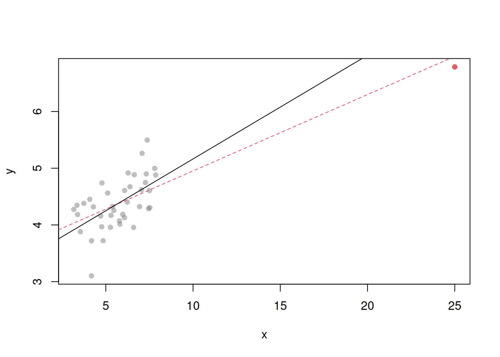
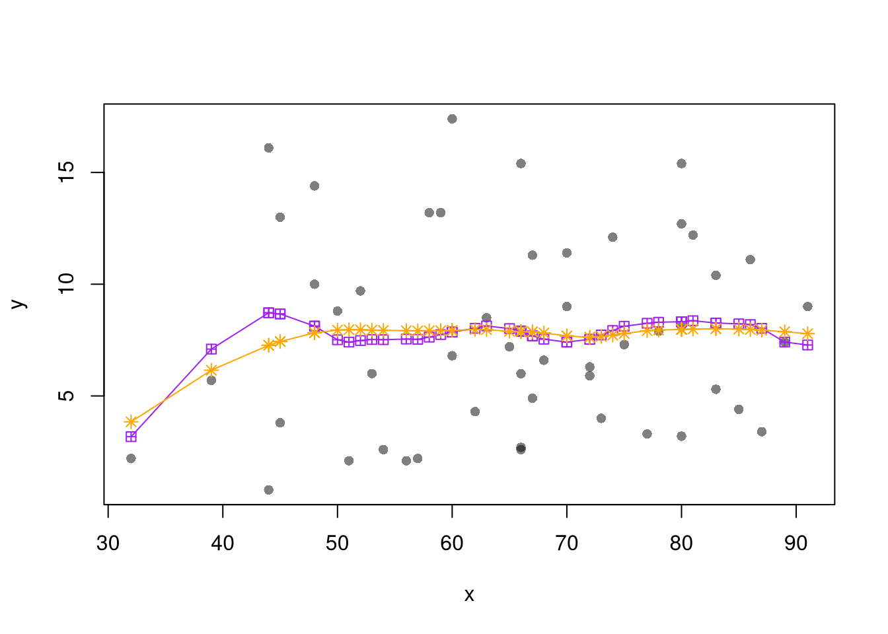
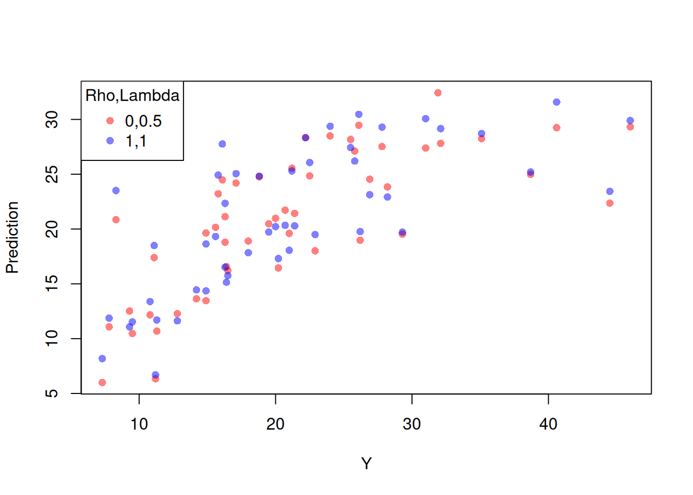
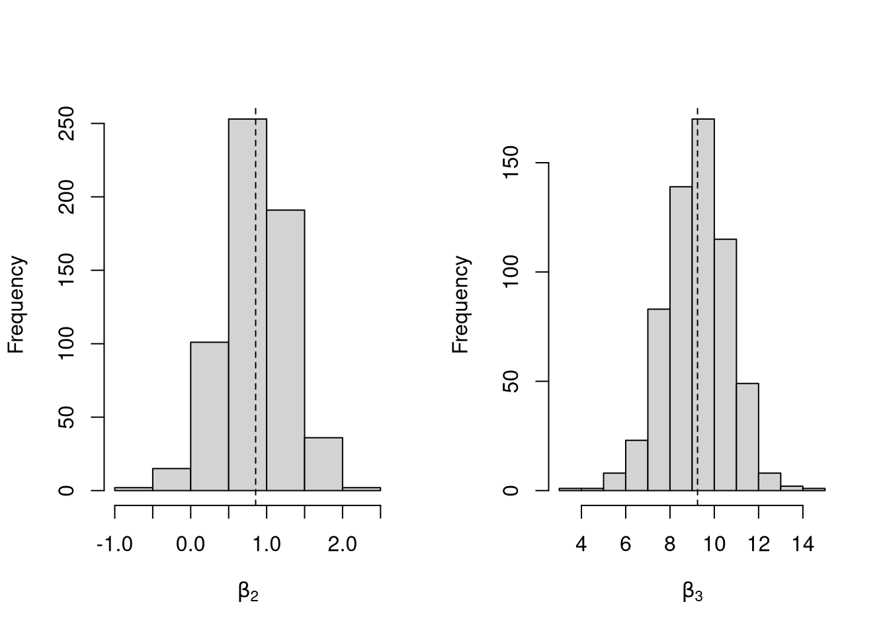
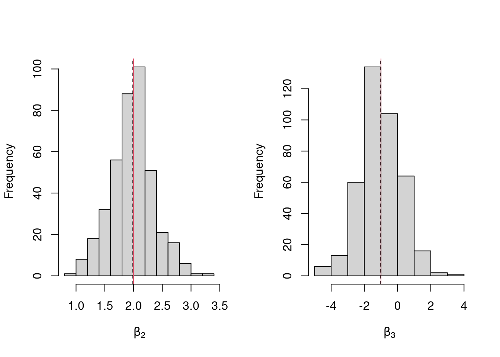

# (PART) Introduction to Linear Regression in R {-} 


# Ordinary Least Squares
***

## Simple OLS (bivariate linear regression)
Model and objective
$$
y_i=\alpha+\beta x_i+\epsilon_{i} \\
\epsilon_{i} = y_i - [\alpha+\beta x_i]\\
min_{\beta} \sum_{i=1}^{n} (\epsilon_{i})^2
$$


Point Estimates
$$
\hat{\alpha}=\bar{y}-\hat{\beta}\bar{x} = \widehat{\mathbb{E}}[Y] - \hat{\beta} \widehat{\mathbb{E}}[X] \\
\hat{\beta}=\frac{\sum_{i}^{}(x_i-\bar{x})(y_i-\bar{y})}{\sum_{i}^{}(x_i-\bar{x})^2} = \frac{\widehat{Cov}[X,Y]}{\widehat{\mathbb{V}}[X]}\\
\hat{y}_i=\hat{\alpha}+\hat{\beta}x_i\\
\hat{\epsilon}_i=y_i-\hat{y}_i\\
$$


```r
x <- seq(0,100)
e <- rnorm(length(x))
y <- .02*x + e
xy <- data.frame(x,y)
plot(y~x, xy, col=grey(.5,.5), pch=16)
reg <- lm(y~x, dat=xy)
reg
```

```
## 
## Call:
## lm(formula = y ~ x, data = xy)
## 
## Coefficients:
## (Intercept)            x  
##     0.48047      0.01277
```

```r
abline(reg, col='orange')
```


```r
N <- 1000
z <- rbinom(N,1,.5)
xy <- sapply(z, function(zi){
    y <- rnorm(1,zi*2,1)
    x <- rnorm(1,zi*2,1)
    c(x,y)
})
xy <- data.frame(x=xy[1,],y=xy[2,])
plot(y~x, xy, col=grey(.5,.5), pch=16)
reg <- lm(y~x, dat=xy)
abline(reg, col='orange')
```


Sums of Squared Errors
$$
\underbrace{\sum\nolimits_{i}(y_i-\bar{y})^2}_\text{TSS}=\underbrace{\sum\nolimits_{i}(\hat{y}_i-\bar{y})^2}_\text{RSS}+\underbrace{\sum\nolimits_{i}\hat{\epsilon}^2}_\text{ESS}\\
R^2=\frac{RSS}{TSS}=1-\frac{ESS}{TSS}
$$

Variability Estimates
$$
\hat{\sigma}^2=\frac{1}{n-2}\sum_{i}\hat{\epsilon}^2\\
\hat{\sigma}^2_{\hat{\alpha}}=\hat{\sigma}^2\left[\frac{1}{n}+\frac{\bar{x}^2}{\sum_{i}(x_i-\bar{x})^2}\right]\\
\hat{\sigma}^2_{\hat{\beta}}=\frac{\hat{\sigma}^2}{\sum_{i}(x_i-\bar{x})^2}\\
\hat{\sigma}^2_{\hat{y}_j}=\hat{\sigma}^2\left[\frac{1}{n}+\frac{(x_j-\bar{x})^2}{\sum_{i}(x_i-\bar{x})^2}\right]\\
$$

For more details, see https://www.econometrics-with-r.org/4-lrwor.html

## OLS (multiple linear regression)

Model and objective
$$
y_i=\beta_0+\beta_1x_{i1}+\beta_2x_{i2}+\ldots+\beta_kx_{ik}+\epsilon_i\\
y=\textbf{X}\beta+\epsilon\\
min_{\beta} \sum_{i=1}^{n} (\epsilon_i)^2
$$

Point Estimates
$$
\hat{\beta}=(\textbf{X}'\textbf{X})^{-1}\textbf{X}'y\\
$$

```r
X <- USArrests[,c('Murder','Assault','UrbanPop')]
X <- as.matrix(cbind(1,X))
Y <- USArrests[,'Rape']

XtXi <- solve(t(X)%*%X)
Bhat <- XtXi %*% (t(X)%*%Y)
Bhat
```

```
##                 [,1]
## 1        -2.47409878
## Murder    0.41856368
## Assault   0.04893072
## UrbanPop  0.18448146
```

```r
reg <- lm(Rape~Murder+Assault+UrbanPop, data=USArrests)
coef(reg)
```

```
## (Intercept)      Murder     Assault    UrbanPop 
## -2.47409878  0.41856368  0.04893072  0.18448146
```


Predictions and Projection Matrix
$$
\hat{\epsilon}=y-X\hat{\beta}=y-X(X'X)^{-1}X'y\\
\hat{P}=X(X'X)^{-1}X'\\
\hat{P}y=X(X'X)^{-1}X'y=y-(y-X(X'X)^{-1}X'y)=y-\hat{\epsilon}=\hat{y}\\
$$


```r
Ehat <- Y - X%*% Bhat
## Ehat
## resid(reg)

Pmat <- X%*%XtXi%*%t(X)
Yhat <- Pmat%*%Y
## Yhat
## predict(reg)
```

Sums of Squared Errors
$$
R^2_{\text{adj.}} = 1-\frac{n-1}{n-K}(1-R^2)\\
R^2 = \frac{RSS}{TSS}=1-\frac{ESS}{TSS}
$$

```r
ESS <- sum(Ehat^2)
TSS <- sum((Y-mean(Y))^2)
R2 <- 1 - ESS/TSS

summary(reg)$r.squared
```

```
## [1] 0.5165872
```


### Coefficient Variability

Note that
$$
\hat{\Sigma}_{\beta} = (X'X)^{-1} X' \widehat{\Omega} X (X'X)^{-1}.\\
\widehat{\Omega} = \begin{pmatrix}
\hat{\sigma}_{1,1} & ... & \hat{\sigma}_{1,n}\\
& ... &  \\
\hat{\sigma}_{n,1} & ... & \hat{\sigma}_{n,n}
\end{pmatrix}
$$


**Classical Model (CLRM) Standard Errors**
Independance: $\hat{\sigma_{i,j}}=0$
Homoskedasticity: 
$$
diag( \widehat{\Omega} ) = [\hat{\sigma}^2, \hat{\sigma}^2, ..., \hat{\sigma}^2] \\
\hat{\sigma}^2=\frac{1}{n-K}\sum_{i}\hat{\epsilon}_i^2\\
$$
IID Variability Estimates
$$
\hat{\Sigma}_{\beta} = \hat{\sigma}^2 (X'X)^{-1}\\
$$


```r
n <- nrow(X)
K <- ncol(X)
s <- sum( Ehat^2 )/(n-K)
Vhat <- s * XtXi

vcov(reg)
```

```
##              (Intercept)       Murder       Assault      UrbanPop
## (Intercept) 22.049878823 -0.463075762  0.0099362260 -0.2935100713
## Murder      -0.463075762  0.144388404 -0.0063400876  0.0064267964
## Assault      0.009936226 -0.006340088  0.0004206739 -0.0004942615
## UrbanPop    -0.293510071  0.006426796 -0.0004942615  0.0050024150
```


**Reality**
There are common violations to the iid case. 
Heteroskedasticity:
$$
diag( \widehat{\Omega} ) = [\widehat{\sigma^2_{1}}, \widehat{\sigma^2_{1}}, ..., \widehat{\sigma^2_{n}}]\\
\widehat{\sigma^2_{i}} = \hat{\epsilon_{i}}^2
$$
Autocorrelation Dependance: $\sigma_{i,j}=f( dist(i,j) )$.
Cluster Dependance: 
$$\sigma_{i,j}=
\begin{cases}
\hat{\sigma}_{group1} & i,j \in \text{group } 1\\
...\\
\hat{\sigma}_{groupG} & i,j \in \text{group } G \\
0 & \text{otherwise} \\ 
\end{cases}
$$


This is for a later course. (See https://cran.r-project.org/web/packages/sandwich/vignettes/sandwich.pdf and then https://cran.r-project.org/web/packages/sandwich/vignettes/sandwich-CL.pdf)


### Hypothesis Testing 

Is not to be done routinely. For one hypothesis, we can use a $t$ test. For multiple, we can use an $F$ test.
$$
\hat{t}_{j} = \frac{\hat{\beta}_j- \beta_{0} }{\hat{\sigma}_{\
\hat{\beta}_j}}\sim t_{n-K}\\
\hat{F}_{q} = \frac{(ESS_{restricted}-ESS_{unrestricted})/q}{ESS_{unrestricted}/(n-K)} \sim F_{q,n-K}
$$

Note that $\hat{F}$ can be written in terms of unrestricted and restricted $R^2$ 


```r
## Seperate tests each coef is 0
## Calculate standard errors, t–statistics, p-values
SEhat <- sqrt(diag(Vhat))
That  <- Bhat/SEhat

## One Sided Test for P(t > That | Null)
Phat1  <- pt(That, n-K)
## Two Sided Test for P(t > That or  t < -That | Null)
Phat2  <- 1-pt( abs(That), n-K) + pt(-abs(That), n-K)

Phat2
```

```
##                [,1]
## 1        0.60080684
## Murder   0.27639755
## Assault  0.02122227
## UrbanPop 0.01223030
```

```r
summary(reg)
```

```
## 
## Call:
## lm(formula = Rape ~ Murder + Assault + UrbanPop, data = USArrests)
## 
## Residuals:
##     Min      1Q  Median      3Q     Max 
## -15.213  -3.729  -0.239   2.928  21.065 
## 
## Coefficients:
##             Estimate Std. Error t value Pr(>|t|)  
## (Intercept) -2.47410    4.69573  -0.527   0.6008  
## Murder       0.41856    0.37998   1.102   0.2764  
## Assault      0.04893    0.02051   2.386   0.0212 *
## UrbanPop     0.18448    0.07073   2.608   0.0122 *
## ---
## Signif. codes:  0 '***' 0.001 '**' 0.01 '*' 0.05 '.' 0.1 ' ' 1
## 
## Residual standard error: 6.721 on 46 degrees of freedom
## Multiple R-squared:  0.5166,	Adjusted R-squared:  0.4851 
## F-statistic: 16.39 on 3 and 46 DF,  p-value: 2.21e-07
```

```r
## Joint test all 3 coefs are 0
Fhat <- (TSS - ESS)/ESS * (n-K)/3
1-pf(Fhat, 3, n-K)
```

```
## [1] 2.210175e-07
```

```r
summary(reg)$fstatistic
```

```
##    value    numdf    dendf 
## 16.38559  3.00000 46.00000
```

```r
summary(reg)
```

```
## 
## Call:
## lm(formula = Rape ~ Murder + Assault + UrbanPop, data = USArrests)
## 
## Residuals:
##     Min      1Q  Median      3Q     Max 
## -15.213  -3.729  -0.239   2.928  21.065 
## 
## Coefficients:
##             Estimate Std. Error t value Pr(>|t|)  
## (Intercept) -2.47410    4.69573  -0.527   0.6008  
## Murder       0.41856    0.37998   1.102   0.2764  
## Assault      0.04893    0.02051   2.386   0.0212 *
## UrbanPop     0.18448    0.07073   2.608   0.0122 *
## ---
## Signif. codes:  0 '***' 0.001 '**' 0.01 '*' 0.05 '.' 0.1 ' ' 1
## 
## Residual standard error: 6.721 on 46 degrees of freedom
## Multiple R-squared:  0.5166,	Adjusted R-squared:  0.4851 
## F-statistic: 16.39 on 3 and 46 DF,  p-value: 2.21e-07
```


## Coefficient Interpretation

The above procedure will always give us number, the question is how to interpret them. 

*If* the data generating process is 
$$
y=X\beta + \epsilon\\
\mathbb{E}[\epsilon | X]=0,
$$
then we have a famous result that lets us attach a simple interpretation of OLS coefficients as unbiased estimates of the effect of X:
$$
\hat{\beta} = (X'X)^{-1}X'y = (X'X)^{-1}X'(X\beta + \epsilon) = \beta + (X'X)^{-1}X'\epsilon\\
\mathbb{E}\left[ \hat{\beta} \right] = \mathbb{E}\left[ (X'X)^{-1}X'y \right] = \beta + (X'X)^{-1}\mathbb{E}\left[ X'\epsilon \right] = \beta
$$


Generate a simulated dataset with 30 observations and two exogenous variables. Assume the following relationship: $yi = \beta_0 + \beta_1 x_{1,i} + \beta_2 x_{2,i} + \epsilon_i$ where the variables and the error term are realizations of the following data generating processes (DGP):

```r
N <- 30
B <- c(10, 2, -1)

x1 <- runif(N, 0, 5)
x2 <- rbinom(N,1,.7)
X <- cbind(1,x1,x2)
e <- rnorm(N,0,3)
Y <- X%*%B + e
dat <- data.frame(Y,X)
coef(lm(Y~x1+x2, data=dat))
```

```
## (Intercept)          x1          x2 
##  11.1053651   1.5143908  -0.7727627
```

Simulate the distribution of coefficients under a correctly specified model. Interpret the average.

```r
N <- 30
B <- c(10, 2, -1)

Coefs <- sapply(1:400, function(sim){
    x1 <- runif(N, 0, 5)
    x2 <- rbinom(N,1,.7)
    X <- cbind(1,x1,x2)
    e <- rnorm(N,0,3)
    Y <- X%*%B + e
    dat <- data.frame(Y,x1,x2)
    coef(lm(Y~x1+x2, data=dat))
})

par(mfrow=c(1,3))
for(i in 1:3){
    hist(Coefs[i,])
    abline(v=mean(Coefs[i,]), col=1, lty=2)
    abline(v=B[i], col=2)
}
```


Note that for joint tests, we look at the joint distribution of coefficients

```r
library(ks)
Bjoint <- t(Coefs[2:3,])
fBjoint <- histde(Bjoint, binw=c(.2,.5))
plot(fBjoint, xlab='B2', ylab='B3')
```


Many economic phenomena are nonlinear, even when including potential transforms of $Y$ and $X$. Sometimes the OLS model may still be a good or even great approximation (how good depends on the research question). In any case, you are safe to interpret your OLS coefficients as "conditional correlations". For example, examine the distribution of coefficients under this mispecified model. Interpret the average.

```r
N <- 30

Coefs <- sapply(1:600, function(sim){
    x1 <- runif(N, 0, 5)
    x2 <- rbinom(N,1,.7)
    e <- rnorm(N,0,3)
    Y <- 10*x2 + 2*log(x1)^x2 + e
    dat <- data.frame(Y,x1,x2)
    coef(lm(Y~x1+x2, data=dat))
})

par(mfrow=c(1,2))
for(i in 2:3){
    hist(Coefs[i,])
    abline(v=mean(Coefs[i,]), col=1, lty=2)
}
```


## Factor Variables

So far, we have discussed cardinal data where the difference between units always means the same thing: e.g., $4 -3=3-2$. There are also factor variables

* Ordered: The difference between units means something, but not always the same thing. E.g., $1st - 2nd \neq 2nd - 3rd$.
* Unordered: The difference between units does not mean something $B-A =??$

Sometimes Ordinal and Categorical data are called Ordinal and Categorical variables. 

To analyze either factor, we often convert them into indicator variables or dummies; $D_{c}=\mathbf{1}( Factor = c)$. One common case is if you have observations of individuals over time periods, then you may have two factor variables. An unordered factor that indicates who an individual is; for example $D_{i}=\mathbf{1}( Individual = i)$, and an order factor that indicates the time period; for example $D_{t}=\mathbf{1}( Time \in [month~ t, month~ t+1) )$. There are many other cases you see factor variables, including spatial ID's in purely cross sectional data.

Be careful not to handle categorical data as if they were cardinal. E.g., generate city data with Leipzig=1, Lausanne=2, LosAngeles=3, ... and then include city as if it were a cardinal number (that's a big no-no). The same applied to ordinal data; PopulationLeipzig=2, PopulationLausanne=3, PopulationLosAngeles=1.  


```r
N <- 1000
x <- runif(N,3,8)
e <- rnorm(N,0,0.4)
fo <- factor(rbinom(N,4,.5), ordered=T)
fu <- factor(rep(c('A','B'),N/2), ordered=F)
dA <- 1*(fu=='A')
y <- (2^as.integer(fo)*dA )*sqrt(x)+ 2*as.integer(fo)*e
dat_f <- data.frame(y,x,fo,fu)
```


With factors, you can still include them in the design matrix of an OLS regression
$$
y_{it} = x_{it} \beta_{x} + d_{c}\beta_{c}
$$
When, as commonly done, the factors are modeled as being additively seperable, they are modelled as either "fixed" or "random" effects.

Simply including the factors into the OLS regression yields a "dummy variable" fixed effects estimator.

```r
fe_reg0 <- lm(y~x+fo+fu, dat_f)
summary(fe_reg0)
```

```
## 
## Call:
## lm(formula = y ~ x + fo + fu, data = dat_f)
## 
## Residuals:
##     Min      1Q  Median      3Q     Max 
## -39.109  -5.612  -0.211   5.686  38.500 
## 
## Coefficients:
##             Estimate Std. Error t value Pr(>|t|)    
## (Intercept)  19.7622     1.2183  16.221  < 2e-16 ***
## x             1.3499     0.2053   6.574 7.91e-11 ***
## fo.L         27.8651     1.1209  24.860  < 2e-16 ***
## fo.Q         12.0019     0.9793  12.255  < 2e-16 ***
## fo.C          2.6875     0.7566   3.552   0.0004 ***
## fo^4          0.6662     0.5624   1.185   0.2365    
## fuB         -23.7459     0.5856 -40.550  < 2e-16 ***
## ---
## Signif. codes:  0 '***' 0.001 '**' 0.01 '*' 0.05 '.' 0.1 ' ' 1
## 
## Residual standard error: 9.246 on 993 degrees of freedom
## Multiple R-squared:  0.7356,	Adjusted R-squared:  0.734 
## F-statistic: 460.4 on 6 and 993 DF,  p-value: < 2.2e-16
```
We can also compute averages for each group and construct a "between estimator"
$$
\overline{y}_i = \alpha + \overline{x}_i \beta
$$
Or we can subtract the average from each group to construct a "within estimator", 
$$
(y_{it} - \overline{y}_i) = (x_{it}-\overline{x}_i)\beta\\
$$
that tends to be more computationally efficient, has corrections for standard errors, and has additional summary statistics.

```r
library(fixest)
fe_reg1 <- feols(y~x|fo+fu, dat_f)
summary(fe_reg1)
```

```
## OLS estimation, Dep. Var.: y
## Observations: 1,000 
## Fixed-effects: fo: 5,  fu: 2
## Standard-errors: Clustered (fo) 
##   Estimate Std. Error t value Pr(>|t|)    
## x  1.34989   0.466918 2.89107 0.044515 *  
## ---
## Signif. codes:  0 '***' 0.001 '**' 0.01 '*' 0.05 '.' 0.1 ' ' 1
## RMSE: 9.21406     Adj. R2: 0.733975
##                 Within R2: 0.041706
```

**Hansen Econometrics, Theorem 17.1:** The fixed effects estimator of $\beta$ algebraically equals the dummy
variable estimator of $\beta$. The two estimators have the same residuals.

In fact, if the fixed effect is ``fully unstructured then the only way to consistently estimate the coefficient $\beta$ is by an estimator which is invariant'' (Hansen Econometrics, p). 

Consistency is a great property, but only if the data generating process does in fact match the model. Many factor variables have effects that are not additively seperable.

```r
reg1 <- feols(y~x|fo^fu, dat_f)
summary(reg1)
```

```
## OLS estimation, Dep. Var.: y
## Observations: 1,000 
## Fixed-effects: fo^fu: 10
## Standard-errors: Clustered (fo^fu) 
##   Estimate Std. Error t value Pr(>|t|)    
## x  1.14046   0.538534  2.1177 0.063273 .  
## ---
## Signif. codes:  0 '***' 0.001 '**' 0.01 '*' 0.05 '.' 0.1 ' ' 1
## RMSE: 3.50396     Adj. R2: 0.961373
##                 Within R2: 0.175829
```

```r
reg2 <- lm(y~x*fo*fu, dat_f)
summary(reg2)
```

```
## 
## Call:
## lm(formula = y ~ x * fo * fu, data = dat_f)
## 
## Residuals:
##     Min      1Q  Median      3Q     Max 
## -9.3170 -1.4908 -0.0201  1.4836  9.4954 
## 
## Coefficients:
##              Estimate Std. Error t value Pr(>|t|)    
## (Intercept)  13.15705    0.58824  22.367  < 2e-16 ***
## x             2.83742    0.10315  27.509  < 2e-16 ***
## fo.L         23.98554    1.64890  14.546  < 2e-16 ***
## fo.Q          8.57919    1.44296   5.946 3.83e-09 ***
## fo.C          1.69129    1.16677   1.450   0.1475    
## fo^4          0.44063    0.87077   0.506   0.6130    
## fuB         -13.09705    0.83469 -15.691  < 2e-16 ***
## x:fo.L        5.20706    0.28867  18.038  < 2e-16 ***
## x:fo.Q        2.08718    0.25379   8.224 6.21e-16 ***
## x:fo.C        0.47917    0.20273   2.364   0.0183 *  
## x:fo^4        0.03697    0.15472   0.239   0.8112    
## x:fuB        -2.91009    0.14844 -19.604  < 2e-16 ***
## fo.L:fuB    -25.65300    2.35284 -10.903  < 2e-16 ***
## fo.Q:fuB     -8.84289    2.05889  -4.295 1.92e-05 ***
## fo.C:fuB     -1.14505    1.63538  -0.700   0.4840    
## fo^4:fuB     -0.12010    1.21849  -0.099   0.9215    
## x:fo.L:fuB   -5.09251    0.41974 -12.133  < 2e-16 ***
## x:fo.Q:fuB   -2.20840    0.36785  -6.004 2.72e-09 ***
## x:fo.C:fuB   -0.65392    0.28756  -2.274   0.0232 *  
## x:fo^4:fuB   -0.08171    0.21569  -0.379   0.7049    
## ---
## Signif. codes:  0 '***' 0.001 '**' 0.01 '*' 0.05 '.' 0.1 ' ' 1
## 
## Residual standard error: 2.517 on 980 degrees of freedom
## Multiple R-squared:  0.9807,	Adjusted R-squared:  0.9803 
## F-statistic:  2616 on 19 and 980 DF,  p-value: < 2.2e-16
```

```r
#reg2 <- feols(y~x*fo*fu|fo^fu, dat_f)
```


With *Random Effects*, the factor variable is modelled as coming from a distribution that is uncorrelated with the regressors. This is rarely used in economics today, and mostly included for historical reasons and a few cases where fixed effects cannot be estimates.

<!-- 
> The labels "random effects" and "fixed effects" are misleading. These are labels which arose in the early literature and we are stuck with these labels today. In a previous era regressors were viewed as "fixed". Viewing the individual effect as an unobserved regressor leads to the label of the individual effect as "fixed". Today, we rarely refer to regressors as "fixed" when dealing with observational data. We view all variables as random. Consequently describing u i as "fixed" does not make much sense and it is hardly a contrast with the "random effect" label since under either assumption u i is treated as random. Once again, the labels are unfortunate but the key difference is whether u i is correlated with the regressors.
-->


## More Literature

* https://www.econometrics-with-r.org/6-rmwmr.html
* https://www.econometrics-with-r.org/7-htaciimr.html
* https://bookdown.org/ripberjt/labbook/multivariable-linear-regression.html
* https://online.stat.psu.edu/stat462/node/137/
* https://book.stat420.org/
* Hill, Griffiths & Lim (2007), Principles of Econometrics, 3rd ed., Wiley, S. 86f.
* Verbeek (2004), A Guide to Modern Econometrics, 2nd ed., Wiley, S. 51ff.
* Asteriou & Hall (2011), Applied Econometrics, 2nd ed., Palgrave MacMillan, S. 177ff.
* https://online.stat.psu.edu/stat485/lesson/11/


For fixed effects, see

* https://www.princeton.edu/~otorres/Panel101.pdf
* https://www.stata.com/manuals13/xtxtreg.pdf


# OLS Diagnostics
***

Simply plotting your regression object can help diagnose whether your model is a good one. There's little sense in getting great standard errors for the wrong model, and is a simple and easy step. So do it early and often.

```r
reg <- lm(Rape~Murder+Assault+UrbanPop, data=USArrests)
par(mfrow=c(2,2))
plot(reg)
```




## Assessing Outlier $Y$

This is the first plot.

>``In our $y_i = a + b x_i + e_i$ regression, the residuals are, of course, $e_i$ -- they reveal how much our fitted value $\hat{y}_i = a + b x_i$ differs from the observed $y_i$. A point $(x_i ,y_i)$ with a corresponding large residual is called an *outlier*. Say that you are interested in outliers because you somehow think that such points will exert undue *influence* on your estimates. Your feelings are generally right, but there are exceptions. A point might have a huge residual and yet not affect the estimated $b$ at all''
>Stata Press (2015) Base Reference Manual, Release 14, p. 2138.


```r
plot(fitted(reg), resid(reg),col = "grey", pch = 20,
     xlab = "Fitted", ylab = "Residual",
     main = "Fitted versus Residuals")
abline(h = 0, col = "darkorange", lwd = 2)
```


```r
# car::outlierTest(reg)
```

## Assessing Normality 
The second plot examines whether the residuals are normally distributed. OLS point estimates do not depend on the Normality of the residuals. Good thing, because there's no reason the residuals of economic phenomena should be so well behaved. The variability of the point estimates are, however, affected by the distribution of the residuals. For these reasons, you may be interested in assessing normality 

```r
par(mfrow=c(1,2))
hist(resid(reg), main='Histogram of Residuals')

qqnorm(resid(reg), main = "Normal Q-Q Plot of Residuals", col = "darkgrey")
qqline(resid(reg), col = "dodgerblue", lwd = 2)
```



```r
shapiro.test(resid(reg))
```

```
## 
## 	Shapiro-Wilk normality test
## 
## data:  resid(reg)
## W = 0.94794, p-value = 0.02809
```

```r
# car::qqPlot(reg)
```

Assessing Heterskedasticity may also matters for variance estimates. This is not shown in the plot, but you can run a simple test

```r
library(lmtest)
```

```
## Loading required package: zoo
```

```
## 
## Attaching package: 'zoo'
```

```
## The following objects are masked from 'package:base':
## 
##     as.Date, as.Date.numeric
```

```r
lmtest::bptest(reg)
```

```
## 
## 	studentized Breusch-Pagan test
## 
## data:  reg
## BP = 8.9049, df = 3, p-value = 0.03058
```


## Assessing Outlier $X$

The third plot examines "Leverage".

>"$(x_i ,y_i)$ can be an outlier in another way -- just as $y_i$ can be far from $\hat{y}_i$, $x_i$ can be far from the center of mass of the other $x$'s. Such an `outlier' should interest you just as much as the more traditional outliers. Picture a scatterplot of $y$ against $x$ with thousands of points in some sort of mass at the lower left of the graph and one point at the upper right of the graph. Now run a regression line through the points—the regression line will come close to the point at the upper right of the graph and may in fact, go through it. That is, this isolated point will not appear as an outlier as measured by residuals because its residual will be small. Yet this point might have a dramatic effect on our resulting estimates in the sense that, were you to delete the point, the estimates would change markedly. Such a point is said to have high *leverage*''
Stata Press (2015) Base Reference Manual, Release 14, pp. 2138-39.


```r
N <- 40
x <- c(25, runif(N-1,3,8))
e <- rnorm(N,0,0.4)
y <- 3 + 0.6*sqrt(x) + e
plot(y~x, pch=16, col=grey(.5,.5))
points(x[1],y[1], pch=16, col=rgb(1,0,0,.5))

abline(lm(y~x), col=2, lty=2)
abline(lm(y[-1]~x[-1]))
```


See https://www.r-bloggers.com/2016/06/leverage-and-influence-in-a-nutshell/ for a good interactive explaination.


Leverage Vector: Distance within explanatory variables
$$
H = diag(\hat{P}) = [h_{1}, h_{2}, ...., h_{N}]
$$
$h_i$ is the leverage of residual $\hat{\epsilon_i}$


Studentized residuals
$$
r_i=\frac{\hat{\epsilon}_i}{s_{[i]}\sqrt{1-h_i}}
$$
and $s_{(i)}$ the root mean squared error of a regression with the $i$th observation removed.


```r
which.max(hatvalues(reg))
```

```
## Georgia 
##      10
```

```r
which.max(rstandard(reg))
```

```
## Alaska 
##      2
```


The fourth plot further assesses outlier $X$ using "Cook's Distance". Cook's Distance is defined as the sum of all the changes in the regression model when observation i is removed from.
$$
D_{i} = \frac{\sum_{j} \left( \hat{y_j} - \hat{y_j}_{[i]} \right)^2 }{ p s^2 }
= \frac{[e_{i}]^2}{p s^2 } \frac{h_i}{(1-h_i)^2}\\
s^2 = \frac{\sum_{i} (e_{i})^2 }{n-K}
$$


```r
which.max(cooks.distance(reg))
```

```
## Alaska 
##      2
```

```r
car::influencePlot(reg)
```


```
##                    StudRes        Hat        CookD
## Alaska          3.78570999 0.11602814 0.3646123432
## Georgia        -0.06679825 0.21493470 0.0003121571
## Nevada          2.62517777 0.06145855 0.1000109235
## North Carolina -2.01817190 0.21194394 0.2567055530
```

There are many other diagnostics (which can often be written in terms of Cooks Distance or Vice Versa)

```r
# Sall, J. (1990) Leverage plots for general linear hypotheses. American Statistician *44*, 308-315.
# car::leveragePlots(reg)
```

(Welsch and Kuh. 1977; Belsley, Kuh, and Welsch. 1980) attempt to summarize the information in the leverage versus residual-squared plot into one DFITS statistic where $DFITS > 2\sqrt{{k}/{n}}$ should be examined. 
$$
\text{DFITS}_i=r_i\sqrt{\frac{h_i}{1-h_i}}\\
$$

See also "dfbetas" and "covratio"

```r
#dfbetas(reg)
#dffits(reg)
#covratio(reg)
#hatvalues(reg)
head(influence.measures(reg)$infmat)
```

```
##                  dfb.1_    dfb.Mrdr     dfb.Assl     dfb.UrbP        dffit
## Alabama    -0.025686940 -0.08053898  0.014676264  0.047669803 -0.157239638
## Alaska      0.758304736 -0.59617559  0.976957649 -1.008931529  1.371544155
## Arizona    -0.011470229 -0.04034123  0.049624809  0.004523264  0.059142496
## Arkansas   -0.005860294  0.00105735 -0.002420583  0.006056285 -0.007978192
## California -0.295223556 -0.19702231  0.266630954  0.267792657  0.516921957
## Colorado   -0.169794005 -0.09705845  0.111735442  0.212324868  0.420983022
##                cov.r       cook.d        hat
## Alabama    1.1216797 6.264122e-03 0.05959345
## Alaska     0.4087414 3.646123e-01 0.11602814
## Arizona    1.2618576 8.934514e-04 0.13639303
## Arkansas   1.1493186 1.626607e-05 0.05006430
## California 1.0287684 6.527294e-02 0.11395594
## Colorado   0.7744530 4.116548e-02 0.03780975
```


## Collinearity
This is when one explanatory variable in a multiple regression model can be linearly predicted from the others with a substantial degree of accuracy. Coefficient estimates may change erratically in response to small changes in the model or the data. (In the extreme case where there are more variables than observations $K>\geq N$, $X'X$ has an infinite number of solutions and is not invertible.)

To diagnose this, we can use the Variance Inflation Factor
$$
VIF_{k}=\frac{1}{1-R^2_k},
$$
where $R^2_k$ is the $R^2$ for the regression of $X_k$ on the other covariates $X_{-k}$ (a regression that does not involve the response variable Y)


```r
car::vif(reg) 
```

```
##   Murder  Assault UrbanPop 
## 2.971023 3.169012 1.136837
```

```r
sqrt(car::vif(reg)) > 2 # problem?
```

```
##   Murder  Assault UrbanPop 
##    FALSE    FALSE    FALSE
```


## Transformations


Coefficient transformations can often improve model fit. Note for small changes, $\Delta ln(x) \approx \Delta x / x = \Delta x \% \cdot 100$. Under the assumptions of the OLS model, we have 

| *Model* | *Regressand* | *Regressor* | *Derivative* | *Interpretation* |
| --- | --- | --- | --- | --- |
| linear--linear | $y$          | $x$   | $\Delta y = \beta_1\cdot\Delta x$ | Change $x$ by one unit $\rightarrow$ change $y$ by $\beta_1$ units.|
| log--linear | $ln(y)$ | $x$ | $\Delta y \% \cdot 100 \approx \beta_1 \cdot \Delta x$ | Change $x$ by one unit $\rightarrow$ change $y$ by $100 \cdot \beta_1$ percent. |
| linear--log | $y$ | $ln(x)$ | $\Delta y \approx  \frac{\beta_1}{100}\cdot \Delta x \%$ | Change $x$ by one percent $\rightarrow$ change $y$ by $\frac{\beta_1}{100}$ units |
| log--log | $ln(y)$ | $ln(x)$ | $\Delta y \% \approx \beta_1\cdot \Delta x \%$ | Change $x$ by one percent $\rightarrow$ change $y$ by $\beta_1$ percent|

There are many reasons why the OLS model is unlikely to be true. Recall from micro theory, that an additively seperable and linear production function is referred to as ``perfect substitutes''. You have implicitly modelled the different regressors $X$ as perfect substitutes, when in fact they may be compliments.

Further recall that the ''perfect substitutes'' model is a special case of the constant elasticity of substitution production function. Here, we will build on http://dx.doi.org/10.2139/ssrn.3917397, and consider box-cox transforming both $X$ and $y$. Specifically, apply the box-cox transform of $y$ using parameter $\lambda$ and apply another box-cox transform to each $x$ using the same parameter $\rho$;so that

$$
y^{(\lambda)}_{i} = \sum_{k}\beta_{k} x^{(\rho)}_{k,i} + \epsilon_{i}\\
y^{(\lambda)}_{i} =
\begin{cases}
\lambda^{-1}[ (y_i+1)^{\lambda}- 1] & \lambda \neq 0 \\
log(y_i+1) &  \lambda=0
\end{cases}.\\
x^{(\rho)}_{i} =
\begin{cases}
\rho^{-1}[ (x_i)^{\rho}- 1] & \rho \neq 0 \\
log(x_{i}+1) &  \rho=0
\end{cases}.
$$

Notice that this nests:

 * linear-linear $(\rho=\lambda=1)$.
 * linear-log $(\rho=1, \lambda=0)$.
 * log-linear $(\rho=0, \lambda=1)$.
 * log-log  $(\rho=\lambda=0)$.


If $\rho=\lambda$, we get the CES production function. This nests the ''perfect substitutes'' linear-linear model ($\rho=\lambda=1$) , the ''cobb-douglas''  log-log model  ($\rho=\lambda=0$), and many others. We can define $\lambda=\rho/\lambda'$ to be clear that this is indeed a CES-type transformation where

* $\rho \in (-\infty,1]$ controls the ''substitutability'' of explanatory variables ($\rho <0$ is ''complementary'')
* $\lambda$ determines ''returns to scale'' ($\lambda'<1$ is ''decreasing returns'').


We compute the mean squared error in the original scale by inverting the predictions;
$$
\widehat{y}_{i} =
\begin{cases}
[ \widehat{y^{(\lambda)}}_{i} \cdot \lambda ]^{1/\lambda} -1 & \lambda  \neq 0 \\
exp( \widehat{y^{(\lambda)}}_{i}) -1 &  \lambda=0
\end{cases}.
$$


It is easiest to optimize parameters in a 2-step procedure called  `concentrated optimization'. We first solve for $\widehat{\beta}(\rho,\lambda)$ and compute the mean squared error $MSE(\rho,\lambda)$. We then find the $(\rho,\lambda)$ which minimizes $MSE$.

```r
## Box-Cox Transformation Function
bxcx <- function( xy, rho){
    if (rho == 0L) {
      log(xy+1)
    } else if(rho == 1L){
      xy
    } else {
      ((xy+1)^rho - 1)/rho
    }
}
bxcx_inv <- function( xy, rho){
    if (rho == 0L) {
      exp(xy) - 1
    } else if(rho == 1L){
      xy
    } else {
     (xy * rho + 1)^(1/rho) - 1
    }
}


## Which Variables
reg <- lm(Rape~Murder+Assault+UrbanPop, data=USArrests)
X <- USArrests[,c('Murder','Assault','UrbanPop')]
Y <- USArrests[,'Rape']

## Simple Grid Search
## Which potential (Rho,Lambda) 
rl_df <- expand.grid(rho=seq(-2,2,by=.5),lambda=seq(-2,2,by=.5))

## Compute Mean Squared Error
## from OLS on Transformed Data
errors <- apply(rl_df,1,function(rl){
    Xr <- bxcx(X,rl[[1]])
    Yr <- bxcx(Y,rl[[2]])
    Datr <- cbind(Rape=Yr,Xr)
    Regr <- lm(Rape~Murder+Assault+UrbanPop, data=Datr)
    Predr <- bxcx_inv(predict(Regr),rl[[2]])
    Resr  <- (Y - Predr)
    return(Resr)
})
rl_df$mse <- colMeans(errors^2)

## Want Small MSE and Interpretable
## (-1,0,1,2 are Easy to interpretable)
library(ggplot2)
ggplot(rl_df, aes(rho, lambda, fill=mse )) +
    geom_tile() + ggtitle('Mean Squared Error') 
```


```r
## Which min
rl0 <- rl_df[which.min(rl_df$mse),c('rho','lambda')]

## Which give NA?
## which(is.na(errors), arr.ind=T)

## Plot
Xr <- bxcx(X,rl0[[1]])
Yr <- bxcx(Y,rl0[[2]])
Datr <- cbind(Rape=Yr,Xr)
Regr <- lm(Rape~Murder+Assault+UrbanPop, data=Datr)
Predr <- bxcx_inv(predict(Regr),rl0[[2]])

cols <- c(rgb(1,0,0,.5), col=rgb(0,0,1,.5))
plot(Y, Predr, pch=16, col=cols[1], ylab='Prediction')
points(Y, predict(reg), pch=16, col=cols[2])
legend('topleft', pch=c(16), col=cols, title='Rho,Lambda',
    legend=c(  paste0(rl0, collapse=','),'1,1') )
```



Note that your hypothesis testing procedures do not account for you trying out different transformations.


## More Literature


* https://book.stat420.org/model-diagnostics.html#leverage
* https://socialsciences.mcmaster.ca/jfox/Books/RegressionDiagnostics/index.html
* https://bookdown.org/ripberjt/labbook/diagnosing-and-addressing-problems-in-linear-regression.html
* Belsley, D. A., Kuh, E., and Welsch, R. E. (1980). Regression Diagnostics: Identifying influential data and sources of collinearity. Wiley. https://doi.org/10.1002/0471725153
* Fox, J. D. (2020). Regression diagnostics: An introduction (2nd ed.). SAGE. https://dx.doi.org/10.4135/9781071878651


# OLS and Endogeneity
***

Just like many economic relationships are nonlinear, many economic variables are endogenous. By this we typically mean that $X$ is an outcome determined (or caused: $\to$) by some other variable.

 * If $Y \to X$, then we have reverse causality
 * If $Y \to X, X \to Y$, then we have simultaneity
 * If $Z\to Y$ and either $Z\to X$ or $X \to Z$, then we have omitted a potentially important variable

These endogeneity issues imply $X$ and $\epsilon$ are correlated, which is a barrier to interpreting OLS as a causal model. Three statistical tools: 2SLS, RDD, and DID, are designed to address endogeneity issues. The elementary versions of these tools are linear regression. Because there are many textbooks and online notebooks that explain these methods at both high and low levels of technical detail, they are not covered extensively in this notebook. You are directed to the following resources which discuss these statistical models in more general terms and how they can be applied across many social sciences.

* Causal Inference for Statistics, Social, and Biomedical Sciences: An Introduction
* https://www.mostlyharmlesseconometrics.com/
* https://www.econometrics-with-r.org
* https://bookdown.org/paul/applied-causal-analysis/
* https://mixtape.scunning.com/
* https://theeffectbook.net/
* https://www.r-causal.org/
* https://matheusfacure.github.io/python-causality-handbook/landing-page.html


## Two Stage Least Squares (2SLS)

* https://www.econometrics-with-r.org/12-ivr.html
* https://bookdown.org/paul/applied-causal-analysis/estimation-2.html
* https://mixtape.scunning.com/07-instrumental_variables
* https://theeffectbook.net/ch-InstrumentalVariables.html
* http://www.urfie.net/read/index.html#page/247

Note that the coefficient interpretation still rests on many assumptions

* do you know both supply and demand are linear?
* do you know only supply was affected, and it was only an intercept shift?
* is the shock large enough to be picked up statistically

If we had multiple alleged supply shifts and recorded their magnitudes, then we could recover more information about demand. One common diagnostic tool is simply to report the reduced form results, but we could use a nonparametric estimator to diagnose linearity at the same time. 

```r
#reg2_alt_fs <- lm(Q~cost, data=dat2)
#summary(reg2_alt_fs)
#lo2_alt_fs <- loess(Q~cost, data=dat2)
```

Other tools are used to help address some of the other assumptions.

## Regression Discontinuity (RD)

* https://bookdown.org/paul/applied-causal-analysis/rdd-regression-discontinuity-design.html
* https://mixtape.scunning.com/06-regression_discontinuity
* https://theeffectbook.net/ch-RegressionDiscontinuity.html

## Difference in Differences (DID)

* https://mixtape.scunning.com/09-difference_in_differences
* https://theeffectbook.net/ch-DifferenceinDifference.html
* http://www.urfie.net/read/index.html#page/226


# Data scientism
***

There is currently a boom in empirical research centered around linear regression analysis. This is not for the first boom in empirical research, and we'd be wise to recall some earlier wisdom from economists on the matter.

> The blind transfer of the striving for quantitative measurements to a field where the specific conditions are not present which give it its basic importance in the natural sciences is the result of an entirely unfounded prejudice. It is probably responsible for the worst aberrations and absurdities produced by scientism in the social sciences. It not only leads frequently to the selection for study of the most irrelevant aspects of the phenomena because they happen to be measurable, but also to "measurements" and assignments of numerical values which are absolutely meaningless. What a distinguished philosopher recently wrote about psychology is at least equally true of the social sciences, namely that it is only too easy "to rush off to measure something without considering what it is we are measuring, or what measurement means. In this respect some recent measurements are of the same logical type as Plato's determination that a just ruler is 729 times as happy as an unjust one."
>
> --- F.A. Hayek, 1943

> if you torture the data long enough, it will confess
>
> --- R. Coase (Source Unknown)


> the definition of a causal parameter is not always clearly stated, and formal statements of identifying conditions in terms of well-specified economic models are rarely presented. Moreover, the absence of explicit structural frameworks makes it difficult to cumulate knowledge across studies conducted within this framework. Many studies produced by this research program have a `stand alone' feature and neither inform nor are influenced by the general body of empirical knowledge in economics.
>
> --- J.J. Heckman, 2000


> without explicit prior consideration of the effect of the instrument choice on the parameter being estimated, such a procedure is effectively the opposite of standard statistical practice in which a parameter of interest is defined first, followed by an estimator that delivers that parameter. Instead, we have a procedure in which the choice of the instrument, which is guided by criteria designed for a situation in which there is no heterogeneity, is implicitly allowed to determine the parameter of interest. This goes beyond the old story of looking for an object where the light is strong enough to see; rather, we have at least some control over the light but choose to let it fall where it may and then proclaim that whatever it illuminates is what we were looking for all along.
>
> --- A. Deaton, 2010


The next example is a familiar one, and the one after is currently being researched. At the end are two simple examples of scientism with the ''latest and greatest'' empirical recipes---we don't have many theoretical results yet but I think you can understand the issue with the numerical example. 

## US Gov't Spending on Science

Lets inspect some data from https://tylervigen.com/spurious-correlations


```r
## Your data is not made up in the computer (hopefully!)
## will normally be an address on your PC
vigen_csv <- read.csv( paste0(
'https://raw.githubusercontent.com/the-mad-statter/',
'whysospurious/master/data-raw/tylervigen.csv') ) 
class(vigen_csv)
```

```
## [1] "data.frame"
```

```r
names(vigen_csv)
```

```
##  [1] "year"                         "science_spending"            
##  [3] "hanging_suicides"             "pool_fall_drownings"         
##  [5] "cage_films"                   "cheese_percap"               
##  [7] "bed_deaths"                   "maine_divorce_rate"          
##  [9] "margarine_percap"             "miss_usa_age"                
## [11] "steam_murders"                "arcade_revenue"              
## [13] "computer_science_doctorates"  "noncom_space_launches"       
## [15] "sociology_doctorates"         "mozzarella_percap"           
## [17] "civil_engineering_doctorates" "fishing_drownings"           
## [19] "kentucky_marriage_rate"       "oil_imports_norway"          
## [21] "chicken_percap"               "train_collision_deaths"      
## [23] "oil_imports_total"            "pool_drownings"              
## [25] "nuclear_power"                "japanese_cars_sold"          
## [27] "motor_vehicle_suicides"       "spelling_bee_word_length"    
## [29] "spider_deaths"                "math_doctorates"             
## [31] "uranium"
```

```r
vigen_csv[1:5,1:5]
```

```
##   year science_spending hanging_suicides pool_fall_drownings cage_films
## 1 1996               NA               NA                  NA         NA
## 2 1997               NA               NA                  NA         NA
## 3 1998               NA               NA                  NA         NA
## 4 1999            18079             5427                 109          2
## 5 2000            18594             5688                 102          2
```

```r
## similar `apply' functions
lapply(vigen_csv[,1:5], class) ## like apply, but for lists
```

```
## $year
## [1] "integer"
## 
## $science_spending
## [1] "integer"
## 
## $hanging_suicides
## [1] "integer"
## 
## $pool_fall_drownings
## [1] "integer"
## 
## $cage_films
## [1] "integer"
```

```r
sapply(vigen_csv[,1:5], class) ## lapply, formatted to a vector
```

```
##                year    science_spending    hanging_suicides pool_fall_drownings 
##           "integer"           "integer"           "integer"           "integer" 
##          cage_films 
##           "integer"
```

The US government spending on science is ruining cinema
(p<.001)!?


```r
## Drop Data before 1999
vigen_csv <- vigen_csv[vigen_csv$year >= 1999,] 

## Run OLS Regression $
reg1 <-  lm(cage_films ~ -1 + science_spending,
    data=vigen_csv)
summary(reg1)
```

```
## 
## Call:
## lm(formula = cage_films ~ -1 + science_spending, data = vigen_csv)
## 
## Residuals:
##     Min      1Q  Median      3Q     Max 
## -1.7670 -0.7165  0.1447  0.7890  1.4531 
## 
## Coefficients:
##                   Estimate Std. Error t value Pr(>|t|)    
## science_spending 9.978e-05  1.350e-05    7.39 2.34e-05 ***
## ---
## Signif. codes:  0 '***' 0.001 '**' 0.01 '*' 0.05 '.' 0.1 ' ' 1
## 
## Residual standard error: 1.033 on 10 degrees of freedom
##   (1 observation deleted due to missingness)
## Multiple R-squared:  0.8452,	Adjusted R-squared:  0.8297 
## F-statistic: 54.61 on 1 and 10 DF,  p-value: 2.343e-05
```


It's not all bad, people in maine stay married longer?


```r
plot.new()
plot.window(xlim=c(1999, 2009), ylim=c(7,9))
lines(log(maine_divorce_rate*1000)~year, data=vigen_csv)
lines(log(science_spending/10)~year, data=vigen_csv, lty=2)
axis(1)
axis(2)
legend('topright', lty=c(1,2), legend=c(
    'log(maine_divorce_rate*1000)',
    'log(science_spending/10)'))
```




```r
par(mfrow=c(1,2), mar=c(2,2,2,1))
plot.new()
plot.window(xlim=c(1999, 2009), ylim=c(5,9)*1000)
lines(science_spending/3~year, data=vigen_csv, lty=1, col=2, pch=16)
text(2003, 8200, 'US spending on science, space, technology (USD/3)', col=2, cex=.6, srt=30)
lines(hanging_suicides~year, data=vigen_csv, lty=1, col=4, pch=16)
text(2004, 6500, 'US Suicides by hanging, strangulation, suffocation (Deaths)', col=4, cex=.6, srt=30)
axis(1)
axis(2)


plot.new()
plot.window(xlim=c(2002, 2009), ylim=c(0,5))
lines(cage_films~year, data=vigen_csv[vigen_csv$year>=2002,], lty=1, col=2, pch=16)
text(2006, 0.5, 'Number of films with Nicolas Cage (Films)', col=2, cex=.6, srt=0)
lines(pool_fall_drownings/25~year, data=vigen_csv[vigen_csv$year>=2002,], lty=1, col=4, pch=16)
text(2006, 4.5, 'Number of drownings by falling into pool (US Deaths/25)', col=4, cex=.6, srt=0)
axis(1)
axis(2)
```




```r
## Include an intercept to regression 1
#reg2 <-  lm(cage_films ~ science_spending, data=vigen_csv)
#suppressMessages(library(stargazer))
#stargazer(reg1, reg2, type='html')
```

For more intuition on spurious correlations, try http://shiny.calpoly.sh/Corr_Reg_Game/


## OLS in the age of big data

A huge amount of data normally means a huge amount of data cleaning/merging/aggregating.
Some spurious results are driven by errors in this process, so be careful.


```r
## Function to Create Sample Datasets
make_noisy_data <- function(n, b=0){
    x <- seq(1,10, length.out=n)
    e <- rnorm(length(x), mean=0, sd=10)
    y <- b*x + e
    xy_mat <- data.frame(ID=seq(x), x=x, y=y)
    return(xy_mat)
}

## Two sample datasets
dat1 <- make_noisy_data(6)
dat2 <- make_noisy_data(6)

## Merging data in wide format
dat_merged_wide <- merge(dat1, dat2,
    by='ID', suffixes=c('.1','.2'))

## merging data in long format and reshaping to wide
dat_merged_long <- rbind( cbind(dat1,DF=1),cbind(dat2,DF=2))
library(reshape2)
dat_melted <- melt(dat_merged_long, id.vars=c('ID', 'DF'))
dat_merged_wide2 <- dcast(dat_melted, ID~DF+variable)

## CHECK they are the same.
dat_merged_wide == dat_merged_wide2
```

```
##        ID  x.1  y.1  x.2  y.2
## [1,] TRUE TRUE TRUE TRUE TRUE
## [2,] TRUE TRUE TRUE TRUE TRUE
## [3,] TRUE TRUE TRUE TRUE TRUE
## [4,] TRUE TRUE TRUE TRUE TRUE
## [5,] TRUE TRUE TRUE TRUE TRUE
## [6,] TRUE TRUE TRUE TRUE TRUE
```

Nevertheless, data transformation is often necessary before regression analysis. For downloading tips, see https://raw.githubusercontent.com/rstudio/cheatsheets/main/data-import.pdf
<!--\url{https://github.com/rstudio/cheatsheets/raw/master/data-transformation.pdf}-->


Another class of errors pertains to *Regression Machines*. 

```r
n <- 50
p <- 1
i <- 0
X1 <- runif(n)

## P-hacking
while(p >= .001){ ## stops when p < .001
    ## Get Random Covariate
    set.seed(i)
    X2 <-  runif(n)
    ## Merge and `Analyze'
    dat_i <- data.frame(X1,X2)
    reg_i <- lm(X1~X2, data=dat_i)
    ## update results in global environment
    p <- summary(reg_i)$coefficients[2,4]
    i <- i+1
}

plot(X1~X2, data=dat_i,
    pch=16, col=grey(.5,.5),
    main=paste0('Random Dataset ', i))
abline(reg_i)
```


## Causal effects *sans theory*

We simply apply ``credible methods'' to a couple of random walks; finding a treatment that fits mold and adding various robustness checks that make the treatment appear robust. The analysis sounds scientific, and you could probably be convinced if it were not just random noise. 


### RDD


```r
n <- 1000
n_index <- seq(n)

set.seed(1)
random_walk1 <- cumsum(runif(n,-1,1))

set.seed(2)
random_walk2 <- cumsum(runif(n,-1,1))

par(mfrow=c(1,2))
plot(random_walk1, pch=16, col=grey(.5,.5))
plot(random_walk2, pch=16, col=grey(.5,.5))
```


```r
## Let the data take shape
## (around the large differences before and after)
n1 <- 290
wind1 <- c(n1-300,n1+300)
dat1 <- data.frame(t=n_index, y=random_walk1, d=1*(n_index > n1))
dat1_sub <- dat1[ n_index>wind1[1] & n_index < wind1[2],]

## Then find your big break
reg0 <- lm(y~t, data=dat1_sub[dat1_sub$d==0,])
reg1 <- lm(y~t, data=dat1_sub[dat1_sub$d==1,])

## The evidence should show openly (it's just science)
plot(random_walk1, pch=16, col=grey(.5,.5), xlim=wind1)
abline(v=n1, lty=2)
lines(reg0$model$t, reg0$fitted.values, col=2)
lines(reg1$model$t, reg1$fitted.values, col=4)
```


```r
## Dress with some statistics for added credibility
rdd_sub <- lm(y~d+t+d*t, data=dat1_sub)
rdd_full <- lm(y~d+t+d*t, data=dat1)
stargazer::stargazer(rdd_sub, rdd_full, 
    type='html',
    title='Recipe RDD',
    header=F,
    omit=c('Constant'),
    notes=c('First column uses a dataset around the discontinuity.',
    'Smaller windows are more causal, and where the effect is bigger.'))
```


<table style="text-align:center"><caption><strong>Recipe RDD</strong></caption>
<tr><td colspan="3" style="border-bottom: 1px solid black"></td></tr><tr><td style="text-align:left"></td><td colspan="2"><em>Dependent variable:</em></td></tr>
<tr><td></td><td colspan="2" style="border-bottom: 1px solid black"></td></tr>
<tr><td style="text-align:left"></td><td colspan="2">y</td></tr>
<tr><td style="text-align:left"></td><td>(1)</td><td>(2)</td></tr>
<tr><td colspan="3" style="border-bottom: 1px solid black"></td></tr><tr><td style="text-align:left">d</td><td>-13.169<sup>***</sup></td><td>-9.639<sup>***</sup></td></tr>
<tr><td style="text-align:left"></td><td>(0.569)</td><td>(0.527)</td></tr>
<tr><td style="text-align:left"></td><td></td><td></td></tr>
<tr><td style="text-align:left">t</td><td>0.011<sup>***</sup></td><td>0.011<sup>***</sup></td></tr>
<tr><td style="text-align:left"></td><td>(0.001)</td><td>(0.002)</td></tr>
<tr><td style="text-align:left"></td><td></td><td></td></tr>
<tr><td style="text-align:left">d:t</td><td>0.009<sup>***</sup></td><td>0.004<sup>*</sup></td></tr>
<tr><td style="text-align:left"></td><td>(0.002)</td><td>(0.002)</td></tr>
<tr><td style="text-align:left"></td><td></td><td></td></tr>
<tr><td colspan="3" style="border-bottom: 1px solid black"></td></tr><tr><td style="text-align:left">Observations</td><td>589</td><td>1,000</td></tr>
<tr><td style="text-align:left">R<sup>2</sup></td><td>0.771</td><td>0.447</td></tr>
<tr><td style="text-align:left">Adjusted R<sup>2</sup></td><td>0.770</td><td>0.446</td></tr>
<tr><td style="text-align:left">Residual Std. Error</td><td>1.764 (df = 585)</td><td>3.081 (df = 996)</td></tr>
<tr><td style="text-align:left">F Statistic</td><td>658.281<sup>***</sup> (df = 3; 585)</td><td>268.763<sup>***</sup> (df = 3; 996)</td></tr>
<tr><td colspan="3" style="border-bottom: 1px solid black"></td></tr><tr><td style="text-align:left"><em>Note:</em></td><td colspan="2" style="text-align:right"><sup>*</sup>p<0.1; <sup>**</sup>p<0.05; <sup>***</sup>p<0.01</td></tr>
<tr><td style="text-align:left"></td><td colspan="2" style="text-align:right">First column uses a dataset around the discontinuity.</td></tr>
<tr><td style="text-align:left"></td><td colspan="2" style="text-align:right">Smaller windows are more causal, and where the effect is bigger.</td></tr>
</table>


### DID


```r
## Find a reversal of fortune
## (A good story always goes well with a nice pre-trend)
n2 <- 318
wind2 <- c(n2-20,n2+20)
plot(random_walk2, pch=16, col=4, xlim=wind2, ylim=c(-15,15))
points(random_walk1, pch=16, col=2)
abline(v=n2, lty=2)
```


```r
## Knead out any effects that are non-causal 
## (or even just correlation)
dat2A <- data.frame(t=n_index, y=random_walk1, d=1*(n_index > n2), RWid=1)
dat2B <- data.frame(t=n_index, y=random_walk2, d=0, RWid=2)
dat2  <- rbind(dat2A, dat2B)
dat2$RWid <- as.factor(dat2$RWid)
dat2$tid <- as.factor(dat2$t)
dat2_sub <- dat2[ dat2$t>wind2[1] & dat2$t < wind2[2],]

## Report the stars for all to enjoy
## (and remind that stable coefficients are the good ones)
did_fe1 <- lm(y~d+tid, data=dat2_sub)
did_fe2 <- lm(y~d+RWid, data=dat2_sub)
did_fe3 <- lm(y~d*RWid+tid, data=dat2_sub)
stargazer::stargazer(did_fe1, did_fe2, did_fe3,
    type='html',
    title='Recipe DID',
    header=F,
    omit=c('tid','RWid', 'Constant'),
    notes=c(
     'Fixed effects for time in column 1, for id in column 2, and both in column 3.',
     'Fixed effects control for most of your concerns.',
     'Anything else creates a bias in the opposite direction.'))
```


<table style="text-align:center"><caption><strong>Recipe DID</strong></caption>
<tr><td colspan="4" style="border-bottom: 1px solid black"></td></tr><tr><td style="text-align:left"></td><td colspan="3"><em>Dependent variable:</em></td></tr>
<tr><td></td><td colspan="3" style="border-bottom: 1px solid black"></td></tr>
<tr><td style="text-align:left"></td><td colspan="3">y</td></tr>
<tr><td style="text-align:left"></td><td>(1)</td><td>(2)</td><td>(3)</td></tr>
<tr><td colspan="4" style="border-bottom: 1px solid black"></td></tr><tr><td style="text-align:left">d</td><td>1.804<sup>*</sup></td><td>1.847<sup>***</sup></td><td>5.851<sup>***</sup></td></tr>
<tr><td style="text-align:left"></td><td>(0.892)</td><td>(0.652)</td><td>(0.828)</td></tr>
<tr><td style="text-align:left"></td><td></td><td></td><td></td></tr>
<tr><td colspan="4" style="border-bottom: 1px solid black"></td></tr><tr><td style="text-align:left">Observations</td><td>78</td><td>78</td><td>78</td></tr>
<tr><td style="text-align:left">R<sup>2</sup></td><td>0.227</td><td>0.164</td><td>0.668</td></tr>
<tr><td style="text-align:left">Adjusted R<sup>2</sup></td><td>-0.566</td><td>0.142</td><td>0.309</td></tr>
<tr><td style="text-align:left">Residual Std. Error</td><td>2.750 (df = 38)</td><td>2.035 (df = 75)</td><td>1.827 (df = 37)</td></tr>
<tr><td style="text-align:left">F Statistic</td><td>0.287 (df = 39; 38)</td><td>7.379<sup>***</sup> (df = 2; 75)</td><td>1.860<sup>**</sup> (df = 40; 37)</td></tr>
<tr><td colspan="4" style="border-bottom: 1px solid black"></td></tr><tr><td style="text-align:left"><em>Note:</em></td><td colspan="3" style="text-align:right"><sup>*</sup>p<0.1; <sup>**</sup>p<0.05; <sup>***</sup>p<0.01</td></tr>
<tr><td style="text-align:left"></td><td colspan="3" style="text-align:right">Fixed effects for time in column 1, for id in column 2, and both in column 3.</td></tr>
<tr><td style="text-align:left"></td><td colspan="3" style="text-align:right">Fixed effects control for most of your concerns.</td></tr>
<tr><td style="text-align:left"></td><td colspan="3" style="text-align:right">Anything else creates a bias in the opposite direction.</td></tr>
</table>


