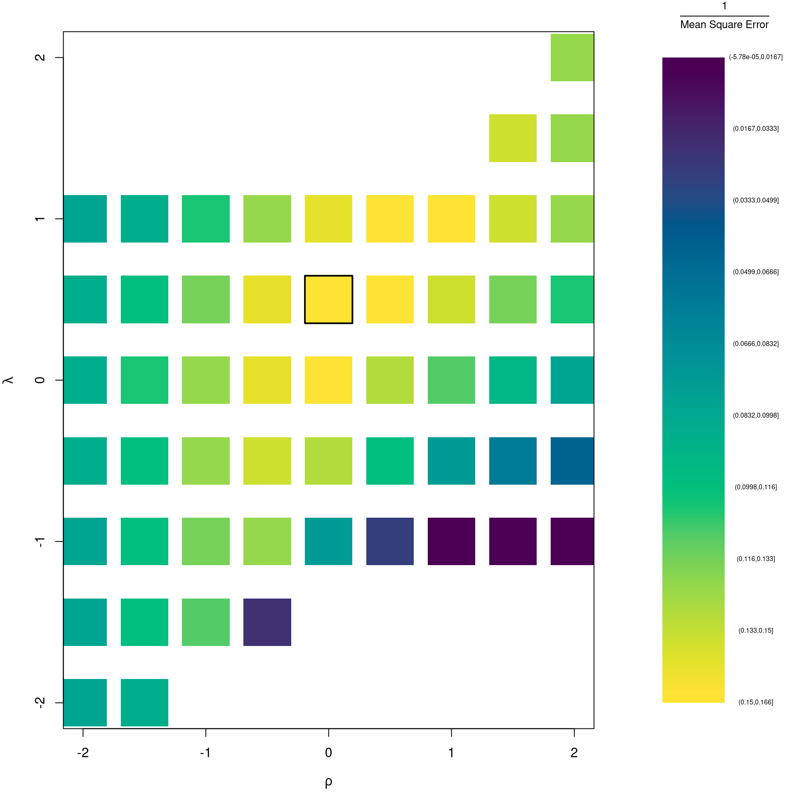

# (PART) Linear Regression in R {-} 

This section is a quick overview of linear regression models from the perspective that ``all models are wrong, but some are useful''. For more in-depth introductions, which typically begin by assuming the true data generating process is linear, see https://jadamso.github.io/Rbooks/ordinary-least-squares.html#more-literature. 


# Ordinary Least Squares
***

## Simple OLS (linear regression)
Model and objective
$$
y_i=\alpha+\beta x_i+\epsilon_{i} \\
\epsilon_{i} = y_i - [\alpha+\beta x_i]\\
min_{\beta} \sum_{i=1}^{n} (\epsilon_{i})^2
$$

Point Estimates
$$
\hat{\alpha}=\bar{y}-\hat{\beta}\bar{x} = \widehat{\mathbb{E}}[Y] - \hat{\beta} \widehat{\mathbb{E}}[X] \\
\hat{\beta}=\frac{\sum_{i}^{}(x_i-\bar{x})(y_i-\bar{y})}{\sum_{i}^{}(x_i-\bar{x})^2} = \frac{\widehat{Cov}[X,Y]}{\widehat{\mathbb{V}}[X]}\\
\hat{y}_i=\hat{\alpha}+\hat{\beta}x_i\\
\hat{\epsilon}_i=y_i-\hat{y}_i\\
$$


```r
## Generate Dataset
xy <- USArrests[,c('Murder','UrbanPop')]
colnames(xy) <- c('y','x')

## Plot Data
plot(y~x, xy, col=grey(.5,.5), pch=16)

## Estimate Regression Coefficeints
reg <- lm(y~x, dat=xy)
reg 
```

```
## 
## Call:
## lm(formula = y ~ x, data = xy)
## 
## Coefficients:
## (Intercept)            x  
##     6.41594      0.02093
```

```r
## Point Estimates
coef(reg)
```

```
## (Intercept)           x 
##  6.41594246  0.02093466
```

```r
## Add Predictions to Plot
abline(reg, col='orange')
```


To measure the ''Goodness of fit'', we analyze sums of squared errors (Total, Explained, and Residual) as
$$
\underbrace{\sum_{i}(y_i-\bar{y})^2}_\text{TSS}=\underbrace{\sum_{i}(\hat{y}_i-\bar{y})^2}_\text{ESS}+\underbrace{\sum_{i}\hat{\epsilon_{i}}^2}_\text{RSS}\\
R^2 = \frac{ESS}{TSS}=1-\frac{RSS}{TSS}
$$
Note that $R^2$ is also called the coefficient of determination.


```r
## Manually Compute Goodness of Fit
Ehat <- resid(reg)
RSS  <- sum(Ehat^2)
Y <- xy$y
TSS  <- sum((Y-mean(Y))^2)
R2 <- 1 - RSS/TSS
R2
```

```
## [1] 0.00484035
```

```r
## Check R2
summary(reg)$r.squared
```

```
## [1] 0.00484035
```


### Variability Estimates

A regression coefficient is a statistic. And, just like all statistics, we can calculate 

* *standard deviation*: variability within a single sample.
* *standard error*: variability across different samples.
* *confidence interval* range your statistic varies across different samples.
* *p-value* the probability you would see something as extreme as your statistic when sampling from the null distribution.
* *null distribution*: the sampling distribution of the statistic under the null hypothesis (assuming your null hypothesis was true).

The classic estimates for variability are the Standard Error of the Regression $\hat{\sigma}$, and Standard Error of the Coefficient Estimates $\hat{\sigma}_{\hat{\alpha}}$ and $\hat{\sigma}_{\hat{\alpha}}~~$ (or simply Standard Errors).
$$
\hat{\sigma}^2 = \frac{1}{n-2}\sum_{i}\hat{\epsilon_{i}}^2\\
\hat{\sigma}^2_{\hat{\alpha}}=\hat{\sigma}^2\left[\frac{1}{n}+\frac{\bar{x}^2}{\sum_{i}(x_i-\bar{x})^2}\right]\\
\hat{\sigma}^2_{\hat{\beta}}=\frac{\hat{\sigma}^2}{\sum_{i}(x_i-\bar{x})^2}.
$$
These equations are motivated by particular data generating proceses, which you can read more about this at https://www.econometrics-with-r.org/4-lrwor.html. We can also estimate variabilty using *data-driven* methods that assume much less. See, e.g., https://www.sagepub.com/sites/default/files/upm-binaries/21122_Chapter_21.pdf

We first consider the simplest, the jackknife, where we loop through each row of the dataset. In each iteration of the loop, we drop that observation from the dataset and reestimate the statistic of interest. We then calculate the standard deviation of the statistic across all ``resamples''.


```r
## Example 1 Continued

## Jackknife Standard Errors for Beta
jack_regs <- lapply(1:nrow(xy), function(i){
    xy_i <- xy[-i,]
    reg_i <- lm(y~x, dat=xy_i)
})
jack_coefs <- sapply(jack_regs, coef)['x',]
jack_mean <- mean(jack_coefs)
jack_se <- sd(jack_coefs)

## Jackknife Confidence Intervals
jack_ci_percentile <- quantile(jack_coefs, probs=c(.025,.975))
hist(jack_coefs, breaks=25,
    main=paste0('SE est. = ', round(jack_se,4)),
    xlab=expression(beta[-i]))
abline(v=jack_mean, col="red", lwd=2)
abline(v=jack_ci_percentile, col="red", lty=2)
```


```r
## Plot Full-Sample Estimate
## abline(v=coef(reg)['x'], lty=1, col='blue', lwd=2)

## Plot Normal Approximation
## jack_ci_normal <- jack_mean+c(-1.96, +1.96)*jack_se
## abline(v=jack_ci_normal, col="red", lty=3)
```

There are several other resampling techniques. We consider the other main one, the bootstrap, which resamples with *replacement* for an *arbitrary* number of iterations. For a dataset with $n$ observations, you now randomly resamples all $n$ rows in your data set $B$ times. 

| | Sample Size per Iteration | Number of Iterations | Resample |
| -------- | ------- | ------- | ------- |
Bootstrap | $n$     | $B$  | With Replacement |
Jackknife | $n-1$   | $n$  | Without Replacement |


```r
## Bootstrap Standard Errors for Beta
boots <- 1:399
boot_regs <- lapply(boots, function(b){
    b_id <- sample( nrow(xy), replace=T)
    xy_b <- xy[b_id,]
    reg_b <- lm(y~x, dat=xy_b)
})
boot_coefs <- sapply(boot_regs, coef)['x',]
boot_mean <- mean(boot_coefs)
boot_se <- sd(boot_coefs)

## Bootstrap Confidence Intervals
boot_ci_percentile <- quantile(boot_coefs, probs=c(.025,.975))
hist(boot_coefs, breaks=25,
    main=paste0('SE est. = ', round(boot_se,4)),
    xlab=expression(beta[b]))
abline(v=boot_mean, col="red", lwd=2)
abline(v=boot_ci_percentile, col="red", lty=2)
```


```r
## Normal Approximation
## boot_ci_normal <- boot_mean+c(-1.96, +1.96)*boot

## Parametric CI
## x <- data.frame(x=quantile(xy$x,probs=seq(0,1,by=.1)))
## ci <- predict(reg, interval='confidence', newdata=data.frame(x))
## polygon( c(x, rev(x)), c(ci[,'lwr'], rev(ci[,'upr'])), col=grey(0,.2), border=0)
```

We can also bootstrap other statistics, such as a t-statistic or $R^2$. We do such things to test a null hypothesis, which is often ``no relationship''. We are rarely interested in computing standard errrors and conducting hypothesis tests for two variables. However, we work through the ideas in the two-variable case to better understand the multi-variable case.

### Hypothesis Tests

There are two main ways to conduct a hypothesis test.
 
**Invert a CI**
One main way to conduct hypothesis tests is to examine whether a confidence interval contains a hypothesized value. Often, this is $0$.

```r
## Example 1 Continued Yet Again

## Bootstrap Distribution
boot_ci_percentile <- quantile(boot_coefs, probs=c(.025,.975))
hist(boot_coefs, breaks=25,
    main=paste0('SE est. = ', round(boot_se,4)),
    xlab=expression(beta[b]), 
    xlim=range(c(0, boot_coefs)) )
abline(v=boot_ci_percentile, lty=2)
abline(v=0, col="red", lwd=2)
```


**Impose the Null**
We can also compute a null distribution using *data-driven* methods that assume much less about the data generating process. We focus on the simplest, the bootstrap, where loop through a large number of simulations. In each iteration of the loop, we drop impose the null hypothesis and reestimate the statistic of interest. We then calculate the standard deviation of the statistic across all ``resamples''.


```r
## Example 1 Continued Again

## Null Distribution for Beta
boots <- 1:399
boot_regs0 <- lapply(boots, function(b){
    xy_b <- xy
    xy_b$y <- sample( xy_b$y, replace=T)
    reg_b <- lm(y~x, dat=xy_b)
})
boot_coefs0 <- sapply(boot_regs0, coef)['x',]

## Null Bootstrap Distribution
boot_ci_percentile0 <- quantile(boot_coefs0, probs=c(.025,.975))
hist(boot_coefs0, breaks=25, main='',
    xlab=expression(beta[b]),
    xlim=range(c(boot_coefs0, coef(reg)['x'])))
abline(v=boot_ci_percentile0, lty=2)
abline(v=coef(reg)['x'], col="red", lwd=2)
```


Regardless of how we calculate standard errors, we can use them to conduct a t-test. We also compute the distribution of t-values under the null hypothesis, and compare how extreme the oberved value is.
$$ \hat{t} = \frac{\hat{\beta} - \beta_{0} }{\hat{\sigma}_{\hat{\beta}}} $$


```r
## T Test
B0 <- 0
boot_t  <- (coef(reg)['x']-B0)/boot_se

## Compute Bootstrap T-Values (without refinement)
boot_t_boot0 <- sapply(boot_regs0, function(reg_b){
    beta_b <- coef(reg_b)[['x']]
    t_hat_b <- (beta_b)/boot_se
    return(t_hat_b)
})
hist(boot_t_boot0, breaks=100,
    main='Bootstrapped t values', xlab='t',
    xlim=range(c(boot_t_boot0, boot_t)) )
abline(v=boot_t, lwd=2, col='red')
```


From this, we can calculate a *p-value*: the probability you would see something as extreme as your statistic under the null (assuming your null hypothesis was true). Note that the $p$ reported by your computer does not necessarily satisfy this definition. We can always calcuate a p-value from an explicit null distribution.

```r
## One Sided Test for P(t > boot_t | Null)=1- P(t < boot_t | Null)
That_NullDist1 <- ecdf(boot_t_boot0)
Phat1  <- 1-That_NullDist1(boot_t)

## Two Sided Test for P(t > jack_t or  t < -jack_t | Null)
That_NullDist2 <- ecdf(abs(boot_t_boot0))
plot(That_NullDist2, xlim=range(boot_t_boot0, boot_t))
abline(v=quantile(That_NullDist2,probs=.95), lty=3)
abline(v=boot_t, col='red')
```


```r
Phat2  <-  1-That_NullDist2(boot_t)
Phat2
```

```
## [1] 0.6566416
```
Under some assumptions, the null distribution is distributed $t_{n-2}$. (For more on parametric t-testing based on statistical theory, see https://www.econometrics-with-r.org/4-lrwor.html.)


### Prediction Intervals

In addition to confidence intervales, we can also compute a *prediction interval* which estimates the range of variability across different samples for the outcomes. These intervals also take into account the residuals--- the variability of individuals around the mean. 


```r
## Bootstrap Prediction Interval
boot_resids <- lapply(boot_regs, function(reg_b){
    e_b <- resid(reg_b)
    x_b <- reg_b$model$x
    res_b <- cbind(e_b, x_b)
})
boot_resids <- as.data.frame(do.call(rbind, boot_resids))
## Homoskedastic
ehat <- quantile(boot_resids$e_b, probs=c(.025, .975))
x <- quantile(xy$x,probs=seq(0,1,by=.1))
boot_pi <- coef(reg)[1] + x*coef(reg)['x']
boot_pi <- cbind(boot_pi + ehat[1], boot_pi + ehat[2])

## Plot Bootstrap PI
plot(y~x, dat=xy, pch=16, main='Prediction Intervals',
ylim=c(-5,20))
polygon( c(x, rev(x)), c(boot_pi[,1], rev(boot_pi[,2])),
    col=grey(0,.2), border=NA)

## Parametric PI (For Comparison)
pi <- predict(reg, interval='prediction', newdata=data.frame(x))
lines( x, pi[,'lwr'], lty=2)
lines( x, pi[,'upr'], lty=2)
```


There are many ways to improve upon the prediction intervals you just created. Probably the most basic way is to allow the residuals to be heteroskedastic. 


```r
## Estimate Residual Quantiles seperately around X points
boot_resid_list <- split(boot_resids,
    cut(boot_resids$x_b, x) )
boot_resid_est <- lapply(boot_resid_list, function(res_b) {
    if( nrow(res_b)==0){ ## If Empty, Return Nothing
        ehat <- c(NA,NA)
    } else{ ## Estimate Quantiles of Residuals
        ehat <- quantile(res_b$e_b, probs=c(.025, .975))
    }
    return(ehat)
    })
boot_resid_est <- do.call(rbind, boot_resid_est)
## Construct PI at x points
boot_x <- x[-1] - diff(x)/2
boot_pi <- coef(reg)[1] + boot_x*coef(reg)['x']
boot_pi <- cbind(boot_pi + boot_resid_est[,1], boot_pi + boot_resid_est[,2])

plot(y~x, dat=xy, pch=16, main='Heteroskedastic P.I.')
polygon( c(boot_x, rev(boot_x)), c(boot_pi[,1], rev(boot_pi[,2])),
    col=grey(0,.2), border=NA)
rug(boot_x)
```


For a nice overview of different types of intervals, see https://www.jstor.org/stable/2685212. For an indepth view, see "Statistical Intervals: A Guide for Practitioners and Researchers" or "Statistical Tolerance Regions: Theory, Applications, and Computation". See https://robjhyndman.com/hyndsight/intervals/ for constructing intervals for future observations in a time-series context. See Davison and Hinkley, chapters 5 and 6 (also Efron and Tibshirani, or Wehrens et al.)


## OLS (multiple linear regression)

Model and objective
$$
y_i=\beta_0+\beta_1x_{i1}+\beta_2x_{i2}+\ldots+\beta_kx_{ik}+\epsilon_i = X_{i}\beta +\epsilon_i \\
min_{\beta} \sum_{i=1}^{n} (\epsilon_i)^2
$$
Can be written in matrix form
$$
y=\textbf{X}\beta+\epsilon\\
min_{\beta} (\epsilon' \epsilon)
$$

Point Estimates 
$$
\hat{\beta}=(\textbf{X}'\textbf{X})^{-1}\textbf{X}'y
$$

^[To derive OLS coefficients in Matrix form, see

* https://jrnold.github.io/intro-methods-notes/ols-in-matrix-form.html
* https://www.fsb.miamioh.edu/lij14/411_note_matrix.pdf
* https://web.stanford.edu/~mrosenfe/soc_meth_proj3/matrix_OLS_NYU_notes.pdf
]


```r
## Example 2 (Empirical)
## Inspect Dataset on police arrests for the USA in 1973
head(USArrests)
```

```
##            Murder Assault UrbanPop Rape
## Alabama      13.2     236       58 21.2
## Alaska       10.0     263       48 44.5
## Arizona       8.1     294       80 31.0
## Arkansas      8.8     190       50 19.5
## California    9.0     276       91 40.6
## Colorado      7.9     204       78 38.7
```

```r
## Simple Plot
#plot(Assault~UrbanPop, USArrests, col=grey(0,.5), pch=16,
#    cex=USArrests$Murder/diff(range(USArrests$Murder))*2,
#    main='US Murder arrests (per 100,000)')

# Superior Plot
USArrests$ID <- rownames(USArrests)
fig <- plotly::plot_ly(
  USArrests, x = ~UrbanPop, y = ~Assault,
  text = ~paste('<b>', ID, '</b>',
    "<br>Urban  :", UrbanPop,
    "<br>Assault:", Assault,
    "<br>Murder :", Murder),
  mode='markers',
  type='scatter',
  hoverinfo='text',
  color=~Murder,
  showlegend=F,
  marker=list(
    size=~Murder,
    opacity=0.5,
    showscale=T,  
    colorbar = list(title='Murder Arrests (per 100,000)')))
fig <- plotly::layout(fig,
  title='Crime and Urbanization in America 1975',
  xaxis = list(title = 'Percent of People in an Urban Area'),
  yaxis = list(title = 'Assault Arrests per 100,000 People'))
fig
```

```{=html}
<div class="plotly html-widget html-fill-item-overflow-hidden html-fill-item" id="htmlwidget-133c0d8f89cceccff983" style="width:672px;height:480px;"></div>
<script type="application/json" data-for="htmlwidget-133c0d8f89cceccff983">{"x":{"visdat":{"22512dedae85":["function () ","plotlyVisDat"]},"cur_data":"22512dedae85","attrs":{"22512dedae85":{"x":{},"y":{},"text":{},"mode":"markers","hoverinfo":"text","showlegend":false,"marker":{"size":{},"opacity":0.5,"showscale":true,"colorbar":{"title":"Murder Arrests (per 100,000)"}},"color":{},"alpha_stroke":1,"sizes":[10,100],"spans":[1,20],"type":"scatter"}},"layout":{"margin":{"b":40,"l":60,"t":25,"r":10},"title":"Crime and Urbanization in America 1975","xaxis":{"domain":[0,1],"automargin":true,"title":"Percent of People in an Urban Area"},"yaxis":{"domain":[0,1],"automargin":true,"title":"Assault Arrests per 100,000 People"},"hovermode":"closest","showlegend":false},"source":"A","config":{"modeBarButtonsToAdd":["hoverclosest","hovercompare"],"showSendToCloud":false},"data":[{"x":[58,48,80,50,91,78,77,72,80,60,83,54,83,65,57,66,52,66,51,67,85,74,66,44,70,53,62,81,56,89,70,86,45,44,75,68,67,72,87,48,45,59,80,80,32,63,73,39,66,60],"y":[236,263,294,190,276,204,110,238,335,211,46,120,249,113,56,115,109,249,83,300,149,255,72,259,178,109,102,252,57,159,285,254,337,45,120,151,159,106,174,279,86,188,201,120,48,156,145,81,53,161],"text":["<b> Alabama <\/b> <br>Urban  : 58 <br>Assault: 236 <br>Murder : 13.2","<b> Alaska <\/b> <br>Urban  : 48 <br>Assault: 263 <br>Murder : 10","<b> Arizona <\/b> <br>Urban  : 80 <br>Assault: 294 <br>Murder : 8.1","<b> Arkansas <\/b> <br>Urban  : 50 <br>Assault: 190 <br>Murder : 8.8","<b> California <\/b> <br>Urban  : 91 <br>Assault: 276 <br>Murder : 9","<b> Colorado <\/b> <br>Urban  : 78 <br>Assault: 204 <br>Murder : 7.9","<b> Connecticut <\/b> <br>Urban  : 77 <br>Assault: 110 <br>Murder : 3.3","<b> Delaware <\/b> <br>Urban  : 72 <br>Assault: 238 <br>Murder : 5.9","<b> Florida <\/b> <br>Urban  : 80 <br>Assault: 335 <br>Murder : 15.4","<b> Georgia <\/b> <br>Urban  : 60 <br>Assault: 211 <br>Murder : 17.4","<b> Hawaii <\/b> <br>Urban  : 83 <br>Assault: 46 <br>Murder : 5.3","<b> Idaho <\/b> <br>Urban  : 54 <br>Assault: 120 <br>Murder : 2.6","<b> Illinois <\/b> <br>Urban  : 83 <br>Assault: 249 <br>Murder : 10.4","<b> Indiana <\/b> <br>Urban  : 65 <br>Assault: 113 <br>Murder : 7.2","<b> Iowa <\/b> <br>Urban  : 57 <br>Assault: 56 <br>Murder : 2.2","<b> Kansas <\/b> <br>Urban  : 66 <br>Assault: 115 <br>Murder : 6","<b> Kentucky <\/b> <br>Urban  : 52 <br>Assault: 109 <br>Murder : 9.7","<b> Louisiana <\/b> <br>Urban  : 66 <br>Assault: 249 <br>Murder : 15.4","<b> Maine <\/b> <br>Urban  : 51 <br>Assault: 83 <br>Murder : 2.1","<b> Maryland <\/b> <br>Urban  : 67 <br>Assault: 300 <br>Murder : 11.3","<b> Massachusetts <\/b> <br>Urban  : 85 <br>Assault: 149 <br>Murder : 4.4","<b> Michigan <\/b> <br>Urban  : 74 <br>Assault: 255 <br>Murder : 12.1","<b> Minnesota <\/b> <br>Urban  : 66 <br>Assault: 72 <br>Murder : 2.7","<b> Mississippi <\/b> <br>Urban  : 44 <br>Assault: 259 <br>Murder : 16.1","<b> Missouri <\/b> <br>Urban  : 70 <br>Assault: 178 <br>Murder : 9","<b> Montana <\/b> <br>Urban  : 53 <br>Assault: 109 <br>Murder : 6","<b> Nebraska <\/b> <br>Urban  : 62 <br>Assault: 102 <br>Murder : 4.3","<b> Nevada <\/b> <br>Urban  : 81 <br>Assault: 252 <br>Murder : 12.2","<b> New Hampshire <\/b> <br>Urban  : 56 <br>Assault: 57 <br>Murder : 2.1","<b> New Jersey <\/b> <br>Urban  : 89 <br>Assault: 159 <br>Murder : 7.4","<b> New Mexico <\/b> <br>Urban  : 70 <br>Assault: 285 <br>Murder : 11.4","<b> New York <\/b> <br>Urban  : 86 <br>Assault: 254 <br>Murder : 11.1","<b> North Carolina <\/b> <br>Urban  : 45 <br>Assault: 337 <br>Murder : 13","<b> North Dakota <\/b> <br>Urban  : 44 <br>Assault: 45 <br>Murder : 0.8","<b> Ohio <\/b> <br>Urban  : 75 <br>Assault: 120 <br>Murder : 7.3","<b> Oklahoma <\/b> <br>Urban  : 68 <br>Assault: 151 <br>Murder : 6.6","<b> Oregon <\/b> <br>Urban  : 67 <br>Assault: 159 <br>Murder : 4.9","<b> Pennsylvania <\/b> <br>Urban  : 72 <br>Assault: 106 <br>Murder : 6.3","<b> Rhode Island <\/b> <br>Urban  : 87 <br>Assault: 174 <br>Murder : 3.4","<b> South Carolina <\/b> <br>Urban  : 48 <br>Assault: 279 <br>Murder : 14.4","<b> South Dakota <\/b> <br>Urban  : 45 <br>Assault: 86 <br>Murder : 3.8","<b> Tennessee <\/b> <br>Urban  : 59 <br>Assault: 188 <br>Murder : 13.2","<b> Texas <\/b> <br>Urban  : 80 <br>Assault: 201 <br>Murder : 12.7","<b> Utah <\/b> <br>Urban  : 80 <br>Assault: 120 <br>Murder : 3.2","<b> Vermont <\/b> <br>Urban  : 32 <br>Assault: 48 <br>Murder : 2.2","<b> Virginia <\/b> <br>Urban  : 63 <br>Assault: 156 <br>Murder : 8.5","<b> Washington <\/b> <br>Urban  : 73 <br>Assault: 145 <br>Murder : 4","<b> West Virginia <\/b> <br>Urban  : 39 <br>Assault: 81 <br>Murder : 5.7","<b> Wisconsin <\/b> <br>Urban  : 66 <br>Assault: 53 <br>Murder : 2.6","<b> Wyoming <\/b> <br>Urban  : 60 <br>Assault: 161 <br>Murder : 6.8"],"mode":"markers","hoverinfo":["text","text","text","text","text","text","text","text","text","text","text","text","text","text","text","text","text","text","text","text","text","text","text","text","text","text","text","text","text","text","text","text","text","text","text","text","text","text","text","text","text","text","text","text","text","text","text","text","text","text"],"showlegend":false,"marker":{"colorbar":{"title":"Murder Arrests (per 100,000)","ticklen":2},"cmin":0.80000000000000004,"cmax":17.399999999999999,"colorscale":[["0","rgba(68,1,84,1)"],["0.0416666666666667","rgba(70,19,97,1)"],["0.0833333333333333","rgba(72,32,111,1)"],["0.125","rgba(71,45,122,1)"],["0.166666666666667","rgba(68,58,128,1)"],["0.208333333333333","rgba(64,70,135,1)"],["0.25","rgba(60,82,138,1)"],["0.291666666666667","rgba(56,93,140,1)"],["0.333333333333333","rgba(49,104,142,1)"],["0.375","rgba(46,114,142,1)"],["0.416666666666667","rgba(42,123,142,1)"],["0.458333333333333","rgba(38,133,141,1)"],["0.5","rgba(37,144,140,1)"],["0.541666666666667","rgba(33,154,138,1)"],["0.583333333333333","rgba(39,164,133,1)"],["0.625","rgba(47,174,127,1)"],["0.666666666666667","rgba(53,183,121,1)"],["0.708333333333333","rgba(79,191,110,1)"],["0.75","rgba(98,199,98,1)"],["0.791666666666667","rgba(119,207,85,1)"],["0.833333333333333","rgba(147,214,70,1)"],["0.875","rgba(172,220,52,1)"],["0.916666666666667","rgba(199,225,42,1)"],["0.958333333333333","rgba(226,228,40,1)"],["1","rgba(253,231,37,1)"]],"showscale":true,"color":[13.199999999999999,10,8.0999999999999996,8.8000000000000007,9,7.9000000000000004,3.2999999999999998,5.9000000000000004,15.4,17.399999999999999,5.2999999999999998,2.6000000000000001,10.4,7.2000000000000002,2.2000000000000002,6,9.6999999999999993,15.4,2.1000000000000001,11.300000000000001,4.4000000000000004,12.1,2.7000000000000002,16.100000000000001,9,6,4.2999999999999998,12.199999999999999,2.1000000000000001,7.4000000000000004,11.4,11.1,13,0.80000000000000004,7.2999999999999998,6.5999999999999996,4.9000000000000004,6.2999999999999998,3.3999999999999999,14.4,3.7999999999999998,13.199999999999999,12.699999999999999,3.2000000000000002,2.2000000000000002,8.5,4,5.7000000000000002,2.6000000000000001,6.7999999999999998],"size":[13.199999999999999,10,8.0999999999999996,8.8000000000000007,9,7.9000000000000004,3.2999999999999998,5.9000000000000004,15.4,17.399999999999999,5.2999999999999998,2.6000000000000001,10.4,7.2000000000000002,2.2000000000000002,6,9.6999999999999993,15.4,2.1000000000000001,11.300000000000001,4.4000000000000004,12.1,2.7000000000000002,16.100000000000001,9,6,4.2999999999999998,12.199999999999999,2.1000000000000001,7.4000000000000004,11.4,11.1,13,0.80000000000000004,7.2999999999999998,6.5999999999999996,4.9000000000000004,6.2999999999999998,3.3999999999999999,14.4,3.7999999999999998,13.199999999999999,12.699999999999999,3.2000000000000002,2.2000000000000002,8.5,4,5.7000000000000002,2.6000000000000001,6.7999999999999998],"opacity":0.5,"line":{"colorbar":{"title":"","ticklen":2},"cmin":0.80000000000000004,"cmax":17.399999999999999,"colorscale":[["0","rgba(68,1,84,1)"],["0.0416666666666667","rgba(70,19,97,1)"],["0.0833333333333333","rgba(72,32,111,1)"],["0.125","rgba(71,45,122,1)"],["0.166666666666667","rgba(68,58,128,1)"],["0.208333333333333","rgba(64,70,135,1)"],["0.25","rgba(60,82,138,1)"],["0.291666666666667","rgba(56,93,140,1)"],["0.333333333333333","rgba(49,104,142,1)"],["0.375","rgba(46,114,142,1)"],["0.416666666666667","rgba(42,123,142,1)"],["0.458333333333333","rgba(38,133,141,1)"],["0.5","rgba(37,144,140,1)"],["0.541666666666667","rgba(33,154,138,1)"],["0.583333333333333","rgba(39,164,133,1)"],["0.625","rgba(47,174,127,1)"],["0.666666666666667","rgba(53,183,121,1)"],["0.708333333333333","rgba(79,191,110,1)"],["0.75","rgba(98,199,98,1)"],["0.791666666666667","rgba(119,207,85,1)"],["0.833333333333333","rgba(147,214,70,1)"],["0.875","rgba(172,220,52,1)"],["0.916666666666667","rgba(199,225,42,1)"],["0.958333333333333","rgba(226,228,40,1)"],["1","rgba(253,231,37,1)"]],"showscale":false,"color":[13.199999999999999,10,8.0999999999999996,8.8000000000000007,9,7.9000000000000004,3.2999999999999998,5.9000000000000004,15.4,17.399999999999999,5.2999999999999998,2.6000000000000001,10.4,7.2000000000000002,2.2000000000000002,6,9.6999999999999993,15.4,2.1000000000000001,11.300000000000001,4.4000000000000004,12.1,2.7000000000000002,16.100000000000001,9,6,4.2999999999999998,12.199999999999999,2.1000000000000001,7.4000000000000004,11.4,11.1,13,0.80000000000000004,7.2999999999999998,6.5999999999999996,4.9000000000000004,6.2999999999999998,3.3999999999999999,14.4,3.7999999999999998,13.199999999999999,12.699999999999999,3.2000000000000002,2.2000000000000002,8.5,4,5.7000000000000002,2.6000000000000001,6.7999999999999998]}},"type":"scatter","xaxis":"x","yaxis":"y","frame":null},{"x":[32,91],"y":[45,337],"type":"scatter","mode":"markers","opacity":0,"hoverinfo":"none","showlegend":false,"marker":{"colorbar":{"title":"Murder","ticklen":2},"cmin":0.80000000000000004,"cmax":17.399999999999999,"colorscale":[["0","rgba(68,1,84,1)"],["0.0416666666666667","rgba(70,19,97,1)"],["0.0833333333333333","rgba(72,32,111,1)"],["0.125","rgba(71,45,122,1)"],["0.166666666666667","rgba(68,58,128,1)"],["0.208333333333333","rgba(64,70,135,1)"],["0.25","rgba(60,82,138,1)"],["0.291666666666667","rgba(56,93,140,1)"],["0.333333333333333","rgba(49,104,142,1)"],["0.375","rgba(46,114,142,1)"],["0.416666666666667","rgba(42,123,142,1)"],["0.458333333333333","rgba(38,133,141,1)"],["0.5","rgba(37,144,140,1)"],["0.541666666666667","rgba(33,154,138,1)"],["0.583333333333333","rgba(39,164,133,1)"],["0.625","rgba(47,174,127,1)"],["0.666666666666667","rgba(53,183,121,1)"],["0.708333333333333","rgba(79,191,110,1)"],["0.75","rgba(98,199,98,1)"],["0.791666666666667","rgba(119,207,85,1)"],["0.833333333333333","rgba(147,214,70,1)"],["0.875","rgba(172,220,52,1)"],["0.916666666666667","rgba(199,225,42,1)"],["0.958333333333333","rgba(226,228,40,1)"],["1","rgba(253,231,37,1)"]],"showscale":true,"color":[0.80000000000000004,17.399999999999999],"line":{"color":"rgba(255,127,14,1)"}},"xaxis":"x","yaxis":"y","frame":null}],"highlight":{"on":"plotly_click","persistent":false,"dynamic":false,"selectize":false,"opacityDim":0.20000000000000001,"selected":{"opacity":1},"debounce":0},"shinyEvents":["plotly_hover","plotly_click","plotly_selected","plotly_relayout","plotly_brushed","plotly_brushing","plotly_clickannotation","plotly_doubleclick","plotly_deselect","plotly_afterplot","plotly_sunburstclick"],"base_url":"https://plot.ly"},"evals":[],"jsHooks":[]}</script>
```

```r
## For further exploratory plotting,
## see https://plotly.com/r/bubble-charts/
```


```r
## Manually Compute
Y <- USArrests[,'Murder']
X <- USArrests[,c('Assault','UrbanPop')]
X <- as.matrix(cbind(1,X))

XtXi <- solve(t(X)%*%X)
Bhat <- XtXi %*% (t(X)%*%Y)
c(Bhat)
```

```
## [1]  3.20715340  0.04390995 -0.04451047
```

```r
## Check
reg <- lm(Murder~Assault+UrbanPop, data=USArrests)
coef(reg)
```

```
## (Intercept)     Assault    UrbanPop 
##  3.20715340  0.04390995 -0.04451047
```

To measure the ``Goodness of fit'', we can compute various sums of squared srrors
$$
R^2 = \frac{ESS}{TSS}=1-\frac{RSS}{TSS}\\
R^2_{\text{adj.}} = 1-\frac{n-1}{n-K}(1-R^2)
$$
With multiple variables, sometimes random data may improve the fit. So we adjust the $R^2$ by the number of covariates $K$.

```r
ksims <- 1:30
for(k in ksims){ 
    USArrests[,paste0('R',k)] <- runif(nrow(USArrests),0,20)
}
reg_sim <- lapply(ksims, function(k){
    rvars <- c('Assault','UrbanPop', paste0('R',1:k))
    rvars2 <- paste0(rvars, collapse='+')
    reg_k <- lm( paste0('Murder~',rvars2), data=USArrests)
})
R2_sim <- sapply(reg_sim, function(reg_k){  summary(reg_k)$r.squared })
R2adj_sim <- sapply(reg_sim, function(reg_k){  summary(reg_k)$adj.r.squared })

plot.new()
plot.window(xlim=c(0,30), ylim=c(0,1))
points(ksims, R2_sim)
points(ksims, R2adj_sim, pch=16)
axis(1)
axis(2)
mtext(expression(R^2),2, line=3)
mtext('Additional Random Covariates', 1, line=3)
legend('topleft', horiz=T,
    legend=c('Undjusted', 'Adjusted'), pch=c(1,16))
```


### Variability Estimates and Hypothesis Tests

We can use the same *data-driven* methods to estimate the variability of the estimated parameters.


```r
## Bootstrap SE's
boots <- 1:399
boot_regs <- lapply(boots, function(b){
    b_id <- sample( nrow(USArrests), replace=T)
    xy_b <- USArrests[b_id,]
    reg_b <- lm(Murder~Assault+UrbanPop, dat=xy_b)
})
boot_coefs <- sapply(boot_regs, coef)
boot_mean <- apply(boot_coefs,1, mean)
boot_se <- apply(boot_coefs,1, sd)
```

Also as before, we can conduct independant hypothesis tests using t-values 
$$\hat{t}_{j} = \frac{\hat{\beta}_j - \beta_{0} }{\hat{\sigma}_{\hat{\beta}_j}}$$
and, under some additional assumptions $\hat{t}_{j} \sim t_{n-K}$. But note that *Hypothesis Testing is not to be done routinely*, and some additional complications arise when examining multiple variables.

We can conduct joint tests, such as whether two coefficients are equal, by looking at the their joint distribution.

```r
fig <- plotly::plot_ly(x=boot_coefs[2,], y=boot_coefs[3,]) 
plotly::add_histogram2d(fig, nbinsx=20, nbinsy=20)
```

```{=html}
<div class="plotly html-widget html-fill-item-overflow-hidden html-fill-item" id="htmlwidget-4e928318c559398a4bcd" style="width:672px;height:480px;"></div>
<script type="application/json" data-for="htmlwidget-4e928318c559398a4bcd">{"x":{"visdat":{"2251e559c3f":["function () ","plotlyVisDat"]},"cur_data":"2251e559c3f","attrs":{"2251e559c3f":{"x":[0.047101644810002077,0.044896530343802532,0.048976132233096263,0.039094322531069856,0.052149652993319334,0.044162000554127237,0.044332422812145986,0.036228788226788315,0.03767818587194352,0.047056725959894283,0.047180533336791328,0.041266023356891141,0.031432888903659285,0.043002262200342811,0.045784075190680673,0.044115271870457655,0.051725293867174164,0.044902827668449101,0.041275598200541289,0.046357218798574074,0.044311563073579273,0.044454422383459744,0.047619321185034397,0.044366557930474129,0.051779534629925468,0.04399108820384983,0.044039495114833974,0.042173401049795209,0.043843280362803633,0.04577748436411689,0.037645515437452419,0.0522499613691145,0.039911348170882231,0.05300288982515481,0.040304282741849551,0.047175668897102556,0.042935078830692266,0.054580549408020311,0.037507789024638201,0.043928551214188087,0.032713635733532247,0.042201636787688582,0.044357089083877407,0.05615623597223255,0.043352484266166141,0.04423116785740297,0.037879490133936482,0.045993755142251506,0.041343049396410786,0.036817411042457178,0.049652394630175116,0.042185624664641319,0.043500747121755903,0.050159443580116626,0.052382711064941009,0.042562128326038444,0.038808145766015524,0.042680672953011665,0.044426114918722039,0.042256637333126491,0.039737339565898928,0.039004467872162565,0.045751835630977879,0.037410085666949588,0.038654517525846852,0.039654220474022832,0.038551261862404866,0.040842097358653191,0.041944281932034658,0.043769641340901132,0.043214724067944577,0.044811428118582658,0.047464227480633829,0.045774693594933066,0.034663594241575828,0.051344765055864071,0.047418106296920386,0.050560575719671777,0.047210074909577987,0.044342992719626169,0.044322534055402138,0.042995566655395341,0.046968942309852692,0.048700989107632507,0.047576446170872984,0.050646430408924539,0.048663372383641899,0.052676450561263799,0.05659220480278461,0.054599236874436997,0.039782971241041645,0.04347504624088868,0.04548419269552751,0.045210238065465841,0.043944171300880658,0.046070622369348183,0.040091390727757095,0.049796510749086878,0.04527879277010298,0.044034823510825265,0.043931027789206753,0.045347444990728153,0.041127649886697586,0.042815847252488701,0.040453380434738985,0.039248787683426697,0.043118201133500102,0.045992850833096316,0.044781406783417792,0.040073928129078014,0.039976414460908188,0.04035734555328592,0.038626279669447081,0.040950072811292884,0.046312886735467115,0.035182532471355429,0.039242456947165445,0.046857406183367367,0.046436716722792828,0.046525347287156654,0.043566169424950334,0.046384086540928175,0.055004217473466642,0.049414042363925909,0.046803046756244054,0.04641088799306773,0.049841967103166768,0.046493855557890949,0.04351430281250316,0.036983292415298699,0.051569484489809456,0.044399778941085245,0.052384697261553696,0.043935581123128821,0.039958938028180804,0.053188832897962779,0.041871889113727453,0.035480898698514465,0.03961302548674811,0.034420799870707321,0.047749083241716908,0.052040517146657188,0.050156740125765056,0.035668201927990709,0.03745231978418103,0.042112618839980458,0.044867421974687696,0.04491973958569416,0.042602409602070131,0.042735908326754495,0.043727163257441519,0.038823875825334732,0.041727839921813469,0.040930848476639733,0.052882587456717298,0.037283258688708985,0.039243552043937875,0.042720354511280215,0.043787788699485498,0.043655443677687436,0.041867345544575434,0.040232679362292169,0.039014186060094158,0.040206820153448466,0.039088208253721765,0.046023259389846104,0.038532916563463082,0.038493100459767768,0.03937844001341613,0.040122089214404272,0.04637835536807839,0.044326742636409677,0.041252976874115686,0.040704514601439784,0.04227677156692717,0.041580466116620925,0.045392784873195376,0.056311719652262546,0.041306448218676003,0.044554018099561082,0.039177036128873195,0.045060974618924381,0.038602923159836884,0.047443902364688838,0.046521982312000672,0.03695000935074181,0.050273766488946853,0.043139452180922695,0.041614786072559237,0.047697795705214908,0.040188384320340012,0.050257300300189212,0.048391459694194887,0.040375455558588812,0.043460773461466679,0.046819190353866745,0.049224644044986318,0.044889162239220015,0.044116740425007121,0.045183774753493632,0.049195440763635377,0.042307399011737357,0.044268103740711648,0.046845807086590925,0.04064737901950894,0.043520525516063654,0.044001409464054307,0.055113343721101618,0.04883225989477958,0.046764114164258019,0.043212660168455298,0.038743565262891563,0.0442833898078282,0.041548657858868257,0.042604559799422938,0.040195166511100423,0.049527357049257273,0.051643918696103838,0.053960408445778256,0.036755184659904461,0.036705794286705035,0.042968046871180526,0.042300194141800015,0.042728306326014279,0.040112241001115108,0.035652504562653925,0.042587044005895344,0.040133894168319133,0.045904699391672819,0.045809020571632296,0.055016718589027361,0.042391330334115379,0.048462751720824128,0.045089891952083495,0.043171364194712347,0.045126335205329229,0.050185833462518606,0.044647964852200087,0.03734374984822026,0.040766443248008807,0.051925217663853586,0.049294608264785045,0.037483429434149652,0.043447734148516805,0.042568278475873154,0.04102776473018304,0.046296516907059784,0.039594339023277317,0.03878210780910081,0.041850808186454924,0.042059801236468373,0.05307811584083566,0.039830534906308411,0.045821759797290293,0.043205257957956794,0.041654846250521078,0.047082539603413465,0.050932146253261687,0.045357342261552393,0.045224474280959888,0.035347089213599879,0.049075900431712109,0.043724393835911909,0.044902089553670907,0.052910410207695775,0.040950524651617019,0.047415882227276961,0.04894895106366369,0.042242204223966025,0.045461901119908374,0.041187969124520642,0.04902313111171943,0.045061881008776554,0.045567031295780325,0.040139334027262552,0.045670013944446183,0.044978521949789754,0.045237825955372388,0.037874092540459328,0.050300723268104752,0.044064604095905388,0.048897469501952201,0.046283961011803244,0.056601958660184193,0.042442239182981172,0.048847558233821524,0.043951316391637421,0.04107917743289459,0.04579098043923862,0.042979121962888021,0.047079559362378592,0.043060452586000261,0.042822535260188567,0.036595851518282853,0.046816196001896772,0.04034798072656974,0.041385283186807176,0.049858384566753039,0.046058682193433037,0.040823183514313854,0.046751513101582695,0.039253110842748434,0.04926683496817829,0.038551323325416442,0.043936933164404147,0.043390195916224242,0.046472004051448176,0.046685047007378119,0.049464574940896643,0.042368564512040068,0.038501141745238561,0.041200076137414866,0.048873171854251884,0.044972528289527622,0.044385026522196051,0.042580719358516143,0.035303849140289632,0.04029385239237325,0.038612259929832263,0.052254622326940128,0.039753352817769157,0.05002726741910471,0.043630659537928947,0.044023419064879027,0.041054812652060721,0.036390338888660431,0.03928803761146947,0.044983679963867061,0.052404360643744978,0.040442501775967844,0.038638298945934881,0.043547964691905569,0.03971482039002662,0.048859565744509108,0.05138606286793506,0.046692148257794018,0.044169986495596031,0.046771998099818655,0.040197428612681302,0.03519433767680568,0.042846910824724173,0.043025779411493666,0.053324801299848373,0.049838570507862272,0.039265283560840594,0.040227507640003657,0.045627233652889718,0.045385211403068351,0.038523372669437915,0.048802054599132019,0.047308304862405295,0.043557311792920279,0.04581238162922998,0.04105862395428142,0.040575004235813679,0.047629551851820523,0.042898537243412443,0.042923158843578182,0.044557016745713739,0.046680454649990238,0.044588470396127955,0.04948356862177318,0.041165131409907629,0.047417397303340658,0.041289581643221392,0.051146153376853819,0.036818247714738329,0.039124935630636494,0.043667889479105257,0.056893936545995415,0.052867487467537028,0.041789447613029447,0.043441332866002401,0.051365556036701385,0.043363650416369234,0.05020177625218996,0.034929885542673324,0.041618697164891832,0.0441613289594762,0.042530602802813712,0.047802194609294808,0.052147682430363426,0.046519714470537356,0.043296200790290368,0.036281302865689369,0.039565799287773734,0.042506714506824077,0.046084989296028896,0.041145820267277464,0.047486091756892078,0.045049203290939435,0.045801626429071374,0.034682885580529607,0.042068512223436882,0.045574186144431372,0.039489737171836237,0.048102682591194955,0.045121737377566563,0.046209572999717792],"y":[-0.010434934177650013,-0.036949708403965414,-0.084365474924406755,-0.013356172346273242,-0.056130360813364817,-0.046251152531584357,-0.058872376161041406,0.0019124634775099082,-0.026173902050063272,-0.02800614032241526,-0.01980492927937599,-0.012483714211774518,0.0046093957770922383,-0.034206860429364071,-0.035067194829047708,-0.053163372649805016,-0.070208178692713605,-0.011581364202793085,-0.026276251007080604,-0.06081462245894699,-0.040496244821466694,-0.068832483030927955,-0.040355373752667338,-0.041012664817918217,-0.051853048661365676,-0.026396495194244696,-0.018799290545596852,-0.039933350944004575,-0.042007654710615815,-0.08148311752554549,-0.015095981563538616,-0.067201500233813799,-0.00080952910165137712,-0.042069771994717169,-0.0012669045748048499,-0.049156686011917146,-0.03567643927344618,-0.050879200472031351,-0.077965946324917115,-0.028779793099710099,-0.015746938112250787,-0.026986004058574816,-0.057537915375579771,-0.095683282696357452,-0.039528324797712011,-0.027753821688585822,-0.0071156900878756599,-0.048298066961267642,-0.023550316434452781,-0.039793121817356197,-0.048573096285086277,-0.068220604907442986,-0.024084395670855078,-0.067700692692809594,-0.048329295102303674,-0.033833306317691533,-0.067523709437218152,-0.034754183070105783,-0.017910748627455026,-0.020407805981778954,-0.060905289151936805,-0.076560801867448125,-0.064211179805543445,-0.043044877086915567,-0.017731257001639578,-0.059760821085825276,-0.021275200577790497,-0.042598070792669883,0.0030014830122400155,-0.047756347204062834,-0.029095817696804135,-0.011826020739710315,-0.048679060162555979,-0.066257097713800797,0.012212043023841041,-0.082007245344202076,-0.033992622553475675,-0.026626933945622537,-0.14001404119005328,-0.016465476309815513,-0.030220666189172265,-0.068923828331224749,-0.050755118991315698,-0.10374057737005134,-0.044118926131194475,-0.043419335142178203,-0.05959739691558074,-0.083528935157409237,-0.068399545789890936,-0.092158506610205818,-0.05109717488218031,-0.0540607142874278,-0.066598648023962467,-0.023135365020774359,-0.015446745217455569,-0.060723171980256743,-0.056078257700271777,-0.051002185449390738,-0.045406582264447173,-0.023041979530460131,-0.023715390087740748,-0.048371775960125367,0.005837294768908644,-0.05926582911272886,-0.062931550181576465,-0.056884341130601757,-0.06564783609524015,-0.062029994275118697,-0.034269168334669566,-0.013424727933081465,-0.004573140344840047,-0.025468234692139557,-0.034226113456602009,-0.042570305279344384,-0.064301109569479889,-0.011402255042299079,-0.045514431824658787,-0.062220613754796809,-0.068514933419517032,-0.042705039162029473,-0.019360864610677098,-0.082031714431247904,-0.091761769787936723,-0.037935704863119105,-0.042371936511359121,-0.047429299812387866,-0.076438813327212751,-0.075101829767938624,-0.036694200372675699,-0.037602670172475913,-0.049067549057421465,-0.019215664672377807,-0.068216561293204747,-0.01658314120251116,-0.034168755905598897,-0.086479558282294464,-0.034397358981029594,-0.042624962722116924,-0.043131512183064678,-0.019275915225680462,-0.098335693984603956,-0.089250446738369751,-0.030117138170046458,-0.037344959748253012,-0.05530802199276396,-0.081285610351849086,-0.048201421040519429,-0.061563782078287124,-0.031311030444208542,-0.0088896565250825305,-0.040553975661708423,-0.051755773703637334,-0.034399071041983878,-0.031781953139957846,-0.12927610101015308,-0.04435950479971619,-0.014031512624223121,-0.043030346047209116,0.0038207295209974723,-0.054842168952985923,-0.074522303080067326,-0.035540536177274359,-0.0010117995321784583,-0.026401530809739757,-0.068051001683717874,-0.052010286794638746,-0.07512300301013787,-0.018177376993945667,-0.035252797399558743,-0.007935126565819137,-0.059578222265621303,-0.078657181515083122,-0.051268724104939878,0.02657486235030684,-0.057382350895069573,-0.037896578451888187,-0.032817092509991985,-0.075667406045859142,-0.057395716260686833,-0.041002704194039549,-0.044366452742985826,-0.038762537666277165,-0.060769197489311727,-0.032394325323882922,-0.060234173759227891,-0.055705541126996418,-0.085874262944567611,-0.02221714377275269,-0.053013583887506641,-0.074354436987232847,-0.029556757720488994,-0.051050459535724735,-0.036820846803942937,-0.0065128538259089071,-0.063197242768700257,-0.056115589000042244,-0.084955178574931942,-0.023584032408133372,-0.027663847162248786,-0.072842549003127754,-0.055913545913849734,-0.078346933045135236,-0.051481690267974306,-0.045600323318290149,-0.0046296263226163689,-0.036828492612318943,-0.011912008060995289,-0.11000617967364938,-0.03331192858566883,-0.06548649215902326,-0.071220855461067892,-0.01745980242112476,-0.047927708776350983,-0.035037532460464524,-0.035728242200046958,-0.043167713100174726,-0.066393446778133164,-0.071369468941300404,-0.094575729047522275,-0.056946932792865203,-0.055287372038158214,-0.059129622517486068,-0.06020269762855493,-0.021696664196988819,-0.030538545846177691,-0.040225278920774328,-0.033643934166532941,-0.028311361175417826,-0.03544050597253505,-0.038632996172855448,-0.06045399009137311,-0.020638018121966861,-0.054613043638861505,-0.079854327820162219,-0.024366751380643249,-0.04951538951322855,-0.022530736009643598,-0.0033467781685724385,-0.026760238393623965,-0.012868471978158458,-0.071986366439283592,-0.055765873085098124,-0.027308998718980473,-0.038574688597928071,-0.021056515251041411,-0.025273601028642963,-0.048851287154180557,-0.022476967165977049,-0.014730506275982009,-0.025032840936236516,0.0064361452417265562,-0.072787237894164858,-0.020419975135254082,-0.024472624738217718,-0.027791557044752672,-0.045000140705432366,-0.060878274607120551,-0.054218133636756025,-0.12689059817273873,-0.044739547501904078,-0.029893351756862627,-0.075068342901588453,-0.042583067495980093,-0.06644201970293101,-0.065356883809511948,-0.060643359765352463,-0.044311644845120131,-0.082574306825050306,-0.051067127703070529,-0.045757255321890879,-0.017360712033571913,-0.051896416160380467,-0.030929391519688598,-0.031937398369925325,-0.055609733933402239,-0.053034246471528268,-0.062512130570597499,-0.047872286440531438,0.013809128445301494,-0.065336955456288537,-0.059134927050397072,-0.058370416388158014,-0.048015980341848924,-0.06931945316091212,-0.11605049079765105,-0.067964275511560604,-0.048843675642303609,-0.053425005221587683,-0.022638367406099046,-0.11956955304208716,-0.080279401730660102,-0.029458795516977238,-0.077427560082308597,-0.104408301666121,-0.053812244560483009,-0.0034295286060392789,0.01306303577989755,-0.038979562760658303,-0.092823431898182665,-0.047713098534707669,-0.048232840661878038,-0.034987833756043474,-0.0728478364607546,-0.056276380030019044,-0.052562076861163647,-0.06356204733158706,-0.071340378150752823,-0.0044603121738790927,-0.057234125716469186,-0.052453649131688596,0.024311319339086684,-0.027839988991976063,-0.088235081670414897,-0.026236810631454974,-0.046357687838353846,-0.046904642504637106,0.0096799437104882237,-0.047724879131368497,-0.042650902199510947,-0.063948358294686064,-0.10284519257030944,-0.049004354781767269,-0.024381494894599204,-0.076134788989513993,-0.058366675590131256,0.027426449220615549,0.011349511062391191,-0.049669738604167887,-0.072264143186080487,-0.042376038131868562,-0.050450917657521854,-0.0244359342721573,-0.061495192912482489,-0.051402829774596086,-0.065383128988225264,-0.048681861003862098,-0.034163432396021216,-0.052138428364010683,-0.058747794158741304,-0.020601200689512118,-0.093676550932523722,-0.028446554571664034,-0.091076086911074217,-0.098491748937250115,-0.060142554412709201,-0.043622309537180902,-0.041431541058140862,-0.014840208975716918,-0.039886679610463917,-0.046367771861857511,-0.058625187536975716,-0.058654087480884839,-0.042466651125687864,-0.018990057624037458,-0.012282924840160117,-0.043784750977871469,-0.039326016402298714,-0.020713613472771581,-0.05286054350768616,-0.028807723755417781,-0.03343769350221136,-0.047770695909002681,-0.026189566616314327,-0.05638597198966018,-0.011210240066678945,-0.079890969786172578,0.0026839577670102316,-0.033423459441898416,-0.048227520502599583,-0.064761990151806476,-0.080297654242476577,-0.062769146085251956,-0.079845153809290054,-0.021200752902821186,-0.034967993370845496,-0.066517130920204295,-0.026752039203766276,-0.036691484086679674,-0.029427154997756676,-0.028571372947079638,-0.061556378121328879,-0.083472399247153162,-0.01433910017087414,-0.041765804306238503,-0.02138587919731303,-0.067046948942648413,-0.032062745856960145,-0.03811777477922073,-0.0081511030178711939,-0.064606710720412741,-0.11110610611111764,-0.039915026665487137,-0.055512068216025175,-0.0045021310845664766,-0.055312916132957697,-0.033107975149253892,-0.089374475832873668,-0.085192496467488305,-0.033180688706657864],"alpha_stroke":1,"sizes":[10,100],"spans":[1,20],"type":"histogram2d","nbinsx":20,"nbinsy":20,"inherit":true}},"layout":{"margin":{"b":40,"l":60,"t":25,"r":10},"xaxis":{"domain":[0,1],"automargin":true,"title":[]},"yaxis":{"domain":[0,1],"automargin":true,"title":[]},"hovermode":"closest","showlegend":false,"legend":{"yanchor":"top","y":0.5}},"source":"A","config":{"modeBarButtonsToAdd":["hoverclosest","hovercompare"],"showSendToCloud":false},"data":[{"colorbar":{"title":"","ticklen":2,"len":0.5,"lenmode":"fraction","y":1,"yanchor":"top"},"colorscale":[["0","rgba(68,1,84,1)"],["0.0416666666666667","rgba(70,19,97,1)"],["0.0833333333333333","rgba(72,32,111,1)"],["0.125","rgba(71,45,122,1)"],["0.166666666666667","rgba(68,58,128,1)"],["0.208333333333333","rgba(64,70,135,1)"],["0.25","rgba(60,82,138,1)"],["0.291666666666667","rgba(56,93,140,1)"],["0.333333333333333","rgba(49,104,142,1)"],["0.375","rgba(46,114,142,1)"],["0.416666666666667","rgba(42,123,142,1)"],["0.458333333333333","rgba(38,133,141,1)"],["0.5","rgba(37,144,140,1)"],["0.541666666666667","rgba(33,154,138,1)"],["0.583333333333333","rgba(39,164,133,1)"],["0.625","rgba(47,174,127,1)"],["0.666666666666667","rgba(53,183,121,1)"],["0.708333333333333","rgba(79,191,110,1)"],["0.75","rgba(98,199,98,1)"],["0.791666666666667","rgba(119,207,85,1)"],["0.833333333333333","rgba(147,214,70,1)"],["0.875","rgba(172,220,52,1)"],["0.916666666666667","rgba(199,225,42,1)"],["0.958333333333333","rgba(226,228,40,1)"],["1","rgba(253,231,37,1)"]],"showscale":true,"x":[0.047101644810002077,0.044896530343802532,0.048976132233096263,0.039094322531069856,0.052149652993319334,0.044162000554127237,0.044332422812145986,0.036228788226788315,0.03767818587194352,0.047056725959894283,0.047180533336791328,0.041266023356891141,0.031432888903659285,0.043002262200342811,0.045784075190680673,0.044115271870457655,0.051725293867174164,0.044902827668449101,0.041275598200541289,0.046357218798574074,0.044311563073579273,0.044454422383459744,0.047619321185034397,0.044366557930474129,0.051779534629925468,0.04399108820384983,0.044039495114833974,0.042173401049795209,0.043843280362803633,0.04577748436411689,0.037645515437452419,0.0522499613691145,0.039911348170882231,0.05300288982515481,0.040304282741849551,0.047175668897102556,0.042935078830692266,0.054580549408020311,0.037507789024638201,0.043928551214188087,0.032713635733532247,0.042201636787688582,0.044357089083877407,0.05615623597223255,0.043352484266166141,0.04423116785740297,0.037879490133936482,0.045993755142251506,0.041343049396410786,0.036817411042457178,0.049652394630175116,0.042185624664641319,0.043500747121755903,0.050159443580116626,0.052382711064941009,0.042562128326038444,0.038808145766015524,0.042680672953011665,0.044426114918722039,0.042256637333126491,0.039737339565898928,0.039004467872162565,0.045751835630977879,0.037410085666949588,0.038654517525846852,0.039654220474022832,0.038551261862404866,0.040842097358653191,0.041944281932034658,0.043769641340901132,0.043214724067944577,0.044811428118582658,0.047464227480633829,0.045774693594933066,0.034663594241575828,0.051344765055864071,0.047418106296920386,0.050560575719671777,0.047210074909577987,0.044342992719626169,0.044322534055402138,0.042995566655395341,0.046968942309852692,0.048700989107632507,0.047576446170872984,0.050646430408924539,0.048663372383641899,0.052676450561263799,0.05659220480278461,0.054599236874436997,0.039782971241041645,0.04347504624088868,0.04548419269552751,0.045210238065465841,0.043944171300880658,0.046070622369348183,0.040091390727757095,0.049796510749086878,0.04527879277010298,0.044034823510825265,0.043931027789206753,0.045347444990728153,0.041127649886697586,0.042815847252488701,0.040453380434738985,0.039248787683426697,0.043118201133500102,0.045992850833096316,0.044781406783417792,0.040073928129078014,0.039976414460908188,0.04035734555328592,0.038626279669447081,0.040950072811292884,0.046312886735467115,0.035182532471355429,0.039242456947165445,0.046857406183367367,0.046436716722792828,0.046525347287156654,0.043566169424950334,0.046384086540928175,0.055004217473466642,0.049414042363925909,0.046803046756244054,0.04641088799306773,0.049841967103166768,0.046493855557890949,0.04351430281250316,0.036983292415298699,0.051569484489809456,0.044399778941085245,0.052384697261553696,0.043935581123128821,0.039958938028180804,0.053188832897962779,0.041871889113727453,0.035480898698514465,0.03961302548674811,0.034420799870707321,0.047749083241716908,0.052040517146657188,0.050156740125765056,0.035668201927990709,0.03745231978418103,0.042112618839980458,0.044867421974687696,0.04491973958569416,0.042602409602070131,0.042735908326754495,0.043727163257441519,0.038823875825334732,0.041727839921813469,0.040930848476639733,0.052882587456717298,0.037283258688708985,0.039243552043937875,0.042720354511280215,0.043787788699485498,0.043655443677687436,0.041867345544575434,0.040232679362292169,0.039014186060094158,0.040206820153448466,0.039088208253721765,0.046023259389846104,0.038532916563463082,0.038493100459767768,0.03937844001341613,0.040122089214404272,0.04637835536807839,0.044326742636409677,0.041252976874115686,0.040704514601439784,0.04227677156692717,0.041580466116620925,0.045392784873195376,0.056311719652262546,0.041306448218676003,0.044554018099561082,0.039177036128873195,0.045060974618924381,0.038602923159836884,0.047443902364688838,0.046521982312000672,0.03695000935074181,0.050273766488946853,0.043139452180922695,0.041614786072559237,0.047697795705214908,0.040188384320340012,0.050257300300189212,0.048391459694194887,0.040375455558588812,0.043460773461466679,0.046819190353866745,0.049224644044986318,0.044889162239220015,0.044116740425007121,0.045183774753493632,0.049195440763635377,0.042307399011737357,0.044268103740711648,0.046845807086590925,0.04064737901950894,0.043520525516063654,0.044001409464054307,0.055113343721101618,0.04883225989477958,0.046764114164258019,0.043212660168455298,0.038743565262891563,0.0442833898078282,0.041548657858868257,0.042604559799422938,0.040195166511100423,0.049527357049257273,0.051643918696103838,0.053960408445778256,0.036755184659904461,0.036705794286705035,0.042968046871180526,0.042300194141800015,0.042728306326014279,0.040112241001115108,0.035652504562653925,0.042587044005895344,0.040133894168319133,0.045904699391672819,0.045809020571632296,0.055016718589027361,0.042391330334115379,0.048462751720824128,0.045089891952083495,0.043171364194712347,0.045126335205329229,0.050185833462518606,0.044647964852200087,0.03734374984822026,0.040766443248008807,0.051925217663853586,0.049294608264785045,0.037483429434149652,0.043447734148516805,0.042568278475873154,0.04102776473018304,0.046296516907059784,0.039594339023277317,0.03878210780910081,0.041850808186454924,0.042059801236468373,0.05307811584083566,0.039830534906308411,0.045821759797290293,0.043205257957956794,0.041654846250521078,0.047082539603413465,0.050932146253261687,0.045357342261552393,0.045224474280959888,0.035347089213599879,0.049075900431712109,0.043724393835911909,0.044902089553670907,0.052910410207695775,0.040950524651617019,0.047415882227276961,0.04894895106366369,0.042242204223966025,0.045461901119908374,0.041187969124520642,0.04902313111171943,0.045061881008776554,0.045567031295780325,0.040139334027262552,0.045670013944446183,0.044978521949789754,0.045237825955372388,0.037874092540459328,0.050300723268104752,0.044064604095905388,0.048897469501952201,0.046283961011803244,0.056601958660184193,0.042442239182981172,0.048847558233821524,0.043951316391637421,0.04107917743289459,0.04579098043923862,0.042979121962888021,0.047079559362378592,0.043060452586000261,0.042822535260188567,0.036595851518282853,0.046816196001896772,0.04034798072656974,0.041385283186807176,0.049858384566753039,0.046058682193433037,0.040823183514313854,0.046751513101582695,0.039253110842748434,0.04926683496817829,0.038551323325416442,0.043936933164404147,0.043390195916224242,0.046472004051448176,0.046685047007378119,0.049464574940896643,0.042368564512040068,0.038501141745238561,0.041200076137414866,0.048873171854251884,0.044972528289527622,0.044385026522196051,0.042580719358516143,0.035303849140289632,0.04029385239237325,0.038612259929832263,0.052254622326940128,0.039753352817769157,0.05002726741910471,0.043630659537928947,0.044023419064879027,0.041054812652060721,0.036390338888660431,0.03928803761146947,0.044983679963867061,0.052404360643744978,0.040442501775967844,0.038638298945934881,0.043547964691905569,0.03971482039002662,0.048859565744509108,0.05138606286793506,0.046692148257794018,0.044169986495596031,0.046771998099818655,0.040197428612681302,0.03519433767680568,0.042846910824724173,0.043025779411493666,0.053324801299848373,0.049838570507862272,0.039265283560840594,0.040227507640003657,0.045627233652889718,0.045385211403068351,0.038523372669437915,0.048802054599132019,0.047308304862405295,0.043557311792920279,0.04581238162922998,0.04105862395428142,0.040575004235813679,0.047629551851820523,0.042898537243412443,0.042923158843578182,0.044557016745713739,0.046680454649990238,0.044588470396127955,0.04948356862177318,0.041165131409907629,0.047417397303340658,0.041289581643221392,0.051146153376853819,0.036818247714738329,0.039124935630636494,0.043667889479105257,0.056893936545995415,0.052867487467537028,0.041789447613029447,0.043441332866002401,0.051365556036701385,0.043363650416369234,0.05020177625218996,0.034929885542673324,0.041618697164891832,0.0441613289594762,0.042530602802813712,0.047802194609294808,0.052147682430363426,0.046519714470537356,0.043296200790290368,0.036281302865689369,0.039565799287773734,0.042506714506824077,0.046084989296028896,0.041145820267277464,0.047486091756892078,0.045049203290939435,0.045801626429071374,0.034682885580529607,0.042068512223436882,0.045574186144431372,0.039489737171836237,0.048102682591194955,0.045121737377566563,0.046209572999717792],"y":[-0.010434934177650013,-0.036949708403965414,-0.084365474924406755,-0.013356172346273242,-0.056130360813364817,-0.046251152531584357,-0.058872376161041406,0.0019124634775099082,-0.026173902050063272,-0.02800614032241526,-0.01980492927937599,-0.012483714211774518,0.0046093957770922383,-0.034206860429364071,-0.035067194829047708,-0.053163372649805016,-0.070208178692713605,-0.011581364202793085,-0.026276251007080604,-0.06081462245894699,-0.040496244821466694,-0.068832483030927955,-0.040355373752667338,-0.041012664817918217,-0.051853048661365676,-0.026396495194244696,-0.018799290545596852,-0.039933350944004575,-0.042007654710615815,-0.08148311752554549,-0.015095981563538616,-0.067201500233813799,-0.00080952910165137712,-0.042069771994717169,-0.0012669045748048499,-0.049156686011917146,-0.03567643927344618,-0.050879200472031351,-0.077965946324917115,-0.028779793099710099,-0.015746938112250787,-0.026986004058574816,-0.057537915375579771,-0.095683282696357452,-0.039528324797712011,-0.027753821688585822,-0.0071156900878756599,-0.048298066961267642,-0.023550316434452781,-0.039793121817356197,-0.048573096285086277,-0.068220604907442986,-0.024084395670855078,-0.067700692692809594,-0.048329295102303674,-0.033833306317691533,-0.067523709437218152,-0.034754183070105783,-0.017910748627455026,-0.020407805981778954,-0.060905289151936805,-0.076560801867448125,-0.064211179805543445,-0.043044877086915567,-0.017731257001639578,-0.059760821085825276,-0.021275200577790497,-0.042598070792669883,0.0030014830122400155,-0.047756347204062834,-0.029095817696804135,-0.011826020739710315,-0.048679060162555979,-0.066257097713800797,0.012212043023841041,-0.082007245344202076,-0.033992622553475675,-0.026626933945622537,-0.14001404119005328,-0.016465476309815513,-0.030220666189172265,-0.068923828331224749,-0.050755118991315698,-0.10374057737005134,-0.044118926131194475,-0.043419335142178203,-0.05959739691558074,-0.083528935157409237,-0.068399545789890936,-0.092158506610205818,-0.05109717488218031,-0.0540607142874278,-0.066598648023962467,-0.023135365020774359,-0.015446745217455569,-0.060723171980256743,-0.056078257700271777,-0.051002185449390738,-0.045406582264447173,-0.023041979530460131,-0.023715390087740748,-0.048371775960125367,0.005837294768908644,-0.05926582911272886,-0.062931550181576465,-0.056884341130601757,-0.06564783609524015,-0.062029994275118697,-0.034269168334669566,-0.013424727933081465,-0.004573140344840047,-0.025468234692139557,-0.034226113456602009,-0.042570305279344384,-0.064301109569479889,-0.011402255042299079,-0.045514431824658787,-0.062220613754796809,-0.068514933419517032,-0.042705039162029473,-0.019360864610677098,-0.082031714431247904,-0.091761769787936723,-0.037935704863119105,-0.042371936511359121,-0.047429299812387866,-0.076438813327212751,-0.075101829767938624,-0.036694200372675699,-0.037602670172475913,-0.049067549057421465,-0.019215664672377807,-0.068216561293204747,-0.01658314120251116,-0.034168755905598897,-0.086479558282294464,-0.034397358981029594,-0.042624962722116924,-0.043131512183064678,-0.019275915225680462,-0.098335693984603956,-0.089250446738369751,-0.030117138170046458,-0.037344959748253012,-0.05530802199276396,-0.081285610351849086,-0.048201421040519429,-0.061563782078287124,-0.031311030444208542,-0.0088896565250825305,-0.040553975661708423,-0.051755773703637334,-0.034399071041983878,-0.031781953139957846,-0.12927610101015308,-0.04435950479971619,-0.014031512624223121,-0.043030346047209116,0.0038207295209974723,-0.054842168952985923,-0.074522303080067326,-0.035540536177274359,-0.0010117995321784583,-0.026401530809739757,-0.068051001683717874,-0.052010286794638746,-0.07512300301013787,-0.018177376993945667,-0.035252797399558743,-0.007935126565819137,-0.059578222265621303,-0.078657181515083122,-0.051268724104939878,0.02657486235030684,-0.057382350895069573,-0.037896578451888187,-0.032817092509991985,-0.075667406045859142,-0.057395716260686833,-0.041002704194039549,-0.044366452742985826,-0.038762537666277165,-0.060769197489311727,-0.032394325323882922,-0.060234173759227891,-0.055705541126996418,-0.085874262944567611,-0.02221714377275269,-0.053013583887506641,-0.074354436987232847,-0.029556757720488994,-0.051050459535724735,-0.036820846803942937,-0.0065128538259089071,-0.063197242768700257,-0.056115589000042244,-0.084955178574931942,-0.023584032408133372,-0.027663847162248786,-0.072842549003127754,-0.055913545913849734,-0.078346933045135236,-0.051481690267974306,-0.045600323318290149,-0.0046296263226163689,-0.036828492612318943,-0.011912008060995289,-0.11000617967364938,-0.03331192858566883,-0.06548649215902326,-0.071220855461067892,-0.01745980242112476,-0.047927708776350983,-0.035037532460464524,-0.035728242200046958,-0.043167713100174726,-0.066393446778133164,-0.071369468941300404,-0.094575729047522275,-0.056946932792865203,-0.055287372038158214,-0.059129622517486068,-0.06020269762855493,-0.021696664196988819,-0.030538545846177691,-0.040225278920774328,-0.033643934166532941,-0.028311361175417826,-0.03544050597253505,-0.038632996172855448,-0.06045399009137311,-0.020638018121966861,-0.054613043638861505,-0.079854327820162219,-0.024366751380643249,-0.04951538951322855,-0.022530736009643598,-0.0033467781685724385,-0.026760238393623965,-0.012868471978158458,-0.071986366439283592,-0.055765873085098124,-0.027308998718980473,-0.038574688597928071,-0.021056515251041411,-0.025273601028642963,-0.048851287154180557,-0.022476967165977049,-0.014730506275982009,-0.025032840936236516,0.0064361452417265562,-0.072787237894164858,-0.020419975135254082,-0.024472624738217718,-0.027791557044752672,-0.045000140705432366,-0.060878274607120551,-0.054218133636756025,-0.12689059817273873,-0.044739547501904078,-0.029893351756862627,-0.075068342901588453,-0.042583067495980093,-0.06644201970293101,-0.065356883809511948,-0.060643359765352463,-0.044311644845120131,-0.082574306825050306,-0.051067127703070529,-0.045757255321890879,-0.017360712033571913,-0.051896416160380467,-0.030929391519688598,-0.031937398369925325,-0.055609733933402239,-0.053034246471528268,-0.062512130570597499,-0.047872286440531438,0.013809128445301494,-0.065336955456288537,-0.059134927050397072,-0.058370416388158014,-0.048015980341848924,-0.06931945316091212,-0.11605049079765105,-0.067964275511560604,-0.048843675642303609,-0.053425005221587683,-0.022638367406099046,-0.11956955304208716,-0.080279401730660102,-0.029458795516977238,-0.077427560082308597,-0.104408301666121,-0.053812244560483009,-0.0034295286060392789,0.01306303577989755,-0.038979562760658303,-0.092823431898182665,-0.047713098534707669,-0.048232840661878038,-0.034987833756043474,-0.0728478364607546,-0.056276380030019044,-0.052562076861163647,-0.06356204733158706,-0.071340378150752823,-0.0044603121738790927,-0.057234125716469186,-0.052453649131688596,0.024311319339086684,-0.027839988991976063,-0.088235081670414897,-0.026236810631454974,-0.046357687838353846,-0.046904642504637106,0.0096799437104882237,-0.047724879131368497,-0.042650902199510947,-0.063948358294686064,-0.10284519257030944,-0.049004354781767269,-0.024381494894599204,-0.076134788989513993,-0.058366675590131256,0.027426449220615549,0.011349511062391191,-0.049669738604167887,-0.072264143186080487,-0.042376038131868562,-0.050450917657521854,-0.0244359342721573,-0.061495192912482489,-0.051402829774596086,-0.065383128988225264,-0.048681861003862098,-0.034163432396021216,-0.052138428364010683,-0.058747794158741304,-0.020601200689512118,-0.093676550932523722,-0.028446554571664034,-0.091076086911074217,-0.098491748937250115,-0.060142554412709201,-0.043622309537180902,-0.041431541058140862,-0.014840208975716918,-0.039886679610463917,-0.046367771861857511,-0.058625187536975716,-0.058654087480884839,-0.042466651125687864,-0.018990057624037458,-0.012282924840160117,-0.043784750977871469,-0.039326016402298714,-0.020713613472771581,-0.05286054350768616,-0.028807723755417781,-0.03343769350221136,-0.047770695909002681,-0.026189566616314327,-0.05638597198966018,-0.011210240066678945,-0.079890969786172578,0.0026839577670102316,-0.033423459441898416,-0.048227520502599583,-0.064761990151806476,-0.080297654242476577,-0.062769146085251956,-0.079845153809290054,-0.021200752902821186,-0.034967993370845496,-0.066517130920204295,-0.026752039203766276,-0.036691484086679674,-0.029427154997756676,-0.028571372947079638,-0.061556378121328879,-0.083472399247153162,-0.01433910017087414,-0.041765804306238503,-0.02138587919731303,-0.067046948942648413,-0.032062745856960145,-0.03811777477922073,-0.0081511030178711939,-0.064606710720412741,-0.11110610611111764,-0.039915026665487137,-0.055512068216025175,-0.0045021310845664766,-0.055312916132957697,-0.033107975149253892,-0.089374475832873668,-0.085192496467488305,-0.033180688706657864],"type":"histogram2d","nbinsx":20,"nbinsy":20,"marker":{"line":{"color":"rgba(31,119,180,1)"}},"xaxis":"x","yaxis":"y","frame":null}],"highlight":{"on":"plotly_click","persistent":false,"dynamic":false,"selectize":false,"opacityDim":0.20000000000000001,"selected":{"opacity":1},"debounce":0},"shinyEvents":["plotly_hover","plotly_click","plotly_selected","plotly_relayout","plotly_brushed","plotly_brushing","plotly_clickannotation","plotly_doubleclick","plotly_deselect","plotly_afterplot","plotly_sunburstclick"],"base_url":"https://plot.ly"},"evals":[],"jsHooks":[]}</script>
```

```r
## plotly::add_histogram2dcontour(fig)
## fig <- layout(fig,
##    yaxis = list(title=expression(beta[3])),
##    xaxis = list(title=expression(beta[2])))
```


```r
## fBjoint <- ks::histde( t(boot_coefs[2:3,]))
## ks::plot(fBjoint, xlab=expression(beta[2]), ylab=expression(beta[3]))
```

We can use an $F$ test for $q$ hypotheses;
$$
\hat{F}_{q} = \frac{(ESS_{restricted}-ESS_{unrestricted})/q}{ESS_{unrestricted}/(n-K)},
$$
and $\hat{F}$ can be written in terms of unrestricted and restricted $R^2$. Under some additional assumptions $\hat{F}_{q}  \sim F_{q,n-K}$. For some inuition, see how the $R^2$ statistic varies with bootstrap samples. Then compute a null $R^2$ distribution by randomly reshuffling the outcomes, and compare that to the observed $R^2$.

```r
## Bootstrap Distribution for R2
boot_R2s <- sapply(boot_regs, function(reg_b){
    summary(reg_b)$r.squared
})
hist(boot_R2s, breaks=25, main='', xlab=expression(R[b]^2), xlim=c(0,1))
abline(v=summary(reg)$r.squared, col="red", lwd=2)
```


```r
## NULL Bootstrap Distribution for R2 ???
```


## Coefficient Interpretation

Notice that we have gotten pretty far without actually trying to meaningfully interpret regression coefficients. That is because the above procedure will always give us number, regardless as to whether the true data generating process is linear or not. So, to be cautious, we have been interpretting the regression outputs while being agnostic as to how the data are generated. We now consider a special situation where we know the data are generated according to a linear process and are only uncertain about the parameter values.

*If* the data generating process is 
$$
y=X\beta + \epsilon\\
\mathbb{E}[\epsilon | X]=0,
$$
then we have a famous result that lets us attach a simple interpretation of OLS coefficients as unbiased estimates of the effect of X:
$$
\hat{\beta} = (X'X)^{-1}X'y = (X'X)^{-1}X'(X\beta + \epsilon) = \beta + (X'X)^{-1}X'\epsilon\\
\mathbb{E}\left[ \hat{\beta} \right] = \mathbb{E}\left[ (X'X)^{-1}X'y \right] = \beta + (X'X)^{-1}\mathbb{E}\left[ X'\epsilon \right] = \beta
$$


Generate a simulated dataset with 30 observations and two exogenous variables. Assume the following relationship: $y_{i} = \beta_0 + \beta_1 x_{1,i} + \beta_2 x_{2,i} + \epsilon_i$ where the variables and the error term are realizations of the following data generating processes (DGP):

```r
N <- 30
B <- c(10, 2, -1)

x1 <- runif(N, 0, 5)
x2 <- rbinom(N,1,.7)
X <- cbind(1,x1,x2)
e <- rnorm(N,0,3)
Y <- X%*%B + e
dat <- data.frame(Y,X)
coef(lm(Y~x1+x2, data=dat))
```

```
## (Intercept)          x1          x2 
##   11.594896    1.834700   -2.589787
```

Simulate the distribution of coefficients under a correctly specified model. Interpret the average.

```r
N <- 30
B <- c(10, 2, -1)

Coefs <- sapply(1:400, function(sim){
    x1 <- runif(N, 0, 5)
    x2 <- rbinom(N,1,.7)
    X <- cbind(1,x1,x2)
    e <- rnorm(N,0,3)
    Y <- X%*%B + e
    dat <- data.frame(Y,x1,x2)
    coef(lm(Y~x1+x2, data=dat))
})

par(mfrow=c(1,2))
for(i in 2:3){
    hist(Coefs[i,], xlab=bquote(beta[.(i)]), main='')
    abline(v=mean(Coefs[i,]), col=1, lty=2)
    abline(v=B[i], col=2)
}
```


Many economic phenomena are nonlinear, even when including potential transforms of $Y$ and $X$. Sometimes the linear model may still be a good or even great approximation (how good depends on the research question). In any case, you are safe to interpret your OLS coefficients as "conditional correlations". For example, examine the distribution of coefficients under this mispecified model. Interpret the average.

```r
N <- 30

Coefs <- sapply(1:600, function(sim){
    x1 <- runif(N, 0, 5)
    x2 <- rbinom(N,1,.7)
    e <- rnorm(N,0,3)
    Y <- 10*x2 + 2*log(x1)^x2 + e
    dat <- data.frame(Y,x1,x2)
    coef(lm(Y~x1+x2, data=dat))
})

par(mfrow=c(1,2))
for(i in 2:3){
    hist(Coefs[i,],  xlab=bquote(beta[.(i)]), main='')
    abline(v=mean(Coefs[i,]), col=1, lty=2)
}
```


## Factor Variables

So far, we have discussed cardinal data where the difference between units always means the same thing: e.g., $4-3=2-1$. There are also factor variables

* Ordered: refers to Ordinal data. The difference between units means something, but not always the same thing. For example, $4th - 3rd \neq 2nd - 1st$.
* Unordered: refers to Categorical data. The difference between units is meaningless. For example, $B-A=?$


To analyze either factor, we often convert them into indicator variables or dummies; $D_{c}=\mathbf{1}( Factor = c)$. One common case is if you have observations of individuals over time periods, then you may have two factor variables. An unordered factor that indicates who an individual is; for example $D_{i}=\mathbf{1}( Individual = i)$, and an order factor that indicates the time period; for example $D_{t}=\mathbf{1}( Time \in [month~ t, month~ t+1) )$. There are many other cases you see factor variables, including spatial ID's in purely cross sectional data.

Be careful not to handle categorical data as if they were cardinal. E.g., generate city data with Leipzig=1, Lausanne=2, LosAngeles=3, ... and then include city as if it were a cardinal number (that's a big no-no). The same applied to ordinal data; PopulationLeipzig=2, PopulationLausanne=3, PopulationLosAngeles=1.  


```r
N <- 1000
x <- runif(N,3,8)
e <- rnorm(N,0,0.4)
fo <- factor(rbinom(N,4,.5), ordered=T)
fu <- factor(rep(c('A','B'),N/2), ordered=F)
dA <- 1*(fu=='A')
y <- (2^as.integer(fo)*dA )*sqrt(x)+ 2*as.integer(fo)*e
dat_f <- data.frame(y,x,fo,fu)
```

With factors, you can still include them in the design matrix of an OLS regression
$$
y_{it} = x_{it} \beta_{x} + d_{c}\beta_{c}
$$
When, as commonly done, the factors are modeled as being additively seperable, they are modelled as either "fixed" or "random" effects.

Simply including the factors into the OLS regression yields a "dummy variable" fixed effects estimator.

```r
fe_reg0 <- lm(y~x+fo+fu, dat_f)
summary(fe_reg0)
```

```
## 
## Call:
## lm(formula = y ~ x + fo + fu, data = dat_f)
## 
## Residuals:
##     Min      1Q  Median      3Q     Max 
## -35.694  -5.789  -0.420   5.666  40.361 
## 
## Coefficients:
##             Estimate Std. Error t value Pr(>|t|)    
## (Intercept)  20.4555     1.2348  16.566  < 2e-16 ***
## x             1.1873     0.2039   5.822 7.83e-09 ***
## fo.L         25.9329     1.1204  23.147  < 2e-16 ***
## fo.Q         11.7642     0.9809  11.994  < 2e-16 ***
## fo.C          1.9195     0.7710   2.490    0.013 *  
## fo^4          0.8856     0.5736   1.544    0.123    
## fuB         -24.0385     0.5999 -40.072  < 2e-16 ***
## ---
## Signif. codes:  0 '***' 0.001 '**' 0.01 '*' 0.05 '.' 0.1 ' ' 1
## 
## Residual standard error: 9.459 on 993 degrees of freedom
## Multiple R-squared:  0.7175,	Adjusted R-squared:  0.7158 
## F-statistic: 420.3 on 6 and 993 DF,  p-value: < 2.2e-16
```
We can also compute averages for each group and construct a "between estimator"
$$
\overline{y}_i = \alpha + \overline{x}_i \beta
$$
Or we can subtract the average from each group to construct a "within estimator", 
$$
(y_{it} - \overline{y}_i) = (x_{it}-\overline{x}_i)\beta\\
$$
that tends to be more computationally efficient, has corrections for standard errors, and has additional summary statistics.

```r
library(fixest)
fe_reg1 <- feols(y~x|fo+fu, dat_f)
summary(fe_reg1)
```

```
## OLS estimation, Dep. Var.: y
## Observations: 1,000 
## Fixed-effects: fo: 5,  fu: 2
## Standard-errors: Clustered (fo) 
##   Estimate Std. Error t value Pr(>|t|)    
## x  1.18728   0.380916 3.11692 0.035633 *  
## ---
## Signif. codes:  0 '***' 0.001 '**' 0.01 '*' 0.05 '.' 0.1 ' ' 1
## RMSE: 9.42561     Adj. R2: 0.715791
##                 Within R2: 0.033011
```

**Hansen Econometrics, Theorem 17.1:** The fixed effects estimator of $\beta$ algebraically equals the dummy
variable estimator of $\beta$. The two estimators have the same residuals.
<!--
In fact, if the fixed effect is ``fully unstructured then the only way to consistently estimate the coefficient $\beta$ is by an estimator which is invariant'' (Hansen Econometrics, p). 
-->

Consistency is a great property, but only if the data generating process does in fact match the model. Many factor variables have effects that are not additively seperable.

```r
reg1 <- feols(y~x|fo^fu, dat_f)
summary(reg1)
```

```
## OLS estimation, Dep. Var.: y
## Observations: 1,000 
## Fixed-effects: fo^fu: 10
## Standard-errors: Clustered (fo^fu) 
##   Estimate Std. Error t value Pr(>|t|)    
## x  1.17678   0.494162 2.38136 0.041136 *  
## ---
## Signif. codes:  0 '***' 0.001 '**' 0.01 '*' 0.05 '.' 0.1 ' ' 1
## RMSE: 3.4394     Adj. R2: 0.962004
##                Within R2: 0.200602
```

```r
reg2 <- lm(y~x*fo*fu, dat_f)
summary(reg2)
```

```
## 
## Call:
## lm(formula = y ~ x * fo * fu, data = dat_f)
## 
## Residuals:
##     Min      1Q  Median      3Q     Max 
## -7.7766 -1.5282  0.0766  1.4437 12.4912 
## 
## Coefficients:
##              Estimate Std. Error t value Pr(>|t|)    
## (Intercept)  14.33280    0.61592  23.270  < 2e-16 ***
## x             2.62867    0.11135  23.608  < 2e-16 ***
## fo.L         26.99831    1.75895  15.349  < 2e-16 ***
## fo.Q         10.42693    1.53104   6.810 1.70e-11 ***
## fo.C          2.57324    1.18885   2.164   0.0307 *  
## fo^4          0.42136    0.85783   0.491   0.6234    
## fuB         -14.15991    0.87823 -16.123  < 2e-16 ***
## x:fo.L        4.67445    0.32021  14.598  < 2e-16 ***
## x:fo.Q        1.70011    0.27840   6.107 1.46e-09 ***
## x:fo.C        0.24255    0.21208   1.144   0.2530    
## x:fo^4        0.04861    0.15148   0.321   0.7483    
## x:fuB        -2.62555    0.15466 -16.976  < 2e-16 ***
## fo.L:fuB    -25.76847    2.51902 -10.230  < 2e-16 ***
## fo.Q:fuB     -9.52481    2.19486  -4.340 1.58e-05 ***
## fo.C:fuB     -1.00604    1.67244  -0.602   0.5476    
## fo^4:fuB     -0.80947    1.21077  -0.669   0.5039    
## x:fo.L:fuB   -4.86849    0.44357 -10.976  < 2e-16 ***
## x:fo.Q:fuB   -1.88008    0.38680  -4.861 1.36e-06 ***
## x:fo.C:fuB   -0.55148    0.29391  -1.876   0.0609 .  
## x:fo^4:fuB    0.01195    0.21371   0.056   0.9554    
## ---
## Signif. codes:  0 '***' 0.001 '**' 0.01 '*' 0.05 '.' 0.1 ' ' 1
## 
## Residual standard error: 2.564 on 980 degrees of freedom
## Multiple R-squared:  0.9795,	Adjusted R-squared:  0.9791 
## F-statistic:  2466 on 19 and 980 DF,  p-value: < 2.2e-16
```

```r
#reg2 <- feols(y~x*fo*fu|fo^fu, dat_f)
```


With *Random Effects*, the factor variable is modelled as coming from a distribution that is uncorrelated with the regressors. This is rarely used in economics today, and mostly included for historical reasons and a few cases where fixed effects cannot be estimates.

<!-- 
> The labels "random effects" and "fixed effects" are misleading. These are labels which arose in the early literature and we are stuck with these labels today. In a previous era regressors were viewed as "fixed". Viewing the individual effect as an unobserved regressor leads to the label of the individual effect as "fixed". Today, we rarely refer to regressors as "fixed" when dealing with observational data. We view all variables as random. Consequently describing u i as "fixed" does not make much sense and it is hardly a contrast with the "random effect" label since under either assumption u i is treated as random. Once again, the labels are unfortunate but the key difference is whether u i is correlated with the regressors.
-->


## More Literature

For OLS, see

* https://bookdown.org/josiesmith/qrmbook/linear-estimation-and-minimizing-error.html
* https://www.econometrics-with-r.org/4-lrwor.html
* https://www.econometrics-with-r.org/6-rmwmr.html
* https://www.econometrics-with-r.org/7-htaciimr.html
* https://bookdown.org/ripberjt/labbook/bivariate-linear-regression.html
* https://bookdown.org/ripberjt/labbook/multivariable-linear-regression.html
* https://online.stat.psu.edu/stat462/node/137/
* https://book.stat420.org/
* Hill, Griffiths & Lim (2007), Principles of Econometrics, 3rd ed., Wiley, S. 86f.
* Verbeek (2004), A Guide to Modern Econometrics, 2nd ed., Wiley, S. 51ff.
* Asteriou & Hall (2011), Applied Econometrics, 2nd ed., Palgrave MacMillan, S. 177ff.
* https://online.stat.psu.edu/stat485/lesson/11/


For fixed effects, see

* https://www.econometrics-with-r.org/10-rwpd.html
* https://bookdown.org/josiesmith/qrmbook/topics-in-multiple-regression.html
* https://bookdown.org/ripberjt/labbook/multivariable-linear-regression.html
* https://www.princeton.edu/~otorres/Panel101.pdf
* https://www.stata.com/manuals13/xtxtreg.pdf


# OLS Diagnostics
***

There's little sense in getting great standard errors for a bad model. Plotting your regression object a simple and easy step to help diagnose whether your model is in some way bad.

```r
reg <- lm(Murder~Assault+UrbanPop, data=USArrests)
par(mfrow=c(2,2))
plot(reg)
```


We now go through what these figures show, and then some additional

## Outliers

The first plot examines outlier $Y$ and $\hat{Y}$.

>``In our $y_i = a + b x_i + e_i$ regression, the residuals are, of course, $e_i$ -- they reveal how much our fitted value $\hat{y}_i = a + b x_i$ differs from the observed $y_i$. A point $(x_i ,y_i)$ with a corresponding large residual is called an *outlier*. Say that you are interested in outliers because you somehow think that such points will exert undue *influence* on your estimates. Your feelings are generally right, but there are exceptions. A point might have a huge residual and yet not affect the estimated $b$ at all''
>Stata Press (2015) Base Reference Manual, Release 14, p. 2138.


```r
plot(fitted(reg), resid(reg),col = "grey", pch = 20,
     xlab = "Fitted", ylab = "Residual",
     main = "Fitted versus Residuals")
abline(h = 0, col = "darkorange", lwd = 2)
```


```r
# car::outlierTest(reg)
```


The third plot examines outlier $X$ via ``leverage''

>"$(x_i ,y_i)$ can be an outlier in another way -- just as $y_i$ can be far from $\hat{y}_i$, $x_i$ can be far from the center of mass of the other $x$'s. Such an `outlier' should interest you just as much as the more traditional outliers. Picture a scatterplot of $y$ against $x$ with thousands of points in some sort of mass at the lower left of the graph and one point at the upper right of the graph. Now run a regression line through the pointsthe regression line will come close to the point at the upper right of the graph and may in fact, go through it. That is, this isolated point will not appear as an outlier as measured by residuals because its residual will be small. Yet this point might have a dramatic effect on our resulting estimates in the sense that, were you to delete the point, the estimates would change markedly. Such a point is said to have high *leverage*''
Stata Press (2015) Base Reference Manual, Release 14, pp. 2138-39.


```r
N <- 40
x <- c(25, runif(N-1,3,8))
e <- rnorm(N,0,0.4)
y <- 3 + 0.6*sqrt(x) + e
plot(y~x, pch=16, col=grey(.5,.5))
points(x[1],y[1], pch=16, col=rgb(1,0,0,.5))

abline(lm(y~x), col=2, lty=2)
abline(lm(y[-1]~x[-1]))
```


See https://www.r-bloggers.com/2016/06/leverage-and-influence-in-a-nutshell/ for a good interactive explaination.


Leverage Vector: Distance within explanatory variables
$$
H = [h_{1}, h_{2}, ...., h_{N}]
$$
$h_i$ is the leverage of residual $\hat{\epsilon_i}$. 


Studentized residuals
$$
r_i=\frac{\hat{\epsilon}_i}{s_{[i]}\sqrt{1-h_i}}
$$
and $s_{(i)}$ the root mean squared error of a regression with the $i$th observation removed.


```r
reg <- lm(y~x)
which.max(hatvalues(reg))
```

```
## 1 
## 1
```

```r
which.max(rstandard(reg))
```

```
## 5 
## 5
```


The fourth plot further assesses outlier $X$ using "Cook's Distance". Cook's Distance is defined as the sum of all the changes in the regression model when observation i is removed from.
$$
D_{i} = \frac{\sum_{j} \left( \hat{y_j} - \hat{y_j}_{[i]} \right)^2 }{ p s^2 }
= \frac{[e_{i}]^2}{p s^2 } \frac{h_i}{(1-h_i)^2}\\
s^2 = \frac{\sum_{i} (e_{i})^2 }{n-K}
$$

```r
which.max(cooks.distance(reg))
```

```
## 1 
## 1
```

```r
car::influencePlot(reg)
```


```
##       StudRes        Hat      CookD
## 1  -0.3626401 0.82668111 0.32096292
## 4   2.1657617 0.02595004 0.05695009
## 5   2.3647830 0.03562233 0.09214702
## 32 -0.9627519 0.04243545 0.02057766
```

Note that we can also calculate $H$ directly from our OLS projection matrix $\hat{P}$, since $H=diag(\hat{P})$ and
$$
\hat{P}=X(X'X)^{-1}X'\\
\hat{\epsilon}=y-X\hat{\beta}=y-X(X'X)^{-1}X'y=y-\hat{P}y\\
\hat{P}y=X(X'X)^{-1}X'y=y-(y-X(X'X)^{-1}X'y)=y-\hat{\epsilon}=\hat{y}\\
$$

```r
Ehat <- Y - X%*% Bhat
## Ehat
## resid(reg)

Pmat <- X%*%XtXi%*%t(X)
Yhat <- Pmat%*%Y
## Yhat
## predict(reg)
```


There are many other diagnostics (which can often be written in terms of Cooks Distance or Vice Versa). 

```r
# Sall, J. (1990) Leverage plots for general linear hypotheses. American Statistician *44*, 308-315.
# car::leveragePlots(reg)
```

(Welsch and Kuh. 1977; Belsley, Kuh, and Welsch. 1980) attempt to summarize the information in the leverage versus residual-squared plot into one DFITS statistic where $DFITS > 2\sqrt{{k}/{n}}$ should be examined. 
$$
\text{DFITS}_i=r_i\sqrt{\frac{h_i}{1-h_i}}\\
$$

See also "dfbetas" and "covratio"

```r
#dfbetas(reg)
#dffits(reg)
#covratio(reg)
#hatvalues(reg)
head(influence.measures(reg)$infmat)
```

```
##          dfb.1_       dfb.x       dffit     cov.r      cook.d        hat
## 1  0.6092623245 -0.77992661 -0.79199406 6.0427706 0.320962917 0.82668111
## 2 -0.0002090314 -0.03650165 -0.07404746 1.0814037 0.002803444 0.03302506
## 3 -0.1662379408  0.07227492 -0.22098386 0.9921467 0.023978025 0.02799452
## 4  0.2306440685 -0.06763802  0.35349972 0.8529258 0.056950087 0.02595004
## 5  0.4042140646 -0.24818615  0.45449475 0.8253914 0.092147016 0.03562233
## 6  0.0553334807 -0.00979343  0.09502751 1.0620366 0.004593894 0.02526838
```


## Normality

The second plot examines whether the residuals are normally distributed. OLS point estimates do not depend on the normality of the residuals. (Good thing, because there's no reason the residuals of economic phenomena should be so well behaved.) Many hypothesis tests of the regression estimates are, however, affected by the distribution of the residuals. For these reasons, you may be interested in assessing normality 

```r
par(mfrow=c(1,2))
hist(resid(reg), main='Histogram of Residuals')

qqnorm(resid(reg), main="Normal Q-Q Plot of Residuals", col="darkgrey")
qqline(resid(reg), col="dodgerblue", lwd=2)
```


```r
shapiro.test(resid(reg))
```

```
## 
## 	Shapiro-Wilk normality test
## 
## data:  resid(reg)
## W = 0.96892, p-value = 0.3325
```

```r
# car::qqPlot(reg)
```

Heterskedasticity may also matters for variance estimates. This is not shown in the plot, but you can run a simple test

```r
library(lmtest)
```

```
## Loading required package: zoo
```

```
## 
## Attaching package: 'zoo'
```

```
## The following objects are masked from 'package:base':
## 
##     as.Date, as.Date.numeric
```

```r
lmtest::bptest(reg)
```

```
## 
## 	studentized Breusch-Pagan test
## 
## data:  reg
## BP = 0.56132, df = 1, p-value = 0.4537
```

## Collinearity

This is when one explanatory variable in a multiple linear regression model can be linearly predicted from the others with a substantial degree of accuracy. Coefficient estimates may change erratically in response to small changes in the model or the data. (In the extreme case where there are more variables than observations $K>\geq N$, $X'X$ has an infinite number of solutions and is not invertible.)

To diagnose this, we can use the Variance Inflation Factor
$$
VIF_{k}=\frac{1}{1-R^2_k},
$$
where $R^2_k$ is the $R^2$ for the regression of $X_k$ on the other covariates $X_{-k}$ (a regression that does not involve the response variable Y)

```r
car::vif(reg) 
sqrt(car::vif(reg)) > 2 # problem?
```


## Linear in Parameters


Data transformations can often improve model fit and still be estimated via OLS. This is because OLS only requires the model to be linear in the parameters. Under the assumptions of the model is correctly specified, the following table is how we can interpret the coefficients of the transformed data. (Note for small changes, $\Delta ln(x) \approx \Delta x / x = \Delta x \% \cdot 100$.)

| *Specification* | *Regressand* | *Regressor* | *Derivative* | *Interpretation (If True)* |
| --- | --- | --- | --- | --- |
| linear--linear | $y$          | $x$   | $\Delta y = \beta_1\cdot\Delta x$ | Change $x$ by one unit $\rightarrow$ change $y$ by $\beta_1$ units.|
| log--linear | $ln(y)$ | $x$ | $\Delta y \% \cdot 100 \approx \beta_1 \cdot \Delta x$ | Change $x$ by one unit $\rightarrow$ change $y$ by $100 \cdot \beta_1$ percent. |
| linear--log | $y$ | $ln(x)$ | $\Delta y \approx  \frac{\beta_1}{100}\cdot \Delta x \%$ | Change $x$ by one percent $\rightarrow$ change $y$ by $\frac{\beta_1}{100}$ units |
| log--log | $ln(y)$ | $ln(x)$ | $\Delta y \% \approx \beta_1\cdot \Delta x \%$ | Change $x$ by one percent $\rightarrow$ change $y$ by $\beta_1$ percent|

Now recall from micro theory that an additively seperable and linear production function is referred to as ``perfect substitutes''. With a linear model and untranformed data, you have implicitly modelled the different regressors $X$ as perfect substitutes. Further recall that the ''perfect substitutes'' model is a special case of the constant elasticity of substitution production function. Here, we will build on http://dx.doi.org/10.2139/ssrn.3917397, and consider box-cox transforming both $X$ and $y$. Specifically, apply the box-cox transform of $y$ using parameter $\lambda$ and apply another box-cox transform to each $x$ using the same parameter $\rho$ so that
$$
y^{(\lambda)}_{i} = \sum_{k}\beta_{k} x^{(\rho)}_{k,i} + \epsilon_{i}\\
y^{(\lambda)}_{i} =
\begin{cases}
\lambda^{-1}[ (y_i+1)^{\lambda}- 1] &\lambda \neq 0 \\
log(y_i+1) & \lambda=0
\end{cases}.\\
x^{(\rho)}_{i} =
\begin{cases}
\rho^{-1}[ (x_i)^{\rho}- 1] &\rho \neq 0 \\
log(x_{i}+1) & \rho=0
\end{cases}.
$$

Notice that this nests:

 * linear-linear $(\rho=\lambda=1)$.
 * linear-log $(\rho=1, \lambda=0)$.
 * log-linear $(\rho=0, \lambda=1)$.
 * log-log  $(\rho=\lambda=0)$.


If $\rho=\lambda$, we get the CES production function. This nests the ''perfect substitutes'' linear-linear model ($\rho=\lambda=1$) , the ''cobb-douglas''  log-log model  ($\rho=\lambda=0$), and many others. We can define $\lambda=\rho/\lambda'$ to be clear that this is indeed a CES-type transformation where

* $\rho \in (-\infty,1]$ controls the "substitutability" of explanatory variables. E.g., $\rho <0$ is ''complementary''.
* $\lambda$ determines ''returns to scale''. E.g., $\lambda<1$ is ''decreasing returns''.


We compute the mean squared error in the original scale by inverting the predictions;
$$
\widehat{y}_{i} =
\begin{cases}
[ \widehat{y^{(\lambda)}}_{i} \cdot \lambda ]^{1/\lambda} -1 &\lambda  \neq 0 \\
exp( \widehat{y^{(\lambda)}}_{i}) -1 & \lambda=0
\end{cases}.
$$


It is easiest to optimize parameters in a 2-step procedure called  `concentrated optimization'. We first solve for $\widehat{\beta}(\rho,\lambda)$ and compute the mean squared error $MSE(\rho,\lambda)$. We then find the $(\rho,\lambda)$ which minimizes $MSE$.

```r
## Box-Cox Transformation Function
bxcx <- function( xy, rho){
    if (rho == 0L) {
      log(xy+1)
    } else if(rho == 1L){
      xy
    } else {
      ((xy+1)^rho - 1)/rho
    }
}
bxcx_inv <- function( xy, rho){
    if (rho == 0L) {
      exp(xy) - 1
    } else if(rho == 1L){
      xy
    } else {
     (xy * rho + 1)^(1/rho) - 1
    }
}

## Which Variables
reg <- lm(Murder~Assault+UrbanPop, data=USArrests)
X <- USArrests[,c('Assault','UrbanPop')]
Y <- USArrests[,'Murder']

## Simple Grid Search
## Which potential (Rho,Lambda) 
rl_df <- expand.grid(rho=seq(-2,2,by=.5),lambda=seq(-2,2,by=.5))

## Compute Mean Squared Error
## from OLS on Transformed Data
errors <- apply(rl_df,1,function(rl){
    Xr <- bxcx(X,rl[[1]])
    Yr <- bxcx(Y,rl[[2]])
    Datr <- cbind(Murder=Yr,Xr)
    Regr <- lm(Murder~Assault+UrbanPop, data=Datr)
    Predr <- bxcx_inv(predict(Regr),rl[[2]])
    Resr  <- (Y - Predr)
    return(Resr)
})
rl_df$mse <- colMeans(errors^2)

## Want Small MSE and Interpretable
## (-1,0,1,2 are Easy to interpretable)
library(ggplot2)
ggplot(rl_df, aes(rho, lambda, fill=mse )) +
    geom_tile() + ggtitle('Mean Squared Error') 
```



```r
## Which min
rl0 <- rl_df[which.min(rl_df$mse),c('rho','lambda')]

## Which give NA?
## which(is.na(errors), arr.ind=T)

## Plot
Xr <- bxcx(X,rl0[[1]])
Yr <- bxcx(Y,rl0[[2]])
Datr <- cbind(Murder=Yr,Xr)
Regr <- lm(Murder~Assault+UrbanPop, data=Datr)
Predr <- bxcx_inv(predict(Regr),rl0[[2]])

cols <- c(rgb(1,0,0,.5), col=rgb(0,0,1,.5))
plot(Y, Predr, pch=16, col=cols[1], ylab='Prediction')
points(Y, predict(reg), pch=16, col=cols[2])
legend('topleft', pch=c(16), col=cols, title='Rho,Lambda',
    legend=c(  paste0(rl0, collapse=','),'1,1') )
```


Note that the default hypothesis testing procedures do not account for you trying out different transformations. Specification searches deflate standard errors and are a major source for false discoveries.


## More Literature


* https://book.stat420.org/model-diagnostics.html#leverage
* https://socialsciences.mcmaster.ca/jfox/Books/RegressionDiagnostics/index.html
* https://bookdown.org/ripberjt/labbook/diagnosing-and-addressing-problems-in-linear-regression.html
* Belsley, D. A., Kuh, E., and Welsch, R. E. (1980). Regression Diagnostics: Identifying influential data and sources of collinearity. Wiley. https://doi.org/10.1002/0471725153
* Fox, J. D. (2020). Regression diagnostics: An introduction (2nd ed.). SAGE. https://dx.doi.org/10.4135/9781071878651


# OLS and Endogeneity
***

Just like many economic relationships are nonlinear, many economic variables are endogenous. By this we typically mean that $X$ is an outcome determined (or caused: $\to$) by some other variable.

 * If $Y \to X$, then we have reverse causality
 * If $Y \to X$ and $X \to Y$, then we have simultaneity
 * If $Z\to Y$ and either $Z\to X$ or $X \to Z$, then we have omitted a potentially important variable

These endogeneity issues imply $X$ and $\epsilon$ are correlated, which is a barrier to interpreting OLS as a causal model.


```r
## Simulate data with an endogeneity issue
n <- 300
z <- rbinom(n,1,.5)
xy <- sapply(z, function(zi){
    y <- rnorm(1,zi,1)
    x <- rnorm(1,zi*2,1)
    c(x,y)
})
xy <- data.frame(x=xy[1,],y=xy[2,])
plot(y~x, data=xy, pch=16, col=grey(.5,.5))
abline(lm(y~x,data=xy))
```


With multiple linear regression, note that endogeneity biases are not just a problem your main variable. Suppose your interested in how $x_{1}$ affects $y$, conditional on $x_{2}$. Letting $X=[x_{1}, x_{2}]$, you estimate 
\begin{eqnarray}
\hat{\beta}_{OLS} = [X'X]^{-1}X'y
\end{eqnarray}
You paid special attention in your research design to find a case where $x_{1}$ is truly exogenous. Unfortunately, $x_{2}$ is correlated with the error term. (How unfair, I know, especially after all that work). Nonetheless,
\begin{eqnarray}
\mathbb{E}[X'\epsilon] = 
\begin{bmatrix}
0 \\ \rho
\end{bmatrix}\\
\mathbb{E}[ \hat{\beta}_{OLS} - \beta] = [X'X]^{-1} \begin{bmatrix}
0 \\ \rho
\end{bmatrix} = 
\begin{bmatrix}
\rho_{1} \\ \rho_{2}
\end{bmatrix}
\end{eqnarray}
The magnitude of the bias for $x_{1}$ thus depends on the correlations between $x_{1}$ and $x_{2}$ as well as $x_{2}$ and $\epsilon$.


Three statistical tools: 2SLS, RDD, and DID, are designed to address endogeneity issues. The elementary versions of these tools are linear regression. Because there are many textbooks and online notebooks that explain these methods at both high and low levels of technical detail, they are not covered extensively in this notebook. You are directed to the following resources which discuss these statistical models in more general terms and how they can be applied across many social sciences.

* Causal Inference for Statistics, Social, and Biomedical Sciences: An Introduction
* https://www.mostlyharmlesseconometrics.com/
* https://www.econometrics-with-r.org
* https://bookdown.org/paul/applied-causal-analysis/
* https://mixtape.scunning.com/
* https://theeffectbook.net/
* https://www.r-causal.org/
* https://matheusfacure.github.io/python-causality-handbook/landing-page.html


## Two Stage Least Squares (2SLS)


There are many "Applied Statistics" approaches to 2SLS, and I encourage you to read up on them here

* https://www.econometrics-with-r.org/12-ivr.html
* https://bookdown.org/paul/applied-causal-analysis/estimation-2.html
* https://mixtape.scunning.com/07-instrumental_variables
* https://theeffectbook.net/ch-InstrumentalVariables.html
* http://www.urfie.net/read/index.html#page/247

I will focus on the seminal case in economics, which is complementary and hopefully provides much intuition

### Competitive Market Equilibrium

Although there are many ways this simultaneity can happen, economic theorists have made great strides in analyzing the simultaneity problem as it arises from market relationships. In fact, the 2SLS statistical approach arose to understand the equilibrium of a single competitive market, which has three structural equations: (1) market supply is the sum of quantities supplied by individual firms, (2) market demand is the sum of quantities demanded by individual people, (3) market supply equals market demand.
\begin{eqnarray}
Q^{D}(P) &=& \sum_{i} q^{D}_{i}(P)  \\
Q^{S}(P) &=& \sum_{i} q^{S}_{i}(P) \\
Q^{D} &=& Q^{S} = Q.
\end{eqnarray}
This last equation implies a simultaneous "reduced form" relationship where both the price and the quantity are outcomes. If there is a linear parametric structure to these equations, then you can examine how a change in parameters affects both price and quantity. Specifically, if
\begin{eqnarray}
\label{eqn:linear_demand}
Q^{D}(P) &=& A^{D} - B^{D} P + \epsilon^{D},\\
\label{eqn:linear_supply}
Q^{S}(P) &=& A^{S} + B^{S} P + \epsilon^{S},
\end{eqnarray}
then equilibrium yields reduced form equations that collapse into intercept and residual terms;
\begin{eqnarray}
P^{*} &=& \frac{A^{D}-A^{S}}{B^{D}+B^{S}} + \frac{\epsilon^{D} - \epsilon^{S}}{B^{D}+B^{S}} = \alpha^{P} + \nu^{P}, \\
Q^{*} &=& \frac{A^{S}B^{D}+ A^{D}B^{S}}{B^{D}+B^{S}} + \frac{\epsilon^{S}B^{D}+ \epsilon^{D}B^{S}}{B^{D}+B^{S}}= \alpha^{Q} + \nu^{Q}.
\end{eqnarray}


```r
# Competitive Market Process

## Parameters
plm <- c(5,10) ## Price Range
P <- seq(plm[1],plm[2],by=.01) ## Price to Consider

## Demand Curve Simulator
qd_fun <- function(p, Ad=8, Bd=-.8, Ed_sigma=.25){
    Qd <- Ad + Bd*p + rnorm(1,0,Ed_sigma)
}

## Supply Curve Simulator
qs_fun <- function(p, As=-8, Bs=1, Es_sigma=.25){
    Qs <- As + Bs*p + rnorm(1,0,Es_sigma)
}
```


```r
N <- 300 ## Number of Simulations

## Generate Equilibrium Data
## Plot Underlying Process
plot.new()
plot.window(xlim=c(0,2), ylim=plm)
EQ1 <- sapply(1:N, function(n){

    ## Market Mechanisms
    demand <- qd_fun(P)
    supply <- qs_fun(P)

    ## Compute EQ (what we observe)
    eq_id <- which.min( abs(demand-supply) )
    eq <- c(P=P[eq_id], Q=demand[eq_id]) 
    
    ## Plot Theoretical Supply and Demand behind EQ
	lines(demand, P, col=grey(0,.01))
	lines(supply, P, col=grey(0,.01))
    points(eq[2], eq[1], col=grey(0,.05), pch=16)

    ## Return Equilibrium Observations
    return(eq)
})
axis(1)
axis(2)
mtext('Quantity',1, line=2)
mtext('Price',2, line=2)
```


You can simply run a regression of one variable on another, but you will need much luck to correctly interrupt the resulting number. Consider regressing quantity on price;
\begin{eqnarray}
Q &=& \alpha^{Q} + \beta^{Q} P + \epsilon^{Q} = \alpha^{Q} + \beta^{Q} [\alpha^{P} + \beta^{P} Q + \epsilon^{P}] + \epsilon^{Q} \\
&=& \frac{[\alpha^{Q} +  \epsilon^{Q}] + \beta^{Q} [\alpha^{P} + \epsilon^{P}]}{1-\beta^{P}}
\end{eqnarray}
We can see $Q$ is a function of $\epsilon^{P}$, thus biasing the estimate of $\beta^{P}$. If you were to instead regress $Q$ on $P$, you would similarly get a number that is hard to interpret meaningfully. This simple derivation has a profound insight: price-quantity data does not generally tell you how price affects quantity supplied or demanded (and vice-versa).

```r
## Analyze Market Data
dat1 <- data.frame(t(EQ1), cost='1')
reg1 <- lm(Q~P, data=dat1)
summary(reg1)
```

```
## 
## Call:
## lm(formula = Q ~ P, data = dat1)
## 
## Residuals:
##      Min       1Q   Median       3Q      Max 
## -0.49473 -0.12590  0.00034  0.11606  0.64311 
## 
## Coefficients:
##             Estimate Std. Error t value Pr(>|t|)
## (Intercept)  0.08375    0.51985   0.161    0.872
## P            0.09149    0.05845   1.565    0.119
## 
## Residual standard error: 0.1846 on 298 degrees of freedom
## Multiple R-squared:  0.008155,	Adjusted R-squared:  0.004827 
## F-statistic:  2.45 on 1 and 298 DF,  p-value: 0.1186
```

If you have exogeneous variation on one side of the market, ``shocks'', you can get information on the other. Experimental manipulation of $A^{S}$ would, for example, allow you to trace out part of a demand curve: 
\begin{eqnarray}
\frac{\partial P^{*}}{\partial A^{S}} = \frac{-1}{B^{D}+B^{S}}, \\
\frac{\partial Q^{*}}{\partial A^{S}} = \frac{B^{D}}{B^{D}+B^{S}}.
\end{eqnarray}
Notice that even in this linear model, all effects are conditional: *The* effect of a cost change on quantity or price depends on the demand curve. A change in costs affects quantity supplied but not quantity demanded (which then affects equilibrium price) but the demand side of the market still matters! The change in price from a change in costs depends on the elasticity of demand. (Likewise for changes in demand parameters.) 

With two equations and two unknowns, we can estimate $B^{D}$ and $B^{S}$, which was the original idea behind 2SLS. Substituting the equilibrium condition into the structural demand equation, we can rewrite them as
\begin{eqnarray}
\label{eqn:linear_demand_iv}
P(Q) &=& -\frac{A^{D}}{{B^{D}}} + \frac{Q^{s}}{B^{D}} - \frac{\epsilon^{D}}{B^{D}}  = \alpha^{P} + \beta^{P} Q + \epsilon^{P}\\
\label{eqn:linear_supply_iv}
Q(P) &=&  A^{S}  + \epsilon^{S} +  B^{S} P .
\end{eqnarray}


```r
## Supply Shifter
EQ2 <- sapply(1:N, function(n){
    ## New Demand, but same par's
    demand <- qd_fun(P)
    ## New Supply Curves
    supply2 <- qs_fun(P, As=-6.5)
	## lines(supply2, P, col=rgb(0,0,1,.01))
    ## Compute New EQ
    eq_id <- which.min( abs(demand-supply2) )
    eq <- c(P=P[eq_id], Q=demand[eq_id]) 
    #points(eq[2], eq[1], col=rgb(0,0,1,.05), pch=16)
    return(eq)
})

## Market Data w/ Supply Shift
dat2 <- data.frame(t(EQ2), cost='2')
dat2 <- rbind(dat1, dat2)


## Plot Market Data  w/ Supply Shift
cols <- ifelse(as.numeric(dat2$cost)==2, rgb(0,0,1,.2), rgb(0,0,0,.2))
plot.new()
plot.window(xlim=c(0,2), ylim=plm)
points(dat2$Q, dat2$P, col=cols, pch=16)
axis(1)
axis(2)
mtext('Quantity',1, line=2)
mtext('Price',2, line=2)
```


```r
## Not exact, at least right sign
reg2 <- lm(Q~P, data=dat2)
summary(reg2)
```

```
## 
## Call:
## lm(formula = Q ~ P, data = dat2)
## 
## Residuals:
##      Min       1Q   Median       3Q      Max 
## -0.79645 -0.16213 -0.00388  0.15106  0.73760 
## 
## Coefficients:
##             Estimate Std. Error t value Pr(>|t|)    
## (Intercept)  6.67552    0.17641   37.84   <2e-16 ***
## P           -0.64332    0.02081  -30.92   <2e-16 ***
## ---
## Signif. codes:  0 '***' 0.001 '**' 0.01 '*' 0.05 '.' 0.1 ' ' 1
## 
## Residual standard error: 0.2356 on 598 degrees of freedom
## Multiple R-squared:  0.6152,	Adjusted R-squared:  0.6145 
## F-statistic: 955.9 on 1 and 598 DF,  p-value: < 2.2e-16
```

```r
## Instrumental Variables Estimates
library(fixest)
reg2_iv <- feols(Q~1|P~cost, data=dat2)
summary(reg2_iv)
```

```
## TSLS estimation, Dep. Var.: Q, Endo.: P, Instr.: cost
## Second stage: Dep. Var.: Q
## Observations: 600 
## Standard-errors: IID 
##              Estimate Std. Error  t value  Pr(>|t|)    
## (Intercept)  7.821294   0.197772  39.5469 < 2.2e-16 ***
## fit_P       -0.778672   0.023333 -33.3724 < 2.2e-16 ***
## ---
## Signif. codes:  0 '***' 0.001 '**' 0.01 '*' 0.05 '.' 0.1 ' ' 1
## RMSE: 0.243429   Adj. R2: 0.58724
## F-test (1st stage), P: stat = 3,430.3, p < 2.2e-16, on 1 and 598 DoF.
##            Wu-Hausman: stat =   407.8, p < 2.2e-16, on 1 and 597 DoF.
```

```r
## Many alternative packages can do IV
## library(ivreg)
## summary( ivreg(Q~P|cost, data=dat2) )
```

If we had multiple alleged supply shifts and recorded their magnitudes, then we could recover more information about demand. 

**Caveat** The coefficient interpretation rests on many assumptions. We have implicitly assumed

* both supply and demand are linear and additively seperable in covariates.
* only supply was affected, and it was only an intercept shift.
* the shock large enough to be picked up statistically.

We always get coefficients back when fitting `feols` but are rarely confident that all these assumptions hold. This is one reason why researchers often also report their OLS results.


## Regression Discontinuities/Kink (RD/RK)

The basic idea here is to examine how a variable changes in response to an exogenous shock. Again, there is a large "Applied Statistics" literature I direct you to first

* https://bookdown.org/paul/applied-causal-analysis/rdd-regression-discontinuity-design.html
* https://mixtape.scunning.com/06-regression_discontinuity
* https://theeffectbook.net/ch-RegressionDiscontinuity.html

The Regression Discontinuities estimate of the cost shock is the difference in the outcome variable just before and just after the shock. We now turn to our canonical competitive market example. The RD estimate is the difference between the red and blue lines at $T=300$.


```r
dat2$T <- 1:nrow(dat2)

plot(P~T, dat2, main='Effect of Cost Shock on Price', pch=16, col=grey(0,.5))
regP1 <- lm(P~T, dat2[dat2$cost==1,]) 
lines(regP1$model$T, predict(regP1), col=2)
regP2 <- lm(P~T, dat2[dat2$cost==2,]) 
lines(regP2$model$T, predict(regP2), col=4)
```


```r
regP <- lm(P~T*cost, dat2)
summary(regP)
```

```
## 
## Call:
## lm(formula = P ~ T * cost, data = dat2)
## 
## Residuals:
##      Min       1Q   Median       3Q      Max 
## -0.59271 -0.11890 -0.00011  0.12029  0.55128 
## 
## Coefficients:
##               Estimate Std. Error t value Pr(>|t|)    
## (Intercept)  8.878e+00  2.067e-02 429.494   <2e-16 ***
## T            9.278e-05  1.190e-04   0.779    0.436    
## cost2       -8.030e-01  5.839e-02 -13.752   <2e-16 ***
## T:cost2     -1.734e-04  1.684e-04  -1.030    0.304    
## ---
## Signif. codes:  0 '***' 0.001 '**' 0.01 '*' 0.05 '.' 0.1 ' ' 1
## 
## Residual standard error: 0.1786 on 596 degrees of freedom
## Multiple R-squared:  0.8518,	Adjusted R-squared:  0.8511 
## F-statistic:  1142 on 3 and 596 DF,  p-value: < 2.2e-16
```


```r
plot(Q~T, dat2, main='Effect of Cost Shock on Quantity', pch=16, col=grey(0,.5))
regQ1 <- lm(Q~T, dat2[dat2$cost==1,]) 
lines(regQ1$model$T, predict(regQ1), col=2)
regQ2 <- lm(Q~T, dat2[dat2$cost==2,]) 
lines(regQ2$model$T, predict(regQ2), col=4)
```


```r
regQ <- lm(Q~T*cost, dat2)
summary(regQ)
```

```
## 
## Call:
## lm(formula = Q ~ T * cost, data = dat2)
## 
## Residuals:
##      Min       1Q   Median       3Q      Max 
## -0.53312 -0.12761 -0.00173  0.11933  0.64013 
## 
## Coefficients:
##               Estimate Std. Error t value Pr(>|t|)    
## (Intercept)  8.868e-01  2.123e-02  41.762   <2e-16 ***
## T            6.997e-05  1.223e-04   0.572    0.567    
## cost2        6.684e-01  5.998e-02  11.142   <2e-16 ***
## T:cost2     -5.535e-05  1.729e-04  -0.320    0.749    
## ---
## Signif. codes:  0 '***' 0.001 '**' 0.01 '*' 0.05 '.' 0.1 ' ' 1
## 
## Residual standard error: 0.1834 on 596 degrees of freedom
## Multiple R-squared:  0.7676,	Adjusted R-squared:  0.7664 
## F-statistic: 656.1 on 3 and 596 DF,  p-value: < 2.2e-16
```

Remember that this is effect is *local*: different magnitudes of the cost shock or different demand curves generally yeild different estimates.

## Difference in Differences (DID)

The basic idea here is to examine how a variable changes in response to an exogenous shock, *compared to a control group*. Again, there is a large "Applied Statistics" literature I direct you to first

* https://mixtape.scunning.com/09-difference_in_differences
* https://theeffectbook.net/ch-DifferenceinDifference.html
* http://www.urfie.net/read/index.html#page/226


```r
EQ3 <- sapply(1:(2*N), function(n){

    ## Market Mechanisms
    demand <- qd_fun(P)
    supply <- qs_fun(P)

    ## Compute EQ (what we observe)
    eq_id <- which.min( abs(demand-supply) )
    eq <- c(P=P[eq_id], Q=demand[eq_id]) 

    ## Return Equilibrium Observations
    return(eq)
})
dat3 <- data.frame(t(EQ3), cost='1', T=1:ncol(EQ3))


par(mfrow=c(1,2))
plot(P~T, dat2, main='Effect of Cost Shock on Price', pch=17,col=rgb(0,0,1,.25))
points(P~T, dat3, pch=16, col=rgb(1,0,0,.25))

plot(Q~T, dat2, main='Effect of Cost Shock on Quantity', pch=17,col=rgb(0,0,1,.25))
points(Q~T, dat3, pch=16, col=rgb(1,0,0,.25))
```


```r
dat <- rbind(dat2, dat3)
regP <- lm(P~T*cost, dat)
summary(regP)
```

```
## 
## Call:
## lm(formula = P ~ T * cost, data = dat)
## 
## Residuals:
##      Min       1Q   Median       3Q      Max 
## -0.60090 -0.12341 -0.00216  0.12848  0.54592 
## 
## Coefficients:
##               Estimate Std. Error t value Pr(>|t|)    
## (Intercept)  8.890e+00  1.120e-02 793.740   <2e-16 ***
## T            1.573e-05  3.728e-05   0.422    0.673    
## cost2       -8.150e-01  5.782e-02 -14.096   <2e-16 ***
## T:cost2     -9.631e-05  1.291e-04  -0.746    0.456    
## ---
## Signif. codes:  0 '***' 0.001 '**' 0.01 '*' 0.05 '.' 0.1 ' ' 1
## 
## Residual standard error: 0.1855 on 1196 degrees of freedom
## Multiple R-squared:    0.8,	Adjusted R-squared:  0.7995 
## F-statistic:  1595 on 3 and 1196 DF,  p-value: < 2.2e-16
```

```r
regQ <- lm(Q~T*cost, dat)
summary(regQ)
```

```
## 
## Call:
## lm(formula = Q ~ T * cost, data = dat)
## 
## Residuals:
##      Min       1Q   Median       3Q      Max 
## -0.53436 -0.12710 -0.00506  0.12152  0.64640 
## 
## Coefficients:
##              Estimate Std. Error t value Pr(>|t|)    
## (Intercept) 8.879e-01  1.099e-02  80.775   <2e-16 ***
## T           1.063e-05  3.659e-05   0.290    0.771    
## cost2       6.672e-01  5.675e-02  11.757   <2e-16 ***
## T:cost2     3.989e-06  1.268e-04   0.031    0.975    
## ---
## Signif. codes:  0 '***' 0.001 '**' 0.01 '*' 0.05 '.' 0.1 ' ' 1
## 
## Residual standard error: 0.182 on 1196 degrees of freedom
## Multiple R-squared:  0.7189,	Adjusted R-squared:  0.7182 
## F-statistic:  1019 on 3 and 1196 DF,  p-value: < 2.2e-16
```

Again, the effects are local. 

# Data Scientism
***

There is currently a boom in empirical research centered around linear regression analysis. This is not for the first boom in empirical research, and we'd be wise to recall some earlier wisdom from economists on the matter.

> The blind transfer of the striving for quantitative measurements to a field where the specific conditions are not present which give it its basic importance in the natural sciences is the result of an entirely unfounded prejudice. It is probably responsible for the worst aberrations and absurdities produced by scientism in the social sciences. It not only leads frequently to the selection for study of the most irrelevant aspects of the phenomena because they happen to be measurable, but also to "measurements" and assignments of numerical values which are absolutely meaningless. What a distinguished philosopher recently wrote about psychology is at least equally true of the social sciences, namely that it is only too easy "to rush off to measure something without considering what it is we are measuring, or what measurement means. In this respect some recent measurements are of the same logical type as Plato's determination that a just ruler is 729 times as happy as an unjust one."
>
> --- F.A. Hayek, 1943

> if you torture the data long enough, it will confess
>
> --- R. Coase (Source Unknown)


> the definition of a causal parameter is not always clearly stated, and formal statements of identifying conditions in terms of well-specified economic models are rarely presented. Moreover, the absence of explicit structural frameworks makes it difficult to cumulate knowledge across studies conducted within this framework. Many studies produced by this research program have a `stand alone' feature and neither inform nor are influenced by the general body of empirical knowledge in economics.
>
> --- J.J. Heckman, 2000


> without explicit prior consideration of the effect of the instrument choice on the parameter being estimated, such a procedure is effectively the opposite of standard statistical practice in which a parameter of interest is defined first, followed by an estimator that delivers that parameter. Instead, we have a procedure in which the choice of the instrument, which is guided by criteria designed for a situation in which there is no heterogeneity, is implicitly allowed to determine the parameter of interest. This goes beyond the old story of looking for an object where the light is strong enough to see; rather, we have at least some control over the light but choose to let it fall where it may and then proclaim that whatever it illuminates is what we were looking for all along.
>
> --- A. Deaton, 2010


The OLS examples are familiar are subject to current research. At the end are two simple examples of scientism with the ''latest and greatest'' empirical recipes---we don't have many theoretical results yet but I think you can understand the issue with the numerical example. 

## OLS in the age of big data

We begin with a motivating empirical example and then an simulation excercise.

### US Gov't Spending on Science

Get and inspect some data from https://tylervigen.com/spurious-correlations


```r
## Your data is not made up in the computer (hopefully!)
## will normally be an address on your PC
vigen_csv <- read.csv( paste0(
'https://raw.githubusercontent.com/the-mad-statter/',
'whysospurious/master/data-raw/tylervigen.csv') ) 
class(vigen_csv)
```

```
## [1] "data.frame"
```

```r
names(vigen_csv)
```

```
##  [1] "year"                         "science_spending"            
##  [3] "hanging_suicides"             "pool_fall_drownings"         
##  [5] "cage_films"                   "cheese_percap"               
##  [7] "bed_deaths"                   "maine_divorce_rate"          
##  [9] "margarine_percap"             "miss_usa_age"                
## [11] "steam_murders"                "arcade_revenue"              
## [13] "computer_science_doctorates"  "noncom_space_launches"       
## [15] "sociology_doctorates"         "mozzarella_percap"           
## [17] "civil_engineering_doctorates" "fishing_drownings"           
## [19] "kentucky_marriage_rate"       "oil_imports_norway"          
## [21] "chicken_percap"               "train_collision_deaths"      
## [23] "oil_imports_total"            "pool_drownings"              
## [25] "nuclear_power"                "japanese_cars_sold"          
## [27] "motor_vehicle_suicides"       "spelling_bee_word_length"    
## [29] "spider_deaths"                "math_doctorates"             
## [31] "uranium"
```

```r
vigen_csv[1:5,1:5]
```

```
##   year science_spending hanging_suicides pool_fall_drownings cage_films
## 1 1996               NA               NA                  NA         NA
## 2 1997               NA               NA                  NA         NA
## 3 1998               NA               NA                  NA         NA
## 4 1999            18079             5427                 109          2
## 5 2000            18594             5688                 102          2
```

```r
## similar `apply' functions
lapply(vigen_csv[,1:5], class) ## like apply, but for lists
```

```
## $year
## [1] "integer"
## 
## $science_spending
## [1] "integer"
## 
## $hanging_suicides
## [1] "integer"
## 
## $pool_fall_drownings
## [1] "integer"
## 
## $cage_films
## [1] "integer"
```

```r
sapply(vigen_csv[,1:5], class) ## lapply, formatted to a vector
```

```
##                year    science_spending    hanging_suicides pool_fall_drownings 
##           "integer"           "integer"           "integer"           "integer" 
##          cage_films 
##           "integer"
```

The US government spending on science is ruining cinema
(p<.001)!?


```r
## Drop Data before 1999
vigen_csv <- vigen_csv[vigen_csv$year >= 1999,] 

## Run OLS Regression $
reg1 <-  lm(cage_films ~ -1 + science_spending,
    data=vigen_csv)
summary(reg1)
```

```
## 
## Call:
## lm(formula = cage_films ~ -1 + science_spending, data = vigen_csv)
## 
## Residuals:
##     Min      1Q  Median      3Q     Max 
## -1.7670 -0.7165  0.1447  0.7890  1.4531 
## 
## Coefficients:
##                   Estimate Std. Error t value Pr(>|t|)    
## science_spending 9.978e-05  1.350e-05    7.39 2.34e-05 ***
## ---
## Signif. codes:  0 '***' 0.001 '**' 0.01 '*' 0.05 '.' 0.1 ' ' 1
## 
## Residual standard error: 1.033 on 10 degrees of freedom
##   (1 observation deleted due to missingness)
## Multiple R-squared:  0.8452,	Adjusted R-squared:  0.8297 
## F-statistic: 54.61 on 1 and 10 DF,  p-value: 2.343e-05
```


It's not all bad, people in maine stay married longer?


```r
plot.new()
plot.window(xlim=c(1999, 2009), ylim=c(7,9))
lines(log(maine_divorce_rate*1000)~year, data=vigen_csv)
lines(log(science_spending/10)~year, data=vigen_csv, lty=2)
axis(1)
axis(2)
legend('topright', lty=c(1,2), legend=c(
    'log(maine_divorce_rate*1000)',
    'log(science_spending/10)'))
```


```r
par(mfrow=c(1,2), mar=c(2,2,2,1))
plot.new()
plot.window(xlim=c(1999, 2009), ylim=c(5,9)*1000)
lines(science_spending/3~year, data=vigen_csv, lty=1, col=2, pch=16)
text(2003, 8200, 'US spending on science, space, technology (USD/3)', col=2, cex=.6, srt=30)
lines(hanging_suicides~year, data=vigen_csv, lty=1, col=4, pch=16)
text(2004, 6500, 'US Suicides by hanging, strangulation, suffocation (Deaths)', col=4, cex=.6, srt=30)
axis(1)
axis(2)


plot.new()
plot.window(xlim=c(2002, 2009), ylim=c(0,5))
lines(cage_films~year, data=vigen_csv[vigen_csv$year>=2002,], lty=1, col=2, pch=16)
text(2006, 0.5, 'Number of films with Nicolas Cage (Films)', col=2, cex=.6, srt=0)
lines(pool_fall_drownings/25~year, data=vigen_csv[vigen_csv$year>=2002,], lty=1, col=4, pch=16)
text(2006, 4.5, 'Number of drownings by falling into pool (US Deaths/25)', col=4, cex=.6, srt=0)
axis(1)
axis(2)
```


```r
## Include an intercept to regression 1
#reg2 <-  lm(cage_films ~ science_spending, data=vigen_csv)
#suppressMessages(library(stargazer))
#stargazer(reg1, reg2, type='html')
```


### False Positives arise from errors

A huge amount of data normally means a huge amount of data cleaning/merging/aggregating. Some spurious results are driven by errors in this process, so be careful.


```r
## Function to Create Sample Datasets
make_noisy_data <- function(n, b=0){
    x <- seq(1,10, length.out=n)
    e <- rnorm(length(x), mean=0, sd=10)
    y <- b*x + e
    xy_mat <- data.frame(ID=seq(x), x=x, y=y)
    return(xy_mat)
}

## Two sample datasets
dat1 <- make_noisy_data(6)
dat2 <- make_noisy_data(6)

## Merging data in wide format
dat_merged_wide <- merge(dat1, dat2,
    by='ID', suffixes=c('.1','.2'))

## merging data in long format and reshaping to wide
dat_merged_long <- rbind( cbind(dat1,DF=1),cbind(dat2,DF=2))
library(reshape2)
dat_melted <- melt(dat_merged_long, id.vars=c('ID', 'DF'))
dat_merged_wide2 <- dcast(dat_melted, ID~DF+variable)

## CHECK they are the same.
dat_merged_wide == dat_merged_wide2
```

```
##        ID  x.1  y.1  x.2  y.2
## [1,] TRUE TRUE TRUE TRUE TRUE
## [2,] TRUE TRUE TRUE TRUE TRUE
## [3,] TRUE TRUE TRUE TRUE TRUE
## [4,] TRUE TRUE TRUE TRUE TRUE
## [5,] TRUE TRUE TRUE TRUE TRUE
## [6,] TRUE TRUE TRUE TRUE TRUE
```

Nevertheless, data transformation is often necessary before regression analysis. For downloading tips, see https://raw.githubusercontent.com/rstudio/cheatsheets/main/data-import.pdf
<!--\url{https://github.com/rstudio/cheatsheets/raw/master/data-transformation.pdf}-->

### False Positives arise from Regression Machines

Another class of errors pertains to P-hacking (and it's various synonyms) 


```r
n <- 50
p <- 1
i <- 0
X1 <- runif(n)

## P-hacking
while(p >= .001){ ## stops when p < .001
    ## Get Random Covariate
    set.seed(i)
    X2 <-  runif(n)
    ## Merge and `Analyze'
    dat_i <- data.frame(X1,X2)
    reg_i <- lm(X1~X2, data=dat_i)
    ## update results in global environment
    p <- summary(reg_i)$coefficients[2,4]
    i <- i+1
}

plot(X1~X2, data=dat_i,
    pch=16, col=grey(.5,.5),
    main=paste0('Random Dataset ', i))
abline(reg_i)
```


For more intuition on spurious correlations, try http://shiny.calpoly.sh/Corr_Reg_Game/


## Causal effects *sans theory*

We simply apply ``credible methods'' to a couple of random walks; finding a treatment that fits mold and adding various robustness checks that make the treatment appear robust. The analysis sounds scientific, and you could probably be convinced if it were not just random noise. 


### RDD


```r
n <- 1000
n_index <- seq(n)

set.seed(1)
random_walk1 <- cumsum(runif(n,-1,1))

set.seed(2)
random_walk2 <- cumsum(runif(n,-1,1))

par(mfrow=c(1,2))
plot(random_walk1, pch=16, col=grey(.5,.5))
plot(random_walk2, pch=16, col=grey(.5,.5))
```


```r
## Let the data take shape
## (around the large differences before and after)
n1 <- 290
wind1 <- c(n1-300,n1+300)
dat1 <- data.frame(t=n_index, y=random_walk1, d=1*(n_index > n1))
dat1_sub <- dat1[ n_index>wind1[1] & n_index < wind1[2],]

## Then find your big break
reg0 <- lm(y~t, data=dat1_sub[dat1_sub$d==0,])
reg1 <- lm(y~t, data=dat1_sub[dat1_sub$d==1,])

## The evidence should show openly (it's just science)
plot(random_walk1, pch=16, col=grey(.5,.5), xlim=wind1)
abline(v=n1, lty=2)
lines(reg0$model$t, reg0$fitted.values, col=2)
lines(reg1$model$t, reg1$fitted.values, col=4)
```


```r
## Dress with some statistics for added credibility
rdd_sub <- lm(y~d+t+d*t, data=dat1_sub)
rdd_full <- lm(y~d+t+d*t, data=dat1)
stargazer::stargazer(rdd_sub, rdd_full, 
    type='html',
    title='Recipe RDD',
    header=F,
    omit=c('Constant'),
    notes=c('First column uses a dataset around the discontinuity.',
    'Smaller windows are more causal, and where the effect is bigger.'))
```


<table style="text-align:center"><caption><strong>Recipe RDD</strong></caption>
<tr><td colspan="3" style="border-bottom: 1px solid black"></td></tr><tr><td style="text-align:left"></td><td colspan="2"><em>Dependent variable:</em></td></tr>
<tr><td></td><td colspan="2" style="border-bottom: 1px solid black"></td></tr>
<tr><td style="text-align:left"></td><td colspan="2">y</td></tr>
<tr><td style="text-align:left"></td><td>(1)</td><td>(2)</td></tr>
<tr><td colspan="3" style="border-bottom: 1px solid black"></td></tr><tr><td style="text-align:left">d</td><td>-13.169<sup>***</sup></td><td>-9.639<sup>***</sup></td></tr>
<tr><td style="text-align:left"></td><td>(0.569)</td><td>(0.527)</td></tr>
<tr><td style="text-align:left"></td><td></td><td></td></tr>
<tr><td style="text-align:left">t</td><td>0.011<sup>***</sup></td><td>0.011<sup>***</sup></td></tr>
<tr><td style="text-align:left"></td><td>(0.001)</td><td>(0.002)</td></tr>
<tr><td style="text-align:left"></td><td></td><td></td></tr>
<tr><td style="text-align:left">d:t</td><td>0.009<sup>***</sup></td><td>0.004<sup>*</sup></td></tr>
<tr><td style="text-align:left"></td><td>(0.002)</td><td>(0.002)</td></tr>
<tr><td style="text-align:left"></td><td></td><td></td></tr>
<tr><td colspan="3" style="border-bottom: 1px solid black"></td></tr><tr><td style="text-align:left">Observations</td><td>589</td><td>1,000</td></tr>
<tr><td style="text-align:left">R<sup>2</sup></td><td>0.771</td><td>0.447</td></tr>
<tr><td style="text-align:left">Adjusted R<sup>2</sup></td><td>0.770</td><td>0.446</td></tr>
<tr><td style="text-align:left">Residual Std. Error</td><td>1.764 (df = 585)</td><td>3.081 (df = 996)</td></tr>
<tr><td style="text-align:left">F Statistic</td><td>658.281<sup>***</sup> (df = 3; 585)</td><td>268.763<sup>***</sup> (df = 3; 996)</td></tr>
<tr><td colspan="3" style="border-bottom: 1px solid black"></td></tr><tr><td style="text-align:left"><em>Note:</em></td><td colspan="2" style="text-align:right"><sup>*</sup>p<0.1; <sup>**</sup>p<0.05; <sup>***</sup>p<0.01</td></tr>
<tr><td style="text-align:left"></td><td colspan="2" style="text-align:right">First column uses a dataset around the discontinuity.</td></tr>
<tr><td style="text-align:left"></td><td colspan="2" style="text-align:right">Smaller windows are more causal, and where the effect is bigger.</td></tr>
</table>


### DID


```r
## Find a reversal of fortune
## (A good story always goes well with a nice pre-trend)
n2 <- 318
wind2 <- c(n2-20,n2+20)
plot(random_walk2, pch=16, col=4, xlim=wind2, ylim=c(-15,15))
points(random_walk1, pch=16, col=2)
abline(v=n2, lty=2)
```


```r
## Knead out any effects that are non-causal 
## (or even just correlation)
dat2A <- data.frame(t=n_index, y=random_walk1, d=1*(n_index > n2), RWid=1)
dat2B <- data.frame(t=n_index, y=random_walk2, d=0, RWid=2)
dat2  <- rbind(dat2A, dat2B)
dat2$RWid <- as.factor(dat2$RWid)
dat2$tid <- as.factor(dat2$t)
dat2_sub <- dat2[ dat2$t>wind2[1] & dat2$t < wind2[2],]

## Report the stars for all to enjoy
## (and remind that stable coefficients are the good ones)
did_fe1 <- lm(y~d+tid, data=dat2_sub)
did_fe2 <- lm(y~d+RWid, data=dat2_sub)
did_fe3 <- lm(y~d*RWid+tid, data=dat2_sub)
stargazer::stargazer(did_fe1, did_fe2, did_fe3,
    type='html',
    title='Recipe DID',
    header=F,
    omit=c('tid','RWid', 'Constant'),
    notes=c(
     'Fixed effects for time in column 1, for id in column 2, and both in column 3.',
     'Fixed effects control for most of your concerns.',
     'Anything else creates a bias in the opposite direction.'))
```


<table style="text-align:center"><caption><strong>Recipe DID</strong></caption>
<tr><td colspan="4" style="border-bottom: 1px solid black"></td></tr><tr><td style="text-align:left"></td><td colspan="3"><em>Dependent variable:</em></td></tr>
<tr><td></td><td colspan="3" style="border-bottom: 1px solid black"></td></tr>
<tr><td style="text-align:left"></td><td colspan="3">y</td></tr>
<tr><td style="text-align:left"></td><td>(1)</td><td>(2)</td><td>(3)</td></tr>
<tr><td colspan="4" style="border-bottom: 1px solid black"></td></tr><tr><td style="text-align:left">d</td><td>1.804<sup>*</sup></td><td>1.847<sup>***</sup></td><td>5.851<sup>***</sup></td></tr>
<tr><td style="text-align:left"></td><td>(0.892)</td><td>(0.652)</td><td>(0.828)</td></tr>
<tr><td style="text-align:left"></td><td></td><td></td><td></td></tr>
<tr><td colspan="4" style="border-bottom: 1px solid black"></td></tr><tr><td style="text-align:left">Observations</td><td>78</td><td>78</td><td>78</td></tr>
<tr><td style="text-align:left">R<sup>2</sup></td><td>0.227</td><td>0.164</td><td>0.668</td></tr>
<tr><td style="text-align:left">Adjusted R<sup>2</sup></td><td>-0.566</td><td>0.142</td><td>0.309</td></tr>
<tr><td style="text-align:left">Residual Std. Error</td><td>2.750 (df = 38)</td><td>2.035 (df = 75)</td><td>1.827 (df = 37)</td></tr>
<tr><td style="text-align:left">F Statistic</td><td>0.287 (df = 39; 38)</td><td>7.379<sup>***</sup> (df = 2; 75)</td><td>1.860<sup>**</sup> (df = 40; 37)</td></tr>
<tr><td colspan="4" style="border-bottom: 1px solid black"></td></tr><tr><td style="text-align:left"><em>Note:</em></td><td colspan="3" style="text-align:right"><sup>*</sup>p<0.1; <sup>**</sup>p<0.05; <sup>***</sup>p<0.01</td></tr>
<tr><td style="text-align:left"></td><td colspan="3" style="text-align:right">Fixed effects for time in column 1, for id in column 2, and both in column 3.</td></tr>
<tr><td style="text-align:left"></td><td colspan="3" style="text-align:right">Fixed effects control for most of your concerns.</td></tr>
<tr><td style="text-align:left"></td><td colspan="3" style="text-align:right">Anything else creates a bias in the opposite direction.</td></tr>
</table>


