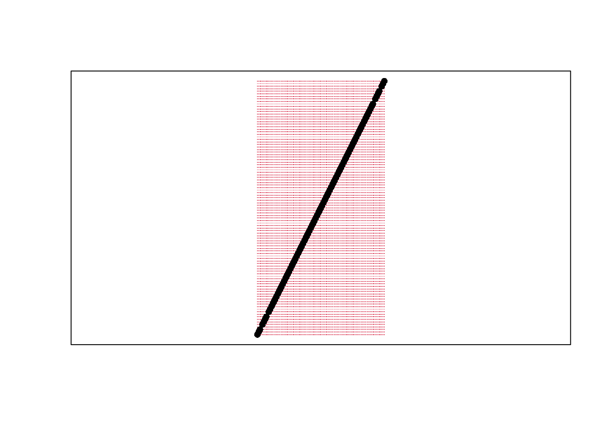

# (PART) Reproducible Research in R {-} 

You want your work to be reproducible, and we will cover some of the basics of how to do this in R. Note the distintion

* Replicable: someone collecting new data comes to the same results.
* Reproducibile: someone reusing your data comes to the same results.

Will we cover some of both below. Note that you can read more about the distinction in many places, including

* https://www.annualreviews.org/doi/10.1146/annurev-psych-020821-114157
* https://nceas.github.io/sasap-training/materials/reproducible_research_in_r_fairbanks/

# Why?
***

Before hopping into reproducible programming, lets think about why. My main sell to you is that it is in your own self-interest.  

## An example workflow

Taking First Steps ...

**Step 1: Some Ideas and Data**

$X_{1} \to Y_{1}$

* You copy some data into a spreadsheet
* do some calculations and tables the same spreadsheet
* some other analysis from here and there, using this software and that.

**Step 2: Persuing the lead for a week or two**

* you beef up the data you got
* add some other types of data 
* copy in a spreadsheet data, manually aggregate
* do some more calculations and tables, same as before


Then, a Little Way Down the Road ...

**1 month later, someone asks about another factor:** $X_{2}$

* You repeat **Step 2** with some data on $X_{2}$.
* The details from your "point and click" method are a bit fuzzy.

It takes a little time, but you successfully redo the analysis.


**4 months later, someone asks about another factor:** $X_{3}\to Y_{1}$

* You again repeat **Step 2** with some data on $X_{3}$.
* You're pretty sure
  * it's the latest version of the spreadsheet.
  * none of tables your tried messed up the order of the rows or columns.

It takes more time -- the data processing was not transparent.


**6 months later, you want to explore:** $X_{2} \to Y_{2}$.

* You found out Excel had some bugs in it's statistical calculations (see e.g., https://biostat.app.vumc.org/wiki/pub/Main/TheresaScott/StatsInExcel.TAScot.handout.pdf).


**2 years later, you want to replicate:** $\{ X_{1}, X_{2}, X_{3} \} \to Y_{1}$


* A rival has proposed an alternative theory. Their idea doesn't actually make any sense, but their visuals are better and statistics are more sophisticated.
* You don't even have that computer anymore.
* A collaborator who handled the data on $X_{2}$ has moved on.


## An alternative workflow

Suppose you decided to code what you did beginning with Step 2.

**It doesn't take much time to update or replicate your results.**

* Your computer runs for 2 hours and reproduces the figures and tables.
(You wrote your big calculations to use multiple cores and this saved 6 hours--each time.)
* You decided to add some more data, and it adds almost no time.
* You see the exact steps you took and found an error
(glad you found it before publication!)


**Your results are transparent and easier to build on.**

* You easily see that not much has changed with the new data.
* You try out a new plot you found in *The Visual Display of Quantitative Information*, by Edward Tufte.
  * It's not a standard plot, but google answers most of your questions.
  * Tutorials help avoid bad practices, such as plotting 2D data as a 3D object (see e.g., https://clauswilke.com/dataviz/no-3d.html).
* You try out an obscure statistical approach that's hot in your field.
  * it doesn't make the paper, but you have some confidence that candidate issue isn't a big problem


## R and R-Markdown

We will use R Markdown for reproducible research, which is a good choice:

* http://www.r-bloggers.com/the-reproducibility-crisis-in-science-and-prospects-for-r/
* http://fmwww.bc.edu/GStat/docs/pointclick.html
* https://github.com/qinwf/awesome-R\#reproducible-research
* A Guide to Reproducible Code in Ecology and Evolution
* https://biostat.app.vumc.org/wiki/pub/Main/TheresaScott/ReproducibleResearch.TAScott.handout.pdf

Note that R and R markdown are both languages: R studio interprets R code to produce statistics, R studio interprets R markdown code to produce pretty documents which contain both writing and statistics. (You should already be a bit familiar with R, but not necessarily R Markdown.) Altogether, your project will use

* R is our software
* Rstudio is our GUI
* R Markdown is our document

Both are good for teaching

* https://doi.org/10.1080/00220485.2019.1618765
* https://doi.org/10.1002/jae.657

Homework reports are the smallest and probably first document you create. We will create little homework reports using R markdown that are almost entirely self-contained (showing both code and output). To do this, you will need to install [Pandoc](http://pandoc.org) on your computer.

Install any required packages

```r
## Packages for Rmarkdown
install.packages("knitr")
install.packages("rmarkdown")
install.packages("bookdown")

## Other packages used in this primer
install.packages("plotly")
install.packages("sf")
```

To get started with R Markdown, you can first read and work through https://jadamso.github.io/Rbooks/small-scale-projects.html, and then recreate https://jadamso.github.io/Rbooks/small-scale-projects.html#a-homework-example yourself.


# Small Projects
***


## An R Code Chunk

Save the following code as `CodeChunk.R`

```r
sum_squared <- function(x1, x2) {
	y <- (x1 + x2)^2
	return(y)
} 

x <- c(0,1,3,10,6)
sum_squared(x[1], x[3])
sum_squared(x, x[2])
sum_squared(x, x[7])
sum_squared(x, x) 
```

**Clean the workspace** In the right panels, manually cleanup

* save the code as *MyFirstCode.R*
* clear the environment and history (use the broom in top right panel)
* clear unsaved plots (use the broom in bottom right panel)

    
**Replicate** using the grahical user interface (GUI) while in Rstudio either using a "point-click" or "console" method

*GUI: point-click*
click 'Source > Source as a local job' on top right

*GUI: console*
into the console on the bottom left, enter

```r
source('MyFirstCode.R')
```


**CLI Alternatives** *(Skippable)* There are also alternative ways to replicate via the command line interface (CLI) after opening a terminal
 
*CLI: console*

```bash
Rscript -e "source('CodeChunk.R')"
```

*CLI: direct*


```bash
Rscript CodeChunk.R
```

Note that you can open a new terminal in RStudio in the top bar by
clicking 'tools > terminal > new terminal'


## An R Markdown Document

### Copy/Paste Example
<!-- 
**Clean workspace**
Delete any temporary files which you do not want (or start a fresh session).

(for example *summarytable_example.txt* and *plot_example.pdf* and section *Data analysis examples: custom figures*)
-->


**Download** 

See [DataScientism.html](https://jadamso.github.io/Rbooks/Templates/DataScientism.html)

Download source file from [DataScientism.Rmd](https://jadamso.github.io/Rbooks/Templates/DataScientism.Rmd)


**Replicate**

You can now create the primers by opening the Rstudio GUI and then point-and-click.

Alternatively, you can use the console to run

```r
rmarkdown::render('DataScientism.Rmd')
```

### A Homework Example {.tabset}
Below is a template of what homework questions (and answers) look like. Create an .Rmd from scratch that produces a similar looking .html file.

**Question 1**
Simulate 100 random observations of the form $y=x\beta+\epsilon$ and plot the relationship. Plot and explore the data interactively via plotly, https://plotly.com/r/line-and-scatter/. Then play around with different styles, https://www.r-graph-gallery.com/13-scatter-plot.html, to best express your point.

*Answer*
I simulate $400$ observations for $\epsilon \sim 2\times N(0,1)$ and $\beta=4$, as seen in this single chunk. Notice an upward trend.

```r
n <- 100
E <- rnorm(n)
X <- seq(n)
Y <- 4*X + 2*E

library(plotly)
plot_ly( data=data.frame(X=X,Y=Y), x=~X, y=~Y)
```

```{=html}
<div class="plotly html-widget html-fill-item" id="htmlwidget-0a15c9600ee37db2686a" style="width:672px;height:480px;"></div>
<script type="application/json" data-for="htmlwidget-0a15c9600ee37db2686a">{"x":{"visdat":{"3986295db202":["function () ","plotlyVisDat"]},"cur_data":"3986295db202","attrs":{"3986295db202":{"x":{},"y":{},"alpha_stroke":1,"sizes":[10,100],"spans":[1,20]}},"layout":{"margin":{"b":40,"l":60,"t":25,"r":10},"xaxis":{"domain":[0,1],"automargin":true,"title":"X"},"yaxis":{"domain":[0,1],"automargin":true,"title":"Y"},"hovermode":"closest","showlegend":false},"source":"A","config":{"modeBarButtonsToAdd":["hoverclosest","hovercompare"],"showSendToCloud":false},"data":[{"x":[1,2,3,4,5,6,7,8,9,10,11,12,13,14,15,16,17,18,19,20,21,22,23,24,25,26,27,28,29,30,31,32,33,34,35,36,37,38,39,40,41,42,43,44,45,46,47,48,49,50,51,52,53,54,55,56,57,58,59,60,61,62,63,64,65,66,67,68,69,70,71,72,73,74,75,76,77,78,79,80,81,82,83,84,85,86,87,88,89,90,91,92,93,94,95,96,97,98,99,100],"y":[3.9620390763649307,6.5222593703703886,12.59419470775982,16.018675197726886,24.402518535480173,23.945788650348739,24.901975730535693,31.89377389731996,34.228359365943732,37.468075052897639,46.512206574220485,52.738987933689451,49.638627127432933,59.653401288896156,59.56000527535906,60.049477271437368,64.781729991738828,72.122096601408956,76.792071555615294,77.892102529178274,84.161508098644049,87.724086943429853,89.674153541488096,97.945633366696612,98.954667564352476,101.415309907741,107.81924863663781,112.86636985512024,117.4200840473451,120.34174383288111,122.27918345549521,129.32527980333228,132.46993468846128,134.23616570685391,140.70515230222247,139.86023136444228,149.16424907259324,153.94867230233001,156.49371655246878,159.60290680195638,166.17622507664575,169.717660949475,170.44077494476713,174.6707179011571,182.65782401608146,182.31607347884264,189.19854004248452,189.25742851257905,194.17314784391306,197.78313784339903,201.90551882525253,206.59509371761209,209.61640074464719,213.45456649903531,219.00553894466955,223.99581271832059,226.90601354245018,229.8990521724001,233.96921300523084,243.4160137033553,244.8738316616826,248.20535180169807,250.45033319759554,255.57496589636639,262.34654280091735,263.18719395527535,270.72677785863112,270.46136260105607,274.99173237218827,279.97759664968055,283.90056364135739,287.78103808564242,287.69138533270819,296.65412133163056,295.56569558582891,303.46168762257003,308.28807102152894,307.85332294772354,319.91504691472136,320.87933074800389,321.7594756430467,326.72361627978768,332.89323661548246,337.00919850760954,337.08706299596633,345.25848430476981,349.30430835091829,349.29194778688964,355.22114971346787,361.07213814962245,363.89100777217146,368.64091808480555,370.35765470236191,374.78670934061876,380.35642306176356,384.22777622810878,385.59626273066573,387.66860700459961,396.25642616724804,401.50356959322994],"type":"scatter","mode":"markers","marker":{"color":"rgba(31,119,180,1)","line":{"color":"rgba(31,119,180,1)"}},"error_y":{"color":"rgba(31,119,180,1)"},"error_x":{"color":"rgba(31,119,180,1)"},"line":{"color":"rgba(31,119,180,1)"},"xaxis":"x","yaxis":"y","frame":null}],"highlight":{"on":"plotly_click","persistent":false,"dynamic":false,"selectize":false,"opacityDim":0.20000000000000001,"selected":{"opacity":1},"debounce":0},"shinyEvents":["plotly_hover","plotly_click","plotly_selected","plotly_relayout","plotly_brushed","plotly_brushing","plotly_clickannotation","plotly_doubleclick","plotly_deselect","plotly_afterplot","plotly_sunburstclick"],"base_url":"https://plot.ly"},"evals":[],"jsHooks":[]}</script>
```

**Question 2**
Verify the definition of a line segment for points $A=(0,3), B=(1,5)$ using a $101 \times 101$ grid. Recall a line segment is all points $s$ that have $d(s, A) + d(s, B) = d(A, B)$.

*Answer* 

```r
library(sf)
s_1 <- c(0,3)
s_2 <- c(1,5)
Seg1 <- st_linestring( rbind(s_1,s_2) )
grid_pts <- expand.grid(
    x=seq(s_1[1],s_2[1], length.out=101),
    y=seq(s_1[2],s_2[2], length.out=101)
)

Seg1_dist <- dist( Seg1 )
grid_pts$dist <- apply(grid_pts, 1, function(s){
    dist( rbind(s,s_1) ) + dist( rbind(s,s_2) ) })
grid_pts$seg <- grid_pts$dist == Seg1_dist

D_point_seg <- st_multipoint( as.matrix(grid_pts[grid_pts$seg==T,1:2]) ) 
D_point_notseg <- st_multipoint( as.matrix(grid_pts[grid_pts$seg==F,1:2]) ) 

plot(Seg1)
points(D_point_notseg, col=2, pch='.')
points(D_point_seg)
box()
```



## Posters and Slides

Posters and presentations are another important type of scientific document. R markdown is good at creating both of these, and actually *very* good with some additional packages. So we will also use [flexdashboard](https://pkgs.rstudio.com/flexdashboard/) for posters and [beamer]( https://bookdown.org/yihui/rmarkdown/beamer-presentation.html) for presentions. Since beamer is a pdf output, you will need to install [TinyTex](https://yihui.org/tinytex/), which can be done within R

```r
install.packages('tinytex')
tinytex::install_tinytex()  # install TinyTeX
```

See

* [DataScientism_Slides.pdf](https://jadamso.github.io/Rbooks/Templates/DataScientism_Slides.pdf)
* [DataScientism_Poster.html](https://jadamso.github.io/Rbooks/Templates/DataScientism_Poster.html)

And download source files

* [DataScientism_Slides.Rmd](https://jadamso.github.io/Rbooks/Templates/DataScientism_Slides.Rmd)
* [DataScientism_Poster.Rmd](https://jadamso.github.io/Rbooks/Templates/DataScientism_Poster.Rmd)

Simply change the name to your own, and compile the document. If you have not installed *Latex*, then you must do that or specify a different output in order to compile `DataScientism_Slides`. For example, simply change `output: beamer_presentation` to `output: ioslides_presentation` on line 6.

## Getting help w/ R Markdown

For more guidance on how to create Rmarkdown documents, see

* https://github.com/rstudio/cheatsheets/blob/main/rmarkdown.pdf
* https://cran.r-project.org/web/packages/rmarkdown/vignettes/rmarkdown.html
* http://rmarkdown.rstudio.com
* https://bookdown.org/yihui/rmarkdown/
* https://bookdown.org/yihui/rmarkdown-cookbook/
* https://dept.stat.lsa.umich.edu/~jerrick/courses/stat701/notes/rmarkdown.html
* An Introduction to the Advanced Theory and Practice of Nonparametric Econometrics. Raccine 2019. Appendices B \& D.
* https://rmd4sci.njtierney.com/using-rmarkdown.html
* https://alexd106.github.io/intro2R/Rmarkdown_intro.html

If you are still lost, try one of the many online tutorials (such as these)

* https://www.rstudio.com/wp-content/uploads/2015/03/rmarkdown-reference.pdf
* https://github.com/adam-p/markdown-here/wiki/Markdown-Cheatsheet
* https://www.neonscience.org/resources/learning-hub/tutorials/rmd-code-intro
* https://m-clark.github.io/Introduction-to-Rmarkdown/
* https://www.stat.cmu.edu/~cshalizi/rmarkdown/
* http://math.wsu.edu/faculty/xchen/stat412/HwWriteUp.Rmd
* http://math.wsu.edu/faculty/xchen/stat412/HwWriteUp.html
* https://holtzy.github.io/Pimp-my-rmd/
* https://ntaback.github.io/UofT_STA130/Rmarkdownforclassreports.html
* https://crd150.github.io/hw_guidelines.html
* https://r4ds.had.co.nz/r-markdown.html
* http://www.stat.cmu.edu/~cshalizi/rmarkdown
* http://www.ssc.wisc.edu/sscc/pubs/RFR/RFR_RMarkdown.html
* http://kbroman.org/knitr_knutshell/pages/Rmarkdown.html


# Large Projects
***


As you scale up a project, then you will have to be more organized.

Medium and large sized projects should have their own `Project` folder on your computer with files, subdirectories with files, and subsubdirectories with files. It should look like this
```
Project
    └── README.txt
    └── /Code
        └── MAKEFILE.R
        └── RBLOCK_001_DataClean.R
        └── RBLOCK_002_Figures.R
        └── RBLOCK_003_ModelsTests.R
        └── RBLOCK_004_Robust.R
        └── /Logs
            └── MAKEFILE.Rout
    └── /Data
        └── /Raw
            └── Source1.csv
            └── Source2.shp
            └── Source3.txt
        └── /Clean
            └── AllDatasets.Rdata
            └── MainDataset1.Rds
            └── MainDataset2.csv
    └── /Output
        └── MainFigure.pdf
        └── AppendixFigure.pdf
        └── MainTable.tex
        └── AppendixTable.tex
    └── /Writing
        └── /TermPaper
            └── TermPaper.tex
            └── TermPaper.bib
            └── TermPaper.pdf
        └── /Slides
            └── Slides.Rmd
            └── Slides.html
            └── Slides.pdf
        └── /Poster
            └── Poster.Rmd
            └── Poster.html
            └── Poster.pdf
        └── /Proposal
            └── Proposal.Rmd
            └── Proposal.html
            └── Proposal.pdf
```


## MAKEFILE

There are two main meta-files

* `README.txt` overviews the project structure and what the codes are doing
* `MAKEFILE` explicitly describes and executes all codes. 


If all code is written with the same program, the makefile can be written in that programs code: `MAKEFILE.R`, which looks like

```r
### Project Structure
home_dir    <- path.expand("~/Desktop/Project/")

data_dir    <- paste0(home_dir, "Data/")
data_dir_r  <- paste0(data_dir, "Raw/")
data_dir_c  <- paste0(data_dir, "Clean/")

out_dir  <- paste0(hdir, "Output/")

code_dir  <- paste0(hdir, "Code/")


### Execute Codes
### libraries are loaded within each RBLOCK
set.wd( code_dir )
source( "RBLOCK_001_DataClean.R" )
source( "RBLOCK_002_Figures.R" )
source( "RBLOCK_003_ModelsTests.R" )
source( "RBLOCK_004_Robust.R" )
```

Notice there are a lot of documentation `### like this`, which is crucial for large projects. Also notice that anyone should be able to replicate the entire project by downloading a zip file and simply changing `home_dir`.


If some folders or files need to be created, you can do this within R

```r
# list the files and directories
list.files(recursive=TRUE, include.dirs=TRUE)
# create directory called 'Data'
dir.create('Data')
```

## Logging/Sinking

You can then execute the makefile within R and log the output. Either by 

1. Inserting some code that logs/sinks the output 

```r
### Project Structure
home_dir    <- path.expand("~/Desktop/Project/")

data_dir    <- paste0(home_dir, "Data/")
data_dir_r  <- paste0(data_dir, "Raw/")
data_dir_c  <- paste0(data_dir, "Clean/")

out_dir  <- paste0(hdir, "Output/")

code_dir  <- paste0(hdir, "Code/")

### Log Output
set.wd( code_dir )
sink("MAKEFILE.Rout", append=TRUE, split=TRUE)

### Execute Codes
source( "RBLOCK_001_DataClean.R" )
source( "RBLOCK_002_Figures.R" )
source( "RBLOCK_003_ModelsTests.R" )
source( "RBLOCK_004_Robust.R" )

### Stop Logging Output
sink()
```

2. Starting a session that logs/sinks you sourcing the makefile

```r
sink("MAKEFILE.Rout", append=TRUE, split=TRUE)
source("MAKEFILE.R")
sink()
```

3. Execute the makefile via the commandline 

```bash
R CMD BATCH MAKEFILE.R MAKEFILE.Rout
```


## Class Projects

Zip your project into a single file that is easy for *others* to identify: `Class_Project_LASTNAME_FIRSTNAME.zip`


Your code should be readable and error free. For code writing guides, see

* https://google.github.io/styleguide/Rguide.html
* https://style.tidyverse.org/
* https://dept.stat.lsa.umich.edu/~jerrick/courses/stat701/notes/codestyle.html
* http://adv-r.had.co.nz/Style.html
* https://www.burns-stat.com/pages/Tutor/R_inferno.pdf

For organization guidelines, see

* https://guides.lib.berkeley.edu/c.php?g=652220&p=4575532
* https://kbroman.org/steps2rr/pages/organize.html
* https://drivendata.github.io/cookiecutter-data-science/
* https://ecorepsci.github.io/reproducible-science/project-organization.html

For additional logging capabilities, see https://cran.r-project.org/web/packages/logr/

For very large projects, there are many more tools available at https://cran.r-project.org/web/views/ReproducibleResearch.html

For larger scale projects, use scripts 

* https://kbroman.org/steps2rr/pages/scripts.html
* https://kbroman.org/steps2rr/pages/automate.html


## Debugging 


In R, you use multiple functions on different types of data objects. Moreover, ``typically solve complex problems by decomposing them into simple functions, not simple objects.'' (H. Wickham)


We can use the following packages to help deal with various problems that may arise

```r
library(profvis)
library(bench)
library(parallel)
library(Rcpp)
library(compiler)
```

(Note that many of the examples are taken from https://adv-r.hadley.nz/).


Problems print to the console

```r
message("This is what a message looks like")
```

```
## This is what a message looks like
```

```r
warning("This is what a warning looks like")
```

```
## Warning: This is what a warning looks like
```

```r
stop("This is what an error looks like")
```

```
## Error in eval(expr, envir, enclos): This is what an error looks like
```


Nonproblems also print to the console

```r
cat('cat\n')
```

```
## cat
```

```r
print('print')
```

```
## [1] "print"
```


###  Tracing Errors

First, use garbage cleanup to "cleanup" memory leaks

```r
gc()
```

```
##           used (Mb) gc trigger  (Mb) max used  (Mb)
## Ncells 1212919 64.8    2365977 126.4  2365977 126.4
## Vcells 2298838 17.6    8388608  64.0  3571820  27.3
```
Then trace the error process. 

Example of error process

```r
## Let i() check if its argument is numeric
i <- function(i0) {
  if ( !is.numeric(i0) ) {
    stop("`d` must be numeric", call.=FALSE)
  }
  i0 + 10
}

## Let f() call g() call h() call i()
h <- function(i0) i(i0)
g <- function(h0) h(h0)
f <- function(g0) g(g0)

## Observe Error
f("a")
```

```
## Error: `d` must be numeric
```


Traceback debugging

```r
traceback()
```

```
## No traceback available
```


Simple print debugging

```r
f2 <- function(g0) {
  cat("f2 calls g2()\n")
  g2(g0)
}
g2 <- function(h0) {
  cat("g2 calls h2() \n")
  cat("b =", h0, "\n")
  h2(h0)
}
h2 <- function(i0) {
  cat("h2 call i() \n")
  i(i0)
}

f2("a")
```

```
## f2 calls g2()
## g2 calls h2() 
## b = a 
## h2 call i()
```

```
## Error: `d` must be numeric
```


Interactive approach

```r
g3 <- function(h0) {
  browser()
  h(h0)
}
f3 <- function(g0){
  g3(g0)
}
f3("a")
```

```
## Called from: g3(g0)
## debug at <text>#3: h(h0)
```

```
## Error: `d` must be numeric
```


###  Checking problems 

To inspect objects

```r
is.object(f)
is.object(c(1,1))

class(f)
class(c(1,1))

## Storage Mode Type 
typeof(f)
typeof(c(1,1))

storage.mode(f)
storage.mode(c(1,1))
```


To check for valid inputs/outputs

```r
x <- c(NA, NULL, NaN, Inf, 0)

cat("Vector to inspect: ")
x

cat("NA: ")
is.na(x)

cat("NULL: ")
is.null(x)

cat("NaN: ")
is.nan(x)

cat("Finite: ")
is.finite(x)

cat("Infinite: ")
is.infinite(x)
## Many others
```


To check for values

```r
all( x > -2 )
any( x > -2 )
## Check Matrix Rows
rowAny <- function(x) rowSums(x) > 0
rowAll <- function(x) rowSums(x) == ncol(x)
```


## Being Proactive

Supressing errors is possible but a bad idea

```r
try(1+2, silent=T)
```

```
## [1] 3
```

```r
try(warning('warning'), silent=T)
```

```
## Warning in doTryCatch(return(expr), name, parentenv, handler): warning
```

```r
try(error('error'), silent=T)
```

```r
try(1+2, silent=F)
```

```
## [1] 3
```

```r
try(warning('warning'), silent=F)
```

```
## Warning in doTryCatch(return(expr), name, parentenv, handler): warning
```

```r
try(error('error'), silent=F)
```

```
## Error in error("error") : could not find function "error"
```

Try to handle errors

```r
tryCatch(
  error = function(e) {
    # code to run when error is thrown
  },
  code_to_run_while_handlers_are_active
)
```

Simple Example

```r
tryCatch(
    expr = {
        message( log(-Inf) )
        message("Successfully executed the log(x) call.")
    },
    error = function(e){
        message('Caught an error!')
        print(e)
    },
    warning = function(w){
        message('Caught an warning!')
        print(w)
    },
    finally = {
        message('All done, quitting.')
    }
)
```

```
## Caught an warning!
```

```
## <simpleWarning in log(-Inf): NaNs produced>
```

```
## All done, quitting.
```


<!--## Ignore warnings/messages-->
<!--#suppressWarnings()-->
<!--#suppressMessages()-->

Safe Functions

```r
## Define
log_safe <- function(x){
    tryCatch(
        expr = {
            message( log(x) )
            message("Successfully executed the log(x) call.")
        },
        error = function(e){
            message('Caught an error!')
            print(e)
        },
        warning = function(w){
            message('Caught an warning!')
            print(w)
        },
        finally = {
            message('All done, quitting.')
        }
    )
}

## Test 
log_safe( 10)
```

```
## 2.30258509299405
```

```
## Successfully executed the log(x) call.
```

```
## All done, quitting.
```

```r
log_safe(-10)
```

```
## Caught an warning!
```

```
## <simpleWarning in log(x): NaNs produced>
```

```
## All done, quitting.
```

```r
log_safe(' ')
```

```
## Caught an error!
```

```
## <simpleError in log(x): non-numeric argument to mathematical function>
```

```
## All done, quitting.
```


## Optimizing 


In General: Clean code is often faster and less error prone


*Repetitive tasks can be optimized* You end up with code that

* is cleaner, faster, and more general
* can be easily parallelized


*Computers have big memories and are really good at math.*

* First try vectors
* then try `apply` functions


*Don't waste time on code that is not holding you back.*

* Your code may break, be slow, or incorrect.
* Look at what has already done.


###  Benchmarking

The simplest approach


```r
system.time({
    x <- runif(1e5)
    sqrt(x)
})
```

```
##    user  system elapsed 
##   0.006   0.000   0.005
```


For identifying bottlenecks

```r
## Generate Large Random Dataset
n <- 2e6
x <- runif(n)
y <- runif(n)
z <- runif(n)
XYZ <- cbind(x,y,z)

## Inspect 4 equivalent `row mean` calculations 
profvis::profvis({
    m <- rowSums(XYZ)/ncol(XYZ)
    m <- rowMeans(XYZ)
    m <- apply(XYZ, 1, mean)
    m <- rep(NA, n);  for(i in 1:n){ m[i] <- (x[i] + y[i] + z[i]) / 3 }
})
```

```{=html}
<div class="profvis html-widget html-fill-item" id="htmlwidget-a9599c19491befb4a256" style="width:100%;height:600px;"></div>
<script type="application/json" data-for="htmlwidget-a9599c19491befb4a256">{"x":{"message":{"prof":{"time":[1,2,3,4,5,6,6,7,8,9,10,11,12,12,12,13,13,14,14,15,15,16,16,17,17,18,18,19,19,20,20,21,21,22,22,23,23,24,24,25,25,26,26,27,27,28,28,28,29,29,30,30,31,32,33,34,34,35,36,36,37,37,38,38,39,40,41,41,42,42,43,44,45,45,46,46,47,47,48,49,50,51,52,53,53,54,54,54,55,55,56,56,56,57,57,57,58,58,59,60,61,62,63,63,64,64,65,65,66,66,67,67,68,69,70,71,71,71,72,72,73,73,74,75,76,77,77,78,78,79,80,80,80,81,82,82,83,83,84,84,85,85,85,86,86,87,88,89,89,90,90,91,91,91,92,92,93,94,95,95,96,97,98,99,99,99,100,100,101,101,102,103,103,104,104,105,105,106,107,107,108,109,110,110,110,111,111,112,113,113,113,114,115,115,116,117,117,118,118,119,120,121,121,121,122,122,123,124,124,125,125,126,126,127,127,128,128,129,129,130,130,131,131,132,132,133,134,134,135,135,136,136,137,137,138,138,139,139,140,140,140,141,141,142,142,143,144,144,144,145,145,146,146,147,147,148,148,149,150,150,151,151,151,152,152,153,153,153,154,154,154,155,155,156,157,157,158,158,159,159,160,160,161,161,162,162,163,163,164,165,165,165,166,166,166,167,167,167,168,168,168,169,169,170,170,171,171,172,172,173,173,174,174,174,175,175,176,177,177,177,178,178,179,179,180,180,181,182,183,183,184,184,185,185,186,187,187,188,189,190,190,191,191,192,192,192,193,193,193,194,195,196,196,197,197,198,198,199,200,201,201,202,202,202,203,203,204,204,205,205,206,206,207,207,208,208,209,210,211,211,211,212,212,213,213,214,214,215,215,216,216,217,218,218,219,219,220,220,220,221,221,222,223,224,225,225,226,226,227,227,228,228,229,229,230,231,232,232,233,233,233,234,234,235,235,236,237,238,238,239,239,240,241,241,242,242,243,244,244,245,246,246,246,247,247,248,248,249,249,250,251,252,252,253,253,254,254,255,256,256,257,258,258,258,259,259,259,260,260,261,261,262,262,263,263,264,264,264,265,266,266,267,267,268,269,270,270,271,271,271,272,273,273,274,274,275,275,276,277,277,278,278,279,279,280,281,282,282,283,283,284,284,285,286,286,286,287,287,287,288,288,289,289,290,290,291,292,293,293,294,294,295,296,296,296,297,298,299,299,300,301,301,302,302,303,303,303,304,304,304,305,305,306,306,307,307,308,308,308,309,309,309,310,310,310,311,311,311,312,312,312,313,313,313,314,314,314,315,315,315,316,316,316,317,317,317,318,318,318,319,319,319,320,320,320,321,321,322,322,323,323,324,325,326,326,327,328,328,329,329,330,330,331,332,332,333,333,334,335,335,336,337,337,338,338,339,339,340,340,341,341,342,343,343,344,344,345,345,346,346,347,348,348,348,349,349,350,350,351,351,352,352,353,353,354,354,355,355,355,356,356,356,357,358,358,359,359,360,360,361,362,363,363,364,364,365,365,365,366,366,367,367,368,368,369,369,369,370,370,371,371,372,372,372,373,373,374,374,375,375,376,376,377,378,378,378,379,380,380,381,381,382,382,383,383,384,384,385,385,386,386,387,388,389,389,389,390,390,391,391,392,393,393,394,394,395,396,397,397,398,398,398,399,400,400,400,400,401,401,401,401,402,402,403,404,404,405,405,406,406,407,407,408,409,409,410,410,411,411,411,412,412,413,413,414,414,415,416,417,418,418,419,419,419,420,420,420,421,421,422,422,423,423,424,424,425,425,426,426,427,428,428,429,429,429,430,430,431,431,432,432,433,433,434,434,435,435,436,436,437,437,438,438,439,439,440,440,441,441,442,442,443,443,444,444,445,445,445,446,446,446,447,447,448,449,449,450,451,451,452,452,453,453,454,454,454,455,455,456,456,456,457,457,457,458,458,459,459,460,460,461,461,462,462,463,463,464,464,465,466,466,467,467,467,468,468,469,469,470,470,471,471,472,472,473,473,474,475,475,475,476,476,477,477,477,477,478,478,478,478,479,479,480,481,482,482,483,484,484,485,485,486,486,487,487,487,488,488,488,489,490,490,491,491,492,492,492,493,493,494,494,495,495,496,496,497,497,498,498,499,500,501,502,502,503,503,504,504,505,506,506,506,507,507,507,508,508,509,510,510,511,511,512,512,513,513,514,514,515,515,516,516,516,516,517,517,517,517,518,519,519,520,520,521,521,522,522,523,523,524,524,524,525,526,526,526,526,527,527,527,527,528,529,530,530,530,531,531,532,532,533,534,534,535,535,536,536,537,537,538,538,539,539,540,541,541,542,543,544,545,545,545,546,546,546,547,547,547,548,548,548,549,549,549,550,550,550,551,551,551,552,552,552,553,553,553,554,554,554,555,555,555,556,556,556,557,557,557,558,558,558,559,559,559,560,560,560,561,561,561,562,562,562,563,563,563,564,564,564,565,565,565,566,566,566,567,567,567,568,568,568,569,569,569,570,570,570,571,571,571,572,572,572,573,573,573,574,574,574,575,575,575,576,576,576,577,577,577,578,579,579,580,580,581,581,582,582,583,584,585,586,586,586,587,587,588,588,589,589,590,590,591,592,592,593,593,594,595,596,597,597,598,599,599,600,600,601,601,601,602,602,602,603,603,604,605,606,606,607,608,608,609,610,610,611,612,612,613,614,614,615,615,616,616,617,617,618,618,619,620,620,621,621,622,622,623,623,623,624,624,624,625,625,626,626,626,627,628,628,629,630,630,631,631,631,632,632,632,633,634,634,634,635,635,635,636,636,637,638,639,639,640,640,641,641,642,642,642,643,643,644,644,645,645,646,646,647,647,648,648,649,649,650,651,651,652,652,653,653,654,655,656,656,657,657,657,658,658,659,660,660,661,661,661,662,662,663,664,665,666,666,667,667,668,668,668,669,669,670,670,671,671,671,672,672,673,673,674,675,675,676,676,676,677,677,678,679,680,680,681,682,682,683,683,684,684,685,685,685,686,686,687,687,688,688,689,689,689,690,690,691,691,692,692,693,693,694,694,695,695,696,697,698,699,700,700,701,701,702,702,703,704,704,705,705,706,706,707,708,708,708,709,709,709,710,711,711,712,712,713,714,715,715,716,717,718,718,719,719,720,720,721,721,722,722,723,723,724,725,726,726,727,727,728,728,728,729,729,729,730,730,731,731,732,732,733,733,734,734,735,735,736,736,737,738,738,739,740,741,741,742,742,743,744,744,745,745,746,746,747,747,748,748,748,749,749,749,749,750,750,750,750,751,751,752,752,753,753,754,754,755,755,756,757,757,757,758,759,760,761,762,763,764,764,765,766,766,767,767,768,768,769,769,769,770,770,770,771,771,771,772,772,772,773,773,774,775,775,776,777,778,779,779,780,780,780,781,781,782,782,783,783,784,785,785,786,787,787,788,788,789,789,790,790,791,792,792,793,793,794,795,795,796,797,798,798,799,799,800,800,801,802,802,803,803,804,805,805,806,806,807,807,808,808,808,809,809,809,810,811,812,812,813,813,814,814,815,815,815,816,817,818,818,819,819,819,820,820,821,821,822,822,823,823,824,824,825,825,826,827,827,828,828,828,829,829,829,830,830,831,832,832,833,833,834,834,835,835,836,836,837,838,839,839,840,840,841,842,843,843,844,844,845,846,847,847,847,848,848,848,849,849,850,850,851,852,852,852,853,853,854,855,856,856,857,857,858,858,859,859,860,861,861,862,863,863,864,865,865,865,866,866,866,867,867,868,869,869,870,870,870,871,871,871,872,872,873,874,874,875,875,876,876,877,877,877,878,878,879,879,880,880,881,881,882,882,882,883,883,884,884,884,885,885,885,886,886,887,887,888,888,889,890,891,891,891,892,893,893,894,894,895,896,897,898,899,899,900,901,902,902,903,903,904,904,905,906,906,907,907,908,909,909,910,911,911,912,912,913,913,914,915,916,916,917,918,918,919,919,920,920,920,921,921,921,922,922,923,924,925,925,926,927,927,928,928,929,929,930,930,931,931,932,932,933,933,934,934,935,935,936,937,937,937,938,938,939,939,940,940,940,941,942,942,943,943,944,944,945,945,946,946,947,947,948,949,949,950,950,951,951,951,952,952,953,953,953,954,954,954,955,956,956,956,957,957,957,958,958,959,959,960,960,961,961,962,963,963,964,964,965,965,966,967,968,968,969,970,970,971,971,972,972,973,973,974,974,974,975,975,975,976,977,977,978,978,978,979,980,980,981,982,983,984,985,986,986,987,987,987,988,988,989,989,990,990,991,991,991,992,992,992,993,993,993,994,994,994,995,995,995,996,996,996,997,997,997,998,998,998,999,999,999,1000,1000,1000,1001,1001,1001,1002,1002,1002,1003,1003,1003,1004,1004,1004,1005,1005,1005,1006,1006,1006,1007,1007,1007,1008,1008,1009,1010,1011,1011,1012,1012,1013,1013,1014,1014,1014,1015,1015,1016,1016,1016,1017,1017,1018,1018,1019,1019,1020,1021,1021,1022,1022,1023,1024,1024,1025,1025,1026,1027,1028,1028,1029,1029,1030,1030,1031,1031,1032,1032,1032,1033,1034,1034,1034,1035,1035,1036,1036,1036,1037,1037,1038,1039,1039,1040,1041,1041,1042,1042,1043,1044,1044,1045,1046,1046,1047,1048,1048,1049,1049,1050,1050,1050,1051,1051,1052,1052,1053,1054,1054,1055,1055,1056,1056,1057,1058,1058,1058,1059,1059,1059,1060,1060,1061,1062,1062,1063,1063,1064,1064,1065,1065,1066,1067,1067,1068,1068,1069,1070,1070,1071,1071,1072,1072,1072,1073,1073,1074,1074,1075,1075,1076,1076,1077,1077,1078,1078,1079,1079,1080,1081,1082,1083,1083,1084,1084,1085,1086,1086,1087,1087,1088,1089,1089,1090,1091,1091,1091,1092,1092,1092,1093,1093,1094,1095,1095,1096,1097,1098,1099,1099,1100,1100,1101,1102,1103,1103,1104,1104,1105,1106,1106,1107,1107,1107,1108,1108,1108,1109,1109,1109,1110,1110,1111,1111,1112,1112,1113,1114,1114,1115,1115,1116,1116,1116,1117,1117,1117,1118,1119,1119,1120,1121,1121,1122,1122,1123,1124,1124,1124,1124,1125,1125,1125,1125,1126,1127,1127,1128,1129,1129,1130,1130,1131,1131,1132,1132,1133,1134,1134,1135,1136,1136,1137,1137,1138,1139,1139,1139,1140,1140,1140,1141,1141,1141,1142,1142,1143,1143,1144,1145,1146,1146,1147,1147,1148,1148,1149,1149,1150,1151,1151,1152,1152,1153,1154,1154,1154,1155,1155,1155,1156,1156,1156,1157,1157,1158,1158,1159,1159,1159,1160,1160,1161,1162,1162,1163,1163,1164,1164,1165,1166,1167,1167,1167,1168,1169,1169,1170,1170,1170,1171,1171,1171,1172,1172,1172,1173,1173,1174,1175,1175,1176,1176,1176,1177,1177,1178,1179,1179,1180,1180,1181,1181,1182,1182,1183,1183,1184,1184,1185,1185,1186,1186,1187,1187,1188,1188,1189,1190,1191,1191,1192,1193,1193,1194,1194,1195,1195,1196,1196,1197,1198,1198,1199,1200,1201,1201,1202,1202,1203,1203,1204,1205,1205,1206,1206,1207,1208,1209,1210,1211,1211,1212,1212,1213,1214,1215,1216,1216,1216,1217,1217,1217,1218,1218,1219,1219,1220,1220,1221,1221,1222,1222,1223,1224,1225,1226,1227,1227,1227,1228,1229,1229,1230,1230,1230,1231,1231,1231,1232,1232,1233,1233,1234,1234,1235,1235,1236,1236,1237,1238,1238,1239,1239,1240,1240,1241,1241,1242,1242,1243,1243,1244,1244,1245,1245,1245,1246,1246,1246,1247,1248,1248,1249,1249,1250,1251,1251,1252,1253,1253,1254,1254,1255,1255,1256,1257,1258,1258,1259,1259,1260,1260,1261,1261,1262,1262,1263,1263,1264,1264,1265,1265,1266,1266,1267,1268,1268,1269,1269,1270,1271,1271,1272,1273,1273,1273,1274,1274,1274,1275,1275,1276,1276,1277,1278,1278,1279,1280,1281,1281,1282,1282,1283,1283,1284,1285,1285,1286,1287,1287,1287,1288,1288,1288,1289,1289,1290,1290,1291,1291,1292,1293,1293,1294,1295,1295,1296,1297,1297,1298,1299,1300,1301,1301,1301,1301,1302,1302,1302,1302,1303,1304,1304,1305,1306,1306,1307,1308,1308,1309,1310,1310,1311,1311,1312,1313,1314,1314,1315,1315,1315,1316,1316,1316,1317,1318,1318,1319,1319,1320,1321,1321,1322,1323,1324,1324,1325,1325,1326,1327,1327,1328,1328,1329,1329,1330,1330,1331,1331,1332,1332,1333,1333,1334,1334,1335,1335,1336,1336,1337,1337,1338,1338,1339,1339,1340,1340,1341,1342,1343,1344,1344,1345,1346,1346,1347,1347,1348,1349,1349,1350,1350,1351,1351,1352,1352,1352,1353,1353,1353,1354,1354,1354,1355,1355,1356,1356,1357,1357,1358,1359,1360,1360,1361,1361,1362,1362,1363,1363,1364,1365,1365,1366,1366,1367,1367,1368,1368,1369,1370,1370,1371,1371,1372,1373,1373,1374,1374,1375,1375,1376,1376,1377,1377,1378,1379,1379,1379,1380,1380,1380,1381,1382,1383,1383,1383,1384,1385,1386,1386,1387,1388,1388,1389,1389,1389,1390,1391,1391,1392,1392,1392,1393,1393,1393,1394,1394,1395,1396,1397,1398,1399,1399,1400,1400,1401,1401,1402,1403,1403,1404,1404,1405,1405,1406,1406,1407,1407,1408,1408,1409,1410,1410,1411,1411,1412,1412,1413,1413,1414,1414,1415,1415,1416,1416,1417,1417,1417,1418,1418,1418,1419,1419,1420,1421,1421,1422,1422,1422,1423,1423,1423,1424,1424,1425,1425,1426,1427,1427,1428,1429,1429,1430,1430,1430,1431,1431,1431,1432,1432,1433,1434,1434,1434,1435,1435,1436,1437,1437,1437,1438,1438,1439,1439,1440,1440,1441,1441,1442,1442,1442,1443,1443,1443,1444,1444,1445,1446,1447,1448,1449,1449,1449,1450,1450,1451,1451,1452,1453,1453,1454,1454,1454,1455,1455,1455,1456,1456,1457,1457,1458,1458,1459,1460,1460,1461,1461,1462,1462,1463,1464,1465,1465,1466,1466,1466,1467,1467,1467,1468,1468,1468,1469,1469,1470,1471,1471,1472,1472,1473,1473,1474,1474,1475,1475,1476,1477,1477,1478,1478,1479,1479,1480,1480,1481,1481,1482,1482,1483,1483,1484,1484,1485,1485,1485,1486,1487,1487,1488,1488,1489,1489,1490,1490,1490,1490,1491,1491,1491,1491,1492,1492,1493,1493,1494,1494,1495,1495,1496,1497,1497,1498,1498,1499,1499,1500,1500,1501,1502,1502,1503,1503,1504,1505,1505,1506,1506,1507,1507,1508,1508,1509,1510,1511,1511,1512,1513,1513,1514,1514,1515,1515,1516,1517,1517,1518,1518,1519,1519,1520,1521,1521,1522,1522,1523,1523,1524,1525,1525,1525,1526,1526,1526,1527,1527,1527,1528,1528,1528,1529,1529,1529,1530,1530,1530,1531,1531,1531,1532,1532,1532,1533,1533,1534,1534,1535,1536,1536,1537,1537,1537,1538,1538,1538,1539,1539,1540,1540,1541,1542,1542,1543,1543,1544,1544,1545,1545,1546,1546,1547,1547,1548,1548,1549,1549,1550,1550,1551,1551,1552,1552,1553,1553,1554,1554,1555,1555,1556,1556,1557,1557,1558,1558,1559,1559,1560,1560,1561,1561,1562,1562,1563,1563,1564,1564,1565,1565,1566,1566,1567,1567,1568,1568,1569,1569,1570,1570,1571,1571,1572,1572,1573,1573,1574,1574,1575,1575,1576,1576,1577,1577,1578,1578,1579,1579,1580,1580,1581,1581,1582,1582,1583,1583,1584,1584,1585,1585,1586,1586,1587,1587,1588,1588,1589,1589,1590,1590,1591,1591,1592,1592,1593,1593,1594,1594,1595,1595,1596,1596,1597,1597,1598,1598,1599,1599,1600,1600,1601,1601,1602,1602,1603,1603,1604,1604,1605,1605,1606,1606,1607,1607,1608,1608,1609,1609,1610,1610,1611,1611,1612,1612,1613,1613,1614,1614,1615,1616,1616,1617,1617,1618,1619,1620,1620,1621,1622,1622,1623,1623,1624,1624,1625,1626,1627,1628,1629,1629,1630,1631,1631,1632,1632,1633,1633,1634,1634,1635,1635,1636,1636,1637,1637,1638,1638,1638,1639,1640,1641,1641,1642,1643,1644,1645,1645,1646,1646,1647,1647,1648,1648,1648,1649,1649,1649,1650,1650,1650,1651,1651,1652,1652,1653,1653,1654,1654,1655,1656,1656,1657,1657,1658,1658,1659,1659,1660,1660,1661,1661,1661,1662,1663,1663,1664,1664,1665,1666,1666,1667,1667,1667,1668,1668,1669,1670,1671,1672,1672,1673,1673,1674,1674,1675,1676,1676,1677,1677,1678,1678,1679,1680,1680,1680,1681,1682,1682,1683,1684,1684,1685,1685,1686,1686,1687,1687,1688,1688,1689,1689,1690,1691,1691,1692,1692,1693,1693,1694,1695,1695,1696,1696,1697,1697,1698,1698,1699,1699,1699,1700,1701,1701,1702,1703,1703,1704,1704,1705,1705,1706,1707,1707,1708,1708,1709,1709,1710,1711,1711,1711,1712,1712,1713,1713,1714,1714,1715,1716,1716,1717,1717,1718,1718,1719,1720,1720,1720,1721,1721,1721,1722,1722,1722,1723,1723,1723,1724,1724,1725,1725,1726,1727,1727,1728,1728,1729,1729,1730,1730,1730,1731,1732,1732,1733,1733,1734,1734,1735,1736,1737,1737,1738,1738,1739,1739,1740,1740,1741,1741,1742,1742,1743,1744,1745,1745,1746,1746,1747,1748,1749,1750,1751,1752,1752,1753,1754,1755,1755,1756,1756,1757,1757,1758,1758,1758,1759,1760,1760,1760,1761,1761,1761,1762,1762,1762,1763,1763,1764,1765,1765,1766,1766,1767,1768,1768,1769,1770,1771,1771,1772,1773,1773,1774,1774,1775,1775,1776,1776,1777,1777,1778,1778,1779,1780,1780,1781,1781,1782,1782,1783,1783,1784,1784,1785,1786,1786,1787,1787,1788,1788,1788,1789,1789,1790,1791,1792,1793,1794,1794,1795,1795,1796,1796,1796,1797,1797,1797,1798,1798,1798,1799,1799,1799,1800,1800,1800,1801,1801,1801,1802,1802,1803,1803,1804,1805,1806,1806,1807,1807,1807,1808,1809,1809,1810,1810,1811,1812,1813,1814,1814,1815,1815,1816,1816,1817,1817,1817,1818,1819,1819,1820,1821,1821,1822,1822,1822,1823,1823,1824,1824,1825,1825,1826,1827,1827,1828,1828,1829,1829,1830,1830,1831,1831,1831,1832,1832,1833,1833,1834,1834,1835,1835,1836,1836,1837,1837,1838,1838,1839,1839,1840,1840,1841,1841,1842,1843,1843,1844,1844,1845,1846,1846,1847,1847,1847,1848,1848,1849,1849,1850,1850,1851,1851,1852,1853,1853,1854,1854,1855,1855,1856,1856,1857,1858,1858,1859,1859,1860,1860,1861,1862,1862,1863,1864,1864,1865,1866,1866,1867,1867,1868,1868,1869,1869,1870,1870,1871,1871,1872,1872,1873,1873,1874,1874,1875,1875,1876,1876,1877,1877,1878,1878,1879,1879,1880,1880,1881,1881,1882,1882,1883,1884,1884,1885,1885,1886,1886,1887,1887,1888,1889,1889,1890,1890,1891,1891,1891,1892,1893,1894,1895,1896,1897,1897,1897,1898,1898,1899,1899,1900,1900,1901,1901,1902,1902,1903,1903,1904,1904,1905,1905,1906,1906,1907,1907,1908,1908,1909,1910,1910,1911,1911,1912,1912,1913,1913,1914,1915,1915,1915,1915,1916,1916,1916,1916,1917,1917,1917,1917,1918,1918,1919,1919,1920,1920,1921,1922,1923,1923,1924,1924,1925,1926,1927,1927,1928,1929,1929,1929,1930,1930,1931,1932,1932,1933,1933,1934,1934,1935,1936,1936,1937,1937,1938,1938,1938,1939,1939,1940,1941,1942,1942,1943,1943,1944,1944,1945,1946,1946,1947,1947,1948,1948,1949,1949,1950,1950,1951,1951,1951,1952,1952,1953,1954,1954,1955,1955,1956,1956,1957,1958,1959,1959,1960,1960,1961,1962,1962,1963,1963,1964,1965,1965,1966,1966,1967,1967,1968,1968,1969,1969,1970,1970,1971,1971,1972,1972,1973,1973,1974,1974,1975,1975,1976,1976,1977,1977,1978,1978,1979,1979,1980,1980,1981,1982,1982,1983,1983,1984,1984,1985,1985,1986,1986,1987,1987,1988,1988,1989,1989,1990,1990,1991,1991,1992,1992,1993,1993,1994,1994,1995,1995,1996,1996,1997,1997,1998,1998,1999,1999,2000,2000,2001,2001,2002,2002,2003,2003,2004,2004,2005,2005,2006,2006,2007,2007,2008,2008,2009,2009,2010,2010,2010,2010,2010,2010,2010,2010,2011,2011,2011,2011,2011,2011,2011,2011,2011,2011,2011,2011,2011,2011,2011,2011,2011,2011,2011,2011,2011,2011,2011,2011,2011,2011,2011,2011,2011,2011,2011,2011,2011,2011,2011,2011,2011,2011,2011,2011,2011,2011,2012,2012,2012,2012,2012,2012,2012,2012,2013,2013,2013,2013,2013,2013,2013,2013,2014,2014,2014,2014,2014,2014,2014,2014,2015,2015,2015,2015,2015,2015,2015,2015,2016,2016,2016,2016,2016,2016,2016,2016,2017,2017,2017,2017,2017,2017,2017,2017,2018,2018,2018,2018,2018,2018,2018,2018,2019,2019,2019,2019,2019,2019,2019,2019,2020,2020,2020,2020,2020,2020,2020,2020,2021,2021,2021,2021,2021,2021,2021,2021,2022,2022,2022,2022,2022,2022,2022,2022,2023,2023,2023,2023,2023,2023,2023,2023,2024,2024,2024,2024,2024,2024,2024,2024,2025,2025,2025,2025,2025,2025,2025,2025,2026,2026,2026,2026,2026,2026,2026,2026,2027,2027,2027,2027,2027,2027,2027,2027,2028,2028,2028,2028,2028,2028,2028,2028,2029,2029,2029,2029,2029,2029,2029,2029,2030,2030,2030,2030,2030,2030,2030,2030,2031,2031,2031,2031,2031,2031,2031,2031,2032,2032,2032,2032,2032,2032,2032,2032,2033,2033,2033,2033,2033,2033,2033,2033,2034,2034,2034,2034,2034,2034,2034,2034,2035,2035,2035,2035,2035,2035,2035,2035,2036,2036,2036,2036,2036,2036,2036,2036,2037,2037,2037,2037,2037,2037,2037,2037,2038,2038,2038,2038,2038,2038,2038,2038,2039,2039,2039,2039,2039,2039,2039,2039,2040,2040,2040,2040,2040,2040,2040,2040],"depth":[1,1,1,1,1,2,1,1,1,1,1,1,3,2,1,2,1,2,1,2,1,2,1,2,1,2,1,2,1,2,1,2,1,2,1,2,1,2,1,2,1,2,1,2,1,3,2,1,2,1,2,1,1,1,1,2,1,1,2,1,2,1,2,1,1,1,2,1,2,1,1,1,2,1,2,1,2,1,1,1,1,1,1,2,1,3,2,1,2,1,3,2,1,3,2,1,2,1,1,1,1,1,2,1,2,1,2,1,2,1,2,1,1,1,1,3,2,1,2,1,2,1,1,1,1,2,1,2,1,1,3,2,1,1,2,1,2,1,2,1,3,2,1,2,1,1,1,2,1,2,1,3,2,1,2,1,1,1,2,1,1,1,1,3,2,1,2,1,2,1,1,2,1,2,1,2,1,1,2,1,1,1,3,2,1,2,1,1,3,2,1,1,2,1,1,2,1,2,1,1,1,3,2,1,2,1,1,2,1,2,1,2,1,2,1,2,1,2,1,2,1,2,1,2,1,1,2,1,2,1,2,1,2,1,2,1,2,1,3,2,1,2,1,2,1,1,3,2,1,2,1,2,1,2,1,2,1,1,2,1,3,2,1,2,1,3,2,1,3,2,1,2,1,1,2,1,2,1,2,1,2,1,2,1,2,1,2,1,1,3,2,1,3,2,1,3,2,1,3,2,1,2,1,2,1,2,1,2,1,2,1,3,2,1,2,1,1,3,2,1,2,1,2,1,2,1,1,1,2,1,2,1,2,1,1,2,1,1,1,2,1,2,1,3,2,1,3,2,1,1,1,2,1,2,1,2,1,1,1,2,1,3,2,1,2,1,2,1,2,1,2,1,2,1,2,1,1,1,3,2,1,2,1,2,1,2,1,2,1,2,1,1,2,1,2,1,3,2,1,2,1,1,1,1,2,1,2,1,2,1,2,1,2,1,1,1,2,1,3,2,1,2,1,2,1,1,1,2,1,2,1,1,2,1,2,1,1,2,1,1,3,2,1,2,1,2,1,2,1,1,1,2,1,2,1,2,1,1,2,1,1,3,2,1,3,2,1,2,1,2,1,2,1,2,1,3,2,1,1,2,1,2,1,1,1,2,1,3,2,1,1,2,1,2,1,2,1,1,2,1,2,1,2,1,1,1,2,1,2,1,2,1,1,3,2,1,3,2,1,2,1,2,1,2,1,1,1,2,1,2,1,1,3,2,1,1,1,2,1,1,2,1,2,1,3,2,1,3,2,1,2,1,2,1,2,1,3,2,1,3,2,1,3,2,1,3,2,1,3,2,1,3,2,1,3,2,1,3,2,1,3,2,1,3,2,1,3,2,1,3,2,1,3,2,1,2,1,2,1,2,1,1,1,2,1,1,2,1,2,1,2,1,1,2,1,2,1,1,2,1,1,2,1,2,1,2,1,2,1,2,1,1,2,1,2,1,2,1,2,1,1,3,2,1,2,1,2,1,2,1,2,1,2,1,2,1,3,2,1,3,2,1,1,2,1,2,1,2,1,1,1,2,1,2,1,3,2,1,2,1,2,1,2,1,3,2,1,2,1,2,1,3,2,1,2,1,2,1,2,1,2,1,1,3,2,1,1,2,1,2,1,2,1,2,1,2,1,2,1,2,1,1,1,3,2,1,2,1,2,1,1,2,1,2,1,1,1,2,1,3,2,1,1,4,3,2,1,4,3,2,1,2,1,1,2,1,2,1,2,1,2,1,1,2,1,2,1,3,2,1,2,1,2,1,2,1,1,1,1,2,1,3,2,1,3,2,1,2,1,2,1,2,1,2,1,2,1,2,1,1,2,1,3,2,1,2,1,2,1,2,1,2,1,2,1,2,1,2,1,2,1,2,1,2,1,2,1,2,1,2,1,2,1,2,1,3,2,1,3,2,1,2,1,1,2,1,1,2,1,2,1,2,1,3,2,1,2,1,3,2,1,3,2,1,2,1,2,1,2,1,2,1,2,1,2,1,2,1,1,2,1,3,2,1,2,1,2,1,2,1,2,1,2,1,2,1,1,3,2,1,2,1,4,3,2,1,4,3,2,1,2,1,1,1,2,1,1,2,1,2,1,2,1,3,2,1,3,2,1,1,2,1,2,1,3,2,1,2,1,2,1,2,1,2,1,2,1,2,1,1,1,1,2,1,2,1,2,1,1,3,2,1,3,2,1,2,1,1,2,1,2,1,2,1,2,1,2,1,2,1,4,3,2,1,4,3,2,1,1,2,1,2,1,2,1,2,1,2,1,3,2,1,1,4,3,2,1,4,3,2,1,1,1,3,2,1,2,1,2,1,1,2,1,2,1,2,1,2,1,2,1,2,1,1,2,1,1,1,1,3,2,1,3,2,1,3,2,1,3,2,1,3,2,1,3,2,1,3,2,1,3,2,1,3,2,1,3,2,1,3,2,1,3,2,1,3,2,1,3,2,1,3,2,1,3,2,1,3,2,1,3,2,1,3,2,1,3,2,1,3,2,1,3,2,1,3,2,1,3,2,1,3,2,1,3,2,1,3,2,1,3,2,1,3,2,1,3,2,1,3,2,1,3,2,1,3,2,1,1,2,1,2,1,2,1,2,1,1,1,1,3,2,1,2,1,2,1,2,1,2,1,1,2,1,2,1,1,1,1,2,1,1,2,1,2,1,3,2,1,3,2,1,2,1,1,1,2,1,1,2,1,1,2,1,1,2,1,1,2,1,2,1,2,1,2,1,2,1,1,2,1,2,1,2,1,3,2,1,3,2,1,2,1,3,2,1,1,2,1,1,2,1,3,2,1,3,2,1,1,3,2,1,3,2,1,2,1,1,1,2,1,2,1,2,1,3,2,1,2,1,2,1,2,1,2,1,2,1,2,1,2,1,1,2,1,2,1,2,1,1,1,2,1,3,2,1,2,1,1,2,1,3,2,1,2,1,1,1,1,2,1,2,1,3,2,1,2,1,2,1,3,2,1,2,1,2,1,1,2,1,3,2,1,2,1,1,1,2,1,1,2,1,2,1,2,1,3,2,1,2,1,2,1,2,1,3,2,1,2,1,2,1,2,1,2,1,2,1,2,1,1,1,1,1,2,1,2,1,2,1,1,2,1,2,1,2,1,1,3,2,1,3,2,1,1,2,1,2,1,1,1,2,1,1,1,2,1,2,1,2,1,2,1,2,1,2,1,1,1,2,1,2,1,3,2,1,3,2,1,2,1,2,1,2,1,2,1,2,1,2,1,2,1,1,2,1,1,1,2,1,2,1,1,2,1,2,1,2,1,2,1,3,2,1,4,3,2,1,4,3,2,1,2,1,2,1,2,1,2,1,2,1,1,3,2,1,1,1,1,1,1,1,2,1,1,2,1,2,1,2,1,3,2,1,3,2,1,3,2,1,3,2,1,2,1,1,2,1,1,1,1,2,1,3,2,1,2,1,2,1,2,1,1,2,1,1,2,1,2,1,2,1,2,1,1,2,1,2,1,1,2,1,1,1,2,1,2,1,2,1,1,2,1,2,1,1,2,1,2,1,2,1,3,2,1,3,2,1,1,1,2,1,2,1,2,1,3,2,1,1,1,2,1,3,2,1,2,1,2,1,2,1,2,1,2,1,2,1,1,2,1,3,2,1,3,2,1,2,1,1,2,1,2,1,2,1,2,1,2,1,1,1,2,1,2,1,1,1,2,1,2,1,1,1,3,2,1,3,2,1,2,1,2,1,1,3,2,1,2,1,1,1,2,1,2,1,2,1,2,1,1,2,1,1,2,1,1,3,2,1,3,2,1,2,1,1,2,1,3,2,1,3,2,1,2,1,1,2,1,2,1,2,1,3,2,1,2,1,2,1,2,1,2,1,3,2,1,2,1,3,2,1,3,2,1,2,1,2,1,2,1,1,1,3,2,1,1,2,1,2,1,1,1,1,1,2,1,1,1,2,1,2,1,2,1,1,2,1,2,1,1,2,1,1,2,1,2,1,2,1,1,1,2,1,1,2,1,2,1,3,2,1,3,2,1,2,1,1,1,2,1,1,2,1,2,1,2,1,2,1,2,1,2,1,2,1,2,1,2,1,1,3,2,1,2,1,2,1,3,2,1,1,2,1,2,1,2,1,2,1,2,1,2,1,1,2,1,2,1,3,2,1,2,1,3,2,1,3,2,1,1,3,2,1,3,2,1,2,1,2,1,2,1,2,1,1,2,1,2,1,2,1,1,1,2,1,1,2,1,2,1,2,1,2,1,3,2,1,3,2,1,1,2,1,3,2,1,1,2,1,1,1,1,1,1,2,1,3,2,1,2,1,2,1,2,1,3,2,1,3,2,1,3,2,1,3,2,1,3,2,1,3,2,1,3,2,1,3,2,1,3,2,1,3,2,1,3,2,1,3,2,1,3,2,1,3,2,1,3,2,1,3,2,1,3,2,1,2,1,1,1,2,1,2,1,2,1,3,2,1,2,1,3,2,1,2,1,2,1,2,1,1,2,1,2,1,1,2,1,2,1,1,1,2,1,2,1,2,1,2,1,3,2,1,1,3,2,1,2,1,3,2,1,2,1,1,2,1,1,2,1,2,1,1,2,1,1,2,1,1,2,1,2,1,3,2,1,2,1,2,1,1,2,1,2,1,2,1,1,3,2,1,3,2,1,2,1,1,2,1,2,1,2,1,2,1,1,2,1,2,1,1,2,1,2,1,3,2,1,2,1,2,1,2,1,2,1,2,1,2,1,2,1,1,1,1,2,1,2,1,1,2,1,2,1,1,2,1,1,3,2,1,3,2,1,2,1,1,2,1,1,1,1,2,1,2,1,1,1,2,1,2,1,1,2,1,3,2,1,3,2,1,3,2,1,2,1,2,1,2,1,1,2,1,2,1,3,2,1,3,2,1,1,2,1,1,2,1,2,1,1,4,3,2,1,4,3,2,1,1,2,1,1,2,1,2,1,2,1,2,1,1,2,1,1,2,1,2,1,1,3,2,1,3,2,1,3,2,1,2,1,2,1,1,1,2,1,2,1,2,1,2,1,1,2,1,2,1,1,3,2,1,3,2,1,3,2,1,2,1,2,1,3,2,1,2,1,1,2,1,2,1,2,1,1,1,3,2,1,1,2,1,3,2,1,3,2,1,3,2,1,2,1,1,2,1,3,2,1,2,1,1,2,1,2,1,2,1,2,1,2,1,2,1,2,1,2,1,2,1,2,1,1,1,2,1,1,2,1,2,1,2,1,2,1,1,2,1,1,1,2,1,2,1,2,1,1,2,1,2,1,1,1,1,1,2,1,2,1,1,1,1,3,2,1,3,2,1,2,1,2,1,2,1,2,1,2,1,1,1,1,1,3,2,1,1,2,1,3,2,1,3,2,1,2,1,2,1,2,1,2,1,2,1,1,2,1,2,1,2,1,2,1,2,1,2,1,2,1,3,2,1,3,2,1,1,2,1,2,1,1,2,1,1,2,1,2,1,2,1,1,1,2,1,2,1,2,1,2,1,2,1,2,1,2,1,2,1,2,1,1,2,1,2,1,1,2,1,1,3,2,1,3,2,1,2,1,2,1,1,2,1,1,1,2,1,2,1,2,1,1,2,1,1,3,2,1,3,2,1,2,1,2,1,2,1,1,2,1,1,2,1,1,2,1,1,1,1,4,3,2,1,4,3,2,1,1,2,1,1,2,1,1,2,1,1,2,1,2,1,1,1,2,1,3,2,1,3,2,1,1,2,1,2,1,1,2,1,1,1,2,1,2,1,1,2,1,2,1,2,1,2,1,2,1,2,1,2,1,2,1,2,1,2,1,2,1,2,1,2,1,2,1,1,1,1,2,1,1,2,1,2,1,1,2,1,2,1,2,1,3,2,1,3,2,1,3,2,1,2,1,2,1,2,1,1,1,2,1,2,1,2,1,2,1,1,2,1,2,1,2,1,2,1,1,2,1,2,1,1,2,1,2,1,2,1,2,1,2,1,1,3,2,1,3,2,1,1,1,3,2,1,1,1,2,1,1,2,1,3,2,1,1,2,1,3,2,1,3,2,1,2,1,1,1,1,1,2,1,2,1,2,1,1,2,1,2,1,2,1,2,1,2,1,2,1,1,2,1,2,1,2,1,2,1,2,1,2,1,2,1,3,2,1,3,2,1,2,1,1,2,1,3,2,1,3,2,1,2,1,2,1,1,2,1,1,2,1,3,2,1,3,2,1,2,1,1,3,2,1,2,1,1,3,2,1,2,1,2,1,2,1,2,1,3,2,1,3,2,1,2,1,1,1,1,1,3,2,1,2,1,2,1,1,2,1,3,2,1,3,2,1,2,1,2,1,2,1,1,2,1,2,1,2,1,1,1,2,1,3,2,1,3,2,1,3,2,1,2,1,1,2,1,2,1,2,1,2,1,2,1,1,2,1,2,1,2,1,2,1,2,1,2,1,2,1,2,1,3,2,1,1,2,1,2,1,2,1,4,3,2,1,4,3,2,1,2,1,2,1,2,1,2,1,1,2,1,2,1,2,1,2,1,1,2,1,2,1,1,2,1,2,1,2,1,2,1,1,1,2,1,1,2,1,2,1,2,1,1,2,1,2,1,2,1,1,2,1,2,1,2,1,1,3,2,1,3,2,1,3,2,1,3,2,1,3,2,1,3,2,1,3,2,1,3,2,1,2,1,2,1,1,2,1,3,2,1,3,2,1,2,1,2,1,1,2,1,2,1,2,1,2,1,2,1,2,1,2,1,2,1,2,1,2,1,2,1,2,1,2,1,2,1,2,1,2,1,2,1,2,1,2,1,2,1,2,1,2,1,2,1,2,1,2,1,2,1,2,1,2,1,2,1,2,1,2,1,2,1,2,1,2,1,2,1,2,1,2,1,2,1,2,1,2,1,2,1,2,1,2,1,2,1,2,1,2,1,2,1,2,1,2,1,2,1,2,1,2,1,2,1,2,1,2,1,2,1,2,1,2,1,2,1,2,1,2,1,2,1,2,1,2,1,2,1,2,1,2,1,2,1,2,1,2,1,2,1,2,1,2,1,1,2,1,2,1,1,1,2,1,1,2,1,2,1,2,1,1,1,1,1,2,1,1,2,1,2,1,2,1,2,1,2,1,2,1,2,1,3,2,1,1,1,2,1,1,1,1,2,1,2,1,2,1,3,2,1,3,2,1,3,2,1,2,1,2,1,2,1,2,1,1,2,1,2,1,2,1,2,1,2,1,3,2,1,1,2,1,2,1,1,2,1,3,2,1,2,1,1,1,1,2,1,2,1,2,1,1,2,1,2,1,2,1,1,3,2,1,1,2,1,1,2,1,2,1,2,1,2,1,2,1,2,1,1,2,1,2,1,2,1,1,2,1,2,1,2,1,2,1,3,2,1,1,2,1,1,2,1,2,1,2,1,1,2,1,2,1,2,1,1,3,2,1,2,1,2,1,2,1,1,2,1,2,1,2,1,1,3,2,1,3,2,1,3,2,1,3,2,1,2,1,2,1,1,2,1,2,1,2,1,3,2,1,1,2,1,2,1,2,1,1,1,2,1,2,1,2,1,2,1,2,1,2,1,1,1,2,1,2,1,1,1,1,1,1,2,1,1,1,2,1,2,1,2,1,3,2,1,1,3,2,1,3,2,1,3,2,1,2,1,1,2,1,2,1,1,2,1,1,1,2,1,1,2,1,2,1,2,1,2,1,2,1,2,1,1,2,1,2,1,2,1,2,1,2,1,1,2,1,2,1,3,2,1,2,1,1,1,1,1,2,1,2,1,3,2,1,3,2,1,3,2,1,3,2,1,3,2,1,3,2,1,2,1,2,1,1,1,2,1,3,2,1,1,2,1,2,1,1,1,1,2,1,2,1,2,1,3,2,1,1,2,1,1,2,1,3,2,1,2,1,2,1,2,1,1,2,1,2,1,2,1,2,1,3,2,1,2,1,2,1,2,1,2,1,2,1,2,1,2,1,2,1,2,1,2,1,1,2,1,2,1,1,2,1,3,2,1,2,1,2,1,2,1,2,1,1,2,1,2,1,2,1,2,1,1,2,1,2,1,2,1,1,2,1,1,2,1,1,2,1,2,1,2,1,2,1,2,1,2,1,2,1,2,1,2,1,2,1,2,1,2,1,2,1,2,1,2,1,2,1,2,1,1,2,1,2,1,2,1,2,1,1,2,1,2,1,3,2,1,1,1,1,1,1,3,2,1,2,1,2,1,2,1,2,1,2,1,2,1,2,1,2,1,2,1,2,1,2,1,1,2,1,2,1,2,1,2,1,1,4,3,2,1,4,3,2,1,4,3,2,1,2,1,2,1,2,1,1,1,2,1,2,1,1,1,2,1,1,3,2,1,2,1,1,2,1,2,1,2,1,1,2,1,2,1,3,2,1,2,1,1,1,2,1,2,1,2,1,1,2,1,2,1,2,1,2,1,2,1,3,2,1,2,1,1,2,1,2,1,2,1,1,1,2,1,2,1,1,2,1,2,1,1,2,1,2,1,2,1,2,1,2,1,2,1,2,1,2,1,2,1,2,1,2,1,2,1,2,1,2,1,2,1,2,1,1,2,1,2,1,2,1,2,1,2,1,2,1,2,1,2,1,2,1,2,1,2,1,2,1,2,1,2,1,2,1,2,1,2,1,2,1,2,1,2,1,2,1,2,1,2,1,2,1,2,1,2,1,2,1,2,1,8,7,6,5,4,3,2,1,42,41,40,39,38,37,36,35,34,33,32,31,30,29,28,27,26,25,24,23,22,21,20,19,18,17,16,15,14,13,12,11,10,9,8,7,6,5,4,3,2,1,8,7,6,5,4,3,2,1,8,7,6,5,4,3,2,1,8,7,6,5,4,3,2,1,8,7,6,5,4,3,2,1,8,7,6,5,4,3,2,1,8,7,6,5,4,3,2,1,8,7,6,5,4,3,2,1,8,7,6,5,4,3,2,1,8,7,6,5,4,3,2,1,8,7,6,5,4,3,2,1,8,7,6,5,4,3,2,1,8,7,6,5,4,3,2,1,8,7,6,5,4,3,2,1,8,7,6,5,4,3,2,1,8,7,6,5,4,3,2,1,8,7,6,5,4,3,2,1,8,7,6,5,4,3,2,1,8,7,6,5,4,3,2,1,8,7,6,5,4,3,2,1,8,7,6,5,4,3,2,1,8,7,6,5,4,3,2,1,8,7,6,5,4,3,2,1,8,7,6,5,4,3,2,1,8,7,6,5,4,3,2,1,8,7,6,5,4,3,2,1,8,7,6,5,4,3,2,1,8,7,6,5,4,3,2,1,8,7,6,5,4,3,2,1,8,7,6,5,4,3,2,1],"label":["rowSums","rowSums","rowSums","rowSums","rowSums","/","local","rowMeans","rowMeans","rowMeans","rowMeans","rowMeans","<GC>","aperm.default","apply","aperm.default","apply","aperm.default","apply","aperm.default","apply","aperm.default","apply","aperm.default","apply","<GC>","apply","<GC>","apply","<GC>","apply","<GC>","apply","<GC>","apply","<GC>","apply","<GC>","apply","<GC>","apply","<GC>","apply","<GC>","apply","isTRUE","mean.default","apply","mean.default","apply","FUN","apply","apply","apply","apply","FUN","apply","apply","FUN","apply","is.na","local","mean.default","apply","apply","apply","FUN","apply","<GC>","apply","apply","apply","FUN","apply","FUN","apply","FUN","apply","apply","apply","apply","apply","apply","FUN","apply","isTRUE","mean.default","apply","mean.default","apply","<GC>","FUN","apply","isTRUE","mean.default","apply","is.numeric","local","apply","apply","apply","apply","FUN","apply","mean.default","apply","FUN","apply","is.numeric","local","FUN","apply","apply","apply","apply","<GC>","FUN","apply","FUN","apply","mean.default","apply","apply","apply","apply","mean.default","apply","mean.default","apply","apply","isTRUE","mean.default","apply","apply","FUN","apply","FUN","apply","mean.default","apply","<GC>","FUN","apply","mean.default","apply","apply","apply","mean.default","apply","FUN","apply","isTRUE","mean.default","apply","FUN","apply","apply","apply","FUN","apply","apply","apply","apply","<GC>","mean.default","apply","FUN","apply","FUN","apply","apply","mean.default","apply","FUN","apply","FUN","apply","apply","FUN","apply","apply","apply","isTRUE","mean.default","apply","FUN","apply","apply","<GC>","mean.default","apply","apply","FUN","apply","apply","FUN","apply","FUN","apply","apply","apply","isTRUE","mean.default","apply","FUN","apply","apply","FUN","apply","FUN","apply","<GC>","apply","<GC>","apply","FUN","apply","FUN","apply","is.na","local","FUN","apply","FUN","apply","apply","FUN","apply","FUN","apply","FUN","apply","FUN","apply","FUN","apply","FUN","apply","<GC>","FUN","apply","length","local","mean.default","apply","apply","isTRUE","mean.default","apply","FUN","apply","mean.default","apply","length","local","mean.default","apply","apply","is.na","local","isTRUE","mean.default","apply","mean.default","apply","<GC>","FUN","apply","<GC>","FUN","apply","FUN","apply","apply","FUN","apply","FUN","apply","FUN","apply","FUN","apply","FUN","apply","mean.default","apply","mean.default","apply","apply","isTRUE","mean.default","apply","<GC>","mean.default","apply","<GC>","mean.default","apply","isTRUE","mean.default","apply","FUN","apply","FUN","apply","FUN","apply","mean.default","apply","FUN","apply","isTRUE","mean.default","apply","FUN","apply","apply","isTRUE","mean.default","apply","is.numeric","local","FUN","apply","<GC>","apply","apply","apply","FUN","apply","FUN","apply","FUN","apply","apply","mean.default","apply","apply","apply","FUN","apply","FUN","apply","<GC>","FUN","apply","<GC>","FUN","apply","apply","apply","mean.default","apply","FUN","apply","FUN","apply","apply","apply","FUN","apply","isTRUE","mean.default","apply","is.na","local","FUN","apply","<GC>","apply","FUN","apply","FUN","apply","FUN","apply","apply","apply","isTRUE","mean.default","apply","FUN","apply","FUN","apply","FUN","apply","FUN","apply","FUN","apply","apply","mean.default","apply","length","local","<GC>","length","local","FUN","apply","apply","apply","apply","mean.default","apply","FUN","apply","mean.default","apply","FUN","apply","FUN","apply","apply","apply","FUN","apply","<GC>","length","local","length","local","is.na","local","apply","apply","FUN","apply","FUN","apply","apply","mean.default","apply","length","local","apply","FUN","apply","apply","<GC>","FUN","apply","FUN","apply","mean.default","apply","FUN","apply","apply","apply","FUN","apply","FUN","apply","mean.default","apply","apply","FUN","apply","apply","<GC>","mean.default","apply","<GC>","mean.default","apply","mean.default","apply","FUN","apply","FUN","apply","FUN","apply","isTRUE","mean.default","apply","apply","FUN","apply","mean.default","apply","apply","apply","mean.default","apply","<GC>","mean.default","apply","apply","FUN","apply","FUN","apply","FUN","apply","apply","FUN","apply","mean.default","apply","mean.default","apply","apply","apply","FUN","apply","<GC>","apply","<GC>","apply","apply","isTRUE","mean.default","apply","isTRUE","mean.default","apply","FUN","apply","FUN","apply","mean.default","apply","apply","apply","mean.default","apply","length","local","apply","<GC>","FUN","apply","apply","apply","FUN","apply","apply","length","local","FUN","apply","isTRUE","mean.default","apply","isTRUE","mean.default","apply","FUN","apply","FUN","apply","is.numeric","local","<GC>","FUN","apply","<GC>","FUN","apply","<GC>","FUN","apply","<GC>","FUN","apply","<GC>","FUN","apply","<GC>","FUN","apply","<GC>","FUN","apply","<GC>","FUN","apply","<GC>","FUN","apply","<GC>","FUN","apply","<GC>","FUN","apply","<GC>","FUN","apply","<GC>","FUN","apply","mean.default","apply","mean.default","apply","is.na","local","apply","apply","FUN","apply","apply","FUN","apply","mean.default","apply","mean.default","apply","apply","<GC>","apply","FUN","apply","apply","is.numeric","local","apply","FUN","apply","FUN","apply","mean.default","apply","FUN","apply","mean.default","apply","apply","FUN","apply","<GC>","apply","FUN","apply","mean.default","apply","apply","isTRUE","mean.default","apply","FUN","apply","mean.default","apply","mean.default","apply","mean.default","apply","mean.default","apply","FUN","apply","<GC>","FUN","apply","<GC>","FUN","apply","apply","FUN","apply","FUN","apply","mean.default","apply","apply","apply","length","local","FUN","apply","isTRUE","mean.default","apply","FUN","apply","<GC>","apply","mean.default","apply","isTRUE","mean.default","apply","FUN","apply","mean.default","apply","isTRUE","mean.default","apply","mean.default","apply","mean.default","apply","FUN","apply","FUN","apply","apply","<GC>","FUN","apply","apply","FUN","apply","FUN","apply","FUN","apply","mean.default","apply","mean.default","apply","mean.default","apply","FUN","apply","apply","apply","<GC>","mean.default","apply","FUN","apply","mean.default","apply","apply","FUN","apply","is.numeric","local","apply","apply","FUN","apply","isTRUE","mean.default","apply","apply","<GC>","isTRUE","mean.default","apply","<GC>","isTRUE","mean.default","apply","mean.default","apply","apply","FUN","apply","mean.default","apply","mean.default","apply","FUN","apply","apply","mean.default","apply","is.na","local","<GC>","mean.default","apply","FUN","apply","FUN","apply","mean.default","apply","apply","apply","apply","is.numeric","local","isTRUE","mean.default","apply","isTRUE","mean.default","apply","is.numeric","local","FUN","apply","<GC>","apply","mean.default","apply","is.na","local","length","local","apply","FUN","apply","isTRUE","mean.default","apply","FUN","apply","FUN","apply","FUN","apply","mean.default","apply","<GC>","apply","<GC>","apply","FUN","apply","mean.default","apply","FUN","apply","mean.default","apply","FUN","apply","FUN","apply","length","local","FUN","apply","FUN","apply","<GC>","FUN","apply","<GC>","FUN","apply","mean.default","apply","apply","FUN","apply","apply","FUN","apply","length","local","is.na","local","isTRUE","mean.default","apply","FUN","apply","<GC>","FUN","apply","<GC>","FUN","apply","FUN","apply","mean.default","apply","FUN","apply","FUN","apply","is.na","local","FUN","apply","mean.default","apply","apply","mean.default","apply","<GC>","FUN","apply","length","local","FUN","apply","FUN","apply","is.numeric","local","FUN","apply","FUN","apply","apply","isTRUE","mean.default","apply","mean.default","apply","<GC>","isTRUE","mean.default","apply","<GC>","isTRUE","mean.default","apply","FUN","apply","apply","apply","FUN","apply","apply","FUN","apply","mean.default","apply","FUN","apply","<GC>","mean.default","apply","<GC>","mean.default","apply","apply","FUN","apply","FUN","apply","isTRUE","mean.default","apply","FUN","apply","FUN","apply","mean.default","apply","mean.default","apply","<GC>","apply","<GC>","apply","apply","apply","apply","FUN","apply","mean.default","apply","FUN","apply","apply","isTRUE","mean.default","apply","<GC>","FUN","apply","is.na","local","apply","mean.default","apply","FUN","apply","mean.default","apply","mean.default","apply","mean.default","apply","mean.default","apply","<GC>","isTRUE","mean.default","apply","<GC>","isTRUE","mean.default","apply","apply","FUN","apply","FUN","apply","FUN","apply","mean.default","apply","mean.default","apply","isTRUE","mean.default","apply","apply","<GC>","isTRUE","mean.default","apply","<GC>","isTRUE","mean.default","apply","apply","apply","isTRUE","mean.default","apply","FUN","apply","is.na","local","apply","mean.default","apply","<GC>","apply","<GC>","apply","FUN","apply","length","local","FUN","apply","apply","mean.default","apply","apply","apply","apply","<GC>","FUN","apply","<GC>","FUN","apply","<GC>","FUN","apply","<GC>","FUN","apply","<GC>","FUN","apply","<GC>","FUN","apply","<GC>","FUN","apply","<GC>","FUN","apply","<GC>","FUN","apply","<GC>","FUN","apply","<GC>","FUN","apply","<GC>","FUN","apply","<GC>","FUN","apply","<GC>","FUN","apply","<GC>","FUN","apply","<GC>","FUN","apply","<GC>","FUN","apply","<GC>","FUN","apply","<GC>","FUN","apply","<GC>","FUN","apply","<GC>","FUN","apply","<GC>","FUN","apply","<GC>","FUN","apply","<GC>","FUN","apply","<GC>","FUN","apply","<GC>","FUN","apply","<GC>","FUN","apply","<GC>","FUN","apply","<GC>","FUN","apply","<GC>","FUN","apply","<GC>","FUN","apply","<GC>","FUN","apply","<GC>","FUN","apply","apply","FUN","apply","mean.default","apply","FUN","apply","mean.default","apply","apply","apply","apply","isTRUE","mean.default","apply","FUN","apply","FUN","apply","FUN","apply","FUN","apply","apply","FUN","apply","FUN","apply","apply","apply","apply","mean.default","apply","apply","is.numeric","local","is.numeric","local","<GC>","FUN","apply","<GC>","FUN","apply","FUN","apply","apply","apply","mean.default","apply","apply","is.na","local","apply","FUN","apply","apply","length","local","apply","mean.default","apply","FUN","apply","mean.default","apply","FUN","apply","mean.default","apply","apply","mean.default","apply","FUN","apply","FUN","apply","<GC>","FUN","apply","<GC>","FUN","apply","FUN","apply","isTRUE","mean.default","apply","apply","mean.default","apply","apply","FUN","apply","isTRUE","mean.default","apply","isTRUE","mean.default","apply","apply","isTRUE","mean.default","apply","isTRUE","mean.default","apply","is.na","local","apply","apply","FUN","apply","mean.default","apply","FUN","apply","isTRUE","mean.default","apply","FUN","apply","FUN","apply","<GC>","apply","FUN","apply","is.na","local","FUN","apply","mean.default","apply","apply","FUN","apply","mean.default","apply","FUN","apply","apply","apply","FUN","apply","isTRUE","mean.default","apply","FUN","apply","apply","mean.default","apply","isTRUE","mean.default","apply","FUN","apply","apply","apply","apply","<GC>","apply","<GC>","apply","isTRUE","mean.default","apply","mean.default","apply","is.numeric","local","isTRUE","mean.default","apply","mean.default","apply","FUN","apply","apply","FUN","apply","isTRUE","mean.default","apply","FUN","apply","apply","apply","FUN","apply","apply","FUN","apply","mean.default","apply","FUN","apply","isTRUE","mean.default","apply","mean.default","apply","<GC>","apply","<GC>","apply","isTRUE","mean.default","apply","FUN","apply","FUN","apply","FUN","apply","FUN","apply","FUN","apply","FUN","apply","apply","apply","apply","apply","mean.default","apply","FUN","apply","FUN","apply","apply","FUN","apply","FUN","apply","mean.default","apply","apply","<GC>","mean.default","apply","<GC>","mean.default","apply","apply","FUN","apply","FUN","apply","apply","apply","FUN","apply","apply","apply","FUN","apply","FUN","apply","FUN","apply","FUN","apply","FUN","apply","FUN","apply","apply","apply","length","local","FUN","apply","<GC>","mean.default","apply","<GC>","mean.default","apply","FUN","apply","FUN","apply","FUN","apply","FUN","apply","FUN","apply","FUN","apply","FUN","apply","apply","is.na","local","apply","apply","mean.default","apply","FUN","apply","apply","is.na","local","FUN","apply","mean.default","apply","FUN","apply","isTRUE","mean.default","apply","<GC>","isTRUE","mean.default","apply","<GC>","isTRUE","mean.default","apply","FUN","apply","length","local","FUN","apply","FUN","apply","FUN","apply","apply","isTRUE","mean.default","apply","apply","apply","apply","apply","apply","apply","FUN","apply","apply","mean.default","apply","mean.default","apply","FUN","apply","<GC>","mean.default","apply","<GC>","mean.default","apply","isTRUE","mean.default","apply","isTRUE","mean.default","apply","mean.default","apply","apply","FUN","apply","apply","apply","apply","FUN","apply","isTRUE","mean.default","apply","mean.default","apply","FUN","apply","FUN","apply","apply","length","local","apply","mean.default","apply","mean.default","apply","<GC>","apply","<GC>","apply","apply","mean.default","apply","FUN","apply","apply","mean.default","apply","apply","apply","length","local","mean.default","apply","FUN","apply","apply","FUN","apply","FUN","apply","apply","FUN","apply","FUN","apply","FUN","apply","<GC>","length","local","<GC>","length","local","apply","apply","FUN","apply","mean.default","apply","is.numeric","local","isTRUE","mean.default","apply","apply","apply","FUN","apply","isTRUE","mean.default","apply","mean.default","apply","mean.default","apply","mean.default","apply","mean.default","apply","FUN","apply","is.numeric","local","apply","FUN","apply","<GC>","FUN","apply","<GC>","FUN","apply","FUN","apply","apply","FUN","apply","mean.default","apply","is.numeric","local","FUN","apply","FUN","apply","apply","apply","FUN","apply","mean.default","apply","apply","apply","length","local","FUN","apply","apply","apply","<GC>","FUN","apply","<GC>","FUN","apply","is.numeric","local","mean.default","apply","apply","isTRUE","mean.default","apply","FUN","apply","apply","apply","FUN","apply","length","local","mean.default","apply","FUN","apply","apply","FUN","apply","apply","length","local","apply","<GC>","mean.default","apply","<GC>","mean.default","apply","FUN","apply","apply","FUN","apply","isTRUE","mean.default","apply","isTRUE","mean.default","apply","FUN","apply","apply","FUN","apply","FUN","apply","mean.default","apply","isTRUE","mean.default","apply","FUN","apply","FUN","apply","FUN","apply","FUN","apply","isTRUE","mean.default","apply","mean.default","apply","<GC>","FUN","apply","<GC>","FUN","apply","FUN","apply","length","local","mean.default","apply","apply","apply","isTRUE","mean.default","apply","apply","mean.default","apply","FUN","apply","apply","apply","apply","apply","FUN","apply","apply","apply","<GC>","apply","<GC>","apply","FUN","apply","apply","is.numeric","local","is.na","local","apply","FUN","apply","apply","FUN","apply","mean.default","apply","mean.default","apply","apply","apply","FUN","apply","apply","FUN","apply","mean.default","apply","<GC>","length","local","<GC>","length","local","FUN","apply","apply","apply","FUN","apply","apply","FUN","apply","mean.default","apply","FUN","apply","FUN","apply","mean.default","apply","mean.default","apply","FUN","apply","FUN","apply","FUN","apply","apply","isTRUE","mean.default","apply","<GC>","apply","<GC>","apply","isTRUE","mean.default","apply","apply","is.numeric","local","mean.default","apply","FUN","apply","length","local","is.na","local","length","local","apply","mean.default","apply","FUN","apply","isTRUE","mean.default","apply","FUN","apply","isTRUE","mean.default","apply","isTRUE","mean.default","apply","apply","<GC>","FUN","apply","<GC>","FUN","apply","FUN","apply","mean.default","apply","FUN","apply","is.numeric","local","apply","mean.default","apply","length","local","FUN","apply","apply","apply","FUN","apply","apply","mean.default","apply","mean.default","apply","mean.default","apply","FUN","apply","<GC>","FUN","apply","<GC>","FUN","apply","apply","mean.default","apply","isTRUE","mean.default","apply","apply","FUN","apply","apply","apply","apply","apply","apply","mean.default","apply","isTRUE","mean.default","apply","length","local","mean.default","apply","length","local","<GC>","FUN","apply","<GC>","FUN","apply","<GC>","FUN","apply","<GC>","FUN","apply","<GC>","FUN","apply","<GC>","FUN","apply","<GC>","FUN","apply","<GC>","FUN","apply","<GC>","FUN","apply","<GC>","FUN","apply","<GC>","FUN","apply","<GC>","FUN","apply","<GC>","FUN","apply","<GC>","FUN","apply","<GC>","FUN","apply","<GC>","FUN","apply","<GC>","FUN","apply","mean.default","apply","apply","apply","mean.default","apply","FUN","apply","mean.default","apply","isTRUE","mean.default","apply","FUN","apply","isTRUE","mean.default","apply","FUN","apply","FUN","apply","mean.default","apply","apply","mean.default","apply","FUN","apply","apply","<GC>","apply","<GC>","apply","apply","apply","mean.default","apply","FUN","apply","length","local","length","local","isTRUE","mean.default","apply","apply","isTRUE","mean.default","apply","mean.default","apply","isTRUE","mean.default","apply","FUN","apply","apply","is.na","local","apply","<GC>","apply","<GC>","apply","apply","FUN","apply","apply","mean.default","apply","apply","FUN","apply","FUN","apply","isTRUE","mean.default","apply","FUN","apply","FUN","apply","apply","is.na","local","mean.default","apply","is.na","local","apply","<GC>","mean.default","apply","<GC>","mean.default","apply","FUN","apply","apply","FUN","apply","is.na","local","mean.default","apply","mean.default","apply","apply","FUN","apply","mean.default","apply","apply","is.numeric","local","mean.default","apply","isTRUE","mean.default","apply","FUN","apply","FUN","apply","<GC>","apply","<GC>","apply","length","local","mean.default","apply","FUN","apply","apply","apply","apply","mean.default","apply","FUN","apply","apply","mean.default","apply","is.na","local","apply","FUN","apply","apply","<GC>","length","local","<GC>","length","local","FUN","apply","apply","FUN","apply","apply","apply","apply","is.numeric","local","mean.default","apply","apply","apply","FUN","apply","FUN","apply","apply","FUN","apply","<GC>","length","local","<GC>","length","local","<GC>","length","local","FUN","apply","is.numeric","local","is.numeric","local","apply","length","local","is.numeric","local","isTRUE","mean.default","apply","isTRUE","mean.default","apply","apply","mean.default","apply","apply","FUN","apply","mean.default","apply","apply","<GC>","isTRUE","mean.default","apply","<GC>","isTRUE","mean.default","apply","apply","mean.default","apply","apply","FUN","apply","FUN","apply","mean.default","apply","mean.default","apply","apply","FUN","apply","apply","is.numeric","local","mean.default","apply","apply","<GC>","FUN","apply","<GC>","FUN","apply","<GC>","FUN","apply","FUN","apply","mean.default","apply","apply","apply","mean.default","apply","FUN","apply","FUN","apply","FUN","apply","apply","mean.default","apply","FUN","apply","apply","isTRUE","mean.default","apply","<GC>","FUN","apply","<GC>","FUN","apply","FUN","apply","FUN","apply","isTRUE","mean.default","apply","mean.default","apply","apply","FUN","apply","mean.default","apply","mean.default","apply","apply","apply","isTRUE","mean.default","apply","apply","FUN","apply","isTRUE","mean.default","apply","<GC>","mean.default","apply","<GC>","mean.default","apply","FUN","apply","apply","FUN","apply","isTRUE","mean.default","apply","FUN","apply","apply","FUN","apply","FUN","apply","FUN","apply","mean.default","apply","mean.default","apply","mean.default","apply","mean.default","apply","<GC>","apply","<GC>","apply","length","local","apply","apply","FUN","apply","apply","FUN","apply","FUN","apply","mean.default","apply","FUN","apply","apply","FUN","apply","apply","apply","<GC>","apply","<GC>","apply","mean.default","apply","apply","FUN","apply","FUN","apply","apply","apply","apply","apply","mean.default","apply","FUN","apply","apply","apply","apply","<GC>","FUN","apply","<GC>","FUN","apply","FUN","apply","mean.default","apply","FUN","apply","FUN","apply","FUN","apply","apply","apply","apply","apply","isTRUE","mean.default","apply","apply","FUN","apply","<GC>","FUN","apply","<GC>","FUN","apply","mean.default","apply","FUN","apply","length","local","FUN","apply","FUN","apply","apply","FUN","apply","FUN","apply","mean.default","apply","FUN","apply","is.numeric","local","FUN","apply","FUN","apply","<GC>","FUN","apply","<GC>","FUN","apply","apply","FUN","apply","FUN","apply","apply","is.na","local","apply","FUN","apply","mean.default","apply","mean.default","apply","apply","apply","FUN","apply","<GC>","apply","<GC>","apply","FUN","apply","mean.default","apply","FUN","apply","mean.default","apply","mean.default","apply","mean.default","apply","apply","is.na","local","mean.default","apply","apply","FUN","apply","apply","<GC>","FUN","apply","<GC>","FUN","apply","mean.default","apply","FUN","apply","apply","is.numeric","local","apply","apply","mean.default","apply","mean.default","apply","mean.default","apply","apply","mean.default","apply","apply","<GC>","mean.default","apply","<GC>","mean.default","apply","mean.default","apply","FUN","apply","mean.default","apply","apply","mean.default","apply","apply","FUN","apply","apply","mean.default","apply","apply","apply","apply","<GC>","isTRUE","mean.default","apply","<GC>","isTRUE","mean.default","apply","apply","mean.default","apply","apply","mean.default","apply","apply","mean.default","apply","apply","FUN","apply","mean.default","apply","apply","apply","FUN","apply","<GC>","FUN","apply","<GC>","FUN","apply","apply","is.numeric","local","FUN","apply","apply","FUN","apply","apply","apply","length","local","FUN","apply","apply","mean.default","apply","<GC>","apply","<GC>","apply","<GC>","apply","<GC>","apply","<GC>","apply","<GC>","apply","<GC>","apply","<GC>","apply","<GC>","apply","<GC>","apply","<GC>","apply","<GC>","apply","<GC>","apply","apply","apply","apply","mean.default","apply","apply","FUN","apply","FUN","apply","apply","FUN","apply","FUN","apply","FUN","apply","<GC>","FUN","apply","<GC>","FUN","apply","<GC>","FUN","apply","FUN","apply","FUN","apply","is.na","local","apply","apply","FUN","apply","length","local","FUN","apply","is.na","local","apply","FUN","apply","<GC>","apply","<GC>","apply","FUN","apply","apply","FUN","apply","mean.default","apply","apply","mean.default","apply","FUN","apply","mean.default","apply","FUN","apply","FUN","apply","apply","<GC>","FUN","apply","<GC>","FUN","apply","apply","apply","isTRUE","mean.default","apply","apply","apply","FUN","apply","apply","mean.default","apply","isTRUE","mean.default","apply","apply","mean.default","apply","<GC>","FUN","apply","<GC>","FUN","apply","FUN","apply","apply","apply","apply","apply","mean.default","apply","FUN","apply","FUN","apply","apply","mean.default","apply","<GC>","apply","<GC>","apply","<GC>","apply","mean.default","apply","FUN","apply","apply","FUN","apply","FUN","apply","FUN","apply","is.na","local","mean.default","apply","mean.default","apply","FUN","apply","<GC>","FUN","apply","<GC>","FUN","apply","mean.default","apply","apply","FUN","apply","isTRUE","mean.default","apply","isTRUE","mean.default","apply","FUN","apply","FUN","apply","apply","FUN","apply","apply","FUN","apply","<GC>","FUN","apply","<GC>","FUN","apply","mean.default","apply","apply","isTRUE","mean.default","apply","FUN","apply","apply","isTRUE","mean.default","apply","mean.default","apply","mean.default","apply","FUN","apply","mean.default","apply","<GC>","FUN","apply","<GC>","FUN","apply","mean.default","apply","apply","apply","apply","apply","isTRUE","mean.default","apply","mean.default","apply","FUN","apply","apply","FUN","apply","<GC>","mean.default","apply","<GC>","mean.default","apply","FUN","apply","FUN","apply","FUN","apply","apply","length","local","mean.default","apply","is.na","local","apply","apply","FUN","apply","<GC>","mean.default","apply","<GC>","mean.default","apply","<GC>","mean.default","apply","mean.default","apply","apply","length","local","is.na","local","FUN","apply","FUN","apply","mean.default","apply","apply","mean.default","apply","<GC>","apply","<GC>","apply","<GC>","apply","mean.default","apply","FUN","apply","FUN","apply","mean.default","apply","isTRUE","mean.default","apply","apply","FUN","apply","FUN","apply","mean.default","apply","<GC>","isTRUE","mean.default","apply","<GC>","isTRUE","mean.default","apply","FUN","apply","FUN","apply","length","local","mean.default","apply","apply","FUN","apply","FUN","apply","mean.default","apply","FUN","apply","apply","<GC>","apply","<GC>","apply","apply","FUN","apply","mean.default","apply","FUN","apply","mean.default","apply","apply","apply","mean.default","apply","apply","<GC>","apply","<GC>","apply","<GC>","apply","apply","mean.default","apply","FUN","apply","FUN","apply","apply","mean.default","apply","FUN","apply","mean.default","apply","apply","<GC>","FUN","apply","<GC>","FUN","apply","<GC>","FUN","apply","<GC>","FUN","apply","<GC>","FUN","apply","<GC>","FUN","apply","<GC>","FUN","apply","<GC>","FUN","apply","mean.default","apply","FUN","apply","apply","mean.default","apply","isTRUE","mean.default","apply","isTRUE","mean.default","apply","FUN","apply","is.numeric","local","apply","<GC>","apply","<GC>","apply","<GC>","apply","<GC>","apply","<GC>","apply","<GC>","apply","<GC>","apply","<GC>","apply","<GC>","apply","<GC>","apply","<GC>","apply","<GC>","apply","<GC>","apply","<GC>","apply","<GC>","apply","<GC>","apply","<GC>","apply","<GC>","apply","<GC>","apply","<GC>","apply","<GC>","apply","<GC>","apply","<GC>","apply","<GC>","apply","<GC>","apply","<GC>","apply","<GC>","apply","<GC>","apply","<GC>","apply","<GC>","apply","<GC>","apply","<GC>","apply","<GC>","apply","<GC>","apply","<GC>","apply","<GC>","apply","<GC>","apply","<GC>","apply","<GC>","apply","<GC>","apply","<GC>","apply","<GC>","apply","<GC>","apply","<GC>","apply","<GC>","apply","<GC>","apply","<GC>","apply","<GC>","apply","<GC>","apply","<GC>","apply","<GC>","apply","<GC>","apply","<GC>","apply","<GC>","apply","<GC>","apply","<GC>","apply","<GC>","apply","<GC>","apply","<GC>","apply","<GC>","apply","<GC>","apply","<GC>","apply","<GC>","apply","<GC>","apply","<GC>","apply","<GC>","apply","<GC>","apply","<GC>","apply","<GC>","apply","FUN","apply","FUN","apply","FUN","apply","FUN","apply","apply","is.na","local","FUN","apply","apply","apply","mean.default","apply","apply","FUN","apply","FUN","apply","FUN","apply","apply","apply","apply","apply","FUN","apply","apply","FUN","apply","mean.default","apply","FUN","apply","FUN","apply","FUN","apply","FUN","apply","mean.default","apply","isTRUE","mean.default","apply","apply","apply","mean.default","apply","apply","apply","apply","mean.default","apply","FUN","apply","mean.default","apply","<GC>","mean.default","apply","<GC>","mean.default","apply","<GC>","mean.default","apply","mean.default","apply","mean.default","apply","mean.default","apply","FUN","apply","apply","mean.default","apply","is.numeric","local","FUN","apply","FUN","apply","mean.default","apply","isTRUE","mean.default","apply","apply","mean.default","apply","mean.default","apply","apply","FUN","apply","isTRUE","mean.default","apply","mean.default","apply","apply","apply","apply","FUN","apply","mean.default","apply","is.na","local","apply","FUN","apply","FUN","apply","mean.default","apply","apply","isTRUE","mean.default","apply","apply","mean.default","apply","apply","<GC>","apply","<GC>","apply","<GC>","apply","<GC>","apply","mean.default","apply","FUN","apply","apply","FUN","apply","FUN","apply","mean.default","apply","apply","mean.default","apply","mean.default","apply","FUN","apply","mean.default","apply","isTRUE","mean.default","apply","apply","mean.default","apply","apply","length","local","mean.default","apply","mean.default","apply","apply","FUN","apply","is.numeric","local","FUN","apply","apply","isTRUE","mean.default","apply","FUN","apply","FUN","apply","mean.default","apply","apply","mean.default","apply","is.numeric","local","mean.default","apply","apply","<GC>","FUN","apply","<GC>","FUN","apply","<GC>","FUN","apply","<GC>","FUN","apply","FUN","apply","FUN","apply","apply","length","local","FUN","apply","FUN","apply","isTRUE","mean.default","apply","apply","length","local","mean.default","apply","FUN","apply","apply","apply","FUN","apply","FUN","apply","mean.default","apply","length","local","FUN","apply","FUN","apply","apply","apply","FUN","apply","FUN","apply","apply","apply","apply","apply","apply","is.numeric","local","apply","apply","FUN","apply","FUN","apply","mean.default","apply","isTRUE","mean.default","apply","apply","<GC>","mean.default","apply","<GC>","mean.default","apply","<GC>","mean.default","apply","mean.default","apply","apply","FUN","apply","is.na","local","apply","FUN","apply","apply","apply","FUN","apply","apply","mean.default","apply","FUN","apply","mean.default","apply","FUN","apply","FUN","apply","is.numeric","local","apply","FUN","apply","mean.default","apply","FUN","apply","FUN","apply","is.numeric","local","apply","FUN","apply","mean.default","apply","isTRUE","mean.default","apply","is.na","local","apply","apply","apply","apply","mean.default","apply","is.numeric","local","<GC>","FUN","apply","<GC>","FUN","apply","<GC>","FUN","apply","<GC>","FUN","apply","isTRUE","mean.default","apply","isTRUE","mean.default","apply","FUN","apply","mean.default","apply","apply","apply","FUN","apply","isTRUE","mean.default","apply","apply","FUN","apply","mean.default","apply","apply","apply","apply","mean.default","apply","FUN","apply","mean.default","apply","isTRUE","mean.default","apply","apply","FUN","apply","apply","mean.default","apply","isTRUE","mean.default","apply","mean.default","apply","FUN","apply","FUN","apply","apply","FUN","apply","FUN","apply","length","local","mean.default","apply","isTRUE","mean.default","apply","mean.default","apply","<GC>","apply","<GC>","apply","<GC>","apply","<GC>","apply","FUN","apply","FUN","apply","FUN","apply","mean.default","apply","FUN","apply","apply","FUN","apply","FUN","apply","apply","FUN","apply","isTRUE","mean.default","apply","FUN","apply","FUN","apply","FUN","apply","FUN","apply","apply","mean.default","apply","FUN","apply","FUN","apply","mean.default","apply","apply","FUN","apply","FUN","apply","FUN","apply","apply","mean.default","apply","apply","FUN","apply","apply","mean.default","apply","FUN","apply","mean.default","apply","<GC>","apply","<GC>","apply","<GC>","apply","<GC>","apply","<GC>","apply","<GC>","apply","<GC>","apply","<GC>","apply","<GC>","apply","<GC>","apply","<GC>","apply","<GC>","apply","<GC>","apply","<GC>","apply","apply","mean.default","apply","FUN","apply","FUN","apply","FUN","apply","apply","mean.default","apply","mean.default","apply","isTRUE","mean.default","apply","apply","apply","apply","apply","apply","isTRUE","mean.default","apply","FUN","apply","mean.default","apply","FUN","apply","FUN","apply","is.na","local","FUN","apply","mean.default","apply","FUN","apply","FUN","apply","FUN","apply","is.numeric","local","apply","FUN","apply","FUN","apply","is.numeric","local","FUN","apply","apply","<GC>","isTRUE","mean.default","apply","<GC>","isTRUE","mean.default","apply","<GC>","isTRUE","mean.default","apply","FUN","apply","FUN","apply","FUN","apply","apply","apply","FUN","apply","FUN","apply","apply","apply","length","local","apply","isTRUE","mean.default","apply","mean.default","apply","apply","is.numeric","local","FUN","apply","FUN","apply","apply","FUN","apply","FUN","apply","isTRUE","mean.default","apply","is.na","local","apply","apply","mean.default","apply","mean.default","apply","mean.default","apply","apply","mean.default","apply","mean.default","apply","<GC>","apply","<GC>","apply","<GC>","apply","isTRUE","mean.default","apply","FUN","apply","apply","mean.default","apply","FUN","apply","mean.default","apply","apply","apply","is.na","local","mean.default","apply","apply","FUN","apply","length","local","apply","lengths","apply","lengths","apply","lengths","apply","lengths","apply","lengths","apply","lengths","apply","lengths","apply","lengths","apply","lengths","apply","lengths","apply","lengths","apply","lengths","apply","lengths","apply","lengths","apply","lengths","apply","lengths","apply","apply","any","local","unlist","apply","unlist","apply","unlist","apply","unlist","apply","unlist","apply","unlist","apply","unlist","apply","unlist","apply","unlist","apply","unlist","apply","unlist","apply","unlist","apply","unlist","apply","unlist","apply","unlist","apply","unlist","apply","unlist","apply","unlist","apply","unlist","apply","unlist","apply","unlist","apply","unlist","apply","unlist","apply","unlist","apply","unlist","apply","unlist","apply","unlist","apply","m <- rep(NA, n);  for(i in 1:n){ m[i] <- (x[i] + y[i] + z[i]) / 3 }","doTryCatch","tryCatchOne","tryCatchList","tryCatchList","tryCatch","with_profvis_handlers","profvis::profvis","cmp","cmpSubsetDispatch","h","tryInline","cmpCall","cmp","cmpPrim2","h","tryInline","cmpCall","cmp","cmpPrim2","h","tryInline","cmpCall","cmp","h","tryInline","cmpCall","cmp","cmpPrim2","h","tryInline","cmpCall","cmp","cmpComplexAssign","h","tryInline","cmpCall","cmp","h","tryInline","cmpCall","cmp","cmpForBody","h","tryInline","cmpCall","cmp","genCode","compile","compiler:::tryCompile","m <- rep(NA, n);  for(i in 1:n){ m[i] <- (x[i] + y[i] + z[i]) / 3 }","doTryCatch","tryCatchOne","tryCatchList","tryCatchList","tryCatch","with_profvis_handlers","profvis::profvis","m <- rep(NA, n);  for(i in 1:n){ m[i] <- (x[i] + y[i] + z[i]) / 3 }","doTryCatch","tryCatchOne","tryCatchList","tryCatchList","tryCatch","with_profvis_handlers","profvis::profvis","m <- rep(NA, n);  for(i in 1:n){ m[i] <- (x[i] + y[i] + z[i]) / 3 }","doTryCatch","tryCatchOne","tryCatchList","tryCatchList","tryCatch","with_profvis_handlers","profvis::profvis","m <- rep(NA, n);  for(i in 1:n){ m[i] <- (x[i] + y[i] + z[i]) / 3 }","doTryCatch","tryCatchOne","tryCatchList","tryCatchList","tryCatch","with_profvis_handlers","profvis::profvis","m <- rep(NA, n);  for(i in 1:n){ m[i] <- (x[i] + y[i] + z[i]) / 3 }","doTryCatch","tryCatchOne","tryCatchList","tryCatchList","tryCatch","with_profvis_handlers","profvis::profvis","m <- rep(NA, n);  for(i in 1:n){ m[i] <- (x[i] + y[i] + z[i]) / 3 }","doTryCatch","tryCatchOne","tryCatchList","tryCatchList","tryCatch","with_profvis_handlers","profvis::profvis","m <- rep(NA, n);  for(i in 1:n){ m[i] <- (x[i] + y[i] + z[i]) / 3 }","doTryCatch","tryCatchOne","tryCatchList","tryCatchList","tryCatch","with_profvis_handlers","profvis::profvis","m <- rep(NA, n);  for(i in 1:n){ m[i] <- (x[i] + y[i] + z[i]) / 3 }","doTryCatch","tryCatchOne","tryCatchList","tryCatchList","tryCatch","with_profvis_handlers","profvis::profvis","m <- rep(NA, n);  for(i in 1:n){ m[i] <- (x[i] + y[i] + z[i]) / 3 }","doTryCatch","tryCatchOne","tryCatchList","tryCatchList","tryCatch","with_profvis_handlers","profvis::profvis","m <- rep(NA, n);  for(i in 1:n){ m[i] <- (x[i] + y[i] + z[i]) / 3 }","doTryCatch","tryCatchOne","tryCatchList","tryCatchList","tryCatch","with_profvis_handlers","profvis::profvis","m <- rep(NA, n);  for(i in 1:n){ m[i] <- (x[i] + y[i] + z[i]) / 3 }","doTryCatch","tryCatchOne","tryCatchList","tryCatchList","tryCatch","with_profvis_handlers","profvis::profvis","m <- rep(NA, n);  for(i in 1:n){ m[i] <- (x[i] + y[i] + z[i]) / 3 }","doTryCatch","tryCatchOne","tryCatchList","tryCatchList","tryCatch","with_profvis_handlers","profvis::profvis","m <- rep(NA, n);  for(i in 1:n){ m[i] <- (x[i] + y[i] + z[i]) / 3 }","doTryCatch","tryCatchOne","tryCatchList","tryCatchList","tryCatch","with_profvis_handlers","profvis::profvis","m <- rep(NA, n);  for(i in 1:n){ m[i] <- (x[i] + y[i] + z[i]) / 3 }","doTryCatch","tryCatchOne","tryCatchList","tryCatchList","tryCatch","with_profvis_handlers","profvis::profvis","m <- rep(NA, n);  for(i in 1:n){ m[i] <- (x[i] + y[i] + z[i]) / 3 }","doTryCatch","tryCatchOne","tryCatchList","tryCatchList","tryCatch","with_profvis_handlers","profvis::profvis","m <- rep(NA, n);  for(i in 1:n){ m[i] <- (x[i] + y[i] + z[i]) / 3 }","doTryCatch","tryCatchOne","tryCatchList","tryCatchList","tryCatch","with_profvis_handlers","profvis::profvis","m <- rep(NA, n);  for(i in 1:n){ m[i] <- (x[i] + y[i] + z[i]) / 3 }","doTryCatch","tryCatchOne","tryCatchList","tryCatchList","tryCatch","with_profvis_handlers","profvis::profvis","m <- rep(NA, n);  for(i in 1:n){ m[i] <- (x[i] + y[i] + z[i]) / 3 }","doTryCatch","tryCatchOne","tryCatchList","tryCatchList","tryCatch","with_profvis_handlers","profvis::profvis","m <- rep(NA, n);  for(i in 1:n){ m[i] <- (x[i] + y[i] + z[i]) / 3 }","doTryCatch","tryCatchOne","tryCatchList","tryCatchList","tryCatch","with_profvis_handlers","profvis::profvis","m <- rep(NA, n);  for(i in 1:n){ m[i] <- (x[i] + y[i] + z[i]) / 3 }","doTryCatch","tryCatchOne","tryCatchList","tryCatchList","tryCatch","with_profvis_handlers","profvis::profvis","m <- rep(NA, n);  for(i in 1:n){ m[i] <- (x[i] + y[i] + z[i]) / 3 }","doTryCatch","tryCatchOne","tryCatchList","tryCatchList","tryCatch","with_profvis_handlers","profvis::profvis","m <- rep(NA, n);  for(i in 1:n){ m[i] <- (x[i] + y[i] + z[i]) / 3 }","doTryCatch","tryCatchOne","tryCatchList","tryCatchList","tryCatch","with_profvis_handlers","profvis::profvis","m <- rep(NA, n);  for(i in 1:n){ m[i] <- (x[i] + y[i] + z[i]) / 3 }","doTryCatch","tryCatchOne","tryCatchList","tryCatchList","tryCatch","with_profvis_handlers","profvis::profvis","m <- rep(NA, n);  for(i in 1:n){ m[i] <- (x[i] + y[i] + z[i]) / 3 }","doTryCatch","tryCatchOne","tryCatchList","tryCatchList","tryCatch","with_profvis_handlers","profvis::profvis","m <- rep(NA, n);  for(i in 1:n){ m[i] <- (x[i] + y[i] + z[i]) / 3 }","doTryCatch","tryCatchOne","tryCatchList","tryCatchList","tryCatch","with_profvis_handlers","profvis::profvis","m <- rep(NA, n);  for(i in 1:n){ m[i] <- (x[i] + y[i] + z[i]) / 3 }","doTryCatch","tryCatchOne","tryCatchList","tryCatchList","tryCatch","with_profvis_handlers","profvis::profvis","m <- rep(NA, n);  for(i in 1:n){ m[i] <- (x[i] + y[i] + z[i]) / 3 }","doTryCatch","tryCatchOne","tryCatchList","tryCatchList","tryCatch","with_profvis_handlers","profvis::profvis","m <- rep(NA, n);  for(i in 1:n){ m[i] <- (x[i] + y[i] + z[i]) / 3 }","doTryCatch","tryCatchOne","tryCatchList","tryCatchList","tryCatch","with_profvis_handlers","profvis::profvis","m <- rep(NA, n);  for(i in 1:n){ m[i] <- (x[i] + y[i] + z[i]) / 3 }","doTryCatch","tryCatchOne","tryCatchList","tryCatchList","tryCatch","with_profvis_handlers","profvis::profvis"],"filenum":[1,1,1,1,1,1,null,1,1,1,1,1,null,null,1,null,1,null,1,null,1,null,1,null,1,null,1,null,1,null,1,null,1,null,1,null,1,null,1,null,1,null,1,null,1,null,null,1,null,1,null,1,1,1,1,null,1,1,null,1,null,null,null,1,1,1,null,1,null,1,1,1,null,1,null,1,null,1,1,1,1,1,1,null,1,null,null,1,null,1,null,null,1,null,null,1,null,null,1,1,1,1,null,1,null,1,null,1,null,null,null,1,1,1,1,null,null,1,null,1,null,1,1,1,1,null,1,null,1,1,null,null,1,1,null,1,null,1,null,1,null,null,1,null,1,1,1,null,1,null,1,null,null,1,null,1,1,1,null,1,1,1,1,null,null,1,null,1,null,1,1,null,1,null,1,null,1,1,null,1,1,1,null,null,1,null,1,1,null,null,1,1,null,1,1,null,1,null,1,1,1,null,null,1,null,1,1,null,1,null,1,null,1,null,1,null,1,null,1,null,null,null,1,null,1,1,null,1,null,1,null,1,null,1,null,1,null,1,null,null,1,null,null,null,1,1,null,null,1,null,1,null,1,null,null,null,1,1,null,null,null,null,1,null,1,null,null,1,null,null,1,null,1,1,null,1,null,1,null,1,null,1,null,1,null,1,null,1,1,null,null,1,null,null,1,null,null,1,null,null,1,null,1,null,1,null,1,null,1,null,1,null,null,1,null,1,1,null,null,1,null,null,null,1,null,1,1,1,null,1,null,1,null,1,1,null,1,1,1,null,1,null,1,null,null,1,null,null,1,1,1,null,1,null,1,null,1,1,1,null,1,null,null,1,null,null,null,1,null,1,null,1,null,1,null,1,1,1,null,null,1,null,1,null,1,null,1,null,1,null,1,1,null,1,null,null,null,null,null,null,1,1,1,1,null,1,null,1,null,1,null,1,null,1,1,1,null,1,null,null,null,null,null,null,null,1,1,null,1,null,1,1,null,1,null,null,1,null,1,1,null,null,1,null,1,null,1,null,1,1,1,null,1,null,1,null,1,1,null,1,1,null,null,1,null,null,1,null,1,null,1,null,1,null,1,null,null,1,1,null,1,null,1,1,1,null,1,null,null,1,1,null,1,null,1,null,1,1,null,1,null,1,null,1,1,1,null,1,null,1,null,1,1,null,null,1,null,null,1,null,1,null,1,null,1,1,1,null,1,null,null,1,null,null,1,1,1,null,1,1,null,null,null,1,null,null,1,null,null,1,null,1,null,1,null,null,null,null,1,null,null,1,null,null,1,null,null,1,null,null,1,null,null,1,null,null,1,null,null,1,null,null,1,null,null,1,null,null,1,null,null,1,null,null,1,null,1,null,1,null,null,1,1,null,1,1,null,1,null,1,null,1,1,null,1,null,1,1,null,null,1,null,1,null,1,null,1,null,1,null,1,1,null,1,null,1,null,1,null,1,1,null,null,1,null,1,null,1,null,1,null,1,null,1,null,1,null,null,1,null,null,1,1,null,1,null,1,null,1,1,1,null,null,null,1,null,null,1,null,1,null,1,null,1,null,null,1,null,1,null,1,null,null,1,null,1,null,1,null,1,null,1,1,null,null,1,1,null,1,null,1,null,1,null,1,null,1,null,1,null,1,1,1,null,null,1,null,1,null,1,1,null,1,null,null,1,1,null,1,null,null,1,1,null,null,null,1,null,null,null,1,null,1,1,null,1,null,1,null,1,null,1,1,null,1,null,null,null,null,1,null,1,null,1,null,1,1,1,1,null,null,null,null,1,null,null,1,null,null,null,1,null,1,null,1,null,null,null,null,1,null,1,null,null,1,null,1,null,1,null,1,null,1,null,1,null,1,null,1,null,1,null,1,null,1,null,1,null,1,null,null,null,1,null,1,null,null,1,null,null,1,null,1,1,null,1,1,null,1,null,null,null,null,null,null,1,null,1,null,null,1,null,null,1,null,1,null,1,null,1,null,1,null,null,null,1,null,1,1,null,1,null,null,1,null,null,null,1,null,1,null,null,null,1,null,1,1,null,null,1,null,1,null,null,null,1,null,null,null,1,null,1,1,1,null,1,1,null,1,null,1,null,1,null,null,1,null,null,1,1,null,1,null,1,null,null,1,null,1,null,1,null,1,null,1,null,1,null,1,1,1,1,null,1,null,1,null,1,1,null,null,1,null,null,1,null,null,1,null,1,null,1,null,1,null,1,null,1,null,1,null,null,null,1,null,null,null,1,1,null,1,null,1,null,1,null,1,null,1,null,null,1,1,null,null,null,1,null,null,null,1,1,1,null,null,1,null,1,null,null,1,null,1,null,1,null,1,null,1,null,null,null,1,1,null,1,1,1,1,null,null,1,null,null,1,null,null,1,null,null,1,null,null,1,null,null,1,null,null,1,null,null,1,null,null,1,null,null,1,null,null,1,null,null,1,null,null,1,null,null,1,null,null,1,null,null,1,null,null,1,null,null,1,null,null,1,null,null,1,null,null,1,null,null,1,null,null,1,null,null,1,null,null,1,null,null,1,null,null,1,null,null,1,null,null,1,null,null,1,null,null,1,null,null,1,null,null,1,1,null,1,null,1,null,1,null,1,1,1,1,null,null,1,null,1,null,1,null,1,null,1,1,null,1,null,1,1,1,1,null,1,1,null,null,null,null,null,null,1,null,null,1,null,1,1,1,null,1,1,null,null,1,null,1,1,null,null,1,null,1,null,1,null,1,null,1,null,1,1,null,1,null,1,null,1,null,null,1,null,null,1,null,1,null,null,1,1,null,1,1,null,1,null,null,1,null,null,1,1,null,null,1,null,null,1,null,null,1,1,null,1,null,1,null,1,null,null,1,null,1,null,1,null,1,null,1,null,null,null,1,null,1,1,null,1,null,1,null,1,1,1,null,1,null,null,1,null,1,1,null,1,null,null,1,null,1,1,1,1,null,1,null,1,null,null,1,null,1,null,null,null,null,1,null,1,null,1,1,null,1,null,null,1,null,1,1,1,null,1,1,null,1,null,1,null,1,null,null,1,null,1,null,1,null,1,null,null,1,null,1,null,1,null,1,null,1,null,1,null,1,1,1,1,1,null,1,null,1,null,1,1,null,1,null,1,null,1,1,null,null,1,null,null,1,1,null,1,null,1,1,1,null,1,1,1,null,1,null,1,null,1,null,1,null,1,null,1,1,1,null,null,null,1,null,null,1,null,null,1,null,1,null,1,null,1,null,1,null,1,null,1,null,1,1,null,null,1,1,null,1,null,1,1,null,null,null,1,null,1,null,1,null,null,1,null,null,null,1,null,null,null,1,null,1,null,null,null,1,null,1,null,1,1,null,null,1,1,1,1,1,1,1,null,1,1,null,1,null,1,null,1,null,null,1,null,null,1,null,null,1,null,null,1,null,1,1,null,1,1,1,1,null,1,null,null,1,null,1,null,1,null,1,1,null,null,1,null,1,null,1,null,1,null,1,1,null,1,null,1,1,null,1,1,1,null,null,null,1,null,1,1,null,1,null,1,1,null,1,null,1,null,1,null,null,null,null,null,null,1,1,null,1,null,1,null,null,null,null,1,1,1,null,1,null,null,1,null,1,null,1,null,1,null,1,null,1,null,null,1,null,1,null,null,1,null,null,1,null,1,1,null,1,null,1,null,null,null,1,null,1,1,1,null,1,null,1,1,1,null,null,null,1,1,1,null,null,1,null,null,1,null,null,null,1,1,null,null,1,null,1,1,1,null,1,null,null,null,1,null,1,1,null,1,1,null,null,1,null,null,1,null,null,1,null,1,1,null,1,null,null,1,null,null,1,null,1,1,null,1,null,1,null,1,null,null,1,null,1,null,1,null,1,null,1,null,null,1,null,1,null,null,1,null,null,1,null,1,null,null,null,1,1,1,null,null,1,1,null,1,null,1,1,1,1,1,null,1,1,1,null,1,null,1,null,1,1,null,null,null,null,1,null,1,1,null,1,null,1,null,1,1,1,null,1,1,null,1,null,1,null,null,null,null,null,null,null,1,1,1,null,1,1,null,1,null,1,null,1,null,1,null,1,null,1,null,1,null,1,null,1,1,null,null,1,null,1,null,1,null,null,1,1,null,null,null,1,null,1,null,null,null,null,null,null,1,null,1,null,1,null,null,1,null,1,null,null,1,null,null,1,1,null,null,1,null,null,1,null,1,null,1,null,1,null,null,1,null,1,null,null,null,1,1,1,null,1,1,null,1,null,1,null,1,null,1,null,null,1,null,null,1,1,null,1,null,null,1,1,null,1,1,1,1,1,1,null,1,null,null,1,null,null,null,1,null,null,null,null,1,null,null,1,null,null,1,null,null,1,null,null,1,null,null,1,null,null,1,null,null,1,null,null,1,null,null,1,null,null,1,null,null,1,null,null,1,null,null,1,null,null,1,null,null,1,null,null,1,null,1,1,1,null,1,null,1,null,1,null,null,1,null,1,null,null,1,null,1,null,1,null,1,1,null,1,null,1,1,null,1,null,1,1,1,null,1,null,1,null,null,null,null,null,null,1,1,null,null,1,null,1,null,null,1,null,1,1,null,null,1,null,1,null,1,1,null,1,1,null,1,1,null,1,null,1,null,null,1,null,1,null,1,1,null,null,null,1,null,null,1,null,null,1,null,null,1,null,1,1,null,1,null,null,null,1,null,1,1,null,1,null,1,1,null,null,null,1,null,null,1,null,1,null,1,null,1,null,1,null,null,null,1,null,1,1,1,1,null,1,null,1,1,null,1,null,null,1,null,1,1,null,null,null,null,null,null,null,1,1,null,1,1,1,1,null,null,null,1,1,1,null,1,null,1,1,null,1,null,null,null,null,null,null,null,null,null,null,1,null,null,null,null,1,null,null,null,null,null,null,1,null,null,1,1,null,1,1,null,1,null,1,1,null,null,null,1,null,null,null,1,1,null,1,1,null,1,null,1,null,1,null,1,1,null,1,1,null,null,null,1,1,null,null,1,null,null,1,null,null,1,null,1,null,1,1,1,null,1,null,1,null,1,null,1,1,null,1,null,1,1,null,null,1,null,null,1,null,null,1,null,1,null,1,null,null,1,null,1,1,null,1,null,1,null,1,1,1,null,null,1,1,null,1,null,null,1,null,null,1,null,null,1,null,1,1,null,1,null,null,1,null,1,1,null,1,null,1,null,1,null,1,null,1,null,1,null,1,null,1,null,1,null,null,1,1,null,1,1,null,1,null,1,null,1,null,1,1,null,1,1,1,null,1,null,1,null,1,1,null,1,null,1,1,1,1,1,null,1,null,1,1,1,1,null,null,1,null,null,1,null,1,null,1,null,1,null,1,null,1,1,1,1,1,null,null,1,1,null,1,null,null,1,null,null,1,null,1,null,1,null,null,null,1,null,1,1,null,1,null,1,null,1,null,1,null,null,null,1,null,1,null,null,1,null,null,1,1,null,1,null,1,1,null,null,1,null,1,null,1,null,1,1,1,null,1,null,1,null,1,null,1,null,1,null,1,null,1,null,1,null,1,1,null,null,null,1,1,null,1,1,null,null,1,null,null,1,null,1,null,1,1,null,null,1,1,null,1,null,1,null,1,1,null,1,1,null,null,1,null,null,1,null,1,null,1,null,1,1,null,1,1,null,1,1,null,1,1,1,1,null,null,null,1,null,null,null,1,1,null,1,1,null,1,1,null,1,1,null,1,null,1,1,1,null,1,null,null,1,null,null,1,1,null,null,null,1,1,null,1,1,1,null,null,null,1,1,null,1,null,1,null,1,null,1,null,1,null,1,null,1,null,1,null,1,null,1,null,1,null,1,null,1,null,1,1,1,1,null,1,1,null,1,null,1,1,null,1,null,1,null,1,null,null,1,null,null,1,null,null,1,null,1,null,1,null,null,1,1,null,1,null,null,null,1,null,null,1,null,1,null,1,null,1,null,1,1,null,1,null,1,1,null,1,null,1,null,1,null,1,null,1,1,null,null,1,null,null,1,1,1,null,null,1,1,1,null,1,1,null,1,null,null,1,1,null,1,null,null,1,null,null,1,null,1,1,1,1,1,null,1,null,1,null,1,1,null,1,null,1,null,1,null,1,null,1,null,1,1,null,1,null,1,null,1,null,null,null,1,null,1,null,1,null,null,1,null,null,1,null,1,1,null,1,null,null,1,null,null,1,null,1,null,1,1,null,1,1,null,1,null,null,1,null,null,1,null,1,1,null,null,1,null,1,1,null,null,1,null,1,null,1,null,1,null,1,null,null,1,null,null,1,null,1,1,1,1,1,null,null,1,null,1,null,1,1,null,1,null,null,1,null,null,1,null,1,null,1,null,1,1,null,null,null,1,null,null,1,1,null,1,null,null,1,null,null,1,null,null,1,null,1,1,null,null,null,null,null,1,null,1,null,1,1,null,1,null,1,null,1,null,1,null,1,null,1,null,1,null,1,null,null,1,1,null,1,null,1,null,1,null,null,null,1,null,null,null,1,null,1,null,1,null,null,null,1,1,null,1,null,1,null,1,null,1,1,null,1,null,1,1,null,1,null,1,null,1,null,1,1,1,null,1,1,null,1,null,1,null,1,1,null,1,null,1,null,1,1,null,1,null,1,null,1,1,null,null,1,null,null,1,null,null,1,null,null,1,null,null,1,null,null,1,null,null,1,null,null,1,null,1,null,1,1,null,1,null,null,1,null,null,1,null,1,null,null,1,null,1,null,1,null,1,null,1,null,1,null,1,null,1,null,1,null,1,null,1,null,1,null,1,null,1,null,1,null,1,null,1,null,1,null,1,null,1,null,1,null,1,null,1,null,1,null,1,null,1,null,1,null,1,null,1,null,1,null,1,null,1,null,1,null,1,null,1,null,1,null,1,null,1,null,1,null,1,null,1,null,1,null,1,null,1,null,1,null,1,null,1,null,1,null,1,null,1,null,1,null,1,null,1,null,1,null,1,null,1,null,1,null,1,null,1,null,1,null,1,null,1,null,1,null,1,null,1,null,1,null,1,null,1,null,1,null,1,null,1,null,1,null,1,null,1,1,null,null,null,1,1,1,null,1,1,null,1,null,1,null,1,1,1,1,1,null,1,1,null,1,null,1,null,1,null,1,null,1,null,1,null,1,null,null,1,1,1,null,1,1,1,1,null,1,null,1,null,1,null,null,1,null,null,1,null,null,1,null,1,null,1,null,1,null,1,1,null,1,null,null,null,1,null,1,null,1,null,null,1,1,null,1,null,1,1,null,1,null,null,1,null,1,1,1,1,null,1,null,1,null,null,1,null,1,null,1,null,1,1,null,null,1,1,null,1,1,null,1,null,1,null,1,null,1,null,1,null,1,1,null,1,null,1,null,1,1,null,1,null,1,null,1,null,1,null,null,1,1,null,1,1,null,null,null,1,null,1,1,null,1,null,null,null,1,1,null,null,1,null,1,null,1,null,1,1,null,1,null,null,null,1,1,null,null,1,null,null,1,null,null,1,null,null,1,null,1,null,1,1,null,null,null,1,null,1,null,null,1,1,null,null,null,1,null,1,1,1,null,1,null,1,null,1,null,null,null,1,null,1,1,1,null,1,null,1,1,1,1,1,1,null,null,1,1,null,1,null,1,null,1,null,null,1,1,null,null,1,null,null,1,null,null,1,null,1,1,null,1,null,null,1,null,1,1,1,null,1,1,null,1,null,1,null,1,null,1,null,1,null,null,1,null,1,null,1,null,1,null,1,null,null,1,null,1,null,1,null,null,1,null,null,1,1,1,1,null,1,null,null,null,null,1,null,null,1,null,null,1,null,null,1,null,null,1,null,null,1,null,1,null,1,1,1,null,1,null,null,1,1,null,1,null,1,1,1,1,null,1,null,1,null,1,null,null,1,1,null,1,1,null,1,null,null,1,null,1,null,1,null,1,1,null,1,null,1,null,null,null,1,null,null,1,null,1,null,1,null,1,null,1,null,1,null,1,null,1,null,1,null,1,null,1,1,null,1,null,1,1,null,1,null,null,1,null,1,null,1,null,1,null,1,1,null,1,null,1,null,1,null,1,1,null,1,null,1,null,1,1,null,1,1,null,1,1,null,1,null,1,null,1,null,1,null,1,null,1,null,1,null,1,null,1,null,1,null,1,null,1,null,1,null,1,null,1,null,1,null,1,1,null,1,null,1,null,1,null,1,1,null,1,null,1,null,null,1,1,1,1,1,1,null,null,1,null,1,null,1,null,1,null,1,null,null,null,1,null,1,null,1,null,1,null,1,null,null,1,null,1,null,1,null,null,null,1,1,null,null,null,1,null,null,null,1,null,null,null,1,null,1,null,1,null,1,1,1,null,1,null,1,1,1,null,null,1,null,null,1,null,1,1,null,null,null,1,null,1,1,null,1,null,1,null,null,1,null,null,1,1,null,1,null,1,null,1,1,null,1,null,1,null,1,null,1,null,1,null,null,1,null,1,1,null,1,null,1,null,1,1,1,null,null,null,1,1,null,1,null,null,1,null,1,null,1,null,1,null,1,null,1,null,1,null,1,null,1,null,1,null,1,null,1,null,1,null,1,null,1,null,1,null,1,1,null,null,null,1,null,1,null,1,null,1,null,1,null,1,null,1,null,1,null,1,null,1,null,1,null,1,null,1,null,1,null,1,null,1,null,1,null,1,null,1,null,1,null,1,null,1,null,1,null,1,null,1,null,1,null,1,1,null,null,null,null,null,null,null,null,null,null,null,null,null,null,null,null,null,null,null,null,null,null,null,null,null,null,null,null,null,null,null,null,null,null,null,null,null,null,null,null,null,null,null,null,null,null,null,null,1,1,null,null,null,null,null,null,null,1,null,null,null,null,null,null,null,1,null,null,null,null,null,null,null,1,null,null,null,null,null,null,null,1,null,null,null,null,null,null,null,1,null,null,null,null,null,null,null,1,null,null,null,null,null,null,null,1,null,null,null,null,null,null,null,1,null,null,null,null,null,null,null,1,null,null,null,null,null,null,null,1,null,null,null,null,null,null,null,1,null,null,null,null,null,null,null,1,null,null,null,null,null,null,null,1,null,null,null,null,null,null,null,1,null,null,null,null,null,null,null,1,null,null,null,null,null,null,null,1,null,null,null,null,null,null,null,1,null,null,null,null,null,null,null,1,null,null,null,null,null,null,null,1,null,null,null,null,null,null,null,1,null,null,null,null,null,null,null,1,null,null,null,null,null,null,null,1,null,null,null,null,null,null,null,1,null,null,null,null,null,null,null,1,null,null,null,null,null,null,null,1,null,null,null,null,null,null,null,1,null,null,null,null,null,null,null,1,null,null,null,null,null,null,null,1,null,null,null,null,null,null,null],"linenum":[10,10,10,10,10,10,null,11,11,11,11,11,null,null,12,null,12,null,12,null,12,null,12,null,12,null,12,null,12,null,12,null,12,null,12,null,12,null,12,null,12,null,12,null,12,null,null,12,null,12,null,12,12,12,12,null,12,12,null,12,null,null,null,12,12,12,null,12,null,12,12,12,null,12,null,12,null,12,12,12,12,12,12,null,12,null,null,12,null,12,null,null,12,null,null,12,null,null,12,12,12,12,null,12,null,12,null,12,null,null,null,12,12,12,12,null,null,12,null,12,null,12,12,12,12,null,12,null,12,12,null,null,12,12,null,12,null,12,null,12,null,null,12,null,12,12,12,null,12,null,12,null,null,12,null,12,12,12,null,12,12,12,12,null,null,12,null,12,null,12,12,null,12,null,12,null,12,12,null,12,12,12,null,null,12,null,12,12,null,null,12,12,null,12,12,null,12,null,12,12,12,null,null,12,null,12,12,null,12,null,12,null,12,null,12,null,12,null,12,null,null,null,12,null,12,12,null,12,null,12,null,12,null,12,null,12,null,12,null,null,12,null,null,null,12,12,null,null,12,null,12,null,12,null,null,null,12,12,null,null,null,null,12,null,12,null,null,12,null,null,12,null,12,12,null,12,null,12,null,12,null,12,null,12,null,12,null,12,12,null,null,12,null,null,12,null,null,12,null,null,12,null,12,null,12,null,12,null,12,null,12,null,null,12,null,12,12,null,null,12,null,null,null,12,null,12,12,12,null,12,null,12,null,12,12,null,12,12,12,null,12,null,12,null,null,12,null,null,12,12,12,null,12,null,12,null,12,12,12,null,12,null,null,12,null,null,null,12,null,12,null,12,null,12,null,12,12,12,null,null,12,null,12,null,12,null,12,null,12,null,12,12,null,12,null,null,null,null,null,null,12,12,12,12,null,12,null,12,null,12,null,12,null,12,12,12,null,12,null,null,null,null,null,null,null,12,12,null,12,null,12,12,null,12,null,null,12,null,12,12,null,null,12,null,12,null,12,null,12,12,12,null,12,null,12,null,12,12,null,12,12,null,null,12,null,null,12,null,12,null,12,null,12,null,12,null,null,12,12,null,12,null,12,12,12,null,12,null,null,12,12,null,12,null,12,null,12,12,null,12,null,12,null,12,12,12,null,12,null,12,null,12,12,null,null,12,null,null,12,null,12,null,12,null,12,12,12,null,12,null,null,12,null,null,12,12,12,null,12,12,null,null,null,12,null,null,12,null,null,12,null,12,null,12,null,null,null,null,12,null,null,12,null,null,12,null,null,12,null,null,12,null,null,12,null,null,12,null,null,12,null,null,12,null,null,12,null,null,12,null,null,12,null,null,12,null,12,null,12,null,null,12,12,null,12,12,null,12,null,12,null,12,12,null,12,null,12,12,null,null,12,null,12,null,12,null,12,null,12,null,12,12,null,12,null,12,null,12,null,12,12,null,null,12,null,12,null,12,null,12,null,12,null,12,null,12,null,null,12,null,null,12,12,null,12,null,12,null,12,12,12,null,null,null,12,null,null,12,null,12,null,12,null,12,null,null,12,null,12,null,12,null,null,12,null,12,null,12,null,12,null,12,12,null,null,12,12,null,12,null,12,null,12,null,12,null,12,null,12,null,12,12,12,null,null,12,null,12,null,12,12,null,12,null,null,12,12,null,12,null,null,12,12,null,null,null,12,null,null,null,12,null,12,12,null,12,null,12,null,12,null,12,12,null,12,null,null,null,null,12,null,12,null,12,null,12,12,12,12,null,null,null,null,12,null,null,12,null,null,null,12,null,12,null,12,null,null,null,null,12,null,12,null,null,12,null,12,null,12,null,12,null,12,null,12,null,12,null,12,null,12,null,12,null,12,null,12,null,12,null,null,null,12,null,12,null,null,12,null,null,12,null,12,12,null,12,12,null,12,null,null,null,null,null,null,12,null,12,null,null,12,null,null,12,null,12,null,12,null,12,null,12,null,null,null,12,null,12,12,null,12,null,null,12,null,null,null,12,null,12,null,null,null,12,null,12,12,null,null,12,null,12,null,null,null,12,null,null,null,12,null,12,12,12,null,12,12,null,12,null,12,null,12,null,null,12,null,null,12,12,null,12,null,12,null,null,12,null,12,null,12,null,12,null,12,null,12,null,12,12,12,12,null,12,null,12,null,12,12,null,null,12,null,null,12,null,null,12,null,12,null,12,null,12,null,12,null,12,null,12,null,null,null,12,null,null,null,12,12,null,12,null,12,null,12,null,12,null,12,null,null,12,12,null,null,null,12,null,null,null,12,12,12,null,null,12,null,12,null,null,12,null,12,null,12,null,12,null,12,null,null,null,12,12,null,12,12,12,12,null,null,12,null,null,12,null,null,12,null,null,12,null,null,12,null,null,12,null,null,12,null,null,12,null,null,12,null,null,12,null,null,12,null,null,12,null,null,12,null,null,12,null,null,12,null,null,12,null,null,12,null,null,12,null,null,12,null,null,12,null,null,12,null,null,12,null,null,12,null,null,12,null,null,12,null,null,12,null,null,12,null,null,12,null,null,12,null,null,12,null,null,12,null,null,12,null,null,12,12,null,12,null,12,null,12,null,12,12,12,12,null,null,12,null,12,null,12,null,12,null,12,12,null,12,null,12,12,12,12,null,12,12,null,null,null,null,null,null,12,null,null,12,null,12,12,12,null,12,12,null,null,12,null,12,12,null,null,12,null,12,null,12,null,12,null,12,null,12,12,null,12,null,12,null,12,null,null,12,null,null,12,null,12,null,null,12,12,null,12,12,null,12,null,null,12,null,null,12,12,null,null,12,null,null,12,null,null,12,12,null,12,null,12,null,12,null,null,12,null,12,null,12,null,12,null,12,null,null,null,12,null,12,12,null,12,null,12,null,12,12,12,null,12,null,null,12,null,12,12,null,12,null,null,12,null,12,12,12,12,null,12,null,12,null,null,12,null,12,null,null,null,null,12,null,12,null,12,12,null,12,null,null,12,null,12,12,12,null,12,12,null,12,null,12,null,12,null,null,12,null,12,null,12,null,12,null,null,12,null,12,null,12,null,12,null,12,null,12,null,12,12,12,12,12,null,12,null,12,null,12,12,null,12,null,12,null,12,12,null,null,12,null,null,12,12,null,12,null,12,12,12,null,12,12,12,null,12,null,12,null,12,null,12,null,12,null,12,12,12,null,null,null,12,null,null,12,null,null,12,null,12,null,12,null,12,null,12,null,12,null,12,null,12,12,null,null,12,12,null,12,null,12,12,null,null,null,12,null,12,null,12,null,null,12,null,null,null,12,null,null,null,12,null,12,null,null,null,12,null,12,null,12,12,null,null,12,12,12,12,12,12,12,null,12,12,null,12,null,12,null,12,null,null,12,null,null,12,null,null,12,null,null,12,null,12,12,null,12,12,12,12,null,12,null,null,12,null,12,null,12,null,12,12,null,null,12,null,12,null,12,null,12,null,12,12,null,12,null,12,12,null,12,12,12,null,null,null,12,null,12,12,null,12,null,12,12,null,12,null,12,null,12,null,null,null,null,null,null,12,12,null,12,null,12,null,null,null,null,12,12,12,null,12,null,null,12,null,12,null,12,null,12,null,12,null,12,null,null,12,null,12,null,null,12,null,null,12,null,12,12,null,12,null,12,null,null,null,12,null,12,12,12,null,12,null,12,12,12,null,null,null,12,12,12,null,null,12,null,null,12,null,null,null,12,12,null,null,12,null,12,12,12,null,12,null,null,null,12,null,12,12,null,12,12,null,null,12,null,null,12,null,null,12,null,12,12,null,12,null,null,12,null,null,12,null,12,12,null,12,null,12,null,12,null,null,12,null,12,null,12,null,12,null,12,null,null,12,null,12,null,null,12,null,null,12,null,12,null,null,null,12,12,12,null,null,12,12,null,12,null,12,12,12,12,12,null,12,12,12,null,12,null,12,null,12,12,null,null,null,null,12,null,12,12,null,12,null,12,null,12,12,12,null,12,12,null,12,null,12,null,null,null,null,null,null,null,12,12,12,null,12,12,null,12,null,12,null,12,null,12,null,12,null,12,null,12,null,12,null,12,12,null,null,12,null,12,null,12,null,null,12,12,null,null,null,12,null,12,null,null,null,null,null,null,12,null,12,null,12,null,null,12,null,12,null,null,12,null,null,12,12,null,null,12,null,null,12,null,12,null,12,null,12,null,null,12,null,12,null,null,null,12,12,12,null,12,12,null,12,null,12,null,12,null,12,null,null,12,null,null,12,12,null,12,null,null,12,12,null,12,12,12,12,12,12,null,12,null,null,12,null,null,null,12,null,null,null,null,12,null,null,12,null,null,12,null,null,12,null,null,12,null,null,12,null,null,12,null,null,12,null,null,12,null,null,12,null,null,12,null,null,12,null,null,12,null,null,12,null,null,12,null,null,12,null,null,12,null,12,12,12,null,12,null,12,null,12,null,null,12,null,12,null,null,12,null,12,null,12,null,12,12,null,12,null,12,12,null,12,null,12,12,12,null,12,null,12,null,null,null,null,null,null,12,12,null,null,12,null,12,null,null,12,null,12,12,null,null,12,null,12,null,12,12,null,12,12,null,12,12,null,12,null,12,null,null,12,null,12,null,12,12,null,null,null,12,null,null,12,null,null,12,null,null,12,null,12,12,null,12,null,null,null,12,null,12,12,null,12,null,12,12,null,null,null,12,null,null,12,null,12,null,12,null,12,null,12,null,null,null,12,null,12,12,12,12,null,12,null,12,12,null,12,null,null,12,null,12,12,null,null,null,null,null,null,null,12,12,null,12,12,12,12,null,null,null,12,12,12,null,12,null,12,12,null,12,null,null,null,null,null,null,null,null,null,null,12,null,null,null,null,12,null,null,null,null,null,null,12,null,null,12,12,null,12,12,null,12,null,12,12,null,null,null,12,null,null,null,12,12,null,12,12,null,12,null,12,null,12,null,12,12,null,12,12,null,null,null,12,12,null,null,12,null,null,12,null,null,12,null,12,null,12,12,12,null,12,null,12,null,12,null,12,12,null,12,null,12,12,null,null,12,null,null,12,null,null,12,null,12,null,12,null,null,12,null,12,12,null,12,null,12,null,12,12,12,null,null,12,12,null,12,null,null,12,null,null,12,null,null,12,null,12,12,null,12,null,null,12,null,12,12,null,12,null,12,null,12,null,12,null,12,null,12,null,12,null,12,null,12,null,null,12,12,null,12,12,null,12,null,12,null,12,null,12,12,null,12,12,12,null,12,null,12,null,12,12,null,12,null,12,12,12,12,12,null,12,null,12,12,12,12,null,null,12,null,null,12,null,12,null,12,null,12,null,12,null,12,12,12,12,12,null,null,12,12,null,12,null,null,12,null,null,12,null,12,null,12,null,null,null,12,null,12,12,null,12,null,12,null,12,null,12,null,null,null,12,null,12,null,null,12,null,null,12,12,null,12,null,12,12,null,null,12,null,12,null,12,null,12,12,12,null,12,null,12,null,12,null,12,null,12,null,12,null,12,null,12,null,12,12,null,null,null,12,12,null,12,12,null,null,12,null,null,12,null,12,null,12,12,null,null,12,12,null,12,null,12,null,12,12,null,12,12,null,null,12,null,null,12,null,12,null,12,null,12,12,null,12,12,null,12,12,null,12,12,12,12,null,null,null,12,null,null,null,12,12,null,12,12,null,12,12,null,12,12,null,12,null,12,12,12,null,12,null,null,12,null,null,12,12,null,null,null,12,12,null,12,12,12,null,null,null,12,12,null,12,null,12,null,12,null,12,null,12,null,12,null,12,null,12,null,12,null,12,null,12,null,12,null,12,null,12,12,12,12,null,12,12,null,12,null,12,12,null,12,null,12,null,12,null,null,12,null,null,12,null,null,12,null,12,null,12,null,null,12,12,null,12,null,null,null,12,null,null,12,null,12,null,12,null,12,null,12,12,null,12,null,12,12,null,12,null,12,null,12,null,12,null,12,12,null,null,12,null,null,12,12,12,null,null,12,12,12,null,12,12,null,12,null,null,12,12,null,12,null,null,12,null,null,12,null,12,12,12,12,12,null,12,null,12,null,12,12,null,12,null,12,null,12,null,12,null,12,null,12,12,null,12,null,12,null,12,null,null,null,12,null,12,null,12,null,null,12,null,null,12,null,12,12,null,12,null,null,12,null,null,12,null,12,null,12,12,null,12,12,null,12,null,null,12,null,null,12,null,12,12,null,null,12,null,12,12,null,null,12,null,12,null,12,null,12,null,12,null,null,12,null,null,12,null,12,12,12,12,12,null,null,12,null,12,null,12,12,null,12,null,null,12,null,null,12,null,12,null,12,null,12,12,null,null,null,12,null,null,12,12,null,12,null,null,12,null,null,12,null,null,12,null,12,12,null,null,null,null,null,12,null,12,null,12,12,null,12,null,12,null,12,null,12,null,12,null,12,null,12,null,12,null,null,12,12,null,12,null,12,null,12,null,null,null,12,null,null,null,12,null,12,null,12,null,null,null,12,12,null,12,null,12,null,12,null,12,12,null,12,null,12,12,null,12,null,12,null,12,null,12,12,12,null,12,12,null,12,null,12,null,12,12,null,12,null,12,null,12,12,null,12,null,12,null,12,12,null,null,12,null,null,12,null,null,12,null,null,12,null,null,12,null,null,12,null,null,12,null,null,12,null,12,null,12,12,null,12,null,null,12,null,null,12,null,12,null,null,12,null,12,null,12,null,12,null,12,null,12,null,12,null,12,null,12,null,12,null,12,null,12,null,12,null,12,null,12,null,12,null,12,null,12,null,12,null,12,null,12,null,12,null,12,null,12,null,12,null,12,null,12,null,12,null,12,null,12,null,12,null,12,null,12,null,12,null,12,null,12,null,12,null,12,null,12,null,12,null,12,null,12,null,12,null,12,null,12,null,12,null,12,null,12,null,12,null,12,null,12,null,12,null,12,null,12,null,12,null,12,null,12,null,12,null,12,null,12,null,12,null,12,null,12,null,12,null,12,null,12,null,12,null,12,null,12,null,12,null,12,null,12,null,12,null,12,12,null,null,null,12,12,12,null,12,12,null,12,null,12,null,12,12,12,12,12,null,12,12,null,12,null,12,null,12,null,12,null,12,null,12,null,12,null,null,12,12,12,null,12,12,12,12,null,12,null,12,null,12,null,null,12,null,null,12,null,null,12,null,12,null,12,null,12,null,12,12,null,12,null,null,null,12,null,12,null,12,null,null,12,12,null,12,null,12,12,null,12,null,null,12,null,12,12,12,12,null,12,null,12,null,null,12,null,12,null,12,null,12,12,null,null,12,12,null,12,12,null,12,null,12,null,12,null,12,null,12,null,12,12,null,12,null,12,null,12,12,null,12,null,12,null,12,null,12,null,null,12,12,null,12,12,null,null,null,12,null,12,12,null,12,null,null,null,12,12,null,null,12,null,12,null,12,null,12,12,null,12,null,null,null,12,12,null,null,12,null,null,12,null,null,12,null,null,12,null,12,null,12,12,null,null,null,12,null,12,null,null,12,12,null,null,null,12,null,12,12,12,null,12,null,12,null,12,null,null,null,12,null,12,12,12,null,12,null,12,12,12,12,12,12,null,null,12,12,null,12,null,12,null,12,null,null,12,12,null,null,12,null,null,12,null,null,12,null,12,12,null,12,null,null,12,null,12,12,12,null,12,12,null,12,null,12,null,12,null,12,null,12,null,null,12,null,12,null,12,null,12,null,12,null,null,12,null,12,null,12,null,null,12,null,null,12,12,12,12,null,12,null,null,null,null,12,null,null,12,null,null,12,null,null,12,null,null,12,null,null,12,null,12,null,12,12,12,null,12,null,null,12,12,null,12,null,12,12,12,12,null,12,null,12,null,12,null,null,12,12,null,12,12,null,12,null,null,12,null,12,null,12,null,12,12,null,12,null,12,null,null,null,12,null,null,12,null,12,null,12,null,12,null,12,null,12,null,12,null,12,null,12,null,12,null,12,12,null,12,null,12,12,null,12,null,null,12,null,12,null,12,null,12,null,12,12,null,12,null,12,null,12,null,12,12,null,12,null,12,null,12,12,null,12,12,null,12,12,null,12,null,12,null,12,null,12,null,12,null,12,null,12,null,12,null,12,null,12,null,12,null,12,null,12,null,12,null,12,null,12,null,12,12,null,12,null,12,null,12,null,12,12,null,12,null,12,null,null,12,12,12,12,12,12,null,null,12,null,12,null,12,null,12,null,12,null,null,null,12,null,12,null,12,null,12,null,12,null,null,12,null,12,null,12,null,null,null,12,12,null,null,null,12,null,null,null,12,null,null,null,12,null,12,null,12,null,12,12,12,null,12,null,12,12,12,null,null,12,null,null,12,null,12,12,null,null,null,12,null,12,12,null,12,null,12,null,null,12,null,null,12,12,null,12,null,12,null,12,12,null,12,null,12,null,12,null,12,null,12,null,null,12,null,12,12,null,12,null,12,null,12,12,12,null,null,null,12,12,null,12,null,null,12,null,12,null,12,null,12,null,12,null,12,null,12,null,12,null,12,null,12,null,12,null,12,null,12,null,12,null,12,null,12,null,12,12,null,null,null,12,null,12,null,12,null,12,null,12,null,12,null,12,null,12,null,12,null,12,null,12,null,12,null,12,null,12,null,12,null,12,null,12,null,12,null,12,null,12,null,12,null,12,null,12,null,12,null,12,null,12,null,12,13,null,null,null,null,null,null,null,null,null,null,null,null,null,null,null,null,null,null,null,null,null,null,null,null,null,null,null,null,null,null,null,null,null,null,null,null,null,null,null,null,null,null,null,null,null,null,null,null,13,13,null,null,null,null,null,null,null,13,null,null,null,null,null,null,null,13,null,null,null,null,null,null,null,13,null,null,null,null,null,null,null,13,null,null,null,null,null,null,null,13,null,null,null,null,null,null,null,13,null,null,null,null,null,null,null,13,null,null,null,null,null,null,null,13,null,null,null,null,null,null,null,13,null,null,null,null,null,null,null,13,null,null,null,null,null,null,null,13,null,null,null,null,null,null,null,13,null,null,null,null,null,null,null,13,null,null,null,null,null,null,null,13,null,null,null,null,null,null,null,13,null,null,null,null,null,null,null,13,null,null,null,null,null,null,null,13,null,null,null,null,null,null,null,13,null,null,null,null,null,null,null,13,null,null,null,null,null,null,null,13,null,null,null,null,null,null,null,13,null,null,null,null,null,null,null,13,null,null,null,null,null,null,null,13,null,null,null,null,null,null,null,13,null,null,null,null,null,null,null,13,null,null,null,null,null,null,null,13,null,null,null,null,null,null,null,13,null,null,null,null,null,null,null,13,null,null,null,null,null,null,null],"memalloc":[124.4993209838867,124.4993209838867,124.4993209838867,124.4993209838867,124.4993209838867,124.4993438720703,124.4993438720703,139.7815551757812,139.7815551757812,139.7815551757812,139.7815551757812,139.7815551757812,139.7819213867188,139.7819213867188,139.7819213867188,170.2472991943359,170.2472991943359,170.2472991943359,170.2472991943359,170.2472991943359,170.2472991943359,170.2472991943359,170.2472991943359,170.2472991943359,170.2472991943359,170.2473449707031,170.2473449707031,170.2473449707031,170.2473449707031,170.2473449707031,170.2473449707031,170.2473449707031,170.2473449707031,170.2473449707031,170.2473449707031,170.2473449707031,170.2473449707031,170.2473449707031,170.2473449707031,170.2473449707031,170.2473449707031,170.2473449707031,170.2473449707031,170.2470397949219,170.2470397949219,185.6394271850586,185.6394271850586,185.6394271850586,185.8370132446289,185.8370132446289,186.0398406982422,186.0398406982422,186.2606582641602,186.4936904907227,186.736198425293,186.9762496948242,186.9762496948242,187.2092819213867,187.4406661987305,187.4406661987305,187.6707458496094,187.6707458496094,187.9115142822266,187.9115142822266,188.1529922485352,188.3935699462891,188.6337280273438,188.6337280273438,188.7770919799805,188.7770919799805,185.7469329833984,185.9938201904297,186.2425765991211,186.2425765991211,186.5159683227539,186.5159683227539,186.7633972167969,186.7633972167969,187.0077209472656,187.2470779418945,187.4829177856445,187.7182312011719,187.9546966552734,188.1910629272461,188.1910629272461,188.426399230957,188.426399230957,188.426399230957,188.6610107421875,188.6610107421875,188.84716796875,188.84716796875,188.84716796875,185.8006057739258,185.8006057739258,185.8006057739258,186.0301132202148,186.0301132202148,186.2747039794922,186.5218505859375,186.7677459716797,187.0124816894531,187.2517547607422,187.2517547607422,187.4886703491211,187.4886703491211,187.7252044677734,187.7252044677734,187.9596710205078,187.9596710205078,188.195182800293,188.195182800293,188.4304962158203,188.6661605834961,188.9017562866211,188.9345855712891,188.9345855712891,188.9345855712891,186.0748901367188,186.0748901367188,186.3078155517578,186.3078155517578,186.5546417236328,186.8265228271484,187.0720138549805,187.3120346069336,187.3120346069336,187.5494766235352,187.5494766235352,187.7865524291992,188.0227127075195,188.0227127075195,188.0227127075195,188.2585144042969,188.4954223632812,188.4954223632812,188.7330169677734,188.7330169677734,188.9701156616211,188.9701156616211,189.020622253418,189.020622253418,189.020622253418,186.1882400512695,186.1882400512695,186.4190902709961,186.6675109863281,186.9168090820312,186.9168090820312,187.1616516113281,187.1616516113281,187.4023590087891,187.4023590087891,187.4023590087891,187.6380081176758,187.6380081176758,187.8727340698242,188.1067886352539,188.3416748046875,188.3416748046875,188.5787963867188,188.8165740966797,189.0536422729492,189.1051788330078,189.1051788330078,189.1051788330078,186.3125305175781,186.3125305175781,186.5390701293945,186.5390701293945,186.7807769775391,187.0270919799805,187.0270919799805,187.2938079833984,187.2938079833984,187.5334930419922,187.5334930419922,187.7706909179688,188.0044708251953,188.0044708251953,188.2382736206055,188.472541809082,188.7085189819336,188.7085189819336,188.7085189819336,188.9457244873047,188.9457244873047,189.1815643310547,189.1884307861328,189.1884307861328,189.1884307861328,186.4730911254883,186.6982727050781,186.6982727050781,186.9438934326172,187.1910247802734,187.1910247802734,187.4333572387695,187.4333572387695,187.6748657226562,187.9127426147461,188.148796081543,188.148796081543,188.148796081543,188.3837203979492,188.3837203979492,188.6060485839844,188.8436431884766,188.8436431884766,189.0815887451172,189.0815887451172,189.2702941894531,189.2702941894531,189.2702941894531,189.2702941894531,186.6452713012695,186.6452713012695,186.8743896484375,186.8743896484375,187.1190185546875,187.1190185546875,187.3880615234375,187.3880615234375,187.6303405761719,187.6303405761719,187.8693923950195,188.1065673828125,188.1065673828125,188.3424224853516,188.3424224853516,188.5764923095703,188.5764923095703,188.8137359619141,188.8137359619141,189.0501174926758,189.0501174926758,189.282958984375,189.282958984375,189.3508834838867,189.3508834838867,189.3508834838867,186.6687316894531,186.6687316894531,186.8900146484375,186.8900146484375,187.1256866455078,187.3704299926758,187.3704299926758,187.3704299926758,187.6108779907227,187.6108779907227,187.8525009155273,187.8525009155273,188.0900650024414,188.0900650024414,188.3260726928711,188.3260726928711,188.5620193481445,188.7970581054688,188.7970581054688,189.0318450927734,189.0318450927734,189.0318450927734,189.2685775756836,189.2685775756836,189.4301528930664,189.4301528930664,189.4301528930664,189.4301528930664,189.4301528930664,189.4301528930664,186.9180145263672,186.9180145263672,187.1487350463867,187.3939208984375,187.3939208984375,187.6327285766602,187.6327285766602,187.8961181640625,187.8961181640625,188.1312713623047,188.1312713623047,188.3662185668945,188.3662185668945,188.6014175415039,188.6014175415039,188.8339080810547,188.8339080810547,189.0692443847656,189.3046951293945,189.3046951293945,189.3046951293945,189.5080871582031,189.5080871582031,189.5080871582031,189.5080871582031,189.5080871582031,189.5080871582031,186.9944305419922,186.9944305419922,186.9944305419922,187.2188339233398,187.2188339233398,187.4569549560547,187.4569549560547,187.6946182250977,187.6946182250977,187.9323425292969,187.9323425292969,188.1681747436523,188.1681747436523,188.4033279418945,188.4033279418945,188.4033279418945,188.6382598876953,188.6382598876953,188.8719100952148,189.1064605712891,189.1064605712891,189.1064605712891,189.342658996582,189.342658996582,189.5795135498047,189.5795135498047,189.584846496582,189.584846496582,187.0816345214844,187.3074722290039,187.5473403930664,187.5473403930664,187.7883911132812,187.7883911132812,188.0271987915039,188.0271987915039,188.2658462524414,188.5255661010742,188.5255661010742,188.7597045898438,188.9956512451172,189.2388610839844,189.2388610839844,189.4762802124023,189.4762802124023,189.6603698730469,189.6603698730469,189.6603698730469,189.6603698730469,189.6603698730469,189.6603698730469,187.2603530883789,187.4908599853516,187.7297286987305,187.7297286987305,187.9688568115234,187.9688568115234,188.2068176269531,188.2068176269531,188.4445724487305,188.6804122924805,188.9143371582031,188.9143371582031,189.1473770141602,189.1473770141602,189.1473770141602,189.383056640625,189.383056640625,189.6192779541016,189.6192779541016,189.7345657348633,189.7345657348633,187.1896896362305,187.1896896362305,187.2914505004883,187.2914505004883,187.3953475952148,187.3953475952148,187.5683517456055,187.7962493896484,187.9626770019531,187.9626770019531,187.9626770019531,188.1539840698242,188.1539840698242,188.3694152832031,188.3694152832031,188.5966567993164,188.5966567993164,188.8317794799805,188.8317794799805,189.0627059936523,189.0627059936523,189.2910690307617,189.5279312133789,189.5279312133789,189.7615127563477,189.7615127563477,189.8076553344727,189.8076553344727,189.8076553344727,187.369140625,187.369140625,187.5513534545898,187.757194519043,187.9746627807617,188.2039337158203,188.2039337158203,188.4327697753906,188.4327697753906,188.6669845581055,188.6669845581055,188.9035720825195,188.9035720825195,189.1498794555664,189.1498794555664,189.3870086669922,189.6226806640625,189.8528366088867,189.8528366088867,189.879524230957,189.879524230957,189.879524230957,187.4778671264648,187.4778671264648,187.6712341308594,187.6712341308594,187.8796615600586,188.0457305908203,188.2640228271484,188.2640228271484,188.4861068725586,188.4861068725586,188.7089614868164,188.9427490234375,188.9427490234375,189.1749038696289,189.1749038696289,189.4093551635742,189.6389999389648,189.6389999389648,189.8689270019531,189.9502792358398,189.9502792358398,189.9502792358398,187.5492172241211,187.5492172241211,187.7431716918945,187.7431716918945,187.9631729125977,187.9631729125977,188.1762619018555,188.3973617553711,188.6315536499023,188.6315536499023,188.8645858764648,188.8645858764648,189.0965881347656,189.0965881347656,189.3315963745117,189.5626449584961,189.5626449584961,189.7982940673828,190.0197906494141,190.0197906494141,190.0197906494141,190.0197906494141,190.0197906494141,190.0197906494141,187.7388458251953,187.7388458251953,187.9342880249023,187.9342880249023,188.1355590820312,188.1355590820312,188.3498153686523,188.3498153686523,188.57373046875,188.57373046875,188.57373046875,188.8074417114258,189.0426483154297,189.0426483154297,189.2765274047852,189.2765274047852,189.5114059448242,189.7418518066406,189.9708709716797,189.9708709716797,190.0882873535156,190.0882873535156,190.0882873535156,187.7617111206055,187.9499969482422,187.9499969482422,188.1489868164062,188.1489868164062,188.3542938232422,188.3542938232422,188.5760955810547,188.8028259277344,188.8028259277344,189.0257186889648,189.0257186889648,189.2590942382812,189.2590942382812,189.4907531738281,189.7211456298828,189.9539337158203,189.9539337158203,190.1556243896484,190.1556243896484,190.1556243896484,190.1556243896484,187.9593276977539,188.1471099853516,188.1471099853516,188.1471099853516,188.3408432006836,188.3408432006836,188.3408432006836,188.5498199462891,188.5498199462891,188.7604446411133,188.7604446411133,188.9867553710938,188.9867553710938,189.2207794189453,189.4584884643555,189.6916656494141,189.6916656494141,189.9510040283203,189.9510040283203,190.1901092529297,190.2219314575195,190.2219314575195,190.2219314575195,188.0003433227539,188.190315246582,188.3761444091797,188.3761444091797,188.5708160400391,188.7845001220703,188.7845001220703,189.0126113891602,189.0126113891602,189.2416305541992,189.2416305541992,189.2416305541992,189.4767608642578,189.4767608642578,189.4767608642578,189.7111663818359,189.7111663818359,189.9466705322266,189.9466705322266,190.1730575561523,190.1730575561523,190.2870941162109,190.2870941162109,190.2870941162109,190.2870941162109,190.2870941162109,190.2870941162109,190.2870941162109,190.2870941162109,190.2870941162109,190.2870941162109,190.2870941162109,190.2870941162109,190.2870941162109,190.2870941162109,190.2870941162109,190.2870941162109,190.2870941162109,190.2870941162109,190.2870941162109,190.2870941162109,190.2870941162109,190.2870941162109,190.2870941162109,190.2870941162109,190.2870941162109,190.2870941162109,190.2870941162109,190.2870941162109,190.2870941162109,190.2870941162109,190.2870941162109,190.2870941162109,190.2870941162109,190.2870941162109,190.2870941162109,190.2870941162109,188.0427703857422,188.0427703857422,188.0427703857422,188.1512145996094,188.1512145996094,188.3128662109375,188.3128662109375,188.4900741577148,188.4900741577148,188.6787567138672,188.8762664794922,189.0822906494141,189.0822906494141,189.3075866699219,189.5432662963867,189.5432662963867,189.7698440551758,189.7698440551758,189.9970855712891,189.9970855712891,190.2278518676758,190.3510360717773,190.3510360717773,188.1457214355469,188.1457214355469,188.3360977172852,188.5242462158203,188.5242462158203,188.7272338867188,188.9462280273438,188.9462280273438,189.1748733520508,189.1748733520508,189.4148025512695,189.4148025512695,189.6540985107422,189.6540985107422,189.8931121826172,189.8931121826172,190.1320953369141,190.3674087524414,190.3674087524414,190.4142608642578,190.4142608642578,188.2927627563477,188.2927627563477,188.4817199707031,188.4817199707031,188.6710205078125,188.8761749267578,188.8761749267578,188.8761749267578,189.0986557006836,189.0986557006836,189.3322601318359,189.3322601318359,189.5740432739258,189.5740432739258,189.8132476806641,189.8132476806641,190.0501251220703,190.0501251220703,190.285400390625,190.285400390625,190.4763336181641,190.4763336181641,190.4763336181641,190.4763336181641,190.4763336181641,190.4763336181641,188.4794006347656,188.6694412231445,188.6694412231445,188.871955871582,188.871955871582,189.0895690917969,189.0895690917969,189.3189468383789,189.5588302612305,189.7978057861328,189.7978057861328,190.0339431762695,190.0339431762695,190.268928527832,190.268928527832,190.268928527832,190.5045852661133,190.5045852661133,190.5374603271484,190.5374603271484,188.4931716918945,188.4931716918945,188.6798858642578,188.6798858642578,188.6798858642578,188.8736038208008,188.8736038208008,189.0827941894531,189.0827941894531,189.3058166503906,189.3058166503906,189.3058166503906,189.5436248779297,189.5436248779297,189.7841491699219,189.7841491699219,190.0226211547852,190.0226211547852,190.259391784668,190.259391784668,190.4954681396484,190.59765625,190.59765625,190.59765625,188.5351333618164,188.7238693237305,188.7238693237305,188.934440612793,188.934440612793,189.145378112793,189.145378112793,189.3740539550781,189.3740539550781,189.6119918823242,189.6119918823242,189.8539581298828,189.8539581298828,190.0920562744141,190.0920562744141,190.3289489746094,190.5638122558594,190.6567611694336,190.6567611694336,190.6567611694336,188.6299285888672,188.6299285888672,188.815803527832,188.815803527832,189.0018310546875,189.2070693969727,189.2070693969727,189.4301147460938,189.4301147460938,189.6633071899414,189.9037094116211,190.1406173706055,190.1406173706055,190.3755950927734,190.3755950927734,190.3755950927734,190.610595703125,190.7149658203125,190.7149658203125,190.7149658203125,190.7149658203125,190.7149658203125,190.7149658203125,190.7149658203125,190.7149658203125,188.895133972168,188.895133972168,189.0834503173828,189.2867584228516,189.2867584228516,189.5034942626953,189.5034942626953,189.7572631835938,189.7572631835938,189.996208190918,189.996208190918,190.232048034668,190.4652938842773,190.4652938842773,190.6997222900391,190.6997222900391,190.7722091674805,190.7722091674805,190.7722091674805,188.8123931884766,188.8123931884766,188.9896240234375,188.9896240234375,189.1772613525391,189.1772613525391,189.3561477661133,189.555534362793,189.7530136108398,189.9458160400391,189.9458160400391,190.1583251953125,190.1583251953125,190.1583251953125,190.3699493408203,190.3699493408203,190.3699493408203,190.5866470336914,190.5866470336914,190.8066864013672,190.8066864013672,190.8285598754883,190.8285598754883,188.9259414672852,188.9259414672852,189.1230163574219,189.1230163574219,189.3065567016602,189.3065567016602,189.4982376098633,189.6978530883789,189.6978530883789,189.909309387207,189.909309387207,189.909309387207,190.123893737793,190.123893737793,190.3427124023438,190.3427124023438,190.5673217773438,190.5673217773438,190.7882614135742,190.7882614135742,190.8839492797852,190.8839492797852,190.8839492797852,190.8839492797852,189.1469192504883,189.1469192504883,189.3317184448242,189.3317184448242,189.5103454589844,189.5103454589844,189.7056503295898,189.7056503295898,189.9040985107422,189.9040985107422,190.1129150390625,190.1129150390625,190.3219299316406,190.3219299316406,190.5316162109375,190.5316162109375,190.7751617431641,190.7751617431641,190.9385452270508,190.9385452270508,190.9385452270508,190.9385452270508,190.9385452270508,190.9385452270508,189.1686935424805,189.1686935424805,189.351432800293,189.5424118041992,189.5424118041992,189.7368927001953,189.9412689208984,189.9412689208984,190.155029296875,190.155029296875,190.3675155639648,190.3675155639648,190.5903625488281,190.5903625488281,190.5903625488281,190.8089981079102,190.8089981079102,190.9921951293945,190.9921951293945,190.9921951293945,190.9921951293945,190.9921951293945,190.9921951293945,189.2252426147461,189.2252426147461,189.4042434692383,189.4042434692383,189.5911254882812,189.5911254882812,189.7909927368164,189.7909927368164,190.0045623779297,190.0045623779297,190.2314224243164,190.2314224243164,190.4690780639648,190.4690780639648,190.7296676635742,190.9651489257812,190.9651489257812,191.0449447631836,191.0449447631836,191.0449447631836,189.2394561767578,189.2394561767578,189.4214019775391,189.4214019775391,189.6070709228516,189.6070709228516,189.8015289306641,189.8015289306641,190.01416015625,190.01416015625,190.2296447753906,190.2296447753906,190.4604644775391,190.6953811645508,190.6953811645508,190.6953811645508,190.9313888549805,190.9313888549805,191.0968704223633,191.0968704223633,191.0968704223633,191.0968704223633,191.0968704223633,191.0968704223633,191.0968704223633,191.0968704223633,189.4381103515625,189.4381103515625,189.6210250854492,189.8183670043945,190.0335693359375,190.0335693359375,190.2636184692383,190.5028991699219,190.5028991699219,190.7412567138672,190.7412567138672,190.9802627563477,190.9802627563477,191.1479721069336,191.1479721069336,191.1479721069336,191.1479721069336,191.1479721069336,191.1479721069336,189.5362319946289,189.7193756103516,189.7193756103516,189.9171905517578,189.9171905517578,190.134033203125,190.134033203125,190.134033203125,190.3637084960938,190.3637084960938,190.6042861938477,190.6042861938477,190.8452682495117,190.8452682495117,191.0826797485352,191.0826797485352,191.1982421875,191.1982421875,191.1982421875,191.1982421875,189.6350784301758,189.8188781738281,190.0185623168945,190.2367858886719,190.2367858886719,190.4673767089844,190.4673767089844,190.7088851928711,190.7088851928711,190.9483108520508,191.1845626831055,191.1845626831055,191.1845626831055,191.2477111816406,191.2477111816406,191.2477111816406,189.5684432983398,189.5684432983398,189.7522125244141,189.939208984375,189.939208984375,190.1467819213867,190.1467819213867,190.3698501586914,190.3698501586914,190.6253280639648,190.6253280639648,190.8645324707031,190.8645324707031,191.101432800293,191.101432800293,191.2963562011719,191.2963562011719,191.2963562011719,191.2963562011719,191.2963562011719,191.2963562011719,191.2963562011719,191.2963562011719,189.7108840942383,189.8862533569336,189.8862533569336,190.0790328979492,190.0790328979492,190.2932891845703,190.2932891845703,190.5202255249023,190.5202255249023,190.7337799072266,190.7337799072266,190.9722442626953,190.9722442626953,190.9722442626953,191.2080001831055,191.3442535400391,191.3442535400391,191.3442535400391,191.3442535400391,191.3442535400391,191.3442535400391,191.3442535400391,191.3442535400391,189.8450317382812,190.0299072265625,190.232780456543,190.232780456543,190.232780456543,190.4549255371094,190.4549255371094,190.6876220703125,190.6876220703125,190.9252548217773,191.1612243652344,191.1612243652344,191.3913192749023,191.3913192749023,191.3913192749023,191.3913192749023,189.8647155761719,189.8647155761719,190.0482788085938,190.0482788085938,190.2451324462891,190.2451324462891,190.4650039672852,190.6931381225586,190.6931381225586,190.9307861328125,191.1680297851562,191.4032745361328,191.4376831054688,191.4376831054688,191.4376831054688,191.4376831054688,191.4376831054688,191.4376831054688,191.4376831054688,191.4376831054688,191.4376831054688,191.4376831054688,191.4376831054688,191.4376831054688,191.4376831054688,191.4376831054688,191.4376831054688,191.4376831054688,191.4376831054688,191.4376831054688,191.4376831054688,191.4376831054688,191.4376831054688,191.4376831054688,191.4376831054688,191.4376831054688,191.4376831054688,191.4376831054688,191.4376831054688,191.4376831054688,191.4376831054688,191.4376831054688,191.4376831054688,191.4376831054688,191.4376831054688,191.4376831054688,191.4376831054688,191.4376831054688,191.4376831054688,191.4376831054688,191.4376831054688,191.4376831054688,191.4376831054688,191.4376831054688,191.4376831054688,191.4376831054688,191.4376831054688,191.4376831054688,191.4376831054688,191.4376831054688,191.4376831054688,191.4376831054688,191.4376831054688,191.4376831054688,191.4376831054688,191.4376831054688,191.4376831054688,191.4376831054688,191.4376831054688,191.4376831054688,191.4376831054688,191.4376831054688,191.4376831054688,191.4376831054688,191.4376831054688,191.4376831054688,191.4376831054688,191.4376831054688,191.4376831054688,191.4376831054688,191.4376831054688,191.4376831054688,191.4376831054688,191.4376831054688,191.4376831054688,191.4376831054688,191.4376831054688,191.4376831054688,191.4376831054688,191.4376831054688,191.4376831054688,191.4376831054688,191.4376831054688,191.4376831054688,191.4376831054688,191.4376831054688,191.4376831054688,191.4376831054688,191.4376831054688,191.4376831054688,191.4376831054688,191.4376831054688,191.4376831054688,191.4376831054688,191.4376831054688,189.8422775268555,189.8422775268555,189.8422775268555,189.8422775268555,189.8422775268555,189.8422775268555,189.947021484375,190.1416931152344,190.1416931152344,190.3458938598633,190.3458938598633,190.5652389526367,190.5652389526367,190.7993698120117,190.7993698120117,191.0367965698242,191.2611618041992,191.4909896850586,191.7344436645508,191.7344436645508,191.7344436645508,191.9736099243164,191.9736099243164,192.2082138061523,192.2082138061523,192.4407272338867,192.4407272338867,192.6774291992188,192.6774291992188,192.8750152587891,193.0699844360352,193.0699844360352,193.2831878662109,193.2831878662109,193.4775009155273,193.6719436645508,193.8665237426758,194.060905456543,194.060905456543,194.2550277709961,194.4494323730469,194.4494323730469,194.6443862915039,194.6443862915039,194.6996307373047,194.6996307373047,194.6996307373047,194.6996307373047,194.6996307373047,194.6996307373047,190.2395401000977,190.2395401000977,190.4528121948242,190.682861328125,190.925537109375,190.925537109375,191.1575241088867,191.3764801025391,191.3764801025391,191.609748840332,191.8516540527344,191.8516540527344,192.0950927734375,192.3339004516602,192.3339004516602,192.5709838867188,192.8092498779297,192.8092498779297,193.048225402832,193.048225402832,193.2863540649414,193.2863540649414,193.5239410400391,193.5239410400391,193.7622833251953,193.7622833251953,194.0241622924805,194.2609786987305,194.2609786987305,194.4851837158203,194.4851837158203,194.7096176147461,194.7096176147461,194.8324661254883,194.8324661254883,194.8324661254883,194.8324661254883,194.8324661254883,194.8324661254883,190.3791427612305,190.3791427612305,190.5874557495117,190.5874557495117,190.5874557495117,190.8121109008789,191.0486068725586,191.0486068725586,191.2794647216797,191.4972763061523,191.4972763061523,191.7387619018555,191.7387619018555,191.7387619018555,191.9830169677734,191.9830169677734,191.9830169677734,192.2258529663086,192.4710159301758,192.4710159301758,192.4710159301758,192.7180862426758,192.7180862426758,192.7180862426758,192.9653472900391,192.9653472900391,193.2127990722656,193.4603958129883,193.7070617675781,193.7070617675781,193.9538040161133,193.9538040161133,194.1999588012695,194.1999588012695,194.4470520019531,194.4470520019531,194.4470520019531,194.6896057128906,194.6896057128906,194.9243240356445,194.9243240356445,194.9631729125977,194.9631729125977,190.4703369140625,190.4703369140625,190.6734008789062,190.6734008789062,190.8823699951172,190.8823699951172,191.1076889038086,191.1076889038086,191.3370819091797,191.554443359375,191.554443359375,191.7867813110352,191.7867813110352,192.0292663574219,192.0292663574219,192.2707977294922,192.5150604248047,192.7643508911133,192.7643508911133,193.0110778808594,193.0110778808594,193.0110778808594,193.2588348388672,193.2588348388672,193.5064926147461,193.7538681030273,193.7538681030273,194.0005874633789,194.0005874633789,194.0005874633789,194.2475280761719,194.2475280761719,194.493896484375,194.7407913208008,194.9756851196289,195.0918502807617,195.0918502807617,195.0918502807617,195.0918502807617,190.7849807739258,190.7849807739258,190.7849807739258,190.9879989624023,190.9879989624023,191.2043609619141,191.2043609619141,191.4253005981445,191.4253005981445,191.4253005981445,191.6641082763672,191.6641082763672,191.8995819091797,191.8995819091797,192.1425170898438,192.3847732543945,192.3847732543945,192.6280059814453,192.6280059814453,192.6280059814453,192.8717346191406,192.8717346191406,193.1090316772461,193.3533020019531,193.6015243530273,193.6015243530273,193.8484954833984,194.0969085693359,194.0969085693359,194.3443298339844,194.3443298339844,194.5922622680664,194.5922622680664,194.8407669067383,194.8407669067383,194.8407669067383,195.0773391723633,195.0773391723633,195.2183609008789,195.2183609008789,195.2183609008789,195.2183609008789,190.9552459716797,190.9552459716797,190.9552459716797,191.161247253418,191.161247253418,191.3805770874023,191.3805770874023,191.6015014648438,191.6015014648438,191.8176879882812,191.8176879882812,192.0626525878906,192.0626525878906,192.3069152832031,192.3069152832031,192.5501251220703,192.7976150512695,193.0489044189453,193.2966918945312,193.5693283081055,193.5693283081055,193.8168869018555,193.8168869018555,194.0648345947266,194.0648345947266,194.3124313354492,194.560920715332,194.560920715332,194.8093795776367,194.8093795776367,195.0564651489258,195.0564651489258,195.2937622070312,195.3428421020508,195.3428421020508,195.3428421020508,195.3428421020508,195.3428421020508,195.3428421020508,191.2252578735352,191.4316177368164,191.4316177368164,191.647102355957,191.647102355957,191.8601989746094,192.0917129516602,192.3362655639648,192.3362655639648,192.5819320678711,192.8257293701172,193.0772323608398,193.0772323608398,193.3258819580078,193.3258819580078,193.5708618164062,193.5708618164062,193.8174057006836,193.8174057006836,194.0639343261719,194.0639343261719,194.3090744018555,194.3090744018555,194.5548095703125,194.8021621704102,195.0483779907227,195.0483779907227,195.2864761352539,195.2864761352539,195.4653472900391,195.4653472900391,195.4653472900391,195.4653472900391,195.4653472900391,195.4653472900391,191.3229675292969,191.3229675292969,191.5268859863281,191.5268859863281,191.7376861572266,191.7376861572266,191.9490661621094,191.9490661621094,192.1743927001953,192.1743927001953,192.4186401367188,192.4186401367188,192.6634292602539,192.6634292602539,192.9057159423828,193.1474227905273,193.1474227905273,193.3890228271484,193.6241607666016,193.8658142089844,193.8658142089844,194.1125259399414,194.1125259399414,194.3594741821289,194.6059799194336,194.6059799194336,194.8537216186523,194.8537216186523,195.1022186279297,195.1022186279297,195.3441772460938,195.3441772460938,195.5816192626953,195.5816192626953,195.5816192626953,195.5858459472656,195.5858459472656,195.5858459472656,195.5858459472656,195.5858459472656,195.5858459472656,195.5858459472656,195.5858459472656,191.6345443725586,191.6345443725586,191.8397216796875,191.8397216796875,192.0669326782227,192.0669326782227,192.2901229858398,192.2901229858398,192.5336837768555,192.5336837768555,192.7790679931641,193.0232925415039,193.0232925415039,193.0232925415039,193.2656631469727,193.5160751342773,193.7638397216797,194.0113677978516,194.2593841552734,194.5076141357422,194.7552261352539,194.7552261352539,194.955078125,195.1123657226562,195.1123657226562,195.3488922119141,195.3488922119141,195.5792617797852,195.5792617797852,195.7043838500977,195.7043838500977,195.7043838500977,195.7043838500977,195.7043838500977,195.7043838500977,191.699348449707,191.699348449707,191.699348449707,191.8993988037109,191.8993988037109,191.8993988037109,192.1003112792969,192.1003112792969,192.302864074707,192.5338897705078,192.5338897705078,192.7750625610352,193.0165786743164,193.2822952270508,193.5319976806641,193.5319976806641,193.7822647094727,193.7822647094727,193.7822647094727,194.0279159545898,194.0279159545898,194.2748565673828,194.2748565673828,194.5222778320312,194.5222778320312,194.7699813842773,195.0157012939453,195.0157012939453,195.2627182006836,195.509635925293,195.509635925293,195.7449417114258,195.7449417114258,195.8209838867188,195.8209838867188,195.8209838867188,195.8209838867188,191.9345855712891,192.1297073364258,192.1297073364258,192.3298797607422,192.3298797607422,192.5454788208008,192.7820816040039,192.7820816040039,193.0225448608398,193.2645263671875,193.505615234375,193.505615234375,193.7479400634766,193.7479400634766,193.9979553222656,193.9979553222656,194.2445526123047,194.4855880737305,194.4855880737305,194.7218475341797,194.7218475341797,194.9640655517578,195.235221862793,195.235221862793,195.4828186035156,195.4828186035156,195.7246246337891,195.7246246337891,195.9357452392578,195.9357452392578,195.9357452392578,195.9357452392578,195.9357452392578,195.9357452392578,191.9979705810547,192.1943283081055,192.3855972290039,192.3855972290039,192.5874176025391,192.5874176025391,192.8195877075195,192.8195877075195,193.0605010986328,193.0605010986328,193.0605010986328,193.3016510009766,193.5433883666992,193.7848587036133,193.7848587036133,194.0342178344727,194.0342178344727,194.0342178344727,194.280403137207,194.280403137207,194.5264587402344,194.5264587402344,194.7740173339844,194.7740173339844,195.0225372314453,195.0225372314453,195.2684936523438,195.2684936523438,195.517707824707,195.517707824707,195.7648696899414,195.9998779296875,195.9998779296875,196.0486755371094,196.0486755371094,196.0486755371094,196.0486755371094,196.0486755371094,196.0486755371094,192.3283538818359,192.3283538818359,192.5197982788086,192.7195587158203,192.7195587158203,192.946403503418,192.946403503418,193.1841735839844,193.1841735839844,193.4236755371094,193.4236755371094,193.6644287109375,193.6644287109375,193.9067611694336,194.1571655273438,194.4056396484375,194.4056396484375,194.6499176025391,194.6499176025391,194.8964462280273,195.142707824707,195.3892288208008,195.3892288208008,195.6360778808594,195.6360778808594,195.882698059082,196.1188888549805,196.1597137451172,196.1597137451172,196.1597137451172,196.1597137451172,196.1597137451172,196.1597137451172,192.4836044311523,192.4836044311523,192.6731109619141,192.6731109619141,192.8737106323242,193.0996780395508,193.0996780395508,193.0996780395508,193.3379669189453,193.3379669189453,193.575439453125,193.840934753418,194.0902862548828,194.0902862548828,194.3419036865234,194.3419036865234,194.5922698974609,194.5922698974609,194.8400421142578,194.8400421142578,195.0883255004883,195.3366241455078,195.3366241455078,195.5841369628906,195.8320236206055,195.8320236206055,196.0734481811523,196.2689819335938,196.2689819335938,196.2689819335938,196.2689819335938,196.2689819335938,196.2689819335938,192.5262451171875,192.5262451171875,192.7184600830078,192.9049224853516,192.9049224853516,193.1186904907227,193.1186904907227,193.1186904907227,193.3452224731445,193.3452224731445,193.3452224731445,193.5824356079102,193.5824356079102,193.8213272094727,194.0630645751953,194.0630645751953,194.3043441772461,194.3043441772461,194.5569229125977,194.5569229125977,194.8057174682617,194.8057174682617,194.8057174682617,195.0513458251953,195.0513458251953,195.2987823486328,195.2987823486328,195.5467300415039,195.5467300415039,195.7957153320312,195.7957153320312,196.044921875,196.044921875,196.044921875,196.304443359375,196.304443359375,196.3765563964844,196.3765563964844,196.3765563964844,196.3765563964844,196.3765563964844,196.3765563964844,192.7882308959961,192.7882308959961,192.9741134643555,192.9741134643555,193.171142578125,193.171142578125,193.386848449707,193.6158447265625,193.8500747680664,193.8500747680664,193.8500747680664,194.0907897949219,194.3308563232422,194.3308563232422,194.5812454223633,194.5812454223633,194.8309020996094,195.0761566162109,195.3225250244141,195.5693511962891,195.8165969848633,195.8165969848633,196.0644454956055,196.3055419921875,196.4822998046875,196.4822998046875,196.4822998046875,196.4822998046875,192.8730773925781,192.8730773925781,193.0638198852539,193.2563323974609,193.2563323974609,193.4693756103516,193.4693756103516,193.7165908813477,193.9491653442383,193.9491653442383,194.1881713867188,194.4299011230469,194.4299011230469,194.6771697998047,194.6771697998047,194.9296722412109,194.9296722412109,195.1770324707031,195.4247436523438,195.6735153198242,195.6735153198242,195.9232025146484,196.1720275878906,196.1720275878906,196.4138870239258,196.4138870239258,196.5863800048828,196.5863800048828,196.5863800048828,196.5863800048828,196.5863800048828,196.5863800048828,193.0254974365234,193.0254974365234,193.2112197875977,193.3991546630859,193.6052856445312,193.6052856445312,193.8230361938477,194.0490646362305,194.0490646362305,194.2842102050781,194.2842102050781,194.5239028930664,194.5239028930664,194.763427734375,194.763427734375,195.0112457275391,195.0112457275391,195.2572402954102,195.2572402954102,195.5025177001953,195.5025177001953,195.7481918334961,195.7481918334961,195.9942169189453,195.9942169189453,196.263801574707,196.5046920776367,196.5046920776367,196.5046920776367,196.6888046264648,196.6888046264648,196.6888046264648,196.6888046264648,193.1809158325195,193.1809158325195,193.1809158325195,193.3662719726562,193.5539932250977,193.5539932250977,193.7575225830078,193.7575225830078,193.9737014770508,193.9737014770508,194.2002792358398,194.2002792358398,194.4380416870117,194.4380416870117,194.6802215576172,194.6802215576172,194.9217071533203,195.1729583740234,195.1729583740234,195.4231948852539,195.4231948852539,195.6705703735352,195.6705703735352,195.6705703735352,195.9185104370117,195.9185104370117,196.1669921875,196.1669921875,196.1669921875,196.4153060913086,196.4153060913086,196.4153060913086,196.6540069580078,196.7895736694336,196.7895736694336,196.7895736694336,196.7895736694336,196.7895736694336,196.7895736694336,193.3772048950195,193.3772048950195,193.5595245361328,193.5595245361328,193.7702560424805,193.7702560424805,193.9564743041992,193.9564743041992,194.1712951660156,194.4016418457031,194.4016418457031,194.6408157348633,194.6408157348633,194.8820724487305,194.8820724487305,195.1226501464844,195.370491027832,195.6180191040039,195.6180191040039,195.8632278442383,196.0967559814453,196.0967559814453,196.3325805664062,196.3325805664062,196.5693130493164,196.5693130493164,196.8010787963867,196.8010787963867,196.8886566162109,196.8886566162109,196.8886566162109,196.8886566162109,196.8886566162109,196.8886566162109,193.5646514892578,193.7478103637695,193.7478103637695,193.9395904541016,193.9395904541016,193.9395904541016,194.1429443359375,194.3601837158203,194.3601837158203,194.5894241333008,194.8287963867188,195.0693740844727,195.3095855712891,195.5594635009766,195.8319244384766,195.8319244384766,196.0795211791992,196.0795211791992,196.0795211791992,196.3273162841797,196.3273162841797,196.5764694213867,196.5764694213867,196.8184814453125,196.8184814453125,196.986198425293,196.986198425293,196.986198425293,196.986198425293,196.986198425293,196.986198425293,196.986198425293,196.986198425293,196.986198425293,196.986198425293,196.986198425293,196.986198425293,196.986198425293,196.986198425293,196.986198425293,196.986198425293,196.986198425293,196.986198425293,196.986198425293,196.986198425293,196.986198425293,196.986198425293,196.986198425293,196.986198425293,196.986198425293,196.986198425293,196.986198425293,196.986198425293,196.986198425293,196.986198425293,196.986198425293,196.986198425293,196.986198425293,196.986198425293,196.986198425293,196.986198425293,196.986198425293,196.986198425293,196.986198425293,196.986198425293,196.986198425293,196.986198425293,196.986198425293,196.986198425293,196.986198425293,196.986198425293,196.986198425293,196.986198425293,193.6294784545898,193.6294784545898,193.6294784545898,193.6959915161133,193.6959915161133,193.8602828979492,194.0393753051758,194.2289047241211,194.2289047241211,194.4275283813477,194.4275283813477,194.6413040161133,194.6413040161133,194.8753662109375,194.8753662109375,194.8753662109375,195.1121292114258,195.1121292114258,195.3377456665039,195.3377456665039,195.3377456665039,195.5654907226562,195.5654907226562,195.8044891357422,195.8044891357422,196.0446014404297,196.0446014404297,196.2857131958008,196.5253677368164,196.5253677368164,196.7653961181641,196.7653961181641,197.0050506591797,197.0818481445312,197.0818481445312,197.0818481445312,197.0818481445312,193.8910446166992,194.073974609375,194.266716003418,194.266716003418,194.4733581542969,194.4733581542969,194.6955642700195,194.6955642700195,194.9291152954102,194.9291152954102,195.1661682128906,195.1661682128906,195.1661682128906,195.4005279541016,195.6332778930664,195.6332778930664,195.6332778930664,195.8657760620117,195.8657760620117,196.0979461669922,196.0979461669922,196.0979461669922,196.336051940918,196.336051940918,196.5814208984375,196.8274078369141,196.8274078369141,197.0720596313477,197.1763076782227,197.1763076782227,197.1763076782227,197.1763076782227,193.9916763305664,194.1719970703125,194.1719970703125,194.3574752807617,194.5568389892578,194.5568389892578,194.7705459594727,194.9953308105469,194.9953308105469,195.2315216064453,195.2315216064453,195.466682434082,195.466682434082,195.466682434082,195.7009201049805,195.7009201049805,195.9590606689453,195.9590606689453,196.1984634399414,196.4433975219727,196.4433975219727,196.6899261474609,196.6899261474609,196.9363021850586,196.9363021850586,197.1820068359375,197.2692108154297,197.2692108154297,197.2692108154297,197.2692108154297,197.2692108154297,197.2692108154297,194.1498336791992,194.1498336791992,194.3313446044922,194.5179977416992,194.5179977416992,194.7189331054688,194.7189331054688,194.933349609375,194.933349609375,195.1628952026367,195.1628952026367,195.4003448486328,195.6355895996094,195.6355895996094,195.869873046875,195.869873046875,196.1059341430664,196.3496475219727,196.3496475219727,196.5951538085938,196.5951538085938,196.8421859741211,196.8421859741211,196.8421859741211,197.0894088745117,197.0894088745117,197.3352508544922,197.3352508544922,197.360595703125,197.360595703125,197.360595703125,197.360595703125,194.3505630493164,194.3505630493164,194.5328750610352,194.5328750610352,194.7218399047852,194.7218399047852,194.9262008666992,195.1440887451172,195.3787002563477,195.6158981323242,195.6158981323242,195.8517150878906,195.8517150878906,196.0861511230469,196.3278350830078,196.3278350830078,196.5724258422852,196.5724258422852,196.8185424804688,197.0658340454102,197.0658340454102,197.3119277954102,197.4505310058594,197.4505310058594,197.4505310058594,197.4505310058594,197.4505310058594,197.4505310058594,194.3910980224609,194.3910980224609,194.5601348876953,194.7439651489258,194.7439651489258,194.9425506591797,195.1558990478516,195.3843536376953,195.6226196289062,195.6226196289062,195.860710144043,195.860710144043,196.0962524414062,196.3313903808594,196.5701599121094,196.5701599121094,196.8412551879883,196.8412551879883,197.0889205932617,197.3362731933594,197.3362731933594,197.5389938354492,197.5389938354492,197.5389938354492,197.5389938354492,197.5389938354492,197.5389938354492,197.5389938354492,197.5389938354492,197.5389938354492,194.6620330810547,194.6620330810547,194.8436660766602,194.8436660766602,195.0342559814453,195.0342559814453,195.2409286499023,195.46240234375,195.46240234375,195.6959609985352,195.6959609985352,195.9307479858398,195.9307479858398,195.9307479858398,196.1667709350586,196.1667709350586,196.1667709350586,196.4006500244141,196.6205444335938,196.6205444335938,196.8556594848633,197.0997619628906,197.0997619628906,197.3473815917969,197.3473815917969,197.5933609008789,197.6260375976562,197.6260375976562,197.6260375976562,197.6260375976562,197.6260375976562,197.6260375976562,197.6260375976562,197.6260375976562,194.7377319335938,194.9365692138672,194.9365692138672,195.1250839233398,195.3297882080078,195.3297882080078,195.548957824707,195.548957824707,195.7849884033203,195.7849884033203,196.0236358642578,196.0236358642578,196.2578811645508,196.4928588867188,196.4928588867188,196.7347183227539,196.9789581298828,196.9789581298828,197.2249755859375,197.2249755859375,197.4709167480469,197.7117004394531,197.7117004394531,197.7117004394531,197.7117004394531,197.7117004394531,197.7117004394531,197.7117004394531,197.7117004394531,197.7117004394531,194.9009780883789,194.9009780883789,195.0829238891602,195.0829238891602,195.2726364135742,195.4791030883789,195.6993637084961,195.6993637084961,195.936408996582,195.936408996582,196.1747055053711,196.1747055053711,196.4107208251953,196.4107208251953,196.6464385986328,196.881706237793,196.881706237793,197.1280517578125,197.1280517578125,197.3758239746094,197.648551940918,197.648551940918,197.648551940918,197.7959289550781,197.7959289550781,197.7959289550781,197.7959289550781,197.7959289550781,197.7959289550781,194.9258880615234,194.9258880615234,195.1040115356445,195.1040115356445,195.2886199951172,195.2886199951172,195.2886199951172,195.486198425293,195.486198425293,195.6998138427734,195.9299621582031,195.9299621582031,196.1695251464844,196.1695251464844,196.4095611572266,196.4095611572266,196.6468505859375,196.8843307495117,197.1239318847656,197.1239318847656,197.1239318847656,197.3705749511719,197.619270324707,197.619270324707,197.8677673339844,197.8677673339844,197.8677673339844,197.8788223266602,197.8788223266602,197.8788223266602,197.8788223266602,197.8788223266602,197.8788223266602,195.1482620239258,195.1482620239258,195.329948425293,195.5181655883789,195.5181655883789,195.7250747680664,195.7250747680664,195.7250747680664,195.9710845947266,195.9710845947266,196.2098922729492,196.4492416381836,196.4492416381836,196.6871948242188,196.6871948242188,196.9247970581055,196.9247970581055,197.1701583862305,197.1701583862305,197.4182815551758,197.4182815551758,197.66796875,197.66796875,197.9130859375,197.9130859375,197.9604415893555,197.9604415893555,197.9604415893555,197.9604415893555,195.2431182861328,195.2431182861328,195.4230270385742,195.6085052490234,195.8107757568359,195.8107757568359,196.0309829711914,196.2678909301758,196.2678909301758,196.5086975097656,196.5086975097656,196.7460632324219,196.7460632324219,196.9818878173828,196.9818878173828,197.2265701293945,197.4727630615234,197.4727630615234,197.7200698852539,197.9683074951172,198.0406036376953,198.0406036376953,198.0406036376953,198.0406036376953,195.375602722168,195.375602722168,195.5570526123047,195.7435150146484,195.7435150146484,195.9470672607422,195.9470672607422,196.1643753051758,196.4008483886719,196.641845703125,196.8801422119141,197.1250991821289,197.1250991821289,197.3698425292969,197.3698425292969,197.6166229248047,197.8650970458984,198.1140899658203,198.1196517944336,198.1196517944336,198.1196517944336,198.1196517944336,198.1196517944336,198.1196517944336,195.5205535888672,195.5205535888672,195.7009887695312,195.7009887695312,195.8895797729492,195.8895797729492,196.0939025878906,196.0939025878906,196.3167037963867,196.3167037963867,196.5554046630859,196.7946014404297,197.0325317382812,197.2761917114258,197.5452270507812,197.5452270507812,197.5452270507812,197.7920913696289,198.0402145385742,198.0402145385742,198.1972808837891,198.1972808837891,198.1972808837891,198.1972808837891,198.1972808837891,198.1972808837891,195.536491394043,195.536491394043,195.7126541137695,195.7126541137695,195.8960800170898,195.8960800170898,196.0908737182617,196.0908737182617,196.3065338134766,196.3065338134766,196.537109375,196.7769317626953,196.7769317626953,197.0146865844727,197.0146865844727,197.2510757446289,197.2510757446289,197.4882965087891,197.4882965087891,197.7246856689453,197.7246856689453,197.9740142822266,197.9740142822266,198.2231903076172,198.2231903076172,198.2737426757812,198.2737426757812,198.2737426757812,198.2737426757812,198.2737426757812,198.2737426757812,195.7321243286133,195.9114608764648,195.9114608764648,196.0981140136719,196.0981140136719,196.3243560791016,196.5471725463867,196.5471725463867,196.7858581542969,197.0274200439453,197.0274200439453,197.2671432495117,197.2671432495117,197.5057907104492,197.5057907104492,197.7515029907227,198.0006790161133,198.2510147094727,198.2510147094727,198.3489303588867,198.3489303588867,198.3489303588867,198.3489303588867,195.8172607421875,195.8172607421875,195.9966583251953,195.9966583251953,196.1835479736328,196.1835479736328,196.3810882568359,196.3810882568359,196.5900726318359,196.5900726318359,196.8190765380859,196.8190765380859,197.059700012207,197.2986679077148,197.2986679077148,197.53466796875,197.53466796875,197.7793884277344,198.0259780883789,198.0259780883789,198.2736511230469,198.4229202270508,198.4229202270508,198.4229202270508,198.4229202270508,198.4229202270508,198.4229202270508,195.9049835205078,195.9049835205078,196.0805969238281,196.0805969238281,196.2636108398438,196.4584045410156,196.4584045410156,196.6741943359375,196.9055709838867,197.1462707519531,197.1462707519531,197.3860168457031,197.3860168457031,197.6218490600586,197.6218490600586,197.8595657348633,198.0989379882812,198.0989379882812,198.347282409668,198.4956893920898,198.4956893920898,198.4956893920898,198.4956893920898,198.4956893920898,198.4956893920898,196.0069580078125,196.0069580078125,196.1819152832031,196.1819152832031,196.3659362792969,196.3659362792969,196.5602416992188,196.7720260620117,196.7720260620117,197.000617980957,197.2412643432617,197.2412643432617,197.4802856445312,197.7161026000977,197.7161026000977,197.9553375244141,198.2255096435547,198.4723358154297,198.5673065185547,198.5673065185547,198.5673065185547,198.5673065185547,198.5673065185547,198.5673065185547,198.5673065185547,198.5673065185547,196.1552734375,196.3321762084961,196.3321762084961,196.5178756713867,196.7156143188477,196.7156143188477,196.931755065918,197.1650009155273,197.1650009155273,197.4033279418945,197.6408538818359,197.6408538818359,197.8851318359375,197.8851318359375,198.1308517456055,198.3758239746094,198.6210784912109,198.6210784912109,198.6377487182617,198.6377487182617,198.6377487182617,198.6377487182617,198.6377487182617,198.6377487182617,196.3182601928711,196.4989471435547,196.4989471435547,196.6866912841797,196.6866912841797,196.8925933837891,197.1167831420898,197.1167831420898,197.3804168701172,197.6194152832031,197.8562850952148,197.8562850952148,198.0961151123047,198.0961151123047,198.3401031494141,198.5859069824219,198.5859069824219,198.7070159912109,198.7070159912109,198.7070159912109,198.7070159912109,198.7070159912109,198.7070159912109,198.7070159912109,198.7070159912109,198.7070159912109,198.7070159912109,198.7070159912109,198.7070159912109,198.7070159912109,198.7070159912109,198.7070159912109,198.7070159912109,198.7070159912109,198.7070159912109,198.7070159912109,198.7070159912109,198.7070159912109,198.7070159912109,198.7070159912109,198.7070159912109,198.7070159912109,198.7070159912109,196.4261245727539,196.5849990844727,196.7609329223633,196.9492340087891,196.9492340087891,197.1525955200195,197.3726577758789,197.3726577758789,197.6100616455078,197.6100616455078,197.8461990356445,198.0806884765625,198.0806884765625,198.3156509399414,198.3156509399414,198.5576477050781,198.5576477050781,198.7750625610352,198.7750625610352,198.7750625610352,198.7750625610352,198.7750625610352,198.7750625610352,198.7750625610352,198.7750625610352,198.7750625610352,196.5631332397461,196.5631332397461,196.743522644043,196.743522644043,196.9325408935547,196.9325408935547,197.1394653320312,197.3664627075195,197.6016159057617,197.6016159057617,197.8383407592773,197.8383407592773,198.0780258178711,198.0780258178711,198.3142471313477,198.3142471313477,198.5535583496094,198.7985382080078,198.7985382080078,198.8421096801758,198.8421096801758,198.8421096801758,198.8421096801758,196.6336822509766,196.6336822509766,196.8125457763672,196.9999008178711,196.9999008178711,197.2059555053711,197.2059555053711,197.4267196655273,197.661979675293,197.661979675293,197.9011306762695,197.9011306762695,198.1378707885742,198.1378707885742,198.373176574707,198.373176574707,198.6102981567383,198.6102981567383,198.8551940917969,198.908203125,198.908203125,198.908203125,198.908203125,198.908203125,198.908203125,196.7073211669922,196.8841934204102,197.069450378418,197.069450378418,197.069450378418,197.2695388793945,197.4895858764648,197.7248306274414,197.7248306274414,197.9647750854492,198.2270660400391,198.2270660400391,198.4632568359375,198.4632568359375,198.4632568359375,198.7031784057617,198.9488372802734,198.9488372802734,198.9731826782227,198.9731826782227,198.9731826782227,198.9731826782227,198.9731826782227,198.9731826782227,196.8349227905273,196.8349227905273,197.01220703125,197.1984481811523,197.4014129638672,197.6225738525391,197.8579483032227,197.8579483032227,198.0937881469727,198.0937881469727,198.3289108276367,198.3289108276367,198.563591003418,198.7988891601562,198.7988891601562,199.0370330810547,199.0370330810547,199.0370330810547,199.0370330810547,199.0370330810547,199.0370330810547,196.9439926147461,196.9439926147461,197.1218795776367,197.1218795776367,197.3069076538086,197.5114364624023,197.5114364624023,197.755012512207,197.755012512207,197.9929580688477,197.9929580688477,198.2310943603516,198.2310943603516,198.4676208496094,198.4676208496094,198.7084197998047,198.7084197998047,198.9529724121094,198.9529724121094,199.1000366210938,199.1000366210938,199.1000366210938,199.1000366210938,199.1000366210938,199.1000366210938,196.9387741088867,196.9387741088867,197.111946105957,197.2937393188477,197.2937393188477,197.4859237670898,197.4859237670898,197.4859237670898,197.6987609863281,197.6987609863281,197.6987609863281,197.929328918457,197.929328918457,198.1706085205078,198.1706085205078,198.4087142944336,198.6447448730469,198.6447448730469,198.8882904052734,199.1316909790039,199.1316909790039,199.1618728637695,199.1618728637695,199.1618728637695,199.1618728637695,199.1618728637695,199.1618728637695,197.1179122924805,197.1179122924805,197.3132705688477,197.5001068115234,197.5001068115234,197.5001068115234,197.7052154541016,197.7052154541016,197.928596496582,198.163932800293,198.163932800293,198.163932800293,198.400993347168,198.400993347168,198.6384353637695,198.6384353637695,198.8742370605469,198.8742370605469,199.1125793457031,199.1125793457031,199.2227478027344,199.2227478027344,199.2227478027344,199.2227478027344,199.2227478027344,199.2227478027344,197.1560287475586,197.1560287475586,197.3284683227539,197.5117340087891,197.7057418823242,197.9222793579102,198.1549835205078,198.1549835205078,198.1549835205078,198.3945083618164,198.3945083618164,198.6315536499023,198.6315536499023,198.8690414428711,199.1160430908203,199.1160430908203,199.2826232910156,199.2826232910156,199.2826232910156,199.2826232910156,199.2826232910156,199.2826232910156,197.2267074584961,197.2267074584961,197.3984985351562,197.3984985351562,197.5801010131836,197.5801010131836,197.7717895507812,197.986701965332,197.986701965332,198.2178039550781,198.2178039550781,198.4575119018555,198.4575119018555,198.6980056762695,198.9358291625977,199.1715087890625,199.1715087890625,199.341552734375,199.341552734375,199.341552734375,199.341552734375,199.341552734375,199.341552734375,199.341552734375,199.341552734375,199.341552734375,197.4530792236328,197.4530792236328,197.6338882446289,197.829460144043,197.829460144043,198.0415954589844,198.0415954589844,198.2730331420898,198.2730331420898,198.5111541748047,198.5111541748047,198.7496337890625,198.7496337890625,198.9867477416992,199.2278060913086,199.2278060913086,199.399528503418,199.399528503418,199.399528503418,199.399528503418,199.399528503418,199.399528503418,197.5713806152344,197.5713806152344,197.7533264160156,197.7533264160156,197.9460144042969,197.9460144042969,198.1602935791016,198.1602935791016,198.382080078125,198.382080078125,198.382080078125,198.6183776855469,198.8563842773438,198.8563842773438,199.0934524536133,199.0934524536133,199.3298187255859,199.3298187255859,199.4565353393555,199.4565353393555,199.4565353393555,199.4565353393555,199.4565353393555,199.4565353393555,199.4565353393555,199.4565353393555,197.4994964599609,197.4994964599609,197.6721649169922,197.6721649169922,197.8541870117188,197.8541870117188,198.0486297607422,198.0486297607422,198.2620086669922,198.4930572509766,198.4930572509766,198.733283996582,198.733283996582,198.9732131958008,198.9732131958008,199.2096862792969,199.2096862792969,199.4640197753906,199.5127334594727,199.5127334594727,199.5127334594727,199.5127334594727,197.6378936767578,197.8130187988281,197.8130187988281,197.9986953735352,197.9986953735352,198.1964492797852,198.1964492797852,198.4159774780273,198.4159774780273,198.6489868164062,198.890739440918,199.1305541992188,199.1305541992188,199.3686828613281,199.5678558349609,199.5678558349609,199.5678558349609,199.5678558349609,199.5678558349609,199.5678558349609,197.7888565063477,197.9689712524414,197.9689712524414,198.1603927612305,198.1603927612305,198.3695602416992,198.3695602416992,198.59423828125,198.8321533203125,198.8321533203125,199.0740966796875,199.0740966796875,199.334342956543,199.334342956543,199.5628662109375,199.6222839355469,199.6222839355469,199.6222839355469,199.6222839355469,199.6222839355469,199.6222839355469,199.6222839355469,199.6222839355469,199.6222839355469,199.6222839355469,199.6222839355469,199.6222839355469,199.6222839355469,199.6222839355469,199.6222839355469,199.6222839355469,199.6222839355469,199.6222839355469,199.6222839355469,199.6222839355469,199.6222839355469,199.6222839355469,199.6222839355469,199.6222839355469,197.7746124267578,197.7746124267578,197.9339904785156,197.9339904785156,198.1091766357422,198.2987594604492,198.2987594604492,198.5024871826172,198.5024871826172,198.5024871826172,198.7223587036133,198.7223587036133,198.7223587036133,198.9594192504883,198.9594192504883,199.1982421875,199.1982421875,199.4508056640625,199.6755218505859,199.6755218505859,199.6755218505859,199.6755218505859,199.6755218505859,199.6755218505859,199.6755218505859,199.6755218505859,199.6755218505859,199.6755218505859,199.6755218505859,199.6755218505859,199.6755218505859,199.6755218505859,199.6755218505859,199.6755218505859,199.6755218505859,199.6755218505859,199.6755218505859,199.6755218505859,199.6755218505859,199.6755218505859,199.6755218505859,199.6755218505859,199.6755218505859,199.6755218505859,199.6755218505859,199.6755218505859,199.6755218505859,199.6755218505859,199.6755218505859,199.6755218505859,199.6755218505859,199.6755218505859,199.6755218505859,199.6755218505859,199.6755218505859,199.6755218505859,199.6755218505859,199.6755218505859,199.6755218505859,199.6755218505859,199.6755218505859,199.6755218505859,199.6755218505859,199.6755218505859,199.6755218505859,199.6755218505859,199.6755218505859,199.6755218505859,199.6755218505859,199.6755218505859,199.6755218505859,199.6755218505859,199.6755218505859,199.6755218505859,199.6755218505859,199.6755218505859,199.6755218505859,199.6755218505859,199.6755218505859,199.6755218505859,199.6755218505859,199.6755218505859,199.6755218505859,199.6755218505859,199.6755218505859,199.6755218505859,199.6755218505859,199.6755218505859,199.6755218505859,199.6755218505859,199.6755218505859,199.6755218505859,199.6755218505859,199.6755218505859,199.6755218505859,199.6755218505859,199.6755218505859,199.6755218505859,199.6755218505859,199.6755218505859,199.6755218505859,199.6755218505859,199.6755218505859,199.6755218505859,199.6755218505859,199.6755218505859,199.6755218505859,199.6755218505859,199.6755218505859,199.6755218505859,199.6755218505859,199.6755218505859,199.6755218505859,199.6755218505859,199.6755218505859,199.6755218505859,199.6755218505859,199.6755218505859,199.6755218505859,199.6755218505859,199.6755218505859,199.6755218505859,199.6755218505859,199.6755218505859,199.6755218505859,199.6755218505859,199.6755218505859,199.6755218505859,199.6755218505859,199.6755218505859,199.6755218505859,199.6755218505859,199.6755218505859,199.6755218505859,199.6755218505859,199.6755218505859,199.6755218505859,199.6755218505859,199.6755218505859,199.6755218505859,199.6755218505859,199.6755218505859,199.6755218505859,199.6755218505859,199.6755218505859,199.6755218505859,199.6755218505859,199.6755218505859,199.6755218505859,199.6755218505859,199.6755218505859,199.6755218505859,197.8362503051758,197.8362503051758,197.8362503051758,197.8362503051758,197.9235305786133,197.9235305786133,198.1166610717773,198.1166610717773,198.3207397460938,198.3207397460938,198.5274658203125,198.5274658203125,198.7503967285156,198.9856491088867,198.9856491088867,199.2007675170898,199.2007675170898,199.4251861572266,199.6365280151367,199.8713073730469,199.8713073730469,200.1008377075195,200.3322219848633,200.3322219848633,200.5644454956055,200.5644454956055,200.8056716918945,200.8056716918945,201.0291061401367,201.2259216308594,201.4216461181641,201.636604309082,201.8314895629883,201.8314895629883,202.0259857177734,202.2212371826172,202.2212371826172,202.4156875610352,202.4156875610352,202.610954284668,202.610954284668,202.8046798706055,202.8046798706055,202.9998092651367,202.9998092651367,203.1954803466797,203.1954803466797,203.3908309936523,203.3908309936523,203.5862731933594,203.5862731933594,203.5862731933594,203.7817306518555,203.9766845703125,204.17236328125,204.17236328125,204.3682403564453,204.5645294189453,204.7603607177734,204.9555511474609,204.9555511474609,205.1519165039062,205.1519165039062,205.3482666015625,205.3482666015625,205.5101928710938,205.5101928710938,205.5101928710938,205.5101928710938,205.5101928710938,205.5101928710938,205.5101928710938,205.5101928710938,205.5101928710938,198.1927947998047,198.1927947998047,198.4042358398438,198.4042358398438,198.6062164306641,198.6062164306641,198.8158874511719,198.8158874511719,199.0399703979492,199.2733764648438,199.2733764648438,199.4987030029297,199.4987030029297,199.7118682861328,199.7118682861328,199.9426879882812,199.9426879882812,200.1785049438477,200.1785049438477,200.4122161865234,200.4122161865234,200.4122161865234,200.6481018066406,200.8860015869141,200.8860015869141,201.1223831176758,201.1223831176758,201.3396606445312,201.5761413574219,201.5761413574219,201.811653137207,201.811653137207,201.811653137207,202.0483703613281,202.0483703613281,202.2854690551758,202.521842956543,202.7578582763672,202.992919921875,202.992919921875,203.2282943725586,203.2282943725586,203.4558639526367,203.4558639526367,203.6931457519531,203.8991470336914,203.8991470336914,204.1345825195312,204.1345825195312,204.3944702148438,204.3944702148438,204.6309356689453,204.8677291870117,204.8677291870117,204.8677291870117,205.1047439575195,205.3311538696289,205.3311538696289,205.555290222168,205.7201690673828,205.7201690673828,205.7201690673828,205.7201690673828,205.7201690673828,205.7201690673828,205.7201690673828,205.7201690673828,198.641731262207,198.641731262207,198.838249206543,198.838249206543,199.0099334716797,199.2099227905273,199.2099227905273,199.4241638183594,199.4241638183594,199.6384429931641,199.6384429931641,199.8483581542969,200.0646667480469,200.0646667480469,200.3215713500977,200.3215713500977,200.5574035644531,200.5574035644531,200.792724609375,200.792724609375,201.0294494628906,201.0294494628906,201.0294494628906,201.2668380737305,201.5041275024414,201.5041275024414,201.7420272827148,201.9791564941406,201.9791564941406,202.2146224975586,202.2146224975586,202.450798034668,202.450798034668,202.6847534179688,202.9203491210938,202.9203491210938,203.154655456543,203.154655456543,203.3900985717773,203.3900985717773,203.624885559082,203.8597030639648,203.8597030639648,203.8597030639648,204.0934066772461,204.0934066772461,204.3280181884766,204.3280181884766,204.5621643066406,204.5621643066406,204.7929229736328,205.0276641845703,205.0276641845703,205.2631683349609,205.2631683349609,205.4920120239258,205.4920120239258,205.7159271240234,205.9266204833984,205.9266204833984,205.9266204833984,205.9266204833984,205.9266204833984,205.9266204833984,205.9266204833984,205.9266204833984,205.9266204833984,205.9266204833984,205.9266204833984,205.9266204833984,198.8266525268555,198.8266525268555,198.9279022216797,198.9279022216797,199.0331878662109,199.1415100097656,199.1415100097656,199.2525482177734,199.2525482177734,199.4187774658203,199.4187774658203,199.6389541625977,199.6389541625977,199.6389541625977,199.8624877929688,200.0785522460938,200.0785522460938,200.3068084716797,200.3068084716797,200.5307006835938,200.5307006835938,200.7484664916992,200.9610366821289,201.1743621826172,201.1743621826172,201.3887939453125,201.3887939453125,201.584846496582,201.584846496582,201.7968063354492,201.7968063354492,202.010498046875,202.010498046875,202.2314147949219,202.2314147949219,202.458381652832,202.6950912475586,202.9310531616211,202.9310531616211,203.1623153686523,203.1623153686523,203.3892059326172,203.5893173217773,203.8025817871094,204.0215225219727,204.2489395141602,204.4800033569336,204.4800033569336,204.7098388671875,204.9421691894531,205.1737976074219,205.1737976074219,205.4068298339844,205.4068298339844,205.6363754272461,205.6363754272461,205.8545074462891,205.8545074462891,205.8545074462891,206.0963439941406,206.1298141479492,206.1298141479492,206.1298141479492,206.1298141479492,206.1298141479492,206.1298141479492,206.1298141479492,206.1298141479492,206.1298141479492,199.177360534668,199.177360534668,199.3417205810547,199.5289535522461,199.5289535522461,199.7267456054688,199.7267456054688,199.9209671020508,200.1148681640625,200.1148681640625,200.3101272583008,200.5229187011719,200.7495651245117,200.7495651245117,200.983772277832,201.2148056030273,201.2148056030273,201.4690322875977,201.4690322875977,201.7025985717773,201.7025985717773,201.9340286254883,201.9340286254883,202.1686553955078,202.1686553955078,202.4006576538086,202.4006576538086,202.6323776245117,202.8652954101562,202.8652954101562,203.0953674316406,203.0953674316406,203.3291320800781,203.3291320800781,203.5508651733398,203.5508651733398,203.7605972290039,203.7605972290039,203.9781494140625,204.2031097412109,204.2031097412109,204.4344024658203,204.4344024658203,204.6658630371094,204.6658630371094,204.6658630371094,204.8976745605469,204.8976745605469,205.1327362060547,205.3639526367188,205.5897216796875,205.8428268432617,206.0495223999023,206.0495223999023,206.2679824829102,206.2679824829102,206.329719543457,206.329719543457,206.329719543457,206.329719543457,206.329719543457,206.329719543457,206.329719543457,206.329719543457,206.329719543457,206.329719543457,206.329719543457,206.329719543457,199.5767364501953,199.5767364501953,199.5767364501953,199.7371139526367,199.7371139526367,199.7371139526367,199.9250335693359,199.9250335693359,200.1184463500977,200.1184463500977,200.3031311035156,200.4898376464844,200.7071380615234,200.7071380615234,200.9235076904297,200.9235076904297,200.9235076904297,201.1413192749023,201.3684921264648,201.3684921264648,201.5984039306641,201.5984039306641,201.8262023925781,202.0599975585938,202.2934951782227,202.5255966186523,202.5255966186523,202.7580871582031,202.7580871582031,202.9925384521484,202.9925384521484,203.2238235473633,203.2238235473633,203.2238235473633,203.4578323364258,203.688117980957,203.688117980957,203.9203338623047,204.1510314941406,204.1510314941406,204.3838958740234,204.3838958740234,204.3838958740234,204.5905990600586,204.5905990600586,204.8150329589844,204.8150329589844,205.0197982788086,205.0197982788086,205.2176284790039,205.4226913452148,205.4226913452148,205.6257171630859,205.6257171630859,205.836311340332,205.836311340332,206.0495147705078,206.0495147705078,206.2483291625977,206.2483291625977,206.2483291625977,206.4543533325195,206.4543533325195,206.5263290405273,206.5263290405273,206.5263290405273,206.5263290405273,206.5263290405273,206.5263290405273,206.5263290405273,206.5263290405273,199.9074172973633,199.9074172973633,200.0883178710938,200.0883178710938,200.2720565795898,200.2720565795898,200.4638977050781,200.4638977050781,200.6454544067383,200.6454544067383,200.8322296142578,201.0346603393555,201.0346603393555,201.2478637695312,201.2478637695312,201.4697341918945,201.6883087158203,201.6883087158203,201.9083786010742,201.9083786010742,201.9083786010742,202.1305236816406,202.1305236816406,202.3717880249023,202.3717880249023,202.5993957519531,202.5993957519531,202.8192520141602,202.8192520141602,203.041130065918,203.2655029296875,203.2655029296875,203.4839553833008,203.4839553833008,203.7098617553711,203.7098617553711,203.9310836791992,203.9310836791992,204.1550445556641,204.380126953125,204.380126953125,204.6026153564453,204.6026153564453,204.8291702270508,204.8291702270508,205.0506057739258,205.2724227905273,205.2724227905273,205.5005264282227,205.7228698730469,205.7228698730469,205.9522705078125,206.1726226806641,206.1726226806641,206.3833465576172,206.3833465576172,206.6041107177734,206.6041107177734,206.7198638916016,206.7198638916016,206.7198638916016,206.7198638916016,206.7198638916016,206.7198638916016,206.7198638916016,206.7198638916016,206.7198638916016,206.7198638916016,206.7198638916016,206.7198638916016,206.7198638916016,206.7198638916016,206.7198638916016,206.7198638916016,206.7198638916016,206.7198638916016,206.7198638916016,206.7198638916016,206.7198638916016,206.7198638916016,200.0617294311523,200.0617294311523,200.0617294311523,200.0617294311523,200.0617294311523,200.0617294311523,200.2058410644531,200.394172668457,200.394172668457,200.5855712890625,200.5855712890625,200.7717514038086,200.7717514038086,200.9558944702148,200.9558944702148,201.1713790893555,201.4031524658203,201.4031524658203,201.6303787231445,201.6303787231445,201.8539505004883,201.8539505004883,201.8539505004883,202.0812225341797,202.3017959594727,202.5291442871094,202.7544555664062,202.9810638427734,203.2045745849609,203.2045745849609,203.2045745849609,203.429931640625,203.429931640625,203.6550521850586,203.6550521850586,203.8810119628906,203.8810119628906,204.0954513549805,204.0954513549805,204.2925338745117,204.2925338745117,204.4900894165039,204.4900894165039,204.6912231445312,204.6912231445312,204.9131622314453,204.9131622314453,205.1163787841797,205.1163787841797,205.3194046020508,205.3194046020508,205.522102355957,205.522102355957,205.7261428833008,205.9477691650391,205.9477691650391,206.1902770996094,206.1902770996094,206.4238739013672,206.4238739013672,206.6670455932617,206.6670455932617,206.8921813964844,206.9101028442383,206.9101028442383,206.9101028442383,206.9101028442383,206.9101028442383,206.9101028442383,206.9101028442383,206.9101028442383,206.9101028442383,206.9101028442383,206.9101028442383,206.9101028442383,200.4315185546875,200.4315185546875,200.6143646240234,200.6143646240234,200.8042984008789,200.8042984008789,200.9921646118164,201.1720962524414,201.3868255615234,201.3868255615234,201.6181030273438,201.6181030273438,201.8795471191406,202.1102142333984,202.3456344604492,202.3456344604492,202.5778350830078,202.8097686767578,202.8097686767578,202.8097686767578,203.0437164306641,203.0437164306641,203.2785110473633,203.498176574707,203.498176574707,203.7189025878906,203.7189025878906,203.9540328979492,203.9540328979492,204.1870574951172,204.4195785522461,204.4195785522461,204.6543502807617,204.6543502807617,204.8889923095703,204.8889923095703,204.8889923095703,205.1246566772461,205.1246566772461,205.3618392944336,205.5979537963867,205.8347930908203,205.8347930908203,206.0713348388672,206.0713348388672,206.3084030151367,206.3084030151367,206.5463333129883,206.7828903198242,206.7828903198242,207.0187301635742,207.0187301635742,207.0975036621094,207.0975036621094,207.0975036621094,207.0975036621094,207.0975036621094,207.0975036621094,200.6842269897461,200.6842269897461,200.6842269897461,200.8544235229492,200.8544235229492,201.0412979125977,201.2290725708008,201.2290725708008,201.4102172851562,201.4102172851562,201.6221466064453,201.6221466064453,201.8472290039062,202.0807876586914,202.3166961669922,202.3166961669922,202.5502548217773,202.5502548217773,202.7822723388672,202.965934753418,202.965934753418,203.0986022949219,203.0986022949219,203.2059707641602,210.9747772216797,210.9747772216797,210.9747772216797,210.9747772216797,210.9747772216797,210.9747772216797,210.9747772216797,210.9747772216797,210.9747772216797,210.9747772216797,210.9747772216797,210.9747772216797,210.9747772216797,210.9747772216797,210.9747772216797,210.9747772216797,210.9747772216797,210.9747772216797,210.9747772216797,210.9747772216797,210.9747772216797,210.9747772216797,210.9747772216797,210.9747772216797,210.9747772216797,210.9747772216797,210.9747772216797,210.9747772216797,210.9747772216797,210.9747772216797,210.9747772216797,210.9747772216797,218.6041717529297,218.6041717529297,218.6041717529297,218.6041793823242,218.6041793823242,218.6041793823242,218.6041793823242,218.6041793823242,218.6041793823242,218.6041793823242,218.6041793823242,218.6041793823242,218.6041793823242,218.6041793823242,218.6041793823242,218.6041793823242,218.6041793823242,218.6041793823242,218.6041793823242,218.6041793823242,218.6041793823242,218.6041793823242,218.6041793823242,218.6041793823242,218.6041793823242,218.6041793823242,218.6041793823242,218.6041793823242,218.6041793823242,218.6041793823242,218.6041793823242,233.8629684448242,233.8629684448242,233.8629684448242,233.8629684448242,233.8629684448242,233.8629684448242,233.8629684448242,233.8629684448242,233.8629684448242,233.8629684448242,233.8629684448242,233.8629684448242,233.8629684448242,233.8629684448242,233.8629684448242,233.8629684448242,233.8629684448242,233.8629684448242,233.8629684448242,233.8629684448242,233.8629684448242,233.8629684448242,233.8629684448242,233.8629684448242,233.8629684448242,233.8629684448242,241.4923858642578,241.4923858642578,241.4923858642578,241.4923858642578,241.4923858642578,241.4923858642578,241.4923858642578,241.4923858642578,241.6061553955078,241.6061553955078,241.6061553955078,241.6061553955078,241.6061553955078,241.6061553955078,241.6061553955078,241.6061553955078,241.6061553955078,241.6061553955078,241.6061553955078,241.6061553955078,241.6061553955078,241.6061553955078,241.6061553955078,241.6061553955078,241.6061553955078,241.6061553955078,241.6061553955078,241.6061553955078,241.6061553955078,241.6061553955078,241.6061553955078,241.6061553955078,241.6061553955078,241.6061553955078,241.6061553955078,241.6061553955078,241.6061553955078,241.6061553955078,241.6061553955078,241.6061553955078,241.6061553955078,241.6061553955078,241.6061553955078,241.6061553955078,241.6061553955078,241.6061553955078,241.6061553955078,241.6061553955078,241.6061553955078,241.6061553955078,256.887580871582,256.887580871582,256.887580871582,256.887580871582,256.887580871582,256.887580871582,256.887580871582,256.887580871582,256.887580871582,256.887580871582,256.887580871582,256.887580871582,256.887580871582,256.887580871582,256.887580871582,256.887580871582,256.887580871582,256.887580871582,256.887580871582,256.887580871582,256.887580871582,256.887580871582,256.887580871582,256.887580871582,256.887580871582,256.887580871582,256.887580871582,256.887580871582,256.887580871582,256.887580871582,256.887580871582,256.887580871582,256.887580871582,256.887580871582,256.887580871582,256.887580871582,256.887580871582,256.887580871582,256.887580871582,256.887580871582,256.887580871582,256.887580871582,256.887580871582,256.887580871582,256.887580871582,256.887580871582,256.887580871582,256.887580871582,256.887580871582,256.887580871582,256.887580871582,256.887580871582,256.887580871582,256.887580871582,256.887580871582,256.887580871582,256.887580871582,256.887580871582,256.887580871582,256.887580871582,256.887580871582,256.887580871582,256.887580871582,256.887580871582,256.887580871582,256.887580871582,256.887580871582,256.887580871582,256.887580871582,256.887580871582,256.887580871582,256.887580871582,256.887580871582,256.887580871582,256.887580871582,256.887580871582,256.887580871582,256.887580871582,256.887580871582,256.887580871582,256.887580871582,256.887580871582,256.887580871582,256.887580871582,256.887580871582,256.887580871582,256.887580871582,256.887580871582,256.887580871582,256.887580871582,256.887580871582,256.887580871582,256.887580871582,256.887580871582,256.887580871582,256.887580871582,256.887580871582,256.887580871582,256.887580871582,256.887580871582,256.887580871582,256.887580871582,256.887580871582,256.887580871582,256.887580871582,256.887580871582,256.887580871582,256.887580871582,256.887580871582,256.887580871582,256.887580871582,256.887580871582,256.887580871582,256.887580871582,256.887580871582,256.887580871582,256.887580871582,256.887580871582,256.887580871582,256.887580871582,256.887580871582,256.887580871582,256.887580871582,256.887580871582,256.887580871582,256.887580871582,256.887580871582,256.887580871582,256.887580871582,256.887580871582,256.887580871582,256.887580871582,256.887580871582,256.887580871582,256.887580871582,256.887580871582,256.887580871582,256.887580871582,256.887580871582,256.887580871582,256.887580871582,256.887580871582,256.887580871582,256.887580871582,256.887580871582,256.887580871582,256.887580871582,256.887580871582,256.887580871582,256.887580871582,256.887580871582,256.887580871582,256.887580871582,256.887580871582,256.887580871582,256.887580871582,256.887580871582,256.887580871582,256.887580871582,256.887580871582,256.887580871582,256.887580871582,256.887580871582,256.887580871582,256.887580871582,256.887580871582,256.887580871582,256.887580871582,256.887580871582,256.887580871582,256.887580871582,256.887580871582,256.887580871582,256.887580871582,256.887580871582,256.887580871582,256.887580871582,256.887580871582,256.887580871582,256.887580871582,256.887580871582,256.887580871582,256.887580871582,256.887580871582,256.887580871582,256.887580871582,256.887580871582,256.887580871582,256.887580871582,256.887580871582,256.887580871582,256.887580871582,256.887580871582,256.887580871582,256.887580871582,256.887580871582,256.887580871582,256.887580871582,256.887580871582,256.887580871582,256.887580871582,256.887580871582,256.887580871582,256.887580871582,256.887580871582,256.887580871582,256.887580871582,256.887580871582,256.887580871582,256.887580871582,256.887580871582,256.887580871582,256.887580871582,256.887580871582,256.887580871582,256.887580871582,256.887580871582,256.887580871582,256.887580871582,256.887580871582,256.887580871582,256.887580871582,256.887580871582,256.887580871582,256.887580871582,256.887580871582,256.887580871582,256.887580871582,256.887580871582,256.887580871582,256.887580871582,256.887580871582],"meminc":[0,0,0,0,0,2.288818359375e-05,0,15.28221130371094,0,0,0,0,0.0003662109375,0,0,30.46537780761719,0,0,0,0,0,0,0,0,0,4.57763671875e-05,0,0,0,0,0,0,0,0,0,0,0,0,0,0,0,0,0,-0.00030517578125,0,15.39238739013672,0,0,0.1975860595703125,0,0.2028274536132812,0,0.2208175659179688,0.2330322265625,0.2425079345703125,0.24005126953125,0,0.2330322265625,0.23138427734375,0,0.2300796508789062,0,0.2407684326171875,0,0.2414779663085938,0.2405776977539062,0.2401580810546875,0,0.1433639526367188,0,-3.030158996582031,0.24688720703125,0.2487564086914062,0,0.2733917236328125,0,0.2474288940429688,0,0.24432373046875,0.2393569946289062,0.23583984375,0.2353134155273438,0.2364654541015625,0.2363662719726562,0,0.2353363037109375,0,0,0.2346115112304688,0,0.1861572265625,0,0,-3.046562194824219,0,0,0.2295074462890625,0,0.2445907592773438,0.2471466064453125,0.2458953857421875,0.2447357177734375,0.2392730712890625,0,0.2369155883789062,0,0.2365341186523438,0,0.234466552734375,0,0.2355117797851562,0,0.2353134155273438,0.2356643676757812,0.235595703125,0.03282928466796875,0,0,-2.859695434570312,0,0.2329254150390625,0,0.246826171875,0.271881103515625,0.2454910278320312,0.240020751953125,0,0.2374420166015625,0,0.2370758056640625,0.2361602783203125,0,0,0.2358016967773438,0.236907958984375,0,0.2375946044921875,0,0.2370986938476562,0,0.050506591796875,0,0,-2.832382202148438,0,0.2308502197265625,0.2484207153320312,0.249298095703125,0,0.244842529296875,0,0.2407073974609375,0,0,0.2356491088867188,0,0.2347259521484375,0.2340545654296875,0.2348861694335938,0,0.23712158203125,0.2377777099609375,0.2370681762695312,0.05153656005859375,0,0,-2.792648315429688,0,0.2265396118164062,0,0.2417068481445312,0.2463150024414062,0,0.2667160034179688,0,0.23968505859375,0,0.2371978759765625,0.2337799072265625,0,0.2338027954101562,0.2342681884765625,0.2359771728515625,0,0,0.2372055053710938,0,0.23583984375,0.006866455078125,0,0,-2.715339660644531,0.2251815795898438,0,0.2456207275390625,0.24713134765625,0,0.2423324584960938,0,0.2415084838867188,0.2378768920898438,0.236053466796875,0,0,0.23492431640625,0,0.2223281860351562,0.2375946044921875,0,0.237945556640625,0,0.1887054443359375,0,0,0,-2.625022888183594,0,0.2291183471679688,0,0.24462890625,0,0.26904296875,0,0.242279052734375,0,0.2390518188476562,0.2371749877929688,0,0.2358551025390625,0,0.23406982421875,0,0.23724365234375,0,0.2363815307617188,0,0.2328414916992188,0,0.06792449951171875,0,0,-2.682151794433594,0,0.221282958984375,0,0.2356719970703125,0.2447433471679688,0,0,0.240447998046875,0,0.2416229248046875,0,0.2375640869140625,0,0.2360076904296875,0,0.2359466552734375,0.2350387573242188,0,0.2347869873046875,0,0,0.2367324829101562,0,0.1615753173828125,0,0,0,0,0,-2.512138366699219,0,0.2307205200195312,0.2451858520507812,0,0.2388076782226562,0,0.2633895874023438,0,0.2351531982421875,0,0.2349472045898438,0,0.235198974609375,0,0.2324905395507812,0,0.2353363037109375,0.2354507446289062,0,0,0.2033920288085938,0,0,0,0,0,-2.513656616210938,0,0,0.2244033813476562,0,0.2381210327148438,0,0.2376632690429688,0,0.2377243041992188,0,0.2358322143554688,0,0.2351531982421875,0,0,0.2349319458007812,0,0.2336502075195312,0.2345504760742188,0,0,0.2361984252929688,0,0.2368545532226562,0,0.00533294677734375,0,-2.503211975097656,0.2258377075195312,0.2398681640625,0,0.2410507202148438,0,0.2388076782226562,0,0.2386474609375,0.2597198486328125,0,0.2341384887695312,0.2359466552734375,0.2432098388671875,0,0.2374191284179688,0,0.1840896606445312,0,0,0,0,0,-2.400016784667969,0.2305068969726562,0.2388687133789062,0,0.2391281127929688,0,0.2379608154296875,0,0.2377548217773438,0.23583984375,0.2339248657226562,0,0.2330398559570312,0,0,0.2356796264648438,0,0.2362213134765625,0,0.1152877807617188,0,-2.544876098632812,0,0.1017608642578125,0,0.1038970947265625,0,0.173004150390625,0.2278976440429688,0.1664276123046875,0,0,0.1913070678710938,0,0.2154312133789062,0,0.2272415161132812,0,0.2351226806640625,0,0.230926513671875,0,0.228363037109375,0.2368621826171875,0,0.23358154296875,0,0.046142578125,0,0,-2.438514709472656,0,0.1822128295898438,0.205841064453125,0.21746826171875,0.2292709350585938,0,0.2288360595703125,0,0.2342147827148438,0,0.2365875244140625,0,0.246307373046875,0,0.2371292114257812,0.2356719970703125,0.2301559448242188,0,0.0266876220703125,0,0,-2.401657104492188,0,0.1933670043945312,0,0.2084274291992188,0.1660690307617188,0.218292236328125,0,0.2220840454101562,0,0.2228546142578125,0.2337875366210938,0,0.2321548461914062,0,0.2344512939453125,0.229644775390625,0,0.2299270629882812,0.08135223388671875,0,0,-2.40106201171875,0,0.1939544677734375,0,0.220001220703125,0,0.2130889892578125,0.221099853515625,0.23419189453125,0,0.2330322265625,0,0.2320022583007812,0,0.2350082397460938,0.231048583984375,0,0.2356491088867188,0.22149658203125,0,0,0,0,0,-2.28094482421875,0,0.1954421997070312,0,0.2012710571289062,0,0.2142562866210938,0,0.2239151000976562,0,0,0.2337112426757812,0.2352066040039062,0,0.2338790893554688,0,0.2348785400390625,0.2304458618164062,0.2290191650390625,0,0.1174163818359375,0,0,-2.326576232910156,0.1882858276367188,0,0.1989898681640625,0,0.2053070068359375,0,0.2218017578125,0.2267303466796875,0,0.2228927612304688,0,0.2333755493164062,0,0.231658935546875,0.2303924560546875,0.2327880859375,0,0.201690673828125,0,0,0,-2.196296691894531,0.1877822875976562,0,0,0.1937332153320312,0,0,0.2089767456054688,0,0.2106246948242188,0,0.2263107299804688,0,0.2340240478515625,0.2377090454101562,0.2331771850585938,0,0.25933837890625,0,0.239105224609375,0.03182220458984375,0,0,-2.221588134765625,0.189971923828125,0.1858291625976562,0,0.194671630859375,0.21368408203125,0,0.2281112670898438,0,0.2290191650390625,0,0,0.2351303100585938,0,0,0.234405517578125,0,0.235504150390625,0,0.2263870239257812,0,0.1140365600585938,0,0,0,0,0,0,0,0,0,0,0,0,0,0,0,0,0,0,0,0,0,0,0,0,0,0,0,0,0,0,0,0,0,0,0,-2.24432373046875,0,0,0.1084442138671875,0,0.161651611328125,0,0.1772079467773438,0,0.1886825561523438,0.197509765625,0.206024169921875,0,0.2252960205078125,0.2356796264648438,0,0.2265777587890625,0,0.2272415161132812,0,0.2307662963867188,0.1231842041015625,0,-2.205314636230469,0,0.1903762817382812,0.1881484985351562,0,0.2029876708984375,0.218994140625,0,0.2286453247070312,0,0.23992919921875,0,0.2392959594726562,0,0.239013671875,0,0.238983154296875,0.2353134155273438,0,0.04685211181640625,0,-2.121498107910156,0,0.1889572143554688,0,0.189300537109375,0.2051544189453125,0,0,0.2224807739257812,0,0.2336044311523438,0,0.2417831420898438,0,0.2392044067382812,0,0.23687744140625,0,0.2352752685546875,0,0.1909332275390625,0,0,0,0,0,-1.996932983398438,0.1900405883789062,0,0.2025146484375,0,0.2176132202148438,0,0.2293777465820312,0.2398834228515625,0.2389755249023438,0,0.2361373901367188,0,0.2349853515625,0,0,0.23565673828125,0,0.03287506103515625,0,-2.044288635253906,0,0.1867141723632812,0,0,0.1937179565429688,0,0.2091903686523438,0,0.2230224609375,0,0,0.2378082275390625,0,0.2405242919921875,0,0.2384719848632812,0,0.2367706298828125,0,0.2360763549804688,0.1021881103515625,0,0,-2.062522888183594,0.1887359619140625,0,0.2105712890625,0,0.2109375,0,0.2286758422851562,0,0.2379379272460938,0,0.2419662475585938,0,0.23809814453125,0,0.2368927001953125,0.23486328125,0.09294891357421875,0,0,-2.026832580566406,0,0.1858749389648438,0,0.1860275268554688,0.2052383422851562,0,0.2230453491210938,0,0.2331924438476562,0.2404022216796875,0.236907958984375,0,0.2349777221679688,0,0,0.2350006103515625,0.1043701171875,0,0,0,0,0,0,0,-1.819831848144531,0,0.1883163452148438,0.20330810546875,0,0.21673583984375,0,0.2537689208984375,0,0.2389450073242188,0,0.23583984375,0.233245849609375,0,0.2344284057617188,0,0.07248687744140625,0,0,-1.959815979003906,0,0.1772308349609375,0,0.1876373291015625,0,0.1788864135742188,0.1993865966796875,0.197479248046875,0.1928024291992188,0,0.2125091552734375,0,0,0.2116241455078125,0,0,0.2166976928710938,0,0.2200393676757812,0,0.02187347412109375,0,-1.902618408203125,0,0.1970748901367188,0,0.1835403442382812,0,0.191680908203125,0.199615478515625,0,0.211456298828125,0,0,0.2145843505859375,0,0.2188186645507812,0,0.224609375,0,0.2209396362304688,0,0.0956878662109375,0,0,0,-1.737030029296875,0,0.1847991943359375,0,0.1786270141601562,0,0.1953048706054688,0,0.1984481811523438,0,0.2088165283203125,0,0.209014892578125,0,0.209686279296875,0,0.2435455322265625,0,0.1633834838867188,0,0,0,0,0,-1.769851684570312,0,0.1827392578125,0.19097900390625,0,0.1944808959960938,0.204376220703125,0,0.2137603759765625,0,0.2124862670898438,0,0.2228469848632812,0,0,0.2186355590820312,0,0.183197021484375,0,0,0,0,0,-1.766952514648438,0,0.1790008544921875,0,0.1868820190429688,0,0.1998672485351562,0,0.2135696411132812,0,0.2268600463867188,0,0.2376556396484375,0,0.260589599609375,0.2354812622070312,0,0.07979583740234375,0,0,-1.805488586425781,0,0.18194580078125,0,0.1856689453125,0,0.1944580078125,0,0.2126312255859375,0,0.215484619140625,0,0.2308197021484375,0.2349166870117188,0,0,0.2360076904296875,0,0.1654815673828125,0,0,0,0,0,0,0,-1.658760070800781,0,0.1829147338867188,0.1973419189453125,0.2152023315429688,0,0.2300491333007812,0.2392807006835938,0,0.2383575439453125,0,0.2390060424804688,0,0.1677093505859375,0,0,0,0,0,-1.611740112304688,0.1831436157226562,0,0.19781494140625,0,0.2168426513671875,0,0,0.22967529296875,0,0.2405776977539062,0,0.2409820556640625,0,0.2374114990234375,0,0.1155624389648438,0,0,0,-1.563163757324219,0.1837997436523438,0.1996841430664062,0.2182235717773438,0,0.2305908203125,0,0.2415084838867188,0,0.2394256591796875,0.2362518310546875,0,0,0.06314849853515625,0,0,-1.679267883300781,0,0.1837692260742188,0.1869964599609375,0,0.2075729370117188,0,0.2230682373046875,0,0.2554779052734375,0,0.2392044067382812,0,0.2369003295898438,0,0.1949234008789062,0,0,0,0,0,0,0,-1.585472106933594,0.1753692626953125,0,0.192779541015625,0,0.2142562866210938,0,0.2269363403320312,0,0.2135543823242188,0,0.23846435546875,0,0,0.2357559204101562,0.1362533569335938,0,0,0,0,0,0,0,-1.499221801757812,0.18487548828125,0.2028732299804688,0,0,0.2221450805664062,0,0.232696533203125,0,0.2376327514648438,0.2359695434570312,0,0.2300949096679688,0,0,0,-1.526603698730469,0,0.183563232421875,0,0.1968536376953125,0,0.2198715209960938,0.2281341552734375,0,0.2376480102539062,0.23724365234375,0.2352447509765625,0.0344085693359375,0,0,0,0,0,0,0,0,0,0,0,0,0,0,0,0,0,0,0,0,0,0,0,0,0,0,0,0,0,0,0,0,0,0,0,0,0,0,0,0,0,0,0,0,0,0,0,0,0,0,0,0,0,0,0,0,0,0,0,0,0,0,0,0,0,0,0,0,0,0,0,0,0,0,0,0,0,0,0,0,0,0,0,0,0,0,0,0,0,0,0,0,-1.595405578613281,0,0,0,0,0,0.1047439575195312,0.194671630859375,0,0.2042007446289062,0,0.2193450927734375,0,0.234130859375,0,0.2374267578125,0.224365234375,0.229827880859375,0.2434539794921875,0,0,0.239166259765625,0,0.2346038818359375,0,0.232513427734375,0,0.2367019653320312,0,0.1975860595703125,0.1949691772460938,0,0.2132034301757812,0,0.1943130493164062,0.1944427490234375,0.194580078125,0.1943817138671875,0,0.194122314453125,0.1944046020507812,0,0.1949539184570312,0,0.05524444580078125,0,0,0,0,0,-4.460090637207031,0,0.2132720947265625,0.2300491333007812,0.24267578125,0,0.2319869995117188,0.2189559936523438,0,0.2332687377929688,0.2419052124023438,0,0.243438720703125,0.2388076782226562,0,0.2370834350585938,0.2382659912109375,0,0.2389755249023438,0,0.238128662109375,0,0.2375869750976562,0,0.23834228515625,0,0.2618789672851562,0.23681640625,0,0.2242050170898438,0,0.2244338989257812,0,0.1228485107421875,0,0,0,0,0,-4.453323364257812,0,0.20831298828125,0,0,0.2246551513671875,0.2364959716796875,0,0.2308578491210938,0.2178115844726562,0,0.241485595703125,0,0,0.2442550659179688,0,0,0.2428359985351562,0.2451629638671875,0,0,0.2470703125,0,0,0.2472610473632812,0,0.2474517822265625,0.2475967407226562,0.2466659545898438,0,0.2467422485351562,0,0.24615478515625,0,0.2470932006835938,0,0,0.2425537109375,0,0.2347183227539062,0,0.038848876953125,0,-4.492835998535156,0,0.20306396484375,0,0.2089691162109375,0,0.2253189086914062,0,0.2293930053710938,0.2173614501953125,0,0.2323379516601562,0,0.2424850463867188,0,0.2415313720703125,0.2442626953125,0.2492904663085938,0,0.2467269897460938,0,0,0.2477569580078125,0,0.2476577758789062,0.24737548828125,0,0.2467193603515625,0,0,0.2469406127929688,0,0.246368408203125,0.2468948364257812,0.234893798828125,0.1161651611328125,0,0,0,-4.306869506835938,0,0,0.2030181884765625,0,0.2163619995117188,0,0.2209396362304688,0,0,0.2388076782226562,0,0.2354736328125,0,0.2429351806640625,0.2422561645507812,0,0.2432327270507812,0,0,0.2437286376953125,0,0.2372970581054688,0.2442703247070312,0.2482223510742188,0,0.2469711303710938,0.2484130859375,0,0.2474212646484375,0,0.2479324340820312,0,0.248504638671875,0,0,0.236572265625,0,0.141021728515625,0,0,0,-4.263114929199219,0,0,0.2060012817382812,0,0.219329833984375,0,0.2209243774414062,0,0.2161865234375,0,0.244964599609375,0,0.2442626953125,0,0.2432098388671875,0.2474899291992188,0.2512893676757812,0.2477874755859375,0.2726364135742188,0,0.24755859375,0,0.2479476928710938,0,0.2475967407226562,0.2484893798828125,0,0.2484588623046875,0,0.2470855712890625,0,0.2372970581054688,0.04907989501953125,0,0,0,0,0,-4.117584228515625,0.20635986328125,0,0.215484619140625,0,0.2130966186523438,0.2315139770507812,0.2445526123046875,0,0.24566650390625,0.2437973022460938,0.2515029907226562,0,0.2486495971679688,0,0.2449798583984375,0,0.2465438842773438,0,0.2465286254882812,0,0.2451400756835938,0,0.2457351684570312,0.2473526000976562,0.2462158203125,0,0.23809814453125,0,0.1788711547851562,0,0,0,0,0,-4.142379760742188,0,0.20391845703125,0,0.2108001708984375,0,0.2113800048828125,0,0.2253265380859375,0,0.2442474365234375,0,0.2447891235351562,0,0.2422866821289062,0.2417068481445312,0,0.2416000366210938,0.235137939453125,0.2416534423828125,0,0.2467117309570312,0,0.2469482421875,0.2465057373046875,0,0.24774169921875,0,0.2484970092773438,0,0.2419586181640625,0,0.2374420166015625,0,0,0.0042266845703125,0,0,0,0,0,0,0,-3.951301574707031,0,0.2051773071289062,0,0.2272109985351562,0,0.2231903076171875,0,0.243560791015625,0,0.2453842163085938,0.2442245483398438,0,0,0.24237060546875,0.2504119873046875,0.2477645874023438,0.247528076171875,0.248016357421875,0.24822998046875,0.2476119995117188,0,0.1998519897460938,0.15728759765625,0,0.2365264892578125,0,0.2303695678710938,0,0.1251220703125,0,0,0,0,0,-4.005035400390625,0,0,0.2000503540039062,0,0,0.2009124755859375,0,0.2025527954101562,0.2310256958007812,0,0.2411727905273438,0.24151611328125,0.265716552734375,0.2497024536132812,0,0.2502670288085938,0,0,0.2456512451171875,0,0.2469406127929688,0,0.2474212646484375,0,0.2477035522460938,0.2457199096679688,0,0.2470169067382812,0.246917724609375,0,0.2353057861328125,0,0.07604217529296875,0,0,0,-3.886398315429688,0.1951217651367188,0,0.2001724243164062,0,0.2155990600585938,0.236602783203125,0,0.2404632568359375,0.2419815063476562,0.2410888671875,0,0.2423248291015625,0,0.2500152587890625,0,0.2465972900390625,0.2410354614257812,0,0.2362594604492188,0,0.242218017578125,0.2711563110351562,0,0.2475967407226562,0,0.2418060302734375,0,0.21112060546875,0,0,0,0,0,-3.937774658203125,0.1963577270507812,0.1912689208984375,0,0.2018203735351562,0,0.2321701049804688,0,0.2409133911132812,0,0,0.24114990234375,0.2417373657226562,0.2414703369140625,0,0.249359130859375,0,0,0.246185302734375,0,0.2460556030273438,0,0.24755859375,0,0.2485198974609375,0,0.2459564208984375,0,0.2492141723632812,0,0.247161865234375,0.2350082397460938,0,0.048797607421875,0,0,0,0,0,-3.720321655273438,0,0.1914443969726562,0.1997604370117188,0,0.2268447875976562,0,0.2377700805664062,0,0.239501953125,0,0.240753173828125,0,0.2423324584960938,0.2504043579101562,0.24847412109375,0,0.2442779541015625,0,0.2465286254882812,0.2462615966796875,0.24652099609375,0,0.2468490600585938,0,0.2466201782226562,0.2361907958984375,0.04082489013671875,0,0,0,0,0,-3.676109313964844,0,0.1895065307617188,0,0.2005996704101562,0.2259674072265625,0,0,0.2382888793945312,0,0.2374725341796875,0.2654953002929688,0.2493515014648438,0,0.251617431640625,0,0.2503662109375,0,0.247772216796875,0,0.2482833862304688,0.2482986450195312,0,0.2475128173828125,0.2478866577148438,0,0.241424560546875,0.1955337524414062,0,0,0,0,0,-3.74273681640625,0,0.1922149658203125,0.18646240234375,0,0.2137680053710938,0,0,0.226531982421875,0,0,0.237213134765625,0,0.2388916015625,0.2417373657226562,0,0.2412796020507812,0,0.2525787353515625,0,0.2487945556640625,0,0,0.2456283569335938,0,0.2474365234375,0,0.2479476928710938,0,0.2489852905273438,0,0.24920654296875,0,0,0.259521484375,0,0.072113037109375,0,0,0,0,0,-3.588325500488281,0,0.185882568359375,0,0.1970291137695312,0,0.2157058715820312,0.2289962768554688,0.2342300415039062,0,0,0.2407150268554688,0.2400665283203125,0,0.2503890991210938,0,0.2496566772460938,0.2452545166015625,0.246368408203125,0.246826171875,0.2472457885742188,0,0.2478485107421875,0.2410964965820312,0.1767578125,0,0,0,-3.609222412109375,0,0.1907424926757812,0.1925125122070312,0,0.213043212890625,0,0.2472152709960938,0.232574462890625,0,0.2390060424804688,0.241729736328125,0,0.2472686767578125,0,0.25250244140625,0,0.2473602294921875,0.247711181640625,0.2487716674804688,0,0.2496871948242188,0.2488250732421875,0,0.2418594360351562,0,0.1724929809570312,0,0,0,0,0,-3.560882568359375,0,0.1857223510742188,0.1879348754882812,0.2061309814453125,0,0.2177505493164062,0.2260284423828125,0,0.2351455688476562,0,0.2396926879882812,0,0.2395248413085938,0,0.2478179931640625,0,0.2459945678710938,0,0.2452774047851562,0,0.2456741333007812,0,0.2460250854492188,0,0.2695846557617188,0.2408905029296875,0,0,0.184112548828125,0,0,0,-3.507888793945312,0,0,0.1853561401367188,0.1877212524414062,0,0.2035293579101562,0,0.2161788940429688,0,0.2265777587890625,0,0.237762451171875,0,0.2421798706054688,0,0.241485595703125,0.251251220703125,0,0.2502365112304688,0,0.24737548828125,0,0,0.2479400634765625,0,0.2484817504882812,0,0,0.2483139038085938,0,0,0.2387008666992188,0.1355667114257812,0,0,0,0,0,-3.412368774414062,0,0.1823196411132812,0,0.2107315063476562,0,0.18621826171875,0,0.2148208618164062,0.2303466796875,0,0.2391738891601562,0,0.2412567138671875,0,0.2405776977539062,0.2478408813476562,0.247528076171875,0,0.245208740234375,0.2335281372070312,0,0.2358245849609375,0,0.2367324829101562,0,0.2317657470703125,0,0.08757781982421875,0,0,0,0,0,-3.324005126953125,0.1831588745117188,0,0.1917800903320312,0,0,0.2033538818359375,0.2172393798828125,0,0.2292404174804688,0.2393722534179688,0.2405776977539062,0.2402114868164062,0.2498779296875,0.2724609375,0,0.2475967407226562,0,0,0.2477951049804688,0,0.2491531372070312,0,0.2420120239257812,0,0.1677169799804688,0,0,0,0,0,0,0,0,0,0,0,0,0,0,0,0,0,0,0,0,0,0,0,0,0,0,0,0,0,0,0,0,0,0,0,0,0,0,0,0,0,0,0,0,0,0,0,-3.356719970703125,0,0,0.0665130615234375,0,0.1642913818359375,0.1790924072265625,0.1895294189453125,0,0.1986236572265625,0,0.213775634765625,0,0.2340621948242188,0,0,0.2367630004882812,0,0.225616455078125,0,0,0.2277450561523438,0,0.2389984130859375,0,0.2401123046875,0,0.2411117553710938,0.239654541015625,0,0.2400283813476562,0,0.239654541015625,0.0767974853515625,0,0,0,-3.190803527832031,0.1829299926757812,0.1927413940429688,0,0.2066421508789062,0,0.2222061157226562,0,0.233551025390625,0,0.2370529174804688,0,0,0.2343597412109375,0.2327499389648438,0,0,0.2324981689453125,0,0.2321701049804688,0,0,0.2381057739257812,0,0.2453689575195312,0.2459869384765625,0,0.2446517944335938,0.104248046875,0,0,0,-3.18463134765625,0.1803207397460938,0,0.1854782104492188,0.1993637084960938,0,0.2137069702148438,0.2247848510742188,0,0.2361907958984375,0,0.2351608276367188,0,0,0.2342376708984375,0,0.2581405639648438,0,0.2394027709960938,0.24493408203125,0,0.2465286254882812,0,0.2463760375976562,0,0.2457046508789062,0.0872039794921875,0,0,0,0,0,-3.119377136230469,0,0.1815109252929688,0.1866531372070312,0,0.2009353637695312,0,0.21441650390625,0,0.2295455932617188,0,0.2374496459960938,0.2352447509765625,0,0.234283447265625,0,0.2360610961914062,0.24371337890625,0,0.2455062866210938,0,0.2470321655273438,0,0,0.247222900390625,0,0.2458419799804688,0,0.0253448486328125,0,0,0,-3.010032653808594,0,0.18231201171875,0,0.18896484375,0,0.2043609619140625,0.2178878784179688,0.2346115112304688,0.2371978759765625,0,0.2358169555664062,0,0.23443603515625,0.2416839599609375,0,0.2445907592773438,0,0.2461166381835938,0.2472915649414062,0,0.24609375,0.1386032104492188,0,0,0,0,0,-3.059432983398438,0,0.169036865234375,0.1838302612304688,0,0.1985855102539062,0.213348388671875,0.22845458984375,0.2382659912109375,0,0.2380905151367188,0,0.2355422973632812,0.235137939453125,0.23876953125,0,0.2710952758789062,0,0.2476654052734375,0.2473526000976562,0,0.2027206420898438,0,0,0,0,0,0,0,0,-2.876960754394531,0,0.1816329956054688,0,0.1905899047851562,0,0.2066726684570312,0.2214736938476562,0,0.2335586547851562,0,0.2347869873046875,0,0,0.23602294921875,0,0,0.2338790893554688,0.2198944091796875,0,0.2351150512695312,0.2441024780273438,0,0.24761962890625,0,0.2459793090820312,0.03267669677734375,0,0,0,0,0,0,0,-2.8883056640625,0.1988372802734375,0,0.1885147094726562,0.2047042846679688,0,0.2191696166992188,0,0.2360305786132812,0,0.2386474609375,0,0.2342453002929688,0.2349777221679688,0,0.2418594360351562,0.2442398071289062,0,0.2460174560546875,0,0.245941162109375,0.24078369140625,0,0,0,0,0,0,0,0,-2.810722351074219,0,0.18194580078125,0,0.1897125244140625,0.2064666748046875,0.2202606201171875,0,0.2370452880859375,0,0.2382965087890625,0,0.2360153198242188,0,0.2357177734375,0.2352676391601562,0,0.2463455200195312,0,0.247772216796875,0.2727279663085938,0,0,0.1473770141601562,0,0,0,0,0,-2.870040893554688,0,0.1781234741210938,0,0.1846084594726562,0,0,0.1975784301757812,0,0.2136154174804688,0.2301483154296875,0,0.23956298828125,0,0.2400360107421875,0,0.2372894287109375,0.2374801635742188,0.2396011352539062,0,0,0.24664306640625,0.2486953735351562,0,0.2484970092773438,0,0,0.01105499267578125,0,0,0,0,0,-2.730560302734375,0,0.1816864013671875,0.1882171630859375,0,0.2069091796875,0,0,0.2460098266601562,0,0.2388076782226562,0.239349365234375,0,0.2379531860351562,0,0.2376022338867188,0,0.245361328125,0,0.2481231689453125,0,0.2496871948242188,0,0.2451171875,0,0.04735565185546875,0,0,0,-2.717323303222656,0,0.1799087524414062,0.1854782104492188,0.2022705078125,0,0.2202072143554688,0.236907958984375,0,0.2408065795898438,0,0.23736572265625,0,0.2358245849609375,0,0.2446823120117188,0.2461929321289062,0,0.2473068237304688,0.2482376098632812,0.072296142578125,0,0,0,-2.665000915527344,0,0.1814498901367188,0.18646240234375,0,0.20355224609375,0,0.2173080444335938,0.2364730834960938,0.240997314453125,0.2382965087890625,0.2449569702148438,0,0.2447433471679688,0,0.2467803955078125,0.24847412109375,0.248992919921875,0.00556182861328125,0,0,0,0,0,-2.599098205566406,0,0.1804351806640625,0,0.1885910034179688,0,0.2043228149414062,0,0.2228012084960938,0,0.2387008666992188,0.23919677734375,0.2379302978515625,0.2436599731445312,0.2690353393554688,0,0,0.2468643188476562,0.2481231689453125,0,0.1570663452148438,0,0,0,0,0,-2.660789489746094,0,0.1761627197265625,0,0.1834259033203125,0,0.194793701171875,0,0.2156600952148438,0,0.2305755615234375,0.2398223876953125,0,0.2377548217773438,0,0.23638916015625,0,0.2372207641601562,0,0.23638916015625,0,0.24932861328125,0,0.249176025390625,0,0.0505523681640625,0,0,0,0,0,-2.541618347167969,0.1793365478515625,0,0.1866531372070312,0,0.2262420654296875,0.2228164672851562,0,0.2386856079101562,0.2415618896484375,0,0.2397232055664062,0,0.2386474609375,0,0.2457122802734375,0.249176025390625,0.250335693359375,0,0.0979156494140625,0,0,0,-2.531669616699219,0,0.1793975830078125,0,0.1868896484375,0,0.197540283203125,0,0.208984375,0,0.22900390625,0,0.2406234741210938,0.2389678955078125,0,0.2360000610351562,0,0.244720458984375,0.2465896606445312,0,0.2476730346679688,0.1492691040039062,0,0,0,0,0,-2.517936706542969,0,0.1756134033203125,0,0.183013916015625,0.194793701171875,0,0.215789794921875,0.2313766479492188,0.2406997680664062,0,0.23974609375,0,0.2358322143554688,0,0.2377166748046875,0.2393722534179688,0,0.2483444213867188,0.148406982421875,0,0,0,0,0,-2.488731384277344,0,0.174957275390625,0,0.18402099609375,0,0.194305419921875,0.2117843627929688,0,0.2285919189453125,0.2406463623046875,0,0.2390213012695312,0.2358169555664062,0,0.2392349243164062,0.270172119140625,0.246826171875,0.094970703125,0,0,0,0,0,0,0,-2.412033081054688,0.1769027709960938,0,0.185699462890625,0.1977386474609375,0,0.2161407470703125,0.233245849609375,0,0.2383270263671875,0.2375259399414062,0,0.2442779541015625,0,0.2457199096679688,0.2449722290039062,0.2452545166015625,0,0.01667022705078125,0,0,0,0,0,-2.319488525390625,0.1806869506835938,0,0.187744140625,0,0.205902099609375,0.2241897583007812,0,0.2636337280273438,0.2389984130859375,0.2368698120117188,0,0.2398300170898438,0,0.243988037109375,0.2458038330078125,0,0.1211090087890625,0,0,0,0,0,0,0,0,0,0,0,0,0,0,0,0,0,0,0,0,0,0,0,0,0,-2.280891418457031,0.15887451171875,0.175933837890625,0.1883010864257812,0,0.2033615112304688,0.220062255859375,0,0.2374038696289062,0,0.2361373901367188,0.2344894409179688,0,0.2349624633789062,0,0.2419967651367188,0,0.2174148559570312,0,0,0,0,0,0,0,0,-2.211929321289062,0,0.180389404296875,0,0.1890182495117188,0,0.2069244384765625,0.2269973754882812,0.2351531982421875,0,0.236724853515625,0,0.23968505859375,0,0.2362213134765625,0,0.2393112182617188,0.2449798583984375,0,0.04357147216796875,0,0,0,-2.208427429199219,0,0.178863525390625,0.1873550415039062,0,0.2060546875,0,0.22076416015625,0.235260009765625,0,0.2391510009765625,0,0.2367401123046875,0,0.2353057861328125,0,0.23712158203125,0,0.2448959350585938,0.053009033203125,0,0,0,0,0,-2.200881958007812,0.1768722534179688,0.1852569580078125,0,0,0.2000885009765625,0.2200469970703125,0.2352447509765625,0,0.2399444580078125,0.2622909545898438,0,0.2361907958984375,0,0,0.2399215698242188,0.2456588745117188,0,0.02434539794921875,0,0,0,0,0,-2.138259887695312,0,0.1772842407226562,0.1862411499023438,0.2029647827148438,0.221160888671875,0.2353744506835938,0,0.23583984375,0,0.2351226806640625,0,0.23468017578125,0.2352981567382812,0,0.2381439208984375,0,0,0,0,0,-2.093040466308594,0,0.177886962890625,0,0.185028076171875,0.20452880859375,0,0.2435760498046875,0,0.237945556640625,0,0.2381362915039062,0,0.2365264892578125,0,0.2407989501953125,0,0.2445526123046875,0,0.147064208984375,0,0,0,0,0,-2.161262512207031,0,0.1731719970703125,0.181793212890625,0,0.1921844482421875,0,0,0.2128372192382812,0,0,0.2305679321289062,0,0.2412796020507812,0,0.2381057739257812,0.2360305786132812,0,0.2435455322265625,0.2434005737304688,0,0.030181884765625,0,0,0,0,0,-2.043960571289062,0,0.1953582763671875,0.1868362426757812,0,0,0.205108642578125,0,0.2233810424804688,0.2353363037109375,0,0,0.237060546875,0,0.2374420166015625,0,0.2358016967773438,0,0.23834228515625,0,0.11016845703125,0,0,0,0,0,-2.066719055175781,0,0.1724395751953125,0.1832656860351562,0.1940078735351562,0.2165374755859375,0.2327041625976562,0,0,0.2395248413085938,0,0.2370452880859375,0,0.23748779296875,0.2470016479492188,0,0.1665802001953125,0,0,0,0,0,-2.055915832519531,0,0.1717910766601562,0,0.1816024780273438,0,0.1916885375976562,0.2149124145507812,0,0.2311019897460938,0,0.2397079467773438,0,0.2404937744140625,0.237823486328125,0.2356796264648438,0,0.1700439453125,0,0,0,0,0,0,0,0,-1.888473510742188,0,0.1808090209960938,0.1955718994140625,0,0.2121353149414062,0,0.2314376831054688,0,0.2381210327148438,0,0.2384796142578125,0,0.2371139526367188,0.241058349609375,0,0.171722412109375,0,0,0,0,0,-1.828147888183594,0,0.18194580078125,0,0.19268798828125,0,0.2142791748046875,0,0.2217864990234375,0,0,0.236297607421875,0.238006591796875,0,0.2370681762695312,0,0.2363662719726562,0,0.1267166137695312,0,0,0,0,0,0,0,-1.957038879394531,0,0.17266845703125,0,0.1820220947265625,0,0.1944427490234375,0,0.21337890625,0.231048583984375,0,0.2402267456054688,0,0.23992919921875,0,0.2364730834960938,0,0.25433349609375,0.04871368408203125,0,0,0,-1.874839782714844,0.1751251220703125,0,0.1856765747070312,0,0.19775390625,0,0.2195281982421875,0,0.2330093383789062,0.2417526245117188,0.2398147583007812,0,0.238128662109375,0.1991729736328125,0,0,0,0,0,-1.778999328613281,0.18011474609375,0,0.1914215087890625,0,0.20916748046875,0,0.2246780395507812,0.2379150390625,0,0.241943359375,0,0.2602462768554688,0,0.2285232543945312,0.059417724609375,0,0,0,0,0,0,0,0,0,0,0,0,0,0,0,0,0,0,0,0,0,0,0,-1.847671508789062,0,0.1593780517578125,0,0.1751861572265625,0.1895828247070312,0,0.2037277221679688,0,0,0.2198715209960938,0,0,0.237060546875,0,0.2388229370117188,0,0.2525634765625,0.2247161865234375,0,0,0,0,0,0,0,0,0,0,0,0,0,0,0,0,0,0,0,0,0,0,0,0,0,0,0,0,0,0,0,0,0,0,0,0,0,0,0,0,0,0,0,0,0,0,0,0,0,0,0,0,0,0,0,0,0,0,0,0,0,0,0,0,0,0,0,0,0,0,0,0,0,0,0,0,0,0,0,0,0,0,0,0,0,0,0,0,0,0,0,0,0,0,0,0,0,0,0,0,0,0,0,0,0,0,0,0,0,0,0,0,0,0,0,0,0,0,0,0,0,0,0,0,0,0,0,0,0,0,0,0,0,-1.839271545410156,0,0,0,0.0872802734375,0,0.1931304931640625,0,0.2040786743164062,0,0.20672607421875,0,0.222930908203125,0.2352523803710938,0,0.215118408203125,0,0.2244186401367188,0.2113418579101562,0.2347793579101562,0,0.2295303344726562,0.23138427734375,0,0.2322235107421875,0,0.2412261962890625,0,0.2234344482421875,0.1968154907226562,0.1957244873046875,0.2149581909179688,0.19488525390625,0,0.1944961547851562,0.19525146484375,0,0.1944503784179688,0,0.1952667236328125,0,0.1937255859375,0,0.19512939453125,0,0.1956710815429688,0,0.1953506469726562,0,0.1954421997070312,0,0,0.1954574584960938,0.1949539184570312,0.1956787109375,0,0.1958770751953125,0.1962890625,0.195831298828125,0.1951904296875,0,0.1963653564453125,0,0.19635009765625,0,0.16192626953125,0,0,0,0,0,0,0,0,-7.317398071289062,0,0.2114410400390625,0,0.2019805908203125,0,0.2096710205078125,0,0.2240829467773438,0.2334060668945312,0,0.2253265380859375,0,0.213165283203125,0,0.2308197021484375,0,0.2358169555664062,0,0.2337112426757812,0,0,0.2358856201171875,0.2378997802734375,0,0.2363815307617188,0,0.2172775268554688,0.236480712890625,0,0.2355117797851562,0,0,0.2367172241210938,0,0.2370986938476562,0.2363739013671875,0.2360153198242188,0.2350616455078125,0,0.2353744506835938,0,0.227569580078125,0,0.2372817993164062,0.2060012817382812,0,0.2354354858398438,0,0.2598876953125,0,0.2364654541015625,0.2367935180664062,0,0,0.2370147705078125,0.226409912109375,0,0.2241363525390625,0.1648788452148438,0,0,0,0,0,0,0,-7.078437805175781,0,0.1965179443359375,0,0.1716842651367188,0.1999893188476562,0,0.2142410278320312,0,0.2142791748046875,0,0.2099151611328125,0.21630859375,0,0.2569046020507812,0,0.2358322143554688,0,0.235321044921875,0,0.236724853515625,0,0,0.2373886108398438,0.2372894287109375,0,0.2378997802734375,0.2371292114257812,0,0.2354660034179688,0,0.236175537109375,0,0.2339553833007812,0.235595703125,0,0.2343063354492188,0,0.235443115234375,0,0.2347869873046875,0.2348175048828125,0,0,0.23370361328125,0,0.2346115112304688,0,0.2341461181640625,0,0.2307586669921875,0.2347412109375,0,0.235504150390625,0,0.2288436889648438,0,0.2239151000976562,0.210693359375,0,0,0,0,0,0,0,0,0,0,0,-7.099967956542969,0,0.1012496948242188,0,0.10528564453125,0.1083221435546875,0,0.1110382080078125,0,0.166229248046875,0,0.2201766967773438,0,0,0.2235336303710938,0.216064453125,0,0.2282562255859375,0,0.2238922119140625,0,0.2177658081054688,0.2125701904296875,0.2133255004882812,0,0.2144317626953125,0,0.1960525512695312,0,0.2119598388671875,0,0.2136917114257812,0,0.220916748046875,0,0.2269668579101562,0.2367095947265625,0.2359619140625,0,0.23126220703125,0,0.2268905639648438,0.2001113891601562,0.2132644653320312,0.2189407348632812,0.2274169921875,0.2310638427734375,0,0.2298355102539062,0.232330322265625,0.23162841796875,0,0.2330322265625,0,0.2295455932617188,0,0.2181320190429688,0,0,0.2418365478515625,0.03347015380859375,0,0,0,0,0,0,0,0,-6.95245361328125,0,0.1643600463867188,0.1872329711914062,0,0.1977920532226562,0,0.1942214965820312,0.1939010620117188,0,0.1952590942382812,0.2127914428710938,0.2266464233398438,0,0.2342071533203125,0.2310333251953125,0,0.2542266845703125,0,0.2335662841796875,0,0.2314300537109375,0,0.2346267700195312,0,0.2320022583007812,0,0.231719970703125,0.2329177856445312,0,0.230072021484375,0,0.2337646484375,0,0.2217330932617188,0,0.2097320556640625,0,0.2175521850585938,0.2249603271484375,0,0.231292724609375,0,0.2314605712890625,0,0,0.2318115234375,0,0.2350616455078125,0.2312164306640625,0.22576904296875,0.2531051635742188,0.206695556640625,0,0.2184600830078125,0,0.061737060546875,0,0,0,0,0,0,0,0,0,0,0,-6.752983093261719,0,0,0.1603775024414062,0,0,0.1879196166992188,0,0.1934127807617188,0,0.1846847534179688,0.18670654296875,0.2173004150390625,0,0.21636962890625,0,0,0.2178115844726562,0.2271728515625,0,0.2299118041992188,0,0.2277984619140625,0.233795166015625,0.2334976196289062,0.2321014404296875,0,0.2324905395507812,0,0.2344512939453125,0,0.2312850952148438,0,0,0.2340087890625,0.23028564453125,0,0.2322158813476562,0.2306976318359375,0,0.2328643798828125,0,0,0.2067031860351562,0,0.2244338989257812,0,0.2047653198242188,0,0.1978302001953125,0.2050628662109375,0,0.2030258178710938,0,0.2105941772460938,0,0.2132034301757812,0,0.1988143920898438,0,0,0.206024169921875,0,0.0719757080078125,0,0,0,0,0,0,0,-6.618911743164062,0,0.1809005737304688,0,0.1837387084960938,0,0.1918411254882812,0,0.1815567016601562,0,0.1867752075195312,0.2024307250976562,0,0.2132034301757812,0,0.2218704223632812,0.2185745239257812,0,0.2200698852539062,0,0,0.2221450805664062,0,0.2412643432617188,0,0.2276077270507812,0,0.2198562622070312,0,0.2218780517578125,0.2243728637695312,0,0.2184524536132812,0,0.2259063720703125,0,0.221221923828125,0,0.2239608764648438,0.2250823974609375,0,0.2224884033203125,0,0.2265548706054688,0,0.221435546875,0.2218170166015625,0,0.2281036376953125,0.2223434448242188,0,0.229400634765625,0.2203521728515625,0,0.210723876953125,0,0.22076416015625,0,0.115753173828125,0,0,0,0,0,0,0,0,0,0,0,0,0,0,0,0,0,0,0,0,0,-6.658134460449219,0,0,0,0,0,0.1441116333007812,0.1883316040039062,0,0.1913986206054688,0,0.1861801147460938,0,0.18414306640625,0,0.215484619140625,0.2317733764648438,0,0.2272262573242188,0,0.22357177734375,0,0,0.2272720336914062,0.2205734252929688,0.2273483276367188,0.225311279296875,0.2266082763671875,0.2235107421875,0,0,0.2253570556640625,0,0.2251205444335938,0,0.2259597778320312,0,0.2144393920898438,0,0.19708251953125,0,0.1975555419921875,0,0.2011337280273438,0,0.2219390869140625,0,0.203216552734375,0,0.2030258178710938,0,0.20269775390625,0,0.20404052734375,0.2216262817382812,0,0.2425079345703125,0,0.2335968017578125,0,0.2431716918945312,0,0.2251358032226562,0.01792144775390625,0,0,0,0,0,0,0,0,0,0,0,-6.478584289550781,0,0.1828460693359375,0,0.1899337768554688,0,0.1878662109375,0.179931640625,0.2147293090820312,0,0.2312774658203125,0,0.261444091796875,0.2306671142578125,0.2354202270507812,0,0.2322006225585938,0.23193359375,0,0,0.23394775390625,0,0.2347946166992188,0.21966552734375,0,0.2207260131835938,0,0.2351303100585938,0,0.2330245971679688,0.2325210571289062,0,0.234771728515625,0,0.2346420288085938,0,0,0.2356643676757812,0,0.2371826171875,0.236114501953125,0.2368392944335938,0,0.236541748046875,0,0.2370681762695312,0,0.2379302978515625,0.2365570068359375,0,0.23583984375,0,0.07877349853515625,0,0,0,0,0,-6.413276672363281,0,0,0.170196533203125,0,0.1868743896484375,0.187774658203125,0,0.1811447143554688,0,0.2119293212890625,0,0.2250823974609375,0.2335586547851562,0.2359085083007812,0,0.2335586547851562,0,0.2320175170898438,0.1836624145507812,0,0.1326675415039062,0,0.1073684692382812,7.768806457519531,0,0,0,0,0,0,0,0,0,0,0,0,0,0,0,0,0,0,0,0,0,0,0,0,0,0,0,0,0,0,0,7.62939453125,0,0,7.62939453125e-06,0,0,0,0,0,0,0,0,0,0,0,0,0,0,0,0,0,0,0,0,0,0,0,0,0,0,0,15.2587890625,0,0,0,0,0,0,0,0,0,0,0,0,0,0,0,0,0,0,0,0,0,0,0,0,0,7.629417419433594,0,0,0,0,0,0,0,0.11376953125,0,0,0,0,0,0,0,0,0,0,0,0,0,0,0,0,0,0,0,0,0,0,0,0,0,0,0,0,0,0,0,0,0,0,0,0,0,0,0,0,0,15.28142547607422,0,0,0,0,0,0,0,0,0,0,0,0,0,0,0,0,0,0,0,0,0,0,0,0,0,0,0,0,0,0,0,0,0,0,0,0,0,0,0,0,0,0,0,0,0,0,0,0,0,0,0,0,0,0,0,0,0,0,0,0,0,0,0,0,0,0,0,0,0,0,0,0,0,0,0,0,0,0,0,0,0,0,0,0,0,0,0,0,0,0,0,0,0,0,0,0,0,0,0,0,0,0,0,0,0,0,0,0,0,0,0,0,0,0,0,0,0,0,0,0,0,0,0,0,0,0,0,0,0,0,0,0,0,0,0,0,0,0,0,0,0,0,0,0,0,0,0,0,0,0,0,0,0,0,0,0,0,0,0,0,0,0,0,0,0,0,0,0,0,0,0,0,0,0,0,0,0,0,0,0,0,0,0,0,0,0,0,0,0,0,0,0,0,0,0,0,0,0,0,0,0,0,0,0,0,0,0,0,0,0,0,0,0,0,0,0,0,0,0,0,0,0,0,0,0,0,0,0,0,0,0],"filename":["<expr>","<expr>","<expr>","<expr>","<expr>","<expr>",null,"<expr>","<expr>","<expr>","<expr>","<expr>",null,null,"<expr>",null,"<expr>",null,"<expr>",null,"<expr>",null,"<expr>",null,"<expr>",null,"<expr>",null,"<expr>",null,"<expr>",null,"<expr>",null,"<expr>",null,"<expr>",null,"<expr>",null,"<expr>",null,"<expr>",null,"<expr>",null,null,"<expr>",null,"<expr>",null,"<expr>","<expr>","<expr>","<expr>",null,"<expr>","<expr>",null,"<expr>",null,null,null,"<expr>","<expr>","<expr>",null,"<expr>",null,"<expr>","<expr>","<expr>",null,"<expr>",null,"<expr>",null,"<expr>","<expr>","<expr>","<expr>","<expr>","<expr>",null,"<expr>",null,null,"<expr>",null,"<expr>",null,null,"<expr>",null,null,"<expr>",null,null,"<expr>","<expr>","<expr>","<expr>",null,"<expr>",null,"<expr>",null,"<expr>",null,null,null,"<expr>","<expr>","<expr>","<expr>",null,null,"<expr>",null,"<expr>",null,"<expr>","<expr>","<expr>","<expr>",null,"<expr>",null,"<expr>","<expr>",null,null,"<expr>","<expr>",null,"<expr>",null,"<expr>",null,"<expr>",null,null,"<expr>",null,"<expr>","<expr>","<expr>",null,"<expr>",null,"<expr>",null,null,"<expr>",null,"<expr>","<expr>","<expr>",null,"<expr>","<expr>","<expr>","<expr>",null,null,"<expr>",null,"<expr>",null,"<expr>","<expr>",null,"<expr>",null,"<expr>",null,"<expr>","<expr>",null,"<expr>","<expr>","<expr>",null,null,"<expr>",null,"<expr>","<expr>",null,null,"<expr>","<expr>",null,"<expr>","<expr>",null,"<expr>",null,"<expr>","<expr>","<expr>",null,null,"<expr>",null,"<expr>","<expr>",null,"<expr>",null,"<expr>",null,"<expr>",null,"<expr>",null,"<expr>",null,"<expr>",null,null,null,"<expr>",null,"<expr>","<expr>",null,"<expr>",null,"<expr>",null,"<expr>",null,"<expr>",null,"<expr>",null,"<expr>",null,null,"<expr>",null,null,null,"<expr>","<expr>",null,null,"<expr>",null,"<expr>",null,"<expr>",null,null,null,"<expr>","<expr>",null,null,null,null,"<expr>",null,"<expr>",null,null,"<expr>",null,null,"<expr>",null,"<expr>","<expr>",null,"<expr>",null,"<expr>",null,"<expr>",null,"<expr>",null,"<expr>",null,"<expr>",null,"<expr>","<expr>",null,null,"<expr>",null,null,"<expr>",null,null,"<expr>",null,null,"<expr>",null,"<expr>",null,"<expr>",null,"<expr>",null,"<expr>",null,"<expr>",null,null,"<expr>",null,"<expr>","<expr>",null,null,"<expr>",null,null,null,"<expr>",null,"<expr>","<expr>","<expr>",null,"<expr>",null,"<expr>",null,"<expr>","<expr>",null,"<expr>","<expr>","<expr>",null,"<expr>",null,"<expr>",null,null,"<expr>",null,null,"<expr>","<expr>","<expr>",null,"<expr>",null,"<expr>",null,"<expr>","<expr>","<expr>",null,"<expr>",null,null,"<expr>",null,null,null,"<expr>",null,"<expr>",null,"<expr>",null,"<expr>",null,"<expr>","<expr>","<expr>",null,null,"<expr>",null,"<expr>",null,"<expr>",null,"<expr>",null,"<expr>",null,"<expr>","<expr>",null,"<expr>",null,null,null,null,null,null,"<expr>","<expr>","<expr>","<expr>",null,"<expr>",null,"<expr>",null,"<expr>",null,"<expr>",null,"<expr>","<expr>","<expr>",null,"<expr>",null,null,null,null,null,null,null,"<expr>","<expr>",null,"<expr>",null,"<expr>","<expr>",null,"<expr>",null,null,"<expr>",null,"<expr>","<expr>",null,null,"<expr>",null,"<expr>",null,"<expr>",null,"<expr>","<expr>","<expr>",null,"<expr>",null,"<expr>",null,"<expr>","<expr>",null,"<expr>","<expr>",null,null,"<expr>",null,null,"<expr>",null,"<expr>",null,"<expr>",null,"<expr>",null,"<expr>",null,null,"<expr>","<expr>",null,"<expr>",null,"<expr>","<expr>","<expr>",null,"<expr>",null,null,"<expr>","<expr>",null,"<expr>",null,"<expr>",null,"<expr>","<expr>",null,"<expr>",null,"<expr>",null,"<expr>","<expr>","<expr>",null,"<expr>",null,"<expr>",null,"<expr>","<expr>",null,null,"<expr>",null,null,"<expr>",null,"<expr>",null,"<expr>",null,"<expr>","<expr>","<expr>",null,"<expr>",null,null,"<expr>",null,null,"<expr>","<expr>","<expr>",null,"<expr>","<expr>",null,null,null,"<expr>",null,null,"<expr>",null,null,"<expr>",null,"<expr>",null,"<expr>",null,null,null,null,"<expr>",null,null,"<expr>",null,null,"<expr>",null,null,"<expr>",null,null,"<expr>",null,null,"<expr>",null,null,"<expr>",null,null,"<expr>",null,null,"<expr>",null,null,"<expr>",null,null,"<expr>",null,null,"<expr>",null,null,"<expr>",null,"<expr>",null,"<expr>",null,null,"<expr>","<expr>",null,"<expr>","<expr>",null,"<expr>",null,"<expr>",null,"<expr>","<expr>",null,"<expr>",null,"<expr>","<expr>",null,null,"<expr>",null,"<expr>",null,"<expr>",null,"<expr>",null,"<expr>",null,"<expr>","<expr>",null,"<expr>",null,"<expr>",null,"<expr>",null,"<expr>","<expr>",null,null,"<expr>",null,"<expr>",null,"<expr>",null,"<expr>",null,"<expr>",null,"<expr>",null,"<expr>",null,null,"<expr>",null,null,"<expr>","<expr>",null,"<expr>",null,"<expr>",null,"<expr>","<expr>","<expr>",null,null,null,"<expr>",null,null,"<expr>",null,"<expr>",null,"<expr>",null,"<expr>",null,null,"<expr>",null,"<expr>",null,"<expr>",null,null,"<expr>",null,"<expr>",null,"<expr>",null,"<expr>",null,"<expr>","<expr>",null,null,"<expr>","<expr>",null,"<expr>",null,"<expr>",null,"<expr>",null,"<expr>",null,"<expr>",null,"<expr>",null,"<expr>","<expr>","<expr>",null,null,"<expr>",null,"<expr>",null,"<expr>","<expr>",null,"<expr>",null,null,"<expr>","<expr>",null,"<expr>",null,null,"<expr>","<expr>",null,null,null,"<expr>",null,null,null,"<expr>",null,"<expr>","<expr>",null,"<expr>",null,"<expr>",null,"<expr>",null,"<expr>","<expr>",null,"<expr>",null,null,null,null,"<expr>",null,"<expr>",null,"<expr>",null,"<expr>","<expr>","<expr>","<expr>",null,null,null,null,"<expr>",null,null,"<expr>",null,null,null,"<expr>",null,"<expr>",null,"<expr>",null,null,null,null,"<expr>",null,"<expr>",null,null,"<expr>",null,"<expr>",null,"<expr>",null,"<expr>",null,"<expr>",null,"<expr>",null,"<expr>",null,"<expr>",null,"<expr>",null,"<expr>",null,"<expr>",null,"<expr>",null,"<expr>",null,null,null,"<expr>",null,"<expr>",null,null,"<expr>",null,null,"<expr>",null,"<expr>","<expr>",null,"<expr>","<expr>",null,"<expr>",null,null,null,null,null,null,"<expr>",null,"<expr>",null,null,"<expr>",null,null,"<expr>",null,"<expr>",null,"<expr>",null,"<expr>",null,"<expr>",null,null,null,"<expr>",null,"<expr>","<expr>",null,"<expr>",null,null,"<expr>",null,null,null,"<expr>",null,"<expr>",null,null,null,"<expr>",null,"<expr>","<expr>",null,null,"<expr>",null,"<expr>",null,null,null,"<expr>",null,null,null,"<expr>",null,"<expr>","<expr>","<expr>",null,"<expr>","<expr>",null,"<expr>",null,"<expr>",null,"<expr>",null,null,"<expr>",null,null,"<expr>","<expr>",null,"<expr>",null,"<expr>",null,null,"<expr>",null,"<expr>",null,"<expr>",null,"<expr>",null,"<expr>",null,"<expr>",null,"<expr>","<expr>","<expr>","<expr>",null,"<expr>",null,"<expr>",null,"<expr>","<expr>",null,null,"<expr>",null,null,"<expr>",null,null,"<expr>",null,"<expr>",null,"<expr>",null,"<expr>",null,"<expr>",null,"<expr>",null,"<expr>",null,null,null,"<expr>",null,null,null,"<expr>","<expr>",null,"<expr>",null,"<expr>",null,"<expr>",null,"<expr>",null,"<expr>",null,null,"<expr>","<expr>",null,null,null,"<expr>",null,null,null,"<expr>","<expr>","<expr>",null,null,"<expr>",null,"<expr>",null,null,"<expr>",null,"<expr>",null,"<expr>",null,"<expr>",null,"<expr>",null,null,null,"<expr>","<expr>",null,"<expr>","<expr>","<expr>","<expr>",null,null,"<expr>",null,null,"<expr>",null,null,"<expr>",null,null,"<expr>",null,null,"<expr>",null,null,"<expr>",null,null,"<expr>",null,null,"<expr>",null,null,"<expr>",null,null,"<expr>",null,null,"<expr>",null,null,"<expr>",null,null,"<expr>",null,null,"<expr>",null,null,"<expr>",null,null,"<expr>",null,null,"<expr>",null,null,"<expr>",null,null,"<expr>",null,null,"<expr>",null,null,"<expr>",null,null,"<expr>",null,null,"<expr>",null,null,"<expr>",null,null,"<expr>",null,null,"<expr>",null,null,"<expr>",null,null,"<expr>",null,null,"<expr>",null,null,"<expr>",null,null,"<expr>",null,null,"<expr>",null,null,"<expr>","<expr>",null,"<expr>",null,"<expr>",null,"<expr>",null,"<expr>","<expr>","<expr>","<expr>",null,null,"<expr>",null,"<expr>",null,"<expr>",null,"<expr>",null,"<expr>","<expr>",null,"<expr>",null,"<expr>","<expr>","<expr>","<expr>",null,"<expr>","<expr>",null,null,null,null,null,null,"<expr>",null,null,"<expr>",null,"<expr>","<expr>","<expr>",null,"<expr>","<expr>",null,null,"<expr>",null,"<expr>","<expr>",null,null,"<expr>",null,"<expr>",null,"<expr>",null,"<expr>",null,"<expr>",null,"<expr>","<expr>",null,"<expr>",null,"<expr>",null,"<expr>",null,null,"<expr>",null,null,"<expr>",null,"<expr>",null,null,"<expr>","<expr>",null,"<expr>","<expr>",null,"<expr>",null,null,"<expr>",null,null,"<expr>","<expr>",null,null,"<expr>",null,null,"<expr>",null,null,"<expr>","<expr>",null,"<expr>",null,"<expr>",null,"<expr>",null,null,"<expr>",null,"<expr>",null,"<expr>",null,"<expr>",null,"<expr>",null,null,null,"<expr>",null,"<expr>","<expr>",null,"<expr>",null,"<expr>",null,"<expr>","<expr>","<expr>",null,"<expr>",null,null,"<expr>",null,"<expr>","<expr>",null,"<expr>",null,null,"<expr>",null,"<expr>","<expr>","<expr>","<expr>",null,"<expr>",null,"<expr>",null,null,"<expr>",null,"<expr>",null,null,null,null,"<expr>",null,"<expr>",null,"<expr>","<expr>",null,"<expr>",null,null,"<expr>",null,"<expr>","<expr>","<expr>",null,"<expr>","<expr>",null,"<expr>",null,"<expr>",null,"<expr>",null,null,"<expr>",null,"<expr>",null,"<expr>",null,"<expr>",null,null,"<expr>",null,"<expr>",null,"<expr>",null,"<expr>",null,"<expr>",null,"<expr>",null,"<expr>","<expr>","<expr>","<expr>","<expr>",null,"<expr>",null,"<expr>",null,"<expr>","<expr>",null,"<expr>",null,"<expr>",null,"<expr>","<expr>",null,null,"<expr>",null,null,"<expr>","<expr>",null,"<expr>",null,"<expr>","<expr>","<expr>",null,"<expr>","<expr>","<expr>",null,"<expr>",null,"<expr>",null,"<expr>",null,"<expr>",null,"<expr>",null,"<expr>","<expr>","<expr>",null,null,null,"<expr>",null,null,"<expr>",null,null,"<expr>",null,"<expr>",null,"<expr>",null,"<expr>",null,"<expr>",null,"<expr>",null,"<expr>",null,"<expr>","<expr>",null,null,"<expr>","<expr>",null,"<expr>",null,"<expr>","<expr>",null,null,null,"<expr>",null,"<expr>",null,"<expr>",null,null,"<expr>",null,null,null,"<expr>",null,null,null,"<expr>",null,"<expr>",null,null,null,"<expr>",null,"<expr>",null,"<expr>","<expr>",null,null,"<expr>","<expr>","<expr>","<expr>","<expr>","<expr>","<expr>",null,"<expr>","<expr>",null,"<expr>",null,"<expr>",null,"<expr>",null,null,"<expr>",null,null,"<expr>",null,null,"<expr>",null,null,"<expr>",null,"<expr>","<expr>",null,"<expr>","<expr>","<expr>","<expr>",null,"<expr>",null,null,"<expr>",null,"<expr>",null,"<expr>",null,"<expr>","<expr>",null,null,"<expr>",null,"<expr>",null,"<expr>",null,"<expr>",null,"<expr>","<expr>",null,"<expr>",null,"<expr>","<expr>",null,"<expr>","<expr>","<expr>",null,null,null,"<expr>",null,"<expr>","<expr>",null,"<expr>",null,"<expr>","<expr>",null,"<expr>",null,"<expr>",null,"<expr>",null,null,null,null,null,null,"<expr>","<expr>",null,"<expr>",null,"<expr>",null,null,null,null,"<expr>","<expr>","<expr>",null,"<expr>",null,null,"<expr>",null,"<expr>",null,"<expr>",null,"<expr>",null,"<expr>",null,"<expr>",null,null,"<expr>",null,"<expr>",null,null,"<expr>",null,null,"<expr>",null,"<expr>","<expr>",null,"<expr>",null,"<expr>",null,null,null,"<expr>",null,"<expr>","<expr>","<expr>",null,"<expr>",null,"<expr>","<expr>","<expr>",null,null,null,"<expr>","<expr>","<expr>",null,null,"<expr>",null,null,"<expr>",null,null,null,"<expr>","<expr>",null,null,"<expr>",null,"<expr>","<expr>","<expr>",null,"<expr>",null,null,null,"<expr>",null,"<expr>","<expr>",null,"<expr>","<expr>",null,null,"<expr>",null,null,"<expr>",null,null,"<expr>",null,"<expr>","<expr>",null,"<expr>",null,null,"<expr>",null,null,"<expr>",null,"<expr>","<expr>",null,"<expr>",null,"<expr>",null,"<expr>",null,null,"<expr>",null,"<expr>",null,"<expr>",null,"<expr>",null,"<expr>",null,null,"<expr>",null,"<expr>",null,null,"<expr>",null,null,"<expr>",null,"<expr>",null,null,null,"<expr>","<expr>","<expr>",null,null,"<expr>","<expr>",null,"<expr>",null,"<expr>","<expr>","<expr>","<expr>","<expr>",null,"<expr>","<expr>","<expr>",null,"<expr>",null,"<expr>",null,"<expr>","<expr>",null,null,null,null,"<expr>",null,"<expr>","<expr>",null,"<expr>",null,"<expr>",null,"<expr>","<expr>","<expr>",null,"<expr>","<expr>",null,"<expr>",null,"<expr>",null,null,null,null,null,null,null,"<expr>","<expr>","<expr>",null,"<expr>","<expr>",null,"<expr>",null,"<expr>",null,"<expr>",null,"<expr>",null,"<expr>",null,"<expr>",null,"<expr>",null,"<expr>",null,"<expr>","<expr>",null,null,"<expr>",null,"<expr>",null,"<expr>",null,null,"<expr>","<expr>",null,null,null,"<expr>",null,"<expr>",null,null,null,null,null,null,"<expr>",null,"<expr>",null,"<expr>",null,null,"<expr>",null,"<expr>",null,null,"<expr>",null,null,"<expr>","<expr>",null,null,"<expr>",null,null,"<expr>",null,"<expr>",null,"<expr>",null,"<expr>",null,null,"<expr>",null,"<expr>",null,null,null,"<expr>","<expr>","<expr>",null,"<expr>","<expr>",null,"<expr>",null,"<expr>",null,"<expr>",null,"<expr>",null,null,"<expr>",null,null,"<expr>","<expr>",null,"<expr>",null,null,"<expr>","<expr>",null,"<expr>","<expr>","<expr>","<expr>","<expr>","<expr>",null,"<expr>",null,null,"<expr>",null,null,null,"<expr>",null,null,null,null,"<expr>",null,null,"<expr>",null,null,"<expr>",null,null,"<expr>",null,null,"<expr>",null,null,"<expr>",null,null,"<expr>",null,null,"<expr>",null,null,"<expr>",null,null,"<expr>",null,null,"<expr>",null,null,"<expr>",null,null,"<expr>",null,null,"<expr>",null,null,"<expr>",null,null,"<expr>",null,null,"<expr>",null,"<expr>","<expr>","<expr>",null,"<expr>",null,"<expr>",null,"<expr>",null,null,"<expr>",null,"<expr>",null,null,"<expr>",null,"<expr>",null,"<expr>",null,"<expr>","<expr>",null,"<expr>",null,"<expr>","<expr>",null,"<expr>",null,"<expr>","<expr>","<expr>",null,"<expr>",null,"<expr>",null,null,null,null,null,null,"<expr>","<expr>",null,null,"<expr>",null,"<expr>",null,null,"<expr>",null,"<expr>","<expr>",null,null,"<expr>",null,"<expr>",null,"<expr>","<expr>",null,"<expr>","<expr>",null,"<expr>","<expr>",null,"<expr>",null,"<expr>",null,null,"<expr>",null,"<expr>",null,"<expr>","<expr>",null,null,null,"<expr>",null,null,"<expr>",null,null,"<expr>",null,null,"<expr>",null,"<expr>","<expr>",null,"<expr>",null,null,null,"<expr>",null,"<expr>","<expr>",null,"<expr>",null,"<expr>","<expr>",null,null,null,"<expr>",null,null,"<expr>",null,"<expr>",null,"<expr>",null,"<expr>",null,"<expr>",null,null,null,"<expr>",null,"<expr>","<expr>","<expr>","<expr>",null,"<expr>",null,"<expr>","<expr>",null,"<expr>",null,null,"<expr>",null,"<expr>","<expr>",null,null,null,null,null,null,null,"<expr>","<expr>",null,"<expr>","<expr>","<expr>","<expr>",null,null,null,"<expr>","<expr>","<expr>",null,"<expr>",null,"<expr>","<expr>",null,"<expr>",null,null,null,null,null,null,null,null,null,null,"<expr>",null,null,null,null,"<expr>",null,null,null,null,null,null,"<expr>",null,null,"<expr>","<expr>",null,"<expr>","<expr>",null,"<expr>",null,"<expr>","<expr>",null,null,null,"<expr>",null,null,null,"<expr>","<expr>",null,"<expr>","<expr>",null,"<expr>",null,"<expr>",null,"<expr>",null,"<expr>","<expr>",null,"<expr>","<expr>",null,null,null,"<expr>","<expr>",null,null,"<expr>",null,null,"<expr>",null,null,"<expr>",null,"<expr>",null,"<expr>","<expr>","<expr>",null,"<expr>",null,"<expr>",null,"<expr>",null,"<expr>","<expr>",null,"<expr>",null,"<expr>","<expr>",null,null,"<expr>",null,null,"<expr>",null,null,"<expr>",null,"<expr>",null,"<expr>",null,null,"<expr>",null,"<expr>","<expr>",null,"<expr>",null,"<expr>",null,"<expr>","<expr>","<expr>",null,null,"<expr>","<expr>",null,"<expr>",null,null,"<expr>",null,null,"<expr>",null,null,"<expr>",null,"<expr>","<expr>",null,"<expr>",null,null,"<expr>",null,"<expr>","<expr>",null,"<expr>",null,"<expr>",null,"<expr>",null,"<expr>",null,"<expr>",null,"<expr>",null,"<expr>",null,"<expr>",null,"<expr>",null,null,"<expr>","<expr>",null,"<expr>","<expr>",null,"<expr>",null,"<expr>",null,"<expr>",null,"<expr>","<expr>",null,"<expr>","<expr>","<expr>",null,"<expr>",null,"<expr>",null,"<expr>","<expr>",null,"<expr>",null,"<expr>","<expr>","<expr>","<expr>","<expr>",null,"<expr>",null,"<expr>","<expr>","<expr>","<expr>",null,null,"<expr>",null,null,"<expr>",null,"<expr>",null,"<expr>",null,"<expr>",null,"<expr>",null,"<expr>","<expr>","<expr>","<expr>","<expr>",null,null,"<expr>","<expr>",null,"<expr>",null,null,"<expr>",null,null,"<expr>",null,"<expr>",null,"<expr>",null,null,null,"<expr>",null,"<expr>","<expr>",null,"<expr>",null,"<expr>",null,"<expr>",null,"<expr>",null,null,null,"<expr>",null,"<expr>",null,null,"<expr>",null,null,"<expr>","<expr>",null,"<expr>",null,"<expr>","<expr>",null,null,"<expr>",null,"<expr>",null,"<expr>",null,"<expr>","<expr>","<expr>",null,"<expr>",null,"<expr>",null,"<expr>",null,"<expr>",null,"<expr>",null,"<expr>",null,"<expr>",null,"<expr>",null,"<expr>","<expr>",null,null,null,"<expr>","<expr>",null,"<expr>","<expr>",null,null,"<expr>",null,null,"<expr>",null,"<expr>",null,"<expr>","<expr>",null,null,"<expr>","<expr>",null,"<expr>",null,"<expr>",null,"<expr>","<expr>",null,"<expr>","<expr>",null,null,"<expr>",null,null,"<expr>",null,"<expr>",null,"<expr>",null,"<expr>","<expr>",null,"<expr>","<expr>",null,"<expr>","<expr>",null,"<expr>","<expr>","<expr>","<expr>",null,null,null,"<expr>",null,null,null,"<expr>","<expr>",null,"<expr>","<expr>",null,"<expr>","<expr>",null,"<expr>","<expr>",null,"<expr>",null,"<expr>","<expr>","<expr>",null,"<expr>",null,null,"<expr>",null,null,"<expr>","<expr>",null,null,null,"<expr>","<expr>",null,"<expr>","<expr>","<expr>",null,null,null,"<expr>","<expr>",null,"<expr>",null,"<expr>",null,"<expr>",null,"<expr>",null,"<expr>",null,"<expr>",null,"<expr>",null,"<expr>",null,"<expr>",null,"<expr>",null,"<expr>",null,"<expr>",null,"<expr>",null,"<expr>","<expr>","<expr>","<expr>",null,"<expr>","<expr>",null,"<expr>",null,"<expr>","<expr>",null,"<expr>",null,"<expr>",null,"<expr>",null,null,"<expr>",null,null,"<expr>",null,null,"<expr>",null,"<expr>",null,"<expr>",null,null,"<expr>","<expr>",null,"<expr>",null,null,null,"<expr>",null,null,"<expr>",null,"<expr>",null,"<expr>",null,"<expr>",null,"<expr>","<expr>",null,"<expr>",null,"<expr>","<expr>",null,"<expr>",null,"<expr>",null,"<expr>",null,"<expr>",null,"<expr>","<expr>",null,null,"<expr>",null,null,"<expr>","<expr>","<expr>",null,null,"<expr>","<expr>","<expr>",null,"<expr>","<expr>",null,"<expr>",null,null,"<expr>","<expr>",null,"<expr>",null,null,"<expr>",null,null,"<expr>",null,"<expr>","<expr>","<expr>","<expr>","<expr>",null,"<expr>",null,"<expr>",null,"<expr>","<expr>",null,"<expr>",null,"<expr>",null,"<expr>",null,"<expr>",null,"<expr>",null,"<expr>","<expr>",null,"<expr>",null,"<expr>",null,"<expr>",null,null,null,"<expr>",null,"<expr>",null,"<expr>",null,null,"<expr>",null,null,"<expr>",null,"<expr>","<expr>",null,"<expr>",null,null,"<expr>",null,null,"<expr>",null,"<expr>",null,"<expr>","<expr>",null,"<expr>","<expr>",null,"<expr>",null,null,"<expr>",null,null,"<expr>",null,"<expr>","<expr>",null,null,"<expr>",null,"<expr>","<expr>",null,null,"<expr>",null,"<expr>",null,"<expr>",null,"<expr>",null,"<expr>",null,null,"<expr>",null,null,"<expr>",null,"<expr>","<expr>","<expr>","<expr>","<expr>",null,null,"<expr>",null,"<expr>",null,"<expr>","<expr>",null,"<expr>",null,null,"<expr>",null,null,"<expr>",null,"<expr>",null,"<expr>",null,"<expr>","<expr>",null,null,null,"<expr>",null,null,"<expr>","<expr>",null,"<expr>",null,null,"<expr>",null,null,"<expr>",null,null,"<expr>",null,"<expr>","<expr>",null,null,null,null,null,"<expr>",null,"<expr>",null,"<expr>","<expr>",null,"<expr>",null,"<expr>",null,"<expr>",null,"<expr>",null,"<expr>",null,"<expr>",null,"<expr>",null,"<expr>",null,null,"<expr>","<expr>",null,"<expr>",null,"<expr>",null,"<expr>",null,null,null,"<expr>",null,null,null,"<expr>",null,"<expr>",null,"<expr>",null,null,null,"<expr>","<expr>",null,"<expr>",null,"<expr>",null,"<expr>",null,"<expr>","<expr>",null,"<expr>",null,"<expr>","<expr>",null,"<expr>",null,"<expr>",null,"<expr>",null,"<expr>","<expr>","<expr>",null,"<expr>","<expr>",null,"<expr>",null,"<expr>",null,"<expr>","<expr>",null,"<expr>",null,"<expr>",null,"<expr>","<expr>",null,"<expr>",null,"<expr>",null,"<expr>","<expr>",null,null,"<expr>",null,null,"<expr>",null,null,"<expr>",null,null,"<expr>",null,null,"<expr>",null,null,"<expr>",null,null,"<expr>",null,null,"<expr>",null,"<expr>",null,"<expr>","<expr>",null,"<expr>",null,null,"<expr>",null,null,"<expr>",null,"<expr>",null,null,"<expr>",null,"<expr>",null,"<expr>",null,"<expr>",null,"<expr>",null,"<expr>",null,"<expr>",null,"<expr>",null,"<expr>",null,"<expr>",null,"<expr>",null,"<expr>",null,"<expr>",null,"<expr>",null,"<expr>",null,"<expr>",null,"<expr>",null,"<expr>",null,"<expr>",null,"<expr>",null,"<expr>",null,"<expr>",null,"<expr>",null,"<expr>",null,"<expr>",null,"<expr>",null,"<expr>",null,"<expr>",null,"<expr>",null,"<expr>",null,"<expr>",null,"<expr>",null,"<expr>",null,"<expr>",null,"<expr>",null,"<expr>",null,"<expr>",null,"<expr>",null,"<expr>",null,"<expr>",null,"<expr>",null,"<expr>",null,"<expr>",null,"<expr>",null,"<expr>",null,"<expr>",null,"<expr>",null,"<expr>",null,"<expr>",null,"<expr>",null,"<expr>",null,"<expr>",null,"<expr>",null,"<expr>",null,"<expr>",null,"<expr>",null,"<expr>",null,"<expr>",null,"<expr>",null,"<expr>",null,"<expr>",null,"<expr>",null,"<expr>",null,"<expr>",null,"<expr>",null,"<expr>",null,"<expr>",null,"<expr>",null,"<expr>",null,"<expr>",null,"<expr>",null,"<expr>",null,"<expr>",null,"<expr>","<expr>",null,null,null,"<expr>","<expr>","<expr>",null,"<expr>","<expr>",null,"<expr>",null,"<expr>",null,"<expr>","<expr>","<expr>","<expr>","<expr>",null,"<expr>","<expr>",null,"<expr>",null,"<expr>",null,"<expr>",null,"<expr>",null,"<expr>",null,"<expr>",null,"<expr>",null,null,"<expr>","<expr>","<expr>",null,"<expr>","<expr>","<expr>","<expr>",null,"<expr>",null,"<expr>",null,"<expr>",null,null,"<expr>",null,null,"<expr>",null,null,"<expr>",null,"<expr>",null,"<expr>",null,"<expr>",null,"<expr>","<expr>",null,"<expr>",null,null,null,"<expr>",null,"<expr>",null,"<expr>",null,null,"<expr>","<expr>",null,"<expr>",null,"<expr>","<expr>",null,"<expr>",null,null,"<expr>",null,"<expr>","<expr>","<expr>","<expr>",null,"<expr>",null,"<expr>",null,null,"<expr>",null,"<expr>",null,"<expr>",null,"<expr>","<expr>",null,null,"<expr>","<expr>",null,"<expr>","<expr>",null,"<expr>",null,"<expr>",null,"<expr>",null,"<expr>",null,"<expr>",null,"<expr>","<expr>",null,"<expr>",null,"<expr>",null,"<expr>","<expr>",null,"<expr>",null,"<expr>",null,"<expr>",null,"<expr>",null,null,"<expr>","<expr>",null,"<expr>","<expr>",null,null,null,"<expr>",null,"<expr>","<expr>",null,"<expr>",null,null,null,"<expr>","<expr>",null,null,"<expr>",null,"<expr>",null,"<expr>",null,"<expr>","<expr>",null,"<expr>",null,null,null,"<expr>","<expr>",null,null,"<expr>",null,null,"<expr>",null,null,"<expr>",null,null,"<expr>",null,"<expr>",null,"<expr>","<expr>",null,null,null,"<expr>",null,"<expr>",null,null,"<expr>","<expr>",null,null,null,"<expr>",null,"<expr>","<expr>","<expr>",null,"<expr>",null,"<expr>",null,"<expr>",null,null,null,"<expr>",null,"<expr>","<expr>","<expr>",null,"<expr>",null,"<expr>","<expr>","<expr>","<expr>","<expr>","<expr>",null,null,"<expr>","<expr>",null,"<expr>",null,"<expr>",null,"<expr>",null,null,"<expr>","<expr>",null,null,"<expr>",null,null,"<expr>",null,null,"<expr>",null,"<expr>","<expr>",null,"<expr>",null,null,"<expr>",null,"<expr>","<expr>","<expr>",null,"<expr>","<expr>",null,"<expr>",null,"<expr>",null,"<expr>",null,"<expr>",null,"<expr>",null,null,"<expr>",null,"<expr>",null,"<expr>",null,"<expr>",null,"<expr>",null,null,"<expr>",null,"<expr>",null,"<expr>",null,null,"<expr>",null,null,"<expr>","<expr>","<expr>","<expr>",null,"<expr>",null,null,null,null,"<expr>",null,null,"<expr>",null,null,"<expr>",null,null,"<expr>",null,null,"<expr>",null,null,"<expr>",null,"<expr>",null,"<expr>","<expr>","<expr>",null,"<expr>",null,null,"<expr>","<expr>",null,"<expr>",null,"<expr>","<expr>","<expr>","<expr>",null,"<expr>",null,"<expr>",null,"<expr>",null,null,"<expr>","<expr>",null,"<expr>","<expr>",null,"<expr>",null,null,"<expr>",null,"<expr>",null,"<expr>",null,"<expr>","<expr>",null,"<expr>",null,"<expr>",null,null,null,"<expr>",null,null,"<expr>",null,"<expr>",null,"<expr>",null,"<expr>",null,"<expr>",null,"<expr>",null,"<expr>",null,"<expr>",null,"<expr>",null,"<expr>",null,"<expr>","<expr>",null,"<expr>",null,"<expr>","<expr>",null,"<expr>",null,null,"<expr>",null,"<expr>",null,"<expr>",null,"<expr>",null,"<expr>","<expr>",null,"<expr>",null,"<expr>",null,"<expr>",null,"<expr>","<expr>",null,"<expr>",null,"<expr>",null,"<expr>","<expr>",null,"<expr>","<expr>",null,"<expr>","<expr>",null,"<expr>",null,"<expr>",null,"<expr>",null,"<expr>",null,"<expr>",null,"<expr>",null,"<expr>",null,"<expr>",null,"<expr>",null,"<expr>",null,"<expr>",null,"<expr>",null,"<expr>",null,"<expr>",null,"<expr>",null,"<expr>",null,"<expr>","<expr>",null,"<expr>",null,"<expr>",null,"<expr>",null,"<expr>","<expr>",null,"<expr>",null,"<expr>",null,null,"<expr>","<expr>","<expr>","<expr>","<expr>","<expr>",null,null,"<expr>",null,"<expr>",null,"<expr>",null,"<expr>",null,"<expr>",null,null,null,"<expr>",null,"<expr>",null,"<expr>",null,"<expr>",null,"<expr>",null,null,"<expr>",null,"<expr>",null,"<expr>",null,null,null,"<expr>","<expr>",null,null,null,"<expr>",null,null,null,"<expr>",null,null,null,"<expr>",null,"<expr>",null,"<expr>",null,"<expr>","<expr>","<expr>",null,"<expr>",null,"<expr>","<expr>","<expr>",null,null,"<expr>",null,null,"<expr>",null,"<expr>","<expr>",null,null,null,"<expr>",null,"<expr>","<expr>",null,"<expr>",null,"<expr>",null,null,"<expr>",null,null,"<expr>","<expr>",null,"<expr>",null,"<expr>",null,"<expr>","<expr>",null,"<expr>",null,"<expr>",null,"<expr>",null,"<expr>",null,"<expr>",null,null,"<expr>",null,"<expr>","<expr>",null,"<expr>",null,"<expr>",null,"<expr>","<expr>","<expr>",null,null,null,"<expr>","<expr>",null,"<expr>",null,null,"<expr>",null,"<expr>",null,"<expr>",null,"<expr>",null,"<expr>",null,"<expr>",null,"<expr>",null,"<expr>",null,"<expr>",null,"<expr>",null,"<expr>",null,"<expr>",null,"<expr>",null,"<expr>",null,"<expr>",null,"<expr>",null,"<expr>","<expr>",null,null,null,"<expr>",null,"<expr>",null,"<expr>",null,"<expr>",null,"<expr>",null,"<expr>",null,"<expr>",null,"<expr>",null,"<expr>",null,"<expr>",null,"<expr>",null,"<expr>",null,"<expr>",null,"<expr>",null,"<expr>",null,"<expr>",null,"<expr>",null,"<expr>",null,"<expr>",null,"<expr>",null,"<expr>",null,"<expr>",null,"<expr>",null,"<expr>",null,"<expr>",null,"<expr>",null,"<expr>","<expr>",null,null,null,null,null,null,null,null,null,null,null,null,null,null,null,null,null,null,null,null,null,null,null,null,null,null,null,null,null,null,null,null,null,null,null,null,null,null,null,null,null,null,null,null,null,null,null,null,"<expr>","<expr>",null,null,null,null,null,null,null,"<expr>",null,null,null,null,null,null,null,"<expr>",null,null,null,null,null,null,null,"<expr>",null,null,null,null,null,null,null,"<expr>",null,null,null,null,null,null,null,"<expr>",null,null,null,null,null,null,null,"<expr>",null,null,null,null,null,null,null,"<expr>",null,null,null,null,null,null,null,"<expr>",null,null,null,null,null,null,null,"<expr>",null,null,null,null,null,null,null,"<expr>",null,null,null,null,null,null,null,"<expr>",null,null,null,null,null,null,null,"<expr>",null,null,null,null,null,null,null,"<expr>",null,null,null,null,null,null,null,"<expr>",null,null,null,null,null,null,null,"<expr>",null,null,null,null,null,null,null,"<expr>",null,null,null,null,null,null,null,"<expr>",null,null,null,null,null,null,null,"<expr>",null,null,null,null,null,null,null,"<expr>",null,null,null,null,null,null,null,"<expr>",null,null,null,null,null,null,null,"<expr>",null,null,null,null,null,null,null,"<expr>",null,null,null,null,null,null,null,"<expr>",null,null,null,null,null,null,null,"<expr>",null,null,null,null,null,null,null,"<expr>",null,null,null,null,null,null,null,"<expr>",null,null,null,null,null,null,null,"<expr>",null,null,null,null,null,null,null,"<expr>",null,null,null,null,null,null,null]},"interval":10,"files":[{"filename":"<expr>","content":"## Generate Large Random Dataset\nn <- 2e6\nx <- runif(n)\ny <- runif(n)\nz <- runif(n)\nXYZ <- cbind(x,y,z)\n\n## Inspect 4 equivalent `row mean` calculations \nprofvis::profvis({\n    m <- rowSums(XYZ)/ncol(XYZ)\n    m <- rowMeans(XYZ)\n    m <- apply(XYZ, 1, mean)\n    m <- rep(NA, n);  for(i in 1:n){ m[i] <- (x[i] + y[i] + z[i]) / 3 }\n})\n## rowSums(), colSums(), rowMeans(), and colMeans() are vectorised and fast.\n## for loop is not the slowest, but the ugliest.","normpath":"<expr>"}],"prof_output":"/tmp/RtmpK7qsFh/file39866a0dfcf2.prof","highlight":{"output":["^output\\$"],"gc":["^<GC>$"],"stacktrace":["^\\.\\.stacktraceo(n|ff)\\.\\.$"]},"split":"h"}},"evals":[],"jsHooks":[]}</script>
```

```r
## rowSums(), colSums(), rowMeans(), and colMeans() are vectorised and fast.
## for loop is not the slowest, but the ugliest.
```


For easily comparing solutions to specific bottlenecks

```r
## 3 Equivalent calculations of the mean of a vector
mean1 <- function(x,p=1) mean(x^p)
mean2 <- function(x,p=1) sum(x^p) / length(x)
mean3 <- function(x,p=1) mean.default(x^p)

## Time them
x <- runif(1e6)
bench::mark(
  mean1(x,.5),
  mean2(x,.5),
  mean3(x,.5)
)
```

```
## # A tibble: 3 × 6
##   expression         min   median `itr/sec` mem_alloc `gc/sec`
##   <bch:expr>    <bch:tm> <bch:tm>     <dbl> <bch:byt>    <dbl>
## 1 mean1(x, 0.5)   37.7ms   39.1ms      24.0    7.63MB     0   
## 2 mean2(x, 0.5)     35ms     38ms      26.6    7.63MB     2.22
## 3 mean3(x, 0.5)   38.6ms   39.3ms      24.5    7.63MB     0
```

Check for easy speed-ups before creating your own program

```r
X <- cbind(1, runif(1e6))
Y <- X %*% c(1,2) + rnorm(1e6)
DAT <- as.data.frame(cbind(Y,X))

system.time({.lm.fit(X, Y) })
```

```
##    user  system elapsed 
##   0.119   0.000   0.044
```

```r
system.time({ lm(Y~X, data=DAT) })
```

```
##    user  system elapsed 
##   0.608   0.002   0.244
```

```r
## But note that quicker codes 
## tend to have fewer checks
## and return less information
```


**Vectors are generally faster and easier to read than loops**

```r
x <- runif(1e6)

## Compare 2 moving averages

## First Try
ma1 <- function(y){
    z <- y*NA
    for(i in 2:length(y)){
        z[i] <- (y[i]-y[i-1])/2
    }
    return(z)
}

# Optimized using diff
diff( c(2,2,10,9) )
```

```
## [1]  0  8 -1
```

```r
ma2 <- function(y){
    z2 <- diff(y)/2
    z2 <- c(NA, z2) 
    return(z2)
}

all.equal(ma1(y),ma2(y))
```

```
## [1] TRUE
```

```r
bench::mark(
  ma1(y),
  ma2(y)
)
```

```
## # A tibble: 2 × 6
##   expression      min   median `itr/sec` mem_alloc `gc/sec`
##   <bch:expr> <bch:tm> <bch:tm>     <dbl> <bch:byt>    <dbl>
## 1 ma1(y)        304ms    304ms      3.29    15.3MB     3.29
## 2 ma2(y)       31.3ms   33.7ms     29.7     91.6MB   148.
```

###  Bottlenecks

Sometimes there will still be a problematic bottleneck. 


Your next step should be parallelism:

* Write the function as a general vectorized function.
* Apply the same function to every element in a list *at the same time*


```r
## lapply in parallel on {m}ultiple {c}ores
x <- c(10,20,30,40,50)
f <- function(element) { element^element } 
parallel::mclapply( x, mc.cores=2, FUN=f)
```

```
## [[1]]
## [1] 1e+10
## 
## [[2]]
## [1] 1.048576e+26
## 
## [[3]]
## [1] 2.058911e+44
## 
## [[4]]
## [1] 1.208926e+64
## 
## [[5]]
## [1] 8.881784e+84
```


More power is often not the solution


```r
## vectorize and compile
e_power_e_fun <- compiler::cmpfun( function(vector){ vector^vector} )

## base R
x <- 0:1E6
s_vc <- system.time( e_power_e_vec <- e_power_e_fun(x) )
s_vc
```

```
##    user  system elapsed 
##   0.036   0.002   0.039
```

```r
## brute power
x <- 0:1E6
s_bp <- system.time({
  e_power_e_mc <- unlist( parallel::mclapply(x, mc.cores=2, FUN=e_power_e_fun))
})
s_bp
```

```
##    user  system elapsed 
##   1.389   0.391   0.993
```

```r
## Same results
all(e_power_e_vec==e_power_e_mc)
```

```
## [1] TRUE
```

Parallelism does not go great with a GUI.
For identifying bottlenecks on a cluster without a GUI, try `Rprof()`

```r
Rprof( interval = 0.005)
    # Create Data
    x <- runif(2e6)
    y <- sqrt(x)
    ## Loop Format Data
    z <- y*NA
    for(i in 2:length(y)){ z[i] <- (y[i]-y[i-1])/2 }
    ## Regression
    X <- cbind(1,x)[-1,]
    Z <- z[-1]
    reg_fast <- .lm.fit(X, Z)
Rprof(NULL)
summaryRprof()
```


If you still are stuck, you can

* try [Amazon Web Server](https://aws.amazon.com/ec2/) for more brute-power 
* rewrite bottlenecks with a working C++ compiler or Fortran compiler.


##### Compiled Code


To get C++

* On Windows, install Rtools.
* On Mac, install Xcode from the app store.
* On Linux, sudo apt-get install r-base-dev or similar.

To call C++ from R use package `Rcpp`

```r
Rcpp::cppFunction('
  int add(int x, int y, int z) {
    int sum = x + y + z;
    return sum;
  }'
)
add(1, 2, 3)
```

```
## [1] 6
```

For help getting started with Rcpp, see https://cran.r-project.org/web/packages/Rcpp/vignettes/Rcpp-quickref.pdf


First try to use C++ (or Fortran) code that others have written

```r
.C
.Fortran
```
For a tutorial, see https://masuday.github.io/fortran_tutorial/r.html


## Advanced Programming 

https://rmd4sci.njtierney.com/
https://smac-group.github.io/ds/high-performance-computing.html
https://www.stat.umn.edu/geyer/3701/notes/arithmetic.Rmd

For debugging tips

* https://cran.r-project.org/doc/manuals/R-lang.html#Debugging
* https://cran.r-project.org/doc/manuals/R-exts.html#Debugging
* https://adv-r.hadley.nz/debugging.html
* https://adv-r.hadley.nz/conditions.html
* https://dept.stat.lsa.umich.edu/~jerrick/courses/stat701/notes/debugging.html
* https://dept.stat.lsa.umich.edu/~jerrick/courses/stat701/notes/functions.html


For optimization tips

* https://cran.r-project.org/doc/manuals/R-exts.html#Tidying-and-profiling-R-code
* https://cran.r-project.org/doc/manuals/R-lang.html#Exception-handling
* https://adv-r.hadley.nz/perf-measure.html.libPaths()
* https://adv-r.hadley.nz/perf-improve.html
* https://cran.r-project.org/doc/manuals/R-exts.html#System-and-foreign-language-interfaces
 https://dept.stat.lsa.umich.edu/~jerrick/courses/stat701/notes/profiling.html
* https://adv-r.hadley.nz/rcpp.html


For parallel programming 

* https://dept.stat.lsa.umich.edu/~jerrick/courses/stat701/notes/parallel.html
* https://bookdown.org/rdpeng/rprogdatascience/parallel-computation.html
* https://grantmcdermott.com/ds4e/parallel.html
* https://psu-psychology.github.io/r-bootcamp-2018/talks/parallel_r.html


For general tips

* https://github.com/christophergandrud/Rep-Res-Book
* Efficient R programming. C. Gillespie R. Lovelace. 2021. https://csgillespie.github.io/efficientR/
* Data Science at the Command Line, 1e. Janssens J. 2020. https://www.datascienceatthecommandline.com/1e/
* R Programming for Data Science. Peng R. 2020. https://bookdown.org/rdpeng/rprogdatascience/
* Advanced R. H. Wickham 2019. https://adv-r.hadley.nz/
* Econometrics in R. Grant Farnsworth. 2008. http://cran.r-project.org/doc/contrib/Farnsworth-EconometricsInR.pdf
* The R Inferno. https://www.burns-stat.com/documents/books/the-r-inferno/


# Shiny 

First Steps with Shiny

* Download [RShiny.R](https://jadamso.github.io/Rbooks/RShiny.R) and open it with `rstudio`.
* Run the application and experiment with how larger sample sizes change the distribution. 
* Edit the application to add a `Resample` capability (remove the lines commented out by a single "#").


First Steps with Shiny Markdown

* Download [RShiny.Rmd](https://jadamso.github.io/Rbooks/RShiny.Rmd) and open it with `rstudio`.
* Run the application. 
* Edit the application to add writing that describes the code (see https://shiny.rstudio.com/articles/rmarkdown.html).


### Programming Guidance

Overview

* https://bookdown.org/yihui/rmarkdown/shiny-documents.html
* https://shiny.rstudio.com/tutorial/
* https://shiny.rstudio.com/articles/
* https://shiny.rstudio.com/gallery/
* https://rstudio.github.io/leaflet/shiny.html
* https://mastering-shiny.org/


More Help with Shiny Apps

* https://shiny.rstudio.com/tutorial/written-tutorial/lesson1/
* https://mastering-shiny.org/basic-app.html
* https://towardsdatascience.com/beginners-guide-to-creating-an-r-shiny-app-1664387d95b3
* https://shiny.rstudio.com/articles/interactive-docs.html
* https://bookdown.org/yihui/rmarkdown/shiny-documents.html
* https://shiny.rstudio.com/gallery/plot-interaction-basic.html
* https://www.brodrigues.co/blog/2021-03-02-no_shiny_dashboard/
* https://bookdown.org/yihui/rmarkdown/shiny.html
* https://shinyserv.es/shiny/
* https://bookdown.org/egarpor/NP-UC3M/kre-i-kre.html#fig:kreg
* https://engineering-shiny.org/


# Software {.tabset}


## Latest versions

Make sure your packages are up to date

```r
update.packages()
```

After reinstalling, you can update *all* packages stored in *all* `.libPaths()` with the following command

```r
install.packages(old.packages(checkBuilt=T)[,"Package"])
```

To find broken packages after an update

```r
library(purrr)

set_names(.libPaths()) %>%
  map(function(lib) {
    .packages(all.available = TRUE, lib.loc = lib) %>%
        keep(function(pkg) {
            f <- system.file('Meta', 'package.rds', package = pkg, lib.loc = lib)
            tryCatch({readRDS(f); FALSE}, error = function(e) TRUE)
        })
  })
## https://stackoverflow.com/questions/31935516/installing-r-packages-error-in-readrdsfile-error-reading-from-connection/55997765
```


## Stata

For those transitioning from Stata or replicating others' Stata work, you can work with Stata data and code within R.

Translations of common procedures is provided by https://stata2r.github.io/. See also the textbook "R for Stata Users" by Robert A. Muenchen and Joseph M. Hilbe.

Many packages allows you to read data created by different programs. As of right now, `haven` is a particularly useful for reading in Stata files

```r
library(haven)
read_dta()
## See also foreign::read.dta
```

You can also execute stata commands directly in R via package `Rstata`. (Last time I checked, `Rstata` requires you to have purchased a non-student version of Stata.) Moreover, you can include stata in the markdown reports via package `Statamarkdown`:

```r
library(Rstata)
library(Statamarkdown)
```

There are many R packages to replicate or otherwise directly copy what Stata does. For example, see the `margins` package  https://cran.r-project.org/web/packages/margins/vignettes/Introduction.html


For more information on R and Stata, see

* https://github.com/lbraglia/RStata
* https://ignacioriveros1.github.io/r/2020/03/22/r_and_stata.html
* https://bookdown.org/yihui/rmarkdown-cookbook/eng-stata.html
* https://rpubs.com/quarcs-lab/stata-from-Rstudio
* https://clanfear.github.io/Stata_R_Equivalency/docs/r_stata_commands.html
* https://libguides.bates.edu/c.php?g=209169&p=7233333

You can also use other software (such as Python) within R. You can also use R within Stata, or both within Python. With R, you can easily import many different data types

* https://cran.r-project.org/doc/manuals/R-data.html
* https://raw.githubusercontent.com/rstudio/cheatsheets/main/data-import.pdf

## General Workflow

If you want to go further down the reproducibility route (recommended, but not required for our class), consider making your entire workflow use Free Open Source Software


**Linux:** An alternative to windows and mac operating systems.
Used in computing clusters, big labs, and phones.
E.g., Ubuntu and Fedora are popular brands

* https://www.r-bloggers.com/linux-data-science-virtual-machine-new-and-upgraded-tools/,
* http://www.howtogeek.com/249966/how-to-install-and-use-the-linux-bash-shell-on-windows-10/


On Fedora, you can open RStudio on the commandline with

```bash
rstudio
```

Alternatively, you are encouraged to try using R without a GUI. E.g., on Fedora, this document can be created directly via 

```bash
Rscript -e "rmarkdown::render('RMarkown.Rmd')"
```


**Latex:** An alternative to Microsoft Word.
Great for writing many equations and typesetting.
Easy to integrate Figures, Tables, and References.
Steep learning curve.

* easiest to get started online with [Overleaf](https://www.overleaf.com/)
* can also download yourself via [Tex Live](https://www.tug.org/texlive/) and GUI [TexStudio](https://www.texstudio.org/)

To begin programming, see 

* https://biostat.app.vumc.org/wiki/pub/Main/TheresaScott/Intro.to.LaTeX.TAScott.pdf
* https://www.tug.org/begin.html


## Sweave


**Sweave:** is an alternative to Rmarkdown for integrating latex and R. While Rmarkdown "writes R and latex within markdown", Sweave "write R in latex". Sweave files end in ".Rnw" and can be called within R


```r
Sweave('Sweave_file.Rnw')
```

or directly from the command line


```bash
R CMD Sweave Sweave_file.Rnw 
```

In both cases, a latex file `Sweave_file.tex` is produced, which can then be converted to `Sweave_file.pdf`.


For more on Sweave,

* https://rpubs.com/YaRrr/SweaveIntro
* https://support.rstudio.com/hc/en-us/articles/200552056-Using-Sweave-and-knitr
* https://www.statistik.lmu.de/~leisch/Sweave/Sweave-manual.pdf


**Knitr:** 
You can also produce a pdf from an .Rnw file via `knitr`


```bash
Rscript -e "knitr::Sweave2knitr('Sweave_file.Rnw')"
Rscript -e "knitr::knit2pdf('Sweave_file-knitr.Rnw')"
```

For background on knitr

* https://yihui.org/knitr/
* https://kbroman.org/knitr_knutshell/pages/latex.html
* https://sachsmc.github.io/knit-git-markr-guide/knitr/knit.html


**Misc:** 
Some other good packages for posters/presenting you should be aware of

* https://github.com/mathematicalcoffee/beamerposter-rmarkdown-example
* https://github.com/rstudio/pagedown
* https://github.com/brentthorne/posterdown
* https://odeleongt.github.io/postr/
* https://wytham.rbind.io/post/making-a-poster-in-r/
* https://www.animateyour.science/post/How-to-design-an-award-winning-conference-poster


